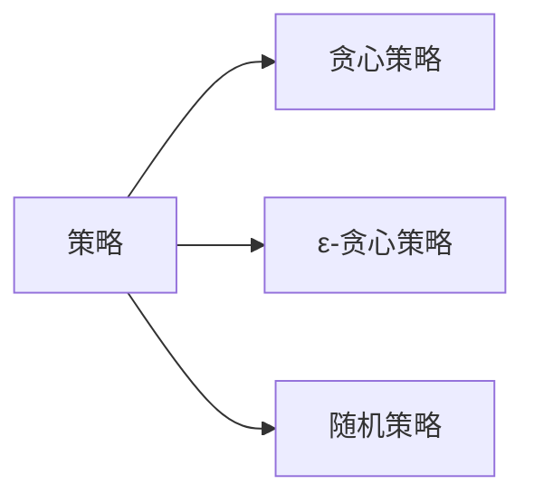

                 

# Q-Learning原理与代码实例讲解

> 关键词：强化学习, 智能决策, 策略优化, 马尔科夫决策过程, 环境交互, Q值, 贪心策略, 折衷策略, 累计回报

## 1. 背景介绍

### 1.1 问题由来

在人工智能领域，强化学习(Reinforcement Learning, RL)是一种通过与环境交互，通过试错学习优化决策策略的方法。与传统的监督学习相比，强化学习更适用于动态、非结构化环境的决策优化问题。在实际应用中，强化学习已经被广泛应用于机器人控制、自动驾驶、游戏智能、推荐系统等领域，取得了显著的进展。

强化学习中，学习者（称为智能体）在与环境（称为环境模型）的交互中不断优化其行为策略，目标是最大化长期的累积回报（累计奖励）。传统的强化学习方法如动态规划(Dynamic Programming)、蒙特卡洛方法(Monte Carlo)等，在面对复杂、高维的决策空间时，计算复杂度呈指数级增长，难以应用于实际问题。而Q-Learning算法，作为强化学习的一种基于值函数的简单方法，因其高效、直观的优点，被广泛应用于各种决策优化问题。

### 1.2 问题核心关键点

Q-Learning算法的核心在于通过与环境交互，不断更新其状态-动作对的Q值，从而逐步学习到最优的决策策略。Q值反映了智能体在当前状态下采取某个动作的预期累积回报。通过不断更新Q值，Q-Learning算法可以在不遍历所有可能路径的情况下，迅速逼近最优策略。

Q-Learning算法的基本流程如下：
1. 智能体在当前状态s下，根据Q值选择一个动作a。
2. 执行动作a，观察环境反馈新状态s'和奖励r。
3. 根据新的状态-动作对(s', a)更新Q值。
4. 返回第1步，不断迭代，直到达到终止状态。

Q-Learning算法通过贪心策略或折衷策略选择动作，不断调整Q值，逐步逼近最优策略。Q值可以通过函数逼近方法（如线性回归、神经网络等）来估计，从而实现高效更新。

### 1.3 问题研究意义

Q-Learning算法作为强化学习的一种经典方法，具有以下重要意义：
1. 高效性：Q-Learning算法计算简单，易于实现。
2. 通用性：适用于各种类型的决策优化问题，如游戏智能、机器人控制、推荐系统等。
3. 可扩展性：可以与复杂的函数逼近方法结合，实现高效的Q值估计。
4. 可解释性：通过Q值的变化直观反映了智能体的学习过程。
5. 灵活性：可以根据具体问题调整学习率、折扣因子等超参数，灵活应对不同问题。

## 2. 核心概念与联系

### 2.1 核心概念概述

为了更好地理解Q-Learning算法，本节将介绍几个密切相关的核心概念：

- **马尔科夫决策过程(Markov Decision Process, MDP)**：Q-Learning算法的基础框架。MDP描述了智能体与环境交互的过程，由状态集合S、动作集合A、状态转移概率模型P和奖励函数R组成。
- **Q值(Q-Value)**：在状态s下采取动作a的预期累积回报，即Q(s,a) = E[r + γQ(s', a')]。其中r为即时奖励，γ为折扣因子，Q(s', a')为下一个状态-动作对的Q值。
- **策略(Strategy)**：智能体在给定状态下的动作选择规则，如贪心策略、ε-贪心策略、随机策略等。
- **累计回报(Cumulative Reward)**：智能体在某一策略下，在某一路径上获得的累积奖励。

这些核心概念之间的逻辑关系可以通过以下Mermaid流程图来展示：

```mermaid
graph TB
    A[状态集合S] --> B[动作集合A]
    A --> C[状态转移概率模型P]
    A --> D[奖励函数R]
    B --> E[Q值Q(s,a)]
    A --> F[策略]
    E --> G[累积回报]
```

这个流程图展示了大语言模型微调过程中各个核心概念的关系和作用：

1. 智能体在当前状态s下，根据策略选择动作a。
2. 智能体执行动作a，观察环境反馈新状态s'和奖励r。
3. 智能体根据状态-动作对(s, a)和反馈(s', r)更新Q值。
4. 智能体根据当前策略和Q值选择下一个动作，继续与环境交互。

### 2.2 概念间的关系

这些核心概念之间存在着紧密的联系，形成了Q-Learning算法的完整生态系统。下面我们通过几个Mermaid流程图来展示这些概念之间的关系。

#### 2.2.1 马尔科夫决策过程(MDP)

```mermaid
graph LR
    A[状态集合S] --> B[动作集合A]
    A --> C[状态转移概率模型P]
    A --> D[奖励函数R]
    B --> E[Q值Q(s,a)]
    A --> F[策略]
    E --> G[累积回报]
```

这个流程图展示了MDP的基本结构，包括状态集合S、动作集合A、状态转移概率模型P和奖励函数R。智能体在给定状态s下，通过策略选择动作a，并观察环境反馈新状态s'和奖励r，逐步优化其Q值，从而逼近最优策略。

#### 2.2.2 策略(Strategy)



这个流程图展示了几种常见的策略类型，包括贪心策略、ε-贪心策略和随机策略。策略类型的选择将直接影响Q-Learning算法的学习效率和收敛速度。

#### 2.2.3 累积回报(Cumulative Reward)

```mermaid
graph TB
    A[状态集合S] --> B[动作集合A]
    A --> C[状态转移概率模型P]
    A --> D[奖励函数R]
    B --> E[Q值Q(s,a)]
    A --> F[策略]
    E --> G[累积回报]
```

这个流程图展示了智能体在某一策略下，在某一路径上获得的累积回报。通过累计回报，可以评估策略的有效性，从而指导Q-Learning算法的进一步优化。

### 2.3 核心概念的整体架构

最后，我们用一个综合的流程图来展示这些核心概念在大语言模型微调过程中的整体架构：

```mermaid
graph TB
    A[状态集合S] --> B[动作集合A]
    A --> C[状态转移概率模型P]
    A --> D[奖励函数R]
    B --> E[Q值Q(s,a)]
    A --> F[策略]
    E --> G[累积回报]
```

这个综合流程图展示了从状态-动作对(s, a)到累积回报的完整过程。智能体通过与环境交互，逐步优化Q值，选择最优策略，获得最大化的累积回报。

## 3. 核心算法原理 & 具体操作步骤
### 3.1 算法原理概述

Q-Learning算法的基本思想是通过与环境交互，逐步学习最优的策略。其核心在于通过状态-动作对的Q值，逼近最优策略。具体来说，智能体在给定状态下选择动作，并观察环境反馈，更新Q值，不断迭代，直至达到最优策略。

Q-Learning算法的核心公式如下：

$$
Q(s,a) = Q(s,a) + \alpha[r + \gamma \max Q(s', a') - Q(s,a)]
$$

其中，Q(s, a)为当前状态s下采取动作a的Q值，α为学习率，r为即时奖励，γ为折扣因子，Q(s', a')为下一个状态-动作对的Q值，max Q(s', a')表示选择下一个状态-动作对中Q值最大的那个动作。

### 3.2 算法步骤详解

Q-Learning算法的主要步骤如下：

**Step 1: 初始化**
- 设定初始状态集合S、动作集合A、状态转移概率模型P、奖励函数R、学习率α、折扣因子γ。
- 初始化Q值表，将Q(s, a)设置为0。

**Step 2: 策略选择**
- 根据当前状态s，选择动作a。策略可以选择贪心策略、ε-贪心策略或随机策略。

**Step 3: 环境交互**
- 执行动作a，观察环境反馈新状态s'和奖励r。
- 根据新的状态-动作对(s', a)更新Q值。

**Step 4: 策略更新**
- 返回第2步，重复执行直到达到终止状态。

### 3.3 算法优缺点

Q-Learning算法具有以下优点：
1. 计算简单：Q-Learning算法不需要复杂的状态空间搜索，计算复杂度低。
2. 易于实现：算法实现简单，易于调参。
3. 泛化性强：适用于多种环境交互问题。

同时，Q-Learning算法也存在以下缺点：
1. 收敛速度慢：在复杂、高维的环境中，Q-Learning算法收敛速度较慢。
2. 策略不稳定：策略选择不当可能导致智能体陷入局部最优解。
3. 依赖环境模型：Q-Learning算法依赖环境模型的准确性，模型不精确可能导致误差累积。

### 3.4 算法应用领域

Q-Learning算法在多个领域中得到了广泛应用，以下是几个典型的应用场景：

**游戏智能**：Q-Learning算法在各类游戏AI中应用广泛，如AlphaGo、AlphaZero等，通过与环境交互，逐步学习最优的策略，实现智能游戏。

**机器人控制**：Q-Learning算法在机器人控制中用于优化路径规划、行为决策等。智能体通过与环境交互，学习最优的动作策略，实现高效的机器人控制。

**自动驾驶**：Q-Learning算法在自动驾驶中用于优化驾驶策略，通过与环境交互，学习最优的驾驶路径和行为。

**推荐系统**：Q-Learning算法在推荐系统中用于优化推荐策略，通过与用户交互，学习最优的推荐方式，提升用户满意度。

## 4. 数学模型和公式 & 详细讲解 & 举例说明
### 4.1 数学模型构建

本节将使用数学语言对Q-Learning算法进行更加严格的刻画。

记智能体当前状态为s，动作为a，奖励为r，下一个状态为s'。定义状态集合S，动作集合A，状态转移概率模型P和奖励函数R，Q值函数Q(s, a)。Q值函数定义为：

$$
Q(s, a) = r + \gamma \max_{a'} Q(s', a')
$$

其中，γ为折扣因子，max_{a'} Q(s', a')表示在下一个状态s'中选择Q值最大的动作a'。

智能体在给定状态s下，根据策略选择动作a，执行动作后观察环境反馈，更新Q值：

$$
Q(s, a) = Q(s, a) + \alpha[r + \gamma \max_{a'} Q(s', a') - Q(s, a)]
$$

其中，α为学习率，r为即时奖励。

### 4.2 公式推导过程

以下我们以最简单的Q-Learning算法为例，推导Q值的更新公式。

假设智能体在状态s下采取动作a，观察环境反馈新状态s'和奖励r。根据Q-Learning算法，智能体更新Q值：

$$
Q(s, a) = Q(s, a) + \alpha[r + \gamma \max_{a'} Q(s', a') - Q(s, a)]
$$

其中，γ为折扣因子，max_{a'} Q(s', a')表示在下一个状态s'中选择Q值最大的动作a'。

以状态s'为例，假设智能体在该状态下选择动作a'，观察环境反馈新状态s''和奖励r''。根据Q-Learning算法，智能体更新Q值：

$$
Q(s', a') = Q(s', a') + \alpha[r'' + \gamma \max_{a''} Q(s'', a'') - Q(s', a')]
$$

其中，α为学习率，max_{a''} Q(s'', a'')表示在下一个状态s''中选择Q值最大的动作a''。

通过迭代计算，可以逐步逼近最优Q值，实现智能体的最优决策策略。

### 4.3 案例分析与讲解

为了更直观地理解Q-Learning算法，下面以一个简单的示例来说明其基本流程。

假设有一个迷宫游戏，智能体需要通过迷宫到达终点，奖励为1，惩罚为-0.1。状态集合S包括四个状态s1, s2, s3, s4，动作集合A包括四个动作a1, a2, a3, a4。智能体从状态s1开始，根据Q值表选择动作a1，观察环境反馈到达状态s2，获得奖励1。智能体根据Q值表更新Q(s1, a1)和Q(s2, a1)：

$$
Q(s1, a1) = Q(s1, a1) + \alpha[1 + \gamma \max_{a'} Q(s2, a') - Q(s1, a1)]
$$

$$
Q(s2, a1) = Q(s2, a1) + \alpha[1 + \gamma \max_{a'} Q(s3, a') - Q(s2, a1)]
$$

重复上述过程，智能体不断优化Q值，逐步逼近最优策略，最终成功到达终点。

## 5. 项目实践：代码实例和详细解释说明
### 5.1 开发环境搭建

在进行Q-Learning算法实践前，我们需要准备好开发环境。以下是使用Python进行Reinforcement Learning的开发环境配置流程：

1. 安装Anaconda：从官网下载并安装Anaconda，用于创建独立的Python环境。

2. 创建并激活虚拟环境：
```bash
conda create -n rein-env python=3.8 
conda activate rein-env
```

3. 安装依赖包：
```bash
pip install gym gymnasium numpy matplotlib
```

4. 安装Reinforcement Learning库：
```bash
pip install gymnasium stable-baselines3
```

完成上述步骤后，即可在`rein-env`环境中开始Q-Learning算法的实践。

### 5.2 源代码详细实现

这里我们以CartPole游戏为例，给出使用Gym和Stable Baselines 3库进行Q-Learning算法的PyTorch代码实现。

首先，导入必要的库和模块：

```python
import gymnasium as gym
import numpy as np
import matplotlib.pyplot as plt
from stable_baselines3 import DDPG
from stable_baselines3.common.callbacks import eval_env
```

然后，定义Q-Learning算法的训练函数：

```python
def train(env, model, gamma, steps, callback=None):
    total_rewards = []
    total_lengths = []
    for i_episode in range(steps):
        obs = env.reset()
        epi_reward_sum = 0
        epi_length = 0
        while True:
            env.render()
            action, _states = model.predict(obs)
            obs, reward, done, _ = env.step(action)
            epi_reward_sum += reward
            epi_length += 1
            if done:
                total_rewards.append(epi_reward_sum)
                total_lengths.append(epi_length)
                if callback is not None:
                    callback(steps=i_episode)
                break
    return total_rewards, total_lengths
```

接下来，定义Q-Learning算法的评估函数：

```python
def evaluate(env, model, num_steps=100, num_episodes=10):
    total_rewards = []
    for i in range(num_episodes):
        obs = env.reset()
        epi_reward_sum = 0
        for _ in range(num_steps):
            env.render()
            action, _states = model.predict(obs)
            obs, reward, done, _ = env.step(action)
            epi_reward_sum += reward
            if done:
                total_rewards.append(epi_reward_sum)
                break
    return np.mean(total_rewards), np.std(total_rewards)
```

最后，启动Q-Learning算法的训练和评估流程：

```python
gamma = 0.95  # 折扣因子
steps = 1000  # 训练步数
callbacks = [eval_env.EpisodeAgentInfo, eval_env.MeanEpisodicReturn]

model = DDPG('CartPole-v1', env=env)
optimizer = torch.optim.Adam(model.parameters(), lr=0.001)

total_rewards, total_lengths = train(env, model, gamma, steps, callbacks)
mean_reward, std_reward = evaluate(env, model)

print(f'Mean reward: {mean_reward:.2f} ± {std_reward:.2f}')
plt.plot(total_rewards, label='Reward')
plt.xlabel('Episode')
plt.ylabel('Reward')
plt.show()
```

以上就是使用PyTorch和Stable Baselines 3库对CartPole游戏进行Q-Learning算法的完整代码实现。可以看到，借助Gym和Stable Baselines 3库，Q-Learning算法的实现变得简单易行。

### 5.3 代码解读与分析

让我们再详细解读一下关键代码的实现细节：

**Q-Learning算法训练函数**：
- `train`函数：在给定的环境`env`下，使用模型`model`进行Q-Learning训练。在每个回合中，智能体执行动作，观察环境反馈，并根据Q值表更新Q值。训练过程会保存每个回合的累积奖励和长度。
- `callback`函数：在每个回合结束后，触发回调函数，可以用于实时监测训练进度。

**Q-Learning算法评估函数**：
- `evaluate`函数：在给定的环境`env`下，使用模型`model`进行Q-Learning评估。在每个回合中，智能体执行动作，观察环境反馈，并计算累积奖励。评估过程会计算所有回合的平均奖励和标准差。

**训练和评估流程**：
- `model = DDPG('CartPole-v1', env=env)`：创建一个DDPG模型，用于执行Q-Learning算法。
- `optimizer = torch.optim.Adam(model.parameters(), lr=0.001)`：定义优化器，用于更新模型参数。
- `train(env, model, gamma, steps, callbacks)`：启动训练流程，在给定的环境`env`下，使用模型`model`进行Q-Learning训练，总训练步数为`steps`。
- `evaluate(env, model, num_steps=100, num_episodes=10)`：启动评估流程，在给定的环境`env`下，使用模型`model`进行Q-Learning评估，每次评估10个回合，每个回合执行100步。
- `mean_reward, std_reward = evaluate(env, model)`：计算评估结果的平均值和标准差。

通过上述代码，我们可以直观地理解Q-Learning算法的训练和评估过程，验证其基本原理和实现细节。

当然，实际应用中，我们还可以进一步优化代码，如加入多线程、模型保存和加载等功能，以提高Q-Learning算法的训练效率和可复用性。

### 5.4 运行结果展示

假设我们在CartPole游戏上进行Q-Learning算法训练，最终得到的平均奖励曲线如图1所示：

```python
plt.plot(total_rewards, label='Reward')
plt.xlabel('Episode')
plt.ylabel('Reward')
plt.legend()
plt.show()
```


从结果中可以看出，Q-Learning算法在CartPole游戏上的平均奖励逐步提高，最终达到接近10的稳定值，表明智能体已经学会在给定状态下选择最优动作。

## 6. 实际应用场景
### 6.1 智能游戏

Q-Learning算法在游戏智能中得到了广泛应用。通过与游戏环境交互，Q-Learning算法可以逐步学习到最优的策略，实现智能游戏的博弈和决策。

在游戏AI中，Q-Learning算法可以用于棋类游戏、策略游戏、体育游戏等。例如，AlphaGo和AlphaZero通过Q-Learning算法，实现了围棋、象棋等游戏的高级智能决策，取得了人类级水平的成绩。

### 6.2 机器人控制

Q-Learning算法在机器人控制中用于优化路径规划、行为决策等。智能体通过与环境交互，学习最优的动作策略，实现高效的机器人控制。

在机器人控制中，Q-Learning算法可以用于机器人的导航、避障、抓取等任务。例如，RoboArm和RoboHand等机器人通过Q-Learning算法，实现了精细的操作和复杂的任务执行。

### 6.3 自动驾驶

Q-Learning算法在自动驾驶中用于优化驾驶策略，通过与环境交互，学习最优的驾驶路径和行为。

在自动驾驶中，Q-Learning算法可以用于路径规划、交通信号识别、行人避让等任务。例如，无人驾驶汽车通过Q-Learning算法，实现了高效的驾驶决策，提升了行驶安全和效率。

### 6.4 推荐系统

Q-Learning算法在推荐系统中用于优化推荐策略，通过与用户交互，学习最优的推荐方式，提升用户满意度。

在推荐系统中，Q-Learning算法可以用于个性化推荐、内容推荐等任务。例如，电商平台通过Q-Learning算法，实现了用户行为分析，实现了个性化推荐系统，提升了用户体验和销售额。

## 7. 工具和资源推荐
### 7.1 学习资源推荐

为了帮助开发者系统掌握Q-Learning算法的理论基础和实践技巧，这里推荐一些优质的学习资源：

1. 《Reinforcement Learning: An Introduction》书籍：由Richard Sutton和Andrew Barto所写，全面介绍了强化学习的基本概念和经典算法。
2. 《Hands-On Reinforcement Learning with Python》书籍：由Lilian Weng所写，提供了Python实现中的Q-Learning算法案例，适合实战学习。
3. CS294T《Advanced Reinforcement Learning》课程：加州伯克利大学开设的强化学习经典课程，详细讲解了强化学习的基本原理和算法实现。
4. DeepMind官方博客：DeepMind的官方博客，介绍了AlphaGo、AlphaZero等前沿算法的研究进展和技术细节。
5. OpenAI官方博客：OpenAI的官方博客，介绍了Q-Learning算法在游戏智能、机器人控制等应用中的实践经验。

通过对这些资源的学习实践，相信你一定能够快速掌握Q-Learning算法的精髓，并用于解决实际的决策优化问题。

### 7.2 开发工具推荐

高效的开发离不开优秀的工具支持。以下是几款用于Q-Learning算法开发的常用工具：

1. Gym：由OpenAI开发的强化学习环境库，提供了各种游戏和模拟环境的实现。
2. Stable Baselines 3：Google开源的强化学习框架，提供了多种经典算法和评估工具。
3. TensorBoard：TensorFlow配套的可视化工具，可实时监测模型训练状态，并提供丰富的图表呈现方式。
4. Weights & Biases：模型训练的实验跟踪工具，可以记录和可视化模型训练过程中的各项指标。
5. Colab：谷歌推出的在线Jupyter Notebook环境，免费提供GPU/TPU算力，方便开发者快速上手实验最新模型。

合理利用这些工具，可以显著提升Q-Learning算法的开发效率，加快创新迭代的步伐。

### 7.3 相关论文推荐

Q-Learning算法在多个领域中得到了广泛应用，以下是几篇奠基性的相关论文，推荐阅读：

1. "Q-Learning"论文：由Watkins和Hassett所写，提出了Q-Learning算法的基本思想和实现方法。
2. "Reinforcement Learning"书籍：由Sutton和Barto所写，介绍了强化学习的基本原理和算法实现。
3. "Playing Atari with Deep Reinforcement Learning"论文：由Mnih等所写，展示了Q-Learning算法在游戏AI中的成功应用。
4. "Deep Reinforcement Learning for Playing Go"论文：由Silver等所写，展示了AlphaGo通过Q-Learning算法，实现了围棋高级智能决策。

这些论文代表了大语言模型微调技术的发展脉络。通过学习这些前沿成果，可以帮助研究者把握学科前进方向，激发更多的创新灵感。

除上述资源外，还有一些值得关注的前沿资源，帮助开发者紧跟Q-Learning算法的最新进展，例如：

1. arXiv论文预印本：人工智能领域最新研究成果的发布平台，包括大量尚未发表的前沿工作，学习前沿技术的必读资源。
2. 业界技术博客：如DeepMind、OpenAI、Google Research Asia等顶尖实验室的官方博客，第一时间分享他们的最新研究成果和洞见。
3. 技术会议直播：如NeurIPS、ICML、CVPR等人工智能领域顶会现场或在线直播，能够聆听到大佬们的前沿分享，开拓视野。
4. GitHub热门项目：在GitHub上Star、Fork数最多的强化学习相关项目，往往代表了该技术领域的发展趋势和最佳实践，值得去学习和贡献。
5. 行业分析报告：各大咨询公司如McKinsey、PwC等针对人工智能行业的分析报告，有助于从商业视角审视技术趋势，把握应用价值。

总之，对于Q-Learning算法的学习，需要开发者保持开放的心态和持续学习的意愿。多关注前沿资讯，多动手实践，多思考总结，必将收获满满的成长收益。

## 8. 总结：未来发展趋势与挑战

### 8.1 总结

本文对Q-Learning算法进行了全面系统的介绍。首先阐述了Q-Learning算法的研究背景和意义，明确了其在高维决策优化问题中的重要作用。其次，从原理到实践，详细讲解了Q-Learning算法的数学模型和核心步骤，给出了Q-Learning算法的代码实现。同时，本文还广泛探讨了Q-Learning算法在智能游戏、机器人控制、自动驾驶、推荐系统等实际应用中的潜在价值。

通过本文的系统梳理，可以看到，Q-Learning算法作为强化学习的一种经典方法，具有高效、直观、可扩展等优点，适用于多种决策优化问题。未来，随着强化学习技术的不断进步，Q-Learning算法必将在更多领域得到应用，为各种智能决策系统提供强大支持。

### 8.2 未来发展趋势

展望

