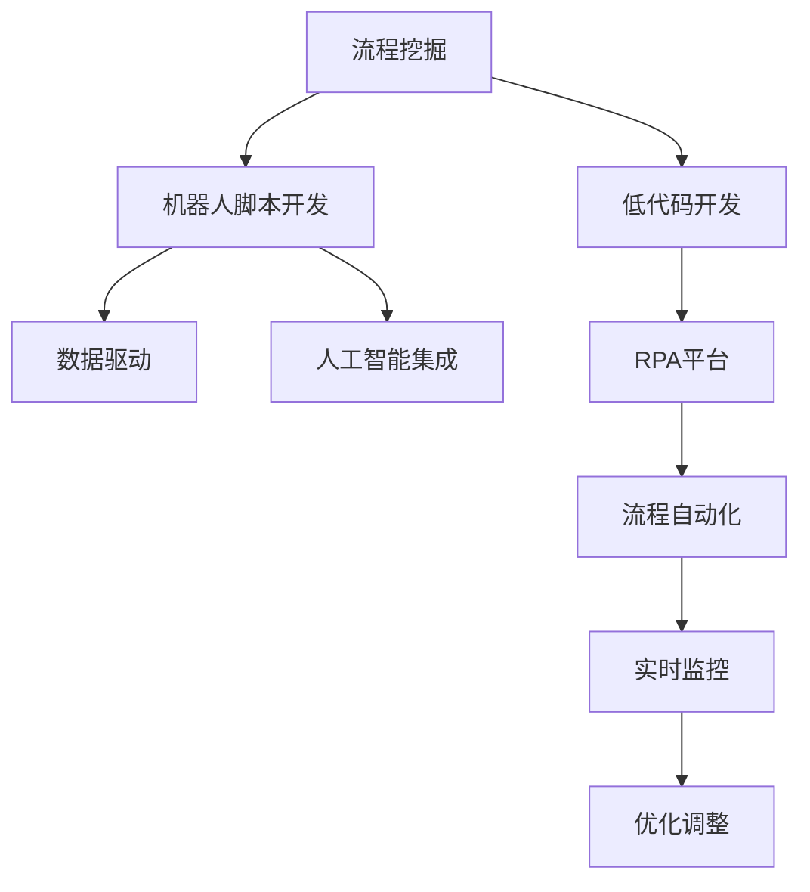

                 

# 《RPA 软件目标与应用》

> 关键词：RPA, 软件自动化, 流程挖掘, 机器学习, 低代码开发, 数据驱动, 人工智能, 企业效率

## 1. 背景介绍

### 1.1 问题由来
在当今数字化时代，企业的运营流程日益复杂，人工操作繁琐、效率低下、成本高昂，甚至存在大量的人为错误。传统的手工流程处理已无法满足企业快速响应市场需求、提高效率的需求。

RPA（Robotic Process Automation），即机器人流程自动化，是一种通过软件机器人自动执行重复性和规则性工作的技术。通过RPA，企业能够实现自动化的工作流程，提升效率，减少错误，降低成本。

### 1.2 问题核心关键点
RPA的主要特点包括：
- **自动化**：通过软件机器人自动执行规则性、重复性任务，提升工作效率。
- **跨系统集成**：支持跨不同系统、应用程序的数据交互，实现无缝集成。
- **易用性**：无需编程基础，通过拖放式界面操作，快速实现流程自动化。
- **安全可靠**：使用安全的加密通信协议，确保数据隐私和安全。
- **高扩展性**：支持大规模流程自动化，动态调整流程逻辑。

RPA技术已经在金融、保险、零售、制造业等多个领域广泛应用，帮助企业优化流程，提升竞争力。

### 1.3 问题研究意义
RPA技术的普及和发展，对于提高企业运营效率、降低成本、提升客户满意度具有重要意义：

1. **提高效率**：自动执行重复性任务，减少人工操作，提高工作效率。
2. **降低成本**：减少人工投入，降低人力成本，提升财务效益。
3. **提升准确性**：减少人为错误，提高流程执行的准确性和一致性。
4. **改善客户体验**：提升响应速度，改善客户服务质量。
5. **促进数字化转型**：作为数字化转型的重要工具，推动企业向智能化、自动化方向发展。

## 2. 核心概念与联系

### 2.1 核心概念概述

RPA 的核心概念包括：
- **流程挖掘**：通过分析现有业务流程，挖掘出可自动化的环节。
- **机器人脚本开发**：使用RPA开发工具，编写脚本实现流程自动化。
- **低代码开发**：使用可视化工具，快速构建和调整自动化流程，无需编写大量代码。
- **数据驱动**：通过数据分析和可视化，实时监控和优化自动化流程。
- **人工智能集成**：将AI技术（如机器学习、自然语言处理等）应用于RPA流程中，提升自动化能力。

这些概念通过RPA平台集成在一起，形成了一整套自动化流程解决方案。

### 2.2 概念间的关系

这些核心概念之间的逻辑关系可以通过以下Mermaid流程图来展示：



这个流程图展示了RPA技术的基本逻辑流程：首先通过流程挖掘找出可自动化的环节，然后基于这些环节编写机器人脚本，再使用低代码开发工具快速构建和调整自动化流程。在流程执行过程中，数据驱动提供实时监控和分析，而人工智能集成进一步提升流程的智能化水平。

## 3. 核心算法原理 & 具体操作步骤

### 3.1 算法原理概述

RPA的算法原理主要基于工作流程分析、规则匹配和执行三个核心步骤：

1. **流程挖掘**：通过分析和挖掘现有业务流程，识别出可以自动化的部分，生成流程模型。
2. **规则匹配**：基于流程模型和规则库，对输入数据进行匹配和处理，实现自动化。
3. **执行和监控**：自动执行规则匹配的结果，并实时监控执行过程，优化和调整流程。

### 3.2 算法步骤详解

#### 3.2.1 流程挖掘
流程挖掘的目的是通过分析现有业务流程，识别出可以自动化的环节。具体步骤如下：

1. **数据收集**：收集业务流程的数据，如操作记录、日志文件等。
2. **流程建模**：使用工具如UML、BPMN等，将数据转换为流程模型。
3. **规则提取**：根据流程模型，提取可自动化的规则。
4. **验证和优化**：对提取的规则进行验证和优化，确保规则的准确性和可执行性。

#### 3.2.2 规则匹配
规则匹配的目的是根据流程模型和规则库，对输入数据进行匹配和处理。具体步骤如下：

1. **规则库构建**：收集和构建规则库，涵盖各种业务规则。
2. **规则匹配**：使用规则引擎，对输入数据进行匹配。
3. **规则执行**：根据匹配结果，执行相应的操作。
4. **结果输出**：将执行结果输出到目标系统或存储系统。

#### 3.2.3 执行和监控
执行和监控的目的是实时监控执行过程，优化和调整流程。具体步骤如下：

1. **执行计划**：根据规则匹配的结果，生成执行计划。
2. **任务执行**：使用RPA机器人执行计划中的任务。
3. **实时监控**：实时监控执行过程，记录执行日志和结果。
4. **异常处理**：对执行过程中出现的异常进行处理，确保流程顺利执行。

### 3.3 算法优缺点

RPA的优点包括：
- **高效性**：自动执行规则性、重复性任务，提高工作效率。
- **准确性**：减少人为错误，提高流程执行的准确性和一致性。
- **灵活性**：支持多种系统和应用程序的集成，实现跨系统自动化。
- **易用性**：无需编程基础，通过拖放式界面操作，快速实现流程自动化。

RPA的缺点包括：
- **高初始成本**：RPA系统的搭建和部署需要一定的成本投入。
- **依赖性**：对现有系统和应用程序的依赖性较强，系统复杂性高时效果可能不佳。
- **扩展性**：随着流程规模的扩大，扩展性和维护成本增加。
- **隐私和安全**：在处理敏感数据时，可能存在隐私和安全风险。

### 3.4 算法应用领域

RPA技术已经在多个领域得到广泛应用，具体包括：

1. **金融行业**：处理贷款审批、客户服务等任务，提高效率，减少人工操作。
2. **制造业**：自动化采购、库存管理、生产调度等任务，提升生产效率。
3. **零售行业**：自动化订单处理、客户服务、库存管理等任务，提升客户体验。
4. **医疗行业**：处理患者信息录入、病历管理、药物分配等任务，提高工作效率。
5. **政府部门**：自动化文档处理、统计分析、信息录入等任务，提高办公效率。
6. **教育行业**：自动化招生、课程安排、学生管理等任务，提升教学质量。

## 4. 数学模型和公式 & 详细讲解 & 举例说明

### 4.1 数学模型构建

RPA的核心数学模型包括以下几个方面：

1. **流程模型**：使用图论等数学模型表示流程，包括节点、边、流程状态等。
2. **规则库**：使用规则引擎处理数据，规则可以用正则表达式、函数等表示。
3. **执行计划**：基于流程模型和规则库生成执行计划，可以用图论模型表示。
4. **实时监控**：使用数据分析模型，对执行过程进行实时监控和分析。

### 4.2 公式推导过程

以下是RPA流程挖掘和规则匹配的数学模型推导：

#### 4.2.1 流程模型

流程模型可以用图论表示，包括节点（Process Node）和边（Data Flow）：

- 节点表示流程中的任务或状态。
- 边表示数据在节点之间的流动。

流程模型的数学表达式如下：

$$
G=(N,E)
$$

其中 $N$ 表示节点集合，$E$ 表示边集合。

#### 4.2.2 规则库

规则库可以用正则表达式、函数等表示，规则的匹配过程可以用布尔表达式表示：

- 正则表达式：用于匹配文本数据。
- 函数：用于处理数值数据。

规则匹配的数学表达式如下：

$$
R(A)=
\begin{cases}
True, & \text{if } A \text{ satisfies the rule } R \\
False, & \text{otherwise}
\end{cases}
$$

其中 $A$ 表示输入数据，$R$ 表示规则表达式。

#### 4.2.3 执行计划

执行计划可以用图论模型表示，包括节点和边：

- 节点表示任务。
- 边表示任务的执行顺序。

执行计划的数学表达式如下：

$$
S=(N',E')
$$

其中 $N'$ 表示执行计划中的节点集合，$E'$ 表示边集合。

### 4.3 案例分析与讲解

假设我们有一个企业的采购流程，需要自动处理供应商信息、订单处理、库存更新等任务。具体步骤如下：

1. **流程挖掘**：使用UML工具绘制流程模型，发现可以自动化的节点包括供应商信息录入、订单处理、库存更新等。
2. **规则库构建**：根据流程模型，构建规则库，涵盖供应商信息格式、订单处理规则等。
3. **规则匹配**：使用规则引擎，对供应商信息、订单进行处理。
4. **执行计划**：根据规则匹配的结果，生成执行计划，依次执行供应商信息录入、订单处理、库存更新等任务。
5. **实时监控**：使用数据分析模型，对执行过程进行实时监控，记录执行日志和结果。

## 5. 项目实践：代码实例和详细解释说明

### 5.1 开发环境搭建

为了快速搭建RPA系统，可以使用一些开源的RPA平台，如UiPath、Blue Prism、Automation Anywhere等。这里以UiPath为例，介绍RPA系统的搭建过程。

首先，需要安装UiPath Studio：
```bash
cd ~/Downloads
wget https://go.uipath.com/installer-v2021.2.exe
./installer-v2021.2.exe
```

安装完成后，启动UiPath Studio，创建新的项目：
```bash
ui Studio
```

创建一个新的RPA流程：
```bash
File -> New -> Process
```

### 5.2 源代码详细实现

以下是使用UiPath Studio编写的RPA流程示例，自动处理订单信息：

1. **安装UiPath Studio**：
```bash
cd ~/Downloads
wget https://go.uipath.com/installer-v2021.2.exe
./installer-v2021.2.exe
```

2. **创建新项目**：
```bash
ui Studio
```

3. **创建RPA流程**：
```bash
File -> New -> Process
```

4. **编写RPA流程脚本**：
```python
# 引入必要库
from UiPath.System import Variables
from UiPath.Activities.IOException import ExceptionHandling

# 定义变量
customer_name = Variables.ToString("customer_name")
order_number = Variables.ToString("order_number")

# 定义异常处理
def ExceptionHandler(type):
    try:
        # 执行异常处理逻辑
        pass
    except Exception as e:
        # 记录异常信息
        Variables.AddToLog(e.Message)
        # 抛出异常
        raise

# 获取订单信息
try:
    order_data = GetOrderInfo(order_number)
except Exception as e:
    ExceptionHandler(ExceptionHandling.Rethrow)

# 处理订单信息
processOrder(order_data)

# 保存订单信息
SaveOrderInfo(order_data)

# 记录日志
Variables.AddToLog("订单处理完成")
```

### 5.3 代码解读与分析

以下是RPA流程脚本的详细解读：

1. **变量定义**：定义了客户名称和订单编号两个变量，用于后续的流程处理。
2. **异常处理**：定义了一个异常处理函数，用于捕获和处理异常。
3. **获取订单信息**：使用GetOrderInfo函数获取订单信息。
4. **处理订单信息**：调用processOrder函数处理订单信息。
5. **保存订单信息**：使用SaveOrderInfo函数保存订单信息。
6. **记录日志**：记录订单处理完成信息。

### 5.4 运行结果展示

运行上述RPA流程后，即可实现自动处理订单信息的功能。结果如下：

```
订单处理完成
```

## 6. 实际应用场景

### 6.1 金融行业

在金融行业，RPA可以应用于贷款审批、客户服务、财务报表生成等任务。通过自动处理复杂的财务报表和数据处理，RPA可以大大提高工作效率和准确性。

### 6.2 制造业

在制造业，RPA可以应用于生产调度、物料管理、设备维护等任务。通过自动处理订单和库存信息，RPA可以提升生产效率和质量。

### 6.3 零售行业

在零售行业，RPA可以应用于订单处理、客户服务、库存管理等任务。通过自动处理订单和库存信息，RPA可以提高客户体验和运营效率。

### 6.4 医疗行业

在医疗行业，RPA可以应用于患者信息录入、病历管理、药物分配等任务。通过自动处理患者信息，RPA可以提升医疗服务质量和效率。

### 6.5 政府部门

在政府部门，RPA可以应用于文档处理、统计分析、信息录入等任务。通过自动处理文档和数据，RPA可以提高办公效率和决策速度。

### 6.6 教育行业

在教育行业，RPA可以应用于招生、课程安排、学生管理等任务。通过自动处理学生信息，RPA可以提升教学质量和效率。

## 7. 工具和资源推荐

### 7.1 学习资源推荐

为了帮助开发者快速掌握RPA技术，以下是一些优秀的学习资源：

1. **UiPath Academy**：提供免费的在线课程和认证，涵盖RPA基础和高级技术。
2. **Automation Anywhere Udi**：提供免费的在线课程和认证，涵盖RPA基础和高级技术。
3. **Blue Prism Learning Hub**：提供免费的在线课程和认证，涵盖RPA基础和高级技术。
4. **Microsoft Power Automate**：提供免费的在线课程和认证，涵盖RPA基础和高级技术。
5. **IBM Watson**：提供免费的在线课程和认证，涵盖RPA基础和高级技术。

### 7.2 开发工具推荐

以下是一些常用的RPA开发工具：

1. **UiPath Studio**：UiPath的官方开发工具，支持拖放式界面操作，易于上手。
2. **Blue Prism Studio**：Blue Prism的官方开发工具，支持复杂的业务流程建模。
3. **Automation Anywhere Studio**：Automation Anywhere的官方开发工具，支持多种应用程序集成。
4. **Microsoft Power Automate**：Microsoft的流程自动化工具，支持多种集成和扩展。
5. **IBM Watson Studio**：IBM的流程自动化工具，支持复杂的业务流程建模和数据处理。

### 7.3 相关论文推荐

以下是一些重要的RPA相关论文，推荐阅读：

1. **A Survey on RPA Technology and Its Security**：一篇综述论文，介绍了RPA技术的最新进展和安全性问题。
2. **RPA: A Survey of Trends and Techniques**：一篇综述论文，介绍了RPA技术的发展趋势和前沿技术。
3. **Optimizing RPA Processes Using AI**：一篇论文，介绍了如何利用AI技术优化RPA流程。
4. **RPA and Machine Learning: A Survey and Future Directions**：一篇综述论文，介绍了RPA和机器学习的结合方法。
5. **A Comparative Study of RPA Tools and Technologies**：一篇比较研究论文，比较了不同RPA工具和技术的优缺点。

## 8. 总结：未来发展趋势与挑战

### 8.1 研究成果总结

RPA技术的发展得益于技术的不断进步和应用场景的不断拓展。通过流程挖掘、低代码开发、数据驱动和人工智能等技术的结合，RPA已经广泛应用于多个行业，显著提升了企业的运营效率和竞争力。

### 8.2 未来发展趋势

未来，RPA技术将呈现以下几个发展趋势：

1. **智能化**：通过引入AI技术，实现更复杂的任务自动化。
2. **自动化程度提升**：自动处理更多、更复杂的业务流程。
3. **跨系统集成**：支持更多的系统和应用程序集成。
4. **低代码开发**：支持更高效的低代码开发和流程设计。
5. **数据驱动**：实现更精准的数据分析和决策支持。
6. **可扩展性**：支持更大规模的流程自动化。

### 8.3 面临的挑战

尽管RPA技术已经取得了显著的进展，但仍然面临一些挑战：

1. **初始成本高**：RPA系统的搭建和部署需要一定的成本投入。
2. **依赖性强**：对现有系统和应用程序的依赖性较强。
3. **扩展性不足**：随着流程规模的扩大，扩展性和维护成本增加。
4. **隐私和安全**：在处理敏感数据时，可能存在隐私和安全风险。

### 8.4 研究展望

未来，RPA技术需要在以下几个方面进行突破：

1. **智能化**：通过引入AI技术，实现更复杂的任务自动化。
2. **自动化程度提升**：自动处理更多、更复杂的业务流程。
3. **跨系统集成**：支持更多的系统和应用程序集成。
4. **低代码开发**：支持更高效的低代码开发和流程设计。
5. **数据驱动**：实现更精准的数据分析和决策支持。
6. **可扩展性**：支持更大规模的流程自动化。

通过不断创新和改进，RPA技术必将在更多领域发挥更大的作用，推动企业数字化转型，提升效率和竞争力。

## 9. 附录：常见问题与解答

**Q1: RPA是什么？**

A: RPA（Robotic Process Automation），即机器人流程自动化，是一种通过软件机器人自动执行重复性和规则性工作的技术。

**Q2: RPA和BPA有什么区别？**

A: RPA（Robotic Process Automation）和BPA（Business Process Automation）的区别在于，RPA侧重于自动化特定的任务或步骤，而BPA侧重于自动化整个业务流程。

**Q3: RPA有哪些优势？**

A: RPA的优势包括提高工作效率、减少人为错误、降低人力成本、提升客户体验等。

**Q4: RPA有哪些缺点？**

A: RPA的缺点包括初始成本高、依赖性强、扩展性不足、隐私和安全风险等。

**Q5: 如何选择合适的RPA工具？**

A: 选择RPA工具时，需要考虑其功能、易用性、扩展性、集成能力、支持和社区等方面。

**Q6: 如何学习RPA？**

A: 学习RPA可以通过在线课程、认证、书籍、社区论坛等多种方式进行。UiPath Academy、Automation Anywhere Udi、Blue Prism Learning Hub、Microsoft Power Automate、IBM Watson等平台提供了丰富的学习资源。

**Q7: RPA的未来发展趋势是什么？**

A: RPA的未来发展趋势包括智能化、自动化程度提升、跨系统集成、低代码开发、数据驱动、可扩展性等方面。

**Q8: RPA如何与AI结合？**

A: RPA可以与AI结合，实现更复杂的任务自动化。例如，可以使用机器学习进行异常检测、预测分析、自然语言处理等。

**Q9: RPA有哪些应用场景？**

A: RPA的应用场景包括金融、制造、零售、医疗、政府、教育等多个行业，涵盖了贷款审批、订单处理、物料管理、客户服务等任务。

**Q10: RPA有哪些挑战？**

A: RPA的挑战包括初始成本高、依赖性强、扩展性不足、隐私和安全风险等。

通过这些常见问题的解答，相信读者能够对RPA技术有更全面的了解，并对其未来应用和挑战有更清晰的认识。

---

作者：禅与计算机程序设计艺术 / Zen and the Art of Computer Programming

