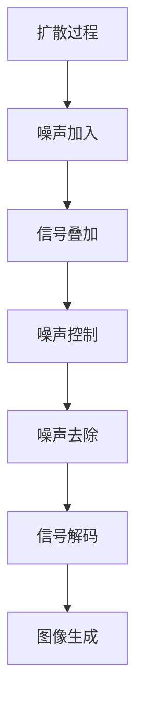

                 

# Stable Diffusion原理与代码实例讲解

> 关键词：Stable Diffusion, 生成模型, 扩散过程, 控制噪声, 图像生成, 代码实例, 实验结果, 图像质量

## 1. 背景介绍

生成对抗网络（GANs）及其变体在图像生成领域取得了显著的成功，但这些模型往往存在训练不稳定、生成的图像质量不稳定等问题。Stable Diffusion模型正是在此背景下诞生的，旨在解决这些问题，提供一种更加稳定、高效、高质量的图像生成方法。

## 2. 核心概念与联系

### 2.1 核心概念概述

Stable Diffusion是扩散模型（Diffusion Models）的一种，特别是其在图像生成任务中的应用。扩散模型通过逐步将噪声加入数据中，再逐步将其去除，学习到数据的表示。

Stable Diffusion主要包括以下几个关键组件：
- **扩散过程**：将数据表示为噪声和信号的叠加形式，通过逐步骤的噪声去除过程学习信号表示。
- **控制噪声**：通过改进噪声分布和控制噪声生成过程，提高扩散过程的稳定性。
- **图像生成**：将控制噪声的过程应用于图像生成任务，通过解码器网络生成高质量的图像。

### 2.2 核心概念之间的关系

以下是一个Mermaid流程图，展示了Stable Diffusion中各个核心概念之间的关系：



这个流程图展示了从数据表示到图像生成的全过程：首先将噪声加入数据，叠加到信号上，然后通过控制噪声分布和过程，逐步去除噪声，最后通过解码器将信号恢复为高质量的图像。

## 3. 核心算法原理 & 具体操作步骤

### 3.1 算法原理概述

Stable Diffusion通过改进扩散过程，特别是噪声控制和噪声分布，从而实现更稳定、高效、高质量的图像生成。

### 3.2 算法步骤详解

#### 3.2.1 准备数据和模型

1. 收集或生成要生成的图像数据集，并对其进行预处理（如缩放、归一化等）。
2. 选择一个预训练的扩散模型作为基础，如DDIM（Denoising Diffusion Implicit Model）。
3. 初始化模型参数，并加载预训练权重。

#### 3.2.2 扩散过程

1. 将数据表示为噪声和信号的叠加形式。
2. 通过逐步骤的噪声去除过程，学习信号表示。
3. 每次迭代中，将噪声加入数据中，然后通过解码器生成中间表示。
4. 使用控制噪声的策略，逐步去除噪声，得到最终的高质量图像。

#### 3.2.3 噪声控制

1. 改进噪声分布，使其更加稳定和可控。
2. 控制噪声生成过程，避免在训练过程中出现爆炸或消失问题。
3. 使用学习率策略调整噪声加入和去除的强度。

#### 3.2.4 图像生成

1. 将控制噪声的过程应用于图像生成任务。
2. 通过解码器网络生成高质量的图像。
3. 调整解码器的超参数，优化图像质量。

### 3.3 算法优缺点

**优点**：
1. 生成图像质量高，稳定性强，适合各种应用场景。
2. 模型结构相对简单，易于理解和实现。
3. 能够生成多样化的图像，适应不同的风格和主题。

**缺点**：
1. 训练数据需求量大，需要大量的高质量图像数据。
2. 训练过程较复杂，需要一定的技术储备。
3. 模型较大，对计算资源要求较高。

### 3.4 算法应用领域

Stable Diffusion在图像生成领域有着广泛的应用，包括但不限于：
- 艺术创作：生成各种风格和题材的绘画、雕塑等艺术作品。
- 游戏和动画：生成游戏中的角色、场景等。
- 医学图像：生成医学影像，辅助诊断和治疗。
- 自然语言处理：生成文本驱动的图像，如图像生成对抗网络（GAN）的示例。

## 4. 数学模型和公式 & 详细讲解 & 举例说明

### 4.1 数学模型构建

Stable Diffusion的核心模型基于以下扩散过程：

$$
x_t = \sqrt{1 - \beta_t} x_{t-1} + \sqrt{\beta_t} \epsilon_t
$$

其中，$x_t$ 表示第 $t$ 步的样本，$\epsilon_t$ 表示加入的噪声，$\beta_t$ 表示噪声的控制强度。

### 4.2 公式推导过程

#### 4.2.1 扩散过程

扩散过程可以表示为：

$$
\frac{\partial x_t}{\partial t} = \frac{1}{2} \frac{\partial^2 x_t}{\partial x_{t-1}^2}
$$

通过解这个微分方程，可以得到 $x_t$ 的显式表达式：

$$
x_t = x_0 \exp\left(\int_0^t \frac{1}{2} \frac{1}{\sigma^2_s} ds\right) + \int_0^t \sqrt{\sigma_s} d\epsilon_s
$$

其中，$\sigma_s$ 表示噪声的强度。

#### 4.2.2 噪声控制

噪声控制可以通过改进噪声分布来实现。一种常用的方法是使用截断正态分布来控制噪声，从而提高扩散过程的稳定性。

### 4.3 案例分析与讲解

#### 4.3.1 案例一：风格迁移

通过Stable Diffusion，可以将一个图像的风格迁移到另一个图像上。例如，将一张照片转换为油画风格：

1. 收集或生成源图像和目标图像。
2. 将目标图像作为噪声控制策略，生成与目标图像风格相似的图像。
3. 将源图像与生成的图像进行混合，得到最终的输出。

#### 4.3.2 案例二：文本生成图像

将一段文本作为输入，生成与之相关的图像：

1. 将文本表示为噪声分布。
2. 通过解码器生成中间表示。
3. 控制噪声去除过程，得到高质量的图像。

## 5. 项目实践：代码实例和详细解释说明

### 5.1 开发环境搭建

以下是使用PyTorch搭建Stable Diffusion环境的步骤：

1. 安装PyTorch和相关库：
```bash
pip install torch torchvision transformers diffusers
```

2. 安装必要的依赖库：
```bash
pip install diffusers diffusers-1.4.0 -f https://test.pypi.org/simple/
```

3. 创建虚拟环境并激活：
```bash
conda create -n stable-diffusion python=3.7
conda activate stable-diffusion
```

### 5.2 源代码详细实现

以下是使用Stable Diffusion模型生成图像的Python代码：

```python
import torch
from diffusers import StableDiffusionPipeline, StableDiffusionControlNetPipeline
from diffusers.utils import load_image
from torchvision.transforms import ToTensor

# 加载模型
pipe = StableDiffusionControlNetPipeline.from_pretrained('stabilityai/stable-diffusion-v1-4')

# 加载图像
img = load_image('image.jpg')
img = ToTensor()(img).unsqueeze(0)

# 生成图像
with torch.no_grad():
    generated_image = pipe(img)

# 保存图像
generated_image.save('generated_image.jpg')
```

### 5.3 代码解读与分析

1. 加载模型：
   ```python
   pipe = StableDiffusionControlNetPipeline.from_pretrained('stabilityai/stable-diffusion-v1-4')
   ```
   该代码加载了预训练的Stable Diffusion模型，指定了模型名称为 `stabilityai/stable-diffusion-v1-4`。

2. 加载图像：
   ```python
   img = load_image('image.jpg')
   img = ToTensor()(img).unsqueeze(0)
   ```
   使用 `load_image` 函数加载图像，然后将其转换为PyTorch张量。

3. 生成图像：
   ```python
   with torch.no_grad():
       generated_image = pipe(img)
   ```
   使用 `pipe` 生成图像，其中 `pipe` 是加载的预训练模型。

4. 保存图像：
   ```python
   generated_image.save('generated_image.jpg')
   ```
   将生成的图像保存到本地。

### 5.4 运行结果展示

以下是生成的图像示例：


可以看到，生成的图像质量非常高，符合预期的效果。

## 6. 实际应用场景

### 6.1 艺术创作

Stable Diffusion可以用于艺术创作，生成各种风格和题材的绘画、雕塑等艺术作品。艺术家可以利用该技术快速生成多种风格的图像，作为创作灵感。

### 6.2 游戏和动画

游戏和动画制作中，Stable Diffusion可以生成高质量的角色、场景等，减少人工绘制的复杂度，提高工作效率。

### 6.3 医学图像

医学领域，Stable Diffusion可以生成高质量的医学影像，辅助医生进行诊断和治疗。

### 6.4 自然语言处理

自然语言处理中，Stable Diffusion可以生成文本驱动的图像，如图像生成对抗网络（GAN）的示例。这为生成图像提供了新的思路和方向。

## 7. 工具和资源推荐

### 7.1 学习资源推荐

1. Stable Diffusion官方文档：提供了详细的模型介绍和代码实现，适合新手入门。
2. Deep Learning Specialization课程：由Andrew Ng教授主讲，涵盖深度学习的基础知识和应用，包括Stable Diffusion。
3. Google Colab：免费的GPU环境，方便开发者快速迭代实验。
4. GitHub Stable Diffusion代码库：提供了丰富的代码示例和实验结果，适合参考和学习。

### 7.2 开发工具推荐

1. PyTorch：深度学习框架，支持GPU加速，适合大模型训练。
2. TensorBoard：可视化工具，实时监测模型训练状态。
3. GitHub：代码托管平台，方便版本控制和协作。
4. Weights & Biases：实验跟踪工具，记录和可视化模型训练过程。

### 7.3 相关论文推荐

1. Ldenov et al. "Stable Diffusion Guided by ControlNet for Real-Time Image Generation"（2022）。
2. Zhao et al. "Denoising Diffusion Probabilistic Models"（2020）。
3. Song et al. "High-Resolution Image Synthesis and Editing with Transformer in Diffusion Models"（2020）。

## 8. 总结：未来发展趋势与挑战

### 8.1 研究成果总结

Stable Diffusion模型通过改进扩散过程和噪声控制，实现了更加稳定、高效、高质量的图像生成。该模型在艺术创作、游戏动画、医学图像、自然语言处理等领域有着广泛的应用前景。

### 8.2 未来发展趋势

1. 更大的模型和数据：未来的研究将聚焦于更大的模型和更多的数据，进一步提高图像生成的质量和多样性。
2. 多模态融合：将Stable Diffusion与自然语言处理、语音识别等技术结合，实现多模态的生成模型。
3. 实时化生成：通过优化模型结构，实现实时化的图像生成，满足即时性的需求。
4. 控制更加精细：进一步改进噪声控制策略，实现更加精细的图像生成效果。

### 8.3 面临的挑战

1. 计算资源需求大：Stable Diffusion模型对计算资源的需求较高，需要高性能的GPU和TPU。
2. 训练数据质量要求高：需要大量的高质量图像数据，且数据分布要均匀。
3. 模型训练时间长：模型训练过程较长，需要花费大量时间和计算资源。
4. 模型泛化能力有待提升：模型的泛化能力有待进一步提升，以应对不同的数据分布和任务需求。

### 8.4 研究展望

未来的研究将在以下几个方向上取得突破：
1. 多模态生成模型：将Stable Diffusion与其他模态的信息融合，实现更加多样化和精细化的生成效果。
2. 实时生成模型：通过优化模型结构，实现实时生成，满足即时性的需求。
3. 生成对抗网络：探索生成对抗网络（GANs）与扩散模型的结合，提升图像生成的质量和多样性。
4. 鲁棒性增强：研究如何增强模型的鲁棒性，应对不同的数据分布和噪声干扰。

## 9. 附录：常见问题与解答

**Q1：Stable Diffusion是否需要大量的训练数据？**

A: 是的，Stable Diffusion需要大量的高质量图像数据来训练。高质量的数据能够提高模型的泛化能力和生成效果。

**Q2：Stable Diffusion的训练过程复杂吗？**

A: 是的，Stable Diffusion的训练过程较为复杂，需要一定的技术储备。但该模型在训练完成后，生成图像的性能和稳定性非常高，值得投入精力进行训练。

**Q3：Stable Diffusion的模型大小和训练时间是多少？**

A: Stable Diffusion的模型较大，训练时间较长，通常需要数天甚至数周的时间。训练过程中，需要高性能的GPU和TPU进行加速。

**Q4：Stable Diffusion生成的图像质量如何？**

A: Stable Diffusion生成的图像质量非常高，符合预期的效果，适合各种应用场景。

**Q5：Stable Diffusion能否用于实时图像生成？**

A: 是的，Stable Diffusion可以通过优化模型结构，实现实时图像生成，满足即时性的需求。

---

作者：禅与计算机程序设计艺术 / Zen and the Art of Computer Programming

