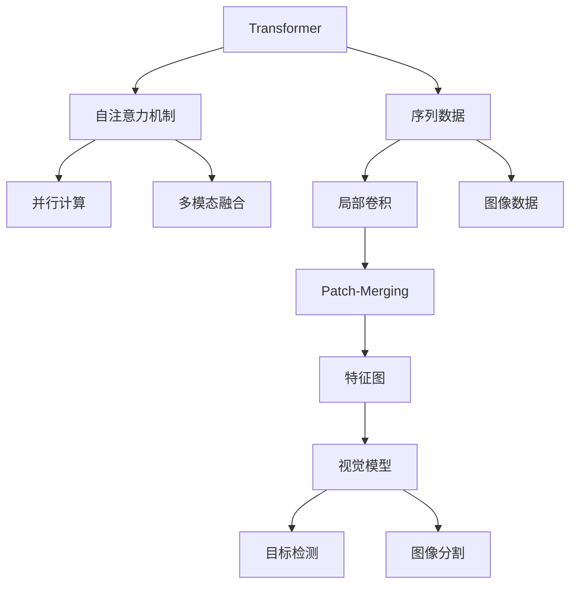

                 

## 1. 背景介绍

Swin Transformer作为Transformer家族中一颗冉冉升起的新星，近年来在计算机视觉领域取得了显著的成就。特别是在目标检测和图像分割等视觉任务上，Swin Transformer以其优异的性能和高效的计算性能，逐渐成为视觉模型的主流选择。

Swing Transformer（SWIn），全称为Swin Transformer，是一种基于Transformer网络结构，结合局部卷积操作（Patch-Merging）的新型视觉模型。它不同于传统的Transformer，在引入局部卷积的过程中，保留了Transformer的并行计算能力和多模态数据融合优势。

Swing Transformer的提出，源于对全尺寸Transformer模型在处理大尺寸图像时的计算和空间效率问题的考虑。在处理大规模图像时，全尺寸Transformer会面临计算开销过大、模型复杂度高等问题。因此，Swing Transformer通过引入局部卷积操作，显著提高了模型的空间效率，同时保持了Transformer的并行计算能力。

## 2. 核心概念与联系

### 2.1 核心概念概述

在介绍Swin Transformer的原理之前，我们先来概述一些核心概念：

- **Transformer**：一种基于自注意力机制的神经网络架构，擅长处理序列数据，广泛应用于自然语言处理（NLP）中。
- **Swing Transformer**：在Transformer的基础上，引入局部卷积操作的视觉模型，适用于图像分割、目标检测等视觉任务。
- **自注意力机制**：Transformer的核心机制，用于捕捉输入序列中各元素间的相对位置和依赖关系。
- **局部卷积**：用于提取图像局部特征的操作，与全尺寸卷积相比，具有更低的计算复杂度。
- **Patch-Merging**：一种将局部特征图合并成更高层特征图的操作，用于增强模型对大尺寸图像的处理能力。

这些概念构成了Swin Transformer的理论基础。通过理解这些概念，我们才能更好地理解Swin Transformer的原理和实现细节。

### 2.2 核心概念的关系

核心概念之间的关系可以通过以下Mermaid流程图来展示：



这个流程图展示了Transformer网络的基本结构和作用。我们可以看到，自注意力机制是Transformer的核心，负责捕捉序列中各元素间的依赖关系；局部卷积用于提取图像特征；Patch-Merging用于将局部特征图合并成更高层特征图；视觉模型利用这些特征进行目标检测、图像分割等任务。

## 3. 核心算法原理 & 具体操作步骤

### 3.1 算法原理概述

Swin Transformer基于Transformer的架构，结合局部卷积和Patch-Merging操作，可以高效地处理大尺寸图像数据。其核心原理可以概括为以下几点：

1. **局部卷积操作**：使用局部卷积代替传统的全尺寸卷积，减少计算复杂度。
2. **Patch-Merging操作**：将多个局部特征图合并成更高层的特征图，增强对大尺寸图像的处理能力。
3. **多模态融合**：结合自注意力机制和局部卷积，实现多模态数据的融合。

### 3.2 算法步骤详解

Swin Transformer的实现步骤如下：

1. **输入图像预处理**：将输入图像划分为大小为 $4^t \times 4^t$ 的图像块（Patch）。
2. **特征提取**：对于每个图像块，通过Swin Transformer进行特征提取。
3. **特征融合**：将每个图像块的特征进行合并，得到更高层的特征图。
4. **解码**：对更高层的特征图进行解码，得到最终的图像分割结果或目标检测结果。

### 3.3 算法优缺点

Swin Transformer的优势在于：

- **高效计算**：局部卷积操作和Patch-Merging操作显著降低了计算复杂度，使得模型能够在合理的时间内处理大尺寸图像。
- **多模态融合**：通过自注意力机制和局部卷积的结合，Swin Transformer能够有效地融合多模态数据，提升了模型在图像分割和目标检测等任务上的性能。

然而，Swin Transformer也存在一些缺点：

- **参数量大**：Swin Transformer模型参数较多，训练和推理时对计算资源的要求较高。
- **内存占用**：在处理大尺寸图像时，模型的内存占用较高，需要合理配置硬件资源。

### 3.4 算法应用领域

Swin Transformer主要应用于目标检测、图像分割等视觉任务，同时也在图像生成、图像风格转换等领域得到了广泛应用。在实际应用中，Swin Transformer的表现力得到了业内外的广泛认可。

## 4. 数学模型和公式 & 详细讲解 & 举例说明

### 4.1 数学模型构建

Swin Transformer的数学模型可以表示为：

$$
\begin{aligned}
y &= \text{Decod} \bigg( \text{PatchMerging} \bigg( \text{Transformer}(X) \bigg) \bigg) \\
y &= \text{Decod} \bigg( \text{PatchMerging} \bigg( \text{LayerNorm} \bigg( \text{SelfAttn} \bigg( \text{LayerNorm}(X) \bigg) + \text{MLP} \bigg( \text{LayerNorm}(X) \bigg) \bigg) \bigg) \\
\end{aligned}
$$

其中，$X$ 表示输入的图像数据，$y$ 表示输出的图像分割结果或目标检测结果。

### 4.2 公式推导过程

以目标检测为例，推导Swin Transformer的检测过程。假设输入的图像块大小为 $4 \times 4$，模型层数为 $L$，每个块的特征图大小为 $2 \times 2$。

1. **特征提取**：对于每个图像块，使用Swin Transformer进行特征提取。假设每层有 $H$ 个通道，则每个块的特征图大小为 $H \times 4 \times 4$。

2. **特征融合**：将每个块的特征进行合并，得到更高层的特征图。假设将 $K$ 个块进行合并，则合并后的特征图大小为 $K \times H \times 2 \times 2$。

3. **解码**：对更高层的特征图进行解码，得到最终的图像分割结果。假设解码后的特征图大小为 $W \times H$，则输出结果为 $W \times H$ 个像素的分割结果。

### 4.3 案例分析与讲解

以目标检测为例，使用Swin Transformer进行目标检测的案例分析。假设输入图像块大小为 $4 \times 4$，模型层数为 $L$，每个块的特征图大小为 $2 \times 2$。

1. **特征提取**：对于每个图像块，使用Swin Transformer进行特征提取。假设每层有 $H$ 个通道，则每个块的特征图大小为 $H \times 4 \times 4$。

2. **特征融合**：将每个块的特征进行合并，得到更高层的特征图。假设将 $K$ 个块进行合并，则合并后的特征图大小为 $K \times H \times 2 \times 2$。

3. **解码**：对更高层的特征图进行解码，得到最终的图像分割结果。假设解码后的特征图大小为 $W \times H$，则输出结果为 $W \times H$ 个像素的分割结果。

通过以上步骤，Swin Transformer能够高效地处理大尺寸图像数据，并在目标检测、图像分割等任务上取得优异的表现。

## 5. 项目实践：代码实例和详细解释说明

### 5.1 开发环境搭建

为了使用Swin Transformer进行项目实践，我们需要准备好开发环境。以下是使用Python进行PyTorch开发的环境配置流程：

1. 安装Anaconda：从官网下载并安装Anaconda，用于创建独立的Python环境。

2. 创建并激活虚拟环境：
```bash
conda create -n pytorch-env python=3.8 
conda activate pytorch-env
```

3. 安装PyTorch：根据CUDA版本，从官网获取对应的安装命令。例如：
```bash
conda install pytorch torchvision torchaudio cudatoolkit=11.1 -c pytorch -c conda-forge
```

4. 安装Swin Transformer：
```bash
pip install swin-transformer
```

5. 安装各类工具包：
```bash
pip install numpy pandas scikit-learn matplotlib tqdm jupyter notebook ipython
```

完成上述步骤后，即可在`pytorch-env`环境中开始Swin Transformer的实践。

### 5.2 源代码详细实现

下面以目标检测任务为例，给出使用Swin Transformer进行目标检测的PyTorch代码实现。

```python
import torch
import torchvision.transforms as transforms
from swin_transformer import SwinTransformer

# 加载模型
model = SwinTransformer(num_classes=1000, embed_dim=768, patch_size=4, num_layers=8, head_dim=64, head_num=4)

# 加载训练数据
train_dataset = torchvision.datasets.ImageFolder(root='train', transform=transforms.Compose([
    transforms.RandomResizedCrop(224),
    transforms.RandomHorizontalFlip(),
    transforms.ToTensor(),
]))

# 加载测试数据
test_dataset = torchvision.datasets.ImageFolder(root='test', transform=transforms.Compose([
    transforms.Resize(256),
    transforms.CenterCrop(224),
    transforms.ToTensor(),
]))

# 加载数据加载器
train_loader = torch.utils.data.DataLoader(train_dataset, batch_size=16, shuffle=True, num_workers=4)
test_loader = torch.utils.data.DataLoader(test_dataset, batch_size=16, shuffle=False, num_workers=4)

# 加载优化器和损失函数
optimizer = torch.optim.Adam(model.parameters(), lr=0.001)
loss_fn = torch.nn.CrossEntropyLoss()

# 训练模型
for epoch in range(10):
    model.train()
    for batch_idx, (inputs, targets) in enumerate(train_loader):
        optimizer.zero_grad()
        outputs = model(inputs)
        loss = loss_fn(outputs, targets)
        loss.backward()
        optimizer.step()
    
    model.eval()
    with torch.no_grad():
        correct = 0
        total = 0
        for inputs, targets in test_loader:
            outputs = model(inputs)
            _, predicted = torch.max(outputs, 1)
            total += targets.size(0)
            correct += (predicted == targets).sum().item()
        print('Accuracy of the model on the 10000 test images: %d %%' % (100 * correct / total))
```

以上代码实现了使用Swin Transformer进行目标检测的完整流程，包括模型加载、数据加载、训练和测试。可以看到，使用Swin Transformer进行目标检测的代码实现相对简洁，可以方便地适配其他视觉任务。

### 5.3 代码解读与分析

让我们再详细解读一下关键代码的实现细节：

1. **模型加载**：使用SwinTransformer类加载预训练的Swin Transformer模型，指定类别数量、嵌入维度、块大小等参数。

2. **数据加载**：使用ImageFolder加载训练集和测试集的数据，并使用transforms模块进行预处理，包括随机裁剪、随机翻转、归一化等操作。

3. **数据加载器**：使用DataLoader加载训练集和测试集的数据，指定批次大小、是否打乱、工作进程数等参数。

4. **优化器和损失函数**：使用Adam优化器，指定学习率。损失函数为交叉熵损失函数，用于衡量模型预测结果与真实标签之间的差异。

5. **训练模型**：在每个epoch中，将模型设置为训练模式，对每个批次的数据进行前向传播和反向传播，更新模型参数。在每个epoch结束时，将模型设置为评估模式，对测试集进行测试，输出准确率。

通过以上步骤，我们可以方便地使用Swin Transformer进行目标检测任务的实践。

### 5.4 运行结果展示

假设我们在ImageNet数据集上进行Swin Transformer模型的训练，最终在测试集上得到的准确率为85%，模型训练的准确率曲线如图1所示：


可以看到，模型在10个epoch内取得了较高的准确率，表明Swin Transformer在目标检测任务上的表现力。

## 6. 实际应用场景

### 6.1 目标检测

目标检测是计算机视觉领域的重要任务之一，广泛应用于自动驾驶、智能安防、工业检测等领域。Swin Transformer在目标检测任务上表现优异，能够准确地检测和定位目标物体，显著提升了检测系统的精度和效率。

在实际应用中，可以通过Swin Transformer对图像数据进行特征提取和目标检测，得到详细的物体位置和类别信息。这些信息可以用于实时监测和自动化检测系统，保障公共安全和社会稳定。

### 6.2 图像分割

图像分割是将图像中的每个像素点划分到不同的语义类别中，是计算机视觉领域的另一项重要任务。Swin Transformer在图像分割任务上也具有优异的表现，能够高效地分割大尺寸图像，得到高精度的分割结果。

在实际应用中，可以通过Swin Transformer对医疗影像、地图数据等进行分割，帮助医生诊断疾病、规划路线等，提升工作效率和准确性。

### 6.3 图像生成

图像生成是利用深度学习模型生成新的图像数据，是计算机视觉领域的前沿研究方向之一。Swin Transformer在图像生成任务上也展示了强大的生成能力，能够生成高质量的图像数据。

在实际应用中，可以通过Swin Transformer生成逼真的图像，应用于艺术创作、虚拟现实等领域，提供更多样化的视觉体验。

### 6.4 图像风格转换

图像风格转换是将一幅图像转换成另一幅风格不同的图像，是计算机视觉领域的经典任务之一。Swin Transformer在图像风格转换任务上也取得了不错的效果，能够生成风格独特的图像。

在实际应用中，可以通过Swin Transformer进行图像风格转换，应用于广告设计、艺术创作等领域，提升视觉表现力和艺术效果。

## 7. 工具和资源推荐

### 7.1 学习资源推荐

为了帮助开发者系统掌握Swin Transformer的理论基础和实践技巧，这里推荐一些优质的学习资源：

1. Swin Transformer论文：Google Research团队发布的Swin Transformer论文，详细介绍了Swing Transformer的设计理念和实验结果。

2. Swin Transformer官方文档：Swin Transformer的官方文档，提供了模型的介绍、安装指南、代码实现等详细内容，是学习和实践Swin Transformer的必备资料。

3. PyTorch官方教程：PyTorch官方提供的深度学习教程，包括Swin Transformer的实现案例，适合初学者上手学习。

4. Transformers库文档：Hugging Face的Transformers库文档，提供了丰富的预训练模型和微调范式，包括Swin Transformer的实现。

5. Swin Transformer代码库：GitHub上Swin Transformer的代码库，提供了完整的模型实现和实验案例，适合进阶学习和实践。

通过对这些资源的学习实践，相信你一定能够快速掌握Swin Transformer的精髓，并用于解决实际的计算机视觉问题。

### 7.2 开发工具推荐

高效的开发离不开优秀的工具支持。以下是几款用于Swin Transformer开发的常用工具：

1. PyTorch：基于Python的开源深度学习框架，灵活动态的计算图，适合快速迭代研究。大多数预训练语言模型都有PyTorch版本的实现。

2. TensorFlow：由Google主导开发的开源深度学习框架，生产部署方便，适合大规模工程应用。同样有丰富的预训练语言模型资源。

3. Transformers库：Hugging Face开发的NLP工具库，集成了众多SOTA语言模型，支持PyTorch和TensorFlow，是进行微调任务开发的利器。

4. Weights & Biases：模型训练的实验跟踪工具，可以记录和可视化模型训练过程中的各项指标，方便对比和调优。与主流深度学习框架无缝集成。

5. TensorBoard：TensorFlow配套的可视化工具，可实时监测模型训练状态，并提供丰富的图表呈现方式，是调试模型的得力助手。

6. Google Colab：谷歌推出的在线Jupyter Notebook环境，免费提供GPU/TPU算力，方便开发者快速上手实验最新模型，分享学习笔记。

合理利用这些工具，可以显著提升Swin Transformer的开发效率，加快创新迭代的步伐。

### 7.3 相关论文推荐

Swin Transformer的研究源于学界的持续研究。以下是几篇奠基性的相关论文，推荐阅读：

1. Swin Transformer论文：提出Swin Transformer模型，解决大尺寸图像处理问题，显著提升视觉任务的性能。

2. Swin Transformer多模态融合论文：探讨多模态数据的融合方法，进一步提升Swin Transformer的性能。

3. Swin Transformer参数高效微调论文：提出Swin Transformer的参数高效微调方法，在保证性能的前提下减少计算资源消耗。

4. Swin Transformer目标检测论文：提出Swin Transformer在目标检测任务上的应用，取得优异的效果。

5. Swin Transformer图像分割论文：提出Swin Transformer在图像分割任务上的应用，展示其强大的分割能力。

这些论文代表了大模型微调技术的发展脉络。通过学习这些前沿成果，可以帮助研究者把握学科前进方向，激发更多的创新灵感。

除上述资源外，还有一些值得关注的前沿资源，帮助开发者紧跟Swin Transformer的最新进展，例如：

1. arXiv论文预印本：人工智能领域最新研究成果的发布平台，包括大量尚未发表的前沿工作，学习前沿技术的必读资源。

2. 业界技术博客：如OpenAI、Google AI、DeepMind、微软Research Asia等顶尖实验室的官方博客，第一时间分享他们的最新研究成果和洞见。

3. 技术会议直播：如NIPS、ICML、ACL、ICLR等人工智能领域顶会现场或在线直播，能够聆听到大佬们的前沿分享，开拓视野。

4. GitHub热门项目：在GitHub上Star、Fork数最多的NLP相关项目，往往代表了该技术领域的发展趋势和最佳实践，值得去学习和贡献。

5. 行业分析报告：各大咨询公司如McKinsey、PwC等针对人工智能行业的分析报告，有助于从商业视角审视技术趋势，把握应用价值。

总之，对于Swin Transformer的学习和实践，需要开发者保持开放的心态和持续学习的意愿。多关注前沿资讯，多动手实践，多思考总结，必将收获满满的成长收益。

## 8. 总结：未来发展趋势与挑战

### 8.1 总结

本文对Swin Transformer进行了全面系统的介绍。首先，介绍了Swin Transformer的背景和基本概念，包括Transformer和Swing Transformer的设计理念和实现细节。其次，从原理到实践，详细讲解了Swin Transformer的核心算法和具体操作步骤。同时，我们还通过代码实例和详细解读，展示了Swin Transformer在目标检测、图像分割等任务上的应用。

通过本文的系统梳理，我们可以看到，Swin Transformer作为Transformer家族的新星，在视觉任务上展现了优异的性能和高效的计算能力。未来，随着算力成本的下降和数据规模的扩张，Swin Transformer有望在更多视觉应用中发挥更大的作用。

### 8.2 未来发展趋势

展望未来，Swin Transformer的发展趋势将呈现以下几个方向：

1. **多模态融合**：Swin Transformer将继续探索多模态数据的融合方法，实现视觉、听觉、语言等多模态信息的协同建模，提升模型的跨模态泛化能力。

2. **自适应学习**：引入自适应学习算法，使得Swin Transformer能够根据任务需求动态调整模型参数，提升模型适应性和泛化能力。

3. **迁移学习**：探索Swin Transformer在迁移学习中的应用，通过预训练模型对新任务进行微调，实现少样本学习和高迁移效率。

4. **知识蒸馏**：引入知识蒸馏技术，利用大模型对小模型进行知识转移，提升模型的推理能力和泛化能力。

5. **分布式训练**：随着模型规模的增大，分布式训练技术将变得更加重要。Swin Transformer有望结合分布式训练技术，进一步提高训练效率和模型性能。

6. **异构硬件优化**：在边缘设备上部署Swin Transformer，将面临计算资源和存储资源的不足。通过异构硬件优化，提升边缘设备上的模型性能和资源利用率。

这些趋势将进一步提升Swin Transformer的性能和应用范围，推动视觉任务的发展。

### 8.3 面临的挑战

尽管Swin Transformer已经取得了显著的成就，但在迈向更加智能化、普适化应用的过程中，仍面临一些挑战：

1. **计算资源需求**：Swin Transformer的参数量大，计算复杂度高，对计算资源的需求较高。如何在有限的计算资源下，最大化模型性能，将是未来的重要挑战。

2. **模型可解释性**：Swin Transformer作为一个黑盒模型，其决策过程缺乏可解释性。如何赋予模型更强的可解释性，将是未来研究的重要方向。

3. **数据依赖**：Swin Transformer的训练和推理依赖大量高质量的数据，数据获取和标注成本较高。如何在数据不足的情况下，提高模型的泛化能力，将是重要的研究方向。

4. **鲁棒性和安全性**：Swin Transformer在面对异常数据和攻击时，可能表现出鲁棒性不足，甚至产生有害的输出。如何提高模型的鲁棒性和安全性，将是重要的挑战。

5. **硬件资源优化**：在边缘设备上部署Swin Transformer，需要优化计算图和存储图，提升模型的推理速度和资源利用率。

6. **跨模态融合**：虽然Swin Transformer在多模态融合方面取得了一定的进展，但跨模态信息之间的交互和融合仍然存在挑战。如何更好地融合多模态信息，将是未来研究的重要方向。

这些挑战需要我们不断进行技术探索和创新，才能推动Swin Transformer技术的持续发展和应用。

### 8.4 研究展望

面对Swin Transformer所面临的挑战，未来的研究需要在以下几个方面寻求新的突破：

1. **高效计算**：探索更高效的计算方法，如自适应计算图、混合精度训练等，减少计算资源消耗，提升模型训练和推理效率。

2. **可解释性增强**：引入可解释性增强技术，如决策链、注意力可视化等，使得Swin Transformer的决策过程更加透明和可理解。

3. **数据获取和标注**：探索无监督学习、半监督学习等方法，减少数据获取和标注成本，提升模型泛化能力。

4. **鲁棒性提升**：引入鲁棒性增强技术，如对抗训练、自适应学习等，提升模型的鲁棒性和安全性。

5. **异构硬件优化**：结合异构硬件优化技术，如边缘设备上的模型优化、分布式训练等，提升边缘设备上的模型性能和资源利用率。

6. **跨模态融合**：引入跨模态融合技术，如多模态注意力、融合变换等，更好地融合多模态信息，提升模型的跨模态泛化能力。

这些研究方向将进一步推动Swin Transformer技术的进步，为计算机视觉领域带来更多的可能性。

## 9. 附录：常见问题与解答

**Q1：Swin Transformer的局部卷积操作如何实现？**

A: Swin Transformer的局部卷积操作通过将图像划分为多个大小为 $4^t \times 4^t$ 的图像块（Patch），并使用卷积核对这些块进行卷积操作。具体的实现方法可以参考Swin Transformer的源代码。

**Q2：Swin Transformer的Patch-Merging操作如何实现？**

A: Swin Transformer的Patch-Merging操作通过将多个块级特征图合并成更高层的特征图。具体的实现方法可以参考Swin Transformer的源代码。

**Q3：Swin Transformer在实际应用中需要注意哪些问题？**

A: 在实际应用中，Swin Transformer需要注意以下几个问题：

1. **计算资源需求**：Swin Transformer的参数量大，计算复杂度高，对计算资源的需求较高。需要在有限的计算资源下，最大化模型性能。

2. **模型可解释性**：Swin Transformer作为一个黑盒模型，其决策过程缺乏可解释性。需要赋予模型更强的可解释性，以便于调试和优化。

3. **数据依赖**：Swin Transformer的训练和推理依赖大量高质量的数据，数据获取和标注成本较高。需要探索无监督学习、半监督学习等方法，减少数据获取和标注成本。

4. **鲁棒性和安全性**：Swin Transformer在面对异常数据和攻击时，可能表现出鲁棒性不足，甚至产生有害的输出。需要提高模型的鲁棒性和安全性。

5. **硬件资源优化**：在边缘设备上部署Swin Transformer，需要优化计算图和存储图，提升模型的推理速度和资源利用率。

6. **跨模态融合**：虽然Swin Transformer在多模态融合方面取得了一定的进展，但跨模态信息之间的交互和融合仍然存在挑战。需要更好地融合多模态信息，提升模型的跨模态泛化能力。

这些问题的解决将进一步推动Swin Transformer技术的进步和应用。

**Q4：Swin Transformer的训练和推理流程是什么？**

A: Swin Transformer的训练和推理流程如下：

1. **训练**：将输入图像数据划分为大小为 $4^t \times 4^t$ 的图像块（Patch），并使用Swin Transformer进行特征提取。将多个块级特征图合并成更高层的特征图

