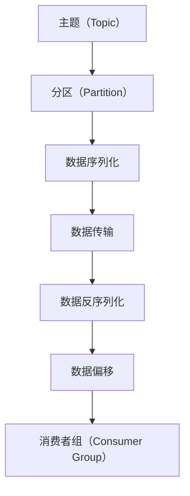
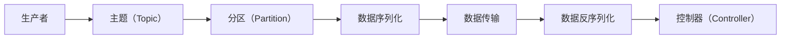
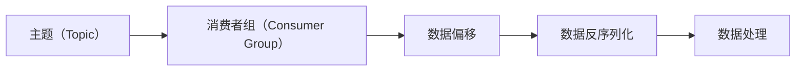
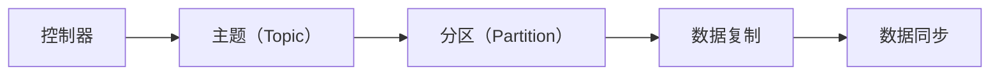
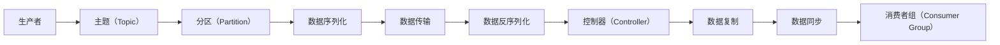

                 

# 【AI大数据计算原理与代码实例讲解】Kafka

## 1. 背景介绍

### 1.1 问题由来
随着数据量的爆炸性增长和分布式系统的广泛应用，如何高效、可靠地存储和处理海量数据，成为了大数据领域的一大难题。为了应对这一挑战，Apache Kafka 应运而生。Kafka 是一个开源的分布式流处理平台，由 LinkedIn 公司于 2008 年创建，目前已成为大数据和实时流处理领域的重要组件。Kafka 通过高吞吐量、高可扩展性、强一致性的特点，广泛应用于日志收集、数据流处理、实时数据分析等多个领域。

### 1.2 问题核心关键点
Kafka 的核心设计理念是高吞吐量、高可扩展性和强一致性。通过分布式存储和消费模型，Kafka 能够高效地处理海量数据，同时支持高并发读写，保证数据的可靠性和一致性。Kafka 的主要组件包括：
- **生产者（Producer）**：负责将数据写入 Kafka 集群，将数据打包成消息，发送到指定主题（Topic）。
- **控制器（Controller）**：负责管理 Kafka 集群的元数据信息，包括 Topic、Partition、Leader 等。
- **消费者（Consumer）**：负责从 Kafka 集群中读取数据，进行消费处理。

Kafka 的这些核心组件和设计理念，使得它在数据存储和处理上具有显著的优势，成为大数据和实时流处理领域的重要工具。

### 1.3 问题研究意义
研究 Kafka 的计算原理和实现方法，对于理解大数据和流处理技术的底层机制，以及高效、可靠地处理海量数据具有重要意义：

1. **数据可靠性保障**：Kafka 通过分布式存储和数据冗余，保证了数据的可靠性，避免了单点故障和数据丢失。
2. **高效数据传输**：Kafka 的高吞吐量和低延迟特性，使其能够处理海量数据，支持高并发读写，满足实时数据处理需求。
3. **灵活数据消费**：Kafka 的消费模型支持多种消费模式，包括顺序消费、并行消费和幂等消费，能够满足不同业务场景的需求。
4. **强大的生态系统**：Kafka 拥有丰富的第三方生态系统，包括数据可视化、数据流处理、数据集成等工具，为大数据应用提供了强大的支持。
5. **易用性和可扩展性**：Kafka 的设计理念易于理解和实现，同时支持水平扩展，可以根据业务需求动态调整集群规模。

掌握 Kafka 的原理和实践，对于构建高效、可靠的大数据和流处理系统，具有重要意义。

## 2. 核心概念与联系

### 2.1 核心概念概述

为更好地理解 Kafka 的计算原理和实现方法，本节将介绍几个密切相关的核心概念：

- **主题（Topic）**：Kafka 中数据的基本存储单位，类似于数据库中的表。生产者将数据写入 Topic，消费者从 Topic 中读取数据。
- **分区（Partition）**：将一个 Topic 分成多个分区，每个分区是一个有序的数据流。分区可以实现负载均衡和数据冗余。
- **消费者组（Consumer Group）**：一组消费者可以共享一个 Topic 的多个分区，实现高并发消费。
- **数据序列化（Serialization）**：将数据转换为二进制格式，以便在网络上传输和存储。
- **数据反序列化（Deserialization）**：将二进制数据转换回原始数据格式。
- **数据偏移（Offset）**：记录消费者已经消费的数据量，用于保证数据消费的一致性。

这些核心概念之间的逻辑关系可以通过以下 Mermaid 流程图来展示：



这个流程图展示了大数据在 Kafka 系统中的处理流程：
1. 生产者将数据写入 Topic，并按照分区进行分布式存储。
2. 数据经过序列化，通过网络传输到控制器。
3. 控制器将数据转发给相应的消费者组。
4. 消费者组对数据进行反序列化和偏移管理，实现高并发消费。

### 2.2 概念间的关系

这些核心概念之间存在着紧密的联系，形成了 Kafka 系统的完整架构。下面我们通过几个 Mermaid 流程图来展示这些概念之间的关系。

#### 2.2.1 Kafka 的生产模型



这个流程图展示了生产者将数据写入 Topic 的过程：
1. 生产者将数据发送到指定的 Topic。
2. Topic 包含多个分区，数据按照分区进行分布式存储。
3. 数据进行序列化，并通过网络传输到控制器。
4. 控制器负责分配数据到相应的分区，并更新分区信息。

#### 2.2.2 Kafka 的消费模型



这个流程图展示了消费者从 Topic 中读取数据的过程：
1. 消费者组共享一个 Topic 的多个分区，实现高并发消费。
2. 数据偏移记录了消费者已经消费的数据量。
3. 数据进行反序列化，并由消费者进行处理。

#### 2.2.3 Kafka 的控制模型



这个流程图展示了控制器管理 Topic 和分区的过程：
1. 控制器负责管理 Topic 和分区的元数据信息。
2. 控制器分配分区到相应的生产者和消费者，并进行负载均衡。
3. 控制器负责数据的复制和同步，保证数据冗余和一致性。

### 2.3 核心概念的整体架构

最后，我们用一个综合的流程图来展示 Kafka 系统的完整架构：



这个综合流程图展示了 Kafka 系统的完整流程：
1. 生产者将数据发送到 Topic。
2. Topic 包含多个分区，数据按照分区进行分布式存储。
3. 数据进行序列化，并通过网络传输到控制器。
4. 控制器负责分配数据到相应的分区，并更新分区信息。
5. 控制器负责数据的复制和同步，保证数据冗余和一致性。
6. 消费者组对数据进行反序列化和偏移管理，实现高并发消费。

## 3. 核心算法原理 & 具体操作步骤
### 3.1 算法原理概述

Kafka 的核心算法原理主要围绕数据存储、传输和消费三个方面展开：

1. **数据存储原理**：Kafka 使用分布式文件系统，通过分区和数据冗余，实现了高吞吐量、高可用性和高可靠性。
2. **数据传输原理**：Kafka 采用异步传输和事件驱动模型，支持高并发读写，降低了网络延迟和系统开销。
3. **数据消费原理**：Kafka 采用消费模型和偏移管理，支持多种消费模式，保证数据消费的一致性和可靠性。

### 3.2 算法步骤详解

Kafka 的基本算法步骤包括以下几个关键步骤：

**Step 1: 生产者发送数据**
1. 生产者将数据打包成消息，并指定 Topic 和 Partition。
2. 生产者将消息发送到 Kafka 集群，将数据发送给控制器。

**Step 2: 控制器分配数据**
1. 控制器根据 Topic 和 Partition，将数据分配到相应的分区。
2. 控制器更新 Partition 和 Leader 的信息，并广播给所有消费者。

**Step 3: 数据传输与存储**
1. 控制器将数据转发给 Leader，Leader 负责将数据复制到所有 Follower。
2. Leader 将数据写入磁盘，并记录偏移信息。

**Step 4: 数据消费**
1. 消费者组从 Topic 中读取数据，并进行消费处理。
2. 消费者记录偏移信息，确保数据消费的一致性。

### 3.3 算法优缺点

Kafka 的优点包括：
1. 高吞吐量和低延迟：Kafka 支持高并发读写，能够高效处理海量数据。
2. 高可扩展性和高可用性：Kafka 支持水平扩展，集群规模可以动态调整。
3. 强一致性和数据冗余：Kafka 通过分区和数据冗余，实现了数据的一致性和可靠性。

Kafka 的缺点包括：
1. 资源消耗较大：Kafka 的分布式存储和数据冗余，对硬件资源和网络带宽要求较高。
2. 实现复杂度较高：Kafka 的分布式系统和算法实现较为复杂，对开发者要求较高。
3. 数据延迟较大：Kafka 的异步传输和数据冗余，可能导致数据延迟较大。

### 3.4 算法应用领域

Kafka 的应用领域非常广泛，包括但不限于以下领域：

- **日志收集**：Kafka 能够高效处理大规模日志数据，支持实时日志收集和分析。
- **数据流处理**：Kafka 支持实时数据流处理，如实时数据采集、实时计算、实时分析等。
- **消息队列**：Kafka 充当消息队列的角色，支持高并发消息传递和消息路由。
- **数据集成**：Kafka 支持数据集成和数据中转，将多个数据源的数据统一管理。
- **实时数据可视化**：Kafka 支持数据流可视化，帮助用户实时监控和分析数据。

此外，Kafka 还广泛应用于大数据、实时计算、物联网、金融等领域，成为不可或缺的数据基础设施。

## 4. 数学模型和公式 & 详细讲解  
### 4.1 数学模型构建

Kafka 的核心数学模型主要围绕数据传输和消费展开，包括以下几个关键模型：

- **消息传输模型**：描述生产者向控制器发送消息的过程。
- **分区分配模型**：描述控制器向 Leader 分配数据的过程。
- **数据冗余模型**：描述 Leader 向 Follower 复制数据的过程。
- **数据消费模型**：描述消费者从 Kafka 集群中读取数据的过程。

### 4.2 公式推导过程

以消息传输模型为例，推导生产者向控制器发送消息的过程。假设生产者发送的消息数量为 $N$，每个消息的大小为 $s$，消息的传输速率为 $v$，网络延迟为 $\delta$，则消息传输的时间为：

$$
T = N \times \frac{s}{v} + \delta
$$

其中，$N$ 为消息数量，$s$ 为消息大小，$v$ 为传输速率，$\delta$ 为网络延迟。通过这个公式，可以计算出消息传输所需的时间，从而优化网络带宽和传输速率。

### 4.3 案例分析与讲解

以 Kafka 在日志收集中的应用为例，说明 Kafka 的实际使用场景和计算原理。假设一个网站每秒产生 1000 条日志，每条日志大小为 1KB，网络传输速率为 1GB/s，网络延迟为 10ms，则：

- **消息数量**：$N = 1000 \times 60 = 60000$。
- **消息大小**：$s = 1 \times 1024 \times 1024 \times 8 = 8192$ 字节。
- **传输速率**：$v = 1 \times 1024 \times 1024 \times 1024 \times 8 = 8192$ 字节/秒。
- **网络延迟**：$\delta = 10 \times 10^{-3} = 0.01$ 秒。

根据消息传输模型公式，计算消息传输时间：

$$
T = 60000 \times \frac{8192}{8192} + 0.01 = 60000 + 0.01 = 60001.01 \text{ 秒}
$$

通过这个计算，可以得出消息传输所需的时间，并根据实际需求进行优化，如提高网络带宽、降低网络延迟等。

## 5. 项目实践：代码实例和详细解释说明
### 5.1 开发环境搭建

在进行 Kafka 项目实践前，我们需要准备好开发环境。以下是使用 Java 进行 Kafka 开发的环境配置流程：

1. 安装 JDK：从官网下载并安装 JDK 8 或更高版本。
2. 安装 Apache Kafka：从官网下载并解压 Apache Kafka 的压缩包。
3. 配置环境变量：设置 Kafka 所需的 JAVA_HOME 和 CLASSPATH。
4. 启动 Kafka：运行 bin 目录下的 startup.sh 或 startup.bat 文件，启动 Kafka 集群。

完成上述步骤后，即可在本地环境中进行 Kafka 项目的开发。

### 5.2 源代码详细实现

下面我们以 Kafka 的简单实例为例，给出使用 Java 编写 Kafka 代码的实现。

首先，定义 Kafka 生产者：

```java
import org.apache.kafka.clients.producer.KafkaProducer;
import org.apache.kafka.clients.producer.ProducerRecord;
import org.apache.kafka.clients.producer.ProducerConfig;

import java.util.Properties;

public class KafkaProducerExample {
    public static void main(String[] args) {
        Properties props = new Properties();
        props.put(ProducerConfig.BOOTSTRAP_SERVERS_CONFIG, "localhost:9092");
        props.put(ProducerConfig.KEY_SERIALIZER_CLASS_CONFIG, "org.apache.kafka.common.serialization.StringSerializer");
        props.put(ProducerConfig.VALUE_SERIALIZER_CLASS_CONFIG, "org.apache.kafka.common.serialization.StringSerializer");
        
        KafkaProducer<String, String> producer = new KafkaProducer<>(props);
        
        String topic = "my-topic";
        String message = "Hello, Kafka!";
        
        ProducerRecord<String, String> record = new ProducerRecord<>(topic, null, message);
        producer.send(record);
        
        producer.close();
    }
}
```

然后，定义 Kafka 消费者：

```java
import org.apache.kafka.clients.consumer.ConsumerConfig;
import org.apache.kafka.clients.consumer.ConsumerRecord;
import org.apache.kafka.clients.consumer.KafkaConsumer;
import org.apache.kafka.clients.consumer.ConsumerRecords;
import org.apache.kafka.common.serialization.StringDeserializer;

import java.time.Duration;
import java.util.Properties;

public class KafkaConsumerExample {
    public static void main(String[] args) {
        Properties props = new Properties();
        props.put(ConsumerConfig.BOOTSTRAP_SERVERS_CONFIG, "localhost:9092");
        props.put(ConsumerConfig.GROUP_ID_CONFIG, "my-group");
        props.put(ConsumerConfig.KEY_DESERIALIZER_CLASS_CONFIG, StringDeserializer.class.getName());
        props.put(ConsumerConfig.VALUE_DESERIALIZER_CLASS_CONFIG, StringDeserializer.class.getName());
        
        KafkaConsumer<String, String> consumer = new KafkaConsumer<>(props);
        
        String topic = "my-topic";
        String message = "Hello, Kafka!";
        
        ConsumerRecords<String, String> records = consumer.poll(Duration.ofMillis(1000));
        for (ConsumerRecord<String, String> record : records) {
            System.out.printf("Received message: %s%n", record.value());
        }
        
        consumer.close();
    }
}
```

最后，启动 Kafka 集群并运行代码：

```bash
bin/kafka-server-start.sh config/server.properties
bin/kafka-console-producer.sh --topic my-topic --broker-list localhost:9092
bin/kafka-console-consumer.sh --topic my-topic --from-beginning --bootstrap-server localhost:9092
```

通过上述代码，可以创建 Kafka 生产者和消费者，并进行简单的消息生产和消费。

### 5.3 代码解读与分析

让我们再详细解读一下关键代码的实现细节：

**KafkaProducer 类**：
- `Props` 属性：用于配置 Kafka 生产者的属性，包括 BootstrapServers、KeySerDes、ValueSerDes 等。
- `producer` 实例：创建 Kafka 生产者实例，并发送消息。

**KafkaConsumer 类**：
- `Props` 属性：用于配置 Kafka 消费者的属性，包括 BootstrapServers、GroupID、KeyDesSer、ValueDesSer 等。
- `consumer` 实例：创建 Kafka 消费者实例，并从指定 Topic 中读取消息。

**bin/kafka-console-producer.sh 和 bin/kafka-console-consumer.sh**：
- 这两个命令用于启动控制台生产者和消费者，方便开发者进行测试。

通过上述代码，可以看到 Kafka 的简单实现流程：
1. 生产者将消息发送到 Kafka 集群，并指定 Topic。
2. Kafka 集群将消息分配到指定的分区，并进行数据冗余。
3. 消费者从 Kafka 集群中读取数据，并进行处理。

## 6. 实际应用场景
### 6.1 智能客服系统

Kafka 可以用于构建智能客服系统，实现自动化的客户服务。通过 Kafka，系统可以实时收集客户咨询信息，进行语义分析和情感识别，自动生成回答并发送给客户。

具体而言，可以将客户的咨询信息发送到 Kafka 集群，由后台的 Kafka 消费者进行语义分析和情感识别，并根据分析结果生成回答。生成的回答可以发送到客户的终端设备，实现自动化的客户服务。

### 6.2 金融舆情监测

Kafka 可以用于构建金融舆情监测系统，实时监控市场舆情变化。通过 Kafka，系统可以实时收集新闻、评论、社交媒体等数据，进行情感分析和舆情监测。

具体而言，可以将各类数据发送到 Kafka 集群，由后台的 Kafka 消费者进行情感分析和舆情监测，并根据分析结果生成报告。生成的报告可以实时发送到决策者，帮助其做出及时的决策。

### 6.3 个性化推荐系统

Kafka 可以用于构建个性化推荐系统，实现实时的用户行为分析。通过 Kafka，系统可以实时收集用户的行为数据，进行分析和建模，生成个性化的推荐内容。

具体而言，可以将用户的行为数据发送到 Kafka 集群，由后台的 Kafka 消费者进行分析和建模，并根据分析结果生成推荐内容。生成的推荐内容可以发送到用户的终端设备，实现个性化的推荐服务。

### 6.4 未来应用展望

随着 Kafka 技术的不断发展和应用场景的不断拓展，未来的应用前景将更加广阔：

1. **大数据集成**：Kafka 可以用于集成多种数据源，如日志、传感器、社交媒体等，实现数据的统一管理和分析。
2. **实时计算**：Kafka 可以用于实时计算和数据流处理，如实时数据采集、实时数据分析、实时计算等。
3. **分布式系统**：Kafka 可以用于构建分布式系统，实现数据的分布式存储和处理，支持高并发读写。
4. **物联网**：Kafka 可以用于物联网领域，实现设备的实时数据采集和分析，支持设备的远程控制和监测。
5. **人工智能**：Kafka 可以用于人工智能领域，支持数据流处理和模型训练，实现智能分析和决策。

总之，Kafka 作为大数据和流处理领域的核心组件，其应用前景将随着技术的不断发展而更加广阔，为各行各业提供更加强大的数据处理和分析能力。

## 7. 工具和资源推荐
### 7.1 学习资源推荐

为了帮助开发者系统掌握 Kafka 的计算原理和实现方法，这里推荐一些优质的学习资源：

1. **《Kafka: The Definitive Guide》**：一本详细介绍 Kafka 的书籍，从基础到高级，涵盖 Kafka 的各个方面。
2. **Apache Kafka 官方文档**：Kafka 的官方文档，详细介绍了 Kafka 的安装、配置、使用等方面的内容。
3. **《Kafka 实战》**：一本详细介绍 Kafka 应用案例的书籍，涵盖 Kafka 在日志收集、数据流处理、实时计算等多个领域的应用。
4. **《Kafka 性能优化》**：一篇详细介绍 Kafka 性能优化的博客文章，涵盖 Kafka 在资源优化、性能调优等方面的内容。
5. **Kafka 社区**：Kafka 的官方社区，提供丰富的学习资源和交流平台，帮助开发者快速学习和解决问题。

通过这些学习资源，相信你一定能够系统掌握 Kafka 的计算原理和实现方法，并应用于实际项目中。

### 7.2 开发工具推荐

高效的开发离不开优秀的工具支持。以下是几款用于 Kafka 开发常用的工具：

1. **IntelliJ IDEA**：一款流行的 Java 开发工具，支持 Kafka 的开发和调试。
2. **Eclipse**：一款流行的 Java 开发工具，支持 Kafka 的开发和调试。
3. **Kafka-Kt**：Kafka 的 Kotlin 开发工具，支持 Kafka 的开发和调试。
4. **JIRA**：一款流行的项目管理工具，支持 Kafka 项目的跟踪和管理。
5. **Jenkins**：一款流行的持续集成工具，支持 Kafka 项目的持续集成和部署。

合理利用这些工具，可以显著提升 Kafka 项目的开发效率，加速项目的迭代和部署。

### 7.3 相关论文推荐

Kafka 的研究领域非常广泛，以下是几篇奠基性的相关论文，推荐阅读：

1. **"Log: A Log-Structured Storage System for Hadoop"**：一篇关于 Apache Hadoop 的论文，介绍了分布式文件系统的基本原理和实现方法。
2. **"Kafka: A Distributed Stream Platform"**：Kafka 的官方论文，详细介绍 Kafka 的设计理念和实现方法。
3. **"Fast Data Platforms for Stream Processing"**：一篇关于流处理平台的论文，介绍了分布式流处理系统的基本原理和实现方法。
4. **"Building Resilient Systems with Kafka Streams"**：一篇关于 Kafka Streams 的论文，介绍了流处理系统的基本原理和实现方法。
5. **"Performance and Scalability of Kafka"**：一篇关于 Kafka 性能优化的论文，介绍了 Kafka 在高并发读写和数据冗余等方面的优化方法。

这些论文代表了大数据和流处理领域的研究进展，通过学习这些前沿成果，可以帮助开发者把握技术前沿，解决实际问题。

除上述资源外，还有一些值得关注的前沿资源，帮助开发者紧跟 Kafka 技术的最新进展，例如：

1. **arXiv 论文预印本**：人工智能领域最新研究成果的发布平台，包括大量尚未发表的前沿工作，学习前沿技术的必读资源。
2. **AI 技术博客**：如 Apache Kafka 官方博客、Intel 大数据博客、Amazon Web Services 博客等，第一时间分享他们的最新研究成果和洞见。
3. **技术会议直播**：如 SIGKAFKA、KafkaSummit、Hadoop Summit 等大数据和流处理领域的顶级会议，能够聆听到业界大咖的前沿分享，开拓视野。
4. **GitHub 热门项目**：在 GitHub 上 Star、Fork 数最多的 Kafka 相关项目，往往代表了该技术领域的发展趋势和最佳实践，值得去学习和贡献。
5. **行业分析报告**：各大咨询公司如 McKinsey、PwC 等针对大数据和流处理领域的分析报告，有助于从商业视角审视技术趋势，把握应用价值。

总之，对于 Kafka 的学习和实践，需要开发者保持开放的心态和持续学习的意愿。多关注前沿资讯，多动手实践，多思考总结，必将收获满满的成长收益。

## 8. 总结：未来发展趋势与挑战

### 8.1 总结

本文对 Kafka 的计算原理和实现方法进行了全面系统的介绍。首先阐述了 Kafka 的设计理念和核心组件，明确了 Kafka 在数据存储和处理方面的独特优势。其次，从原理到实践，详细讲解了 Kafka 的核心算法步骤，给出了 Kafka 项目的完整代码实现。同时，本文还广泛探讨了 Kafka 在智能客服、金融舆情、个性化推荐等多个领域的应用前景，展示了 Kafka 技术的强大威力。此外，本文精选了 Kafka 学习的各类资源，力求为读者提供全方位的技术指引。

通过本文的系统梳理，可以看到，Kafka 作为大数据和流处理领域的核心组件，其应用前景将随着技术的不断发展而更加广阔，为各行各业提供更加强大的数据处理和分析能力。

### 8.2 未来发展趋势

展望未来，Kafka 的发展趋势将主要集中在以下几个方面：

1. **水平扩展**：Kafka 将进一步优化分布式存储和数据冗余机制，支持更大规模的数据处理和分析。
2. **高并发读写**：Kafka 将进一步优化高并发读写性能，支持更高效的数据传输和处理。
3. **实时计算**：Kafka 将进一步支持实时计算和数据流处理，实现更加灵活和高效的数据分析。
4. **数据湖**：Kafka 将进一步支持数据湖架构，实现数据的统一管理和分析。
5. **AI 融合**：Kafka 将进一步融合 AI 技术，支持数据智能分析和决策。

以上趋势凸显了 Kafka 技术的不断发展和创新，将为大数据和流处理领域带来更多的机遇和挑战。

### 8.3 面临的挑战

尽管 Kafka 技术已经取得了显著成就，但在迈向更加智能化、普适化应用的过程中，它仍面临着诸多挑战：

1. **资源消耗**：Kafka 的分布式存储和数据冗余，对硬件资源和网络带宽要求较高，可能导致高成本和资源浪费。
2. **数据延迟**：Kafka 的异步传输和数据冗余，可能导致数据延迟较大，影响实时性。
3. **系统复杂度**：Kafka 的分布式系统和算法实现较为复杂，对

