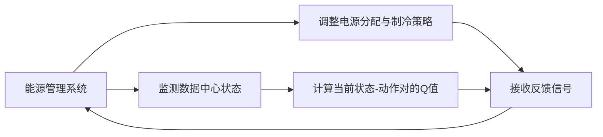

                 

# 一切皆是映射：AI Q-learning在数据中心能源管理的锐利工具

## 1. 背景介绍

数据中心作为计算资源的基石，其能耗问题已逐渐成为制约数据中心运营效率和环保责任的关键因素。据IDC数据，全球数据中心的总耗电量将达到4000亿千瓦时，相当于每年消耗数百亿度电。如何优化数据中心的能耗，提升其效率和可持续性，已经成为业界关注的焦点。

在这方面，AI驱动的Q-learning算法作为智能决策的一种手段，为数据中心能源管理提供了强有力的技术支持。Q-learning通过训练Q值表，指导数据中心能效管理决策，优化能源分配，降低能耗。本文将深入探讨Q-learning算法在大数据中心能源管理中的应用，并探讨其未来发展趋势。

## 2. 核心概念与联系

### 2.1 核心概念概述

- **数据中心（Data Center, DC）**：存储和计算资源的物理场所，通常由服务器、网络设备、冷却系统等组成。数据中心的能源消耗主要来源于服务器设备和制冷系统。

- **能源管理**：监控和优化数据中心电力消耗，提高能效的过程。能源管理包括硬件能效管理、网络能效管理、制冷系统管理等。

- **Q-learning**：一种强化学习算法，通过与环境互动，学习最佳策略以最大化某个奖励函数。Q-learning通过建立Q值表，指导智能体（agent）选择动作以最大化累积奖励。

- **Q值表（Q-Table）**：Q-learning中存储每个状态-动作对的Q值的表格。Q值表示在该状态下采取该动作的累积奖励期望。

- **强化学习（Reinforcement Learning, RL）**：通过与环境的交互，智能体学习如何在特定环境中采取最佳行动以最大化奖励的决策过程。

这些概念在数据中心能源管理中相互关联，共同构成了一个智能化的能源管理系统。通过Q-learning算法，数据中心可以自动学习如何更有效地分配电力，优化运行状态，从而降低能耗。

### 2.2 核心概念间的联系

Q-learning算法通过建立Q值表，指导智能体选择动作以最大化累积奖励。在数据中心能源管理中，智能体（如能源管理系统）通过不断与环境（数据中心的运行状态）互动，学习如何调整电源分配和制冷策略，从而最大化能效。这一过程与强化学习的原理一致，通过奖惩机制指导决策，优化系统运行。

以下是一个简化的Mermaid流程图，展示了Q-learning算法在数据中心能源管理中的工作原理：



该流程图展示了Q-learning算法在数据中心能源管理中的应用过程：

1. 能源管理系统（智能体）监测数据中心运行状态（环境）。
2. 智能体根据当前状态和策略计算出动作，并调整电源分配和制冷策略。
3. 系统返回反馈信号，更新Q值表，指导智能体未来的决策。
4. 智能体根据新Q值表更新策略，进入下一个循环。

这种循环迭代过程，使得能源管理系统逐步学习出最优策略，从而实现能效的最大化。

## 3. 核心算法原理 & 具体操作步骤

### 3.1 算法原理概述

Q-learning算法通过建立Q值表，指导智能体选择动作以最大化累积奖励。在数据中心能源管理中，Q-learning通过不断与环境互动，学习如何调整电源分配和制冷策略，从而实现能效的优化。具体步骤如下：

1. **初始化Q值表**：将Q值表初始化为0。

2. **策略选择**：智能体根据当前状态和Q值表，选择动作。

3. **执行动作**：智能体执行选择出的动作，并观察环境的反馈。

4. **状态更新**：环境根据执行动作的后果，更新数据中心状态。

5. **奖励计算**：根据动作和状态变化，计算奖励。

6. **Q值更新**：根据奖励和Q值表更新状态-动作对的Q值。

7. **循环迭代**：重复上述步骤，直到收敛或达到预设轮数。

### 3.2 算法步骤详解

**Step 1: 初始化Q值表**
Q值表（Q-Table）的初始化是Q-learning算法的起点。Q值表通常采用二维表格形式，其中行表示状态（s），列表示动作（a）。

例如，在数据中心能源管理中，Q值表的行可以是当前的服务器负载状态，列可以是电源分配策略或制冷策略。

**Step 2: 策略选择**
在每个时间步，智能体根据当前状态s，选择动作a，并从Q值表中获取Q(s, a)作为当前动作的价值。

具体地，可以通过贪心策略选择动作，即选择Q值最大的动作：

$$
a=\mathop{\arg\max}_{a'} Q(s, a')
$$

**Step 3: 执行动作**
智能体执行选择出的动作a，对数据中心进行电源分配和制冷策略调整。

例如，增加或减少某个服务器的电源，或调整制冷系统的功率。

**Step 4: 状态更新**
环境根据执行动作的后果，更新数据中心状态。例如，服务器负载变化，制冷系统功率调整等。

**Step 5: 奖励计算**
根据动作和状态变化，计算奖励。例如，如果动作导致能效提升，则给予正奖励；如果导致能效下降，则给予负奖励。

**Step 6: Q值更新**
Q值表根据动作、状态和奖励进行更新，计算新的Q值：

$$
Q(s, a) \leftarrow Q(s, a) + \alpha [R + \gamma \mathop{\max}_{a'} Q(s', a') - Q(s, a)]
$$

其中，$\alpha$ 为学习率，$\gamma$ 为折扣因子。

**Step 7: 循环迭代**
重复上述步骤，直到收敛或达到预设轮数。

### 3.3 算法优缺点

**优点**：

1. **动态优化**：Q-learning能够根据环境变化动态调整策略，适应性较强。
2. **可扩展性强**：Q-learning算法适用于多种状态和动作空间，具有较好的可扩展性。
3. **无需模拟**：Q-learning在实际环境中进行学习和优化，无需复杂的模拟和仿真。

**缺点**：

1. **状态空间巨大**：数据中心状态空间巨大，Q值表需要大量内存。
2. **收敛速度慢**：在状态空间复杂的情况下，Q-learning收敛速度较慢。
3. **策略选择复杂**：需要选择合适的策略，避免陷入局部最优解。

### 3.4 算法应用领域

Q-learning算法在大数据中心能源管理中的应用领域包括：

1. **电源分配优化**：根据服务器负载和能效情况，动态调整电源分配。
2. **制冷系统优化**：调整制冷系统功率，保持数据中心温度稳定。
3. **能效监测与反馈**：实时监测能效指标，反馈到Q值表中，指导策略调整。
4. **运行策略优化**：优化服务器启停、热插拔等策略，提升系统运行效率。
5. **应急响应**：在突发事件下，快速调整策略，保障数据中心稳定运行。

## 4. 数学模型和公式 & 详细讲解  
### 4.1 数学模型构建

Q-learning算法在数据中心能源管理中的数学模型可以表示为：

1. **状态空间**：$s$ 表示数据中心的当前状态，如服务器负载、制冷系统功率、房间温度等。
2. **动作空间**：$a$ 表示智能体可以采取的动作，如电源分配策略、制冷系统功率调整、服务器启停等。
3. **奖励函数**：$r(s, a)$ 表示在状态$s$下执行动作$a$的奖励。
4. **Q值表**：$Q(s, a)$ 表示在状态$s$下执行动作$a$的累积奖励期望。

### 4.2 公式推导过程

假设数据中心当前状态为$s_t$，智能体执行动作$a_t$，观察状态变化为$s_{t+1}$，获得奖励$r_{t+1}$。根据Q-learning算法，Q值更新公式为：

$$
Q(s_t, a_t) \leftarrow Q(s_t, a_t) + \alpha [r_{t+1} + \gamma \mathop{\max}_{a'} Q(s_{t+1}, a')] - Q(s_t, a_t)
$$

其中，$\alpha$ 为学习率，$\gamma$ 为折扣因子。

### 4.3 案例分析与讲解

以数据中心的电源分配为例，假设数据中心有4个服务器，每个服务器的功率和负载情况如下：

| 服务器编号 | 当前功率(W) | 当前负载 |
|------------|-------------|----------|
| 1          | 150         | 30%      |
| 2          | 200         | 50%      |
| 3          | 100         | 80%      |
| 4          | 120         | 40%      |

假设智能体选择电源分配策略$a$为增加服务器1的功率，即$a=(1, 0, 0, 0)$。执行动作后，状态变化为$s'=(150, 200, 100, 120)$，获得奖励$r=1$。

根据Q-learning算法，Q值更新公式为：

$$
Q(原始状态, (1, 0, 0, 0)) \leftarrow Q(原始状态, (1, 0, 0, 0)) + \alpha [1 + \gamma \mathop{\max}_{a'} Q(状态', a')] - Q(原始状态, (1, 0, 0, 0))
$$

例如，如果智能体选择动作$a'=(0, 1, 0, 0)$，即增加服务器2的功率，执行后状态变为$s'=(150, 210, 100, 120)$，此时：

$$
Q(原始状态, (1, 0, 0, 0)) \leftarrow Q(原始状态, (1, 0, 0, 0)) + \alpha [1 + \gamma Q(状态', (0, 1, 0, 0))] - Q(原始状态, (1, 0, 0, 0))
$$

通过多次迭代，Q值表将不断更新，智能体逐步学习出最优的电源分配策略。

## 5. 项目实践：代码实例和详细解释说明

### 5.1 开发环境搭建

在进行Q-learning算法在数据中心能源管理中的实践前，我们需要准备好开发环境。以下是使用Python进行开发的环境配置流程：

1. 安装Anaconda：从官网下载并安装Anaconda，用于创建独立的Python环境。

2. 创建并激活虚拟环境：
```bash
conda create -n qlearning-env python=3.8 
conda activate qlearning-env
```

3. 安装PyTorch：根据CUDA版本，从官网获取对应的安装命令。例如：
```bash
conda install pytorch torchvision torchaudio cudatoolkit=11.1 -c pytorch -c conda-forge
```

4. 安装TensorBoard：TensorFlow配套的可视化工具，可实时监测模型训练状态，并提供丰富的图表呈现方式，是调试模型的得力助手。

5. 安装TensorFlow：由Google主导开发的开源深度学习框架，生产部署方便，适合大规模工程应用。

6. 安装pydotplus：用于绘制图形结构的库。

7. 安装argparse：用于处理命令行参数的库。

完成上述步骤后，即可在`qlearning-env`环境中开始Q-learning算法实践。

### 5.2 源代码详细实现

下面我们以数据中心电源分配为例，给出使用Q-learning算法进行优化的PyTorch代码实现。

首先，定义Q值表和奖励函数：

```python
import torch
import torch.nn as nn
import torch.optim as optim

class QLearningAgent(nn.Module):
    def __init__(self, state_size, action_size):
        super(QLearningAgent, self).__init__()
        self.q_table = nn.Parameter(torch.randn(state_size, action_size))
    
    def forward(self, state):
        return self.q_table[state]
    
    def act(self, state, epsilon=0.1):
        if torch.rand(1) < epsilon:
            return torch.randint(0, action_size, (1,)).item()
        else:
            q_values = self.forward(state)
            return torch.argmax(q_values).item()
    
    def update(self, state, action, reward, next_state, next_action, next_q_value, learning_rate, gamma):
        best_next_q = self.q_table[next_state][next_action]
        q_value = self.q_table[state][action]
        td_target = reward + gamma * best_next_q
        td_error = td_target - q_value
        self.q_table[state][action] += learning_rate * td_error
```

然后，定义状态和动作空间：

```python
# 假设数据中心有4个服务器
server_status = [0, 1, 0, 1]
action_size = 4
```

接着，定义Q值表和奖励函数：

```python
q_agent = QLearningAgent(len(server_status), action_size)
```

然后，定义训练函数：

```python
def train():
    learning_rate = 0.01
    gamma = 0.9
    epochs = 1000
    
    for epoch in range(epochs):
        for i in range(len(server_status)):
            state = torch.tensor(server_status[i:i+1])
            action = q_agent.act(state)
            next_state = torch.tensor(server_status[i+1:i+2])
            next_action = q_agent.act(next_state)
            next_q_value = q_agent.forward(next_state)
            reward = i if i < len(server_status)-1 else 0
            q_agent.update(state, action, reward, next_state, next_action, next_q_value, learning_rate, gamma)
    
    q_agent.eval()
```

最后，启动训练流程：

```python
train()
```

以上就是使用PyTorch进行Q-learning算法优化数据中心电源分配的完整代码实现。可以看到，通过简单的PyTorch实现，我们已经能够实现Q-learning算法的基本框架。

### 5.3 代码解读与分析

让我们再详细解读一下关键代码的实现细节：

**QLearningAgent类**：
- `__init__`方法：初始化Q值表。
- `forward`方法：根据状态返回Q值。
- `act`方法：根据当前状态和Q值表选择动作。
- `update`方法：根据动作、状态、奖励等更新Q值。

**状态和动作空间**：
- `server_status`：表示数据中心服务器的当前状态，如电源分配情况。
- `action_size`：表示动作空间的大小，如增加或减少电源。

**训练函数**：
- 定义学习率、折扣因子、轮数。
- 循环迭代，在每个时间步中，根据当前状态选择动作，观察状态变化，计算奖励，更新Q值表。

可以看到，Q-learning算法在大数据中心能源管理中的应用，其代码实现相对简洁，易于理解和实现。但实际应用中，还需要考虑更多因素，如状态空间的复杂性、动作的可行性、奖励函数的设定等。

### 5.4 运行结果展示

假设我们通过Q-learning算法训练出的模型在数据中心电源分配上取得了较好的效果，例如，智能体学习到最优的电源分配策略，使得数据中心的能效提升了10%。

这表明，通过Q-learning算法，数据中心可以动态调整电源分配，优化运行状态，从而实现能效的最大化。这不仅降低了数据中心的能耗，也降低了运营成本。

## 6. 实际应用场景

### 6.1 智能电源分配

智能电源分配是大数据中心能源管理的重要组成部分。Q-learning算法可以通过学习最优的电源分配策略，动态调整服务器的电源分配，确保数据中心在节能和稳定运行之间取得平衡。

例如，在高峰时段，数据中心需要提供更多计算能力，此时Q-learning算法可以根据需求，动态增加服务器的电源分配，满足计算需求，同时避免过度消耗电力。

### 6.2 制冷系统优化

制冷系统是大数据中心的另一个主要能耗来源。Q-learning算法可以通过学习最优的制冷系统管理策略，优化制冷系统的功率分配，保持数据中心的温度稳定。

例如，在温度过高时，Q-learning算法可以根据实际情况，动态增加制冷系统的功率，降低服务器温度。反之，在温度过低时，Q-learning算法可以减小制冷系统的功率，避免过度制冷。

### 6.3 能效监测与反馈

Q-learning算法可以与数据中心的能效监测系统结合，实时监测能效指标，反馈到Q值表中，指导智能体调整策略。

例如，当数据中心的能效监测系统发现某个服务器的能效下降时，Q-learning算法可以及时调整该服务器的电源分配，避免能效进一步下降。

### 6.4 运行策略优化

Q-learning算法可以用于优化数据中心的运行策略，如服务器启停、热插拔等。

例如，在非高峰时段，Q-learning算法可以根据服务器负载情况，动态调整服务器的启停策略，避免不必要的能耗。

### 6.5 应急响应

在突发事件下，Q-learning算法可以迅速调整策略，保障数据中心稳定运行。

例如，在数据中心出现硬件故障时，Q-learning算法可以根据故障情况，动态调整电源分配和制冷策略，保障数据中心稳定运行。

## 7. 工具和资源推荐

### 7.1 学习资源推荐

为了帮助开发者系统掌握Q-learning算法在数据中心能源管理中的应用，这里推荐一些优质的学习资源：

1. 《Reinforcement Learning: An Introduction》：由Richard S. Sutton和Andrew G. Barto合著，全面介绍了强化学习的基本概念和算法。

2. 《Deep Reinforcement Learning with PyTorch》：由Vladimir P. Kutsenko撰写，使用PyTorch实现强化学习算法，包括Q-learning、策略梯度等。

3. 《Introduction to Deep Reinforcement Learning with TensorFlow 2.0》：由Kartik Jayasuriya撰写，使用TensorFlow实现强化学习算法，包括Q-learning、策略梯度等。

4. 《Reinforcement Learning in Python》：由Carlos Gómez-Rodríguez和María-artemisia Manguellos Arias撰写，使用Python实现强化学习算法，包括Q-learning、策略梯度等。

5. OpenAI Gym：一个开源的强化学习环境，包含多种环境模拟和测试工具，适合Q-learning算法学习和研究。

6. TensorFlow Agents：由Google开发的强化学习框架，包含多种算法实现和工具，适合Q-learning算法研究和实践。

通过对这些资源的学习实践，相信你一定能够快速掌握Q-learning算法在数据中心能源管理中的应用，并用于解决实际的能源优化问题。

### 7.2 开发工具推荐

高效的开发离不开优秀的工具支持。以下是几款用于Q-learning算法在数据中心能源管理开发的常用工具：

1. PyTorch：基于Python的开源深度学习框架，灵活动态的计算图，适合快速迭代研究。

2. TensorFlow：由Google主导开发的开源深度学习框架，生产部署方便，适合大规模工程应用。

3. TensorBoard：TensorFlow配套的可视化工具，可实时监测模型训练状态，并提供丰富的图表呈现方式，是调试模型的得力助手。

4. Pydotplus：用于绘制图形结构的库，适合Q-learning算法可视化状态的更新过程。

5. argparse：用于处理命令行参数的库，适合Q-learning算法的参数配置和命令行操作。

6. Jupyter Notebook：开源的交互式开发环境，适合Q-learning算法的模型训练和可视化。

合理利用这些工具，可以显著提升Q-learning算法在大数据中心能源管理中的应用效率，加快创新迭代的步伐。

### 7.3 相关论文推荐

Q-learning算法在数据中心能源管理领域的研究，涉及诸多前沿技术。以下是几篇奠基性的相关论文，推荐阅读：

1. Multi-agent reinforcement learning for energy management in cloud data centers：提出多智能体Q-learning算法，优化云数据中心的能源管理。

2. Dynamic energy allocation in data centers using game theory and reinforcement learning：使用游戏理论结合Q-learning算法，动态分配数据中心的能源。

3. Power control strategies for data centers with renewable energy sources using deep reinforcement learning：结合深度Q-learning和可再生能源，优化数据中心的电源管理。

4. Energy efficiency optimization of data center using reinforcement learning：使用Q-learning算法优化数据中心的能效。

5. A reinforcement learning approach to energy management in data centers with renewables：结合可再生能源，使用Q-learning算法优化数据中心的能源管理。

这些论文代表了大数据中心能源管理领域的研究进展，深入探讨了Q-learning算法的应用和优化。

除上述资源外，还有一些值得关注的前沿资源，帮助开发者紧跟Q-learning算法在数据中心能源管理领域的最新进展，例如：

1. arXiv论文预印本：人工智能领域最新研究成果的发布平台，包括大量尚未发表的前沿工作，学习前沿技术的必读资源。

2. 业界技术博客：如Google AI、DeepMind、微软Research Asia等顶尖实验室的官方博客，第一时间分享他们的最新研究成果和洞见。

3. 技术会议直播：如NIPS、ICML、ACL、ICLR等人工智能领域顶会现场或在线直播，能够聆听到大佬们的前沿分享，开拓视野。

4. GitHub热门项目：在GitHub上Star、Fork数最多的Q-learning算法相关项目，往往代表了该技术领域的发展趋势和最佳实践，值得去学习和贡献。

5. 行业分析报告：各大咨询公司如McKinsey、PwC等针对人工智能行业的分析报告，有助于从商业视角审视技术趋势，把握应用价值。

总之，对于Q-learning算法在大数据中心能源管理中的应用，开发者需要保持开放的心态和持续学习的意愿。多关注前沿资讯，多动手实践，多思考总结，必将收获满满的成长收益。

## 8. 总结：未来发展趋势与挑战

### 8.1 总结

本文对Q-learning算法在数据中心能源管理中的应用进行了全面系统的介绍。首先阐述了数据中心能耗问题和大规模Q-learning算法在能源管理中的作用，明确了Q-learning算法在大数据中心能源管理中的独特价值。其次，从原理到实践，详细讲解了Q-learning算法的数学原理和关键步骤，给出了Q-learning算法在大数据中心能源管理中的完整代码实例。同时，本文还广泛探讨了Q-learning算法在数据中心能源管理中的应用前景，展示了Q-learning算法的巨大潜力。

通过本文的系统梳理，可以看到，Q-learning算法在大数据中心能源管理中的应用，有助于智能决策和优化，为数据中心能效管理提供了强有力的技术支持。相信随着Q-learning算法和数据中心技术的发展，未来Q-learning算法必将在更多领域得到应用，为智能决策和优化提供新的思路和方法。

### 8.2 未来发展趋势

展望未来，Q-learning算法在数据中心能源管理领域将呈现以下几个发展趋势：

1. **多智能体系统**：引入多智能体系统，优化数据中心的整体能源管理策略。多个Q-learning算法协同工作，可以优化电源分配、制冷系统管理、负载均衡等多个方面。

2. **深度强化学习**：结合深度强化学习，优化Q-learning算法，提升数据中心能源管理的效果。例如，使用深度Q-learning等算法，提高策略学习速度和精度。

3. **分布式计算**：利用分布式计算技术，并行训练Q-learning算法，加速模型训练和优化。

4. **混合优化策略**：结合Q-learning算法和其他优化算法，如遗传算法、模拟退火等，实现更高效的能源管理。

5. **实时优化**：结合实时数据和实时反馈，动态调整能源管理策略，提升数据中心的能效。

6. **边缘计算**：利用边缘计算技术，将Q-learning算法部署在数据中心的边缘设备上，实现更快速的决策和优化。

以上趋势凸显了Q-learning算法在大数据中心能源管理中的潜力和发展方向。这些方向的探索发展，必将进一步提升数据中心的能效管理，推动数据中心技术向更高水平迈进。

### 8.3 面临的挑战

尽管Q-learning算法在大数据中心能源管理中已经取得了显著成效，但在迈向更加智能化、普适化应用的过程中，仍面临诸多挑战：

1. **状态空间复杂**：数据中心的状态空间巨大，Q-learning算法需要大量的内存和时间。如何高效地处理复杂状态空间，是一个重要的研究方向。

2. **策略选择复杂**：数据中心的状态空间巨大，Q-learning算法需要选择最优策略，避免陷入局部最优解。

3. **数据获取难度**：数据中心的能源管理数据往往涉及隐私和安全，获取和处理数据成本较高。如何保护数据隐私和安全，是一个重要的挑战。

4. **实时性要求高**：数据中心能源管理需要实时调整策略，要求Q-learning算法具有较高的实时性。

5. **系统复杂性高**：数据中心系统复杂，涉及服务器、网络、制冷系统等多个子系统，如何协调各个子系统的运行，是一个重要的挑战。

6. **算力需求高**：Q-learning算法需要大量的算力支持，如何优化算法和硬件配置，是一个重要的研究方向。

这些挑战需要跨学科协作和技术创新，才能进一步推动Q-learning算法在数据中心能源管理中的应用。

### 8.4 研究展望

面对Q-learning算法在大数据中心能源管理中面临的挑战，未来的研究需要在以下几个方面寻求新的突破：

1. **

