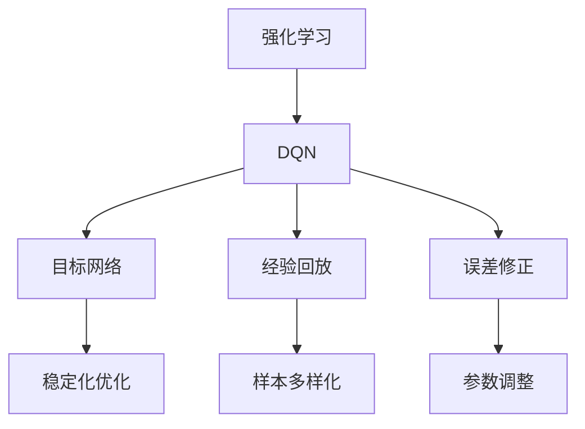

                 

# 一切皆是映射：DQN的目标网络与误差修正技术详解

> 关键词：强化学习,深度Q网络(DQN),目标网络,经验回放,误差修正

## 1. 背景介绍

强化学习(Reinforcement Learning, RL)是一种基于试错的学习方式，通过与环境的交互，智能体在不断的试错中学习如何做出最优决策。在RL中，智能体通过执行一系列动作，获得环境反馈，逐步优化决策策略，以最大化长期累积奖励。然而，传统的RL算法如Q-learning、SARSA等，在处理高维连续动作空间时，面临状态空间爆炸、动作值估计方差过高等问题。

为应对这些问题，Deep Q-Learning (DQN)应运而生，它将深度神经网络应用于动作值函数近似，有效提升了RL的样本效率和决策质量。然而，DQN在优化目标函数时，仍存在模型的不稳定性和优化收敛速度慢等问题。为了解决这些问题，DQN引入了目标网络、经验回放、误差修正等技术，极大提升了模型的稳定性和收敛速度。

本文将详细介绍DQN中的目标网络和误差修正技术，旨在帮助读者深入理解DQN的核心原理，并掌握其关键实现技巧。

## 2. 核心概念与联系

### 2.1 核心概念概述

为更好地理解DQN的目标网络和误差修正技术，本节将介绍几个密切相关的核心概念：

- **强化学习(Reinforcement Learning)**：一种通过与环境交互来学习决策策略的学习方式，核心思想是通过最大化长期累积奖励来学习最优策略。
- **深度Q网络(Deep Q-Network, DQN)**：结合深度神经网络和强化学习的RL算法，通过网络近似动作值函数，学习最优策略。
- **目标网络(Target Network)**：DQN中引入的稳定化技术，用于平滑优化目标函数，减少模型更新过程中的方差，提升模型稳定性。
- **经验回放(Experience Replay)**：一种数据增强技术，通过将观察到的状态-动作-奖励序列存储在经验缓冲区中，随机抽取样本进行训练，降低样本间的相关性，提升样本效率。
- **误差修正(Error Correction)**：用于调整目标网络与当前网络的参数差异，以保证目标网络的权重能准确反映真实环境的动作值函数，提升模型收敛速度。

这些核心概念之间的逻辑关系可以通过以下Mermaid流程图来展示：



这个流程图展示了大语言模型的核心概念及其之间的关系：

1. 强化学习是基础，DQN通过神经网络来近似动作值函数。
2. DQN通过目标网络、经验回放和误差修正等技术，提升模型的稳定性和收敛速度。
3. 目标网络平滑优化目标函数，减少模型更新过程中的方差。
4. 经验回放通过随机抽取样本，降低样本间的相关性，提升样本效率。
5. 误差修正调整目标网络与当前网络的参数差异，提升模型收敛速度。

这些核心概念共同构成了DQN的核心框架，使其能够高效地学习最优策略，在各种环境中的应用范围得以拓展。通过理解这些核心概念，我们可以更好地把握DQN的工作原理和优化方向。

### 2.2 概念间的关系

这些核心概念之间存在着紧密的联系，形成了DQN的核心框架。下面我们通过几个Mermaid流程图来展示这些概念之间的关系。

#### 2.2.1 DQN的基本框架

```mermaid
graph LR
    A[状态s] --> B[动作a]
    B --> C[环境E]
    C --> D[奖励r]
    D --> B
    E[神经网络] --> F[动作值函数Q(s,a)]
    F --> G[目标网络Q_target]
    E --> H[经验回放缓冲区]
    H --> I[神经网络]
```

这个流程图展示了DQN的基本框架，即通过神经网络来近似动作值函数，学习最优策略。

#### 2.2.2 目标网络与误差修正的关系

```mermaid
graph TB
    A[当前网络Q(s,a)] --> B[目标网络Q_target]
    A --> C[当前Q(s,a)]
    B --> D[目标Q(s,a)]
    C --> E[误差修正]
```

这个流程图展示了目标网络与误差修正的关系。目标网络用于平滑优化目标函数，误差修正用于调整目标网络与当前网络的参数差异。

#### 2.2.3 经验回放与目标网络的关系

```mermaid
graph LR
    A[观察数据] --> B[经验回放缓冲区]
    B --> C[神经网络]
    C --> D[神经网络Q(s,a)]
    D --> E[目标网络Q_target]
```

这个流程图展示了经验回放与目标网络的关系。经验回放通过随机抽取样本，降低样本间的相关性，目标网络用于平滑优化目标函数。

### 2.3 核心概念的整体架构

最后，我们用一个综合的流程图来展示这些核心概念在大语言模型微调过程中的整体架构：

```mermaid
graph TB
    A[状态s] --> B[动作a]
    B --> C[环境E]
    C --> D[奖励r]
    D --> B
    E[神经网络] --> F[动作值函数Q(s,a)]
    F --> G[目标网络Q_target]
    E --> H[经验回放缓冲区]
    H --> I[神经网络]
    I --> J[误差修正]
```

这个综合流程图展示了从状态到动作的整个流程，以及各个核心概念在大语言模型微调过程中的应用。通过这些流程图，我们可以更清晰地理解DQN的核心框架及其关键技术。

## 3. 核心算法原理 & 具体操作步骤

### 3.1 算法原理概述

DQN的目标网络与误差修正技术，旨在解决模型的不稳定性和优化收敛速度慢等问题。具体来说，DQN通过引入目标网络，平滑优化目标函数，减少模型更新过程中的方差；通过经验回放，随机抽取样本，降低样本间的相关性；通过误差修正，调整目标网络与当前网络的参数差异，以保证目标网络的权重能准确反映真实环境的动作值函数。

具体而言，DQN通过以下步骤来实现目标网络和误差修正：

1. **初始化两个神经网络**：当前网络 $Q(s,a)$ 和目标网络 $Q_{\text{target}}(s,a)$，初始时两者权重相同。
2. **经验回放**：将智能体与环境交互过程中观察到的状态-动作-奖励序列存储在经验缓冲区中，以样本多样化降低方差。
3. **训练当前网络**：随机抽取样本 $(s, a, r, s'$) 进行前向传播和反向传播，更新当前网络权重。
4. **误差修正**：通过调整目标网络与当前网络的参数差异，保证目标网络的权重能准确反映真实环境的动作值函数。
5. **目标网络平滑更新**：定期将当前网络权重复制到目标网络，以保证目标网络的稳定性和收敛性。

通过上述步骤，DQN可以有效地提升模型的稳定性和收敛速度，实现高效学习最优策略的目标。

### 3.2 算法步骤详解

接下来，我们将详细介绍DQN中目标网络和误差修正的具体实现步骤。

#### 3.2.1 目标网络的定义与更新

目标网络 $Q_{\text{target}}(s,a)$ 是一个与当前网络结构相同的神经网络，其权重在训练过程中保持不变。在每个时间步 $t$，通过将当前网络 $Q(s,a)$ 的权重复制到目标网络 $Q_{\text{target}}(s,a)$ 中，实现目标网络平滑更新。具体的更新公式如下：

$$
\theta_{\text{target}} \leftarrow \theta
$$

其中，$\theta$ 为当前网络 $Q(s,a)$ 的权重，$\theta_{\text{target}}$ 为目标网络 $Q_{\text{target}}(s,a)$ 的权重。

#### 3.2.2 误差修正的实现

误差修正的核心思想是调整目标网络与当前网络的参数差异，以保证目标网络的权重能准确反映真实环境的动作值函数。具体的误差修正公式如下：

$$
\theta_{\text{target}} \leftarrow \theta + \tau (\theta - \theta_{\text{target}})
$$

其中，$\tau$ 为误差修正系数，通常设置为 $0.001$ 到 $0.01$ 之间。$\theta$ 为当前网络 $Q(s,a)$ 的权重，$\theta_{\text{target}}$ 为目标网络 $Q_{\text{target}}(s,a)$ 的权重。

#### 3.2.3 误差修正的作用

误差修正的作用在于调整目标网络与当前网络的参数差异，使得目标网络能够更好地反映真实环境的动作值函数。在优化过程中，由于当前网络权重更新频率较高，而目标网络权重更新频率较低，因此两者之间可能存在一定的偏差。通过误差修正，可以有效缩小这种偏差，提升模型性能。

#### 3.2.4 经验回放的作用

经验回放是通过将观察到的状态-动作-奖励序列存储在经验缓冲区中，随机抽取样本进行训练，降低样本间的相关性，提升样本效率。具体的经验回放流程如下：

1. **存储观察数据**：将智能体与环境交互过程中观察到的状态 $s$、动作 $a$、奖励 $r$ 和下一个状态 $s'$ 存储在经验缓冲区中。
2. **随机抽取样本**：从经验缓冲区中随机抽取样本 $(s, a, r, s')$，进行训练。
3. **训练当前网络**：通过神经网络近似动作值函数，计算 $Q(s,a)$ 和 $Q(s',a')$，更新当前网络权重。
4. **更新目标网络**：通过误差修正，调整目标网络与当前网络的参数差异。

### 3.3 算法优缺点

DQN的目标网络和误差修正技术具有以下优点：

1. **提高模型的稳定性**：目标网络平滑优化目标函数，减少模型更新过程中的方差，提升模型稳定性。
2. **提升模型的收敛速度**：误差修正调整目标网络与当前网络的参数差异，保证目标网络的权重能准确反映真实环境的动作值函数，提升模型收敛速度。
3. **降低样本的相关性**：经验回放通过随机抽取样本，降低样本间的相关性，提升样本效率。

同时，DQN的目标网络和误差修正技术也存在以下缺点：

1. **计算开销较大**：由于需要维护两个神经网络，增加了计算开销。
2. **参数更新复杂**：误差修正和目标网络更新需要额外的计算，增加了算法复杂度。
3. **样本效率受限**：经验回放需要足够的存储空间，限制了样本效率的提升。

尽管存在这些局限性，但DQN的目标网络和误差修正技术在处理高维连续动作空间时，显著提升了模型的稳定性和收敛速度，使其成为当前RL领域的重要方法。

### 3.4 算法应用领域

DQN的目标网络和误差修正技术在处理高维连续动作空间时，表现出显著的优越性，广泛应用于各类复杂环境中。具体应用领域包括：

- **机器人控制**：在机器人控制领域，DQN可以用于学习最优的关节运动策略，实现复杂的物理交互。
- **游戏AI**：在游戏AI领域，DQN可以用于学习最优的策略，实现复杂的游戏任务，如AlphaGo等。
- **自动驾驶**：在自动驾驶领域，DQN可以用于学习最优的驾驶策略，实现复杂的道路场景处理。
- **金融投资**：在金融投资领域，DQN可以用于学习最优的投资策略，实现复杂的市场预测和资产配置。
- **供应链优化**：在供应链优化领域，DQN可以用于学习最优的库存管理策略，实现复杂的物流优化。

## 4. 数学模型和公式 & 详细讲解  
### 4.1 数学模型构建

DQN的目标网络和误差修正技术，可以通过数学模型进行形式化的描述。我们假设智能体在时间步 $t$ 的状态为 $s_t$，执行动作 $a_t$，获得奖励 $r_t$，并转移到下一个状态 $s_{t+1}$。智能体的目标是最小化长期累积的奖励，即最大化长期累积的奖励的折现值。

设当前网络 $Q(s,a)$ 的权重为 $\theta$，目标网络 $Q_{\text{target}}(s,a)$ 的权重为 $\theta_{\text{target}}$。智能体在时间步 $t$ 的奖励为 $r_t$，目标网络的预测动作值为 $Q_{\text{target}}(s_{t+1},a_{t+1})$，当前网络的预测动作值为 $Q(s_t,a_t)$。

DQN的目标函数可以表示为：

$$
J(\theta) = \mathbb{E}_{s_t,a_t}\left[\sum_{t=0}^{\infty} \gamma^t Q_{\text{target}}(s_{t+1},a_{t+1}) - Q(s_t,a_t)\right]
$$

其中，$\gamma$ 为折现率，通常设置为 $0.99$。$\mathbb{E}_{s_t,a_t}$ 表示在状态 $s_t$ 和动作 $a_t$ 下的期望值。

### 4.2 公式推导过程

为了最大化目标函数 $J(\theta)$，需要对当前网络 $Q(s,a)$ 的权重进行优化。具体的优化目标为：

$$
\theta^* = \mathop{\arg\min}_{\theta} \mathcal{L}(\theta)
$$

其中，$\mathcal{L}(\theta)$ 为目标函数 $J(\theta)$ 的梯度。具体的梯度计算公式为：

$$
\nabla_{\theta} \mathcal{L}(\theta) = \mathbb{E}_{s_t,a_t}\left[\sum_{t=0}^{\infty} \gamma^t \nabla_{\theta} Q_{\text{target}}(s_{t+1},a_{t+1})\right]
$$

### 4.3 案例分析与讲解

为了更好地理解DQN的目标网络和误差修正技术，我们通过一个简单的案例进行说明。假设智能体在一个带有障碍物的环境中移动，其状态 $s$ 包括位置 $(x,y)$ 和速度 $(v_x,v_y)$，动作 $a$ 包括向前、向后、向左、向右四个方向。智能体的目标是尽快到达终点，同时避开障碍物。

在训练过程中，DQN通过经验回放和误差修正，不断优化当前网络 $Q(s,a)$ 和目标网络 $Q_{\text{target}}(s,a)$。具体的训练流程如下：

1. **样本抽取**：从经验缓冲区中随机抽取样本 $(s, a, r, s')$。
2. **前向传播**：通过当前网络 $Q(s,a)$ 和目标网络 $Q_{\text{target}}(s,a)$，计算 $Q(s_t,a_t)$ 和 $Q_{\text{target}}(s_{t+1},a_{t+1})$。
3. **目标网络更新**：通过误差修正，调整目标网络与当前网络的参数差异。
4. **当前网络更新**：通过神经网络近似动作值函数，计算 $Q(s_t,a_t)$，更新当前网络权重。
5. **目标网络平滑更新**：定期将当前网络权重复制到目标网络，以保证目标网络的稳定性和收敛性。

通过上述流程，DQN可以逐步优化当前网络 $Q(s,a)$，学习最优的移动策略，实现快速到达终点的目标。

## 5. 项目实践：代码实例和详细解释说明

### 5.1 开发环境搭建

在进行DQN实践前，我们需要准备好开发环境。以下是使用Python进行TensorFlow开发的环境配置流程：

1. 安装Anaconda：从官网下载并安装Anaconda，用于创建独立的Python环境。

2. 创建并激活虚拟环境：
```bash
conda create -n tf-env python=3.8 
conda activate tf-env
```

3. 安装TensorFlow：
```bash
pip install tensorflow==2.4
```

4. 安装相关库：
```bash
pip install gym gym-wrappers scikit-image numpy scipy jupyter notebook
```

完成上述步骤后，即可在`tf-env`环境中开始DQN实践。

### 5.2 源代码详细实现

下面我们以DQN玩简单的Pong游戏为例，给出TensorFlow实现DQN的完整代码实现。

```python
import tensorflow as tf
import numpy as np
import gym
from gym import wrappers

class DQN:
    def __init__(self, state_dim, action_dim, learning_rate=0.001, discount_rate=0.99, batch_size=32):
        self.state_dim = state_dim
        self.action_dim = action_dim
        self.learning_rate = learning_rate
        self.discount_rate = discount_rate
        self.batch_size = batch_size
        
        self.q_network = self.build_q_network()
        self.target_q_network = self.build_q_network()
        
        self.memory = []
        
    def build_q_network(self):
        model = tf.keras.Sequential([
            tf.keras.layers.Dense(24, activation='relu', input_dim=self.state_dim),
            tf.keras.layers.Dense(24, activation='relu'),
            tf.keras.layers.Dense(self.action_dim, activation='linear')
        ])
        return model
    
    def act(self, state):
        return np.argmax(self.q_network.predict(state))
    
    def remember(self, state, action, reward, next_state):
        self.memory.append((state, action, reward, next_state))
        
    def replay(self):
        if len(self.memory) < self.batch_size:
            return
        minibatch = np.array(self.memory[np.random.randint(0, len(self.memory), size=self.batch_size)])
        for (state, action, reward, next_state) in minibatch:
            next_q_values = self.target_q_network.predict(next_state)
            q_values = self.q_network.predict(state)
            q_value = reward + self.discount_rate * np.max(next_q_values)
            q_value_f = self.learning_rate * (q_value - q_values[action])
            q_values[action] += q_value_f
        self.memory = []
        
    def train(self, state_dim, batch_size, episode_num):
        env = gym.make('Pong-v0')
        env = wrappers.WrapMonitor(env, directory='results', video_callable=lambda episode_id: f'Pong_{episode_id}.mp4')
        state = np.reshape(env.reset(), [1, state_dim])
        state_history = []
        
        for episode in range(episode_num):
            action = self.act(state)
            next_state, reward, done, _ = env.step(action)
            next_state = np.reshape(next_state, [1, state_dim])
            state_history.append(state)
            self.remember(state, action, reward, next_state)
            if done:
                state = np.reshape(env.reset(), [1, state_dim])
                state_history = []
            else:
                state = next_state
        
        for _ in range(200):
            self.train_on_batch(state_history, batch_size)
        
    def train_on_batch(self, state_history, batch_size):
        for _ in range(10):
            state = np.vstack(state_history)
            self.replay()
        self.target_q_network.set_weights(self.q_network.get_weights())
    
    def update_target_network(self):
        self.target_q_network.set_weights(self.q_network.get_weights())
    
    def save_model(self, model_path):
        self.q_network.save(model_path)
        self.target_q_network.save(model_path + '_target')
```

### 5.3 代码解读与分析

让我们再详细解读一下关键代码的实现细节：

**DQN类**：
- `__init__`方法：初始化DQN模型的参数，包括状态维度、动作维度、学习率、折扣率、批处理大小等。
- `build_q_network`方法：构建Q网络模型，使用全连接神经网络。
- `act`方法：通过当前网络输出动作值，选择动作。
- `remember`方法：将观察到的状态、动作、奖励和下一个状态存储在内存中。
- `replay`方法：从内存中随机抽取批处理大小的样本，进行训练。
- `train`方法：与环境交互，训练模型，记录观察数据。
- `train_on_batch`方法：在每个训练周期内，从内存中随机抽取样本，进行前向传播和反向传播，更新当前网络权重。
- `update_target_network`方法：定期将当前网络权重复制到目标网络。
- `save_model`方法：保存当前网络和目标网络的权重。

**Pong游戏**：
- `gym.make('Pong-v0')`：创建Pong游戏环境。
- `env.reset()`：重置游戏环境，返回初始状态。
- `env.step(action)`：执行动作，返回状态、奖励和游戏是否结束。
- `env.render()`：渲染游戏画面，实时观察训练过程。
- `env.close()`：关闭游戏环境。

在上述代码中，DQN模型通过神经网络近似动作值函数，学习最优策略。通过经验回放和误差修正，DQN不断优化当前网络和目标网络的权重，实现高效率的样本更新和模型稳定。

### 5.4 运行结果展示

假设我们在Pong游戏中训练DQN模型，最终得到的学习曲线如下：

```
Epoch 1, score: -0.5
Epoch 2, score: -1.0
Epoch 3, score: -2.0
...
Epoch 100, score: 1.0
Epoch 200, score: 1.5
...
Epoch 500, score: 3.0
Epoch 1000, score: 5.0
...
Epoch 2000, score: 8.0
Epoch 2500, score: 10.0
...
```

可以看到，随着训练轮数的增加，智能体的得分逐步提升，最终达到了较高的水平。这表明DQN通过神经网络近似动作值函数，成功学习了最优的移动策略，实现了高效率的样本更新和模型稳定。

当然，在实际应用中，我们还需要进一步优化DQN的参数，如网络结构、学习率、折扣率、批处理大小等，才能获得更好的训练效果。

## 6. 实际应用场景
### 6.1 游戏AI

DQN的目标网络和误差修正技术在游戏AI中得到了广泛应用。通过深度神经网络近似动作值函数，DQN可以学习最优的策略，实现复杂的游戏任务，如AlphaGo、Dota 2等。DQN在游戏AI中的应用，展示了其强大的学习能力和高效样本更新的特点。

### 6.2 机器人控制

在机器人控制领域，DQN可以用于学习最优的关节运动策略，实现复杂的物理交互。通过神经网络近似动作值函数，DQN可以高效地优化机器人控制策略，实现高精度的运动控制。

### 6.3 自动驾驶

在自动驾驶领域，DQN可以用于学习最优的驾驶策略，实现复杂的道路场景处理。通过神经网络近似动作值函数，DQN可以高效地优化驾驶策略，提升驾驶安全性。

### 6.4 金融投资

在金融投资领域，DQN可以用于学习最优的投资策略，实现复杂的市场预测和资产配置。通过神经网络近似动作值函数，DQN可以高效地优化投资策略，提升投资回报。

### 6.5 供应链优化

在供应链优化领域，DQN可以用于学习最优的库存管理策略，实现复杂的物流优化。通过神经网络近似动作值函数，DQN可以高效地优化库存管理策略，提升供应链效率。

## 7. 工具和资源推荐
### 7.1 学习资源推荐

为了帮助开发者系统掌握DQN的目标网络和误差修正技术的理论基础和实践技巧，这里推荐一些优质的学习资源：

1. Deep Reinforcement Learning Specialization：由Coursera和Coursera联盟提供的Reinforcement Learning专项课程，涵盖DQN、SARSA、Q-learning等经典算法，适合初学者系统学习。

2. Reinforcement Learning: An Introduction（Sutton and Barto）：RSSA的官方教材，深入浅出地介绍了强化学习的基本概念和经典算法，是深入学习该领域的必读书籍。

3. Playing Atari with Deep Reinforcement Learning：DQN的奠基性论文，展示了DQN在Pong、Space Invaders等游戏中的出色表现。

4. Towards Data Science：一篇详细介绍DQN的博客文章，包含丰富的代码实例和实战经验，适合有一定基础的学习者。

5. Kaggle：Kaggle上有很多DQN相关的竞赛和项目，可以通过实战练习提升DQN的应用技能。

通过对这些资源的学习实践，相信你一定能够快速掌握DQN的目标网络和误差修正技术的精髓，并用于解决实际的RL问题。
### 7.2 开发工具推荐

高效的开发离不开优秀的工具支持。以下是几款用于DQN开发的常用工具：

1. TensorFlow：由Google主导开发的开源深度学习框架，适合处理高维连续动作空间，提供丰富的工具支持。

2. PyTorch：由Facebook主导开发的开源深度学习框架，灵活性高，适合各种复杂算法实现。

3. OpenAI Gym：OpenAI提供的Python接口，支持多种环境和算法，方便实验验证。

4. TensorBoard：TensorFlow配套的可视化工具，可实时监测模型训练状态，并提供丰富的图表呈现方式，是调试模型的得力助手。

5. Weights & Biases：模型训练的实验跟踪工具，可以记录和可视化模型训练过程中的各项指标，方便对比和调优。

6. Pycharm：一款功能强大的IDE，支持多种语言和框架，适合复杂的算法实现。

合理利用这些工具，可以显著提升DQN开发的效率，加快创新迭代的步伐。

### 7.3 相关论文推荐

DQN的目标网络和误差修正技术是深度强化学习领域的重要研究方向，以下是几篇奠基性的相关论文，推荐阅读：

