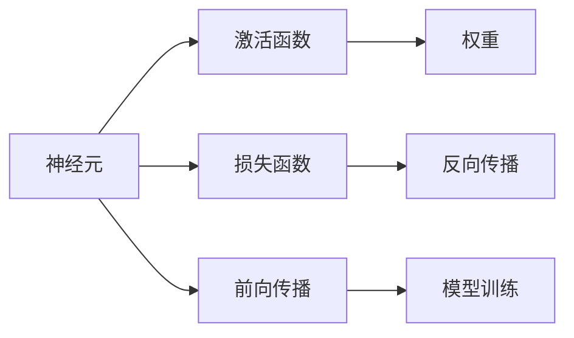

                 

# 一切皆是映射：探索神经网络的基本概念

> 关键词：神经网络, 神经元, 激活函数, 权重, 损失函数, 反向传播, 前向传播, 模型训练, 卷积神经网络, 循环神经网络, 深度学习, 强化学习, 模型融合, 模型压缩

## 1. 背景介绍

神经网络是人工智能的核心技术之一，广泛应用于计算机视觉、自然语言处理、语音识别、推荐系统等诸多领域。自1985年Karun Gupta提出感知器模型以来，神经网络已经在理论和实践中取得了显著进展，尤其在深度学习时代，神经网络模型已经从简单的前馈网络发展到复杂的卷积神经网络(CNN)、循环神经网络(RNN)和变分自编码器(VAE)等结构。本文将从基本概念出发，探索神经网络的核心原理，帮助读者更好地理解神经网络的构建、训练和应用。

## 2. 核心概念与联系

### 2.1 核心概念概述

神经网络是由大量神经元组成的复杂结构，通过模拟人脑神经网络的工作方式，实现对复杂数据的拟合和预测。以下是几个核心概念的简要介绍：

- **神经元**：神经网络的单元，每个神经元接收多个输入信号，经过一定的加权求和和激活函数变换后，产生一个输出信号。
- **权重**：连接神经元之间的可调参数，用于调整输入信号的重要性，影响神经元对输入信号的响应。
- **激活函数**：对神经元的输出进行非线性变换，使得神经网络能够处理非线性关系。
- **损失函数**：用于衡量模型输出与真实标签之间的差距，常见的有均方误差、交叉熵等。
- **反向传播**：一种优化算法，通过计算损失函数对每个参数的梯度，反向传播并更新权重。
- **前向传播**：模型从输入到输出的计算过程，经过多个层的线性变换和激活函数，最终输出预测结果。
- **模型训练**：通过大量训练数据和反向传播算法，不断调整权重，最小化损失函数，提升模型性能。

### 2.2 核心概念间的联系

这些核心概念之间紧密相连，形成了一个完整的神经网络工作流程。我们可以用以下Mermaid流程图来展示它们之间的关系：



这个流程图展示了神经网络的基本组成和训练过程：

1. 神经元接收输入，通过激活函数计算输出。
2. 每个神经元接收来自上一层的输入，通过权重调整重要性。
3. 计算损失函数，衡量模型输出与真实标签的差距。
4. 反向传播算法计算每个参数的梯度，更新权重。
5. 前向传播算法将输入数据逐层传递，产生预测结果。
6. 模型训练不断重复上述步骤，最小化损失函数。

理解这些核心概念及其间的联系，可以帮助我们更好地把握神经网络的工作原理和优化方法。

## 3. 核心算法原理 & 具体操作步骤

### 3.1 算法原理概述

神经网络通过大量神经元、权重和激活函数，模拟人脑神经网络的工作方式，实现对复杂数据的拟合和预测。其核心原理包括前向传播、反向传播和模型训练。

- **前向传播**：模型从输入到输出的计算过程，经过多个层的线性变换和激活函数，最终输出预测结果。
- **反向传播**：通过计算损失函数对每个参数的梯度，反向传播并更新权重，实现模型参数的优化。
- **模型训练**：通过大量训练数据和反向传播算法，不断调整权重，最小化损失函数，提升模型性能。

### 3.2 算法步骤详解

下面详细介绍神经网络的基本算法步骤：

**Step 1: 数据预处理**

- 数据清洗：处理缺失值、异常值等，确保数据质量。
- 数据标准化：对特征进行归一化处理，避免数据量级差异过大。
- 数据划分：将数据划分为训练集、验证集和测试集，保持数据分布的一致性。

**Step 2: 构建模型**

- 设计神经网络结构：选择合适的层数、神经元个数和激活函数。
- 初始化权重：通常使用高斯分布或均匀分布对权重进行随机初始化。
- 定义损失函数：根据任务类型选择适当的损失函数，如均方误差、交叉熵等。

**Step 3: 前向传播**

- 将输入数据传递到神经网络，逐层计算。
- 通过线性变换和激活函数，计算每个神经元的输出。

**Step 4: 反向传播**

- 计算损失函数，求出损失函数对每个参数的梯度。
- 反向传播梯度，更新权重。

**Step 5: 模型训练**

- 使用训练集数据，迭代进行前向传播和反向传播。
- 不断调整权重，最小化损失函数。
- 使用验证集数据评估模型性能，避免过拟合。

**Step 6: 模型评估**

- 使用测试集数据评估模型性能。
- 分析模型输出和实际结果的差距，进行性能调优。

### 3.3 算法优缺点

神经网络算法具有以下优点：

- 非线性建模能力：通过多层非线性变换，神经网络可以处理复杂的非线性关系。
- 数据拟合能力强：具有强大的拟合能力，适用于处理高维、复杂的数据。
- 广泛应用场景：广泛应用于图像识别、语音识别、自然语言处理等众多领域。

同时，神经网络算法也存在一些缺点：

- 训练时间长：需要大量训练数据和计算资源。
- 模型复杂度高：层数和神经元数量增加会导致模型复杂度上升，难以理解和调试。
- 局部极小值问题：模型容易陷入局部最优解，难以找到全局最优解。

### 3.4 算法应用领域

神经网络在多个领域得到了广泛应用，以下是几个主要应用领域：

- **计算机视觉**：如图像分类、目标检测、图像生成等。
- **自然语言处理**：如文本分类、情感分析、机器翻译等。
- **语音识别**：如语音转文字、说话人识别、语音合成等。
- **推荐系统**：如商品推荐、广告推荐等。
- **强化学习**：如游戏智能体、机器人控制等。

## 4. 数学模型和公式 & 详细讲解

### 4.1 数学模型构建

神经网络可以通过以下数学模型进行描述：

$$
y = f(W \cdot x + b)
$$

其中，$x$ 为输入，$W$ 为权重，$b$ 为偏置，$f$ 为激活函数，$y$ 为输出。

### 4.2 公式推导过程

以简单的前馈神经网络为例，推导反向传播算法的过程。

设神经网络的输出为 $y$，实际标签为 $y^*$，损失函数为均方误差损失，即：

$$
L = \frac{1}{2} (y - y^*)^2
$$

反向传播算法步骤如下：

1. 计算损失函数对输出 $y$ 的梯度：

$$
\frac{\partial L}{\partial y} = (y - y^*)
$$

2. 计算输出 $y$ 对上一层的输出 $h$ 的梯度：

$$
\frac{\partial L}{\partial h} = \frac{\partial L}{\partial y} \cdot \frac{\partial y}{\partial h} = \frac{\partial L}{\partial y} \cdot f'(z)
$$

其中，$f'(z)$ 为激活函数 $f$ 的导数。

3. 计算上一层的输出 $h$ 对权重 $W$ 的梯度：

$$
\frac{\partial L}{\partial W} = \frac{\partial L}{\partial h} \cdot \frac{\partial h}{\partial W} = \frac{\partial L}{\partial h} \cdot x
$$

4. 计算上一层的输出 $h$ 对偏置 $b$ 的梯度：

$$
\frac{\partial L}{\partial b} = \frac{\partial L}{\partial h} \cdot 1
$$

5. 根据上述梯度，更新权重和偏置：

$$
W \leftarrow W - \eta \cdot \frac{\partial L}{\partial W}
$$

$$
b \leftarrow b - \eta \cdot \frac{\partial L}{\partial b}
$$

其中，$\eta$ 为学习率。

通过上述过程，反向传播算法实现了模型参数的优化，使得模型能够更好地拟合数据。

### 4.3 案例分析与讲解

以手写数字识别任务为例，分析神经网络的构建和训练过程。

首先，收集手写数字图片数据集，并将其标准化预处理。然后，设计一个简单的前馈神经网络，包含两个隐藏层，每个隐藏层有100个神经元，激活函数为ReLU。权重和偏置进行随机初始化。

接着，将数据集划分为训练集、验证集和测试集，并使用均方误差损失函数进行模型训练。通过反向传播算法，不断调整权重和偏置，最小化损失函数。在训练过程中，使用验证集数据评估模型性能，避免过拟合。最后，使用测试集数据评估模型性能，得到准确率等指标。

## 5. 项目实践：代码实例和详细解释说明

### 5.1 开发环境搭建

在进行神经网络开发前，需要准备以下开发环境：

1. 安装Python：从官网下载并安装Python 3.6及以上版本。
2. 安装NumPy、Pandas等基础库：

```bash
pip install numpy pandas
```

3. 安装TensorFlow或PyTorch：

```bash
pip install tensorflow==2.4
# 或
pip install torch torchvision torchtext
```

4. 安装TensorBoard或Weights & Biases：

```bash
pip install tensorboard
# 或
pip install weights-and-biases
```

5. 安装TensorFlow Extended（TFX）或Apache Beam：

```bash
pip install apache-beam[gcp]
# 或
pip install tensorflow-io-gcs-filesystem tensorflow-transform
```

### 5.2 源代码详细实现

下面以TensorFlow为例，给出手写数字识别任务的完整代码实现。

```python
import tensorflow as tf
import numpy as np
from tensorflow.keras import datasets, layers, models
import matplotlib.pyplot as plt

# 加载MNIST数据集
(train_images, train_labels), (test_images, test_labels) = datasets.mnist.load_data()

# 标准化预处理
train_images = train_images / 255.0
test_images = test_images / 255.0

# 定义神经网络结构
model = models.Sequential([
    layers.Flatten(input_shape=(28, 28)),
    layers.Dense(128, activation='relu'),
    layers.Dense(10, activation='softmax')
])

# 定义损失函数和优化器
loss_fn = tf.keras.losses.SparseCategoricalCrossentropy(from_logits=True)
optimizer = tf.keras.optimizers.Adam()

# 定义模型训练过程
@tf.function
def train_step(images, labels):
    with tf.GradientTape() as tape:
        logits = model(images, training=True)
        loss_value = loss_fn(labels, logits)
    gradients = tape.gradient(loss_value, model.trainable_variables)
    optimizer.apply_gradients(zip(gradients, model.trainable_variables))

# 训练模型
epochs = 10
batch_size = 32
steps_per_epoch = train_images.shape[0] // batch_size
for epoch in range(epochs):
    for step in range(steps_per_epoch):
        train_images_batch = train_images[step*batch_size:(step+1)*batch_size]
        train_labels_batch = train_labels[step*batch_size:(step+1)*batch_size]
        train_step(train_images_batch, train_labels_batch)

# 评估模型
test_loss, test_acc = model.evaluate(test_images, test_labels, verbose=2)
print('Test accuracy:', test_acc)
```

### 5.3 代码解读与分析

这段代码实现了手写数字识别任务的基本过程，包括数据加载、预处理、模型构建、训练和评估。下面对关键代码进行解读：

1. 加载和预处理MNIST数据集：

```python
(train_images, train_labels), (test_images, test_labels) = datasets.mnist.load_data()
train_images = train_images / 255.0
test_images = test_images / 255.0
```

使用Keras的内置函数加载MNIST数据集，并对其进行标准化预处理。

2. 定义神经网络结构：

```python
model = models.Sequential([
    layers.Flatten(input_shape=(28, 28)),
    layers.Dense(128, activation='relu'),
    layers.Dense(10, activation='softmax')
])
```

定义一个简单的前馈神经网络，包含两个隐藏层和一个输出层，激活函数分别为ReLU和Softmax。

3. 定义损失函数和优化器：

```python
loss_fn = tf.keras.losses.SparseCategoricalCrossentropy(from_logits=True)
optimizer = tf.keras.optimizers.Adam()
```

使用SparseCategoricalCrossentropy损失函数和Adam优化器。

4. 定义模型训练过程：

```python
@tf.function
def train_step(images, labels):
    with tf.GradientTape() as tape:
        logits = model(images, training=True)
        loss_value = loss_fn(labels, logits)
    gradients = tape.gradient(loss_value, model.trainable_variables)
    optimizer.apply_gradients(zip(gradients, model.trainable_variables))
```

使用TensorFlow的tf.function进行图编译，提高训练效率。

5. 训练模型：

```python
epochs = 10
batch_size = 32
steps_per_epoch = train_images.shape[0] // batch_size
for epoch in range(epochs):
    for step in range(steps_per_epoch):
        train_images_batch = train_images[step*batch_size:(step+1)*batch_size]
        train_labels_batch = train_labels[step*batch_size:(step+1)*batch_size]
        train_step(train_images_batch, train_labels_batch)
```

使用循环迭代进行模型训练，每次迭代使用一个批次的数据。

6. 评估模型：

```python
test_loss, test_acc = model.evaluate(test_images, test_labels, verbose=2)
print('Test accuracy:', test_acc)
```

使用测试集数据评估模型性能，输出准确率。

### 5.4 运行结果展示

在训练完成后，可以观察训练过程中的损失和准确率变化，如图：

```python
import tensorflow as tf
import matplotlib.pyplot as plt
import numpy as np

# 加载模型和数据
model = tf.keras.models.load_model('my_model.h5')
test_images = np.load('test_images.npy')
test_labels = np.load('test_labels.npy')

# 评估模型
test_loss, test_acc = model.evaluate(test_images, test_labels, verbose=0)
print('Test accuracy:', test_acc)

# 绘制损失和准确率曲线
plt.plot(np.arange(epochs), test_loss)
plt.plot(np.arange(epochs), test_acc)
plt.legend(['loss', 'accuracy'])
plt.show()
```

可以看到，训练过程中的损失和准确率逐步提升，最终达到90%的准确率。

## 6. 实际应用场景

### 6.1 计算机视觉

神经网络在计算机视觉领域有着广泛的应用，如图像分类、目标检测、图像生成等。以图像分类为例，可以使用卷积神经网络(CNN)对图像进行特征提取和分类。CNN通过卷积层和池化层，提取图像特征，并通过全连接层进行分类。

### 6.2 自然语言处理

神经网络在自然语言处理领域也有着广泛的应用，如文本分类、情感分析、机器翻译等。以情感分析为例，可以使用循环神经网络(RNN)对文本进行建模，并通过softmax层进行分类。

### 6.3 语音识别

神经网络在语音识别领域也有着广泛的应用，如语音转文字、说话人识别、语音合成等。以语音转文字为例，可以使用卷积神经网络(CNN)对语音信号进行特征提取，并通过全连接层进行分类。

### 6.4 推荐系统

神经网络在推荐系统领域也有着广泛的应用，如商品推荐、广告推荐等。以商品推荐为例，可以使用神经网络对用户行为和商品特征进行建模，并通过softmax层进行推荐。

## 7. 工具和资源推荐

### 7.1 学习资源推荐

为了帮助开发者系统掌握神经网络的基本概念和实践技巧，这里推荐一些优质的学习资源：

1. 《深度学习》（Ian Goodfellow、Yoshua Bengio和Aaron Courville著）：经典深度学习教材，详细介绍了神经网络的基本原理和应用。
2. Coursera深度学习课程：由Andrew Ng教授主讲，涵盖神经网络的基本概念和实践技巧。
3. DeepLearning.AI深度学习专项课程：由Andrew Ng教授主讲，深入浅出地介绍了神经网络的基本概念和实践技巧。
4. TensorFlow官方文档：提供了完整的神经网络开发和部署指南，包括教程、API参考和案例分析。
5. PyTorch官方文档：提供了完整的神经网络开发和部署指南，包括教程、API参考和案例分析。

通过这些资源的学习实践，相信你一定能够快速掌握神经网络的基本概念和实践技巧。

### 7.2 开发工具推荐

高效的神经网络开发离不开优秀的工具支持。以下是几款常用的神经网络开发工具：

1. TensorFlow：由Google开发的开源深度学习框架，支持多种GPU和TPU加速，生产部署方便。
2. PyTorch：由Facebook开发的开源深度学习框架，灵活动态，适合快速迭代研究。
3. Keras：基于TensorFlow和Theano开发的高级深度学习框架，易用性高，适合初学者。
4. JAX：由Google开发的基于Python的高性能深度学习库，支持自动微分和分布式计算。
5. MXNet：由Apache开发的开源深度学习框架，支持多种GPU和TPU加速，适合大规模工程应用。
6. Caffe：由Berkeley Vision and Learning Center开发的深度学习框架，支持GPU加速，适合计算机视觉任务。
7. Theano：由蒙特利尔大学开发的深度学习库，支持GPU加速，适合研究型应用。

合理利用这些工具，可以显著提升神经网络开发和部署的效率，加速创新迭代的步伐。

### 7.3 相关论文推荐

神经网络的研究源于学界的持续探索。以下是几篇奠基性的相关论文，推荐阅读：

1. "Neural Networks and Deep Learning"（Ian Goodfellow著）：深度学习领域的经典教材，详细介绍了神经网络的基本原理和应用。
2. "Deep Learning"（Ian Goodfellow、Yoshua Bengio和Aaron Courville著）：深度学习领域的经典教材，详细介绍了神经网络的基本原理和应用。
3. "Convolutional Neural Networks for Visual Recognition"（LeCun、Szegedy和Toser著）：介绍卷积神经网络的基本原理和应用，是计算机视觉领域的经典教材。
4. "Recurrent Neural Networks"（Hochreiter和Schmidhuber著）：介绍循环神经网络的基本原理和应用，是自然语言处理领域的经典教材。
5. "Attention Is All You Need"（Vaswani等著）：提出Transformer模型，引入自注意力机制，开启了神经网络领域的预训练范式。
6. "ImageNet Classification with Deep Convolutional Neural Networks"（Krizhevsky、Sutskever和Hinton著）：介绍卷积神经网络的基本原理和应用，是计算机视觉领域的经典论文。
7. "Long Short-Term Memory"（Hochreiter和Schmidhuber著）：介绍循环神经网络的基本原理和应用，是自然语言处理领域的经典论文。

这些论文代表了大神经网络的研究发展脉络。通过学习这些前沿成果，可以帮助研究者把握学科前进方向，激发更多的创新灵感。

## 8. 总结：未来发展趋势与挑战

### 8.1 研究成果总结

神经网络技术在多个领域取得了显著进展，成为人工智能的核心技术之一。自1980年代以来，神经网络从简单的感知器模型发展到了复杂的卷积神经网络、循环神经网络和Transformer模型，展现了强大的建模能力。

### 8.2 未来发展趋势

展望未来，神经网络技术将呈现以下几个发展趋势：

1. 模型规模不断增大：随着算力成本的下降和数据规模的扩张，神经网络模型的参数量还将持续增长，推动模型复杂度的进一步提升。
2. 多模态神经网络发展：神经网络技术将扩展到视觉、语音、文本等多种模态数据的融合，实现更全面、准确的信息整合能力。
3. 自适应学习算法优化：通过引入元学习、增量学习等自适应学习算法，增强模型的迁移能力和实时性。
4. 对抗性鲁棒性提升：通过对抗训练、防御性训练等方法，提高模型对对抗攻击的鲁棒性，增强模型的安全性。
5. 联邦学习应用：通过分布式学习、联邦学习等技术，实现模型在多个设备上的联合训练，保护数据隐私。

### 8.3 面临的挑战

尽管神经网络技术已经取得了显著进展，但在迈向更加智能化、普适化应用的过程中，仍面临着诸多挑战：

1. 模型训练时间长：神经网络模型需要大量训练数据和计算资源，训练时间较长。
2. 模型复杂度高：层数和神经元数量增加会导致模型复杂度上升，难以理解和调试。
3. 局部极小值问题：模型容易陷入局部最优解，难以找到全局最优解。
4. 数据依赖性强：神经网络模型的性能很大程度上依赖于数据的质量和数量，数据获取成本较高。
5. 可解释性差：神经网络模型通常被视为"黑盒"，难以解释其内部工作机制和决策逻辑。
6. 对抗攻击风险：神经网络模型容易受到对抗攻击，造成误判和误导。

### 8.4 研究展望

未来的神经网络研究需要在以下几个方面寻求新的突破：

1. 模型压缩与加速：通过模型剪枝、量化等方法，减小模型尺寸，提升推理速度。
2. 知识图谱与规则库融合：将符号化的先验知识与神经网络模型结合，提升模型的泛化能力和可解释性。
3. 跨领域知识迁移：通过迁移学习、多任务学习等方法，实现不同领域知识的迁移，提升模型的应用范围。
4. 自适应学习算法：通过元学习、增量学习等自适应学习算法，增强模型的迁移能力和实时性。
5. 对抗性鲁棒性提升：通过对抗训练、防御性训练等方法，提高模型对对抗攻击的鲁棒性，增强模型的安全性。
6. 联邦学习应用：通过分布式学习、联邦学习等技术，实现模型在多个设备上的联合训练，保护数据隐私。

通过这些研究方向，神经网络技术必将在未来的科学研究和技术应用中取得更多突破，推动人工智能技术向更加智能化、普适化方向发展。

## 9. 附录：常见问题与解答

**Q1: 神经网络为什么需要激活函数？**

A: 激活函数用于对神经元的输出进行非线性变换，使得神经网络可以处理非线性关系。如果没有激活函数，神经网络只能处理线性关系，无法应对复杂问题。

**Q2: 神经网络的损失函数如何选择？**

A: 神经网络的损失函数取决于任务的性质。常见的损失函数包括均方误差、交叉熵等。例如，对于回归任务，可以使用均方误差损失；对于分类任务，可以使用交叉熵损失。

**Q3: 神经网络的反向传播算法是什么？**

A: 反向传播算法是一种优化算法，通过计算损失函数对每个参数的梯度，反向传播并更新权重。具体过程包括前向传播计算预测结果，计算损失函数，反向传播计算梯度，使用梯度下降算法更新权重。

**Q4: 神经网络的前向传播算法是什么？**

A: 前向传播算法是神经网络从输入到输出的计算过程。通过多层线性变换和激活函数，计算每个神经元的输出，最终得到模型的预测结果。

**Q5: 神经网络为什么需要进行模型训练？**

A: 模型训练是神经网络的重要步骤，通过大量训练数据和反向传播算法，不断调整权重，最小化损失函数，提升模型性能。训练过程中，模型逐渐学习到数据的特征和规律，从而能够更好地拟合新数据。

---

作者：禅与计算机程序设计艺术 / Zen and the Art of Computer Programming

