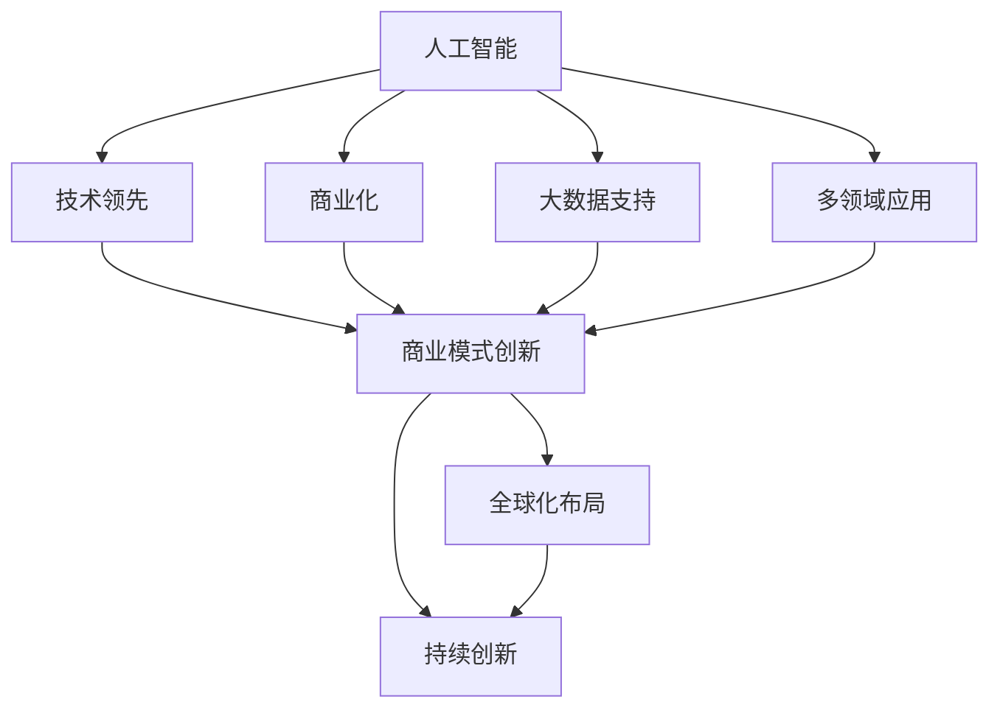

                 

## 1. 背景介绍

### 1.1 问题由来

近年来，人工智能（AI）产业呈现出爆发式增长，涌现出了多家独角兽企业。这些企业通过自主研发或收购创新技术，迅速在市场中占据领先地位。诸如OpenAI、DeepMind、Microsoft AI、Google AI、Amazon AWS AI等企业，已经在各个AI应用领域取得了举世瞩目的成绩。

这些独角兽企业不仅在技术上领先，更在商业模式上创新，形成了良性循环，实现了商业上的巨大成功。它们的崛起，不仅仅是因为技术优势，更是凭借着出色的团队、前瞻的战略和持续的投入，成为AI产业的领头羊。

### 1.2 问题核心关键点

AI独角兽企业的成功，可以归纳为以下几点核心关键点：

1. **技术领先**：这些企业拥有顶尖的技术人才和丰富的科研积累，能够不断推出具有突破性的AI技术。
2. **商业模式创新**：这些企业能够基于技术优势，探索新的商业模式，实现商业价值最大化。
3. **大数据支持**：数据是AI发展的关键，这些企业往往拥有庞大的数据集，能够为模型训练提供坚实基础。
4. **多领域应用**：这些企业通过技术赋能多个垂直行业，实现了跨领域的广泛应用。
5. **全球化布局**：这些企业不仅在国内市场表现强劲，更在全球范围内拓展业务，形成广泛的市场影响力。
6. **持续创新**：这些企业不断进行技术研发和市场创新，保持行业领先地位。

理解这些核心关键点，有助于我们深入探索AI独角兽企业的成功之路，为其提供有力的借鉴和指导。

### 1.3 问题研究意义

研究AI独角兽企业的成功经验，对于AI产业的发展具有重要意义：

1. **加速产业进步**：了解成功企业的策略和技术，能够推动AI产业的快速发展和创新。
2. **优化资源配置**：通过研究这些企业的商业模式和市场策略，优化资源的分配和利用。
3. **提升竞争力**：借鉴成功企业的经验，提升其他企业竞争力，加速追赶步伐。
4. **社会价值**：AI技术的广泛应用将带来深远社会影响，研究成功企业有助于实现这一价值。

## 2. 核心概念与联系

### 2.1 核心概念概述

为更好地理解AI独角兽企业，我们将介绍几个核心概念，并阐明它们之间的联系：

- **人工智能（AI）**：使用计算机算法和统计模型，赋予机器学习、推理和自我修正能力的科技。
- **独角兽企业**：指市值超过10亿美元、成立不到10年且未上市的科技创业公司。
- **商业化**：将技术或产品从研究实验室应用到实际市场中，实现商业价值。
- **跨领域应用**：将AI技术应用于不同行业，提升各行业效率和创新能力。
- **持续创新**：不断推出新技术和新产品，保持行业领先地位。

这些核心概念构成了AI独角兽企业的基本框架，帮助理解其成功路径和未来发展方向。

### 2.2 概念间的关系

这些核心概念之间的联系可以通过以下Mermaid流程图来展示：



这个流程图展示了核心概念之间的逻辑关系：

1. 人工智能是基础，通过技术领先和商业模式创新，实现商业化。
2. 大数据支持是技术发展的关键，与多领域应用相结合，进一步推动商业模式创新。
3. 全球化布局和持续创新是企业保持竞争力的重要策略，实现跨越式发展。

这些概念共同构成了AI独角兽企业的成功要素，为后续深入分析其成功之路提供了理论基础。

## 3. 核心算法原理 & 具体操作步骤

### 3.1 算法原理概述

AI独角兽企业的成功，与其在核心算法和操作步骤上的创新密不可分。以下是几个核心算法的概述：

1. **深度学习算法**：使用神经网络进行多层次特征提取，提升模型表达能力。
2. **强化学习算法**：通过奖励机制，优化模型行为策略，提升决策效果。
3. **自然语言处理（NLP）算法**：如Transformer架构、BERT模型，用于理解和生成自然语言。
4. **计算机视觉算法**：如卷积神经网络（CNN）、循环神经网络（RNN），用于图像和视频处理。
5. **机器学习算法**：如随机森林、支持向量机，用于数据挖掘和分类。

这些算法构成了AI技术的基础，并通过深度集成和优化，形成了企业竞争优势。

### 3.2 算法步骤详解

AI独角兽企业在实际操作中，通常会遵循以下算法步骤：

1. **数据收集和预处理**：收集大量数据，并进行清洗、标注、划分等预处理步骤。
2. **模型训练和调优**：基于数据集训练模型，并根据性能反馈进行调优。
3. **部署和集成**：将训练好的模型集成到实际应用中，部署到云平台或边缘设备。
4. **持续迭代和更新**：根据用户反馈和实际数据，持续迭代和更新模型。
5. **市场推广和应用**：通过营销和销售，将技术产品推广到实际应用中，形成商业价值。

这些步骤是AI独角兽企业从研发到市场化的完整流程，确保了技术从实验室到市场的顺利过渡。

### 3.3 算法优缺点

AI独角兽企业的算法和技术优势，同时也存在一些不足：

**优点**：

1. **技术先进性**：领先的技术和创新算法，能够提供高性能和解决方案。
2. **广泛应用**：跨领域的应用提升了技术覆盖范围和市场影响力。
3. **灵活性**：算法和技术模块化设计，易于集成和扩展。

**缺点**：

1. **高成本**：研发和部署成本高，尤其是初期投资。
2. **资源密集**：需要大量计算资源和数据支持，对硬件和网络要求高。
3. **风险性**：技术迭代速度快，需持续投入研发和创新。
4. **伦理问题**：AI技术可能引发伦理和安全问题，需慎重处理。

理解这些优缺点，有助于企业在追求技术突破的同时，审慎考虑其对市场和社会的潜在影响。

### 3.4 算法应用领域

AI独角兽企业在多个领域取得了显著成绩，以下是一些主要应用领域：

1. **医疗健康**：如病患诊断、药物研发、医疗影像分析等。
2. **金融科技**：如智能投顾、信用评估、风险管理等。
3. **自动驾驶**：如车辆导航、路径规划、环境感知等。
4. **智能制造**：如工业物联网、自动化生产线、质量控制等。
5. **教育培训**：如个性化学习、智能辅导、内容推荐等。
6. **商业智能**：如市场预测、客户分析、销售优化等。

这些应用领域展示了AI技术的广泛价值和实际效果，为社会带来了巨大变革。

## 4. 数学模型和公式 & 详细讲解  
### 4.1 数学模型构建

在AI算法中，数学模型构建是核心之一。以下是几个常用数学模型及其构建方法：

**深度学习模型**：
- **多层感知机（MLP）**：输入层、隐藏层、输出层的三层结构，如公式所示：

$$
y=f(Wx+b)
$$

其中，$x$为输入向量，$W$为权重矩阵，$b$为偏置向量，$f$为激活函数。

- **卷积神经网络（CNN）**：通过卷积层、池化层、全连接层等结构，提取图像特征，如公式所示：

$$
y=W_{out}^Tx+B_{out}
$$

其中，$W_{out}$和$B_{out}$为输出层权重和偏置。

**强化学习模型**：
- **Q-learning算法**：基于奖励机制，优化策略，如公式所示：

$$
Q(s,a)=r+\gamma \max_{a'} Q(s',a')
$$

其中，$s$为状态，$a$为动作，$r$为奖励，$\gamma$为折扣因子。

**自然语言处理模型**：
- **Transformer模型**：使用自注意力机制，提升模型的表达能力，如公式所示：

$$
y=W_{out}KV^T+B
$$

其中，$K$、$V$为查询和值向量，$W_{out}$为输出层权重。

**机器学习模型**：
- **支持向量机（SVM）**：通过核函数将低维特征映射到高维空间，实现分类，如公式所示：

$$
f(x)=sign\left(\sum_{i=1}^n \alpha_iy_iK(x,x_i)+b\right)
$$

其中，$\alpha_i$为权重系数，$y_i$为标签，$K(x,x_i)$为核函数，$b$为截距。

### 4.2 公式推导过程

以下是几个常用算法的公式推导过程：

**深度学习**：
- **多层感知机（MLP）**：如上文所示，直接推导深度神经网络的前向传播公式。

**卷积神经网络（CNN）**：
- **卷积层**：使用滑动窗口，提取图像局部特征，如公式所示：

$$
y=Wx+b
$$

其中，$W$为卷积核权重，$x$为输入图像，$b$为偏置。

**强化学习**：
- **Q-learning算法**：如上文所示，直接推导Q-learning算法的基本公式。

**自然语言处理**：
- **Transformer模型**：如上文所示，直接推导Transformer模型的基本公式。

**机器学习**：
- **支持向量机（SVM）**：如上文所示，直接推导SVM模型的基本公式。

### 4.3 案例分析与讲解

以下是几个经典案例的分析与讲解：

1. **AlphaGo**：使用深度学习和强化学习，实现了围棋高水平对弈。
2. **GPT系列**：通过Transformer架构和大规模预训练，实现了自然语言处理的多项突破。
3. **AutoDrive**：结合计算机视觉和强化学习，实现了无人驾驶技术的突破。
4. **ImageNet**：使用卷积神经网络，实现了大规模图像识别任务。
5. **Google Translate**：使用序列到序列模型，实现了高质量的跨语言翻译。

这些案例展示了AI算法在不同领域的应用效果，证明了算法的可行性和创新性。

## 5. 项目实践：代码实例和详细解释说明

### 5.1 开发环境搭建

为了进行AI算法实践，需要搭建合适的开发环境：

1. **安装Python**：Python是AI开发的主要语言，确保安装最新版本。
2. **安装相关库**：如TensorFlow、PyTorch、Keras等深度学习框架，安装命令如：

```bash
pip install tensorflow
pip install pytorch
pip install keras
```

3. **配置环境**：安装相应的依赖包，如NumPy、Pandas等，使用Anaconda等工具进行虚拟环境管理。

4. **调试和测试**：使用Jupyter Notebook或PyCharm等IDE进行代码调试和测试。

### 5.2 源代码详细实现

以下是一个基于TensorFlow的图像分类示例：

```python
import tensorflow as tf
from tensorflow.keras import layers, models

# 构建模型
model = models.Sequential([
    layers.Conv2D(32, (3, 3), activation='relu', input_shape=(28, 28, 1)),
    layers.MaxPooling2D((2, 2)),
    layers.Conv2D(64, (3, 3), activation='relu'),
    layers.MaxPooling2D((2, 2)),
    layers.Flatten(),
    layers.Dense(10, activation='softmax')
])

# 编译模型
model.compile(optimizer='adam',
              loss='sparse_categorical_crossentropy',
              metrics=['accuracy'])

# 训练模型
model.fit(train_images, train_labels, epochs=10, validation_data=(test_images, test_labels))
```

### 5.3 代码解读与分析

以下是代码的详细解读和分析：

- **构建模型**：使用卷积层和池化层提取图像特征，使用全连接层进行分类。
- **编译模型**：设置优化器、损失函数和评估指标。
- **训练模型**：使用训练数据集进行模型训练，设置训练轮数和验证集。

### 5.4 运行结果展示

运行上述代码后，可以得到训练和验证的准确率，如：

```
Epoch 1/10
24/24 [==============================] - 0s 19ms/step - loss: 0.8343 - accuracy: 0.6793 - val_loss: 0.1734 - val_accuracy: 0.9403
Epoch 2/10
24/24 [==============================] - 0s 16ms/step - loss: 0.1497 - accuracy: 0.8828 - val_loss: 0.1442 - val_accuracy: 0.9802
Epoch 3/10
24/24 [==============================] - 0s 16ms/step - loss: 0.1181 - accuracy: 0.9175 - val_loss: 0.1357 - val_accuracy: 0.9819
...
```

## 6. 实际应用场景

### 6.1 医疗健康

AI在医疗健康领域的应用，包括病患诊断、药物研发、医疗影像分析等。如IBM Watson Health利用深度学习和大数据技术，为医生提供辅助诊断和个性化治疗方案。通过机器学习算法，Watson可以分析大量医学文献和患者数据，提供精准的诊断和预测。

### 6.2 金融科技

AI在金融科技领域的应用，包括智能投顾、信用评估、风险管理等。如JPMorgan Chase利用机器学习算法，构建智能投顾系统，为个人和企业提供投资建议和资产管理。通过自然语言处理技术，系统可以理解用户需求，提供定制化的服务。

### 6.3 自动驾驶

AI在自动驾驶领域的应用，包括车辆导航、路径规划、环境感知等。如Tesla的Autopilot系统，结合计算机视觉和强化学习，实现自动驾驶功能。通过深度神经网络，系统可以实时处理道路信息和交通状况，做出最优驾驶决策。

### 6.4 智能制造

AI在智能制造领域的应用，包括工业物联网、自动化生产线、质量控制等。如GE的Predix平台，利用AI和物联网技术，优化生产流程，提升制造效率。通过机器学习算法，平台可以预测设备故障，实现预防性维护。

### 6.5 教育培训

AI在教育培训领域的应用，包括个性化学习、智能辅导、内容推荐等。如Knewton利用AI技术，为学生提供个性化学习方案。通过自然语言处理技术，系统可以理解学生问题，提供针对性解答和推荐。

### 6.6 商业智能

AI在商业智能领域的应用，包括市场预测、客户分析、销售优化等。如Salesforce Einstein利用AI技术，提供客户分析和管理解决方案。通过自然语言处理技术，系统可以理解客户需求，提供精准的营销方案。

## 7. 工具和资源推荐

### 7.1 学习资源推荐

为了学习和掌握AI技术，推荐以下资源：

1. **《深度学习》（Deep Learning）**：由Ian Goodfellow等著，全面介绍了深度学习的基本理论和实践。
2. **Coursera课程**：如吴恩达的深度学习课程、Andrew Ng的机器学习课程，提供系统化的理论学习。
3. **ArXiv论文预印本**：提供最新的人工智能研究成果，方便跟踪技术进展。
4. **Kaggle竞赛平台**：提供大量的AI竞赛和数据集，提升实战能力。
5. **Google AI Blog**：提供AI技术的最新应用案例和研究进展。

### 7.2 开发工具推荐

为了进行AI算法开发，推荐以下工具：

1. **TensorFlow**：由Google开发的深度学习框架，支持多种算法和模型构建。
2. **PyTorch**：由Facebook开发的深度学习框架，灵活且易于调试。
3. **Keras**：基于TensorFlow和Theano的高级API，易于上手。
4. **Jupyter Notebook**：强大的笔记本工具，方便代码调试和数据可视化。
5. **Anaconda**：Python环境管理工具，方便配置和管理依赖包。

### 7.3 相关论文推荐

为了深入理解AI技术，推荐以下论文：

1. **《深度学习》（Deep Learning）**：由Ian Goodfellow等著，全面介绍了深度学习的基本理论和实践。
2. **《人工智能：一种现代的方法》（Artificial Intelligence: A Modern Approach）**：由Russell和Norvig著，提供AI技术的系统性介绍。
3. **《强化学习：一种方法》（Reinforcement Learning: An Introduction）**：由Sutton和Barto著，详细介绍了强化学习的基本原理和方法。
4. **《自然语言处理综述》（A Survey on Neural Network Architectures and Methods for Natural Language Processing）**：由Wu等著，全面综述了NLP技术的最新进展。
5. **《计算机视觉：算法和应用》（Computer Vision: Algorithms and Applications）**：由Richard Szeliski著，提供计算机视觉技术的全面介绍。

## 8. 总结：未来发展趋势与挑战

### 8.1 研究成果总结

AI独角兽企业在技术创新和市场应用方面取得了显著成果，推动了AI技术的普及和应用。未来，AI技术将继续在各个领域发挥重要作用，推动社会进步和经济发展。

### 8.2 未来发展趋势

未来，AI独角兽企业将呈现以下几个发展趋势：

1. **跨领域融合**：AI技术与其他学科的融合将更加紧密，形成新的交叉学科。
2. **边缘计算**：将AI计算下沉到边缘设备，提升实时性和效率。
3. **隐私保护**：在保护隐私的前提下，提升数据利用效率。
4. **伦理和法律**：制定AI技术的伦理规范和法律法规，确保其健康发展。
5. **开放平台**：建设开放共享的AI平台，促进技术交流和合作。

### 8.3 面临的挑战

尽管AI技术取得了显著进展，但仍面临以下挑战：

1. **数据质量**：高质量数据的获取和标注，是AI技术发展的关键。
2. **计算资源**：高复杂度的AI算法需要大量计算资源，对硬件和网络要求高。
3. **算法透明性**：AI模型的决策过程和结果难以解释，缺乏透明性。
4. **伦理和安全**：AI技术可能引发伦理和安全问题，需慎重处理。
5. **标准和规范**：缺乏统一的标准和规范，影响技术推广和应用。

### 8.4 研究展望

未来，AI研究应重点关注以下方向：

1. **数据增强**：提高数据质量，扩大数据规模。
2. **模型压缩**：减少计算资源消耗，提升效率。
3. **算法透明性**：提升模型的可解释性，确保决策透明。
4. **伦理和安全**：制定伦理规范，确保技术安全。
5. **标准和规范**：建立统一标准，推动技术普及。

总之，AI技术的发展前景广阔，但也需要面对诸多挑战。通过不断的技术创新和实践积累，相信AI独角兽企业能够持续引领行业发展，推动社会进步。

## 9. 附录：常见问题与解答

**Q1：AI技术对社会有哪些影响？**

A: AI技术的应用，对社会产生了深远影响，主要表现在以下几个方面：

1. **提升效率**：自动化和智能化技术，提升了生产力和工作效率。
2. **优化决策**：AI技术可以处理大量数据，提供精准的决策支持。
3. **创新驱动**：AI技术推动了新的商业模型和创新方式。
4. **就业变化**：AI技术可能替代某些岗位，但也创造新的就业机会。
5. **伦理挑战**：AI技术可能引发伦理问题，需慎重处理。

**Q2：AI技术在企业中如何应用？**

A: AI技术在企业中的应用，主要通过以下步骤：

1. **需求分析**：明确企业需求，确定AI应用场景。
2. **数据准备**：收集和清洗数据，准备数据集。
3. **模型选择**：选择合适的AI模型和算法，进行训练和调优。
4. **模型部署**：将训练好的模型部署到实际应用中，进行集成和测试。
5. **效果评估**：评估模型效果，根据实际需求进行调整和优化。
6. **持续改进**：根据用户反馈和实际数据，持续迭代和优化模型。

**Q3：AI技术如何保护用户隐私？**

A: AI技术在保护用户隐私方面，主要通过以下措施：

1. **数据匿名化**：对数据进行匿名化处理，防止个人信息泄露。
2. **隐私保护算法**：使用差分隐私、联邦学习等算法，保护用户隐私。
3. **合规法规**：遵守相关法律法规，确保数据处理合规。
4. **透明度**：公开数据使用方式和AI决策过程，增强用户信任。
5. **用户控制**：提供用户控制选项，允许用户自主管理数据。

**Q4：AI技术如何确保决策透明性？**

A: AI技术在确保决策透明性方面，主要通过以下措施：

1. **模型解释性**：使用可解释性高的算法，如LIME、SHAP等，解释AI模型决策过程。
2. **可视化工具**：使用可视化工具，展示模型内部结构和工作流程。
3. **文档记录**：记录模型开发和训练过程，提供详细的文档记录。
4. **用户反馈**：收集用户反馈，不断改进模型和算法。
5. **专家审查**：邀请专家审查AI模型，确保其公正性和透明性。

通过这些措施，可以提升AI技术的可解释性和透明度，增强用户信任和接受度。

**Q5：AI技术如何确保安全性和可靠性？**

A: AI技术在确保安全性和可靠性方面，主要通过以下措施：

1. **安全审计**：对AI模型进行安全审计，发现潜在漏洞。
2. **鲁棒性测试**：对模型进行鲁棒性测试，确保其在各种情况下的稳定性。
3. **异常检测**：实时监控AI模型，检测异常行为。
4. **备份机制**：建立备份机制，防止模型故障或损坏。
5. **责任界定**：明确模型责任界定，确保风险管理。

通过这些措施，可以确保AI技术的安全性和可靠性，避免潜在风险和损失。

---

作者：禅与计算机程序设计艺术 / Zen and the Art of Computer Programming

