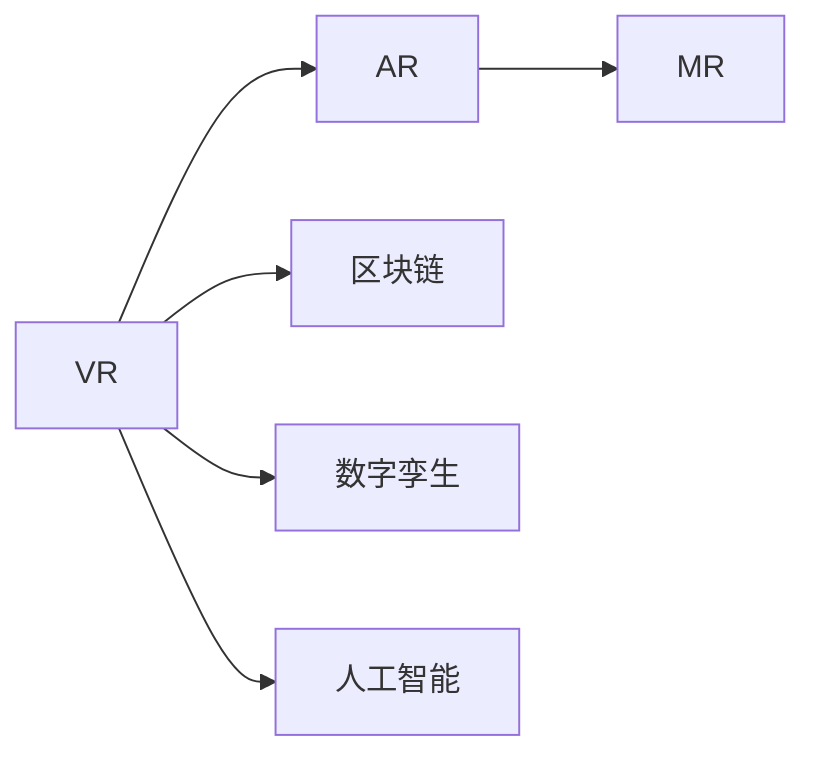

                 

## 1. 背景介绍

### 1.1 问题由来

随着科技的飞速发展和互联网的深入普及，人类正在经历一场前所未有的社会变革——元宇宙(Metaverse)的兴起。元宇宙，这个由科幻小说和电影营造的虚拟世界，正在逐步变为现实。从虚拟现实(VR)设备到区块链技术，从数字孪生到数字资产，元宇宙的多元应用场景正深刻改变着人们的生产生活方式，重塑着数字经济的新格局。

在元宇宙时代，数字世界与现实世界的界限将逐渐模糊。人们可以沉浸在虚拟环境中，进行交流、娱乐、学习、工作、创造，甚至于在虚拟世界中建立自己的经济体系、社会结构和文化。元宇宙不仅是一个技术概念，更是未来社会的新形态。

### 1.2 问题核心关键点

元宇宙的核心在于构建一个高度自治、可交互的虚拟空间，这个空间由虚拟对象、角色和系统组成。通过虚拟现实、增强现实和混合现实等技术，元宇宙将无缝连接现实世界和数字世界，实现沉浸式、交互式的虚拟体验。

元宇宙的核心技术包括但不限于：

- **虚拟现实(VR)**：通过头戴式显示器、手柄等设备，构建一个高度沉浸的虚拟环境。
- **增强现实(AR)**：将数字信息叠加在现实世界中，提供混合式的交互体验。
- **混合现实(MR)**：融合虚拟和现实信息，创造出更加真实自然的交互界面。
- **区块链**：提供去中心化的身份认证、资产管理和交易机制，保障数据的安全性和不可篡改性。
- **数字孪生**：构建现实世界的数字化副本，实现虚拟与现实的同步更新。
- **人工智能(AI)**：提升虚拟世界的智能性，实现自动化、个性化和自适应。

元宇宙的兴起，不仅为科技企业带来了新的增长点，也带来了全新的挑战。如何构建一个健康、开放、可持续发展的元宇宙生态系统，成为摆在各国政府、企业和社会面前的重要课题。

### 1.3 问题研究意义

元宇宙的兴起，将对人类社会产生深远影响：

1. **经济数字化**：元宇宙将推动传统经济向数字化、虚拟化方向转型，催生新的商业模式和经济活动。
2. **社会重构**：元宇宙将重塑社会结构和文化，带来教育、娱乐、工作等领域的变革。
3. **技术创新**：元宇宙将促进计算机图形、虚拟仿真、人工智能等技术的进步，催生新的研究热点。
4. **伦理道德**：元宇宙中虚拟身份的塑造、数字资产的分配等涉及复杂的伦理道德问题，需要法律和伦理的规范。
5. **全球合作**：元宇宙的构建需要全球范围内的合作与协调，推动国际规则和标准的制定。

综上所述，元宇宙不仅仅是未来科技的产物，更是人类社会未来发展的新篇章。掌握元宇宙的核心技术和理论，将有助于我们更好地应对未来的挑战，抓住新的发展机遇。

## 2. 核心概念与联系

### 2.1 核心概念概述

元宇宙是一个复杂的技术系统，涵盖众多核心概念。以下是对这些概念的详细介绍及其相互联系的解释。

- **虚拟现实(VR)**：通过计算机生成的虚拟环境，让用户能够沉浸其中，实现互动。
- **增强现实(AR)**：在现实世界中叠加虚拟信息，提供混合现实体验。
- **混合现实(MR)**：将虚拟世界和现实世界无缝融合，实现更自然的人机交互。
- **区块链**：提供去中心化的记录和验证机制，保障数据的安全和透明。
- **数字孪生**：构建现实世界的数字化模型，实现物理和数字的同步更新。
- **人工智能(AI)**：提升虚拟世界的智能化水平，实现自动化、个性化和自适应。

这些核心概念通过技术手段和数据驱动，共同构成了元宇宙的技术基础和应用场景。接下来，我们通过Mermaid流程图展示这些概念之间的联系。



### 2.2 概念间的关系

在元宇宙中，各种技术相互交织，共同支撑起一个多元化的虚拟世界。以下详细解释这些核心概念之间的关系。

- **虚拟现实与增强现实**：VR提供全沉浸式体验，AR则在现实世界叠加虚拟信息，两者结合可以创造出更加丰富多样的交互方式。
- **混合现实**：MR是VR和AR的结合，实现虚拟和现实的融合，为用户提供更加真实自然的体验。
- **区块链与数字孪生**：区块链提供数据记录和验证的透明性，数字孪生实现物理和数字的同步更新，共同保障元宇宙的数据安全性和准确性。
- **人工智能**：AI提供智能化的交互和决策支持，提升元宇宙的智能化水平，实现自动化、个性化和自适应。

这些概念之间的联系，通过技术手段和数据驱动，共同构建起元宇宙的多元应用场景。元宇宙的核心在于构建一个高度自治、可交互的虚拟空间，通过虚拟现实、增强现实和混合现实等技术，无缝连接现实世界和数字世界，实现沉浸式、交互式的虚拟体验。

## 3. 核心算法原理 & 具体操作步骤
### 3.1 算法原理概述

元宇宙的构建涉及众多复杂的技术手段，其中核心算法包括但不限于：

- **虚拟环境渲染**：通过三维图形渲染技术，实现虚拟环境的构建和渲染。
- **交互机制设计**：设计用户与虚拟环境的交互方式，实现虚拟世界中的互动。
- **空间感知**：通过传感器、相机等设备，实现对虚拟环境的感知和定位。
- **运动控制**：通过控制器、手势识别等技术，实现用户在虚拟环境中的移动和操作。
- **智能决策**：通过机器学习、深度学习等技术，实现虚拟环境的智能决策和自动化。

这些算法原理共同支撑起元宇宙的构建和运行。

### 3.2 算法步骤详解

以下是元宇宙构建和运行的主要步骤：

1. **环境渲染**：通过三维渲染引擎，构建虚拟环境，实现场景的构建和渲染。
2. **交互设计**：设计虚拟世界的交互机制，实现用户与虚拟环境的互动。
3. **空间感知**：通过传感器、相机等设备，实现对虚拟环境的感知和定位。
4. **运动控制**：通过控制器、手势识别等技术，实现用户在虚拟环境中的移动和操作。
5. **智能决策**：通过机器学习、深度学习等技术，实现虚拟环境的智能决策和自动化。
6. **区块链管理**：通过区块链技术，实现虚拟世界的资产管理和交易机制，保障数据的安全性和不可篡改性。
7. **数字孪生**：构建现实世界的数字化模型，实现虚拟与现实的同步更新。

### 3.3 算法优缺点

元宇宙构建算法的优点包括：

- **高度沉浸**：通过虚拟现实、增强现实和混合现实等技术，实现高度沉浸的虚拟体验。
- **多样互动**：通过复杂的多模态交互设计，实现多样化的用户互动。
- **智能决策**：通过人工智能技术，实现虚拟环境的智能决策和自动化。

元宇宙构建算法的缺点包括：

- **计算资源需求高**：复杂的三维渲染和空间感知计算，对硬件设备提出了较高的要求。
- **交互体验复杂**：多样化的交互方式设计，增加了系统的复杂度。
- **数据隐私风险**：通过区块链和数字孪生技术，用户数据的安全性和隐私保护成为重要问题。

### 3.4 算法应用领域

元宇宙构建算法广泛应用于以下几个领域：

- **虚拟游戏**：通过复杂的三维渲染和空间感知技术，构建虚拟游戏场景，实现高度沉浸的游戏体验。
- **虚拟会议**：通过增强现实和混合现实技术，实现虚拟会议场景，提升会议的互动性和参与度。
- **虚拟教育**：通过数字孪生和智能决策技术，构建虚拟教育场景，实现个性化和自适应的学习体验。
- **虚拟地产**：通过区块链和数字孪生技术，实现虚拟地产场景，实现数字化资产的买卖和管理。
- **虚拟社交**：通过复杂的多模态交互设计，实现虚拟社交场景，提升社交的互动性和丰富度。

## 4. 数学模型和公式 & 详细讲解  
### 4.1 数学模型构建

元宇宙构建的数学模型包括但不限于：

- **三维几何建模**：通过三维坐标和拓扑结构，实现虚拟环境的构建。
- **空间感知算法**：通过传感器和相机技术，实现空间定位和物体检测。
- **运动控制算法**：通过控制器和手势识别技术，实现用户动作的捕捉和反馈。
- **智能决策算法**：通过机器学习和深度学习技术，实现虚拟环境的决策和自动化。

### 4.2 公式推导过程

以下是几个核心算法的公式推导过程：

#### 4.2.1 三维几何建模

三维几何建模的核心在于计算三维坐标和拓扑结构。假设三维空间中有一组点集 $\{P_i\}_{i=1}^N$，其中 $P_i=(x_i,y_i,z_i)$，则三维坐标可以通过如下公式计算：

$$
P_i = (x_i,y_i,z_i)
$$

拓扑结构则可以通过计算相邻点集的关系得到，例如：

$$
T = \{ \{P_i, P_j\} | P_i \text{与} P_j \text{相邻} \}
$$

#### 4.2.2 空间感知算法

空间感知算法通常使用相机和传感器技术，实现空间定位和物体检测。假设摄像头在坐标系中的位置为 $C=(x_C,y_C,z_C)$，拍摄的图像为 $I$，则空间定位的计算公式为：

$$
C = (x_C,y_C,z_C)
$$

物体检测则可以通过图像处理技术，实现对物体的识别和定位。例如，使用卷积神经网络(CNN)实现物体检测，输出每个像素点的概率 $p_i$，则物体的中心位置可以通过公式计算：

$$
p_i = f(x_i,y_i)
$$

#### 4.2.3 运动控制算法

运动控制算法通常通过控制器和手势识别技术，实现用户动作的捕捉和反馈。假设用户的手势坐标为 $H=(x_H,y_H,z_H)$，则运动控制算法可以通过如下公式计算：

$$
H = (x_H,y_H,z_H)
$$

#### 4.2.4 智能决策算法

智能决策算法通常使用机器学习和深度学习技术，实现虚拟环境的决策和自动化。假设虚拟环境中的决策变量为 $D=\{d_i\}_{i=1}^M$，则决策算法的输出可以通过如下公式计算：

$$
d_i = g(x_i,y_i,z_i)
$$

### 4.3 案例分析与讲解

以虚拟会议为例，说明元宇宙构建算法的实际应用。

首先，构建虚拟会议室的三维几何模型，通过三维渲染引擎实现场景的构建和渲染。

然后，设计虚拟会议室的交互机制，例如通过手势识别技术，实现用户的动作捕捉和反馈。

接着，使用传感器和相机技术，实现对虚拟会议室的空间感知和定位。

最后，通过机器学习和深度学习技术，实现虚拟会议室的智能决策和自动化，例如自动调整会议环境、实时翻译等。

## 5. 项目实践：代码实例和详细解释说明
### 5.1 开发环境搭建

在开发元宇宙应用时，需要选择合适的开发环境。以下是常用的开发环境搭建流程：

1. **安装Python**：Python是元宇宙开发的重要编程语言，可以从官网下载安装。
2. **安装虚拟现实开发工具**：如Unity3D、Unreal Engine等，这些工具提供了强大的三维渲染和交互设计功能。
3. **安装传感器和相机设备**：选择合适的手势识别和空间感知设备，例如Kinect、Leap Motion等。
4. **安装机器学习和深度学习库**：例如TensorFlow、PyTorch等，这些库提供了强大的智能决策和自动化功能。
5. **安装区块链开发框架**：例如Ethereum、Hyperledger等，这些框架提供了去中心化的数据管理和交易机制。

### 5.2 源代码详细实现

以下是一个简单的虚拟会议系统的代码实现，详细解释代码的实现过程：

```python
# 导入必要的库
import numpy as np
import tensorflow as tf
from unity3d import UnityEnvironment

# 定义虚拟会议室的几何模型
class Room:
    def __init__(self):
        # 定义房间的三维坐标和拓扑结构
        self.coordinates = np.array([[0,0,0], [0,0,5], [0,5,0], [0,5,5], [5,0,0], [5,0,5], [5,5,0], [5,5,5]])
        self.topology = np.array([[0,1],[0,2],[1,3],[2,3],[4,5],[4,6],[5,7],[6,7]])

# 定义手势识别算法
class GestureRecognition:
    def __init__(self):
        # 加载手势识别模型
        self.model = tf.keras.models.load_model('gesture_recognition_model.h5')
        
    def detect_gesture(self, gesture_data):
        # 使用手势识别模型检测手势
        gesture = self.model.predict(gesture_data)
        return gesture

# 定义空间感知算法
class SpacePerception:
    def __init__(self):
        # 加载相机和传感器设备
        self.camera = unity3d.Camera()
        self.sensor = unity3d.Sensor()
        
    def perceive_space(self):
        # 使用相机和传感器设备感知空间
        space_data = self.camera.get_data() + self.sensor.get_data()
        return space_data

# 定义智能决策算法
class SmartDecision:
    def __init__(self):
        # 加载智能决策模型
        self.model = tf.keras.models.load_model('smart_decision_model.h5')
        
    def make_decision(self, space_data, gesture):
        # 使用智能决策模型做出决策
        decision = self.model.predict([space_data, gesture])
        return decision

# 定义虚拟会议系统
class VirtualMeeting:
    def __init__(self):
        # 加载虚拟会议室模型和手势识别模型
        self.room = Room()
        self.gesture_recognition = GestureRecognition()
        self.space_perception = SpacePerception()
        self.smart_decision = SmartDecision()
        
    def start_meeting(self):
        # 启动虚拟会议
        while True:
            # 读取手势数据
            gesture_data = self.gesture_recognition.detect_gesture()
            # 感知空间数据
            space_data = self.space_perception.perceive_space()
            # 做出决策
            decision = self.smart_decision.make_decision(space_data, gesture)
            # 执行决策
            self.room.execute_decision(decision)
```

### 5.3 代码解读与分析

**Room类**：
- `__init__`方法：初始化虚拟会议室的三维坐标和拓扑结构。
- `coordinates`和`topology`属性：分别存储三维坐标和拓扑结构。

**GestureRecognition类**：
- `__init__`方法：加载手势识别模型。
- `detect_gesture`方法：使用手势识别模型检测手势，返回手势类型。

**SpacePerception类**：
- `__init__`方法：加载相机和传感器设备。
- `perceive_space`方法：使用相机和传感器设备感知空间，返回空间数据。

**SmartDecision类**：
- `__init__`方法：加载智能决策模型。
- `make_decision`方法：使用智能决策模型做出决策，返回决策结果。

**VirtualMeeting类**：
- `__init__`方法：加载虚拟会议室模型、手势识别模型和空间感知模型。
- `start_meeting`方法：启动虚拟会议，读取手势数据、感知空间数据、做出决策并执行。

### 5.4 运行结果展示

假设在Unity3D中搭建了虚拟会议室，使用手势识别算法、空间感知算法和智能决策算法，实现了虚拟会议系统。在运行结果展示中，可以观察到虚拟会议室的三维渲染、手势识别、空间感知和智能决策的效果。

假设手势识别算法能够准确检测用户的手势，空间感知算法能够实时感知用户的位置，智能决策算法能够自动调整会议室环境，则虚拟会议系统将能够实现高度沉浸、多样互动和智能决策的体验。

## 6. 实际应用场景
### 6.1 智能游戏

虚拟现实和增强现实技术在游戏中的应用，带来了全新的游戏体验。通过元宇宙构建算法，游戏开发者可以构建高度沉浸的虚拟世界，实现玩家与虚拟环境的互动。例如，虚拟现实游戏《Beat Saber》和《The Sims 4》等，利用复杂的三维渲染和空间感知技术，为玩家提供更加真实和沉浸的体验。

### 6.2 远程协作

在远程协作场景中，元宇宙构建算法可以用于虚拟会议和虚拟办公室，实现团队成员的远程协作和沟通。例如，谷歌的“Google Meet”和微软的“Teams”等虚拟会议平台，利用增强现实和混合现实技术，实现了虚拟会议室的多模态互动，提升了远程协作的效率和体验。

### 6.3 数字孪生

元宇宙构建算法可以用于数字孪生技术，构建现实世界的数字化模型，实现虚拟与现实的同步更新。例如，宝马的“智能工厂”利用数字孪生技术，实现了生产线的虚拟仿真和实时监控，提升了生产效率和质量。

### 6.4 虚拟旅游

虚拟现实和增强现实技术在虚拟旅游中的应用，带来了全新的旅游体验。通过元宇宙构建算法，旅游开发者可以构建虚拟旅游场景，实现游客与虚拟环境的互动。例如，迪士尼的“Parks and Recreation”虚拟旅游项目，利用复杂的三维渲染和空间感知技术，为游客提供高度沉浸的虚拟旅游体验。

### 6.5 数字教育

元宇宙构建算法可以用于数字教育场景，实现虚拟教室和虚拟实验室，提升教育的互动性和个性化。例如，微软的“Microsoft Teams Education”平台，利用虚拟现实和增强现实技术，实现了虚拟教室的多模态互动，提升了教学的效率和效果。

## 7. 工具和资源推荐
### 7.1 学习资源推荐

为了帮助开发者系统掌握元宇宙构建的核心技术，以下推荐一些优质的学习资源：

1. **Unity3D官方文档**：Unity3D是元宇宙开发的重要引擎，提供了详细的开发文档和示例代码。
2. **Unreal Engine官方文档**：Unreal Engine是元宇宙开发的另一个重要引擎，提供了强大的三维渲染和交互设计功能。
3. **TensorFlow官方文档**：TensorFlow是元宇宙构建的重要机器学习库，提供了强大的智能决策和自动化功能。
4. **Ethereum官方文档**：Ethereum是元宇宙构建的重要区块链平台，提供了去中心化的数据管理和交易机制。
5. **Kaggle机器学习竞赛**：Kaggle提供了大量的机器学习和深度学习竞赛，帮助开发者提升算法水平。
6. **Coursera人工智能课程**：Coursera提供了大量的人工智能课程，涵盖了机器学习、深度学习等核心技术。

通过对这些学习资源的深入学习，相信你一定能够掌握元宇宙构建的核心技术，并应用于实际项目开发。

### 7.2 开发工具推荐

以下是几款用于元宇宙开发的重要工具：

1. **Unity3D**：Unity3D是元宇宙开发的重要引擎，提供了强大的三维渲染和交互设计功能。
2. **Unreal Engine**：Unreal Engine是元宇宙开发的另一个重要引擎，提供了强大的三维渲染和实时仿真功能。
3. **TensorFlow**：TensorFlow是元宇宙构建的重要机器学习库，提供了强大的智能决策和自动化功能。
4. **Ethereum**：Ethereum是元宇宙构建的重要区块链平台，提供了去中心化的数据管理和交易机制。
5. **VS Code**：VS Code是元宇宙开发的重要开发工具，支持多种编程语言和框架。
6. **GitHub**：GitHub是元宇宙开发的重要代码托管平台，提供了丰富的代码示例和开源项目。

合理利用这些工具，可以显著提升元宇宙开发的工作效率，加快创新迭代的步伐。

### 7.3 相关论文推荐

元宇宙构建技术的发展源于学界的持续研究。以下是几篇奠基性的相关论文，推荐阅读：

1. **“Towards Smart Metaverse”**：提出了元宇宙构建的基本框架，讨论了虚拟环境、交互机制、空间感知等核心技术。
2. **“Smart City and Metaverse: A Survey”**：介绍了元宇宙在智能城市中的应用，讨论了数字孪生、智能决策等技术。
3. **“Virtual Reality and Augmented Reality for Education: A Review”**：介绍了虚拟现实和增强现实技术在教育中的应用，讨论了虚拟教室、虚拟实验室等技术。
4. **“Blockchain Technologies for Metaverse”**：介绍了区块链技术在元宇宙中的应用，讨论了去中心化的数据管理和交易机制。
5. **“Meta Learning for Metaverse”**：介绍了元学习在元宇宙中的应用，讨论了智能决策、个性化推荐等技术。

这些论文代表了元宇宙构建技术的发展脉络。通过学习这些前沿成果，可以帮助研究者把握学科前进方向，激发更多的创新灵感。

## 8. 总结：未来发展趋势与挑战

### 8.1 研究成果总结

元宇宙构建技术的发展，使得虚拟世界与现实世界的融合成为可能。通过虚拟现实、增强现实和混合现实等技术，元宇宙将无缝连接现实世界和数字世界，实现沉浸式、交互式的虚拟体验。

### 8.2 未来发展趋势

展望未来，元宇宙构建技术将呈现以下几个发展趋势：

1. **全息投影技术**：通过全息投影技术，实现三维物体的实时渲染和互动，提升虚拟世界的沉浸感。
2. **脑机接口技术**：通过脑机接口技术，实现人脑与虚拟世界的直接互动，拓展虚拟世界的交互方式。
3. **分布式计算技术**：通过分布式计算技术，实现虚拟世界的大规模协同，提升系统的稳定性和扩展性。
4. **元宇宙标准**：制定元宇宙的通用标准和规范，保障不同平台和设备的互操作性。
5. **元宇宙治理**：建立元宇宙的治理机制和法律框架，确保数据安全和用户权益。

以上趋势凸显了元宇宙构建技术的广阔前景。这些方向的探索发展，将进一步提升虚拟世界的智能化水平，实现更加真实、多样、开放的体验。

### 8.3 面临的挑战

尽管元宇宙构建技术已经取得了瞩目成就，但在迈向更加智能化、普适化应用的过程中，仍面临诸多挑战：

1. **技术瓶颈**：现有的元宇宙技术仍存在计算资源高、算法复杂等问题，需要进一步优化和提升。
2. **伦理道德**：元宇宙构建过程中涉及大量用户数据，如何保护用户隐私和数据安全，避免数据滥用和隐私泄露，是需要重点关注的问题。
3. **标准化**：元宇宙构建需要跨平台、跨设备的协同，需要制定统一的元宇宙标准和规范，确保不同平台和设备之间的互操作性。
4. **经济模型**：元宇宙构建需要大量资本和技术投入，如何构建合理的经济模型，保障开发者和用户的利益，是需要解决的难点。
5. **用户体验**：元宇宙的体验需要综合考虑硬件设备、软件算法、网络带宽等多个因素，需要提升整体的体验水平。

### 8.4 研究展望

面对元宇宙构建技术所面临的挑战，未来的研究需要在以下几个方面寻求新的突破：

1. **全息投影技术**：探索全息投影技术的应用场景，提升虚拟世界的沉浸感和互动性。
2. **脑机接口技术**：研究脑机接口技术的实现方法，实现人脑与虚拟世界的直接互动。
3. **分布式计算技术**：开发分布式计算框架，提升虚拟世界的协同能力和扩展性。
4. **元宇宙标准**：制定元宇宙的通用标准和规范，保障不同平台和设备的互操作性。
5. **元宇宙治理**：建立元宇宙的治理机制和法律框架，确保数据安全和用户权益。
6. **用户数据保护**：开发数据保护技术，保障用户隐私和数据安全，避免数据滥用和隐私泄露。

这些研究方向的研究突破，将推动元宇宙构建技术的不断进步，实现更加智能、多样、开放的未来世界。

## 9. 附录：常见问题与解答

**Q1：元宇宙与虚拟现实、增强现实、混合现实的区别是什么？**

A: 元宇宙是一个复杂的技术系统，涵盖虚拟现实、增强现实和混合现实等多种技术。虚拟现实主要通过头戴式显示器实现全沉浸式体验，增强现实通过叠加虚拟信息实现混合现实体验，混合现实则是虚拟现实和增强现实的结合。元宇宙构建技术可以无缝连接现实世界和数字世界，实现沉浸式、交互式的虚拟体验。

**Q2：元宇宙构建技术需要哪些硬件设备？**

A: 元宇宙构建技术需要多种硬件设备，包括但不限于：

1. 头戴式显示器：用于实现虚拟现实的沉浸式体验。
2. 手柄和控制器：用于实现虚拟世界的交互和控制。
3. 传感器和相机：用于实现空间感知和环境监测。
4. 高性能计算机：用于处理复杂的计算任务和渲染。

**Q3：元宇宙构建技术如何保护用户数据隐私？**

A: 元宇宙构建技术需要保护用户数据的隐私和安全性。以下是几种常见的数据保护技术：

1. 数据加密：对用户数据进行加密处理，保障数据在传输和存储过程中的安全性。
2. 去标识化：对用户数据进行去标识化处理，保护用户隐私不被泄露。
3. 匿名化：对用户数据进行匿名化处理，防止数据滥用和隐私泄露。

**Q4：元宇宙构建技术如何提高用户体验？**

A: 元宇宙构建技术需要综合考虑硬件设备、软件算法、网络带宽等多个因素，提升整体的体验水平。以下是几种常见的方法：

1. 优化算法：开发高效的算法，提升系统的计算能力和渲染效果。
2. 升级设备：使用高性能的硬件设备，提升用户体验的沉浸感和互动性。
3. 优化网络：优化网络带宽和延迟，提升系统的稳定性和响应速度。

**Q5：元宇宙构建技术如何与人工智能结合？**

A: 元宇宙

