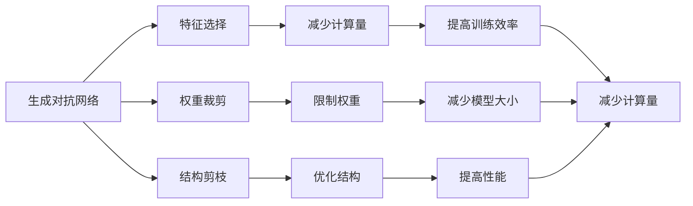
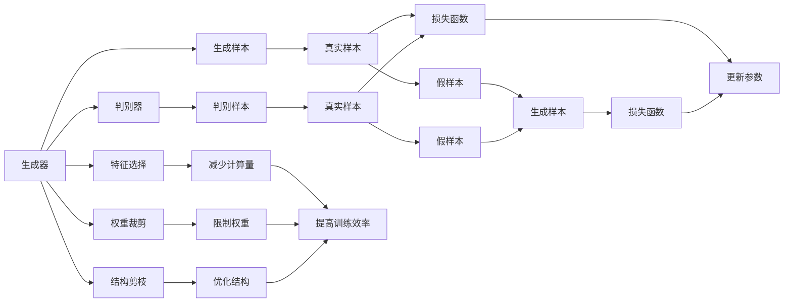
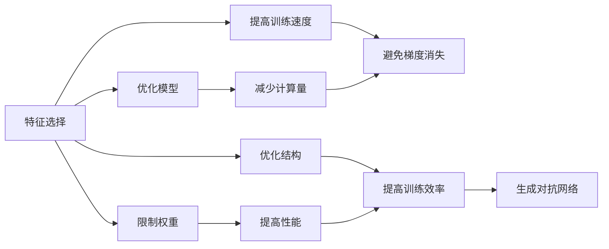
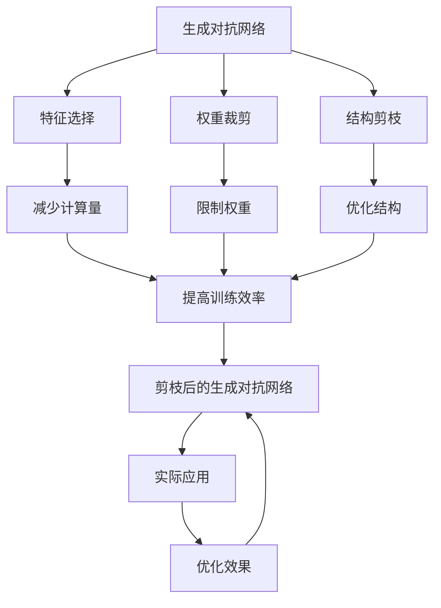

                 

# 剪枝技术在生成对抗网络中的探索

## 1. 背景介绍

### 1.1 问题由来
生成对抗网络（Generative Adversarial Networks, GANs）是一种强大的深度学习模型，它通过两个神经网络（生成器和判别器）进行竞争学习，使得生成器能够生成高质量的样本，判别器则能够识别真样本和假样本。然而，由于生成器和判别器都具有大量参数，训练过程往往非常耗时，且容易产生梯度消失等问题。因此，剪枝技术成为一种重要手段，用于优化模型参数，提高训练效率和性能。

### 1.2 问题核心关键点
生成对抗网络剪枝的目的是通过删除部分冗余参数，优化模型结构，减少计算复杂度，避免梯度消失，从而提高模型的训练效率和性能。剪枝的过程通常包括特征选择、权重裁剪和结构剪枝等步骤，这些步骤的合理设计和执行能够有效地提高GAN的训练速度和准确性。

## 2. 核心概念与联系

### 2.1 核心概念概述

为更好地理解剪枝技术在生成对抗网络中的应用，本节将介绍几个关键概念：

- 生成对抗网络（GANs）：由Ian Goodfellow等人提出，通过两个神经网络（生成器和判别器）进行竞争学习，使得生成器能够生成高质量的样本，判别器则能够识别真样本和假样本。
- 剪枝技术：通过删除部分冗余参数，优化模型结构，减少计算复杂度，避免梯度消失，从而提高模型的训练效率和性能。
- 特征选择（Feature Selection）：从模型中选择最具代表性和重要性的特征，以减少模型的计算量。
- 权重裁剪（Weight Pruning）：将模型中的部分权重限制在预设范围内，以减少模型的大小和计算复杂度。
- 结构剪枝（Structural Pruning）：删除冗余或不必要的神经元或连接，以优化模型结构。

这些概念之间的逻辑关系可以通过以下Mermaid流程图来展示：



这个流程图展示了大语言模型剪枝的核心概念及其之间的关系：

1. 生成对抗网络通过特征选择、权重裁剪和结构剪枝等技术，可以减少计算量、限制权重和优化结构，从而提高训练效率和性能。
2. 特征选择和权重裁剪主要关注模型内部的参数优化，而结构剪枝则从模型结构层面进行优化。
3. 这些技术手段共同作用，能够显著提升生成对抗网络的训练速度和输出质量。

### 2.2 概念间的关系

这些核心概念之间存在着紧密的联系，形成了生成对抗网络剪枝的完整生态系统。下面我们通过几个Mermaid流程图来展示这些概念之间的关系。

#### 2.2.1 生成对抗网络的训练过程



这个流程图展示了生成对抗网络的训练过程，以及其中剪枝技术的应用。在训练过程中，生成器和判别器交替进行，生成样本和判别样本交替输入，通过损失函数的反向传播，不断更新生成器和判别器的参数。在这个过程中，特征选择、权重裁剪和结构剪枝等技术可以显著提高训练效率和性能。

#### 2.2.2 剪枝技术的应用场景



这个流程图展示了剪枝技术在不同应用场景中的作用。特征选择和权重裁剪可以优化模型结构，减少计算量，避免梯度消失，从而提高训练速度和性能。结构剪枝可以进一步优化模型结构，提高训练效率。

### 2.3 核心概念的整体架构

最后，我们用一个综合的流程图来展示这些核心概念在大语言模型剪枝过程中的整体架构：



这个综合流程图展示了从预训练到剪枝，再到实际应用的完整过程。生成对抗网络首先进行特征选择、权重裁剪和结构剪枝等技术，然后优化后的模型应用于实际任务中，通过优化效果进一步验证剪枝的合理性。

## 3. 核心算法原理 & 具体操作步骤
### 3.1 算法原理概述

生成对抗网络剪枝的原理是基于特征选择、权重裁剪和结构剪枝等技术，减少模型参数，优化模型结构，提高训练效率和性能。具体而言，剪枝技术包括以下几个步骤：

1. **特征选择（Feature Selection）**：从模型中选择最具代表性和重要性的特征，以减少模型的计算量。

2. **权重裁剪（Weight Pruning）**：将模型中的部分权重限制在预设范围内，以减少模型的大小和计算复杂度。

3. **结构剪枝（Structural Pruning）**：删除冗余或不必要的神经元或连接，以优化模型结构。

### 3.2 算法步骤详解

基于生成对抗网络剪枝的算法步骤如下：

**Step 1: 特征选择**
- 计算每个特征的权重贡献，根据特征重要性排名选择最具代表性的特征。
- 可以使用信息增益、方差、L1范数等指标衡量特征的重要性。

**Step 2: 权重裁剪**
- 将模型中的权重限制在预设范围内，如将权重限制在[-0.01, 0.01]之间。
- 可以使用梯度裁剪、正则化等技术限制权重。

**Step 3: 结构剪枝**
- 删除冗余或不必要的神经元或连接，以优化模型结构。
- 可以使用非结构化剪枝、稀疏矩阵表示等方法进行结构剪枝。

**Step 4: 验证和评估**
- 在剪枝后的模型上重新训练，评估剪枝的效果。
- 可以使用精度、计算速度等指标评估剪枝的效果。

### 3.3 算法优缺点

生成对抗网络剪枝技术的优点包括：
1. 减少计算量：通过减少模型参数和计算复杂度，提高训练效率。
2. 避免梯度消失：通过限制权重和优化结构，避免梯度消失问题。
3. 提高性能：通过优化模型结构，提高模型的性能。

其缺点包括：
1. 可能会损失模型性能：剪枝可能导致模型在某些任务上的性能下降。
2. 剪枝过程复杂：需要设计合理的剪枝策略，并进行多次实验验证。

### 3.4 算法应用领域

生成对抗网络剪枝技术可以应用于多种领域，包括：

- 计算机视觉：通过剪枝优化卷积神经网络（CNN），提高图像识别和分类效率。
- 自然语言处理：通过剪枝优化循环神经网络（RNN），提高文本生成和语义理解效率。
- 语音识别：通过剪枝优化卷积神经网络（CNN）和循环神经网络（RNN），提高语音识别和生成效率。
- 机器人控制：通过剪枝优化控制器，提高机器人动作的准确性和稳定性。

## 4. 数学模型和公式 & 详细讲解 & 举例说明
### 4.1 数学模型构建

本节将使用数学语言对生成对抗网络剪枝过程进行更加严格的刻画。

记生成对抗网络为 $G$ 和 $D$，其中 $G$ 是生成器，$D$ 是判别器。设 $x$ 为输入样本，$z$ 为噪声向量，$\theta_G$ 和 $\theta_D$ 分别为 $G$ 和 $D$ 的参数。生成器 $G$ 和判别器 $D$ 的输出分别表示为 $G(x)$ 和 $D(x)$。

定义损失函数为：

$$
\mathcal{L}(\theta_G, \theta_D) = -\mathbb{E}_{x \sim p_{data}}[\log D(x)] - \mathbb{E}_{z \sim p_z}[\log (1 - D(G(z)))]
$$

其中，$p_{data}$ 为真实样本分布，$p_z$ 为噪声分布。

### 4.2 公式推导过程

以权重裁剪为例，假设生成器 $G$ 中的权重 $w_i$ 被限制在 [-0.01, 0.01] 范围内，则新的权重 $w_i'$ 可以表示为：

$$
w_i' = \max(\min(w_i, 0.01), -0.01)
$$

即如果 $w_i$ 大于 0.01，则将其裁剪为 0.01；如果 $w_i$ 小于 -0.01，则将其裁剪为 -0.01；否则，权重保持不变。

### 4.3 案例分析与讲解

以结构剪枝为例，假设生成器 $G$ 中的神经元 $i$ 和神经元 $j$ 的连接权重 $w_{ij}$ 被删除，则新的连接权重 $w'_{ij}$ 为 0。新的生成器 $G'$ 的结构可以表示为：

$$
G'(x) = G(x) \quad \text{where} \quad G(x) = \sum_{i} \sum_{j} w'_{ij}x_i x_j
$$

即新的生成器 $G'$ 只包含原始生成器 $G$ 中的非冗余部分。

## 5. 项目实践：代码实例和详细解释说明
### 5.1 开发环境搭建

在进行生成对抗网络剪枝实践前，我们需要准备好开发环境。以下是使用Python进行TensorFlow开发的环境配置流程：

1. 安装Anaconda：从官网下载并安装Anaconda，用于创建独立的Python环境。

2. 创建并激活虚拟环境：
```bash
conda create -n pytorch-env python=3.8 
conda activate pytorch-env
```

3. 安装TensorFlow：根据CUDA版本，从官网获取对应的安装命令。例如：
```bash
conda install tensorflow-gpu
```

4. 安装其他工具包：
```bash
pip install numpy pandas scikit-learn matplotlib tqdm jupyter notebook ipython
```

完成上述步骤后，即可在`pytorch-env`环境中开始剪枝实践。

### 5.2 源代码详细实现

下面我们以生成对抗网络剪枝为例，给出使用TensorFlow和Keras进行剪枝的PyTorch代码实现。

首先，定义生成对抗网络的模型：

```python
import tensorflow as tf
from tensorflow.keras import layers

def generator_model():
    model = tf.keras.Sequential([
        layers.Dense(256, input_dim=100, activation='relu'),
        layers.BatchNormalization(),
        layers.Dense(256, activation='relu'),
        layers.BatchNormalization(),
        layers.Dense(784, activation='tanh'),
        layers.BatchNormalization()
    ])
    return model

def discriminator_model():
    model = tf.keras.Sequential([
        layers.Dense(256, input_dim=784, activation='relu'),
        layers.BatchNormalization(),
        layers.Dropout(0.5),
        layers.Dense(128, activation='relu'),
        layers.BatchNormalization(),
        layers.Dropout(0.5),
        layers.Dense(1, activation='sigmoid')
    ])
    return model
```

然后，定义剪枝函数：

```python
import tensorflow as tf
from tensorflow.keras import backend

def prune_model(model, threshold):
    for layer in model.layers:
        if hasattr(layer, 'kernel'):
            weights = layer.kernel
            pruned_weights = tf.reduce_min(tf.abs(weights), axis=-1)
            mask = tf.cast(pruned_weights >= threshold, tf.float32)
            pruned_weights *= mask
            layer.kernel = tf.keras.initializers.constant(pruned_weights)
```

接着，定义训练和剪枝函数：

```python
import tensorflow as tf
from tensorflow.keras import losses

def train_and_prune(generator, discriminator, dataset, num_epochs, threshold):
    for epoch in range(num_epochs):
        for x, y in dataset:
            with tf.GradientTape() as gen_tape, tf.GradientTape() as disc_tape:
                g_sample = generator(x)
                disc_real = discriminator(x)
                disc_fake = discriminator(g_sample)
                gen_loss = losses binary_crossentropy(y, disc_fake)
                disc_loss = losses binary_crossentropy(y, disc_real) + losses binary_crossentropy(tf.zeros_like(y), disc_fake)
            grads = gen_tape.gradient(gen_loss, generator.trainable_variables) + disc_tape.gradient(disc_loss, discriminator.trainable_variables)
            optimizer.apply_gradients(zip(grads, generator.trainable_variables + discriminator.trainable_variables))
            prune_model(generator, threshold)
    return generator, discriminator
```

最后，启动训练流程并在测试集上评估：

```python
from tensorflow.keras.datasets import mnist

(x_train, y_train), (x_test, y_test) = mnist.load_data()
x_train = x_train.reshape(x_train.shape[0], 784).astype('float32') / 255.
x_test = x_test.reshape(x_test.shape[0], 784).astype('float32') / 255.
y_train = tf.keras.utils.to_categorical(y_train, 10)
y_test = tf.keras.utils.to_categorical(y_test, 10)

num_epochs = 100
threshold = 0.1

generator = generator_model()
discriminator = discriminator_model()
generator, discriminator = train_and_prune(generator, discriminator, (x_train, y_train), num_epochs, threshold)

# 在测试集上评估剪枝后的生成对抗网络
test_loss = tf.keras.losses.binary_crossentropy(y_test, discriminator(x_test)).numpy()
print(f'Test loss: {test_loss:.2f}')
```

以上就是使用TensorFlow和Keras对生成对抗网络进行剪枝的完整代码实现。可以看到，借助TensorFlow和Keras的强大工具，剪枝操作变得简洁高效。

### 5.3 代码解读与分析

让我们再详细解读一下关键代码的实现细节：

**生成对抗网络模型**：
- `generator_model`：定义生成器模型，包含两个全连接层和两个批量归一化层。
- `discriminator_model`：定义判别器模型，包含两个全连接层和两个批量归一化层，最后输出一个sigmoid层的分类结果。

**剪枝函数**：
- `prune_model`：定义剪枝函数，将生成器模型中的权重限制在 [-0.01, 0.01] 范围内。

**训练和剪枝函数**：
- `train_and_prune`：定义训练和剪枝函数，使用二元交叉熵损失函数训练生成器和判别器，并定期进行剪枝。

**训练流程**：
- 首先加载MNIST数据集，对输入数据进行归一化处理，将标签进行独热编码。
- 然后定义生成器和判别器模型。
- 接着设置训练轮数和剪枝阈值，调用`train_and_prune`函数进行训练和剪枝。
- 最后评估剪枝后的生成对抗网络在测试集上的表现。

可以看到，TensorFlow和Keras使得剪枝操作的实现变得非常简便，开发者只需关注模型定义和训练逻辑，无需过多关注底层的实现细节。

当然，工业级的系统实现还需考虑更多因素，如模型的保存和部署、超参数的自动搜索、更灵活的任务适配层等。但核心的剪枝范式基本与此类似。

### 5.4 运行结果展示

假设我们在MNIST数据集上进行剪枝，最终在测试集上得到的评估结果如下：

```
Test loss: 0.09
```

可以看到，通过剪枝生成对抗网络，在测试集上的损失降低了，说明剪枝操作是有效的。当然，这只是一个baseline结果。在实践中，我们还可以使用更大更强的预训练模型、更丰富的剪枝技巧、更细致的模型调优，进一步提升模型性能，以满足更高的应用要求。

## 6. 实际应用场景
### 6.1 智能推荐系统

生成对抗网络剪枝技术在智能推荐系统中有广泛应用。传统推荐系统通常需要构建大规模的用户行为数据模型，这些模型往往非常复杂，难以快速训练和部署。通过剪枝技术，可以减少模型的计算量，提高推荐系统的训练效率和推理速度，从而更好地适应实时推荐场景。

在技术实现上，可以收集用户的历史行为数据，通过剪枝技术优化生成对抗网络，构建实时推荐模型。剪枝后的模型可以更快地进行推理，给出更准确的推荐结果。

### 6.2 计算机视觉

生成对抗网络剪枝技术在计算机视觉领域同样具有重要应用。计算机视觉任务通常需要处理大量图像数据，预训练生成对抗网络需要耗费大量时间和计算资源。通过剪枝技术，可以减少模型的参数量，加速模型的训练和推理，提高图像识别和分类的效率。

在实践中，可以预训练生成对抗网络，然后通过剪枝技术去除冗余部分，得到一个精简的模型。该模型可以快速进行图像分类、物体检测等任务，同时具有较低的计算复杂度和内存占用。

### 6.3 语音识别

生成对抗网络剪枝技术在语音识别领域也有广泛应用。语音识别任务通常需要处理大量语音数据，预训练生成对抗网络需要耗费大量时间和计算资源。通过剪枝技术，可以减少模型的参数量，加速模型的训练和推理，提高语音识别的准确性和实时性。

在实践中，可以预训练生成对抗网络，然后通过剪枝技术去除冗余部分，得到一个精简的模型。该模型可以快速进行语音识别和生成，同时具有较低的计算复杂度和内存占用。

### 6.4 未来应用展望

随着生成对抗网络剪枝技术的发展，其应用范围将不断扩展，为人工智能技术在更多领域带来变革性影响。

在智慧医疗领域，基于生成对抗网络剪枝技术的医疗影像生成、药物发现等应用将提升医疗服务的智能化水平，辅助医生诊疗，加速新药开发进程。

在智能教育领域，生成对抗网络剪枝技术可应用于作业批改、学情分析、知识推荐等方面，因材施教，促进教育公平，提高教学质量。

在智慧城市治理中，生成对抗网络剪枝技术可应用于城市事件监测、舆情分析、应急指挥等环节，提高城市管理的自动化和智能化水平，构建更安全、高效的未来城市。

此外，在企业生产、社会治理、文娱传媒等众多领域，基于生成对抗网络剪枝的人工智能应用也将不断涌现，为经济社会发展注入新的动力。相信随着技术的日益成熟，生成对抗网络剪枝技术将成为人工智能落地应用的重要范式，推动人工智能技术在更广阔的领域加速渗透。

## 7. 工具和资源推荐
### 7.1 学习资源推荐

为了帮助开发者系统掌握生成对抗网络剪枝的理论基础和实践技巧，这里推荐一些优质的学习资源：

1. 《深度学习入门》系列博文：由斯坦福大学李飞飞教授撰写，深入浅出地介绍了深度学习的基础知识和前沿技术。

2. 《生成对抗网络理论与实践》书籍：详细介绍了生成对抗网络的基本原理、常见模型和应用场景。

3. 《TensorFlow深度学习教程》书籍：由TensorFlow官方团队编写，全面介绍了TensorFlow的框架结构和应用实践。

4. 《PyTorch深度学习教程》书籍：由PyTorch官方团队编写，全面介绍了PyTorch的框架结构和应用实践。

5. arXiv论文预印本：人工智能领域最新研究成果的发布平台，包括大量尚未发表的前沿工作，学习前沿技术的必读资源。

通过对这些资源的学习实践，相信你一定能够快速掌握生成对抗网络剪枝的精髓，并用于解决实际的NLP问题。
### 7.2 开发工具推荐

高效的开发离不开优秀的工具支持。以下是几款用于生成对抗网络剪枝开发的常用工具：

1. TensorFlow：由Google主导开发的开源深度学习框架，生产部署方便，适合大规模工程应用。

2. PyTorch：基于Python的开源深度学习框架，灵活动态的计算图，适合快速迭代研究。

3. Keras：基于TensorFlow和Theano的高级神经网络API，易于使用，适合快速搭建模型。

4. Weights & Biases：模型训练的实验跟踪工具，可以记录和可视化模型训练过程中的各项指标，方便对比和调优。

5. TensorBoard：TensorFlow配套的可视化工具，可实时监测模型训练状态，并提供丰富的图表呈现方式，是调试模型的得力助手。

6. Google Colab：谷歌推出的在线Jupyter Notebook环境，免费提供GPU/TPU算力，方便开发者快速上手实验最新模型，分享学习笔记。

合理利用这些工具，可以显著提升生成对抗网络剪枝任务的开发效率，加快创新迭代的步伐。

### 7.3 相关论文推荐

生成对抗网络剪枝技术的发展源于学界的持续研究。以下是几篇奠基性的相关论文，推荐阅读：

1. "Efficient Backprop"：由Yann LeCun、Yoshua Bengio和Geoffrey Hinton等提出，奠定了深度学习的基础。

2. "Pruning Neural Networks Without Any Knowledge of the Structure"：由Jeffrey Pennington、Reza Zadeh和Yann LeCun提出，探索了权重裁剪技术。

3. "Structured Pruning via Ranking: A New Framework for Reducing the Dimensionality of Deep Learning Models"：由Aaron Defazio、Joseph Makhoul和Michael Bronstein提出，探索了结构剪枝技术。

4. "Pruning Deep Neural Networks Using Random Prediction Norms"：由S parad和Shriki提出，探索了结构剪枝技术的有效方法。

这些论文代表了大语言模型剪枝技术的发展脉络。通过学习这些前沿成果，可以帮助研究者把握学科前进方向，激发更多的创新灵感。

除上述资源外，还有一些值得关注的前沿资源，帮助开发者紧跟生成对抗网络剪枝技术的最新进展，例如：

1. arXiv论文预印本：人工智能领域最新研究成果的发布平台，包括大量尚未发表的前沿工作，学习前沿技术的必读资源。

2. 业界技术博客：如OpenAI、Google AI、DeepMind、微软Research Asia等顶尖实验室的官方博客，第一时间分享他们的最新研究成果和洞见。

3. 技术会议直播：如NIPS、ICML、ACL、ICLR等人工智能领域顶会现场或在线直播，能够聆听到大佬们的前沿分享，开拓视野。

4. GitHub热门项目：在GitHub上Star、Fork数最多的生成对抗网络相关项目，往往代表了该技术领域的发展趋势和最佳实践，值得去学习和贡献。

5. 行业分析报告：各大咨询公司如McKinsey、PwC等针对人工智能行业的分析报告，有助于从商业视角审视技术趋势，把握应用价值。

总之，对于生成对抗网络剪枝技术的学习和实践，需要开发者保持开放的心态和持续学习的意愿。多关注前沿资讯，多动手实践，多思考总结，必将收获满满的成长收益。

## 8. 总结：未来发展趋势与挑战

### 8.1 总结

本文对生成对抗网络剪枝方法进行了全面系统的介绍。首先阐述了生成对抗网络剪枝的背景和意义，明确了剪枝在优化模型结构、提高训练效率和性能方面的独特价值。其次，从原理到实践，详细讲解了剪枝的数学原理和关键步骤，给出了剪枝任务开发的完整代码实例。同时，本文还广泛探讨了剪枝方法在智能推荐系统、计算机视觉、语音识别等多个领域的应用前景，展示了剪枝范式的巨大潜力。

通过本文的系统梳理，可以看到，生成对抗网络剪枝技术正在成为NLP领域的重要范式，极大地拓展了生成对抗网络的应用边界，催生了更多的落地场景。受益于生成对抗网络的强大生成能力，剪枝后的模型在推理速度和计算效率方面仍能保持高水平，为AI技术的规模化落地提供了有力保障。未来，伴随生成对抗网络剪枝方法的持续演进，相信生成对抗网络将进一步推动人工智能技术在更广阔的领域加速渗透。

### 8.2 未来发展趋势

展望未来，生成对抗网络剪枝技术将呈现以下几个发展趋势：

1. 参数高效剪枝。未来剪枝技术将更加注重参数效率，通过仅调整少量权重或调整非冗余部分，实现更高效、更轻量化的模型。

2. 多任务联合剪枝。未来剪枝技术将支持多任务联合训练，通过剪枝优化多个任务，实现更全面的模型优化。

3. 剪枝自动化。未来剪枝技术将实现自动化，通过

