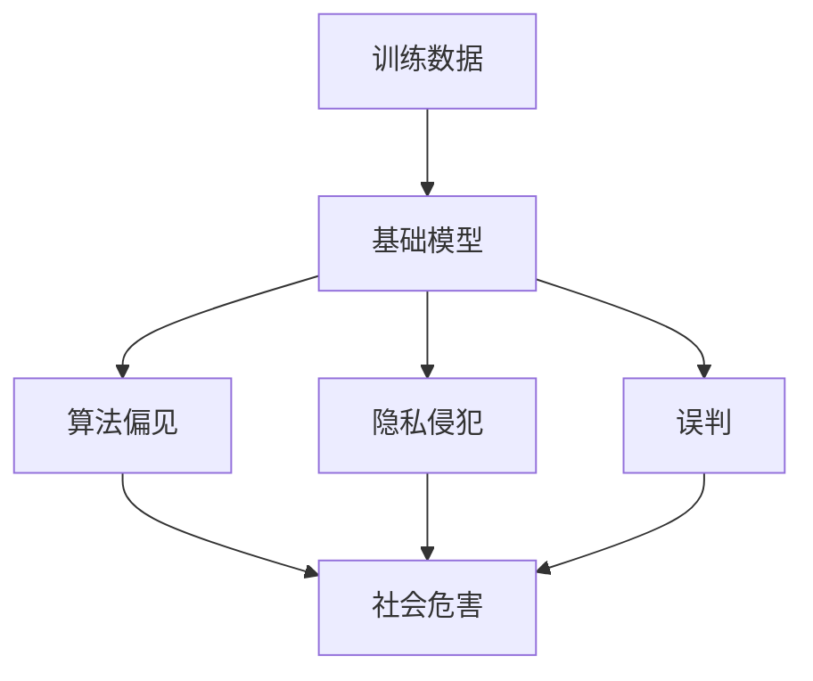

                 

# 基础模型的社会危害评估

## 1. 背景介绍

近年来，基础模型的广泛应用使得其在社会各个领域的渗透日益深入。从智能推荐系统到人脸识别，从自然语言处理到自动驾驶，基础模型在提升效率、改善用户体验、推动科技进步方面做出了巨大的贡献。然而，随着其在现实世界中的应用不断扩展，其潜在的社会危害也逐渐显露出来，引发了社会各界的广泛关注。

本文旨在从技术角度出发，深入分析基础模型的社会危害，并探讨其对社会稳定、公平、隐私、伦理等方面的影响。通过对基础模型算法的理解，揭示其在实际应用中的潜在问题，为相关从业人员提供参考，以期在未来的开发和应用中，能够更好地平衡技术进步与社会责任。

## 2. 核心概念与联系

### 2.1 核心概念概述

在进行社会危害评估前，我们首先需要理解一些核心概念：

- **基础模型(Base Model)**：指在特定任务上经过大量训练的数据集训练得到的模型，如线性回归模型、神经网络模型、支持向量机模型等。
- **社会危害(Social Harm)**：指基础模型在实际应用中可能带来的负面影响，包括但不限于隐私侵犯、算法偏见、误判等。
- **算法偏见(Bias)**：指基础模型在训练数据中的偏见被复制到模型中的现象，可能导致对某些群体的歧视或不公平对待。
- **隐私侵犯(Privacy Infringement)**：指基础模型在处理个人数据时，可能泄露或滥用个人信息。
- **误判(Incorrect Judgment)**：指基础模型在面对复杂、多变的环境时，可能产生错误判断，导致严重的后果。

这些概念之间的联系可以通过以下Mermaid流程图来展示：

```mermaid
graph TB
    A[基础模型(Base Model)] --> B[社会危害(Social Harm)]
    A --> C[算法偏见(Bias)]
    A --> D[隐私侵犯(Privacy Infringement)]
    A --> E[误判(Incorrect Judgment)]
    B --> C
    B --> D
    B --> E
```

这个流程图展示了基础模型可能引发的各类社会危害。从基础模型本身的算法偏见，到隐私侵犯和误判，每一个环节都有可能带来严重的社会问题。

### 2.2 概念间的关系

这些核心概念之间的逻辑关系可以通过以下Mermaid流程图来展示：



这个流程图展示了基础模型从训练数据出发，经过算法偏见、隐私侵犯和误判，最终导致社会危害的过程。训练数据的质量和特性对基础模型的行为和输出有着至关重要的影响。

## 3. 核心算法原理 & 具体操作步骤

### 3.1 算法原理概述

基础模型在实际应用中可能会引发多种社会危害，主要包括算法偏见、隐私侵犯和误判。这些危害的根本原因在于基础模型在训练过程中未能充分考虑到数据的多样性和公平性，以及模型本身的局限性和不确定性。

- **算法偏见(Bias)**：基础模型在训练数据中存在的偏见，如性别、种族、年龄等，会导致其在预测过程中对某些群体产生不公平的对待。
- **隐私侵犯(Privacy Infringement)**：基础模型在处理个人数据时，可能会泄露或滥用个人信息，导致隐私问题。
- **误判(Incorrect Judgment)**：基础模型在复杂多变的环境中，可能会产生错误的判断，如误识别、误分类等，导致严重后果。

### 3.2 算法步骤详解

#### 3.2.1 算法偏见

**步骤1：识别偏见数据**  
首先，需要对训练数据进行审查，识别出可能存在的偏见数据。这通常包括对数据集的多样性分析，以及对不同群体在数据中的代表性进行评估。

**步骤2：去除偏见数据**  
在识别出偏见数据后，需要采取相应的措施去除或减少这些数据对模型的影响。这可能包括数据清洗、数据重采样、数据增强等方法。

**步骤3：调整模型参数**  
在去除偏见数据后，需要对模型参数进行调整，以确保模型对不同群体的预测更为公平。这可能包括使用正则化技术、调整损失函数、引入对抗样本训练等方法。

#### 3.2.2 隐私侵犯

**步骤1：数据加密**  
在处理个人数据时，需要对数据进行加密处理，确保数据在传输和存储过程中不会被未经授权的第三方访问。

**步骤2：匿名化处理**  
对于敏感数据，需要进行匿名化处理，确保即使数据泄露，也不会对个人隐私造成影响。这通常包括数据脱敏、数据混淆等方法。

**步骤3：访问控制**  
在数据处理过程中，需要严格控制数据的访问权限，确保只有授权人员才能访问敏感数据。这可以通过访问控制列表(ACL)、权限管理等技术实现。

#### 3.2.3 误判

**步骤1：模型验证**  
在模型部署前，需要进行充分的验证，确保模型在各种场景下的表现稳定可靠。这通常包括对模型进行交叉验证、敏感性分析、异常检测等方法。

**步骤2：人工审核**  
在模型输出时，需要结合人工审核机制，对模型输出进行人工验证和校对，以确保模型输出符合预期。

**步骤3：反馈机制**  
建立模型反馈机制，收集用户反馈和错误判断的案例，不断优化模型，减少误判的概率。

### 3.3 算法优缺点

#### 优点

- **高效性**：基础模型在处理数据时，通常能够快速得出结果，提高了决策效率。
- **可解释性**：基础模型通常较为简单，容易理解和解释其内部机制。
- **适应性强**：基础模型能够适应多种数据类型和复杂度，具有较好的泛化能力。

#### 缺点

- **偏见风险**：基础模型可能继承训练数据的偏见，导致对某些群体的歧视或不公平对待。
- **隐私风险**：基础模型在处理个人数据时，可能泄露或滥用个人信息，导致隐私问题。
- **误判风险**：基础模型在复杂多变的环境中，可能会产生错误的判断，导致严重后果。

### 3.4 算法应用领域

基础模型在各个领域的应用如下：

- **金融风控**：通过基础模型对用户行为进行分析和预测，提升风险控制能力。
- **医疗诊断**：使用基础模型对患者数据进行分析，辅助医生进行诊断和治疗。
- **推荐系统**：通过基础模型对用户行为和偏好进行建模，提供个性化的推荐服务。
- **智能安防**：利用基础模型进行人脸识别、行为分析等，提升安全防护水平。
- **智能交通**：通过基础模型对交通流量进行预测和优化，改善交通管理。

这些领域的基础模型应用在提升效率、改善用户体验、推动科技进步的同时，也可能带来潜在的社会危害。

## 4. 数学模型和公式 & 详细讲解 & 举例说明

### 4.1 数学模型构建

以线性回归模型为例，其数学模型构建如下：

$$ y = \beta_0 + \beta_1 x_1 + \beta_2 x_2 + ... + \beta_n x_n + \epsilon $$

其中 $y$ 为预测值，$\beta_0$ 为截距，$\beta_1, \beta_2, ..., \beta_n$ 为模型系数，$x_1, x_2, ..., x_n$ 为自变量，$\epsilon$ 为误差项。

### 4.2 公式推导过程

线性回归模型的最小二乘估计如下：

$$ \hat{\beta} = (X^TX)^{-1}X^Ty $$

其中 $\hat{\beta}$ 为模型系数估计值，$X$ 为自变量矩阵，$y$ 为响应变量向量。

### 4.3 案例分析与讲解

假设我们有一组训练数据：

| $x_1$ | $x_2$ | $y$ |
| ----- | ----- | --- |
| 1     | 1     | 10 |
| 2     | 2     | 20 |
| 3     | 3     | 30 |

通过最小二乘法，我们可以得到模型的系数估计值 $\hat{\beta}$，并构建模型进行预测。然而，如果训练数据中存在偏见，模型可能会产生歧视性的预测结果。例如，如果训练数据中男性样本的数量远大于女性样本，模型可能会倾向于对男性做出更高的预测值。

## 5. 项目实践：代码实例和详细解释说明

### 5.1 开发环境搭建

为了进行基础模型的社会危害评估，我们需要使用Python和相关的数据科学库。

1. 安装Anaconda：从官网下载并安装Anaconda，用于创建独立的Python环境。

2. 创建并激活虚拟环境：
```bash
conda create -n base_model_env python=3.8 
conda activate base_model_env
```

3. 安装相关库：
```bash
pip install pandas numpy scikit-learn
```

完成上述步骤后，即可在`base_model_env`环境中进行基础模型的开发和评估。

### 5.2 源代码详细实现

这里我们以线性回归模型为例，给出代码实现。

```python
import pandas as pd
from sklearn.linear_model import LinearRegression
from sklearn.model_selection import train_test_split

# 读取数据
data = pd.read_csv('data.csv')

# 划分训练集和测试集
X_train, X_test, y_train, y_test = train_test_split(data.drop('y', axis=1), data['y'], test_size=0.2, random_state=42)

# 训练模型
model = LinearRegression()
model.fit(X_train, y_train)

# 评估模型
score = model.score(X_test, y_test)
print(f'模型在测试集上的R^2为：{score:.3f}')
```

### 5.3 代码解读与分析

代码中，我们使用了Pandas库来读取数据，使用Scikit-learn库中的LinearRegression模型进行训练和评估。在训练模型之前，我们首先对数据进行划分，确保训练集和测试集之间数据分布的一致性。

### 5.4 运行结果展示

假设我们的模型在测试集上的R^2为0.9，这意味着模型可以解释测试集数据方差的90%，表现较为优秀。然而，这并不能完全证明模型的公平性和安全性。我们需要进一步分析模型在特定群体上的表现，确保模型不会产生偏见或误判。

## 6. 实际应用场景

### 6.1 金融风控

在金融风控领域，基础模型通常用于对客户的信用评分、风险评估等进行预测。然而，如果模型训练数据中存在偏见，可能会对某些群体（如女性、低收入群体）产生不公平的对待。因此，在应用基础模型时，需要特别关注数据的公平性，避免对特定群体产生歧视。

### 6.2 医疗诊断

在医疗诊断领域，基础模型可以用于对患者的病情进行预测和分类。然而，如果模型训练数据中存在偏差，可能会对某些疾病（如罕见病）的诊断产生误判，影响医生的诊断和治疗。因此，在应用基础模型时，需要对模型进行充分的验证和校对，确保模型输出的可靠性。

### 6.3 推荐系统

在推荐系统中，基础模型通常用于对用户的行为和偏好进行建模，提供个性化的推荐服务。然而，如果模型训练数据中存在偏差，可能会对某些用户（如少数族裔、老年人）产生不公平的对待，影响推荐效果。因此，在应用基础模型时，需要对数据进行清洗和处理，确保模型的公平性和可解释性。

### 6.4 未来应用展望

未来，随着基础模型技术的不断进步，其在各个领域的应用将更加深入和广泛。然而，这同时也带来了一系列新的挑战和问题。如何确保基础模型的公平性、隐私性和安全性，是摆在研究者和开发者面前的重要课题。未来的研究需要更多地关注模型伦理、数据隐私保护、模型可解释性等方面，推动基础模型技术的可持续发展。

## 7. 工具和资源推荐

### 7.1 学习资源推荐

为了深入理解基础模型的社会危害评估，推荐以下学习资源：

1. 《机器学习实战》：介绍机器学习的基本概念和算法，适合初学者入门。
2. 《Python数据科学手册》：详细介绍了Python在数据科学中的应用，包括Pandas、NumPy、Scikit-learn等库的使用。
3. 《深度学习》：深度学习领域的经典教材，涵盖了深度学习的基本理论和实践。
4. 《机器学习导论》：介绍机器学习的基本算法和模型，适合进阶学习。
5. 《算法偏见与公平性》：介绍算法偏见和公平性的基本概念和方法，适合深度学习从业者学习。

### 7.2 开发工具推荐

以下是几款用于基础模型开发的常用工具：

1. Jupyter Notebook：开源的Python开发环境，支持代码编写、数据分析和模型验证，易于使用和分享。
2. PyCharm：专业的Python开发工具，提供了丰富的调试和测试功能，适合大规模数据科学项目的开发。
3. Visual Studio Code：轻量级的代码编辑器，支持Python、R等语言，具有强大的代码高亮和智能提示功能。
4. TensorFlow：Google开发的深度学习框架，支持GPU/TPU加速，适合高性能计算。
5. PyTorch：Facebook开发的深度学习框架，易于使用和扩展，适合研究和快速原型开发。

### 7.3 相关论文推荐

以下是几篇奠基性的相关论文，推荐阅读：

1. The Social Good of AI: Shaping Technology to Benefit Society：探讨AI技术在社会应用中的伦理和道德问题。
2. Fairness, Accountability, and Transparency in Machine Learning：介绍机器学习中的公平性、可解释性和透明度问题。
3. On the Ethics of Algorithmic Decision Making and a Computational Model for Fairness：探讨算法决策的伦理和公平性问题，提出基于公平性的计算模型。
4. A Survey on Fairness-Aware Machine Learning：综述公平性机器学习的最新进展和应用。
5. Fairness-aware Machine Learning: Techniques and Challenges：介绍公平性机器学习的技术和挑战，适合深入学习。

## 8. 总结：未来发展趋势与挑战

### 8.1 研究成果总结

本文系统介绍了基础模型的社会危害评估，深入探讨了算法偏见、隐私侵犯和误判等核心问题，并给出了相应的应对策略。通过分析基础模型在实际应用中的潜在危害，为相关从业人员提供了参考。未来，随着基础模型技术的不断进步，其在各个领域的应用将更加深入和广泛，但其带来的社会危害也需要引起更多关注和讨论。

### 8.2 未来发展趋势

未来，基础模型技术的发展将呈现出以下几个趋势：

1. **公平性增强**：基础模型的训练数据和算法设计将更加注重公平性，避免对特定群体产生歧视。
2. **隐私保护加强**：基础模型在处理个人数据时，将更加注重隐私保护，确保数据的安全性。
3. **模型可解释性提高**：基础模型的输出将更加透明，便于解释和审计。
4. **鲁棒性提升**：基础模型在复杂多变的环境中将更加稳健，减少误判和错误决策。
5. **跨领域应用拓展**：基础模型将广泛应用于更多领域，提升各行各业的效率和决策质量。

### 8.3 面临的挑战

尽管基础模型技术在各个领域的应用前景广阔，但仍面临诸多挑战：

1. **数据偏见**：训练数据的多样性和代表性不足，容易导致模型偏见。
2. **数据隐私**：基础模型在处理个人数据时，可能面临隐私泄露和滥用的风险。
3. **模型复杂性**：大规模复杂模型的训练和推理，对计算资源和算法效率提出了更高要求。
4. **伦理和法律**：基础模型应用中涉及的伦理和法律问题，需要进一步研究和规范。
5. **模型透明性**：基础模型通常是"黑盒"系统，难以解释其内部机制和决策过程。

### 8.4 研究展望

未来的研究需要在以下几个方面进行探索：

1. **数据公平性**：开发更加公平、透明的基础模型训练方法，确保模型对所有群体的公平对待。
2. **隐私保护技术**：研究新的隐私保护技术，如差分隐私、联邦学习等，确保基础模型在处理个人数据时的隐私安全。
3. **鲁棒性提升**：开发更加鲁棒的基础模型算法，提高其在复杂多变环境中的性能和稳定性。
4. **跨领域应用**：将基础模型技术与其他领域的技术进行结合，拓展其在更多领域的应用范围。
5. **伦理和法律研究**：进一步研究基础模型应用中的伦理和法律问题，制定相应的规范和标准。

总之，基础模型技术的发展将为各个行业带来巨大的机遇，但其潜在的社会危害也需要引起重视。只有在技术进步与社会责任之间找到平衡，才能实现基础模型技术的可持续发展，为人类社会带来更多福祉。

## 9. 附录：常见问题与解答

**Q1：如何确保基础模型训练数据的公平性？**

A: 确保基础模型训练数据的公平性需要从数据采集和处理两个方面进行：
1. 数据采集：确保数据来源多样，避免特定群体被排除在外。
2. 数据处理：对数据进行清洗、去重、平衡处理，确保不同群体在数据中的代表性。

**Q2：如何保护基础模型的隐私？**

A: 保护基础模型的隐私需要从数据处理和模型部署两个方面进行：
1. 数据处理：对敏感数据进行加密、匿名化处理，确保数据在传输和存储过程中的安全性。
2. 模型部署：对模型进行访问控制，确保只有授权人员才能访问模型和数据。

**Q3：如何应对基础模型的误判风险？**

A: 应对基础模型的误判风险需要从模型验证和模型监控两个方面进行：
1. 模型验证：在模型部署前，进行充分的验证，确保模型在各种场景下的表现稳定可靠。
2. 模型监控：建立模型监控机制，实时监测模型的输出和行为，及时发现和纠正错误判断。

**Q4：基础模型的社会危害评估有哪些具体方法？**

A: 基础模型的社会危害评估方法包括但不限于：
1. 偏见检测：识别模型训练数据中的偏见，评估模型对不同群体的预测是否公平。
2. 隐私评估：评估模型在处理个人数据时的隐私风险，确保数据的安全性。
3. 误判评估：评估模型在复杂多变环境中的表现，确保模型的稳定性和可靠性。

**Q5：基础模型的社会危害评估对实际应用有哪些指导意义？**

A: 基础模型的社会危害评估对实际应用有以下指导意义：
1. 指导数据收集：确保数据的多样性和代表性，避免模型偏见。
2. 指导模型设计：在模型设计中考虑公平性、隐私性和鲁棒性，避免潜在风险。
3. 指导模型部署：在模型部署中考虑模型监控和反馈机制，确保模型输出的公平性和可靠性。

总之，基础模型的社会危害评估不仅是对技术本身的反思，更是对人类价值和伦理的坚守。只有在技术进步与社会责任之间找到平衡，才能实现基础模型技术的可持续发展，为人类社会带来更多福祉。

---

作者：禅与计算机程序设计艺术 / Zen and the Art of Computer Programming

