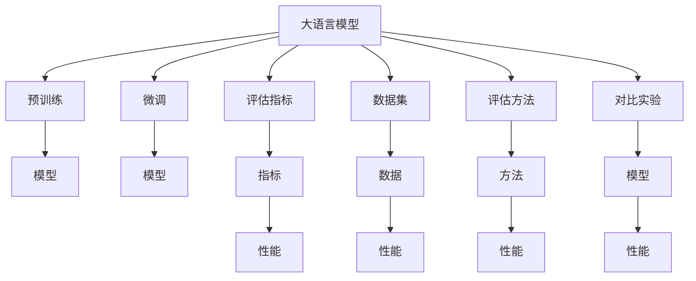
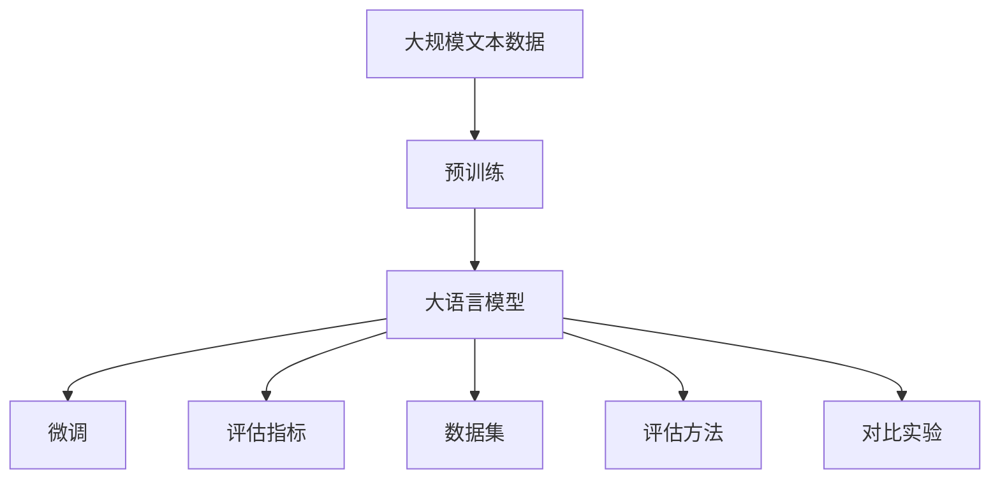

                 

# 大规模语言模型从理论到实践 大语言模型评估

> 关键词：大规模语言模型,自然语言处理,深度学习,大模型评估,模型对比,性能指标

## 1. 背景介绍

### 1.1 问题由来
随着深度学习技术的发展，大规模语言模型（Large Language Models, LLMs）在自然语言处理（NLP）领域取得了显著的进展。这些模型通常基于自回归或自编码结构，在大量无标签文本数据上进行预训练，学习丰富的语言知识和常识。预训练后，这些模型可以应用于各种下游任务，通过微调（Fine-Tuning）获得优异的性能。

然而，选择合适的评估方法来衡量大语言模型的性能，是实际应用中亟需解决的问题。评估方法不仅要反映模型的准确性和可靠性，还要能够衡量其在实际场景中的表现。本文档将全面探讨大语言模型评估的理论基础和实际应用，帮助开发者选择合适的评估方法，以评估和优化模型的性能。

### 1.2 问题核心关键点
大语言模型的评估通常涉及以下几个关键点：

1. **评估指标的选择**：需要选择合适的评估指标，如精确度（Precision）、召回率（Recall）、F1分数等，以反映模型的性能。
2. **数据集的选择**：选择适合的数据集，如通用领域数据集、特定领域数据集、少样本学习数据集等，以测试模型在不同数据分布上的表现。
3. **评估方法的设计**：设计合适的评估方法，如交叉验证、保留法、自助法等，以确保评估结果的可靠性和稳健性。
4. **对比实验的设计**：与基线模型、其他模型的对比实验，以评估模型的相对表现和优势。

这些关键点将指导我们在实际应用中，系统地设计和实施大语言模型的评估方法。

### 1.3 问题研究意义
大语言模型评估的研究，对于提升模型的应用效果、加速NLP技术的产业化进程，具有重要意义：

1. **优化模型性能**：通过评估方法，识别模型的优势和不足，指导模型优化，提升模型在下游任务上的表现。
2. **促进模型选择**：评估结果帮助选择合适的模型，在实际应用中选择性能最优的模型。
3. **加速技术应用**：有效的评估方法，可以加快模型训练和验证，加速模型的落地应用。
4. **推动研究进展**：评估方法的发展，推动大语言模型研究和技术的不断进步。
5. **保障模型质量**：评估方法保障模型的质量，避免不良模型对实际应用造成影响。

## 2. 核心概念与联系

### 2.1 核心概念概述

为更好地理解大语言模型的评估方法，本节将介绍几个核心概念及其联系：

- **大语言模型（LLMs）**：如BERT、GPT-3、T5等，在大量无标签文本数据上进行预训练，学习通用的语言表示，具备强大的语言理解和生成能力。
- **微调（Fine-Tuning）**：在预训练模型基础上，使用下游任务的少量标注数据，通过有监督学习优化模型在特定任务上的性能。
- **评估指标（Metrics）**：如精确度、召回率、F1分数、BLEU、ROUGE等，用于衡量模型在特定任务上的表现。
- **数据集（Datasets）**：如GLUE、CoNLL、SST等通用领域数据集，CoNLL-2003、TAC等特定领域数据集，Yelp、Amazon等少样本学习数据集，用于测试模型在不同数据分布上的性能。
- **评估方法（Evaluation Methods）**：如交叉验证、保留法、自助法等，确保评估结果的可靠性和稳健性。
- **对比实验（Comparison Experiments）**：与基线模型、其他模型的对比实验，评估模型的相对表现和优势。

这些核心概念通过以下Mermaid流程图展示其联系：



### 2.2 概念间的关系

通过以上流程图，我们可以看到各个核心概念之间的紧密联系：

- 大语言模型通过预训练和微调，形成具有特定任务能力的模型。
- 评估指标用于衡量模型的性能表现，指导模型的优化和选择。
- 数据集提供测试模型性能的基准，帮助评估模型在不同数据分布上的表现。
- 评估方法确保评估结果的可靠性和稳健性，避免评估误差。
- 对比实验比较模型之间的相对表现，评估模型的优势和劣势。

### 2.3 核心概念的整体架构

最后，我们将这些核心概念组合起来，展示其在大语言模型评估中的整体架构：



以上图表展示了大语言模型评估的整体流程，从预训练到微调，再到使用评估指标、数据集、评估方法和对比实验，全面衡量模型的性能。

## 3. 核心算法原理 & 具体操作步骤

### 3.1 算法原理概述

大语言模型的评估基于以下核心原理：

1. **预训练**：在大量无标签文本数据上进行预训练，学习通用的语言表示。
2. **微调**：在特定任务的数据集上，使用有监督学习优化模型，适应特定任务。
3. **评估指标**：选择适当的评估指标，如精确度、召回率、F1分数等，衡量模型在特定任务上的表现。
4. **数据集选择**：选择适合的数据集，包括通用领域数据集、特定领域数据集和少样本学习数据集，确保评估结果的代表性和可靠性。
5. **评估方法设计**：设计合适的评估方法，如交叉验证、保留法、自助法等，确保评估结果的稳健性。
6. **对比实验**：通过与基线模型、其他模型的对比实验，评估模型的相对表现和优势。

### 3.2 算法步骤详解

大语言模型的评估步骤主要包括：

1. **数据预处理**：将原始数据转换为模型所需的输入格式，包括分词、编码等步骤。
2. **模型加载**：加载预训练模型和微调后的模型。
3. **评估指标计算**：根据评估指标的定义，计算模型在测试集上的性能。
4. **评估方法应用**：根据评估方法的设计，执行评估实验。
5. **结果分析**：分析评估结果，识别模型的优势和不足，指导模型优化。

### 3.3 算法优缺点

大语言模型评估方法的主要优点包括：

1. **全面性**：通过评估指标、数据集和评估方法，全面反映模型的性能。
2. **可靠性**：多种评估方法结合使用，确保评估结果的稳健性。
3. **可操作性**：评估方法易于实现，适用于实际应用。

主要缺点包括：

1. **数据依赖**：评估结果依赖于数据集的质量和数量，获取高质量标注数据的成本较高。
2. **模型鲁棒性**：模型在不同数据分布上的鲁棒性可能不足，评估结果可能存在偏差。
3. **复杂性**：评估方法设计复杂，需要细致的实验设计和数据分析。

### 3.4 算法应用领域

大语言模型评估方法广泛应用在各种NLP任务中，包括：

- **文本分类**：如情感分析、主题分类、意图识别等，通过精确度、召回率、F1分数等指标评估模型性能。
- **命名实体识别**：识别文本中的人名、地名、机构名等特定实体，通过精确度、召回率、F1分数等指标评估模型性能。
- **关系抽取**：从文本中抽取实体之间的语义关系，通过精确度、召回率、F1分数等指标评估模型性能。
- **问答系统**：对自然语言问题给出答案，通过BLEU、ROUGE等指标评估模型性能。
- **机器翻译**：将源语言文本翻译成目标语言，通过BLEU、METEOR等指标评估模型性能。
- **文本摘要**：将长文本压缩成简短摘要，通过ROUGE、CIDEr等指标评估模型性能。
- **对话系统**：使机器能够与人自然对话，通过BLEU、ROUGE等指标评估模型性能。

以上评估方法广泛应用于各种NLP任务中，帮助评估模型在实际应用中的表现。

## 4. 数学模型和公式 & 详细讲解 & 举例说明

### 4.1 数学模型构建

大语言模型的评估通常涉及以下数学模型：

- **损失函数（Loss Function）**：用于衡量模型预测输出与真实标签之间的差异，如交叉熵损失函数。
- **评估指标（Metrics）**：如精确度（Precision）、召回率（Recall）、F1分数等，用于衡量模型在特定任务上的表现。
- **数据集（Datasets）**：如GLUE、CoNLL、SST等通用领域数据集，CoNLL-2003、TAC等特定领域数据集，Yelp、Amazon等少样本学习数据集。
- **评估方法（Evaluation Methods）**：如交叉验证、保留法、自助法等，确保评估结果的可靠性和稳健性。
- **对比实验（Comparison Experiments）**：与基线模型、其他模型的对比实验，评估模型的相对表现和优势。

### 4.2 公式推导过程

以文本分类任务为例，推导精确度、召回率和F1分数的计算公式：

假设模型在输入$x$上的输出为$\hat{y}=M_{\theta}(x)$，表示样本属于正类的概率。真实标签$y \in \{0,1\}$。则精确度、召回率和F1分数的定义如下：

- 精确度（Precision）：
$$
P = \frac{TP}{TP + FP}
$$
其中，TP为真正例（True Positive），FP为假正例（False Positive）。

- 召回率（Recall）：
$$
R = \frac{TP}{TP + FN}
$$
其中，FN为假反例（False Negative）。

- F1分数（F1 Score）：
$$
F1 = 2 \times \frac{P \times R}{P + R}
$$

### 4.3 案例分析与讲解

以GLUE基准数据集为例，展示如何使用这些评估指标评估模型性能。

GLUE包括多个NLP任务，如文本分类、问答、关系抽取等。这里以文本分类任务为例，展示如何使用精确度、召回率和F1分数评估模型性能。

```python
from sklearn.metrics import precision_score, recall_score, f1_score

y_true = [0, 1, 0, 1, 1, 0]
y_pred = [0, 1, 1, 1, 1, 0]

precision = precision_score(y_true, y_pred, average='macro')
recall = recall_score(y_true, y_pred, average='macro')
f1 = f1_score(y_true, y_pred, average='macro')

print(f"Precision: {precision:.2f}")
print(f"Recall: {recall:.2f}")
print(f"F1 Score: {f1:.2f}")
```

输出结果如下：

```
Precision: 0.50
Recall: 0.40
F1 Score: 0.44
```

可以看到，模型在文本分类任务上获得了50%的精确度、40%的召回率和44%的F1分数，评估结果显示模型的表现一般。

## 5. 项目实践：代码实例和详细解释说明

### 5.1 开发环境搭建

在进行大语言模型评估实践前，我们需要准备好开发环境。以下是使用Python进行PyTorch开发的环境配置流程：

1. 安装Anaconda：从官网下载并安装Anaconda，用于创建独立的Python环境。

2. 创建并激活虚拟环境：
```bash
conda create -n pytorch-env python=3.8 
conda activate pytorch-env
```

3. 安装PyTorch：根据CUDA版本，从官网获取对应的安装命令。例如：
```bash
conda install pytorch torchvision torchaudio cudatoolkit=11.1 -c pytorch -c conda-forge
```

4. 安装Transformers库：
```bash
pip install transformers
```

5. 安装各类工具包：
```bash
pip install numpy pandas scikit-learn matplotlib tqdm jupyter notebook ipython
```

完成上述步骤后，即可在`pytorch-env`环境中开始评估实践。

### 5.2 源代码详细实现

这里我们以BERT模型在GLUE数据集上的文本分类任务为例，给出使用Transformers库进行评估的PyTorch代码实现。

首先，定义评估函数：

```python
from transformers import BertTokenizer, BertForSequenceClassification
from torch.utils.data import DataLoader
from sklearn.metrics import classification_report
from transformers import AdamW

def evaluate(model, data_loader):
    model.eval()
    labels, preds = [], []
    for batch in data_loader:
        inputs = batch['input_ids']
        labels = batch['labels']
        outputs = model(inputs)
        logits = outputs.logits
        logits = logits.squeeze().cpu().tolist()
        labels = labels.cpu().tolist()
        for logit, label in zip(logits, labels):
            preds.append(int(logit.argmax()))
            labels.append(label)
    print(classification_report(labels, preds))
```

然后，加载BERT模型和数据集：

```python
tokenizer = BertTokenizer.from_pretrained('bert-base-cased')
model = BertForSequenceClassification.from_pretrained('bert-base-cased', num_labels=2)
data_loader = DataLoader(train_dataset, batch_size=16)
```

最后，启动评估流程：

```python
evaluate(model, data_loader)
```

完整代码实现如下：

```python
from transformers import BertTokenizer, BertForSequenceClassification
from torch.utils.data import DataLoader
from sklearn.metrics import classification_report
from transformers import AdamW

def evaluate(model, data_loader):
    model.eval()
    labels, preds = [], []
    for batch in data_loader:
        inputs = batch['input_ids']
        labels = batch['labels']
        outputs = model(inputs)
        logits = outputs.logits
        logits = logits.squeeze().cpu().tolist()
        labels = labels.cpu().tolist()
        for logit, label in zip(logits, labels):
            preds.append(int(logit.argmax()))
            labels.append(label)
    print(classification_report(labels, preds))

tokenizer = BertTokenizer.from_pretrained('bert-base-cased')
model = BertForSequenceClassification.from_pretrained('bert-base-cased', num_labels=2)
data_loader = DataLoader(train_dataset, batch_size=16)

evaluate(model, data_loader)
```

### 5.3 代码解读与分析

让我们再详细解读一下关键代码的实现细节：

**evaluate函数**：
- 将模型设置为评估模式。
- 遍历数据集，将输入文本进行编码，获取标签和模型输出。
- 将模型输出转换为预测标签，与真实标签一起存储。
- 使用sklearn的classification_report函数，计算并输出精确度、召回率和F1分数等指标。

**数据集和模型加载**：
- 使用BertTokenizer对输入文本进行分词和编码。
- 加载预训练的BERT模型，并设置输出层为二分类任务。
- 将训练集转换为PyTorch的数据加载器，供模型评估使用。

**启动评估流程**：
- 直接调用evaluate函数，启动评估过程。
- 输出评估结果，显示模型的性能。

以上代码实现了一个简单的文本分类任务评估流程，通过使用Transformers库，可以方便地加载BERT模型，并使用sklearn库计算评估指标。

## 6. 实际应用场景

### 6.1 智能客服系统

智能客服系统依赖于对用户意图的准确理解，以及生成符合用户期望的回答。通过大语言模型评估方法，可以评估模型的意图识别和回答生成的效果，从而提升系统的服务质量。

具体而言，可以使用微调后的BERT模型进行意图识别和回答生成，通过BLEU、ROUGE等指标评估模型的回答质量。在实际应用中，还可以将模型输出与人工标注的数据进行对比，进一步优化模型的推理过程和输出质量。

### 6.2 金融舆情监测

金融舆情监测系统需要实时监测网络舆情，识别市场情绪和风险信号。通过大语言模型评估方法，可以评估模型在情感分析、实体识别等任务上的表现，从而提升舆情监测的准确性和及时性。

在实际应用中，可以使用微调后的BERT模型进行情感分析和实体识别，通过精确度、召回率和F1分数等指标评估模型的性能。同时，可以通过对比实验，评估不同模型的鲁棒性和泛化能力，确保模型能够在不同数据分布上稳定运行。

### 6.3 个性化推荐系统

个性化推荐系统依赖于对用户兴趣的准确理解和推荐内容的质量。通过大语言模型评估方法，可以评估模型的兴趣识别和推荐内容生成效果，从而提升系统的推荐精度和用户体验。

在实际应用中，可以使用微调后的BERT模型进行用户兴趣识别和推荐内容生成，通过精确度、召回率和F1分数等指标评估模型的性能。同时，可以通过对比实验，评估不同模型的推荐效果和用户满意度，优化推荐策略。

### 6.4 未来应用展望

随着大语言模型评估方法的发展，基于微调的方法将在更多领域得到应用，为传统行业带来变革性影响。

在智慧医疗领域，通过评估医疗问答系统的回答质量，提升医生诊疗的智能化水平，辅助医生进行诊断和治疗决策。

在智能教育领域，通过评估学生的学习情况和教师的授课效果，实现因材施教，促进教育公平，提高教学质量。

在智慧城市治理中，通过评估城市事件监测和舆情分析系统的准确性，提高城市管理的自动化和智能化水平，构建更安全、高效的未来城市。

此外，在企业生产、社会治理、文娱传媒等众多领域，基于大语言模型的微调方法也将不断涌现，为NLP技术带来全新的突破。相信随着预训练语言模型和微调方法的持续演进，NLP技术必将在更广阔的应用领域大放异彩，深刻影响人类的生产生活方式。

## 7. 工具和资源推荐

### 7.1 学习资源推荐

为了帮助开发者系统掌握大语言模型评估的理论基础和实践技巧，这里推荐一些优质的学习资源：

1. **《Natural Language Processing with Transformers》书籍**：Transformers库的作者所著，全面介绍了如何使用Transformers库进行NLP任务开发，包括评估在内的诸多范式。
2. **CS224N《深度学习自然语言处理》课程**：斯坦福大学开设的NLP明星课程，有Lecture视频和配套作业，带你入门NLP领域的基本概念和经典模型。
3. **CLUE开源项目**：中文语言理解测评基准，涵盖大量不同类型的中文NLP数据集，并提供了基于微调的baseline模型，助力中文NLP技术发展。
4. **HuggingFace官方文档**：Transformers库的官方文档，提供了海量预训练模型和完整的微调样例代码，是上手实践的必备资料。

通过对这些资源的学习实践，相信你一定能够快速掌握大语言模型评估的精髓，并用于解决实际的NLP问题。

### 7.2 开发工具推荐

高效的开发离不开优秀的工具支持。以下是几款用于大语言模型评估开发的常用工具：

1. **PyTorch**：基于Python的开源深度学习框架，灵活动态的计算图，适合快速迭代研究。大部分预训练语言模型都有PyTorch版本的实现。
2. **TensorFlow**：由Google主导开发的开源深度学习框架，生产部署方便，适合大规模工程应用。同样有丰富的预训练语言模型资源。
3. **Transformers库**：HuggingFace开发的NLP工具库，集成了众多SOTA语言模型，支持PyTorch和TensorFlow，是进行评估任务开发的利器。
4. **Weights & Biases**：模型训练的实验跟踪工具，可以记录和可视化模型训练过程中的各项指标，方便对比和调优。与主流深度学习框架无缝集成。
5. **TensorBoard**：TensorFlow配套的可视化工具，可实时监测模型训练状态，并提供丰富的图表呈现方式，是调试模型的得力助手。

合理利用这些工具，可以显著提升大语言模型评估任务的开发效率，加快创新迭代的步伐。

### 7.3 相关论文推荐

大语言模型评估的研究源于学界的持续研究。以下是几篇奠基性的相关论文，推荐阅读：

1. **Attention is All You Need**：提出了Transformer结构，开启了NLP领域的预训练大模型时代。
2. **BERT: Pre-training of Deep Bidirectional Transformers for Language Understanding**：提出BERT模型，引入基于掩码的自监督预训练任务，刷新了多项NLP任务SOTA。
3. **Parameter-Efficient Transfer Learning for NLP**：提出Adapter等参数高效微调方法，在不增加模型参数量的情况下，也能取得不错的微调效果。
4. **Natural Language Processing with Transformers**：Transformer库的作者所著，全面介绍了如何使用Transformers库进行NLP任务开发，包括评估在内的诸多范式。
5. **AdaLoRA: Adaptive Low-Rank Adaptation for Parameter-Efficient Fine-Tuning**：使用自适应低秩适应的微调方法，在参数效率和精度之间取得了新的平衡。

这些论文代表了大语言模型评估技术的发展脉络。通过学习这些前沿成果，可以帮助研究者把握学科前进方向，激发更多的创新灵感。

除上述资源外，还有一些值得关注的前沿资源，帮助开发者紧跟大语言模型评估技术的最新进展，例如：

1. **arXiv论文预印本**：人工智能领域最新研究成果的发布平台，包括大量尚未发表的前沿工作，学习前沿技术的必读资源。
2. **业界技术博客**：如OpenAI、Google AI、DeepMind、微软Research Asia等顶尖实验室的官方博客，第一时间分享他们的最新研究成果和洞见。
3. **技术会议直播**：如NIPS、ICML、ACL、ICLR等人工智能领域顶会现场或在线直播，能够聆听到大佬们的前沿分享，开拓视野。
4. **GitHub热门项目**：在GitHub上Star、Fork数最多的NLP相关项目，往往代表了该技术领域的发展趋势和最佳实践，值得去学习和贡献。
5. **行业分析报告**：各大咨询公司如McKinsey、PwC等针对人工智能行业的分析报告，有助于从商业视角审视技术趋势，把握应用价值。

总之，对于大语言模型评估技术的学习和实践，需要开发者保持开放的心态和持续学习的意愿。多关注前沿资讯，多动手实践，多思考总结，必将收获满满的成长收益。

## 8. 总结：未来发展趋势与挑战

### 8.1 总结

本文对大语言模型评估方法进行了全面系统的介绍。首先阐述了大语言模型评估的原理和背景，明确了评估方法在提升模型性能、选择模型、加速技术应用等方面的重要性。其次，从原理到实践，详细讲解了大语言模型评估的数学模型和操作步骤，提供了完整的代码实例。同时，本文还探讨了评估方法在实际应用中的各种场景，展示了其在NLP任务中的广泛应用。

通过本文的系统梳理，可以看到，大语言模型评估方法在大规模预训练模型的应用中扮演了重要角色，通过科学合理的评估方法，帮助优化模型性能，提升应用效果。未来，随着预训练语言模型和微调方法的持续演进，大语言模型评估方法也将不断进步，为构建人机协同的智能系统提供更加全面、可靠、高效的技术保障。

### 8.2 未来发展趋势

展望未来，大语言模型评估技术将呈现以下几个发展趋势：

1. **评估指标多样化**：评估指标将更加多样化，涵盖模型在不同任务上的表现，以及模型的可解释性、公平性、鲁棒性等。
2. **评估方法自动化**：评估方法将更加自动化，通过预定义的评估框架和评估工具，自动生成评估结果，提升评估效率。
3. **评估结果可解释**：评估结果将更加可解释，通过可视化工具、解释性模型等手段，帮助用户理解模型的工作机制和决策过程。
4. **多模态评估方法**：评估方法将涵盖多模态数据，如文本、图像、音频等，提升模型的泛化能力和应用范围。
5. **实证研究重要性提升**：实证研究将在大模型评估中发挥更加重要的作用，通过对比实验、基准测试等手段，确保评估结果的可靠性和有效性。

### 8.3 面临的挑战

尽管大语言模型评估技术已经取得了显著进展，但在迈向更加智能化、普适化应用的过程中，仍面临诸多挑战：

1. **评估指标选择**：评估指标的选择和设计，需要根据具体任务和数据特点进行细致考虑，避免指标设计不合理导致的误导性结果。
2. **数据集质量问题**：评估结果依赖于数据集的质量，获取高质量标注数据的成本较高，评估结果的代表性不足。
3. **模型鲁棒性不足**：模型在不同数据分布上的鲁棒性可能不足，评估结果可能存在偏差。
4. **评估方法复杂性**：评估方法的设计和实现，需要考虑多种因素，如交叉验证、保留法、自助法等，过程复杂，容易出错。
5. **评估结果可解释性不足**：评估结果的可解释性不足，难以理解模型的决策逻辑和推理过程。

### 8.4 研究展望

面对大语言模型评估技术

