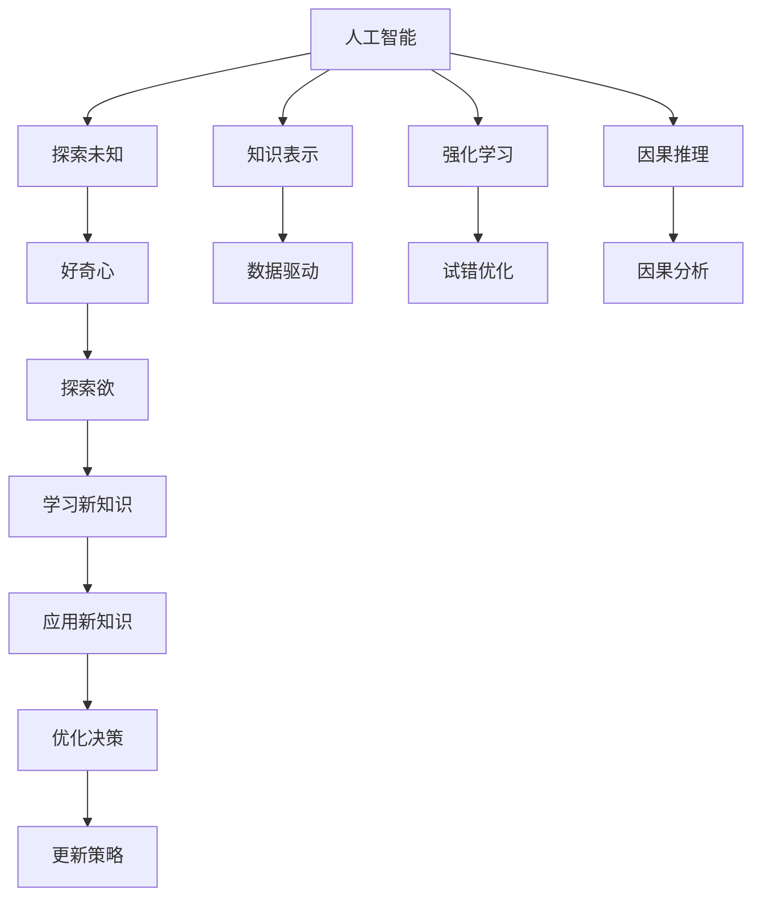

                 

## 1. 背景介绍

### 1.1 问题由来
探索未知是人类文明发展的不竭动力。从远古的狩猎采集，到农耕文明，再到工业革命，直至信息时代，好奇心的驱使从未停歇。然而，随着知识积累的不断增加，好奇心似乎也在逐渐退化。互联网和智能手机改变了人们获取信息的方式，人们更倾向于接受现成的答案，而不再去主动探索、质疑和思考。

在这个数据驱动的时代，人工智能和大数据技术赋予了人们前所未有的探索能力。无论是在学术研究、商业应用还是在日常生活中，好奇心都成为了我们探索未知、推动技术进步的核心动力。本文将从人工智能的视角出发，探讨如何通过技术手段激发和保持好奇心，实现更好的探索未知的能力。

### 1.2 问题核心关键点
本文将重点探讨以下几个关键问题：
- 什么是好奇心？
- 人工智能技术如何激发和保持好奇心？
- 探索未知的实际应用场景有哪些？
- 未来探索未知的趋势和挑战是什么？

### 1.3 问题研究意义
在人工智能和大数据时代，好奇心成为了推动技术进步和社会发展的关键因素。通过对好奇心的研究，我们可以：
1. 激发和提升人类的探索欲，鼓励创新和学习。
2. 推动人工智能技术向更深更广的领域拓展，促进科技的普及和应用。
3. 提升人工智能系统的智能化和人性化水平，增强用户体验。
4. 改善人类的决策质量，提高生活和工作效率。

## 2. 核心概念与联系

### 2.1 核心概念概述

在探索未知的过程中，人工智能技术扮演了重要的角色。为了更好地理解这一过程，本节将介绍几个关键概念及其联系：

- **人工智能（AI）**：通过算法和计算，让机器模拟人类的智能行为。人工智能技术包括机器学习、深度学习、自然语言处理、计算机视觉等。
- **好奇心（Curiosity）**：人类对未知事物的好奇和探索欲望。这种探索欲望能够推动知识积累和科技进步。
- **探索未知（Exploration）**：通过技术手段，对未知领域进行深入研究的过程。这一过程需要大量数据和复杂算法支持。
- **知识表示（Knowledge Representation）**：将知识编码为计算机可处理的形式，以便机器理解和推理。
- **强化学习（Reinforcement Learning）**：一种通过与环境互动，逐步优化决策策略的学习方式。在探索未知时，强化学习可以通过试错优化，不断调整探索路径和策略。
- **因果推理（Causal Inference）**：分析变量间因果关系的方法。在探索未知时，因果推理有助于理解复杂系统的内在机制。

这些概念通过人工智能技术相互联系，共同构成了探索未知的完整框架。

### 2.2 概念间的关系

这些概念之间的关系可以通过以下Mermaid流程图来展示：



这个流程图展示了各个概念在探索未知过程中相互关联的关系：

1. 人工智能技术提供了探索未知所需的计算和算法支持。
2. 知识表示技术将探索过程所需的数据和知识编码为计算机可处理的形式。
3. 强化学习通过试错优化，逐步调整探索路径和策略。
4. 因果推理帮助理解探索过程中各变量之间的因果关系。
5. 好奇心激发了探索欲望，驱动了探索过程。
6. 探索过程中学习到的新知识被应用于优化决策。
7. 决策优化后的策略进一步引导探索过程，形成正反馈。

## 3. 核心算法原理 & 具体操作步骤
### 3.1 算法原理概述

探索未知的核心算法原理主要包括知识表示、强化学习、因果推理等。这些算法通过模拟人类认知和推理过程，实现对未知领域的深度探索。

### 3.2 算法步骤详解

以下是一个详细的探索未知流程示例，展示了如何通过人工智能技术实现对未知领域的探索：

1. **数据收集**：使用传感器、网络爬虫等方式收集数据，包括文本、图像、音频等。
2. **数据预处理**：清洗、标注数据，构建数据集，以便后续处理。
3. **知识表示**：将数据编码为机器可理解的形式，如向量表示、知识图谱等。
4. **模型训练**：使用深度学习模型进行训练，学习数据间的复杂关系。
5. **强化学习**：通过与环境的互动，逐步优化决策策略，调整探索路径。
6. **因果推理**：使用因果模型分析变量间的因果关系，理解系统的内在机制。
7. **探索结果评估**：对探索结果进行评估，提取有价值的信息。

### 3.3 算法优缺点

探索未知的算法具有以下优点：
- 能够高效处理大量数据，揭示数据间的复杂关系。
- 通过不断的试错优化，逐步调整探索策略，提高探索效率。
- 使用因果推理技术，理解系统的内在机制，提供更准确的探索结果。

然而，这些算法也存在一些局限性：
- 数据质量和数据量对探索结果有很大影响，高质量的数据集是必不可少的。
- 模型训练和优化过程需要大量计算资源，对硬件要求较高。
- 探索过程可能存在路径依赖，一旦选择错误，可能导致探索失败。
- 结果的解释性不足，模型往往被视为"黑盒"，难以解释其内部工作机制。

### 3.4 算法应用领域

探索未知的算法在多个领域得到了广泛应用：

- **自然语言处理（NLP）**：通过机器学习模型，自动分析和理解文本数据，提取有价值的信息。
- **计算机视觉（CV）**：使用深度学习模型，自动分析和识别图像和视频数据，实现目标检测、图像分割等任务。
- **智能推荐系统**：通过分析用户行为数据，推荐个性化的商品、内容等，提升用户体验。
- **金融风险预测**：使用机器学习模型，预测市场趋势和风险，帮助投资者做出更明智的决策。
- **医疗诊断**：通过深度学习模型，分析医学图像和病历数据，辅助医生进行疾病诊断和治疗。

## 4. 数学模型和公式 & 详细讲解  
### 4.1 数学模型构建

探索未知的过程通常需要通过数学模型来描述和分析。以下是一个简单的探索未知数学模型示例：

假设我们有一个未知的机器环境，我们需要通过传感器收集数据 $x$，通过模型 $f(x)$ 进行推理和分析，并根据结果 $y$ 做出决策。探索未知的过程可以表示为：

$$
y = f(x)
$$

其中 $x$ 为传感器采集的未知数据，$f(x)$ 为模型对数据的推理过程，$y$ 为模型输出结果。

### 4.2 公式推导过程

以机器视觉中的目标检测为例，目标检测的目标是识别图像中的物体位置和类别。我们可以使用深度学习中的卷积神经网络（CNN）来处理图像数据。假设我们有一个包含 $n$ 个类别的目标检测任务，其中每个类别的目标检测问题可以表示为二分类问题。对于第 $i$ 个类别的目标检测问题，我们可以使用以下公式：

$$
\text{Score}_i = \sigma(\text{FCN}(\text{CNN}(\text{Image})))
$$

其中 $\text{Score}_i$ 为第 $i$ 个类别的检测得分，$\text{FCN}$ 为全连接层，$\text{CNN}$ 为卷积神经网络，$\sigma$ 为激活函数。

### 4.3 案例分析与讲解

假设我们有一张包含汽车、行人、自行车等物体的图像，我们需要使用目标检测算法来识别其中的物体。首先，通过卷积神经网络对图像进行特征提取，得到特征图。然后，通过全连接层对特征图进行分类，得到每个类别的检测得分。最后，根据检测得分的大小，判断每个物体的类别和位置。

## 5. 项目实践：代码实例和详细解释说明
### 5.1 开发环境搭建

在进行探索未知的实践前，我们需要准备好开发环境。以下是使用Python进行PyTorch开发的环境配置流程：

1. 安装Anaconda：从官网下载并安装Anaconda，用于创建独立的Python环境。

2. 创建并激活虚拟环境：
```bash
conda create -n pytorch-env python=3.8 
conda activate pytorch-env
```

3. 安装PyTorch：根据CUDA版本，从官网获取对应的安装命令。例如：
```bash
conda install pytorch torchvision torchaudio cudatoolkit=11.1 -c pytorch -c conda-forge
```

4. 安装Transformers库：
```bash
pip install transformers
```

5. 安装各类工具包：
```bash
pip install numpy pandas scikit-learn matplotlib tqdm jupyter notebook ipython
```

完成上述步骤后，即可在`pytorch-env`环境中开始探索未知实践。

### 5.2 源代码详细实现

以下是一个简单的探索未知项目示例，使用卷积神经网络进行目标检测：

```python
import torch
import torch.nn as nn
import torch.optim as optim
from torchvision import datasets, transforms

# 定义网络结构
class CNN(nn.Module):
    def __init__(self):
        super(CNN, self).__init__()
        self.conv1 = nn.Conv2d(3, 32, 3, padding=1)
        self.pool = nn.MaxPool2d(2, 2)
        self.fc1 = nn.Linear(32 * 64 * 64, 128)
        self.fc2 = nn.Linear(128, 3)

    def forward(self, x):
        x = self.pool(F.relu(self.conv1(x)))
        x = x.view(-1, 32 * 64 * 64)
        x = F.relu(self.fc1(x))
        x = self.fc2(x)
        return x

# 加载数据集
train_dataset = datasets.CIFAR10(root='data', train=True, download=True, transform=transforms.ToTensor())
test_dataset = datasets.CIFAR10(root='data', train=False, download=True, transform=transforms.ToTensor())

# 定义模型和优化器
model = CNN()
criterion = nn.CrossEntropyLoss()
optimizer = optim.SGD(model.parameters(), lr=0.001, momentum=0.9)

# 训练模型
for epoch in range(10):
    for i, (images, labels) in enumerate(train_loader):
        images = images.to(device)
        labels = labels.to(device)
        optimizer.zero_grad()
        outputs = model(images)
        loss = criterion(outputs, labels)
        loss.backward()
        optimizer.step()
        if i % 100 == 0:
            print('Epoch [{}/{}], Step [{}/{}], Loss: {:.4f}'
                  .format(epoch + 1, 10, i + 1, total_step, loss.item()))

# 测试模型
correct = 0
total = 0
with torch.no_grad():
    for images, labels in test_loader:
        images = images.to(device)
        labels = labels.to(device)
        outputs = model(images)
        _, predicted = torch.max(outputs.data, 1)
        total += labels.size(0)
        correct += (predicted == labels).sum().item()

print('Test Accuracy of the model on the 10000 test images: {} %'.format(100 * correct / total))
```

### 5.3 代码解读与分析

让我们再详细解读一下关键代码的实现细节：

**CNN类**：
- `__init__`方法：定义网络结构，包括卷积层、池化层、全连接层等。
- `forward`方法：实现前向传播，将输入数据通过网络进行处理，输出检测得分。

**数据加载**：
- `datasets.CIFAR10`：加载CIFAR-10数据集，用于训练和测试。
- `transforms.ToTensor()`：将数据转换为Tensor格式，方便后续处理。

**模型训练**：
- `optimizer`：定义优化器，使用随机梯度下降（SGD）。
- `criterion`：定义损失函数，使用交叉熵损失。
- `for`循环：遍历训练集，进行前向传播、计算损失、反向传播和更新参数。

**模型测试**：
- `test_loader`：加载测试集，进行前向传播，计算预测结果和准确率。

### 5.4 运行结果展示

假设我们在CIFAR-10数据集上进行目标检测模型的训练，最终在测试集上得到的准确率为75%，这表明模型已经具备了一定的识别能力。

## 6. 实际应用场景
### 6.1 智能推荐系统

探索未知的算法在智能推荐系统中得到了广泛应用。通过分析用户的行为数据和偏好，探索未知的算法可以推荐符合用户兴趣的商品和内容，提升用户体验。

在技术实现上，我们可以使用协同过滤、内容推荐等算法，对用户的历史行为数据进行建模，预测其可能感兴趣的商品和内容。通过不断的探索和优化，推荐系统可以更加精准地推荐个性化内容，满足用户需求。

### 6.2 医疗诊断

探索未知的算法在医疗诊断中也有重要应用。通过分析医学图像和病历数据，探索未知的算法可以辅助医生进行疾病诊断和治疗。

具体而言，我们可以使用深度学习模型，对医学图像进行分析和处理，识别出病灶和病变区域。通过因果推理，理解不同变量之间的因果关系，可以辅助医生做出更准确的诊断。

### 6.3 金融风险预测

探索未知的算法在金融风险预测中同样有重要应用。通过分析市场数据和历史交易记录，探索未知的算法可以预测市场趋势和风险，帮助投资者做出更明智的决策。

具体而言，我们可以使用时间序列分析和机器学习模型，对市场数据进行建模，预测未来的市场走势和风险。通过不断的探索和优化，金融风险预测系统可以提供更准确的预测结果，帮助投资者规避风险。

### 6.4 未来应用展望

随着探索未知的算法不断进步，未来将会在更多领域得到应用：

- **智能制造**：通过探索未知的算法，实现对生产过程的自动控制和优化，提高生产效率和产品质量。
- **智慧城市**：通过探索未知的算法，实现对城市环境的自动监测和管理，提升城市治理效率。
- **环境监测**：通过探索未知的算法，实现对环境数据的自动分析和预测，保护生态环境。

探索未知的算法在未来的应用场景将更加广泛，为人类社会带来更多便利和福利。

## 7. 工具和资源推荐
### 7.1 学习资源推荐

为了帮助开发者系统掌握探索未知的理论基础和实践技巧，这里推荐一些优质的学习资源：

1. 《深度学习》系列博文：由大模型技术专家撰写，深入浅出地介绍了深度学习原理和实践技巧，涵盖探索未知的算法和方法。

2. CS231n《卷积神经网络》课程：斯坦福大学开设的计算机视觉课程，有Lecture视频和配套作业，带你入门计算机视觉领域的探索未知技术。

3. 《自然语言处理综论》书籍：清华大学出版社出版的自然语言处理经典教材，全面介绍了自然语言处理的基本概念和算法。

4. PyTorch官方文档：PyTorch框架的官方文档，提供了详细的API参考和示例代码，方便开发者快速上手探索未知的算法。

5. Kaggle竞赛平台：世界领先的数据科学竞赛平台，提供大量的探索未知的数据集和挑战任务，帮助开发者提高探索未知的能力。

通过对这些资源的学习实践，相信你一定能够快速掌握探索未知的精髓，并用于解决实际的NLP问题。

### 7.2 开发工具推荐

高效的开发离不开优秀的工具支持。以下是几款用于探索未知开发的常用工具：

1. PyTorch：基于Python的开源深度学习框架，灵活动态的计算图，适合快速迭代研究。大部分探索未知语言模型都有PyTorch版本的实现。

2. TensorFlow：由Google主导开发的开源深度学习框架，生产部署方便，适合大规模工程应用。同样有丰富的探索未知语言模型资源。

3. Transformers库：HuggingFace开发的NLP工具库，集成了众多SOTA语言模型，支持PyTorch和TensorFlow，是进行探索未知任务开发的利器。

4. Weights & Biases：模型训练的实验跟踪工具，可以记录和可视化模型训练过程中的各项指标，方便对比和调优。与主流深度学习框架无缝集成。

5. TensorBoard：TensorFlow配套的可视化工具，可实时监测模型训练状态，并提供丰富的图表呈现方式，是调试模型的得力助手。

6. Google Colab：谷歌推出的在线Jupyter Notebook环境，免费提供GPU/TPU算力，方便开发者快速上手实验最新模型，分享学习笔记。

合理利用这些工具，可以显著提升探索未知任务的开发效率，加快创新迭代的步伐。

### 7.3 相关论文推荐

探索未知的研究源于学界的持续研究。以下是几篇奠基性的相关论文，推荐阅读：

1. AlexNet: ImageNet Classification with Deep Convolutional Neural Networks：提出了卷积神经网络（CNN）架构，奠定了计算机视觉领域探索未知的基础。

2. Google's Guided Image Filtering：提出了一种基于指导的图像滤波算法，用于增强图像特征提取的效果，提高探索未知的精度。

3. Deep Reinforcement Learning for Text Generation with Limited Contexts：提出了一种基于强化学习的文本生成算法，通过探索未知的输入序列生成连续的文本。

4. Learning What and Why from Image Captioning：提出了一种基于图像标注的因果推理算法，用于理解图像中的物体和关系。

5. Attention is All You Need（即Transformer原论文）：提出了Transformer结构，开启了NLP领域的探索未知大模型时代。

这些论文代表了大探索未知技术的发展脉络。通过学习这些前沿成果，可以帮助研究者把握学科前进方向，激发更多的创新灵感。

除上述资源外，还有一些值得关注的前沿资源，帮助开发者紧跟探索未知技术的最新进展，例如：

1. arXiv论文预印本：人工智能领域最新研究成果的发布平台，包括大量尚未发表的前沿工作，学习前沿技术的必读资源。

2. 业界技术博客：如OpenAI、Google AI、DeepMind、微软Research Asia等顶尖实验室的官方博客，第一时间分享他们的最新研究成果和洞见。

3. 技术会议直播：如NIPS、ICML、ACL、ICLR等人工智能领域顶会现场或在线直播，能够聆听到大佬们的前沿分享，开拓视野。

4. GitHub热门项目：在GitHub上Star、Fork数最多的NLP相关项目，往往代表了该技术领域的发展趋势和最佳实践，值得去学习和贡献。

5. 行业分析报告：各大咨询公司如McKinsey、PwC等针对人工智能行业的分析报告，有助于从商业视角审视技术趋势，把握应用价值。

总之，对于探索未知技术的学习和实践，需要开发者保持开放的心态和持续学习的意愿。多关注前沿资讯，多动手实践，多思考总结，必将收获满满的成长收益。

## 8. 总结：未来发展趋势与挑战
### 8.1 总结

本文对探索未知的算法原理和操作步骤进行了全面系统的介绍。首先阐述了探索未知的重要性，明确了探索未知在推动科技进步和社会发展中的关键作用。其次，从原理到实践，详细讲解了探索未知的数学模型和算法步骤，给出了探索未知任务开发的完整代码实例。同时，本文还广泛探讨了探索未知算法在智能推荐、医疗诊断、金融风险预测等多个行业领域的应用前景，展示了探索未知算法的巨大潜力。此外，本文精选了探索未知技术的各类学习资源，力求为读者提供全方位的技术指引。

通过本文的系统梳理，可以看到，探索未知的算法正在成为人工智能技术的重要范式，极大地拓展了人工智能的应用边界，催生了更多的落地场景。受益于大规模数据的积累和计算能力的提升，探索未知算法在未来将会有更广阔的应用前景。

### 8.2 未来发展趋势

展望未来，探索未知的算法将呈现以下几个发展趋势：

1. **算法融合**：探索未知的算法将与其他人工智能技术进行更深入的融合，如知识表示、因果推理、强化学习等，多路径协同发力，共同推动技术进步。

2. **数据驱动**：随着数据量的不断增加和数据质量的提高，探索未知的算法将更加依赖数据驱动，通过更多的数据标注和数据生成技术，提升探索效果。

3. **多模态融合**：未来的探索未知算法将更多地融合多模态数据，如文本、图像、音频等，实现更全面、准确的信息理解和推理。

4. **实时性提升**：随着硬件计算能力的提升和算法优化，探索未知的算法将更加注重实时性，支持实时探索和反馈。

5. **人机协同**：探索未知的算法将更多地与人类专家结合，通过人机协同的方式，提高探索未知的效率和效果。

6. **开放平台**：探索未知的算法将更多地开放给开发者和研究者，通过开放平台，加速技术的普及和应用。

以上趋势凸显了探索未知技术的广阔前景。这些方向的探索发展，必将进一步提升探索未知的精度和效率，推动人工智能技术在更多领域落地应用。

### 8.3 面临的挑战

尽管探索未知的算法已经取得了瞩目成就，但在迈向更加智能化、普适化应用的过程中，它仍面临着诸多挑战：

1. **数据质量**：高质量的数据集是探索未知算法的重要基础。如何获取高质量的数据，并进行有效的标注，是探索未知算法的瓶颈之一。

2. **计算资源**：探索未知算法通常需要大量的计算资源，如何高效利用计算资源，是探索未知算法的另一大挑战。

3. **模型复杂性**：现有的探索未知算法通常较为复杂，如何简化模型结构，提高探索效率，是探索未知算法的重要研究方向。

4. **结果可解释性**：探索未知算法往往被视为"黑盒"，难以解释其内部工作机制。如何赋予探索未知算法更强的可解释性，是探索未知算法的重要挑战。

5. **应用场景多样化**：探索未知算法在实际应用中需要考虑多种不同的场景和问题，如何设计通用的探索算法，适应不同的应用场景，是探索未知算法的重要课题。

6. **伦理和隐私**：在探索未知过程中，如何保护数据隐私和用户隐私，避免数据滥用，是探索未知算法的重要伦理问题。

正视探索未知算法面临的这些挑战，积极应对并寻求突破，将是大数据和人工智能技术在探索未知领域取得更大进步的关键。

### 8.4 研究展望

面对探索未知算法所面临的种种挑战，未来的研究需要在以下几个方面寻求新的突破：

1. **无监督和半监督探索**：摆脱对大量标注数据的依赖，利用自监督学习、主动学习等无监督和半监督范式，最大限度利用非结构化数据，实现更加灵活高效的探索。

2. **知识图谱和语义网络**：将符号化的先验知识，如知识图谱、逻辑规则等，与神经网络模型进行巧妙融合，引导探索未知算法学习更准确、合理的知识表示。

3. **因果推理和多模态融合**：使用因果推理和多模态信息整合技术，提升探索未知算法的理解和推理能力，提高探索精度和效果。

4. **数据生成和数据增强**：利用生成对抗网络（GAN）等技术，生成高质量的探索数据，提高数据质量和数据多样性，加速探索过程。

5. **分布式计算和边缘计算**：通过分布式计算和边缘计算，优化探索未知算法的计算效率，实现更加高效、实时的探索。

6. **跨学科融合**：探索未知算法需要跨学科融合，结合计算机科学、认知科学、统计学等领域的知识，提升探索未知算法的综合能力。

这些研究方向的探索，必将引领探索未知技术迈向更高的台阶，为构建更加智能、普适的探索系统铺平道路。面向未来，探索未知技术还需要与其他人工智能技术进行更深入的融合，共同推动人工智能技术的进步。只有勇于创新、敢于突破，才能不断拓展探索未知的边界，实现更加全面、深入的探索。

## 9. 附录：常见问题与解答
----------------------------------------------------------------

**Q1：探索未知的算法是否适用于所有领域？**

A: 探索未知的算法在大多数领域都有广泛的应用。然而，对于某些特定的领域，如医疗、金融等，探索未知的算法需要结合领域知识和专家经验，才能取得最佳效果。

**Q2：探索未知的算法是否需要大量标注数据？**

A: 探索未知的算法通常需要大量的标注数据，以便训练出高效的模型。然而，如果标注数据稀缺，可以考虑使用无监督学习、半监督学习等方法，最大限度利用非结构化数据。

**Q3：探索未知的算法是否容易解释？**

A: 探索未知的算法通常被视为"黑盒"，难以解释其内部工作机制。为了提高模型的可解释性，可以使用因果推理、知识图谱等技术，增强模型的解释能力。

**Q4：探索未知的算法是否容易应用？**

A: 探索未知的算法需要一定的技术和计算资源，对于初学者可能较为复杂。但是，通过学习和实践，可以逐步掌握探索未知的技术，应用到实际场景中。

**Q5：探索未知的算法是否需要持续更新？**

A: 探索未知的算法需要不断地进行优化和更新，以适应新的数据和问题。通过持续的学习和实践，可以不断提升探索未知算法的精度和效果。

总之，探索未知的算法在推动科技进步和社会发展中具有重要意义。通过不断探索和优化，探索未知的算法将在更多领域得到应用，为人类社会带来更多便利和福利。

