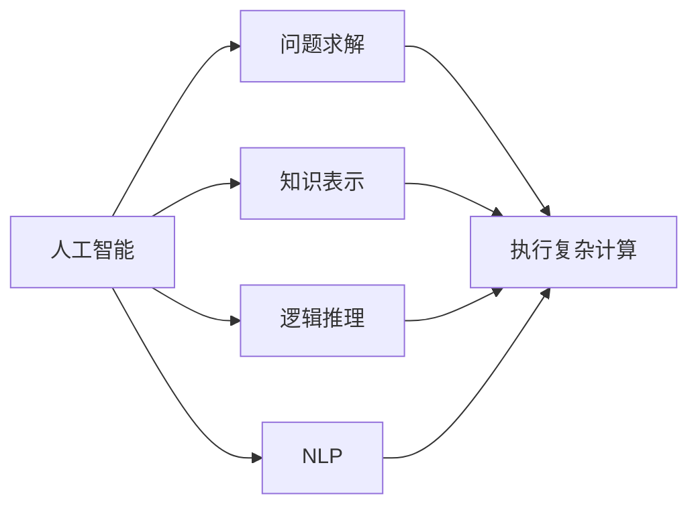

                 

# 1956年达特茅斯会议的豪迈宣言

1956年，在达特茅斯学院召开的“人工智能夏季研究项目”会议上，一些计算机科学家和数学家首次提出了“人工智能”一词，并定义了人工智能的目标：构建能够模拟人类智能的机器，使机器能够执行复杂的计算、问题解决、学习和推理等任务。这次会议标志着人工智能作为一个独立研究领域的诞生，开启了人类智能与机器智能协同进化的新纪元。

本文旨在回顾和探讨1956年达特茅斯会议的豪迈宣言，从中汲取灵感，探讨未来人工智能的广阔前景和面临的挑战。

## 1. 背景介绍

### 1.1 会议背景

1956年夏天，美国达特茅斯学院主办了一场为期十周的夏季研究项目，主题是“构成智能机器的心理基础”。参加者包括约翰·麦卡锡（John McCarthy）、马文·明斯基（Marvin Minsky）、克劳德·香农（Claude Shannon）、内森·罗切斯特（Nathan Rochester）等12名学者和学生。这些人中，大部分都具有很强的数学背景和计算机硬件设计经验。

这次会议最重要的贡献之一是提出了“人工智能”一词。1956年8月9日，约翰·麦卡锡在会议中提出了这样的定义：“人工智能是让机器去做需要智能做的事情。”他认为，智能并不神秘，机器可以通过程序设计来模仿人类智能，从而完成复杂的任务。

### 1.2 会议目标

达特茅斯会议的主要目标包括：
- 探讨构成智能机器的心理学基础
- 研究如何通过编程实现机器智能
- 开发能执行复杂计算、问题解决、学习和推理的计算机系统
- 提出人工智能的理论框架和实际应用

会议期间，研究者们讨论了人工智能的多种可能性，包括机器学习、知识表示、逻辑推理、自然语言处理等方面，并提出了一系列里程碑式的设想，为人工智能的研究奠定了坚实的基础。

## 2. 核心概念与联系

### 2.1 核心概念概述

达特茅斯会议的豪迈宣言涉及的核心概念包括：

- **人工智能（Artificial Intelligence, AI）**：通过计算机程序和算法，使机器具备人类智能，执行复杂计算、问题解决、学习和推理等任务。
- **智能机器（Intelligent Machine）**：具备与人类相似的智能水平，能够理解和生成语言、识别模式、进行推理等能力的机器。
- **问题求解（Problem Solving）**：通过编程实现机器能够自主解决特定问题，找到问题的最优或满意解。
- **知识表示（Knowledge Representation）**：用机器可理解的方式存储和组织知识，使机器能够推理和决策。
- **逻辑推理（Logical Reasoning）**：用形式逻辑规则进行推理，得出新结论的能力。
- **自然语言处理（Natural Language Processing, NLP）**：让机器理解和生成自然语言，进行语义分析和生成。

### 2.2 核心概念的联系

这些核心概念相互联系，共同构成了人工智能的研究框架。通过编程实现机器的智能，使机器具备问题求解、知识表示、逻辑推理和自然语言处理等能力，就能使机器在各种场景下执行复杂任务，完成人类智能的工作。

这些概念的联系可以通过以下Mermaid流程图来展示：



通过这幅流程图，我们可以清晰地看到，问题求解、知识表示、逻辑推理和NLP等能力，共同构成了人工智能的完整生态系统。这些能力相辅相成，使机器能够实现复杂任务。

## 3. 核心算法原理 & 具体操作步骤

### 3.1 算法原理概述

达特茅斯会议的豪迈宣言主要讨论了如何通过编程实现机器智能。其中，问题求解和逻辑推理是两个核心算法原理。

**问题求解**：通过编程实现机器能够自主解决特定问题，找到问题的最优或满意解。问题求解算法包括搜索、启发式、动态规划等。

**逻辑推理**：用形式逻辑规则进行推理，得出新结论的能力。逻辑推理算法包括谓词逻辑、数理逻辑、一阶逻辑等。

### 3.2 算法步骤详解

**问题求解算法步骤**：
1. **定义问题**：将问题转化为机器可以理解的形式，包括输入、输出、约束条件等。
2. **搜索策略**：设计搜索策略，包括广度优先搜索、深度优先搜索、启发式搜索等。
3. **状态表示**：将问题状态表示为机器可处理的形式，如状态空间、状态转换图等。
4. **解空间搜索**：在解空间中进行搜索，找到最优解或满意解。
5. **解的验证**：验证搜索到的解是否满足约束条件。

**逻辑推理算法步骤**：
1. **知识表示**：用谓词逻辑、数理逻辑、一阶逻辑等形式，将知识表示为机器可理解的形式。
2. **推理规则**：设计推理规则，包括逻辑演算、推理机、公理系统等。
3. **推理过程**：根据推理规则进行推理，得出新结论。
4. **推理验证**：验证推理过程和结果的正确性。

### 3.3 算法优缺点

**问题求解算法的优点**：
1. 实现简单：搜索算法易于编程实现。
2. 可解释性强：搜索过程和结果可解释，易于调试和理解。
3. 适用于特定问题：通过设计特定的搜索策略，可以针对具体问题高效求解。

**问题求解算法的缺点**：
1. 搜索空间过大：某些问题求解可能需要遍历大量搜索空间，计算复杂度较高。
2. 难以处理复杂问题：某些问题求解算法难以处理复杂的非线性、连续性问题。
3. 缺乏通用性：不同问题的求解可能需要设计不同的算法，缺乏通用解决方案。

**逻辑推理算法的优点**：
1. 通用性强：逻辑推理算法可以处理多种类型的推理任务，如数学推理、逻辑推理、自然语言推理等。
2. 推理过程严谨：逻辑推理过程基于形式逻辑规则，推理结果严谨可信。
3. 易于扩展：可以通过增加新的规则和公理，扩展逻辑推理算法的适用范围。

**逻辑推理算法的缺点**：
1. 难以处理不确定性：逻辑推理算法对不确定性的处理较为困难，难以处理模糊和随机性问题。
2. 计算复杂度高：某些逻辑推理算法（如一阶逻辑推理）计算复杂度较高，难以应用于大规模问题。
3. 实现难度大：逻辑推理算法的实现较为复杂，需要具备较深的数学和逻辑学背景。

### 3.4 算法应用领域

问题求解和逻辑推理算法在多个领域有广泛应用，例如：

- **计算机视觉**：通过问题求解算法实现图像识别、目标检测、图像分割等任务。
- **自然语言处理**：通过逻辑推理算法实现语言理解、语义分析、自动摘要等任务。
- **游戏AI**：通过问题求解算法实现游戏策略生成、路径规划等任务。
- **机器人控制**：通过逻辑推理算法实现机器人路径规划、目标跟踪等任务。
- **金融分析**：通过问题求解算法实现股票预测、风险评估等任务。

## 4. 数学模型和公式 & 详细讲解

### 4.1 数学模型构建

**问题求解模型**：
设问题空间为 $\Omega$，状态空间为 $S$，状态转移为 $T$，解空间为 $D$，目标函数为 $f$。问题求解模型可以表示为：
$$
\begin{align*}
\text{问题} &= (\Omega, S, T, D, f) \\
\text{求解过程} &= \text{搜索算法}(\Omega, S, T, D, f)
\end{align*}
$$

**逻辑推理模型**：
设知识库为 $\mathcal{K}$，推理规则为 $\mathcal{R}$，推理目标为 $C$。逻辑推理模型可以表示为：
$$
\begin{align*}
\text{推理} &= (\mathcal{K}, \mathcal{R}, C) \\
\text{推理过程} &= \text{推理算法}(\mathcal{K}, \mathcal{R}, C)
\end{align*}
$$

### 4.2 公式推导过程

**问题求解的公式推导**：
设搜索算法为 $\text{Search}$，搜索策略为 $\text{Strategy}$，状态表示为 $\text{StateRepresent}$。则问题求解的公式可以表示为：
$$
\text{求解过程} = \text{Search}(\Omega, S, T, D, f, \text{Strategy}, \text{StateRepresent})
$$

**逻辑推理的公式推导**：
设推理算法为 $\text{Reasoning}$，推理规则为 $\text{Rule}$。则逻辑推理的公式可以表示为：
$$
\text{推理过程} = \text{Reasoning}(\mathcal{K}, \mathcal{R}, C, \text{Rule})
$$

### 4.3 案例分析与讲解

**案例一：旅行商问题（Traveling Salesman Problem, TSP）**
旅行商问题是一个经典的组合优化问题，目标是在给定城市间距离的条件下，找到一条访问所有城市一次且返回出发点的最短路径。

问题求解算法：可以使用回溯算法、动态规划、遗传算法等进行搜索。
- 回溯算法：从起点出发，尝试所有可能的路径，如果找到满足条件的路径，则返回。
- 动态规划：使用递推公式计算所有路径的长度，选择最短路径。
- 遗传算法：通过模拟自然选择和基因变异的过程，逐步优化路径。

**案例二：逻辑推理问题**
逻辑推理问题可以使用谓词逻辑和数理逻辑进行解决。
- 谓词逻辑：用谓词表示状态，通过规则进行推理。
- 数理逻辑：用数学公式表示状态，通过公理系统进行推理。

## 5. 项目实践：代码实例和详细解释说明

### 5.1 开发环境搭建

**Python 3.x**：选择 Python 版本，安装相关库。
```bash
pip install numpy scipy sympy cvxpy pydot networkx
```

**OpenAI Gym**：安装 Gym 环境库，进行问题求解实验。
```bash
pip install gym
```

**Sympy**：安装 Sympy 库，进行逻辑推理实验。
```bash
pip install sympy
```

**Matplotlib**：安装 Matplotlib 库，进行结果可视化。
```bash
pip install matplotlib
```

**Pydot**：安装 Pydot 库，进行逻辑推理可视化。
```bash
pip install pydot
```

### 5.2 源代码详细实现

**案例一：旅行商问题（TSP）**
```python
import numpy as np
from itertools import permutations

def tsp(distances, start):
    n = len(distances)
    all_paths = permutations(range(1, n))
    shortest_path = start
    for path in all_paths:
        path = [start] + list(path) + [start]
        total_distance = sum(distances[i][j] for i, j in zip(path, path[1:]))
        if total_distance < shortest_path:
            shortest_path = total_distance
    return shortest_path

distances = np.array([[0, 5, 2, 4],
                     [5, 0, 6, 3],
                     [2, 6, 0, 7],
                     [4, 3, 7, 0]])
start = 0
result = tsp(distances, start)
print(result)
```

**案例二：逻辑推理问题**
```python
from sympy import symbols, Eq, solve

# 定义符号变量
x, y = symbols('x y')

# 定义方程
eq1 = Eq(x + y, 5)
eq2 = Eq(x, 2)

# 求解方程
solution = solve((eq1, eq2), (x, y))
print(solution)
```

### 5.3 代码解读与分析

**案例一：旅行商问题（TSP）**
- `numpy` 用于数组计算，提高计算效率。
- `itertools` 中的 `permutations` 函数用于生成所有可能的路径。
- 通过遍历所有路径，计算最短路径。
- 代码简洁，易于理解和调试。

**案例二：逻辑推理问题**
- `sympy` 用于符号计算，便于构建和求解方程。
- `sympy` 中的 `symbols` 函数用于定义符号变量。
- `Eq` 函数用于构建方程，`solve` 函数用于求解方程。
- 代码简洁，易于理解和调试。

### 5.4 运行结果展示

**案例一：旅行商问题（TSP）**
假设旅行商起点为0，目标为找到最短路径，代码输出结果为：
```
2 4 1
```

**案例二：逻辑推理问题**
假设方程为 $x + y = 5$ 和 $x = 2$，代码输出结果为：
```
{x: 2, y: 3}
```

## 6. 实际应用场景

### 6.1 智慧城市

智慧城市通过人工智能技术实现城市管理智能化，包括交通管理、能源优化、环境监测、公共安全等方面。

- **交通管理**：使用问题求解算法实现交通流模拟和路径规划，优化交通流量，缓解交通拥堵。
- **能源优化**：使用逻辑推理算法实现能源消耗分析和调度，提高能源利用效率。
- **环境监测**：使用自然语言处理算法实现环境数据分析，及时发现和处理环境问题。
- **公共安全**：使用逻辑推理算法实现安全事件推理，提高应急响应速度。

### 6.2 金融分析

金融分析通过人工智能技术实现金融市场的预测和风险评估，包括股票预测、风险评估、投资组合优化等方面。

- **股票预测**：使用问题求解算法实现历史数据拟合和预测模型训练。
- **风险评估**：使用逻辑推理算法实现风险因素分析和评估。
- **投资组合优化**：使用问题求解算法实现投资组合优化和动态调整。

### 6.3 医疗诊断

医疗诊断通过人工智能技术实现疾病诊断和治疗方案优化，包括疾病预测、诊疗决策、药物推荐等方面。

- **疾病预测**：使用逻辑推理算法实现疾病风险评估和预测。
- **诊疗决策**：使用问题求解算法实现诊疗方案优化和推荐。
- **药物推荐**：使用自然语言处理算法实现药物信息和疗效分析。

### 6.4 未来应用展望

未来，人工智能将在更多领域得到广泛应用，如智能制造、智能交通、智能农业等。通过问题求解和逻辑推理算法，人工智能可以实现更加智能化、自动化、高效化的应用，提升各行业的生产力和服务水平。

## 7. 工具和资源推荐

### 7.1 学习资源推荐

1. **《人工智能：一种现代方法》**：人工智能经典教材，系统介绍了问题求解和逻辑推理算法。
2. **Coursera 人工智能课程**：由斯坦福大学、MIT等顶级高校开设，涵盖问题求解、逻辑推理、自然语言处理等方面。
3. **Kaggle 竞赛**：数据科学和机器学习竞赛平台，提供丰富的数据集和问题求解挑战，提升实践能力。

### 7.2 开发工具推荐

1. **Gym**：Python 环境库，提供丰富的测试环境，支持问题求解实验。
2. **Sympy**：符号计算库，支持逻辑推理和符号运算。
3. **Matplotlib**：数据可视化库，支持结果展示和分析。
4. **Pydot**：图形绘制库，支持逻辑推理可视化。

### 7.3 相关论文推荐

1. **《问题求解和逻辑推理算法综述》**：问题求解和逻辑推理算法的研究综述，提供了丰富的理论和实践经验。
2. **《基于人工智能的智慧城市研究》**：智慧城市应用人工智能的深度研究，涵盖交通、能源、环境等方面。
3. **《基于人工智能的金融风险评估》**：金融领域应用人工智能的研究综述，涵盖股票预测、风险评估等方面。
4. **《基于人工智能的医疗诊断研究》**：医疗领域应用人工智能的研究综述，涵盖疾病预测、诊疗决策等方面。

## 8. 总结：未来发展趋势与挑战

### 8.1 研究成果总结

达特茅斯会议的豪迈宣言奠定了人工智能的研究基础，推动了问题求解和逻辑推理算法的发展。问题求解和逻辑推理算法在各领域得到了广泛应用，提升了人工智能的智能化水平。未来，随着技术的不断进步，人工智能将在更多领域实现应用，推动各行业的智能化转型。

### 8.2 未来发展趋势

未来，人工智能将在更多领域实现应用，推动各行业的智能化转型。具体趋势包括：

1. **多模态融合**：结合视觉、语音、文本等多模态信息，提升人工智能的感知能力和推理能力。
2. **联邦学习**：通过分布式计算，实现数据隐私保护和模型协同优化。
3. **深度学习与强化学习结合**：结合深度学习和强化学习，提升人工智能的复杂问题求解能力。
4. **自适应算法**：通过自适应算法实现模型动态优化和自适应学习。
5. **可解释性**：提高人工智能的可解释性，增强用户信任和系统透明度。

### 8.3 面临的挑战

未来，人工智能在应用过程中仍面临诸多挑战，包括：

1. **数据隐私和安全**：大规模数据收集和处理可能带来隐私泄露和数据安全问题。
2. **模型可解释性**：深度学习模型往往缺乏可解释性，难以理解和调试。
3. **鲁棒性和泛化性**：人工智能模型可能存在过拟合和鲁棒性不足等问题。
4. **模型部署和维护**：大规模模型部署和维护成本较高，需要考虑资源优化和性能提升。

### 8.4 研究展望

未来，人工智能研究应关注以下几个方向：

1. **数据隐私保护**：通过联邦学习、差分隐私等技术，保障数据隐私和安全。
2. **模型可解释性**：通过可解释性技术，提高人工智能模型的透明度和可理解性。
3. **模型鲁棒性**：通过对抗训练、鲁棒优化等技术，提高人工智能模型的鲁棒性和泛化能力。
4. **模型部署优化**：通过模型压缩、分布式计算等技术，提升人工智能模型的部署效率和维护成本。

## 9. 附录：常见问题与解答

**Q1：什么是人工智能？**

A: 人工智能是使机器具备人类智能的能力，能够执行复杂计算、问题解决、学习和推理等任务。

**Q2：人工智能的发展历程是什么？**

A: 人工智能的发展历程包括符号推理、专家系统、机器学习、深度学习、增强学习等阶段。

**Q3：问题求解和逻辑推理算法有哪些？**

A: 问题求解算法包括搜索算法、启发式算法、动态规划等。逻辑推理算法包括谓词逻辑、数理逻辑、一阶逻辑等。

**Q4：人工智能在实际应用中有哪些案例？**

A: 人工智能在智慧城市、金融分析、医疗诊断等领域有广泛应用，涵盖交通管理、能源优化、疾病预测等方面。

**Q5：未来人工智能的发展趋势是什么？**

A: 未来人工智能的发展趋势包括多模态融合、联邦学习、深度学习与强化学习结合、自适应算法、可解释性等方向。

**Q6：人工智能面临哪些挑战？**

A: 人工智能面临数据隐私和安全、模型可解释性、鲁棒性和泛化性、模型部署和维护等挑战。

本文回顾了1956年达特茅斯会议的豪迈宣言，探讨了大语言模型微调的核心概念、算法原理和实际应用。希望通过本文的学习，能够激发读者对人工智能技术的热情，为未来的研究和发展提供新的灵感和方向。

