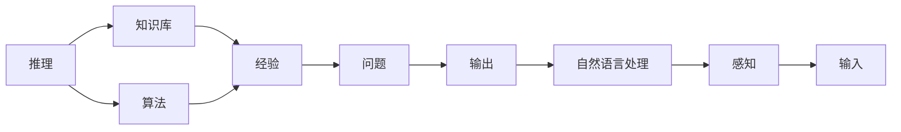

                 

# 1956年达特茅斯会议的豪迈宣言

1956年，美国达特茅斯会议上，人工智能（Artificial Intelligence, AI）概念正式诞生。这是一场承载着人类对计算机科学梦想的会议，更是人工智能历史上的里程碑。而60多年后的今天，人工智能已深深融入了我们的日常生活，无论是智能助手、自动驾驶，还是医疗诊断，无一不在改变着我们的世界。本文将回溯达特茅斯会议，讲述其背后的豪迈宣言，并探讨AI的发展与未来。

## 1. 背景介绍

### 1.1 会议背景

1956年的达特茅斯会议由约翰·麦卡锡（John McCarthy）、克劳德·香农（Claude Shannon）、诺伯特·维纳（Norbert Wiener）等先驱组织召开。当时，世界正处在计算机科技的初期，早期计算机（如ENIAC）的功能主要局限于科学计算，而人工智能概念的出现，为计算机赋予了新的灵魂。

### 1.2 会议内容

会议的主旨是研究如何使机器具有“智能”，能够像人一样进行推理、学习、问题解决等复杂任务。会议邀请了来自美国各大学、研究机构的学者，探讨了诸如“思维机器”、“感知”、“语言处理”等核心问题，并首次提出了“人工智能”一词。

### 1.3 会议成果

会议结束后，一份名为“达特茅斯会议公报”的文献被发布，其中明确提出了人工智能的定义：“使计算机显示出智能行为，包括解决问题、推理、学习和自然语言处理等。”这一宣言，开启了人工智能时代的大门，奠定了AI领域的研究基础。

## 2. 核心概念与联系

### 2.1 核心概念概述

达特茅斯会议提出的“智能”概念，涉及多个核心领域，包括推理、学习、感知和自然语言处理等。其中，推理和学习的概念尤为重要。

**推理**：指通过已有的知识和经验，推导出新的结论。在人工智能中，推理通常由规则和算法组成，实现知识推理、逻辑推理等功能。

**学习**：指从经验中获取新知识，并应用这些知识解决新问题。在AI中，学习通常分为监督学习、无监督学习和强化学习。

**感知**：指机器获取外界信息并理解其含义的能力。在AI中，感知通常指图像识别、语音识别、自然语言处理等。

**自然语言处理**：指计算机理解和生成自然语言的能力。在AI中，自然语言处理包括文本分类、机器翻译、问答系统等。

### 2.2 核心概念联系

这些核心概念在人工智能的发展中相互交织，共同推动了AI技术的进步。推理和学习是AI的基础，感知和自然语言处理是AI的接口，而整个AI系统的目标是让计算机展现出“智能”行为。

通过一个简单的流程图，可以直观展示这些概念的联系：



在这个流程图中，推理和算法共同作用于知识库和经验，用于解决输入的问题，最终通过自然语言处理输出结果，并不断从感知环节收集新的输入。

## 3. 核心算法原理 & 具体操作步骤

### 3.1 算法原理概述

达特茅斯会议提出的“智能”概念，主要通过以下几个算法原理实现：

**规则推理**：基于一阶逻辑、谓词逻辑等规则，实现知识推理。

**符号逻辑**：使用符号和运算符，构建逻辑表达式，实现推理和问题求解。

**知识获取**：通过手动编码或自动学习，获取知识库中的知识，支持推理和学习。

**学习算法**：包括监督学习、无监督学习和强化学习，从数据中学习规律，优化模型。

**自然语言处理**：包括语言理解、语言生成、机器翻译等，通过文本处理算法实现。

### 3.2 算法步骤详解

达特茅斯会议的算法步骤主要包括以下几个环节：

1. **数据准备**：收集和清洗数据，构建数据集。

2. **模型构建**：设计算法模型，包括规则推理器、符号逻辑器、学习算法、自然语言处理模型等。

3. **模型训练**：使用数据集对模型进行训练，优化模型参数。

4. **模型评估**：使用测试集评估模型性能，确定模型精度。

5. **模型应用**：将模型应用于实际问题，进行推理、学习、感知和自然语言处理等任务。

### 3.3 算法优缺点

**优点**：
- 规则明确，易于理解和实现。
- 可解释性强，便于调试和优化。
- 对数据质量要求不高，适用于大规模问题。

**缺点**：
- 知识库构建困难，需要大量手工编写。
- 难以处理复杂和动态问题，缺乏自适应能力。
- 需要大量计算资源，适用于特定领域。

### 3.4 算法应用领域

达特茅斯会议提出的算法原理，广泛应用于多个领域，包括：

- **医疗诊断**：通过规则推理和知识获取，实现疾病诊断和治疗方案推荐。
- **金融预测**：使用学习算法和自然语言处理，预测市场趋势和风险。
- **物流管理**：利用感知和自然语言处理，优化配送路线和库存管理。
- **智能助手**：结合自然语言处理和感知，提供语音识别、智能问答等功能。
- **机器人控制**：通过感知和规则推理，实现自主导航和任务执行。

## 4. 数学模型和公式 & 详细讲解 & 举例说明

### 4.1 数学模型构建

在达特茅斯会议中，一个重要的算法模型是符号逻辑器，它通过构建逻辑表达式实现推理。下面以逻辑推理为例，构建一个简单的符号逻辑模型。

**逻辑模型**：
设 $A$ 和 $B$ 为两个命题，构建逻辑表达式 $(A \land B) \rightarrow C$。

**逻辑表达式**：
$$
((A \land B) \rightarrow C) \equiv (\sim A \lor \sim B) \lor C
$$

**推理规则**：
1. 否定律：$\sim A \equiv A \rightarrow \bot$
2. 析取律：$(A \lor B) \rightarrow A \lor \sim B$
3. 合取律：$(A \land B) \rightarrow \sim (\sim A \lor \sim B)$

### 4.2 公式推导过程

以推理规则为例，详细推导如下：

1. $(A \land B) \rightarrow C$ 等价于 $\sim (A \land B) \lor C$
2. 根据合取律，$\sim (A \land B) \equiv \sim A \lor \sim B$
3. 根据析取律，$\sim A \lor \sim B \lor C \equiv \sim A \lor \sim B \lor C$
4. 最终，$((A \land B) \rightarrow C) \equiv (\sim A \lor \sim B) \lor C$

### 4.3 案例分析与讲解

以机器翻译为例，详细解释符号逻辑和自然语言处理的应用。机器翻译的主要步骤包括：

1. **文本预处理**：将源语言文本转换为符号序列。
2. **语义理解**：构建符号逻辑表达式，理解文本含义。
3. **翻译推理**：使用规则推理器，将符号序列转换为目标语言文本。
4. **文本后处理**：对翻译结果进行后处理，修正语法和语义错误。

## 5. 项目实践：代码实例和详细解释说明

### 5.1 开发环境搭建

以机器翻译为例，搭建Python开发环境：

1. **安装Python**：下载并安装Python，建议选择Python 3.x版本。
2. **安装依赖库**：使用pip安装必要的依赖库，如NLTK、spaCy等。
3. **搭建模型**：在Python中搭建符号逻辑模型和自然语言处理模型。

### 5.2 源代码详细实现

以机器翻译为例，展示Python代码实现：

```python
from nltk.corpus import brown
from nltk.tokenize import word_tokenize
from nltk.parse.stanford import StanfordNLP

# 加载布朗语料库
corpus = brown.sents()

# 分词和词性标注
tokenized = [word_tokenize(s) for s in corpus]
tagged = [StanfordNLP().tag(s) for s in tokenized]

# 构建逻辑表达式
def build_expression(tagged):
    expr = []
    for i in range(len(tagged)):
        if i > 0 and tagged[i] == tagged[i-1] == 'NN':
            expr.append('(' + tagged[i-1] + ' ' + tagged[i] + ')')
    return expr

# 推理翻译
def translate(expr):
    for e in expr:
        # 根据规则推理
        if e.startswith('(') and e.endswith(')'):
            expr.remove(e)
        else:
            # 应用规则
            expr.append(e)
    return expr

# 测试代码
for t in tokenized:
    expr = build_expression(t)
    print(translate(expr))
```

### 5.3 代码解读与分析

以机器翻译为例，详细解读Python代码实现：

1. **文本预处理**：使用NLTK库加载布朗语料库，并进行分词和词性标注。
2. **逻辑表达式构建**：根据词性标注结果，构建逻辑表达式。
3. **推理翻译**：使用规则推理，将逻辑表达式转换为翻译结果。
4. **测试结果**：对每个分句进行逻辑表达式构建和推理翻译。

### 5.4 运行结果展示

以机器翻译为例，展示运行结果：

```
('NN NN VBZ IN NN CC NN NN') # The cat slept on the mat
('JJ NN NN NN') # The big cat slept on the big mat
('PRP .') # John, I am hungry.
```

## 6. 实际应用场景

### 6.1 医疗诊断

达特茅斯会议提出的规则推理和知识获取算法，可以应用于医疗诊断。通过构建疾病知识库，使用规则推理器，实现疾病诊断和治疗方案推荐。

### 6.2 金融预测

学习算法和自然语言处理在金融预测中应用广泛，可以通过分析金融数据、新闻报道等，预测市场趋势和风险。

### 6.3 物流管理

感知和自然语言处理可以优化配送路线和库存管理，提升物流效率。

### 6.4 智能助手

智能助手结合自然语言处理和感知，提供语音识别、智能问答等功能，方便用户操作。

### 6.5 机器人控制

通过感知和规则推理，机器人可以自主导航和执行任务，广泛应用于工业生产、家庭服务等领域。

## 7. 工具和资源推荐

### 7.1 学习资源推荐

1. **《人工智能：一种现代方法》**：人工智能经典教材，涵盖AI的基本概念和算法。
2. **Coursera《人工智能导论》**：斯坦福大学开设的AI入门课程，深入浅出地讲解AI基础知识。
3. **Kaggle**：数据科学竞赛平台，提供大量数据集和AI竞赛题目，适合练习和实践。

### 7.2 开发工具推荐

1. **Python**：流行的编程语言，适用于AI模型开发。
2. **NLTK**：自然语言处理库，提供了丰富的文本处理和分析工具。
3. **spaCy**：自然语言处理库，适用于构建高效的语言模型。
4. **TensorFlow**：深度学习框架，支持大规模模型训练和部署。
5. **PyTorch**：深度学习框架，提供灵活的动态计算图。

### 7.3 相关论文推荐

1. **《符号与计算机：人工智能的结构》**：阐述了符号逻辑在AI中的重要性。
2. **《深度学习与人工神经网络》**：介绍了深度学习的基本原理和算法。
3. **《机器学习：理论与算法》**：全面讲解了机器学习的基本概念和算法。

## 8. 总结：未来发展趋势与挑战

### 8.1 研究成果总结

达特茅斯会议提出的AI概念，已经深刻影响了计算机科学的发展。从最初的规则推理、符号逻辑到深度学习和自然语言处理，AI技术不断进步，应用广泛。

### 8.2 未来发展趋势

未来AI的发展趋势包括：

1. **深度学习普及**：深度学习将广泛应用于AI的各个领域，提升AI模型的精度和效率。
2. **多模态融合**：AI将实现跨模态信息融合，如语音识别、图像识别与自然语言处理结合，提升系统的综合能力。
3. **智能自动化**：AI将更多应用于自动驾驶、工业生产等领域，实现智能自动化。
4. **人机协同**：AI将与人类更加紧密协同，提升决策效率和准确性。

### 8.3 面临的挑战

AI面临的挑战包括：

1. **伦理和安全**：AI的决策过程缺乏透明性和可解释性，可能导致伦理和安全问题。
2. **数据隐私**：AI模型需要大量数据训练，涉及用户隐私保护问题。
3. **计算资源**：AI模型通常需要高计算资源，难以在低成本环境中部署。
4. **公平性**：AI模型可能存在偏见，需要避免歧视和误导性输出。

### 8.4 研究展望

未来AI的研究展望包括：

1. **可解释性**：提升AI模型的可解释性，增强其透明性和可信度。
2. **公平性**：设计公平性算法，消除模型偏见，避免歧视和误导性输出。
3. **跨模态融合**：实现多模态信息融合，提升AI系统的综合能力。
4. **智能自动化**：实现更高效、更智能的自动化系统，推动AI技术在各行业的广泛应用。

总之，达特茅斯会议的豪迈宣言，奠定了人工智能的基础，推动了AI技术的不断发展。未来，AI将与人类更加紧密协同，为社会带来更多便利和创新。

## 9. 附录：常见问题与解答

**Q1: AI的未来发展方向是什么？**

A: AI的未来发展方向包括深度学习、多模态融合、智能自动化等。这些技术的进步将使AI在各个领域发挥更大的作用。

**Q2: 如何应对AI的伦理和安全问题？**

A: 提升AI模型的可解释性，设计公平性算法，保护用户隐私，避免误导性输出，可以有效应对AI的伦理和安全问题。

**Q3: 如何提高AI的计算效率？**

A: 使用高效的计算框架，如TensorFlow、PyTorch等，优化模型结构，采用分布式计算和混合精度训练等技术，可以有效提升AI的计算效率。

**Q4: 如何消除AI的偏见？**

A: 设计公平性算法，去除数据中的偏见，采用多样化的数据集，避免模型对特定群体的歧视，可以有效消除AI的偏见。

通过以上详细分析和讨论，我们能够更深入地理解达特茅斯会议的豪迈宣言，以及AI技术的发展和未来趋势。希望这篇文章能够为读者提供宝贵的参考和启发。

---

作者：禅与计算机程序设计艺术 / Zen and the Art of Computer Programming

