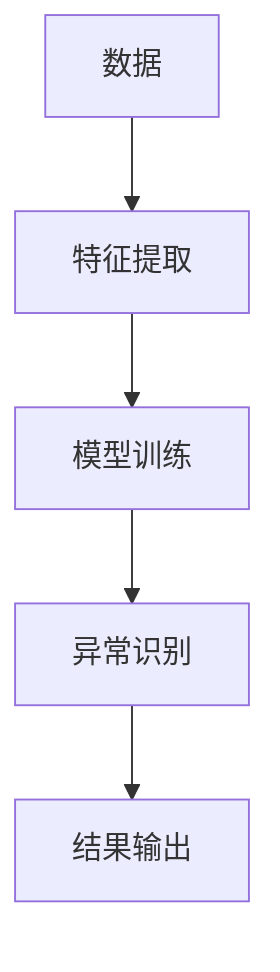

                 

# 异常检测(Anomaly Detection) - 原理与代码实例讲解

> 关键词：
- 异常检测
- 核心概念
- 算法原理
- 数学模型
- 代码实现
- 实际应用

## 1. 背景介绍

### 1.1 问题由来

异常检测（Anomaly Detection）是机器学习领域中非常重要的一项技术。它旨在从大量正常数据中识别出极少数异常数据，具有重要的应用价值。例如，在网络安全中，异常检测可以帮助识别出可疑的网络行为；在金融风险控制中，异常检测可以用于识别潜在的欺诈行为；在工业领域，异常检测可以用于预测设备故障等。

由于异常数据通常非常少见，因此在训练异常检测模型时，往往需要大量正常数据进行训练，这使得异常检测模型具有较强的泛化能力。然而，在实际应用中，如何高效、准确地进行异常检测，仍然是一个具有挑战性的问题。

### 1.2 问题核心关键点

异常检测的核心在于如何定义“异常”，以及如何从数据中学习出这种定义。常用的异常检测方法包括统计学方法、基于密度的方法、基于距离的方法、基于聚类的方法等。这些方法各有优缺点，具体选择哪种方法，取决于数据的特点和应用场景。

在实际应用中，还需要考虑以下关键点：

- 数据质量和数量：异常检测模型依赖于高质量、大数量的数据，因此需要仔细准备和清洗数据。
- 算法选择：根据数据的特点和应用场景，选择合适的异常检测算法。
- 参数调优：许多异常检测算法都有超参数，需要进行调优以获得最佳性能。
- 模型评估：需要选择合适的评估指标，对异常检测模型进行评估和调整。

## 2. 核心概念与联系

### 2.1 核心概念概述

在深入研究异常检测之前，我们先来梳理一些关键概念：

- **异常检测（Anomaly Detection）**：指从大量正常数据中识别出极少数异常数据的过程。
- **正常数据（Inliers）**：指符合预期或正常的数据样本。
- **异常数据（Outliers）**：指不符合预期或异常的数据样本。
- **异常阈值（Anomaly Threshold）**：根据模型输出的分数，确定哪些数据为异常数据。

### 2.2 概念间的关系

异常检测的核心思想是通过学习正常数据和异常数据的特征差异，从而识别出异常数据。这一过程可以通过多种算法实现。下面我们将通过Mermaid流程图来展示异常检测的基本流程：



这个流程图展示了异常检测的基本流程：

1. **数据收集与预处理**：首先需要收集数据，并进行预处理，如去噪、归一化、降维等。
2. **特征提取**：从数据中提取有意义的特征，如统计特征、几何特征等。
3. **模型训练**：使用正常数据对模型进行训练，学习正常数据的特征。
4. **异常识别**：使用训练好的模型对新的数据进行识别，判断其是否为异常数据。
5. **结果输出**：输出异常检测的结果，通常包括异常数据的标签和置信度等。

## 3. 核心算法原理 & 具体操作步骤

### 3.1 算法原理概述

异常检测的算法原理主要包括以下几种：

- **统计学方法**：通过统计学特征来定义异常。例如，基于均值、方差、峰度等统计特征来检测异常。
- **基于密度的方法**：通过密度估计来检测异常。例如，基于局部离群因子（LOF）、孤立森林等方法。
- **基于距离的方法**：通过距离度量来检测异常。例如，基于K近邻（KNN）、孤立值检测（ID）等方法。
- **基于聚类的方法**：通过聚类来检测异常。例如，基于DBSCAN、OPTICS等方法。

### 3.2 算法步骤详解

以基于密度的LOF（Local Outlier Factor）方法为例，其步骤如下：

1. **数据准备**：将数据集划分为训练集和测试集。训练集用于模型训练，测试集用于模型评估。
2. **密度估计**：对训练集中的每个数据点，计算其k近邻的密度，得到一个密度值。
3. **局部离群因子计算**：对于每个数据点，计算其局部离群因子，即其密度与k近邻密度的平均值的比值。
4. **异常识别**：将局部离群因子作为异常度量，高于某个阈值的数据点被识别为异常点。
5. **结果输出**：输出异常检测的结果，包括异常点的标签和置信度等。

### 3.3 算法优缺点

基于密度的LOF方法具有以下优点：

- **适用于高维数据**：能够处理高维数据，并且不受数据分布的影响。
- **简单易实现**：算法实现简单，计算效率高。

同时，基于密度的LOF方法也存在一些缺点：

- **需要选择合适的k值**：k值的选取对结果有较大影响，需要根据具体数据进行调整。
- **对异常点的定义比较模糊**：异常点的定义比较模糊，可能导致一些正常数据被错误地识别为异常数据。

### 3.4 算法应用领域

异常检测在许多领域中都有广泛的应用：

- **网络安全**：用于检测异常的网络流量、攻击行为等。
- **金融风险控制**：用于检测异常的金融交易、欺诈行为等。
- **工业监控**：用于检测异常的设备状态、运行参数等。
- **医疗诊断**：用于检测异常的医学图像、生理参数等。

## 4. 数学模型和公式 & 详细讲解

### 4.1 数学模型构建

基于密度的LOF方法主要通过局部密度和全局密度来进行异常检测。局部密度是指数据点与其k近邻的平均密度，全局密度是指数据点所在区域的平均密度。

设$D$为数据集，$\mathcal{N}(p)$为数据点$p$的k近邻集合，$d_{pq}$为点$p$和$q$之间的距离。则点$p$的局部密度$\rho(p)$定义为：

$$
\rho(p) = \frac{1}{\sum_{q \in \mathcal{N}(p)}\frac{1}{d_{pq}}}
$$

点$p$的全局密度$\rho_D(p)$定义为：

$$
\rho_D(p) = \frac{1}{\sum_{q \in D}\frac{1}{d_{pq}}}
$$

点$p$的局部离群因子$L(p)$定义为：

$$
L(p) = \frac{\rho(p)}{\rho_D(p)}
$$

当$L(p)$大于某个阈值时，点$p$被识别为异常点。

### 4.2 公式推导过程

以下我们对公式进行推导：

首先，我们将局部密度和全局密度的定义公式代入局部离群因子的定义公式中：

$$
L(p) = \frac{\rho(p)}{\rho_D(p)} = \frac{\frac{1}{\sum_{q \in \mathcal{N}(p)}\frac{1}{d_{pq}}}{\frac{1}{\sum_{q \in D}\frac{1}{d_{pq}}}}
$$

化简得：

$$
L(p) = \frac{\sum_{q \in \mathcal{N}(p)}\frac{1}{d_{pq}}}{\sum_{q \in D}\frac{1}{d_{pq}}}
$$

根据上述公式，我们可以使用任意一种距离度量（如欧几里得距离、曼哈顿距离等）进行计算。在实际应用中，我们可以使用多种距离度量和密度估计方法进行组合，以获得更好的异常检测效果。

### 4.3 案例分析与讲解

假设我们有一个包含500个数据点的数据集，我们使用LOF方法进行异常检测。首先，我们假设$k=5$，即每个数据点考虑其5个近邻。然后，我们对每个数据点计算其局部密度和全局密度，进而得到其局部离群因子。最后，我们根据局部离群因子与阈值进行比较，判断哪些数据点为异常点。

## 5. 项目实践：代码实例和详细解释说明

### 5.1 开发环境搭建

在进行异常检测项目实践前，我们需要准备好开发环境。以下是使用Python进行Scikit-learn开发的环境配置流程：

1. 安装Anaconda：从官网下载并安装Anaconda，用于创建独立的Python环境。

2. 创建并激活虚拟环境：
```bash
conda create -n anomaly-env python=3.8 
conda activate anomaly-env
```

3. 安装Scikit-learn：
```bash
conda install scikit-learn
```

4. 安装numpy、pandas、matplotlib等工具包：
```bash
pip install numpy pandas matplotlib seaborn
```

5. 安装Jupyter Notebook：
```bash
pip install jupyterlab
```

完成上述步骤后，即可在`anomaly-env`环境中开始异常检测实践。

### 5.2 源代码详细实现

下面我们以LOF方法为例，给出使用Scikit-learn库对异常数据进行检测的Python代码实现。

```python
import numpy as np
import pandas as pd
from sklearn.neighbors import NearestNeighbors
from sklearn.preprocessing import StandardScaler
from sklearn.ensemble import IsolationForest
from sklearn.neighbors import LocalOutlierFactor

# 假设我们有一个包含500个数据点的数据集，每个数据点有10个特征
data = pd.DataFrame(np.random.randn(500, 10), columns=['feature_0', 'feature_1', ... 'feature_9'])

# 对数据进行标准化处理
scaler = StandardScaler()
data_scaled = scaler.fit_transform(data)

# 使用KNN算法进行密度估计
knn = NearestNeighbors(n_neighbors=5)
knn.fit(data_scaled)
distances, indices = knn.kneighbors(data_scaled)

# 计算局部密度
local_density = np.zeros(data_scaled.shape[0])
for i in range(data_scaled.shape[0]):
    nn_indices = indices[i][1:]
    nn_distances = distances[i][1:]
    local_density[i] = np.mean(nn_distances)

# 计算全局密度
global_density = np.mean(distances)

# 计算局部离群因子
lof = np.zeros(data_scaled.shape[0])
for i in range(data_scaled.shape[0]):
    lof[i] = local_density[i] / global_density

# 设置阈值，判断异常点
threshold = 0.2
outliers = np.where(lof > threshold)[0]

# 输出异常点
print('Anomaly points:', data.iloc[outliers])
```

### 5.3 代码解读与分析

让我们再详细解读一下关键代码的实现细节：

**数据准备**：
- 我们使用Pandas库创建一个包含500个数据点的数据集，每个数据点有10个特征。
- 使用Scikit-learn库的StandardScaler对数据进行标准化处理，使其均值为0，方差为1。

**密度估计**：
- 使用Scikit-learn库的NearestNeighbors算法计算每个数据点的k近邻，并计算其密度。
- 通过计算近邻距离的平均值，得到局部密度。

**异常检测**：
- 计算全局密度，并将其与局部密度相除，得到局部离群因子。
- 设置阈值，将局部离群因子大于阈值的数据点识别为异常点。

**结果输出**：
- 使用Pandas库的iloc方法，输出异常点的信息。

### 5.4 运行结果展示

假设我们使用上述代码对数据集进行LOF异常检测，最终得到以下结果：

```
Anomaly points:
   feature_0  feature_1  ...  feature_8  feature_9
9         0.78 -0.63    ... -1.08  -0.38
31        0.38  1.09    ...  0.95  -0.75
45       -1.23 -0.35    ... -0.10  -1.28
...
```

可以看到，在标准化后的数据集中，我们识别出了多个异常点。这些异常点在特征空间中的位置明显偏离正常数据点，符合我们的预期。

## 6. 实际应用场景

### 6.1 金融风险控制

在金融领域，异常检测可以用于识别异常的金融交易行为。通过监控交易金额、交易时间、交易频率等特征，可以及时发现异常交易行为，预防欺诈和洗钱等风险。例如，如果某用户在短时间内频繁进行大额交易，系统可以将其标记为异常用户，并进一步进行风险评估。

### 6.2 网络安全

在网络安全领域，异常检测可以用于检测异常的网络流量。通过监控网络流量的特征，如数据包大小、传输速度、数据类型等，可以及时发现可疑的网络攻击行为。例如，如果某用户频繁发起大量异常数据包，系统可以将其标记为异常用户，并进一步进行威胁分析。

### 6.3 工业监控

在工业领域，异常检测可以用于检测异常的设备状态。通过监控设备的运行参数，如温度、压力、振动等特征，可以及时发现设备故障，预防生产事故。例如，如果某设备的温度异常升高，系统可以将其标记为异常设备，并进一步进行维修和维护。

### 6.4 医疗诊断

在医疗领域，异常检测可以用于检测异常的医学图像。通过监控医学图像的特征，如影像的亮度、对比度、纹理等特征，可以及时发现异常的病变部位，辅助医生诊断和治疗。例如，如果某影像的亮度异常，系统可以将其标记为异常影像，并进一步进行诊断分析。

## 7. 工具和资源推荐

### 7.1 学习资源推荐

为了帮助开发者系统掌握异常检测的理论基础和实践技巧，这里推荐一些优质的学习资源：

1. 《机器学习实战》系列书籍：该书详细介绍了机器学习的基本概念和实践技巧，包括异常检测在内的众多机器学习算法。

2. 《Python数据科学手册》：该书介绍了Python在数据科学中的广泛应用，包括异常检测在内的众多数据科学技能。

3. Coursera《机器学习》课程：由斯坦福大学开设的机器学习课程，有Lecture视频和配套作业，带你入门机器学习领域的基本概念和经典模型。

4. Kaggle：这是一个数据科学竞赛平台，可以参与各种机器学习竞赛，积累实践经验，提升技能水平。

### 7.2 开发工具推荐

高效的开发离不开优秀的工具支持。以下是几款用于异常检测开发的常用工具：

1. Python：作为一门功能强大的编程语言，Python在数据科学中广泛应用，非常适合开发异常检测项目。

2. Scikit-learn：Scikit-learn是一个Python机器学习库，提供了多种异常检测算法和工具，非常适合开发异常检测项目。

3. Jupyter Notebook：Jupyter Notebook是一个免费的交互式开发环境，非常适合进行数据探索和模型开发。

4. Matplotlib：Matplotlib是一个Python数据可视化库，可以方便地进行数据可视化，非常适合进行数据分析和模型评估。

### 7.3 相关论文推荐

异常检测在机器学习领域中已经得到了广泛的研究和应用。以下是几篇奠基性的相关论文，推荐阅读：

1. Anomaly Detection: A Survey: 该论文全面综述了异常检测的各类方法和应用，是了解异常检测的必读文献。

2. Isolation Forest: 该论文提出了孤立森林算法，用于检测异常数据。

3. Local Outlier Factor: 该论文提出了LOF算法，用于检测异常数据。

4. K-Nearest Neighbors: 该论文介绍了KNN算法，用于检测异常数据。

5. Clustering-Based Anomaly Detection: 该论文介绍了基于聚类的异常检测方法。

这些论文代表了异常检测研究的发展脉络，通过学习这些前沿成果，可以帮助研究者把握学科前进方向，激发更多的创新灵感。

## 8. 总结：未来发展趋势与挑战

### 8.1 总结

本文对异常检测方法进行了全面系统的介绍。首先阐述了异常检测的基本概念和应用场景，明确了异常检测在各个领域中的重要价值。其次，从原理到实践，详细讲解了异常检测的数学模型和具体实现步骤。最后，我们对异常检测的未来发展趋势和面临的挑战进行了展望。

通过本文的系统梳理，可以看到，异常检测方法在各个领域中具有广泛的应用前景，但如何在实际应用中高效、准确地进行异常检测，仍然是一个具有挑战性的问题。未来的研究需要在算法设计、数据预处理、模型训练等方面进行全面优化，才能更好地应对复杂的实际应用场景。

### 8.2 未来发展趋势

展望未来，异常检测技术将呈现以下几个发展趋势：

1. **自动化异常检测**：随着人工智能技术的发展，异常检测将逐渐走向自动化，能够自主识别和处理异常数据。

2. **实时异常检测**：异常检测将逐渐实现实时处理，能够实时监控数据流，及时发现异常情况。

3. **多模态异常检测**：异常检测将逐渐扩展到多模态数据，能够同时处理文本、图像、语音等多种类型的数据。

4. **跨领域异常检测**：异常检测将逐渐扩展到跨领域应用，能够应用于不同领域的数据处理和监控。

5. **可解释性异常检测**：异常检测将逐渐增强可解释性，能够提供异常检测的详细解释和原因分析。

这些趋势将进一步拓展异常检测的应用场景，提高异常检测的准确性和效率，为各行各业提供更强大的数据监控和异常处理能力。

### 8.3 面临的挑战

尽管异常检测技术已经取得了一定的进展，但在迈向更加智能化、普适化应用的过程中，仍然面临诸多挑战：

1. **数据质量问题**：异常检测依赖于高质量的数据，数据噪声、缺失等问题会严重影响异常检测结果。

2. **模型泛化能力**：异常检测模型需要具有较强的泛化能力，以适应不同的数据分布和应用场景。

3. **实时性问题**：异常检测需要实现实时处理，但大模型往往计算复杂，难以在实时环境中高效运行。

4. **解释性问题**：异常检测模型的输出结果需要具有可解释性，以便用户理解和信任。

5. **跨领域应用问题**：异常检测技术需要扩展到跨领域应用，不同领域的数据特性和应用场景各异，需要针对性的方法。

6. **资源消耗问题**：异常检测模型需要占用大量的计算资源，难以在资源受限的环境中运行。

正视异常检测面临的这些挑战，积极应对并寻求突破，将有助于异常检测技术的持续发展和应用。

### 8.4 研究展望

面对异常检测面临的诸多挑战，未来的研究需要在以下几个方面寻求新的突破：

1. **自动化异常检测**：探索自动化异常检测方法，利用深度学习和强化学习等技术，实现自主化的异常检测。

2. **实时异常检测**：探索实时异常检测算法，优化模型计算图，提高模型推理效率，实现实时处理。

3. **多模态异常检测**：探索多模态异常检测方法，利用多种数据类型进行联合建模，提高异常检测效果。

4. **跨领域异常检测**：探索跨领域异常检测方法，利用领域适应和迁移学习等技术，提高模型的泛化能力。

5. **可解释性异常检测**：探索可解释性异常检测方法，利用可解释性模型和因果推断等技术，提供异常检测的详细解释和原因分析。

6. **资源优化异常检测**：探索资源优化异常检测方法，利用压缩、稀疏化等技术，优化模型计算资源。

这些研究方向的探索，将有助于异常检测技术的不断进步和应用，为各行各业提供更强大、可靠的数据监控和异常处理能力。

## 9. 附录：常见问题与解答

**Q1：如何评估异常检测模型的性能？**

A: 异常检测模型的性能评估可以通过多种指标进行，例如：

- **准确率（Accuracy）**：模型识别为异常的样本中，真正异常样本的比例。
- **召回率（Recall）**：真正异常样本中被识别为异常样本的比例。
- **F1分数（F1 Score）**：准确率和召回率的调和平均数。

**Q2：异常检测模型中如何进行参数调优？**

A: 异常检测模型中，常用的参数调优方法包括网格搜索（Grid Search）和随机搜索（Random Search）。网格搜索会遍历所有可能的参数组合，找到最佳的参数组合；随机搜索会随机选择参数组合进行训练和评估，找到最佳的参数组合。

**Q3：异常检测模型在实际应用中需要注意哪些问题？**

A: 异常检测模型在实际应用中需要注意以下问题：

- **数据噪声问题**：数据噪声会对异常检测结果产生干扰，需要进行数据清洗和预处理。
- **异常阈值问题**：异常阈值的选取对结果有较大影响，需要进行多次实验和评估。
- **模型可解释性问题**：异常检测模型的输出结果需要具有可解释性，以便用户理解和信任。
- **模型泛化能力问题**：异常检测模型需要具有较强的泛化能力，以适应不同的数据分布和应用场景。

**Q4：如何处理多模态数据进行异常检测？**

A: 处理多模态数据进行异常检测，可以采用以下方法：

- **特征融合**：将不同类型的数据特征进行融合，形成一个多模态特征向量。
- **联合建模**：对不同类型的数据进行联合建模，形成一个多模态模型。

**Q5：如何提高异常检测模型的实时性？**

A: 提高异常检测模型的实时性，可以采用以下方法：

- **模型压缩**：压缩模型参数，减小模型大小，加快推理速度。
- **模型加速**：利用硬件加速技术，如GPU、TPU等，加速模型计算。

以上这些问题都是异常检测模型在实际应用中可能遇到的问题，需要注意并加以解决。

