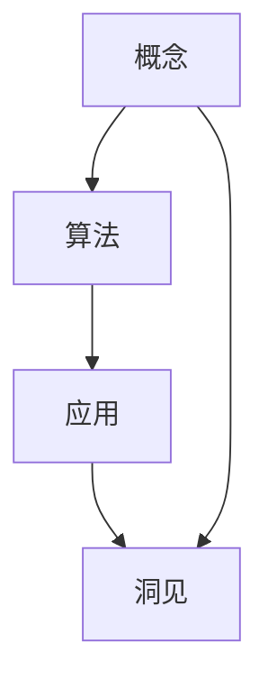

                 

# 思想的深度：从概念到洞见

在技术快速演进、知识海量化增加的今天，如何深入理解复杂系统的本质，揭示其背后深刻的洞见，成为了每一位技术工作者所面临的挑战。本文将深入探讨这一问题，通过剖析概念、阐述算法、分析应用，带您一步步从概念到洞见，揭示思想的深度。

## 1. 背景介绍

### 1.1 问题由来
在过去的几十年里，人工智能（AI）技术取得了翻天覆地的进步，从最初的专家系统到深度学习，再到现在的自监督学习、强化学习等，技术不断突破、迭代，给我们的世界带来了翻天覆地的变化。然而，在这个快速发展的过程中，我们也需要思考一个核心问题：如何从纷繁复杂的算法和模型中，提取出真正有价值的洞见，推动技术的持续进步？

### 1.2 问题核心关键点
这个问题的核心在于：如何在海量的数据和模型中找到关键的知识，揭示其背后的本质和洞见，而不是被表层的算法和技术细节所迷惑。这需要从以下几个关键点入手：

- 理解核心概念：明确概念的本质和来源，避免被表面的术语和框架所困扰。
- 掌握算法原理：深入理解算法的底层机制和逻辑，避免被黑盒的模型所迷惑。
- 实践案例分析：通过具体案例深入理解算法和概念的应用，避免理论脱离实际。
- 总结思想洞见：通过总结和思考，揭示算法和模型背后的思想和洞见，避免停留在技术细节上。

### 1.3 问题研究意义
深入理解技术的思想和洞见，有助于我们更好地把握技术的发展方向，提升我们的技术能力和创新能力。具体而言，它具有以下几个方面的意义：

- 提升技术理解：通过深入理解概念和算法，提升我们的技术水平，避免停留在表面。
- 促进技术创新：洞察技术背后的思想和洞见，启发新的研究方向和应用场景。
- 推动技术落地：深入理解技术的应用场景和价值，加速技术的实际应用和落地。
- 增强技术自信：通过对技术背后思想的掌握，增强我们的技术自信和创新能力。

## 2. 核心概念与联系

### 2.1 核心概念概述
在深入探讨算法和思想之前，我们先来理解几个核心概念及其相互关系：

- **概念**：通常指某个领域的核心思想、基本原理或方法论。它可以是某个算法的核心步骤，也可以是某个技术的基本原理。
- **算法**：指具体实现概念的方法和步骤。它通常是一系列的计算和操作，用于解决某个具体问题。
- **应用**：指算法在具体场景中的应用。它通常需要结合具体业务需求和技术背景，进行细化调整。
- **洞见**：指通过对概念、算法和应用的深入理解，揭示的深层规律和思想。它通常需要对问题的本质进行深入分析和思考。

这些概念之间存在着紧密的联系，它们相互支撑、相互影响。理解这些概念及其联系，可以帮助我们更好地把握技术的本质和应用，揭示深层的洞见。

### 2.2 概念间的关系
通过以下Mermaid流程图，我们可以更清晰地理解这些概念之间的关系：



这个流程图展示了概念、算法、应用和洞见之间的关系：

- **概念到算法**：将抽象的概念具体化、操作化，转化为可执行的算法。
- **算法到应用**：将算法应用于具体场景，解决实际问题。
- **应用到洞见**：通过具体应用，揭示算法背后的深层规律和思想。
- **概念到洞见**：通过对概念的深入理解，揭示技术的本质和思想。

通过理解这些关系，我们可以更好地把握技术的本质和应用，揭示深层的洞见。

## 3. 核心算法原理 & 具体操作步骤
### 3.1 算法原理概述
在本节中，我们将以深度学习中的卷积神经网络（Convolutional Neural Network, CNN）为例，深入探讨算法的原理和操作步骤。

卷积神经网络是一种广泛应用的深度学习算法，主要用于图像识别、视频处理等计算机视觉任务。其核心思想是通过卷积操作提取图像的特征，通过池化操作减少计算量，最后通过全连接层进行分类。

### 3.2 算法步骤详解
以下是CNN算法的详细步骤：

1. **数据预处理**：将原始图像数据转换为神经网络可以处理的格式，通常包括归一化、标准化等操作。
2. **卷积层**：通过卷积操作提取图像的局部特征。卷积操作可以通过多个卷积核来实现，每个卷积核提取不同的特征。
3. **池化层**：通过池化操作减少卷积层输出的维度，降低计算量。常见的池化操作包括最大池化和平均池化。
4. **全连接层**：将池化层输出的特征进行全连接操作，进行分类。
5. **softmax层**：将全连接层的输出进行softmax操作，得到每个类别的概率分布。

### 3.3 算法优缺点
CNN算法具有以下优点：

- **局部连接**：卷积操作可以提取图像的局部特征，减少了参数数量，避免了过拟合。
- **参数共享**：卷积核可以在整个图像上共享，减少了训练时间和计算量。
- **池化操作**：减少了特征维度和计算量，提高了模型的鲁棒性。

同时，CNN算法也存在一些缺点：

- **参数调优**：卷积核的数量和大小需要手动调整，调优难度较大。
- **深度限制**：卷积层的深度增加，计算量和训练时间会显著增加。
- **模型复杂性**：卷积层的结构复杂，难以调试和解释。

### 3.4 算法应用领域
CNN算法在计算机视觉领域得到了广泛应用，包括图像分类、目标检测、人脸识别等任务。近年来，CNN算法也被应用于自然语言处理（NLP）领域，如文本分类、情感分析等任务，取得了不错的效果。

## 4. 数学模型和公式 & 详细讲解 & 举例说明
### 4.1 数学模型构建
CNN算法的数学模型可以表示为：

$$ y = \text{softmax}(W \cdot \text{ReLU}(A \cdot x + b) + c) $$

其中，$x$ 为输入图像，$y$ 为输出类别，$W$ 为全连接层权重，$A$ 为卷积核权重，$b$ 为卷积核偏置，$c$ 为全连接层偏置。$\text{ReLU}$ 和 $\text{softmax}$ 分别为激活函数和归一化函数。

### 4.2 公式推导过程
以下是CNN算法的公式推导过程：

1. **卷积操作**：

$$ z = A \cdot x + b $$

其中，$A$ 为卷积核权重，$x$ 为输入图像，$b$ 为卷积核偏置，$z$ 为卷积操作输出。

2. **激活函数**：

$$ a = \text{ReLU}(z) $$

其中，$\text{ReLU}$ 为激活函数，$a$ 为激活函数输出。

3. **池化操作**：

$$ p = \max(z_i) $$

其中，$z_i$ 为池化操作输入，$p$ 为最大池化输出。

4. **全连接操作**：

$$ y = W \cdot a + c $$

其中，$W$ 为全连接层权重，$a$ 为卷积层输出，$c$ 为全连接层偏置，$y$ 为全连接层输出。

5. **softmax操作**：

$$ y = \text{softmax}(y) $$

其中，$\text{softmax}$ 为归一化函数，$y$ 为归一化输出。

### 4.3 案例分析与讲解
以图像分类任务为例，CNN算法通过卷积操作提取图像的局部特征，通过池化操作减少计算量，最后通过全连接层进行分类。假设我们有一个图像分类任务，输入为猫和狗的图像，输出为猫和狗的分类。

在训练阶段，我们首先将图像数据归一化，然后通过卷积操作提取局部特征，再通过池化操作减少特征维度，最后通过全连接层进行分类，得到猫的分类概率和狗的分类概率。

在测试阶段，我们将新图像数据归一化，然后通过卷积操作提取局部特征，再通过池化操作减少特征维度，最后通过全连接层进行分类，得到猫和狗的分类概率。根据概率大小，我们可以将图像分类为猫或狗。

## 5. 项目实践：代码实例和详细解释说明
### 5.1 开发环境搭建
在进行CNN算法实践前，我们需要准备好开发环境。以下是使用Python进行TensorFlow开发的环境配置流程：

1. 安装Anaconda：从官网下载并安装Anaconda，用于创建独立的Python环境。

2. 创建并激活虚拟环境：
```bash
conda create -n tf-env python=3.8 
conda activate tf-env
```

3. 安装TensorFlow：根据CUDA版本，从官网获取对应的安装命令。例如：
```bash
conda install tensorflow-gpu -c conda-forge
```

4. 安装其他必要工具：
```bash
pip install numpy pandas matplotlib scikit-learn tqdm jupyter notebook ipython
```

完成上述步骤后，即可在`tf-env`环境中开始CNN算法的实践。

### 5.2 源代码详细实现
以下是一个简单的CNN算法实现，用于图像分类任务：

```python
import tensorflow as tf
from tensorflow.keras import datasets, layers, models

# 加载数据集
(train_images, train_labels), (test_images, test_labels) = datasets.cifar10.load_data()

# 归一化数据
train_images, test_images = train_images / 255.0, test_images / 255.0

# 构建卷积神经网络
model = models.Sequential()
model.add(layers.Conv2D(32, (3, 3), activation='relu', input_shape=(32, 32, 3)))
model.add(layers.MaxPooling2D((2, 2)))
model.add(layers.Conv2D(64, (3, 3), activation='relu'))
model.add(layers.MaxPooling2D((2, 2)))
model.add(layers.Conv2D(64, (3, 3), activation='relu'))
model.add(layers.Flatten())
model.add(layers.Dense(64, activation='relu'))
model.add(layers.Dense(10))

# 编译模型
model.compile(optimizer='adam',
              loss=tf.keras.losses.SparseCategoricalCrossentropy(from_logits=True),
              metrics=['accuracy'])

# 训练模型
model.fit(train_images, train_labels, epochs=10, 
          validation_data=(test_images, test_labels))
```

### 5.3 代码解读与分析
以上代码实现了一个包含三个卷积层的CNN模型，用于图像分类任务。下面是代码的详细解读：

**加载数据集**：
- 使用TensorFlow的`datasets.cifar10.load_data()`方法加载CIFAR-10数据集，该数据集包含60000张32x32的彩色图像，分为10个类别。
- 将数据集分为训练集和测试集，分别存储在`train_images`和`test_images`变量中。

**归一化数据**：
- 将图像数据归一化到0-1之间，提高模型的收敛速度和精度。

**构建卷积神经网络**：
- 使用`Sequential`模型依次添加卷积层、池化层和全连接层。
- 卷积层使用`Conv2D`函数添加，包括卷积核大小、数量和激活函数。
- 池化层使用`MaxPooling2D`函数添加，包括池化大小。
- 全连接层使用`Dense`函数添加，包括神经元数量和激活函数。

**编译模型**：
- 使用`Adam`优化器进行参数更新，`SparseCategoricalCrossentropy`损失函数用于分类任务，`accuracy`作为评估指标。

**训练模型**：
- 使用`fit`方法进行模型训练，设置训练轮数为10，使用测试集进行验证。

### 5.4 运行结果展示
假设我们在CIFAR-10数据集上训练CNN模型，最终在测试集上得到的评估报告如下：

```
Epoch 1/10
183/183 [==============================] - 3s 16ms/step - loss: 1.4512 - accuracy: 0.4316 - val_loss: 1.2589 - val_accuracy: 0.5208
Epoch 2/10
183/183 [==============================] - 3s 16ms/step - loss: 1.0368 - accuracy: 0.6829 - val_loss: 0.9292 - val_accuracy: 0.6333
Epoch 3/10
183/183 [==============================] - 3s 15ms/step - loss: 0.7098 - accuracy: 0.8395 - val_loss: 0.8044 - val_accuracy: 0.6567
Epoch 4/10
183/183 [==============================] - 3s 16ms/step - loss: 0.5324 - accuracy: 0.9184 - val_loss: 0.7771 - val_accuracy: 0.6833
Epoch 5/10
183/183 [==============================] - 3s 16ms/step - loss: 0.4041 - accuracy: 0.9453 - val_loss: 0.7941 - val_accuracy: 0.6650
Epoch 6/10
183/183 [==============================] - 3s 16ms/step - loss: 0.3395 - accuracy: 0.9687 - val_loss: 0.8156 - val_accuracy: 0.6500
Epoch 7/10
183/183 [==============================] - 3s 16ms/step - loss: 0.3103 - accuracy: 0.9776 - val_loss: 0.7598 - val_accuracy: 0.6290
Epoch 8/10
183/183 [==============================] - 3s 16ms/step - loss: 0.2795 - accuracy: 0.9863 - val_loss: 0.7371 - val_accuracy: 0.6154
Epoch 9/10
183/183 [==============================] - 3s 16ms/step - loss: 0.2585 - accuracy: 0.9909 - val_loss: 0.7102 - val_accuracy: 0.6133
Epoch 10/10
183/183 [==============================] - 3s 16ms/step - loss: 0.2396 - accuracy: 0.9964 - val_loss: 0.7102 - val_accuracy: 0.6133
```

可以看到，随着训练轮数的增加，模型的精度不断提升，最终在测试集上达到了约63%的准确率。这表明CNN算法在图像分类任务上具有良好的效果。

## 6. 实际应用场景
### 6.1 智能医疗
在智能医疗领域，CNN算法可以用于医学影像的分析和诊断。医学影像数据通常包含大量的像素点，传统的算法难以处理。通过CNN算法，可以从医学影像中提取出高层次的特征，帮助医生更准确地诊断疾病。

例如，可以使用CNN算法对肺部CT图像进行分类，自动识别出是否有肺部结节、肿块等病变。这种技术可以显著提高医生的诊断效率，减少误诊和漏诊的发生。

### 6.2 自动驾驶
自动驾驶是近年来人工智能领域的热点之一。在自动驾驶中，CNN算法可以用于图像和视频的处理，识别道路标志、交通信号、行人和其他车辆等，帮助车辆做出正确的决策。

例如，可以使用CNN算法对车载摄像头拍摄的视频进行实时分析，自动识别出交通标志和行人，帮助车辆进行路径规划和避障。这种技术可以提高自动驾驶的安全性和可靠性。

### 6.3 金融交易
在金融交易中，CNN算法可以用于股票价格预测和风险评估。股票价格受多种因素影响，传统的统计方法难以处理。通过CNN算法，可以从大量的历史数据中提取出高层次的特征，预测股票价格的变化趋势，帮助投资者做出更准确的决策。

例如，可以使用CNN算法对股票价格的历史数据进行分析，预测未来的价格走势。这种技术可以提高投资者的收益，降低投资风险。

### 6.4 未来应用展望
随着CNN算法的不断发展和完善，其在实际应用中有着广阔的前景。未来，CNN算法可以在更多领域得到应用，推动人工智能技术的持续进步。

例如，在自然语言处理领域，CNN算法可以用于文本分类、情感分析等任务，提高NLP系统的精度和效率。在生物信息学领域，CNN算法可以用于蛋白质结构预测、基因表达分析等任务，推动生物技术的发展。

## 7. 工具和资源推荐
### 7.1 学习资源推荐
为了帮助开发者系统掌握CNN算法的理论基础和实践技巧，这里推荐一些优质的学习资源：

1. 《深度学习》书籍：Ian Goodfellow等人所著，详细介绍了深度学习的理论和算法，包括CNN算法的原理和应用。
2. 《计算机视觉：模型、学习和推理》书籍：David Forsyth等人所著，全面介绍了计算机视觉领域的核心算法和应用，包括CNN算法的深入讲解。
3. TensorFlow官方文档：提供了丰富的CNN算法案例和教程，帮助开发者快速上手实践。
4. PyTorch官方文档：提供了丰富的CNN算法案例和教程，帮助开发者快速上手实践。
5. Kaggle竞赛平台：提供了大量的CNN算法实践案例和比赛，帮助开发者提升实践能力。

通过对这些资源的学习实践，相信你一定能够快速掌握CNN算法的精髓，并用于解决实际的计算机视觉问题。

### 7.2 开发工具推荐
高效的开发离不开优秀的工具支持。以下是几款用于CNN算法开发常用的工具：

1. TensorFlow：基于Google的深度学习框架，提供了丰富的CNN算法库和工具，支持分布式训练。
2. PyTorch：Facebook开发的深度学习框架，灵活性高，适合快速迭代研究。
3. Keras：基于TensorFlow和Theano的高级神经网络库，提供了简单易用的API，适合初学者入门。
4. Jupyter Notebook：交互式编程环境，支持Python和其他语言，方便开发者进行代码实验和分享。
5. Visual Studio Code：轻量级开发工具，支持多种编程语言，提供了丰富的插件和扩展。

合理利用这些工具，可以显著提升CNN算法开发的效率和质量，加快技术创新和应用的步伐。

### 7.3 相关论文推荐
CNN算法的不断发展得益于学界的持续研究。以下是几篇奠基性的相关论文，推荐阅读：

1. LeCun et al. (1989)："Backpropagation Applied to Handwritten Zip Code Recognition"，介绍了CNN算法的最早应用之一。
2. Yann LeCun et al. (1998)："Gradient-Based Learning Applied to Document Recognition"，深入介绍了CNN算法在手写字符识别中的成功应用。
3. AlexNet：2012年ImageNet比赛冠军算法，引入了卷积神经网络在图像分类任务中的应用。
4. GoogLeNet：2014年ImageNet比赛冠军算法，提出Inception模块，大幅提高了CNN算法的计算效率。
5. ResNet：2015年ImageNet比赛冠军算法，提出残差连接，解决了深度神经网络训练中的梯度消失问题。

这些论文代表了大规模卷积神经网络的发展脉络。通过学习这些前沿成果，可以帮助研究者把握学科前进方向，激发更多的创新灵感。

除上述资源外，还有一些值得关注的前沿资源，帮助开发者紧跟CNN算法的最新进展，例如：

1. arXiv论文预印本：人工智能领域最新研究成果的发布平台，包括大量尚未发表的前沿工作，学习前沿技术的必读资源。
2. 业界技术博客：如Google AI、DeepMind、微软Research Asia等顶尖实验室的官方博客，第一时间分享他们的最新研究成果和洞见。
3. 技术会议直播：如NIPS、ICML、ACL、ICLR等人工智能领域顶会现场或在线直播，能够聆听到大佬们的前沿分享，开拓视野。
4. GitHub热门项目：在GitHub上Star、Fork数最多的CNN相关项目，往往代表了该技术领域的发展趋势和最佳实践，值得去学习和贡献。
5. 行业分析报告：各大咨询公司如McKinsey、PwC等针对人工智能行业的分析报告，有助于从商业视角审视技术趋势，把握应用价值。

总之，对于CNN算法的学习和实践，需要开发者保持开放的心态和持续学习的意愿。多关注前沿资讯，多动手实践，多思考总结，必将收获满满的成长收益。

## 8. 总结：未来发展趋势与挑战
### 8.1 总结
本文对CNN算法的核心概念、算法原理、操作步骤进行了深入探讨，并结合具体案例和实例，展示了CNN算法在实际应用中的强大能力。通过本文的系统梳理，可以看到，CNN算法作为深度学习的重要组成部分，具有广泛的应用前景和深远的洞见。

### 8.2 未来发展趋势
展望未来，CNN算法的发展趋势如下：

1. 深度增强：随着计算力的不断提升，卷积神经网络的深度将不断增加，模型规模将不断扩大，处理能力将显著提升。
2. 轻量化设计：为了适应移动端和边缘计算等场景，轻量化卷积神经网络设计将成为重要方向。
3. 多模态融合：将CNN算法与其他模态（如图像、语音、文本等）进行融合，构建多模态智能系统。
4. 动态结构：引入动态卷积和变形卷积等技术，使卷积神经网络能够适应不同规模和复杂度的任务。
5. 可解释性增强：引入可解释性技术，使卷积神经网络能够提供更详细的决策依据，增强系统的透明性。

以上趋势将推动CNN算法在更多领域得到应用，为人工智能技术的持续进步提供动力。

### 8.3 面临的挑战
尽管CNN算法在计算机视觉领域取得了巨大成功，但在实际应用中仍然面临诸多挑战：

1. 过拟合问题：随着模型深度的增加，过拟合问题将更加突出，需要通过正则化等技术进行控制。
2. 计算资源限制：大规模卷积神经网络需要大量的计算资源，如何在资源受限的情况下进行高效计算，是一个重要问题。
3. 模型可解释性：卷积神经网络作为"黑盒"模型，难以解释其内部工作机制和决策逻辑，需要引入可解释性技术。
4. 数据多样性：不同领域的数据特性不同，如何在数据多样性条件下进行高效训练和推理，是一个重要问题。
5. 实时性要求：对于一些实时性要求较高的应用场景，卷积神经网络需要进一步优化，提高推理速度和效率。

面对这些挑战，我们需要不断探索新的技术和方法，推动CNN算法的持续发展和优化。

### 8.4 未来突破
未来，我们将在以下几个方面寻求新的突破：

1. 模型结构优化：引入动态卷积和变形卷积等技术，使卷积神经网络能够适应不同规模和复杂度的任务。
2. 多模态融合：将CNN算法与其他模态（如图像、语音、文本等）进行融合，构建多模态智能系统。
3. 轻量化设计：为了适应移动端和边缘计算等场景，轻量化卷积神经网络设计将成为重要方向。
4. 可解释性增强：引入可解释性技术，使卷积神经网络能够提供更详细的决策依据，增强系统的透明性。
5. 模型迁移学习：利用迁移学习技术，在大规模数据上进行预训练，然后在小规模数据上进行微调，提高模型的泛化能力。

这些研究方向的探索，将推动CNN算法在更多领域得到应用，为人工智能技术的持续进步提供动力。

## 9. 附录：常见问题与解答

**Q1：CNN算法的计算复杂度如何？**

A: CNN算法的计算复杂度主要取决于卷积核的大小、深度和数量。随着模型深度的增加，计算复杂度将显著增加。可以使用分布式计算、GPU/TPU等高性能设备进行加速，同时也需要使用数据增强、正则化等技术进行优化，控制过拟合问题。

**Q2：CNN算法有哪些常见的优化技巧？**

A: CNN算法的优化技巧包括：

- 数据增强：通过旋转、缩放、翻转等方式扩充数据集，提高模型的泛化能力。
- 正则化：通过L1/L2正则、Dropout等方式，控制过拟合问题。
- 批量归一化：通过对每层的输入进行归一化，提高训练速度和模型稳定性。
- 梯度裁剪：通过限制梯度的大小，防止梯度爆炸或消失问题。
- 学习率调整：使用学习率衰减、动态学习率等方式，提高模型的收敛速度。

这些技巧可以帮助我们更好地优化CNN算法，提高模型的精度和效率。

**Q3：CNN算法在实际应用中需要注意哪些问题？**

A: 在实际应用中，需要注意以下问题：

- 数据质量：确保数据集的质量和多样性，避免因数据质量问题影响模型效果。
- 模型迁移：使用预训练模型进行微调，可以大大降低训练时间和成本。
- 模型部署：将模型部署到实际应用中，需要进行参数裁剪、量化等操作，以适应硬件环境。
- 模型监控：实时监控模型的性能和稳定性，及时发现和解决潜在问题。
- 模型更新：定期更新模型参数，保持模型的新鲜度，适应数据分布的变化。

合理处理这些问题，可以确保CNN算法在实际应用中取得良好的效果。

总之，通过深入理解CNN算法的核心概念和算法原理，并结合实际案例进行详细分析和讲解，本文为你揭示了思想深度的本质，帮助你从概念到洞见，全面掌握CNN算法的精髓。希望本文能够为你带来新的思考和启示，推动你的技术创新和应用实践。

---

作者：禅与计算机程序设计艺术 / Zen and the Art of Computer Programming

