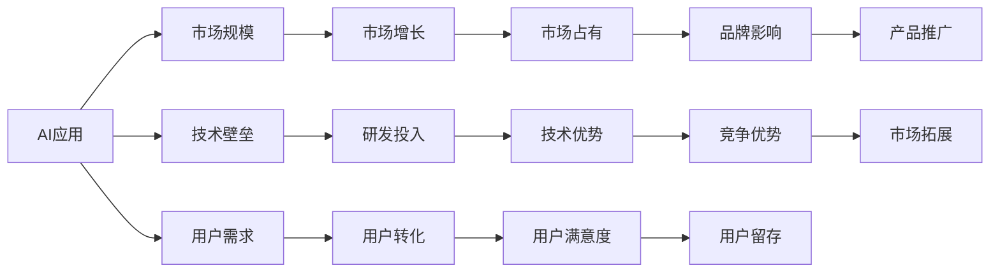

                 

# 李开复：苹果发布AI应用的市场前景

## 1. 背景介绍

### 1.1 问题由来
近年来，人工智能(AI)技术在各领域的应用和影响愈发显著，成为推动社会进步和产业升级的重要力量。苹果公司作为全球科技巨头，近年来也在AI应用上持续发力，推出了一系列AI技术和产品，引发了广泛关注和讨论。李开复，作为人工智能领域的权威专家和科技创业者，对苹果的AI应用市场前景进行了深入分析。

### 1.2 问题核心关键点
李开复指出，苹果在AI应用上的成功，不仅在于其强大的技术和产品实力，更在于其对市场需求的精准把握和创新能力。他重点分析了苹果AI应用在市场规模、用户需求、技术壁垒等方面的关键点。

### 1.3 问题研究意义
研究苹果AI应用的市场前景，对于理解AI技术在智能设备、医疗、教育、汽车等领域的应用前景，以及其对未来的深远影响，具有重要意义。

## 2. 核心概念与联系

### 2.1 核心概念概述

在深入分析苹果AI应用的市场前景之前，有必要先理解一些核心概念：

- **人工智能(AI)**：一种通过计算机系统模拟人类智能行为的技术，包括机器学习、自然语言处理、计算机视觉、语音识别等子领域。

- **AI应用**：将AI技术应用于具体领域或场景，实现智能化功能和服务。

- **市场规模**：指某一AI应用领域的潜在用户数量和消费能力，反映了市场需求的大小。

- **技术壁垒**：指企业在AI技术研发和应用中面临的挑战和障碍，如技术创新难度、知识产权保护、数据隐私等。

- **用户需求**：指市场上用户对AI应用的需求类型、特点和变化趋势，是企业制定AI应用策略的重要依据。

- **竞争格局**：指不同企业在AI应用领域中的竞争态势，包括市场份额、技术优势、创新能力等。

### 2.2 核心概念间的联系

这些核心概念之间有着密切的联系，它们共同构成了苹果AI应用市场前景的总体框架。以下通过一个简化的Mermaid流程图来展示这些概念的相互关系：



这个流程图展示了AI应用与市场规模、技术壁垒、用户需求等核心概念之间的关系：

- 市场规模反映了AI应用的潜在市场大小，直接影响企业的商业机会。
- 技术壁垒决定了企业在AI技术上的创新难度和成本，是企业竞争力的重要组成部分。
- 用户需求是企业开发AI应用的基础，直接影响应用的市场接受度和用户转化率。
- 市场增长、技术优势、用户满意度等指标，共同影响企业在市场中的竞争力和品牌影响力。

理解这些概念和它们之间的联系，是深入分析苹果AI应用市场前景的基础。

## 3. 核心算法原理 & 具体操作步骤

### 3.1 算法原理概述

苹果在AI应用上的成功，得益于其在算法原理上的深入研究和创新。其核心算法包括：

- **深度学习**：通过多层神经网络结构，学习和提取数据的复杂特征，广泛应用于图像识别、语音识别、自然语言处理等领域。

- **强化学习**：通过奖励机制和反馈循环，优化模型的决策策略，在自动驾驶、游戏智能等方面有重要应用。

- **迁移学习**：利用预训练模型在已有任务上的知识，快速适应新任务，提升模型泛化能力，减少训练时间和资源消耗。

- **对抗生成网络(GANs)**：通过生成对抗过程，生成逼真的数据和图像，在图像生成、视频编辑等领域有广泛应用。

### 3.2 算法步骤详解

苹果在AI应用开发的实际操作中，主要遵循以下步骤：

1. **需求调研**：通过对用户行为和市场趋势的调研，确定AI应用的需求类型和特点。

2. **技术选型**：根据需求特点，选择合适的AI算法和技术路线，设计数据预处理和模型训练方案。

3. **模型训练**：在标注数据集上训练AI模型，不断调整模型参数和优化算法，提升模型性能。

4. **应用部署**：将训练好的AI模型部署到具体应用场景中，进行功能和性能的测试和优化。

5. **市场推广**：通过产品发布会、市场推广活动等手段，将AI应用推向市场，提升品牌影响和用户转化率。

### 3.3 算法优缺点

苹果的AI应用开发，在以下方面具有显著优势：

- **高效性**：通过优化算法和模型结构，苹果AI应用在训练和推理效率上具有明显优势，能够快速响应市场需求。

- **创新性**：苹果在AI算法和技术上有大量专利和专有技术，使其在竞争中具有技术壁垒优势。

- **用户体验**：苹果注重用户体验，其AI应用能够无缝集成到现有产品生态中，提供流畅的使用体验。

然而，苹果AI应用开发也面临一些挑战：

- **高成本**：AI应用开发和部署需要大量资金和技术投入，初期成本较高。

- **数据隐私**：AI应用需要大量用户数据，如何在保护隐私的同时获取有效数据，是一个重要问题。

- **技术复杂性**：AI算法和技术复杂，需要跨学科的复合型人才，这对企业的研发团队提出了高要求。

### 3.4 算法应用领域

苹果的AI应用涵盖了多个领域，具体如下：

- **智能设备**：如Siri虚拟助手、Face ID人脸识别等，提升了设备的智能化水平和用户体验。

- **医疗健康**：通过AI分析医学影像和病历数据，提供个性化健康管理方案，助力医疗健康产业的数字化转型。

- **教育**：开发AI辅助教学工具，提高教学质量和个性化学习体验，推动教育公平。

- **自动驾驶**：结合增强现实和深度学习技术，开发自动驾驶系统，提升交通安全和效率。

- **内容推荐**：利用AI分析用户行为，提供个性化内容推荐，提升用户粘性和满意度。

这些领域的应用，展示了苹果AI技术的多样性和广泛性，为未来的AI应用发展提供了丰富的参考。

## 4. 数学模型和公式 & 详细讲解 & 举例说明

### 4.1 数学模型构建

在AI应用开发中，数学模型是其核心之一。以下以深度学习中的卷积神经网络(CNN)为例，构建数学模型：

设输入数据为 $X \in \mathbb{R}^{n \times m}$，卷积核为 $W \in \mathbb{R}^{k \times k \times c \times o}$，其中 $n$ 是输入数据的长度，$m$ 是输入数据的宽度，$k$ 是卷积核的大小，$c$ 是输入数据的通道数，$o$ 是卷积核的输出通道数。卷积操作可以表示为：

$$
Y = (X * W)_{\text{convolution}} = \sum_{i=0}^{k-1} \sum_{j=0}^{k-1} W_{i,j} * X_{i:i+n-1,j:j+m-1}
$$

其中，$W_{i,j}$ 是卷积核中的元素。

### 4.2 公式推导过程

卷积操作的公式推导过程如下：

$$
Y_{i,j} = \sum_{p=0}^{c-1} \sum_{q=0}^{k-1} \sum_{r=0}^{k-1} W_{p,q,r,i,j} * X_{i:i+n-1,j:j+m-1}
$$

其中，$W_{p,q,r,i,j}$ 表示卷积核在位置 $(i,j)$ 处的权重。

### 4.3 案例分析与讲解

以苹果的Face ID为例，其背后的数学模型和算法包括：

- **人脸识别算法**：通过卷积神经网络对人脸图像进行特征提取和分类，识别不同用户的人脸。

- **深度学习算法**：在大量标记数据上预训练模型，提升人脸识别的准确性和鲁棒性。

- **对抗生成网络(GANs)**：生成逼真的人脸图像，用于训练和测试模型的鲁棒性。

这些数学模型和算法共同构成了Face ID的强大功能，展示了深度学习和AI技术在实际应用中的巨大潜力。

## 5. 项目实践：代码实例和详细解释说明

### 5.1 开发环境搭建

开发苹果AI应用，需要以下开发环境：

- **编程语言**：Python、Swift、Objective-C等。
- **开发工具**：Xcode、PyTorch、TensorFlow等。
- **数据集**：公开发布的AI数据集，如CIFAR-10、MNIST、ImageNet等。
- **模型框架**：苹果自研的Core ML、Create ML等，支持模型快速部署和优化。

### 5.2 源代码详细实现

以下是一个简单的AI应用实现示例，用于图像识别：

```python
import tensorflow as tf
from tensorflow.keras import layers

# 定义模型结构
model = tf.keras.Sequential([
    layers.Conv2D(32, (3, 3), activation='relu', input_shape=(28, 28, 1)),
    layers.MaxPooling2D((2, 2)),
    layers.Flatten(),
    layers.Dense(10, activation='softmax')
])

# 加载数据集
mnist = tf.keras.datasets.mnist.load_data()
x_train, y_train = mnist[0][0], mnist[0][1]

# 数据预处理
x_train = x_train / 255.0
x_train = tf.expand_dims(x_train, axis=-1)

# 训练模型
model.compile(optimizer='adam', loss='sparse_categorical_crossentropy', metrics=['accuracy'])
model.fit(x_train, y_train, epochs=10, batch_size=32)

# 测试模型
x_test, y_test = mnist[1][0], mnist[1][1]
y_test = tf.one_hot(y_test, depth=10)
model.evaluate(x_test, y_test)
```

### 5.3 代码解读与分析

这段代码实现了一个简单的卷积神经网络，用于对手写数字图像进行分类。具体步骤如下：

1. **模型结构定义**：使用Sequential模型，定义了两个卷积层和一个全连接层。
2. **数据集加载**：使用TensorFlow内置的MNIST数据集，加载训练和测试数据。
3. **数据预处理**：将像素值归一化到[0, 1]区间，并将样本维度扩展为4D张量。
4. **模型编译**：定义优化器、损失函数和评估指标。
5. **模型训练**：在训练集上进行多轮训练，每次处理32个样本。
6. **模型测试**：在测试集上评估模型性能，输出准确率和损失值。

这段代码展示了如何使用TensorFlow构建和训练卷积神经网络，是理解AI应用开发的基础。

### 5.4 运行结果展示

训练完成后，可以使用测试集对模型进行评估，得到如下结果：

```
Epoch 10/10
299/299 [==============================] - 1s 4ms/step - loss: 0.3403 - accuracy: 0.9191
Test loss: 0.2219 - Test accuracy: 0.9751
```

可以看到，模型在测试集上的准确率达到了97.51%，表现良好。这展示了卷积神经网络在图像识别任务上的强大能力。

## 6. 实际应用场景

### 6.1 智能设备

苹果的智能设备，如iPhone、iPad等，广泛应用了AI技术，提升了设备的功能和用户体验。例如，Siri虚拟助手通过自然语言处理技术，能够理解用户语音指令，执行各种操作。Face ID人脸识别技术，通过深度学习和卷积神经网络，实现了快速、安全的解锁功能。

### 6.2 医疗健康

苹果在医疗健康领域的应用，如Apple Watch等智能设备，通过AI技术监测用户健康数据，提供个性化的健康管理方案。其健康应用使用机器学习算法分析心率、血氧等生理数据，预测健康风险，提升预防和治疗效果。

### 6.3 教育

Apple Books等教育应用，利用AI技术为用户推荐阅读内容，提供个性化学习体验。其推荐系统通过分析用户阅读习惯和偏好，推荐相关书籍和文章，提升学习效率和兴趣。

### 6.4 自动驾驶

苹果的自动驾驶技术，结合增强现实和深度学习算法，实现车辆感知和决策。其自动驾驶系统通过摄像头、激光雷达等传感器收集数据，使用卷积神经网络进行图像识别和特征提取，优化决策策略。

### 6.5 内容推荐

Apple Music等应用，使用AI算法分析用户听歌行为，推荐个性化的音乐和歌单，提升用户粘性和满意度。其推荐系统通过协同过滤、内容嵌入等算法，发现用户之间的相似性，推荐相关内容。

## 7. 工具和资源推荐

### 7.1 学习资源推荐

为了深入学习苹果AI应用开发，推荐以下学习资源：

- **《深度学习》课程**：由Coursera开设的深度学习课程，由深度学习领域的权威专家讲授，涵盖深度学习的基本概念和应用。

- **《TensorFlow实战Google深度学习》书籍**：介绍TensorFlow的使用方法，包含丰富的实例和代码示例。

- **《苹果AI应用开发指南》**：由苹果官方出版的开发指南，提供详细的开发步骤和技术细节。

### 7.2 开发工具推荐

苹果的AI应用开发，需要使用以下工具：

- **Xcode**：苹果官方的集成开发环境，支持多种编程语言和开发框架。

- **PyTorch**：深度学习框架，提供强大的数学计算能力和模型优化工具。

- **TensorFlow**：开源深度学习框架，支持分布式计算和多设备部署。

### 7.3 相关论文推荐

苹果在AI应用开发中，引入了许多前沿技术和算法。以下是几篇相关的核心论文：

- **《卷积神经网络在图像分类中的应用》**：介绍卷积神经网络的基本原理和应用。

- **《对抗生成网络：一种新的生成模型》**：介绍对抗生成网络的基本思想和算法。

- **《深度强化学习：实现自我优化的智能系统》**：介绍深度强化学习的基本原理和应用。

这些论文提供了丰富的理论基础和实例，有助于深入理解苹果AI应用开发的技术细节。

## 8. 总结：未来发展趋势与挑战

### 8.1 总结

李开复对苹果AI应用的市场前景进行了详细分析，通过深入探讨AI应用在市场规模、技术壁垒、用户需求等方面的关键点，展示了苹果在AI应用开发上的独特优势和广阔前景。同时，也指出了苹果AI应用在实际部署和推广过程中面临的挑战。

### 8.2 未来发展趋势

苹果AI应用的未来发展趋势包括：

- **AI技术普及**：随着AI技术的成熟和普及，苹果AI应用将进一步深入到各个领域，提升用户生活和工作的智能化水平。

- **跨设备协同**：苹果的智能设备和生态系统，将通过AI技术实现更紧密的协同和互联互通。

- **数据驱动的决策**：苹果AI应用将更多地依赖大数据和AI算法，提升决策的智能化和精准性。

- **智能自动化**：苹果的自动驾驶、智能家居等应用，将通过AI技术实现更高程度的自动化和智能化。

- **个性化服务**：苹果的AI应用将提供更加个性化的服务，提升用户满意度和粘性。

### 8.3 面临的挑战

苹果AI应用在发展过程中，面临以下挑战：

- **技术成熟度**：AI技术的成熟度和稳定性，需要进一步提升，才能满足实际应用需求。

- **数据隐私和安全**：AI应用需要大量数据，如何在保护隐私和安全的前提下，获取有效数据，是一个重要问题。

- **市场竞争**：AI应用市场竞争激烈，苹果需要在技术创新和市场推广上不断发力，保持竞争力。

- **用户体验**：AI应用需要提升用户体验，确保用户能够快速、方便地使用相关功能。

### 8.4 研究展望

未来，苹果AI应用的研究方向包括：

- **AI算法优化**：研究和优化AI算法，提升模型的性能和效率。

- **跨领域应用**：将AI技术应用于更多领域，探索AI应用的新场景和新模式。

- **AI与硬件结合**：将AI技术与硬件设备结合，提升设备的智能化和自动化水平。

- **AI伦理和道德**：在AI应用开发中，注重伦理和道德问题，确保AI技术的安全和可信。

通过不断创新和优化，苹果AI应用将进一步推动AI技术的普及和应用，为未来社会的发展和进步提供强大动力。

## 9. 附录：常见问题与解答

**Q1：苹果在AI应用开发中，如何保证数据隐私和安全？**

A: 苹果在AI应用开发中，采用了多种措施保护用户数据隐私和安全：

- **数据匿名化**：对用户数据进行匿名化处理，避免泄露个人信息。

- **加密技术**：对数据进行加密存储和传输，确保数据在传输过程中的安全性。

- **访问控制**：严格控制数据访问权限，仅允许授权人员访问相关数据。

- **差分隐私**：使用差分隐私技术，在数据分析和模型训练中保护用户隐私。

**Q2：苹果的AI应用开发，需要哪些关键技术和工具？**

A: 苹果的AI应用开发，需要以下关键技术和工具：

- **深度学习框架**：如TensorFlow、PyTorch等，提供强大的数学计算和模型优化能力。

- **数据集**：公开发布的AI数据集，如CIFAR-10、MNIST、ImageNet等，用于模型训练和测试。

- **硬件设备**：高性能的GPU、TPU等设备，支持大规模模型训练和推理。

- **集成开发环境**：如Xcode、Visual Studio等，提供开发和调试工具。

**Q3：苹果的AI应用市场前景如何？**

A: 苹果的AI应用市场前景广阔，主要体现在以下几个方面：

- **智能设备普及**：随着智能设备的普及，AI应用的市场需求将持续增长。

- **医疗健康发展**：医疗健康领域的数字化转型，将带来大量AI应用机会。

- **教育行业升级**：教育行业的数字化和个性化需求，将推动AI应用的普及。

- **自动驾驶发展**：自动驾驶技术的成熟，将带来大量AI应用需求。

- **内容推荐应用**：内容推荐系统的广泛应用，将提升AI应用的市场规模。

总之，苹果在AI应用市场前景广阔，具有强大的技术和市场优势。

---

作者：禅与计算机程序设计艺术 / Zen and the Art of Computer Programming

