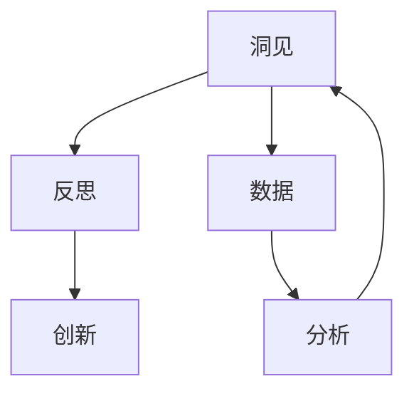

                 

# 洞见的力量：从反思到创新

> 关键词：
> - 洞见力量
> - 反思
> - 创新
> - 算法原理
> - 实践指导
> - 应用案例
> - 未来展望

## 1. 背景介绍

在信息技术飞速发展的今天，洞见的力量愈发显著。无论是大数据分析、人工智能，还是物联网、区块链，每一项技术的核心都在于发现并利用数据的潜在价值。对于IT领域而言，从数据到洞见的转变，不仅是技术的迭代，更是思想的升华。

本文将围绕“洞见的力量：从反思到创新”这一主题，深入探讨如何通过技术手段从海量数据中提取洞见，进而推动行业变革和创新发展。我们相信，通过这一过程，技术不仅能提升业务效率，还能激发出前所未有的创新潜能。

## 2. 核心概念与联系

### 2.1 核心概念概述

为了更清晰地理解本文的核心内容，我们将首先介绍几个关键概念：

- **洞见(Insight)**：通过对数据进行深入分析，发现潜在的模式、规律或趋势，这些洞察有助于解决问题或指导决策。
- **反思(Reflection)**：在得到洞见后，对其进行反思，思考其背后的原因、影响及可能的局限性，以确保洞见的可靠性和有效性。
- **创新(Innovation)**：基于洞见，提出新的解决方案、产品或方法，实现突破性的进展或改进。

这些概念彼此相连，共同构成从数据到洞见，再到创新转变的完整过程。其中，洞见是基础，反思是保障，而创新则是目标。

### 2.2 核心概念的关系

通过以下Mermaid流程图，可以更好地理解这些核心概念之间的关系：



从数据出发，通过分析过程得到洞见。在得到洞见后，对其进行反思，确保其准确性和实用性。最后，基于洞见，推动创新，实现业务或技术上的突破。

## 3. 核心算法原理 & 具体操作步骤

### 3.1 算法原理概述

从数据到洞见的转变，本质上是一个从无序到有序的过程。在这个过程中，算法的作用至关重要。本文将重点介绍基于机器学习的算法，用于从大数据中提取洞见，并推动创新。

一般而言，数据挖掘和分析的算法可以大致分为两类：

1. **监督学习(Supervised Learning)**：在已有标签数据的基础上，训练模型进行预测或分类。
2. **无监督学习(Unsupervised Learning)**：在无标签数据中，发现数据的内在结构和模式。

对于洞见发现和创新，监督学习通常更直接有效，但无监督学习在某些场景下也能提供独特的见解。

### 3.2 算法步骤详解

以下是一个基于监督学习的洞见发现和创新推动的详细步骤：

1. **数据准备**：收集相关数据，包括数据清洗、预处理等步骤，确保数据的质量和完整性。
   
2. **特征工程**：提取和构造关键特征，选择合适的特征集，以便模型能够准确捕捉数据中的关键信息。
   
3. **模型选择**：根据问题的特点，选择合适的机器学习模型，如线性回归、逻辑回归、决策树、随机森林等。
   
4. **模型训练**：使用训练数据集训练模型，调整模型参数，确保模型能够泛化到测试数据集上。
   
5. **结果分析**：分析模型输出，发现数据中的潜在模式、规律或异常，形成洞见。
   
6. **洞见反思**：对得到的洞见进行反思，考虑其背后的原因、影响及局限性，确保洞见的可靠性。
   
7. **创新实践**：基于洞见，提出新的解决方案、产品或方法，推动创新。

### 3.3 算法优缺点

基于监督学习的洞见发现和创新推动方法，具有以下优缺点：

**优点**：
- 数据需求较低，可以通过已有的标签数据进行训练。
- 模型的泛化能力强，可以处理复杂的数据关系。
- 能够直接对业务问题提供明确的洞见和解决方案。

**缺点**：
- 需要大量标注数据，成本较高。
- 模型对数据质量要求高，数据偏差可能导致不准确的洞见。
- 复杂问题的解往往难以直接从模型输出中得出。

### 3.4 算法应用领域

基于监督学习的洞见发现和创新推动方法，广泛应用于以下几个领域：

1. **金融风险管理**：通过分析历史交易数据，发现潜在的风险因素，制定风控策略。
2. **医疗健康诊断**：基于患者历史诊疗数据，预测疾病发展趋势，提供个性化治疗方案。
3. **电子商务推荐**：分析用户行为数据，发现用户偏好，实现个性化商品推荐。
4. **供应链优化**：分析供应链数据，发现瓶颈环节，优化物流和库存管理。
5. **智能客服**：通过分析客户反馈数据，发现问题趋势，提升服务质量。

## 4. 数学模型和公式 & 详细讲解 & 举例说明

### 4.1 数学模型构建

在本文中，我们将以线性回归模型为例，介绍如何构建数学模型。

假设我们有一个数据集 $D = \{(x_1, y_1), (x_2, y_2), \ldots, (x_n, y_n)\}$，其中 $x$ 是输入特征，$y$ 是输出标签。我们的目标是找到一个线性模型 $y = wx + b$，其中 $w$ 和 $b$ 是需要学习的参数。

根据最小二乘法，我们的目标是最小化损失函数：

$$
\min_{w, b} \sum_{i=1}^{n} (y_i - wx_i - b)^2
$$

### 4.2 公式推导过程

根据上述目标，我们可以通过梯度下降算法来求解最优的 $w$ 和 $b$。

设损失函数对 $w$ 和 $b$ 的梯度分别为：

$$
\nabla_w \mathcal{L} = -2 \sum_{i=1}^{n} (y_i - wx_i - b)x_i
$$

$$
\nabla_b \mathcal{L} = -2 \sum_{i=1}^{n} (y_i - wx_i - b)
$$

在梯度下降中，我们希望更新参数 $w$ 和 $b$ 使得损失函数 $\mathcal{L}$ 最小化。更新公式为：

$$
w \leftarrow w - \eta \nabla_w \mathcal{L}
$$

$$
b \leftarrow b - \eta \nabla_b \mathcal{L}
$$

其中 $\eta$ 是学习率，控制每次更新的步长。

### 4.3 案例分析与讲解

假设我们有一个房价预测数据集，目标是预测一个地区的房价。我们首先进行数据清洗和特征工程，然后基于线性回归模型进行训练和测试。在训练过程中，模型不断优化参数 $w$ 和 $b$，最终得到一个能够较好地预测房价的模型。

在测试过程中，我们将模型输出与实际房价进行比较，发现模型的预测精度为 $R^2 = 0.8$，表示模型解释了房价变异的80%。基于此洞见，我们可以进一步分析影响房价的关键因素，如地理位置、房屋面积、周边设施等，并提出相应的优化建议，如城市规划、基础设施建设等。

## 5. 项目实践：代码实例和详细解释说明

### 5.1 开发环境搭建

为了进行洞见发现和创新推动的实践，我们需要搭建一个基于Python的开发环境。以下是具体步骤：

1. **安装Python和必要的库**：Python 3.x环境是必须的，推荐安装 Anaconda 或 Miniconda 进行安装。
2. **安装机器学习库**：安装常用的机器学习库，如 Scikit-learn、TensorFlow、PyTorch 等。
3. **安装数据处理库**：安装 Pandas、NumPy、Matplotlib 等数据处理和可视化库。
4. **环境配置**：根据需要，配置环境变量、虚拟环境等，确保开发顺利进行。

### 5.2 源代码详细实现

以下是一个基于 Scikit-learn 的线性回归模型实现的示例代码：

```python
from sklearn.linear_model import LinearRegression
from sklearn.metrics import mean_squared_error, r2_score

# 加载数据
X = load_X_from_file()
y = load_y_from_file()

# 创建模型
model = LinearRegression()

# 训练模型
model.fit(X, y)

# 测试模型
X_test = load_X_test_from_file()
y_pred = model.predict(X_test)

# 评估模型
rmse = mean_squared_error(y_test, y_pred, squared=False)
r2 = r2_score(y_test, y_pred)

print(f"RMSE: {rmse}, R^2: {r2}")
```

### 5.3 代码解读与分析

**数据加载**：
- `load_X_from_file()` 和 `load_y_from_file()` 函数用于从文件中加载数据，X 表示特征，y 表示标签。
- 数据加载过程可以根据实际需求进行调整，如数据清洗、归一化等。

**模型训练**：
- `LinearRegression()` 函数创建线性回归模型。
- `model.fit(X, y)` 方法用于训练模型，X 为特征，y 为标签。

**模型测试**：
- `load_X_test_from_file()` 函数用于从文件中加载测试数据。
- `model.predict(X_test)` 方法用于预测测试数据。

**模型评估**：
- `mean_squared_error()` 函数用于计算均方根误差（RMSE）。
- `r2_score()` 函数用于计算决定系数（R^2），表示模型的解释能力。

### 5.4 运行结果展示

假设我们得到的 RMSE 为 0.5，R^2 为 0.8，表示模型的预测精度较高，能够较好地解释房价变异的80%。

## 6. 实际应用场景

### 6.1 金融风险管理

在金融领域，通过分析历史交易数据，我们可以发现潜在的风险因素，如市场波动、信用评级变化等。基于此洞见，银行可以调整风险控制策略，减少不良贷款，提升客户满意度。

### 6.2 医疗健康诊断

在医疗领域，通过分析患者的历史诊疗数据，我们可以发现潜在的疾病风险因素，如吸烟、不健康饮食等。基于此洞见，医生可以提供个性化的预防和治疗方案，提升患者的健康水平。

### 6.3 电子商务推荐

在电子商务领域，通过分析用户的行为数据，我们可以发现用户的偏好和购买习惯。基于此洞见，电商平台可以推荐个性化的商品，提高用户粘性和销售额。

### 6.4 供应链优化

在供应链管理领域，通过分析供应链数据，我们可以发现瓶颈环节和效率低下的环节。基于此洞见，企业可以优化物流和库存管理，提升整体供应链效率。

### 6.5 智能客服

在智能客服领域，通过分析客户反馈数据，我们可以发现问题趋势和客户满意度。基于此洞见，企业可以优化服务流程，提升客户体验。

## 7. 工具和资源推荐

### 7.1 学习资源推荐

为了帮助读者深入理解洞见的力量和实现方法，以下是一些推荐的学习资源：

1. **《数据挖掘：概念与技术》**：这本书系统介绍了数据挖掘的原理和应用，适合初学者和专业人士。
2. **Coursera 机器学习课程**：由斯坦福大学Andrew Ng教授讲授的机器学习课程，涵盖线性回归、决策树、神经网络等多种模型。
3. **Kaggle 数据科学竞赛平台**：通过参加实际的数据挖掘竞赛，可以锻炼实际操作能力，并与其他数据科学家交流学习。
4. **GitHub 数据挖掘项目**：GitHub 上有大量开源项目，可以学习其他数据科学家如何解决实际问题，并从中获取灵感。

### 7.2 开发工具推荐

为了提高数据挖掘和分析的效率，以下是一些推荐的开发工具：

1. **Jupyter Notebook**：一个强大的交互式开发环境，支持代码块、文本、图表等多种格式，适合数据科学项目开发。
2. **Scikit-learn**：一个基于 Python 的机器学习库，提供简单易用的接口，支持多种算法和模型。
3. **TensorFlow**：一个开源的深度学习框架，支持分布式计算，适合大规模数据处理和模型训练。
4. **PyTorch**：一个动态图计算框架，支持 GPU 加速，适合深度学习和复杂模型训练。
5. **NLTK**：一个 Python 的自然语言处理库，支持文本处理、语言分析等操作。

### 7.3 相关论文推荐

以下是一些推荐的相关论文，可以进一步深化对洞见的力量和实现方法的认识：

1. **《机器学习：理论与算法》**：由 Tom Mitchell 所著，全面介绍了机器学习的基本概念和算法。
2. **《深度学习》**：由 Ian Goodfellow 等著，介绍了深度学习的原理和应用。
3. **《数据驱动的决策：从洞见到行动》**：一本介绍如何利用数据洞见进行业务决策的实用指南。
4. **《数据挖掘与统计学习》**：一本系统介绍数据挖掘和统计学习的书籍，适合初学者和专业人士。

## 8. 总结：未来发展趋势与挑战

### 8.1 研究成果总结

本文系统介绍了如何从海量数据中提取洞见，并推动创新。通过线性回归模型为例，展示了从数据到洞见的转变过程。通过实际应用场景的分析，说明了洞见的力量和实现方法。

### 8.2 未来发展趋势

展望未来，洞见的力量将进一步增强，主要趋势包括：

1. **自动化和大规模数据处理**：随着大数据技术和云计算的发展，自动化的数据处理和分析将变得更加高效。
2. **跨领域应用**：随着人工智能技术的进步，洞见将不仅应用于单一领域，而是跨领域融合，实现更大范围的创新。
3. **实时数据处理**：通过实时数据流分析，及时发现问题并采取行动，实现业务决策的即时化和智能化。
4. **智能辅助决策**：结合自然语言处理和语音识别技术，实现智能化的辅助决策，提升决策效率和准确性。

### 8.3 面临的挑战

尽管洞见的力量巨大，但在实际应用中也面临诸多挑战：

1. **数据质量和数据安全**：数据的质量和安全性是洞见的基础，如何确保数据的准确性和隐私性是一个重要问题。
2. **模型的可解释性和透明性**：复杂的模型往往难以解释，如何提升模型的可解释性和透明性，是一个需要解决的问题。
3. **算力的限制**：大规模数据处理和深度学习模型的训练需要高算力支持，如何高效利用算力是一个挑战。
4. **跨领域知识整合**：不同领域的数据和知识存在差异，如何整合跨领域知识，实现更全面的洞见，是一个难题。

### 8.4 研究展望

未来，我们需要在以下几个方面进行探索和研究：

1. **数据治理和数据质量管理**：建立数据治理框架，确保数据的质量和完整性。
2. **模型解释性和透明性**：提升模型的可解释性和透明性，使得决策过程更加透明和可理解。
3. **高效计算和分布式计算**：研究高效的计算和分布式计算方法，提升大数据处理和模型训练的效率。
4. **跨领域知识融合**：探索如何整合跨领域知识，实现更全面的洞见和创新。

## 9. 附录：常见问题与解答

**Q1：数据质量对洞见的影响有多大？**

A: 数据质量是洞见的基础。高质量的数据可以确保洞见的准确性和可靠性，而数据偏差和噪音可能会导致错误的洞见。因此，在数据处理过程中，需要注重数据清洗、数据预处理等步骤，确保数据质量。

**Q2：如何提升模型的可解释性？**

A: 提升模型可解释性的方法包括：
1. 使用可解释的模型，如线性回归、决策树等。
2. 结合特征工程，选择易于理解的特征。
3. 使用模型解释工具，如 SHAP、LIME 等，分析模型输出。
4. 编写文档和注释，解释模型的工作原理和输出结果。

**Q3：如何处理大规模数据？**

A: 处理大规模数据的方法包括：
1. 分布式计算，如使用 Hadoop、Spark 等。
2. 数据压缩和分块处理，减少存储空间和读取时间。
3. 数据采样和抽样，减少计算复杂度。
4. 使用高效的数据处理工具，如 Pandas、Dask 等。

**Q4：如何跨领域整合知识？**

A: 跨领域整合知识的方法包括：
1. 数据融合，将不同领域的数据进行合并和整合。
2. 领域知识编码，将专家知识转化为结构化的知识库。
3. 多模态分析，结合文本、图像、语音等多种数据类型进行综合分析。
4. 知识图谱构建，建立领域内的知识图谱，实现知识推理和迁移。

**Q5：如何提高数据处理效率？**

A: 提高数据处理效率的方法包括：
1. 优化算法和模型，减少计算复杂度。
2. 使用高效的数据处理工具，如 NumPy、Pandas 等。
3. 数据预处理，如特征选择、数据压缩等。
4. 并行处理和分布式计算，利用多核和多机提升处理速度。

---

作者：禅与计算机程序设计艺术 / Zen and the Art of Computer Programming

