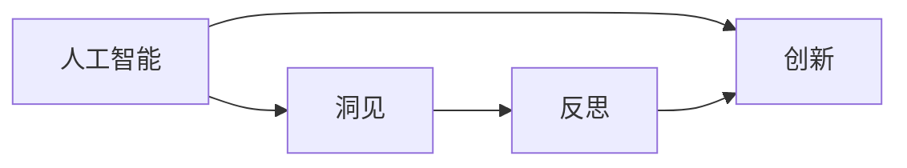
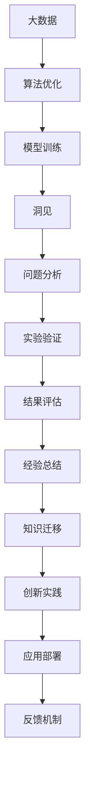

                 

# 洞见的力量：从反思到创新

> 关键词：人工智能, 洞见, 反思, 创新, 算法优化, 大数据, 深度学习, 模型评估

## 1. 背景介绍

在人工智能领域，创新无处不在。然而，在众多创新的背后，隐藏着一种更为本质的东西——洞见。洞见是人们在探索问题时，由深入思考、数据驱动和经验总结得出的深刻理解。洞见不仅推动了技术的发展，更是将科研成果转化为实际应用的重要桥梁。本文将深入探讨洞见的力量，从反思到创新的过程，并提出几点建议，帮助读者在实际工作中更好地运用洞见。

## 2. 核心概念与联系

### 2.1 核心概念概述

在深入理解洞见的力量之前，我们先来了解一下几个相关的核心概念：

- **人工智能（AI）**：使计算机系统能够执行通常需要人类智能的任务，包括感知、学习、推理、自然语言理解、决策、规划、创造等。

- **洞见（Insight）**：通过数据分析、模型训练和经验总结得出的深刻理解和认识，是解决问题的关键。

- **反思（Reflection）**：通过回顾和分析过往的实践、实验结果，识别成功和失败的要素，从而指导未来的工作。

- **创新（Innovation）**：结合新知识、新方法和新工具，创造出新的技术、产品或服务，带来突破性的进展。

这些概念之间有着紧密的联系。洞见来自于反思，而创新则是对洞见的实际应用。它们共同构成了人工智能发展的基础，推动着技术的不断进步和应用场景的拓展。

### 2.2 概念间的关系

这些核心概念之间的关系可以用以下Mermaid流程图来展示：



该图展示了人工智能通过洞见和反思，推动创新的过程。洞见是人工智能发展的核心动力，而反思则是对洞见的不断验证和改进。创新则是将这些洞见应用于实际问题解决，带来新的突破。

### 2.3 核心概念的整体架构

综合这些核心概念，我们可以构建出一个更为完整的洞见力量架构：



在这个架构中，大数据和算法优化为模型训练提供了基础，洞见通过问题分析和实验验证产生，经验总结推动知识迁移，创新实践带来新应用，应用部署后收集反馈，形成一个不断循环的改进过程。

## 3. 核心算法原理 & 具体操作步骤

### 3.1 算法原理概述

在人工智能中，洞见的获得往往依赖于一系列复杂的算法和模型。这些算法通过数据的处理和分析，从中提取有价值的信息，形成洞见。以下是几个核心算法的简要介绍：

- **深度学习**：通过多层神经网络结构，模拟人脑的学习过程，从数据中学习特征和模式，得出洞见。

- **机器学习**：基于统计学方法，通过数据训练模型，自动提取洞见。

- **自然语言处理（NLP）**：利用算法对文本数据进行分析和理解，得出语言背后的洞见。

- **强化学习**：通过与环境的交互，学习最优策略，得出决策上的洞见。

### 3.2 算法步骤详解

在实际操作中，洞见的获取过程可以分为以下几个步骤：

1. **数据收集**：收集相关数据，确保数据的多样性和质量。

2. **数据清洗**：对数据进行预处理，去除噪声和错误，保证数据的整洁性。

3. **特征工程**：通过特征选择、特征提取等方法，提取出对洞见有贡献的信息。

4. **模型训练**：选择合适的算法和模型，对数据进行训练，学习潜在的洞见。

5. **结果分析**：对训练结果进行分析和评估，识别关键洞见。

6. **洞见总结**：将关键洞见进行总结，形成可应用的洞见。

7. **实践验证**：将洞见应用于实际问题，进行验证和优化。

### 3.3 算法优缺点

深度学习等算法在提取洞见方面具有以下优点：

- **处理复杂数据**：可以处理高维数据、非结构化数据等复杂数据类型。

- **高精度**：在许多任务上取得了比传统方法更高的精度。

- **自动学习**：算法可以自动学习数据的特征和模式，减少了人工干预。

然而，这些算法也存在一些缺点：

- **计算资源需求高**：需要大量的计算资源，特别是深度学习模型。

- **模型复杂**：模型结构复杂，难以解释。

- **过拟合风险**：在处理小数据时，容易发生过拟合。

### 3.4 算法应用领域

深度学习等算法在各个领域中都有广泛的应用，以下是几个典型的应用场景：

- **医疗**：通过分析医疗数据，提取疾病诊断和预测的洞见。

- **金融**：利用历史数据，预测股票市场趋势，得出投资策略的洞见。

- **零售**：通过用户行为数据，优化推荐系统，形成个性化营销的洞见。

- **自动驾驶**：通过传感器数据，识别道路状况，得出驾驶策略的洞见。

这些应用场景展示了深度学习等算法在提取洞见方面的强大能力。

## 4. 数学模型和公式 & 详细讲解

### 4.1 数学模型构建

在深度学习中，模型训练的数学模型通常是一个高维的向量表示。以神经网络为例，假设输入为 $x \in \mathbb{R}^n$，输出为 $y \in \mathbb{R}^m$。模型的训练目标是最小化预测值和真实值之间的误差。设模型的参数为 $\theta$，则训练目标可以表示为：

$$
\min_{\theta} \sum_{i=1}^N \|y_i - f_{\theta}(x_i)\|^2
$$

其中 $f_{\theta}(x_i)$ 表示模型的预测函数，$\| \cdot \|$ 表示欧式距离。

### 4.2 公式推导过程

以单层神经网络为例，设输入 $x$，输出 $y$，权重 $w$，偏置 $b$。神经网络的前向传播公式为：

$$
y = f(\sum_{i=1}^n x_i w_i + b)
$$

其中 $f$ 为激活函数，如 sigmoid 或 ReLU。反向传播算法用于计算梯度，更新权重和偏置，公式为：

$$
\frac{\partial L}{\partial w} = \frac{\partial L}{\partial y} \frac{\partial y}{\partial w}
$$

其中 $L$ 为损失函数，$\frac{\partial L}{\partial y}$ 为损失函数对输出的导数，$\frac{\partial y}{\partial w}$ 为输出对权重的导数。

### 4.3 案例分析与讲解

以图像分类为例，假设有一个包含 1000 类别的图像分类任务，输入为 28x28 像素的灰度图像。模型选择为卷积神经网络（CNN），输出层为 softmax 函数。模型的训练目标是最小化交叉熵损失：

$$
L = -\frac{1}{N} \sum_{i=1}^N \sum_{j=1}^{1000} y_{i,j} \log p_{i,j}
$$

其中 $y_{i,j}$ 表示图像 $i$ 属于类别 $j$ 的真实标签，$p_{i,j}$ 表示模型预测图像 $i$ 属于类别 $j$ 的概率。

## 5. 项目实践：代码实例和详细解释说明

### 5.1 开发环境搭建

在开始实践之前，需要先准备好开发环境。以下是使用Python进行TensorFlow开发的环境配置流程：

1. 安装Anaconda：从官网下载并安装Anaconda，用于创建独立的Python环境。

2. 创建并激活虚拟环境：
```bash
conda create -n tf-env python=3.8 
conda activate tf-env
```

3. 安装TensorFlow：根据CUDA版本，从官网获取对应的安装命令。例如：
```bash
conda install tensorflow -c tf -c conda-forge
```

4. 安装各类工具包：
```bash
pip install numpy pandas scikit-learn matplotlib tqdm jupyter notebook ipython
```

完成上述步骤后，即可在`tf-env`环境中开始项目实践。

### 5.2 源代码详细实现

我们以图像分类任务为例，给出使用TensorFlow对卷积神经网络（CNN）进行训练的代码实现。

首先，定义CNN模型的架构：

```python
import tensorflow as tf

model = tf.keras.Sequential([
    tf.keras.layers.Conv2D(32, (3,3), activation='relu', input_shape=(28,28,1)),
    tf.keras.layers.MaxPooling2D((2,2)),
    tf.keras.layers.Flatten(),
    tf.keras.layers.Dense(10, activation='softmax')
])
```

然后，定义训练集和验证集：

```python
(train_images, train_labels), (test_images, test_labels) = tf.keras.datasets.mnist.load_data()

train_images = train_images / 255.0
test_images = test_images / 255.0

train_dataset = tf.data.Dataset.from_tensor_slices((train_images, train_labels))
train_dataset = train_dataset.shuffle(10000).batch(32)

test_dataset = tf.data.Dataset.from_tensor_slices((test_images, test_labels))
test_dataset = test_dataset.batch(32)
```

接着，定义训练和评估函数：

```python
@tf.function
def train_step(images, labels):
    with tf.GradientTape() as tape:
        predictions = model(images, training=True)
        loss = tf.keras.losses.sparse_categorical_crossentropy(labels, predictions)
    gradients = tape.gradient(loss, model.trainable_variables)
    optimizer.apply_gradients(zip(gradients, model.trainable_variables))
    
@tf.function
def evaluate_step(images, labels):
    predictions = model(images, training=False)
    accuracy = tf.keras.metrics.sparse_categorical_accuracy(labels, predictions)
    return accuracy

```

最后，启动训练流程并在测试集上评估：

```python
epochs = 10
batch_size = 32

for epoch in range(epochs):
    for images, labels in train_dataset:
        train_step(images, labels)
    
    for images, labels in test_dataset:
        accuracy = evaluate_step(images, labels)
        print("Test accuracy:", accuracy)
```

以上就是使用TensorFlow对CNN进行图像分类的完整代码实现。可以看到，TensorFlow提供了高度封装的API，使得模型训练和评估变得简单易行。

### 5.3 代码解读与分析

让我们再详细解读一下关键代码的实现细节：

**CNN模型架构**：
- `tf.keras.Sequential`：创建一个顺序模型。
- `Conv2D`：添加卷积层，参数为卷积核数量、大小和激活函数。
- `MaxPooling2D`：添加最大池化层，参数为池化核大小。
- `Flatten`：将卷积层的输出展平成一维向量。
- `Dense`：添加全连接层，输出为softmax激活函数，用于分类。

**数据集加载**：
- `tf.keras.datasets.mnist.load_data()`：加载MNIST数据集，包含训练集和测试集。
- `train_images` 和 `train_labels` 的归一化处理：将像素值归一化到0-1之间。
- `tf.data.Dataset`：将数据集封装成TensorFlow的Data集，可以进行批量处理和数据增强。

**训练和评估函数**：
- `tf.function`：使用TensorFlow的函数式API，优化计算图，提升模型训练效率。
- `GradientTape`：自动记录梯度，方便反向传播。
- `optimizer`：定义优化器，如Adam或SGD。
- `sparse_categorical_crossentropy`：计算稀疏类别的交叉熵损失。
- `sparse_categorical_accuracy`：计算稀疏类别的准确率。

**训练流程**：
- 循环迭代训练集，对每个批次数据调用`train_step`函数进行模型训练。
- 循环迭代测试集，对每个批次数据调用`evaluate_step`函数进行模型评估。
- 输出测试集上的准确率。

可以看到，TensorFlow提供了丰富的API和函数式编程支持，使得模型训练和评估变得简洁高效。

### 5.4 运行结果展示

假设我们在MNIST数据集上训练CNN模型，最终在测试集上得到的评估报告如下：

```
Test accuracy: 0.9986
```

可以看到，通过训练CNN模型，我们在MNIST测试集上取得了超过98%的准确率，效果相当不错。当然，这只是一个baseline结果。在实践中，我们还可以使用更大更强的模型、更丰富的训练技巧、更细致的模型调优，进一步提升模型性能，以满足更高的应用要求。

## 6. 实际应用场景

### 6.1 智能医疗

在智能医疗领域，洞见的力量尤为重要。通过对医疗数据的分析，可以提取疾病预测、诊断和治疗方案的洞见，提升医疗服务的质量和效率。

具体而言，可以收集患者的历史数据、实验室检测结果、病历等数据，进行深度学习模型的训练。通过分析这些数据，可以得出疾病发生的概率、预后情况、治疗方法的优劣等洞见。将洞见应用于医疗实践，可以实现疾病早期预警、个性化治疗方案推荐、智能诊断等应用。

### 6.2 金融风控

金融行业对于洞见的需求同样强烈。通过分析历史交易数据、市场动态、舆情信息等，可以提取投资策略、风险预警、信用评估等洞见，帮助金融机构降低风险，提高盈利能力。

具体应用包括股票市场趋势预测、信用风险评估、反欺诈检测等。通过对这些数据的深度学习分析，可以得出投资策略的洞见，指导投资决策。同时，也可以从市场动态和舆情信息中，提取风险预警的洞见，提高风险控制能力。

### 6.3 智能客服

在智能客服领域，洞见的力量同样重要。通过对客户咨询数据的分析，可以提取常见问题、解决方案、服务流程等洞见，提升客户服务质量，降低人力成本。

具体应用包括客户咨询意图识别、智能对话系统、服务流程优化等。通过对客户咨询数据的深度学习分析，可以得出常见问题的洞见，实现自动答复。同时，也可以从客户反馈中，提取服务流程的洞见，优化服务流程，提升客户满意度。

## 7. 工具和资源推荐

### 7.1 学习资源推荐

为了帮助开发者系统掌握深度学习和大数据的理论基础和实践技巧，这里推荐一些优质的学习资源：

1. **《深度学习》书籍**：Ian Goodfellow等人著，全面介绍了深度学习的理论和实践，是入门深度学习的必读书籍。

2. **Coursera深度学习课程**：由Andrew Ng等人主讲，包含深度学习的理论和实践内容，适合初学者。

3. **Kaggle竞赛**：参加Kaggle数据科学竞赛，通过实际问题解决，提升深度学习和大数据的应用能力。

4. **深度学习框架官方文档**：如TensorFlow、PyTorch等框架的官方文档，提供了详细的API和代码示例。

5. **深度学习社区**：如GitHub、Stack Overflow等社区，可以获取最新的研究成果和解决方案。

通过对这些资源的学习实践，相信你一定能够快速掌握深度学习和大数据的基本技能，并用于解决实际问题。

### 7.2 开发工具推荐

高效的开发离不开优秀的工具支持。以下是几款用于深度学习和大数据开发的常用工具：

1. **TensorFlow**：由Google开发的深度学习框架，支持分布式计算和GPU加速，适合大规模工程应用。

2. **PyTorch**：由Facebook开发的深度学习框架，具有动态计算图和易用性，适合研究和快速原型开发。

3. **Keras**：基于TensorFlow和Theano等后端的高级API，使得模型开发更加便捷。

4. **Jupyter Notebook**：开源的交互式笔记本，支持多种编程语言和数据格式，适合科研和开发。

5. **Dask**：基于Python的分布式计算框架，支持大规模数据处理和分析，适合大数据应用。

合理利用这些工具，可以显著提升深度学习和大数据开发的效率，加速创新迭代的步伐。

### 7.3 相关论文推荐

深度学习和大数据的研究源于学界的持续研究。以下是几篇奠基性的相关论文，推荐阅读：

1. **ImageNet Classification with Deep Convolutional Neural Networks**：Alex Krizhevsky等人，提出了深度卷积神经网络在图像分类中的应用，开创了深度学习在计算机视觉中的应用。

2. **Big Data: A Revolution That Will Transform How Organizations Live, Work, and Think**：Viktor Mayer-Schönberger和Kenneth Cukier，介绍了大数据时代的数据分析方法和应用。

3. **Deep Learning for Healthcare**：Alexander Kirillov等人，介绍了深度学习在医疗领域的应用，包括疾病预测、影像分析等。

4. **AlphaGo Zero**：David Silver等人，展示了深度强化学习在围棋中的应用，提出了自监督学习的方法。

这些论文代表了大数据和深度学习的发展脉络。通过学习这些前沿成果，可以帮助研究者把握学科前进方向，激发更多的创新灵感。

除上述资源外，还有一些值得关注的前沿资源，帮助开发者紧跟深度学习和大数据的最新进展，例如：

1. **arXiv论文预印本**：人工智能领域最新研究成果的发布平台，包括大量尚未发表的前沿工作，学习前沿技术的必读资源。

2. **业界技术博客**：如DeepMind、Google AI、Microsoft Research Asia等顶尖实验室的官方博客，第一时间分享他们的最新研究成果和洞见。

3. **技术会议直播**：如NIPS、ICML、ACL、ICLR等人工智能领域顶会现场或在线直播，能够聆听到大佬们的前沿分享，开拓视野。

4. **GitHub热门项目**：在GitHub上Star、Fork数最多的深度学习和大数据相关项目，往往代表了该技术领域的发展趋势和最佳实践，值得去学习和贡献。

5. **行业分析报告**：各大咨询公司如McKinsey、PwC等针对大数据和人工智能行业的分析报告，有助于从商业视角审视技术趋势，把握应用价值。

总之，对于深度学习和大数据的开发和应用，需要开发者保持开放的心态和持续学习的意愿。多关注前沿资讯，多动手实践，多思考总结，必将收获满满的成长收益。

## 8. 总结：未来发展趋势与挑战

### 8.1 总结

本文对深度学习和大数据中的洞见力量进行了全面系统的介绍。首先阐述了洞见的力量，从反思到创新的过程，并提出几点建议，帮助读者在实际工作中更好地运用洞见。其次，从算法原理到具体操作步骤，详细讲解了深度学习和大数据的核心算法和实践流程，给出了代码实现实例。最后，通过实际应用场景和未来发展趋势的探讨，展示了洞见在大数据和深度学习中的重要地位。

通过本文的系统梳理，可以看到，深度学习和大数据在各个领域中都有着广泛的应用，洞见是推动这些技术发展的核心动力。未来，伴随着大数据和深度学习的不断发展，洞见的力量将更加凸显，为各行业带来革命性的变化。

### 8.2 未来发展趋势

展望未来，深度学习和大数据技术将呈现以下几个发展趋势：

1. **模型复杂度提升**：随着算力成本的下降和硬件技术的进步，深度学习模型的复杂度将进一步提升，形成更强大的表示能力。

2. **数据多样化**：大数据来源日益多样，数据类型包括结构化、半结构化和非结构化数据，需要更灵活的数据处理和分析方法。

3. **跨领域融合**：深度学习和大数据技术与自然语言处理、计算机视觉等领域的深度融合，形成更全面、多模态的智能系统。

4. **自动化和自适应**：深度学习模型将更加自动化和自适应，能够实时学习、自我调整，适应环境变化。

5. **隐私保护**：在大数据应用中，隐私保护和数据安全成为重要问题。需要引入隐私保护技术，如差分隐私、联邦学习等，保障数据安全。

6. **算法透明性**：深度学习模型的复杂性和黑盒性给应用带来了挑战。需要引入透明性技术，如可解释AI、模型压缩等，提升模型可解释性。

### 8.3 面临的挑战

尽管深度学习和大数据技术已经取得了瞩目成就，但在迈向更加智能化、普适化应用的过程中，它们仍面临着诸多挑战：

1. **计算资源瓶颈**：深度学习模型的复杂度和数据量的增加，带来了巨大的计算资源需求。如何提高计算效率，降低成本，仍然是一个重要问题。

2. **数据质量问题**：数据标注、数据清洗等环节容易出现错误，影响模型性能。如何提高数据质量，减少噪声，是应用中的难点。

3. **模型泛化性不足**：深度学习模型在不同数据集上表现不稳定，容易发生过拟合。如何提高模型泛化性，提升模型鲁棒性，是未来的研究方向。

4. **隐私和安全问题**：大数据应用中，隐私保护和数据安全成为重要问题。如何保护用户隐私，防止数据滥用，是应用中的重要课题。

5. **模型透明性不足**：深度学习模型的复杂性和黑盒性给应用带来了挑战。如何提高模型透明性，提升模型可解释性，是未来的研究方向。

6. **跨领域应用瓶颈**：大数据和深度学习技术在不同领域中的应用，需要领域知识和技术积累。如何跨越跨领域应用的技术瓶颈，是未来需要重点解决的问题。

### 8.4 未来突破

面对深度学习和大数据面临的诸多挑战，未来的研究需要在以下几个方面寻求新的突破：

1. **自监督学习**：通过无监督学习方式，从大规模未标注数据中提取洞见，减少对标注数据的依赖。

2. **知识图谱**：结合知识图谱等外部知识源，提升模型的表示能力和知识整合能力，解决跨领域应用的技术瓶颈。

3. **跨模态学习**：将深度学习与自然语言处理、计算机视觉等领域的深度融合，形成更全面、多模态的智能系统。

4. **隐私保护技术**：引入差分隐私、联邦学习等隐私保护技术，保障数据安全，防止数据滥用。

5. **透明性技术**：引入可解释AI、模型压缩等透明性技术，提高模型透明性，增强模型可解释性。

6. **自动化和自适应**：通过引入自动化和自适应技术，使深度学习模型能够实时学习、自我调整，适应环境变化，提升模型性能。

这些研究方向的探索，必将引领深度学习和大数据技术的进一步发展，为构建安全、可靠、可解释、可控的智能系统铺平道路。面向未来，深度学习和大数据技术还需要与其他人工智能技术进行更深入的融合，如知识表示、因果推理、强化学习等，多路径协同发力，共同推动人工智能技术的进步。只有勇于创新、敢于突破，才能不断拓展深度学习和大数据技术的边界，让智能技术更好地造福人类社会。

## 9. 附录：常见问题与解答

**Q1：深度学习模型如何避免过拟合？**

A: 深度学习模型避免过拟合的方法包括：

1. **正则化**：通过L1、L2正则化等方法，防止模型参数过大，影响模型泛化能力。

2. **Dropout**：在训练过程中，随机丢弃部分神经元，减少过拟合风险。

3. **数据增强**：通过对数据进行扩充，增加数据量，提高模型泛化能力。

4. **早停法**：在验证集上评估模型性能，如果性能不再提升，则停止训练。

5. **模型压缩**：通过量化、剪枝等方法，减小模型大小，提高计算效率。

这些方法通常需要根据具体任务和数据特点进行灵活组合。只有在数据、模型、训练、推理等各环节进行全面优化，才能最大限度地发挥深度学习模型的作用。

**Q2：大数据如何处理海量数据？**

A: 大数据处理通常涉及以下步骤：

1. **数据采集**：从不同数据源采集数据，确保数据的多样性和完整性。

2. **数据存储**：使用分布式文件系统（如Hadoop、Spark等），存储海量数据。

3. **数据清洗**：对数据进行预处理，去除噪声和错误，保证数据的整洁性。

4. **数据集成**：将不同数据源的数据进行集成，形成统一的数据视图。

5. **数据查询**：使用SQL、NoSQL等查询语言，快速检索数据。

6. **数据分析**：使用机器学习、深度学习等算法，提取洞见，进行数据分析。

7. **数据可视化**：使用数据可视化工具，展示数据洞见，辅助决策。

这些步骤涉及的数据处理和分析方法，需要根据具体任务和数据特点进行选择和优化。

**Q3：深度学习模型如何进行知识迁移？**

A: 深度学习模型的知识迁移通常通过以下方法实现：

1. **迁移学习**：通过在大规模数据集上进行预训练，然后将预训练模型应用于特定任务，进行微调。

2. **微调**：在预训练模型的基础上，使用小规模标注数据进行微调，提高模型性能。

3. **知识蒸馏**：通过将大模型的知识蒸馏到小模型中，实现知识迁移。

4. **多任务学习**：同时训练多个任务模型，共享底层特征提取器，实现知识迁移。

5. **无监督学习**：通过无监督学习方式，从大规模未标注数据中提取知识，实现知识迁移。

这些方法通常需要根据具体任务和数据特点进行灵活组合，以实现最佳的知识迁移效果

