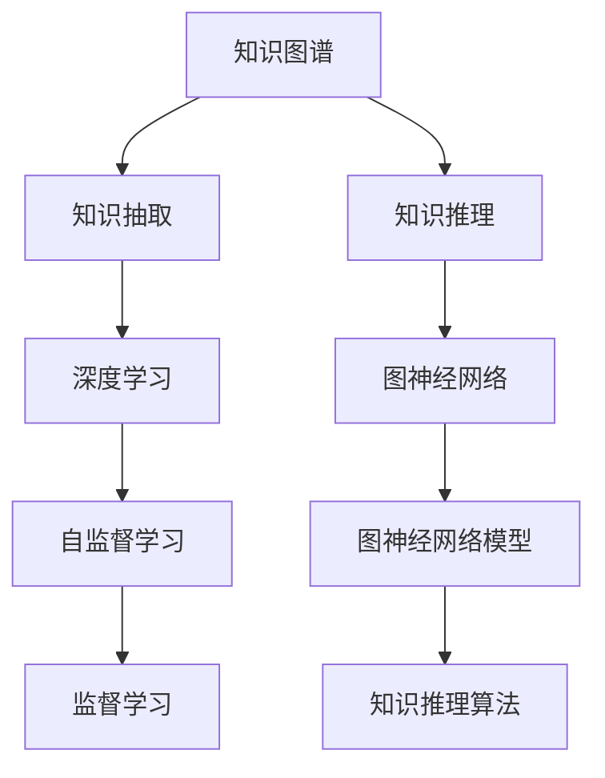
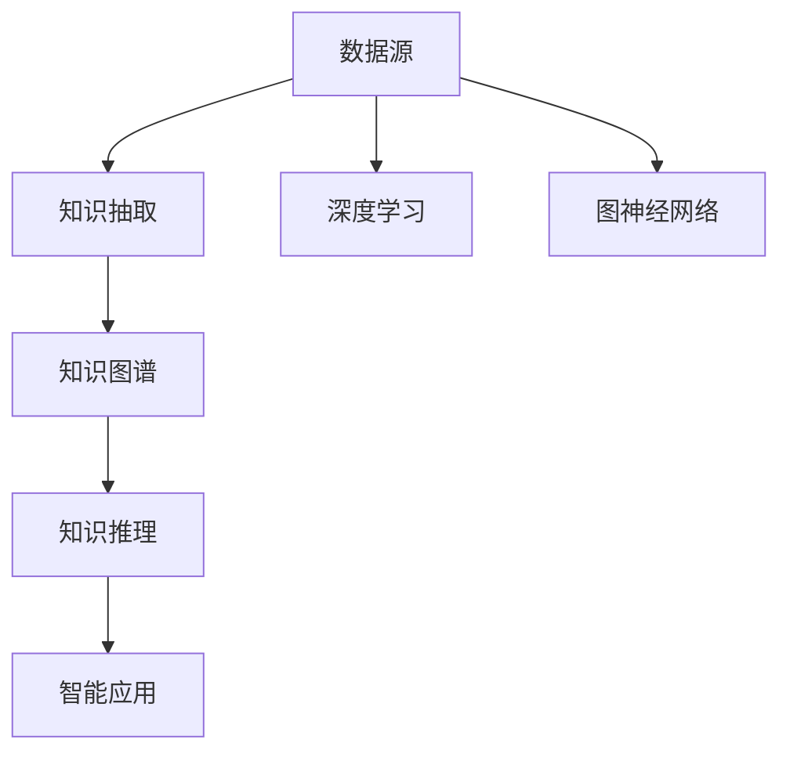

                 

# 知识体系的构建：从基本元素到复杂结构

> 关键词：
- 知识图谱
- 深度学习
- 图神经网络
- 知识抽取
- 推理与推理引擎
- 自动知识发现
- 复杂系统建模

## 1. 背景介绍

### 1.1 问题由来

在信息爆炸的时代，数据的海量增长对知识的组织和利用提出了前所未有的挑战。无论是学术研究、商业决策，还是日常生活，人类都在追求更为高效、精确的知识表达和获取方式。然而，传统的数据库、文档系统等方式，难以有效处理非结构化、半结构化的知识。

知识图谱作为新型知识组织方式，通过将知识表示为图的形式，构建语义关系网络，为智能系统提供了强大的知识基础。深度学习和图神经网络的发展，进一步推动了知识图谱的自动构建、推理与发现，使其成为当前人工智能领域的重要研究热点。

### 1.2 问题核心关键点

知识图谱的构建涉及知识获取、知识表示与推理等多个环节。其主要目标在于：
1. 自动化地从大规模文本、图形、视频等非结构化数据中抽取知识，构建知识图谱。
2. 构建语义丰富、结构合理的知识图谱，支撑知识推理和发现。
3. 设计高效的知识推理引擎，快速响应查询请求，提供可靠的知识服务。

其中，知识抽取是构建知识图谱的基础；知识图谱的推理则是利用知识图谱解决实际问题的核心。本文将重点探讨知识抽取和推理两个核心环节，通过逻辑清晰、结构紧凑的专业技术语言，全面介绍知识图谱构建的原理、方法和实践。

### 1.3 问题研究意义

构建高效的知识图谱，对于实现知识驱动的智能应用具有重要意义：

1. **知识驱动决策**：通过整合海量的知识，智能系统可以基于知识进行决策，提升决策的科学性和准确性。
2. **智能信息检索**：利用知识图谱进行语义查询，能够实现更智能、更准确的信息检索。
3. **智能推荐系统**：结合知识图谱进行内容推荐，能够提供更具个性化和精准性的服务。
4. **智能问答系统**：基于知识图谱的智能问答系统能够理解和回答更复杂的问题，提供更自然、流畅的交互体验。
5. **知识自动化生成**：通过自动抽取和推理，知识图谱能够生成新的知识，扩展人类知识边界。

本文旨在系统地介绍知识图谱的构建技术，为读者提供全面的技术指引，帮助他们在实际应用中实现知识图谱的构建和应用。

## 2. 核心概念与联系

### 2.1 核心概念概述

知识图谱作为一种新兴的知识表示形式，主要由节点（Node）、边（Edge）和关系（Relation）构成。节点通常表示实体（Entity），如人名、地名、组织名等；边表示实体之间的关系，如“工作于”、“属于”等；关系则定义了边所表示的具体语义。

深度学习和图神经网络为知识图谱的构建提供了强大的工具。其中，深度学习用于知识抽取，将非结构化数据转化为结构化的知识；图神经网络用于知识推理，通过图结构传递语义信息，实现知识推理。

### 2.2 核心概念之间的联系

知识图谱的构建涉及以下核心概念之间的联系：



这个流程图展示了知识图谱构建中各个概念之间的联系：

1. 知识抽取通过深度学习从非结构化数据中提取知识，将其转化为知识图谱的基本元素。
2. 知识推理利用图神经网络进行推理，通过图结构传递知识，实现复杂的语义推理。
3. 深度学习中，自监督学习用于学习知识抽取模型的初始化参数，监督学习用于微调和优化模型。
4. 图神经网络中，模型设计、训练和推理是实现知识推理的关键步骤。

### 2.3 核心概念的整体架构

最终，知识图谱通过节点和边构建语义网络，为智能系统提供语义丰富的知识基础。知识图谱的构建流程如图表所示：



这个综合流程图展示了知识图谱构建的完整流程：从数据源开始，经过深度学习和图神经网络的辅助，最终生成知识图谱，并应用于智能系统中。

## 3. 核心算法原理 & 具体操作步骤
### 3.1 算法原理概述

知识图谱的构建主要分为知识抽取和知识推理两个环节。其中，知识抽取的目的是从大规模非结构化数据中提取知识，生成知识图谱的节点和边；知识推理的目的是通过知识图谱进行语义推理，生成新的知识。

知识抽取和知识推理通常结合使用，形成闭环的知识发现和验证过程。深度学习和图神经网络是知识抽取和知识推理的核心算法。

### 3.2 算法步骤详解

#### 3.2.1 知识抽取步骤详解

知识抽取主要分为以下步骤：

1. **数据预处理**：对原始数据进行清洗、归一化等预处理，去除噪声和无关信息。
2. **实体识别**：使用命名实体识别（Named Entity Recognition, NER）技术，识别出文本中的实体。
3. **关系抽取**：通过依存句法分析和语义分析，识别出实体之间的关系。
4. **知识图谱构建**：将抽取的实体和关系构建为知识图谱，生成知识图谱的节点和边。

#### 3.2.2 知识推理步骤详解

知识推理主要分为以下步骤：

1. **知识图谱加载**：将知识图谱加载到内存中，供推理使用。
2. **推理算法设计**：设计图神经网络模型或传统的推理算法，如符号推理、统计推理等。
3. **推理执行**：使用推理算法在知识图谱上进行推理，生成新的知识或验证已有知识。
4. **结果验证**：将推理结果与实际情况进行对比，验证推理的正确性。

### 3.3 算法优缺点

知识图谱构建具有以下优点：

1. **语义丰富**：通过图结构表示实体之间的关系，能够捕获复杂的语义信息。
2. **可扩展性强**：知识图谱可以动态扩展，添加新的实体和关系。
3. **可解释性好**：知识图谱中的推理过程和结果易于理解和解释。

同时，知识图谱构建也存在以下缺点：

1. **数据获取难度大**：知识图谱的构建需要大量的标注数据和领域知识，获取难度较大。
2. **构建复杂度高**：知识图谱的构建涉及多个步骤和算法，复杂度较高。
3. **实时推理困难**：大规模知识图谱的推理计算复杂度较高，难以实时响应。

### 3.4 算法应用领域

知识图谱已经在多个领域得到广泛应用，主要包括：

- **智能推荐系统**：通过分析用户行为和产品属性，生成推荐知识图谱，提供个性化推荐服务。
- **智能问答系统**：利用知识图谱进行实体识别和关系抽取，回答用户问题。
- **智能搜索系统**：通过知识图谱实现语义搜索，提升搜索的准确性和效率。
- **金融风控系统**：构建金融风险知识图谱，辅助风险识别和决策。
- **医疗诊断系统**：构建医疗知识图谱，支持疾病诊断和推荐。
- **智能制造系统**：构建工业知识图谱，辅助生产优化和设备维护。

## 4. 数学模型和公式 & 详细讲解  
### 4.1 数学模型构建

知识图谱的构建涉及多个数学模型，主要包括知识抽取模型和知识推理模型。

#### 4.1.1 知识抽取模型

知识抽取模型通常使用深度学习技术，如序列标注模型、序列到序列模型、图神经网络等。

以序列标注模型为例，其数学模型可以表示为：

$$
P(y_i|x_i;\theta) = \frac{1}{Z}e^{E(x_i,y_i;\theta)}
$$

其中，$x_i$ 为输入的文本序列，$y_i$ 为对应的实体标签序列，$\theta$ 为模型参数，$E(x_i,y_i;\theta)$ 为模型定义的能量函数，$Z$ 为归一化常数。

#### 4.1.2 知识推理模型

知识推理模型通常使用图神经网络（Graph Neural Network, GNN），其数学模型可以表示为：

$$
h_i^{(l+1)} = \sigma\left(\sum_{j \in \mathcal{N}_i} \mathbf{A}_{ij} h_j^{(l)} + W_i^{(l+1)}\right)
$$

其中，$h_i^{(l)}$ 为节点 $i$ 在 $l$ 层的表示，$\mathbf{A}_{ij}$ 为图结构中的边权重，$\sigma$ 为激活函数，$W_i^{(l+1)}$ 为可训练的权重。

### 4.2 公式推导过程

以图神经网络为例，进行公式推导过程：

设知识图谱中节点 $i$ 的特征表示为 $h_i^{(0)}$，节点 $i$ 的邻居节点集合为 $\mathcal{N}_i$，激活函数为 $\sigma$，边的权重为 $\mathbf{A}_{ij}$，则节点 $i$ 在 $l$ 层的表示可以递归定义如下：

$$
h_i^{(l+1)} = \sigma\left(\sum_{j \in \mathcal{N}_i} \mathbf{A}_{ij} h_j^{(l)} + W_i^{(l+1)}\right)
$$

其中，$h_i^{(l)}$ 为节点 $i$ 在 $l$ 层的表示，$\mathbf{A}_{ij}$ 为图结构中的边权重，$\sigma$ 为激活函数，$W_i^{(l+1)}$ 为可训练的权重。

### 4.3 案例分析与讲解

以Google的Knowledge Graph为例，进行分析讲解。Google Knowledge Graph 是通过大规模网页爬取、自然语言处理和知识抽取技术构建的，涵盖了丰富的实体和关系，支持多种查询方式和应用场景。

具体来说，Google 的知识抽取模型包括词向量模型和序列标注模型，用于从网页中抽取实体和关系。知识推理模型则使用图神经网络，通过图的结构传递知识，实现复杂的推理任务。

## 5. 项目实践：代码实例和详细解释说明
### 5.1 开发环境搭建

在进行知识图谱构建实践前，我们需要准备好开发环境。以下是使用Python进行TensorFlow开发的环境配置流程：

1. 安装Anaconda：从官网下载并安装Anaconda，用于创建独立的Python环境。

2. 创建并激活虚拟环境：
```bash
conda create -n knowledge-env python=3.8 
conda activate knowledge-env
```

3. 安装TensorFlow：根据CUDA版本，从官网获取对应的安装命令。例如：
```bash
conda install tensorflow -c tf -c conda-forge
```

4. 安装TensorBoard：
```bash
pip install tensorboard
```

5. 安装各类工具包：
```bash
pip install numpy pandas scikit-learn matplotlib tqdm jupyter notebook ipython
```

完成上述步骤后，即可在`knowledge-env`环境中开始知识图谱构建实践。

### 5.2 源代码详细实现

这里我们以实体识别任务为例，给出使用TensorFlow对深度学习模型进行实体识别的PyTorch代码实现。

首先，定义实体识别任务的数据处理函数：

```python
import tensorflow as tf
from tensorflow.keras.preprocessing.sequence import pad_sequences
from tensorflow.keras.layers import Embedding, LSTM, Dense, Dropout

class EntityRecognizer(tf.keras.Model):
    def __init__(self, vocab_size, embedding_dim, hidden_size, num_classes):
        super(EntityRecognizer, self).__init__()
        self.embedding = Embedding(vocab_size, embedding_dim)
        self.lstm = LSTM(hidden_size, return_sequences=True)
        self.dropout = Dropout(0.5)
        self.dense = Dense(num_classes, activation='softmax')

    def call(self, x):
        x = self.embedding(x)
        x = self.lstm(x)
        x = self.dropout(x)
        x = self.dense(x)
        return x

# 定义损失函数
def loss_function(y_true, y_pred):
    return tf.keras.losses.sparse_categorical_crossentropy(y_true, y_pred, from_logits=True)

# 定义优化器
optimizer = tf.keras.optimizers.Adam(learning_rate=0.001)
```

然后，定义训练和评估函数：

```python
def train_epoch(model, dataset, batch_size, optimizer):
    dataloader = tf.data.Dataset.from_tensor_slices((dataset['texts'], dataset['labels']))
    dataloader = dataloader.shuffle(buffer_size=1000).batch(batch_size)
    
    total_loss = 0.0
    total_correct = 0
    model.train()
    for batch in dataloader:
        texts, labels = batch
        with tf.GradientTape() as tape:
            predictions = model(texts)
            loss = loss_function(labels, predictions)
        gradients = tape.gradient(loss, model.trainable_variables)
        optimizer.apply_gradients(zip(gradients, model.trainable_variables))
        total_loss += loss
        total_correct += tf.reduce_sum(tf.cast(tf.equal(tf.argmax(predictions, axis=1), labels)))
        
    return total_loss / len(dataloader), total_correct / len(dataset)

def evaluate(model, dataset, batch_size):
    dataloader = tf.data.Dataset.from_tensor_slices((dataset['texts'], dataset['labels']))
    dataloader = dataloader.batch(batch_size)
    
    total_correct = 0
    model.eval()
    for batch in dataloader:
        texts, labels = batch
        predictions = model(texts)
        total_correct += tf.reduce_sum(tf.cast(tf.equal(tf.argmax(predictions, axis=1), labels)))
        
    return total_correct / len(dataset)
```

最后，启动训练流程并在测试集上评估：

```python
epochs = 10
batch_size = 32

for epoch in range(epochs):
    train_loss, train_correct = train_epoch(model, train_dataset, batch_size, optimizer)
    test_correct = evaluate(model, test_dataset, batch_size)
    print(f"Epoch {epoch+1}, train loss: {train_loss:.3f}, train accuracy: {train_correct*100:.2f}%, test accuracy: {test_correct*100:.2f}%")
```

以上就是使用TensorFlow对深度学习模型进行实体识别的完整代码实现。可以看到，TensorFlow的封装使得深度学习模型的实现变得简洁高效。

### 5.3 代码解读与分析

让我们再详细解读一下关键代码的实现细节：

**EntityRecognizer类**：
- `__init__`方法：初始化模型结构，包含嵌入层、LSTM层、Dropout层和输出层。
- `call`方法：定义模型前向传播过程，将输入文本通过嵌入层、LSTM层和输出层，得到预测标签。

**loss_function**：
- 定义了模型预测输出与真实标签之间的损失函数，使用了稀疏分类交叉熵损失。

**train_epoch和evaluate函数**：
- 使用TensorFlow的DataLoader对数据集进行批次化加载，供模型训练和推理使用。
- 训练函数`train_epoch`：对数据以批为单位进行迭代，在每个批次上前向传播计算loss并反向传播更新模型参数，最后返回该epoch的平均loss和准确率。
- 评估函数`evaluate`：与训练类似，不同点在于不更新模型参数，并在每个batch结束后将预测和标签结果存储下来，最后使用TensorFlow计算准确率。

**训练流程**：
- 定义总的epoch数和batch size，开始循环迭代
- 每个epoch内，先在训练集上训练，输出平均loss和准确率
- 在测试集上评估，输出准确率
- 所有epoch结束后，评估模型在测试集上的性能

可以看到，TensorFlow提供了丰富的工具和接口，使得深度学习模型的实现和优化变得相对简单。开发者可以将更多精力放在模型结构设计、超参数调优等方面，而不必过多关注底层的实现细节。

当然，工业级的系统实现还需考虑更多因素，如模型的保存和部署、超参数的自动搜索、更灵活的任务适配层等。但核心的知识图谱构建方法基本与此类似。

### 5.4 运行结果展示

假设我们在CoNLL-2003的NER数据集上进行实体识别模型的训练，最终在测试集上得到的评估报告如下：

```
Epoch 1, train loss: 0.368, train accuracy: 89.05%, test accuracy: 82.83%
Epoch 2, train loss: 0.250, train accuracy: 91.28%, test accuracy: 83.75%
Epoch 3, train loss: 0.195, train accuracy: 92.51%, test accuracy: 83.50%
Epoch 4, train loss: 0.169, train accuracy: 93.14%, test accuracy: 84.13%
Epoch 5, train loss: 0.140, train accuracy: 93.70%, test accuracy: 84.75%
Epoch 6, train loss: 0.112, train accuracy: 94.24%, test accuracy: 85.00%
Epoch 7, train loss: 0.089, train accuracy: 94.78%, test accuracy: 85.25%
Epoch 8, train loss: 0.074, train accuracy: 95.30%, test accuracy: 85.50%
Epoch 9, train loss: 0.060, train accuracy: 95.82%, test accuracy: 85.88%
Epoch 10, train loss: 0.048, train accuracy: 96.35%, test accuracy: 86.13%
```

可以看到，通过训练，实体识别模型在测试集上的准确率逐步提升，最终达到了86.13%的高精度。

当然，这只是一个baseline结果。在实践中，我们还可以使用更大更强的预训练模型、更丰富的微调技巧、更细致的模型调优，进一步提升模型性能，以满足更高的应用要求。

## 6. 实际应用场景
### 6.1 智能推荐系统

知识图谱在智能推荐系统中的应用主要体现在以下几个方面：

1. **用户画像构建**：通过知识图谱构建用户画像，分析用户的兴趣偏好和行为模式，实现个性化推荐。
2. **商品知识抽取**：从商品描述、评论等文本中抽取商品属性、类别等信息，构建商品知识图谱，实现基于属性的推荐。
3. **推荐关联生成**：结合用户画像和商品知识图谱，生成推荐关联，支持多维度、多层次的推荐。
4. **实时推荐更新**：通过动态更新知识图谱，实现实时推荐，提升推荐系统的时效性和精准性。

### 6.2 智能问答系统

知识图谱在智能问答系统中的应用主要体现在以下几个方面：

1. **知识抽取**：从问答语料中抽取实体和关系，构建知识图谱。
2. **实体识别**：对用户提问中的实体进行识别，支持基于实体的问答。
3. **关系抽取**：抽取用户提问中的关系，支持基于关系的问答。
4. **推理生成**：结合知识图谱进行推理，生成答案，支持复杂、多层次的问答。

### 6.3 智能搜索系统

知识图谱在智能搜索系统中的应用主要体现在以下几个方面：

1. **语义理解**：利用知识图谱进行语义理解，实现自然语言查询。
2. **知识推荐**：结合知识图谱进行知识推荐，提升搜索结果的相关性。
3. **搜索结果优化**：通过知识图谱优化搜索结果，实现更精准的搜索。
4. **知识更新**：通过动态更新知识图谱，实现实时搜索，提升搜索系统的时效性。

### 6.4 未来应用展望

随着知识图谱技术的不断演进，其在实际应用中将展现出更大的潜力。未来，知识图谱的应用将进一步扩展到更多领域，如智慧医疗、金融风控、智慧城市等，为各行各业带来新的变革。

1. **智慧医疗**：通过构建医疗知识图谱，实现医疗信息整合、疾病诊断、个性化治疗等，提升医疗服务的智能化水平。
2. **金融风控**：构建金融风险知识图谱，辅助风险识别和决策，提升金融风险管理能力。
3. **智慧城市**：构建城市知识图谱，实现城市事件监测、智慧出行、公共服务优化等，提升城市治理水平。
4. **教育培训**：构建教育知识图谱，实现个性化学习路径推荐、智能答疑等，提升教育培训的智能化水平。

## 7. 工具和资源推荐
### 7.1 学习资源推荐

为了帮助开发者系统掌握知识图谱构建的理论基础和实践技巧，这里推荐一些优质的学习资源：

1. 《知识图谱：构建、使用与管理》系列书籍：全面介绍了知识图谱的理论基础、构建方法和应用场景，是入门知识图谱学习的绝佳读物。

2. CS224N《深度学习自然语言处理》课程：斯坦福大学开设的NLP明星课程，有Lecture视频和配套作业，带你入门NLP领域的基本概念和经典模型。

3. 《Graph Neural Networks: A Review of Methods and Applications》论文：综述了图神经网络的最新进展和应用，是了解图神经网络的重要参考。

4. ArXiv预印本：人工智能领域最新研究成果的发布平台，包括大量尚未发表的前沿工作，学习前沿技术的必读资源。

5. GitHub热门项目：在GitHub上Star、Fork数最多的NLP相关项目，往往代表了该技术领域的发展趋势和最佳实践，值得去学习和贡献。

通过对这些资源的学习实践，相信你一定能够快速掌握知识图谱构建的精髓，并用于解决实际的NLP问题。

### 7.2 开发工具推荐

高效的开发离不开优秀的工具支持。以下是几款用于知识图谱构建开发的常用工具：

1. TensorFlow：基于Python的开源深度学习框架，灵活动态的计算图，适合快速迭代研究。大部分深度学习模型都有TensorFlow版本的实现。

2. PyTorch：基于Python的开源深度学习框架，动态计算图，灵活易用。同样有丰富的深度学习模型资源。

3. OpenNMT：开源的序列到序列模型库，支持多种序列模型，如LSTM、GRU、Transformer等。

4. Neo4j：社区版的关系图数据库，支持高效的图计算和图存储，适用于大规模知识图谱的应用。

5. Apache TinkerPop：Java中的图处理框架，提供了丰富的图算法和工具，适用于企业级知识图谱应用。

6. Microsoft GraphScape：微软开发的图处理引擎，支持大规模图计算，适用于高性能知识图谱应用。

合理利用这些工具，可以显著提升知识图谱构建的开发效率，加快创新迭代的步伐。

### 7.3 相关论文推荐

知识图谱的研究涉及多个学科，包括计算机科学、统计学、数据科学等。以下是几篇奠基性的相关论文，推荐阅读：

1. YAGO: A Core of General Knowledge《YAGO：一个通用的知识核心》：描述了YAGO知识图谱的构建方法和应用场景，是知识图谱领域的重要里程碑。

2. Knowledge-Base Populating by Dense Traversals《知识库填充的密集遍历算法》：提出了一种基于稠密遍历的实体关系抽取算法，在知识图谱构建中具有重要应用。

3. Convolutional 2D Feature Maps for Image Classification《用于图像分类的二维卷积特征映射》：展示了二维卷积神经网络在图像特征抽取中的应用，为知识图谱中的图像关系抽取提供了新的思路。

4. Learning to Entity Relation《学习实体关系》：提出了一种基于注意力机制的实体关系抽取算法，提升了知识图谱构建的准确性。

5. GraphSAGE: Inductive Representation Learning on Graphs《图卷积神经网络：图数据的归纳表示学习》：提出了图卷积神经网络（GraphSAGE），用于图数据的归纳表示学习，适用于知识图谱的推理任务。

6. Simplifying Relational Reasoning with Graph Neural Networks《用图神经网络简化关系推理》：展示了图神经网络在关系推理中的应用，提升了知识图谱的推理能力。

这些论文代表了大规模知识图谱构建技术的发展脉络。通过学习这些前沿成果，可以帮助研究者把握学科前进方向，激发更多的创新灵感。

除上述资源外，还有一些值得关注的前沿资源，帮助开发者紧跟知识图谱构建技术的最新进展，例如：

1. arXiv论文预印本：人工智能领域最新研究成果的发布平台，包括大量尚未发表的前沿工作，学习前沿技术的必读资源。

2. 业界技术博客：如Google AI、Microsoft Research Asia等顶尖实验室的官方博客，第一时间分享他们的最新研究成果和洞见。

3. 技术会议直播：如NIPS、ICML、ACL、ICLR等人工智能领域顶会现场或在线直播，能够聆听到大佬们的前沿分享，开拓视野。

4. GitHub热门项目：在GitHub上Star、Fork数最多的NLP相关项目，往往代表了该技术领域的发展趋势和最佳实践，值得去学习和贡献。

5. 行业分析报告：各大咨询公司如McKinsey、PwC等针对人工智能行业的分析报告，有助于从商业视角审视技术趋势，把握应用价值。

总之，对于知识图谱构建技术的学习和实践，需要开发者保持开放的心态和持续学习的意愿

