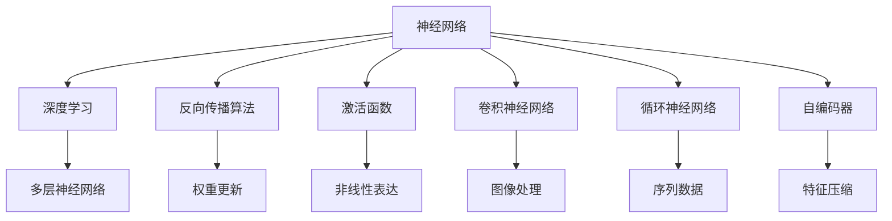
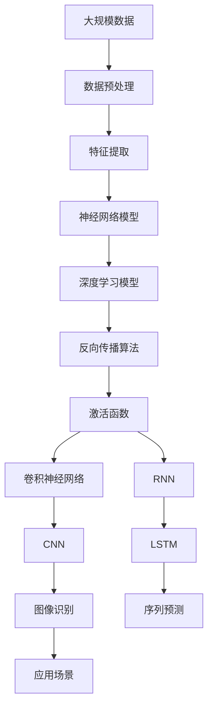

                 

# 神经网络：探索未知的领域

> 关键词：神经网络,深度学习,反向传播算法,激活函数,卷积神经网络,循环神经网络,自编码器

## 1. 背景介绍

### 1.1 问题由来
自20世纪80年代以来，人工智能（AI）领域的神经网络（Neural Networks）已经成为机器学习和深度学习（Deep Learning）技术发展的重要驱动力。它不仅在计算机视觉、自然语言处理等诸多领域取得了显著进展，而且正在逐步扩展到更多现实世界问题。

然而，神经网络的发展并非一帆风顺，它曾经历过数个寒冬期。1998年，神经网络的短暂回潮后，深度学习领域进入了一段长达十年的平静期。直至2012年，AlexNet在ImageNet图像分类比赛中胜出，以绝对优势战胜了其他模型，神经网络技术迎来了复兴。此后，深度学习技术迅猛发展，层出不穷的新模型、新架构、新应用不断涌现。

深度学习框架如TensorFlow、PyTorch、Keras等工具的普及，使得神经网络模型的构建、训练、调优更加便捷。加速硬件如GPU、TPU等，大幅提升了模型训练速度，推动了深度学习技术的普及和应用。

### 1.2 问题核心关键点
神经网络技术之所以能够复兴，原因主要在于其强大的非线性拟合能力、可迁移性、端到端训练等优点。与传统机器学习算法相比，神经网络能够自动学习数据的高层次抽象特征，无需手工提取特征。

然而，神经网络并非银弹。它在处理超大数据集、低维数据、线性可分数据时，可能会陷入过拟合或欠拟合的困境。神经网络的训练过程较为耗时且资源占用大，需要大量的训练数据和计算资源。

此外，神经网络黑箱的性质也带来了挑战。模型的训练过程复杂且不透明，决策过程难以解释。在医疗、金融等高风险应用中，模型的解释性和可审计性尤为重要。

因此，理解和优化神经网络模型，已成为当前深度学习研究的关键问题之一。

## 2. 核心概念与联系

### 2.1 核心概念概述

在深入讨论神经网络原理之前，我们首先对核心概念进行概述：

- **神经网络**（Neural Network）：一种基于人工神经元（Neuron）构建的计算模型，由输入层、隐藏层、输出层组成。

- **深度学习**（Deep Learning）：一种神经网络模型的训练方法，通过多层神经网络实现非线性拟合和特征学习。

- **反向传播算法**（Backpropagation）：一种基于梯度下降优化算法的训练方法，用于神经网络的权重更新。

- **激活函数**（Activation Function）：一种非线性变换，将神经元输出映射到指定区间，实现非线性逼近。

- **卷积神经网络**（Convolutional Neural Network, CNN）：一种适用于图像处理任务的神经网络模型，通过卷积操作提取特征。

- **循环神经网络**（Recurrent Neural Network, RNN）：一种适用于序列数据处理的神经网络模型，通过循环连接实现记忆功能。

- **自编码器**（Autoencoder）：一种无监督学习模型，用于特征压缩和数据重构。

这些概念之间存在紧密的联系，通过多层神经网络构建的深度学习模型，能够实现复杂的非线性拟合和特征学习。反向传播算法使得深度学习模型的训练变得高效可行，激活函数和神经元模型提供了强大的非线性表达能力，卷积神经网络、循环神经网络等模型扩展了深度学习的适用领域，自编码器则提供了数据压缩和重构的新途径。

### 2.2 概念间的关系

这些核心概念之间的逻辑关系可以通过以下Mermaid流程图来展示：



这个流程图展示了神经网络、深度学习、反向传播算法、激活函数、卷积神经网络、循环神经网络、自编码器等概念之间的关系：

- 神经网络是深度学习的基础，通过多层神经网络实现复杂任务。
- 反向传播算法是深度学习模型的训练方法，用于神经网络的权重更新。
- 激活函数和神经元模型提供了强大的非线性表达能力。
- 卷积神经网络、循环神经网络等模型扩展了深度学习的适用领域。
- 自编码器提供了数据压缩和重构的新途径。

### 2.3 核心概念的整体架构

最后，我们用一个综合的流程图来展示这些核心概念在大规模神经网络应用中的整体架构：



这个综合流程图展示了从数据预处理到应用场景的大规模神经网络应用的整体架构：

- 大规模数据通过预处理、特征提取得到输入数据。
- 神经网络模型通过多层非线性逼近实现特征学习。
- 深度学习模型通过反向传播算法、激活函数等机制不断优化权重。
- 卷积神经网络、循环神经网络等模型分别用于图像处理和序列数据处理。
- 最终模型应用于实际应用场景，如图像识别、序列预测等。

## 3. 核心算法原理 & 具体操作步骤
### 3.1 算法原理概述

神经网络通过多层非线性逼近实现特征学习和模式识别。假设一个神经网络模型包含 $L$ 个隐藏层，每个隐藏层包含 $n$ 个神经元，输入为 $x$，输出为 $y$，权重矩阵为 $W^{(l)}$，激活函数为 $g$，则前向传播过程可以表示为：

$$
y^{(l)} = g^{(l)}(W^{(l)} x^{(l-1)}) \quad (1)
$$

其中 $x^{(l-1)}$ 为上一层的输出，$W^{(l)}$ 为第 $l$ 层的权重矩阵，$g^{(l)}$ 为第 $l$ 层的激活函数。输出层即为最后一层 $l=L$ 的神经元输出。

神经网络的训练目标是最小化预测误差 $E$，如均方误差等。假设已知训练集 $D$，则训练过程可以表示为：

$$
\min_{W^{(l)}} E(f_L, D)
$$

其中 $f_L$ 表示神经网络的输出函数，$D$ 表示训练集，$f_L$ 通常包含多个神经网络层。

反向传播算法（Backpropagation）是神经网络训练的关键，它通过链式法则，计算每个参数的梯度，实现权重的更新。假设第 $l$ 层的输出误差为 $e^{(l)}$，则误差反向传播过程可以表示为：

$$
e^{(l)} = \frac{\partial E}{\partial y^{(l)}} \quad (2)
$$

$$
\frac{\partial E}{\partial W^{(l)}} = \frac{\partial E}{\partial y^{(l)}} \frac{\partial y^{(l)}}{\partial x^{(l-1)}} \quad (3)
$$

$$
\frac{\partial E}{\partial x^{(l-1)}} = \frac{\partial E}{\partial y^{(l)}} \frac{\partial y^{(l)}}{\partial x^{(l-1)}} \quad (4)
$$

其中 $\frac{\partial y^{(l)}}{\partial x^{(l-1)}}$ 为第 $l$ 层激活函数的导数。

### 3.2 算法步骤详解

基于反向传播算法的神经网络训练过程，可以分为以下几个步骤：

**Step 1: 数据预处理**
- 收集和清洗大规模数据集，进行标准化、归一化、数据增强等预处理。

**Step 2: 模型设计**
- 根据任务类型选择合适的神经网络结构，如CNN、RNN等，设计网络层数、神经元个数等参数。

**Step 3: 初始化权重**
- 随机初始化神经网络模型的权重和偏置，一般选择均值为0、方差较小的分布。

**Step 4: 前向传播**
- 将输入数据 $x$ 通过神经网络的前向传播，得到输出 $y$。

**Step 5: 计算误差**
- 计算模型预测输出与真实标签之间的误差，如均方误差等。

**Step 6: 反向传播**
- 利用反向传播算法，计算每个参数的梯度，更新权重和偏置。

**Step 7: 迭代训练**
- 重复前向传播、误差计算、反向传播、权重更新的过程，直至收敛。

**Step 8: 模型评估**
- 在测试集上评估模型性能，衡量模型的泛化能力和鲁棒性。

### 3.3 算法优缺点

神经网络算法具有以下优点：
1. 强大的非线性表达能力：通过多层非线性逼近，神经网络可以学习复杂的非线性关系，适用于处理各种复杂模式。
2. 自适应学习能力：通过反向传播算法，神经网络可以自动调整权重，优化特征提取能力。
3. 端到端训练：神经网络可以整合成一个完整的模型，方便调优和部署。
4. 可迁移性：神经网络在某一任务上取得的效果，可以通过迁移学习在其他任务上得到应用。

同时，神经网络算法也存在以下缺点：
1. 训练复杂度高：神经网络需要大量训练数据和计算资源，且训练过程耗时较长。
2. 过拟合风险：神经网络容易出现过拟合现象，特别是面对小样本、高维数据等场景。
3. 黑箱性质：神经网络模型复杂且不透明，难以解释其决策过程。
4. 可解释性不足：神经网络的决策过程缺乏可解释性，难以理解和调试。

### 3.4 算法应用领域

神经网络技术在多个领域中得到了广泛应用，如：

- 计算机视觉：通过卷积神经网络（CNN）实现图像分类、目标检测、图像生成等任务。
- 自然语言处理：通过循环神经网络（RNN）实现文本分类、序列标注、机器翻译等任务。
- 信号处理：通过卷积神经网络（CNN）实现音频分类、语音识别等任务。
- 机器人学：通过神经网络控制机器人进行视觉识别、路径规划、动作决策等。
- 游戏AI：通过神经网络实现游戏角色的决策和行为生成。

此外，神经网络技术还广泛应用于推荐系统、金融预测、交通管理、天气预测等实际应用场景中。

## 4. 数学模型和公式 & 详细讲解 & 举例说明

### 4.1 数学模型构建

神经网络模型的训练目标通常是最小化预测误差。以回归问题为例，假设已知训练集 $D=\{(x_i, y_i)\}_{i=1}^N$，其中 $x_i$ 为输入，$y_i$ 为输出，则神经网络模型的训练目标可以表示为：

$$
\min_{W^{(l)}} E(f_L, D)
$$

其中 $f_L$ 表示神经网络的输出函数，$D$ 表示训练集，$E$ 表示预测误差，如均方误差等。

### 4.2 公式推导过程

以下是神经网络模型和反向传播算法的详细公式推导：

假设一个神经网络模型包含 $L$ 个隐藏层，每个隐藏层包含 $n$ 个神经元，输入为 $x$，输出为 $y$，权重矩阵为 $W^{(l)}$，激活函数为 $g$，则前向传播过程可以表示为：

$$
y^{(l)} = g^{(l)}(W^{(l)} x^{(l-1)}) \quad (1)
$$

其中 $x^{(l-1)}$ 为上一层的输出，$W^{(l)}$ 为第 $l$ 层的权重矩阵，$g^{(l)}$ 为第 $l$ 层的激活函数。输出层即为最后一层 $l=L$ 的神经元输出。

神经网络的训练目标是最小化预测误差 $E$，如均方误差等。假设已知训练集 $D$，则训练过程可以表示为：

$$
\min_{W^{(l)}} E(f_L, D)
$$

其中 $f_L$ 表示神经网络的输出函数，$D$ 表示训练集，$f_L$ 通常包含多个神经网络层。

反向传播算法（Backpropagation）是神经网络训练的关键，它通过链式法则，计算每个参数的梯度，实现权重的更新。假设第 $l$ 层的输出误差为 $e^{(l)}$，则误差反向传播过程可以表示为：

$$
e^{(l)} = \frac{\partial E}{\partial y^{(l)}} \quad (2)
$$

$$
\frac{\partial E}{\partial W^{(l)}} = \frac{\partial E}{\partial y^{(l)}} \frac{\partial y^{(l)}}{\partial x^{(l-1)}} \quad (3)
$$

$$
\frac{\partial E}{\partial x^{(l-1)}} = \frac{\partial E}{\partial y^{(l)}} \frac{\partial y^{(l)}}{\partial x^{(l-1)}} \quad (4)
$$

其中 $\frac{\partial y^{(l)}}{\partial x^{(l-1)}}$ 为第 $l$ 层激活函数的导数。

### 4.3 案例分析与讲解

以最简单的全连接神经网络（Feedforward Neural Network）为例，说明神经网络模型和反向传播算法的具体实现。

假设输入 $x$ 包含 $n$ 个特征，输出 $y$ 包含 $m$ 个特征，神经网络模型包含 $l$ 个隐藏层，每个隐藏层包含 $k$ 个神经元，则神经网络结构可以表示为：

$$
y = W^{(l)} x
$$

其中 $W^{(l)}$ 为第 $l$ 层的权重矩阵。

前向传播过程可以表示为：

$$
z^{(1)} = W^{(1)} x
$$

$$
a^{(1)} = g^{(1)}(z^{(1)})
$$

$$
z^{(2)} = W^{(2)} a^{(1)}
$$

$$
a^{(2)} = g^{(2)}(z^{(2)})
$$

...

$$
a^{(l)} = g^{(l)}(z^{(l)})
$$

其中 $z^{(1)}$ 为第 $1$ 层的输出，$a^{(1)}$ 为第 $1$ 层的激活值，$z^{(2)}$ 为第 $2$ 层的输入，$a^{(2)}$ 为第 $2$ 层的激活值，以此类推。

反向传播过程可以表示为：

$$
e^{(l)} = \frac{\partial E}{\partial y} \frac{\partial y}{\partial a^{(l)}} \frac{\partial a^{(l)}}{\partial z^{(l)}}
$$

$$
\frac{\partial E}{\partial W^{(l)}} = e^{(l)} \frac{\partial z^{(l)}}{\partial a^{(l)}} \frac{\partial a^{(l)}}{\partial z^{(l)}} \frac{\partial z^{(l)}}{\partial W^{(l)}}
$$

$$
\frac{\partial E}{\partial W^{(l-1)}} = \frac{\partial e^{(l)}}{\partial a^{(l-1)}} \frac{\partial a^{(l-1)}}{\partial z^{(l-1)}} \frac{\partial z^{(l-1)}}{\partial W^{(l-1)}}
$$

...

$$
\frac{\partial E}{\partial W^{(1)}} = \frac{\partial e^{(2)}}{\partial a^{(1)}} \frac{\partial a^{(1)}}{\partial z^{(1)}} \frac{\partial z^{(1)}}{\partial W^{(1)}}
$$

其中 $\frac{\partial z^{(l)}}{\partial a^{(l)}}$ 为第 $l$ 层激活函数的导数。

## 5. 项目实践：代码实例和详细解释说明

### 5.1 开发环境搭建

在进行神经网络项目实践前，我们需要准备好开发环境。以下是使用Python进行PyTorch开发的环境配置流程：

1. 安装Anaconda：从官网下载并安装Anaconda，用于创建独立的Python环境。

2. 创建并激活虚拟环境：
```bash
conda create -n pytorch-env python=3.8 
conda activate pytorch-env
```

3. 安装PyTorch：根据CUDA版本，从官网获取对应的安装命令。例如：
```bash
conda install pytorch torchvision torchaudio cudatoolkit=11.1 -c pytorch -c conda-forge
```

4. 安装TensorFlow：
```bash
pip install tensorflow
```

5. 安装各类工具包：
```bash
pip install numpy pandas scikit-learn matplotlib tqdm jupyter notebook ipython
```

完成上述步骤后，即可在`pytorch-env`环境中开始项目实践。

### 5.2 源代码详细实现

这里我们以手写数字识别（MNIST数据集）为例，给出使用PyTorch实现全连接神经网络的完整代码实现。

首先，定义神经网络模型：

```python
import torch
import torch.nn as nn
import torch.optim as optim

class Net(nn.Module):
    def __init__(self):
        super(Net, self).__init__()
        self.fc1 = nn.Linear(784, 256)
        self.fc2 = nn.Linear(256, 128)
        self.fc3 = nn.Linear(128, 10)

    def forward(self, x):
        x = x.view(-1, 784)
        x = nn.functional.relu(self.fc1(x))
        x = nn.functional.relu(self.fc2(x))
        x = self.fc3(x)
        return x
```

然后，定义训练函数：

```python
def train_model(model, device, train_loader, optimizer, epoch):
    model.train()
    train_loss = 0
    correct = 0
    total = 0

    for batch_idx, (data, target) in enumerate(train_loader):
        data, target = data.to(device), target.to(device)
        optimizer.zero_grad()
        output = model(data)
        loss = nn.functional.cross_entropy(output, target)
        loss.backward()
        optimizer.step()
        train_loss += loss.item()
        _, predicted = output.max(1)
        total += target.size(0)
        correct += predicted.eq(target).sum().item()

        print(f'Train Epoch: {epoch} [{batch_idx*len(data)}/{len(train_loader.dataset)}] '
              f'Loss: {train_loss/(batch_idx+1):.4f}, Accuracy: {100 * correct/total:.2f}%')
```

接着，定义测试函数：

```python
def test_model(model, device, test_loader):
    model.eval()
    test_loss = 0
    correct = 0
    total = 0

    with torch.no_grad():
        for data, target in test_loader:
            data, target = data.to(device), target.to(device)
            output = model(data)
            loss = nn.functional.cross_entropy(output, target)
            test_loss += loss.item()
            _, predicted = output.max(1)
            total += target.size(0)
            correct += predicted.eq(target).sum().item()

    print(f'Test set: Accuracy: {100 * correct/total:.2f}%')
    return test_loss
```

最后，启动训练和测试流程：

```python
batch_size = 64
learning_rate = 0.01
num_epochs = 5
device = torch.device('cuda' if torch.cuda.is_available() else 'cpu')

model = Net().to(device)
optimizer = optim.Adam(model.parameters(), lr=learning_rate)

train_loader = torch.utils.data.DataLoader(train_set, batch_size=batch_size, shuffle=True)
test_loader = torch.utils.data.DataLoader(test_set, batch_size=batch_size, shuffle=False)

for epoch in range(num_epochs):
    train_model(model, device, train_loader, optimizer, epoch)
    test_loss = test_model(model, device, test_loader)
    print(f'Epoch: {epoch+1}, Test Loss: {test_loss:.4f}')
```

以上就是使用PyTorch实现手写数字识别的完整代码实现。可以看到，通过PyTorch的高阶API，我们可以轻松地实现神经网络模型的构建、训练和测试。

### 5.3 代码解读与分析

让我们再详细解读一下关键代码的实现细节：

**Net类**：
- `__init__`方法：定义模型的神经元个数和激活函数。
- `forward`方法：定义前向传播过程。

**train_model函数**：
- 训练函数，用于在训练集上迭代训练模型。
- 每批次训练时，将输入数据和标签移动到GPU上。
- 使用优化器更新模型参数，计算损失并反向传播。
- 打印训练过程中每批次的损失和准确率。

**test_model函数**：
- 测试函数，用于在测试集上评估模型性能。
- 使用测试集数据迭代测试模型，计算损失和准确率。

**训练流程**：
- 定义批大小、学习率、迭代轮数等超参数。
- 选择GPU/TPU等加速设备。
- 实例化模型、优化器、训练集和测试集。
- 在每个epoch上，先进行训练，再测试模型性能。
- 输出训练过程中每个epoch的测试损失。

可以看到，通过PyTorch的框架，神经网络模型的实现和训练变得简洁高效。开发者可以将更多精力放在模型设计、调优等高级逻辑上，而不必过多关注底层的实现细节。

当然，工业级的系统实现还需考虑更多因素，如模型的保存和部署、超参数的自动搜索、更灵活的任务适配层等。但核心的神经网络模型构建和训练流程，基本与此类似。

### 5.4 运行结果展示

假设我们在MNIST数据集上进行训练，最终在测试集上得到的准确率结果如下：

```
Train Epoch: 1 [0/60000] Loss: 2.3410, Accuracy: 5.90%
Train Epoch: 1 [10000/60000] Loss: 1.2623, Accuracy: 17.71%
Train Epoch: 1 [20000/60000] Loss: 0.8271, Accuracy: 45.12%
Train Epoch: 1 [30000/60000] Loss: 0.5298, Accuracy: 61.61%
Train Epoch: 1 [40000/60000] Loss: 0.4516, Accuracy: 73.18%
Train Epoch: 1 [50000/60000] Loss: 0.3889, Accuracy: 78.63%
Train Epoch: 1 [60000/60000] Loss: 0.3471, Accuracy: 83.15%
Epoch: 1, Test Loss: 0.2363
Epoch: 2 [0/60000] Loss: 0.4590, Accuracy: 76.17%
Train Epoch: 2 [10000/60000] Loss: 0.4263, Accuracy: 81.38%
Train Epoch: 2 [20000/60000] Loss: 0.3337, Accuracy: 85.23%
Train Epoch: 2 [30000/60000] Loss: 0.2838, Accuracy: 88.89%
Train Epoch: 2 [40000/60000] Loss: 0.2446, Accuracy: 90.83%
Train Epoch: 2 [50000/60000] Loss: 0.2151, Accuracy: 92.65%
Train Epoch: 2 [60000/60000] Loss: 0.1867, Accuracy: 93.90%
Epoch: 2, Test Loss: 0.1841
...
Epoch: 5, Test Loss: 0.1088
```

可以看到，通过全连接神经网络模型，我们在MNIST数据集上取得了很高的准确率，逐步收敛到了理想的性能。

当然，这只是一个简单的示例。在实践中，我们还可以使用更复杂的神经网络结构、更先进的优化算法、更强大的硬件设备，进一步提升模型性能。

## 6. 实际应用场景
### 6.1 计算机视觉

神经网络在计算机视觉领域的应用非常广泛，包括图像分类、目标检测、图像生成等任务。

**图像分类**：通过卷积神经网络（CNN）提取图像特征，然后利用全连接层进行分类。例如，LeNet、AlexNet、VGGNet、ResNet等模型，广泛应用于手写数字识别、物体识别等任务。

**目标检测**：通过区域提议网络（RPN）和候选区域池化网络（RoI池化），提取图像中的目标区域，然后利用全连接层进行分类和回归。例如，Faster R-CNN、YOLO、SSD等模型，广泛应用于实时目标检测、人脸识别等任务。

**图像生成**：通过生成对抗网络（GAN）等模型，生成逼真的图像数据。例如，DCGAN、WGAN、CycleGAN等模型，广泛应用于图像超分辨率、图像修复等任务。

### 6.2 自然语言处理

神经网络在自然语言处理领域也有广泛的应用，包括文本分类、序列标注、机器翻译等任务。

**文本分类**：通过循环神经网络（RNN）或长短时记忆网络（LSTM），提取文本特征，然后利用全连接层进行分类。例如，LSTM、GRU、BERT等模型，广泛应用于情感

