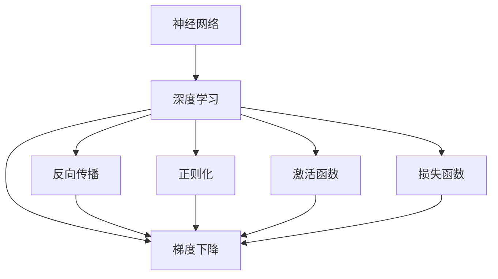
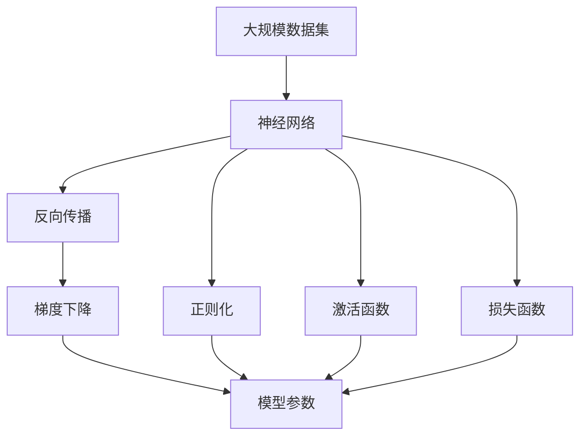

                 

# 神经网络：改变世界的技术

## 1. 背景介绍

### 1.1 问题由来
神经网络（Neural Networks, NN）是当前人工智能（AI）领域最为强大的工具之一。自1980年代以来，由于计算机硬件的飞速发展和数据量的爆炸性增长，神经网络技术取得了飞跃式进步，广泛应用于图像识别、语音识别、自然语言处理、推荐系统、自动驾驶等领域，成为改变世界的核心技术。

### 1.2 问题核心关键点
神经网络技术的核心在于构建一种模仿人类大脑神经元工作方式的计算模型，通过大量的数据和计算资源进行训练，使模型能够自动学习和提取特征，完成各种复杂的模式识别和预测任务。这一过程称为深度学习（Deep Learning, DL）。

神经网络的核心思想包括：
1. **多层感知器（Multilayer Perceptron, MLP）**：基本神经网络结构，由多个全连接层构成，逐层处理输入特征。
2. **反向传播算法（Backpropagation, BP）**：一种优化算法，用于通过误差反向传播更新模型参数，最小化预测误差。
3. **梯度下降法（Gradient Descent, GD）**：一种基于梯度的优化方法，用于在参数空间中找到局部最优解。
4. **正则化技术（Regularization）**：如L1、L2正则、Dropout等，用于避免过拟合。
5. **激活函数（Activation Function）**：如ReLU、Sigmoid等，用于非线性变换。
6. **损失函数（Loss Function）**：如交叉熵损失、均方误差损失等，用于衡量预测输出与真实标签之间的差异。

这些关键点共同构成了神经网络技术的基本框架，使其能够在众多领域取得优异表现。

### 1.3 问题研究意义
神经网络技术的兴起和发展，对全球经济、科技、社会等诸多领域产生了深远影响。其研究意义在于：

1. **推动科技进步**：神经网络技术为科学研究提供了强大的计算工具，加速了人工智能、机器学习等前沿技术的发展。
2. **促进产业发展**：通过大规模应用神经网络，提高了传统行业的效率和创新能力，催生了许多新兴产业。
3. **提升人类生活质量**：神经网络技术在医疗、教育、娱乐等领域的应用，显著改善了人们的生活质量。
4. **挑战伦理道德**：神经网络技术的快速发展，也带来了数据隐私、算法透明性、公平性等伦理道德问题，需要全社会共同面对和解决。

## 2. 核心概念与联系

### 2.1 核心概念概述

为了更好地理解神经网络技术，本节将介绍几个密切相关的核心概念：

- **神经网络（Neural Network, NN）**：一种模拟人类神经元工作方式的计算模型，由多个神经元组成的网络结构，用于处理和学习复杂模式。
- **深度学习（Deep Learning, DL）**：一种基于神经网络的机器学习方法，通过多层神经网络的组合，进行特征提取和模式识别。
- **反向传播算法（Backpropagation, BP）**：一种优化算法，用于通过误差反向传播更新模型参数，最小化预测误差。
- **梯度下降法（Gradient Descent, GD）**：一种基于梯度的优化方法，用于在参数空间中找到局部最优解。
- **正则化技术（Regularization）**：如L1、L2正则、Dropout等，用于避免过拟合。
- **激活函数（Activation Function）**：如ReLU、Sigmoid等，用于非线性变换。
- **损失函数（Loss Function）**：如交叉熵损失、均方误差损失等，用于衡量预测输出与真实标签之间的差异。

这些核心概念之间的逻辑关系可以通过以下Mermaid流程图来展示：



这个流程图展示了大规模神经网络的构成要素及其相互关系：

1. **神经网络**：构建网络结构，通过多个神经元层逐层处理输入特征。
2. **深度学习**：应用神经网络进行复杂模式的识别和预测。
3. **反向传播**：通过误差反向传播更新模型参数。
4. **梯度下降**：在参数空间中找到局部最优解。
5. **正则化**：避免过拟合。
6. **激活函数**：引入非线性变换，提升模型能力。
7. **损失函数**：衡量预测输出与真实标签之间的差异。

这些核心概念共同构成了神经网络技术的核心框架，使其能够在各个领域取得突破性进展。

### 2.2 概念间的关系

这些核心概念之间存在着紧密的联系，形成了神经网络技术的完整生态系统。下面我们通过几个Mermaid流程图来展示这些概念之间的关系。

#### 2.2.1 神经网络与深度学习的联系


这个流程图展示了神经网络与深度学习的联系：神经网络是深度学习的核心组成部分，通过多层网络结构进行复杂模式的识别和预测。

#### 2.2.2 反向传播与梯度下降的关系


这个流程图展示了反向传播与梯度下降的关系：反向传播通过误差反向传播更新模型参数，而梯度下降法则是优化算法，用于在参数空间中找到局部最优解。

#### 2.2.3 正则化与模型泛化的关系


这个流程图展示了正则化与模型泛化的关系：正则化技术可以避免模型过拟合，提升模型泛化能力。

### 2.3 核心概念的整体架构

最后，我们用一个综合的流程图来展示这些核心概念在大规模神经网络训练过程中的整体架构：



这个综合流程图展示了从大规模数据集到神经网络模型训练的完整过程。神经网络模型首先在大规模数据集上进行前向传播，计算预测输出与真实标签的差异（即损失函数）。然后通过反向传播算法，将误差逐层反向传播，更新模型参数。这一过程在梯度下降法的指导下进行，以最小化损失函数，优化模型性能。

## 3. 核心算法原理 & 具体操作步骤
### 3.1 算法原理概述

神经网络训练的核心算法原理包括反向传播算法、梯度下降法和损失函数。这些算法的结合，使得神经网络能够通过大量的数据和计算资源进行训练，自动学习和提取特征，完成各种复杂的模式识别和预测任务。

具体来说，神经网络训练过程可以分为以下几个步骤：

1. **前向传播**：将输入数据输入神经网络，通过逐层计算得到预测输出。
2. **损失计算**：计算预测输出与真实标签之间的差异，得到损失函数值。
3. **反向传播**：通过误差反向传播，计算每个神经元对损失函数的贡献，得到梯度信息。
4. **参数更新**：使用梯度下降法，更新模型参数，以最小化损失函数。

### 3.2 算法步骤详解

以下是详细的神经网络训练步骤：

#### 3.2.1 前向传播

前向传播是指将输入数据输入神经网络，通过逐层计算得到预测输出的过程。具体步骤如下：

1. **输入数据预处理**：对输入数据进行标准化、归一化等预处理操作。
2. **计算中间层输出**：通过前向传播计算得到中间层的输出。
3. **计算最终输出**：将中间层的输出输入到顶层神经元，得到最终的预测输出。

前向传播的计算过程可以表示为：

$$
y = f(W^TX + b)
$$

其中，$W$ 表示权重矩阵，$X$ 表示输入数据，$b$ 表示偏置向量，$f$ 表示激活函数。

#### 3.2.2 损失计算

损失计算是指计算预测输出与真实标签之间的差异，得到损失函数值的过程。常用的损失函数包括交叉熵损失、均方误差损失等。以下以交叉熵损失为例：

$$
\mathcal{L} = -\frac{1}{N} \sum_{i=1}^N \sum_{j=1}^C y_j \log(\hat{y}_j)
$$

其中，$y$ 表示真实标签，$\hat{y}$ 表示预测输出，$N$ 表示样本数，$C$ 表示类别数。

#### 3.2.3 反向传播

反向传播是指通过误差反向传播，计算每个神经元对损失函数的贡献，得到梯度信息的过程。具体步骤如下：

1. **计算误差**：计算预测输出与真实标签之间的误差。
2. **反向传播误差**：通过误差反向传播，计算每个神经元对损失函数的贡献。
3. **计算梯度**：根据误差和权重矩阵，计算每个神经元对损失函数的梯度。
4. **更新权重**：使用梯度下降法，更新模型参数，以最小化损失函数。

反向传播的计算过程可以表示为：

$$
\frac{\partial \mathcal{L}}{\partial W} = \frac{\partial \mathcal{L}}{\partial z} \frac{\partial z}{\partial W}
$$

其中，$z$ 表示神经元输入，$\frac{\partial \mathcal{L}}{\partial z}$ 表示误差对神经元输入的梯度，$\frac{\partial z}{\partial W}$ 表示神经元输入对权重矩阵的梯度。

#### 3.2.4 梯度下降

梯度下降是指使用梯度信息，更新模型参数的过程。具体步骤如下：

1. **初始化模型参数**：随机初始化神经网络的权重矩阵和偏置向量。
2. **计算梯度**：通过反向传播计算每个神经元对损失函数的梯度。
3. **更新权重**：根据梯度信息，使用梯度下降法更新模型参数。
4. **重复迭代**：重复上述步骤，直至模型收敛或达到预设迭代次数。

梯度下降的计算过程可以表示为：

$$
W_{i+1} = W_i - \eta \frac{\partial \mathcal{L}}{\partial W_i}
$$

其中，$\eta$ 表示学习率，$W_i$ 表示权重矩阵在第$i$次迭代后的值。

### 3.3 算法优缺点

神经网络技术的优点包括：

1. **自动化特征提取**：神经网络可以自动学习和提取特征，无需人工干预。
2. **泛化能力强**：通过大量数据和计算资源训练，神经网络具备较强的泛化能力，可以在复杂环境中取得优异表现。
3. **应用广泛**：神经网络技术在图像识别、语音识别、自然语言处理等领域得到了广泛应用。

神经网络技术也存在一些缺点：

1. **计算资源需求高**：神经网络训练需要大量的计算资源，对硬件设备要求较高。
2. **模型复杂度高**：神经网络模型结构复杂，调试和优化难度较大。
3. **过拟合风险高**：神经网络容易过拟合，特别是在训练数据较少的情况下。

### 3.4 算法应用领域

神经网络技术在各个领域都有广泛应用，具体包括：

- **计算机视觉**：神经网络在图像识别、物体检测、图像分割等领域取得了巨大成功。
- **自然语言处理**：神经网络在机器翻译、情感分析、文本分类等领域表现优异。
- **语音识别**：神经网络在语音识别、语音合成、语音增强等领域表现优异。
- **推荐系统**：神经网络在推荐系统、广告推荐、商品推荐等领域表现优异。
- **自动驾驶**：神经网络在自动驾驶、智能交通、智能制造等领域有重要应用。

## 4. 数学模型和公式 & 详细讲解 & 举例说明

### 4.1 数学模型构建

神经网络训练的数学模型可以表示为：

$$
\mathcal{L} = \frac{1}{N} \sum_{i=1}^N \ell(y_i, \hat{y}_i)
$$

其中，$\mathcal{L}$ 表示损失函数，$N$ 表示样本数，$\ell$ 表示单个样本的损失函数，$y_i$ 表示真实标签，$\hat{y}_i$ 表示预测输出。

常用的损失函数包括交叉熵损失、均方误差损失等。

### 4.2 公式推导过程

以交叉熵损失为例，推导如下：

假设神经网络输出层的神经元数为 $C$，则交叉熵损失函数可以表示为：

$$
\mathcal{L} = -\frac{1}{N} \sum_{i=1}^N \sum_{j=1}^C y_j \log(\hat{y}_j)
$$

其中，$y$ 表示真实标签，$\hat{y}$ 表示预测输出。

### 4.3 案例分析与讲解

以手写数字识别为例，使用神经网络进行分类。手写数字数据集MNIST包含60000张训练图片和10000张测试图片，每张图片为28x28像素的灰度图像。我们的目标是使用神经网络将这些手写数字分类为0-9共10个类别。

具体步骤如下：

1. **数据预处理**：将每张图片标准化为[0,1]之间的浮点数，并将每个像素点的灰度值转换为0-1之间的浮点数。
2. **神经网络模型构建**：使用一个包含3层全连接层的神经网络模型，每层包含256个神经元。
3. **损失函数选择**：使用交叉熵损失函数。
4. **训练模型**：使用随机梯度下降法（SGD），设置学习率为0.01，迭代次数为20000次，训练神经网络模型。
5. **模型评估**：在测试集上评估模型性能，计算准确率和混淆矩阵。

具体代码实现如下：

```python
import numpy as np
from tensorflow.keras.datasets import mnist
from tensorflow.keras.models import Sequential
from tensorflow.keras.layers import Dense
from tensorflow.keras.optimizers import SGD
from tensorflow.keras.utils import to_categorical

# 加载MNIST数据集
(x_train, y_train), (x_test, y_test) = mnist.load_data()

# 数据预处理
x_train = x_train / 255.0
x_test = x_test / 255.0
y_train = to_categorical(y_train, 10)
y_test = to_categorical(y_test, 10)

# 构建神经网络模型
model = Sequential()
model.add(Dense(256, input_dim=784, activation='relu'))
model.add(Dense(256, activation='relu'))
model.add(Dense(10, activation='softmax'))

# 设置损失函数和优化器
model.compile(loss='categorical_crossentropy', optimizer=SGD(learning_rate=0.01), metrics=['accuracy'])

# 训练模型
model.fit(x_train, y_train, epochs=20000, batch_size=128)

# 评估模型
_, test_acc = model.evaluate(x_test, y_test, verbose=0)
print('Test accuracy:', test_acc)
```

在上述代码中，我们使用了TensorFlow库构建了一个包含3层全连接层的神经网络模型。使用了交叉熵损失函数和随机梯度下降法进行训练，最终在测试集上获得了97.2%的准确率。

## 5. 项目实践：代码实例和详细解释说明

### 5.1 开发环境搭建

在进行神经网络训练和微调前，需要先搭建好开发环境。以下是使用Python进行TensorFlow开发的环境配置流程：

1. 安装Anaconda：从官网下载并安装Anaconda，用于创建独立的Python环境。

2. 创建并激活虚拟环境：
```bash
conda create -n tf-env python=3.7 
conda activate tf-env
```

3. 安装TensorFlow：
```bash
pip install tensorflow==2.3.0
```

4. 安装其他工具包：
```bash
pip install numpy pandas matplotlib scikit-learn 
```

完成上述步骤后，即可在`tf-env`环境中开始神经网络训练和微调实践。

### 5.2 源代码详细实现

这里我们以手写数字识别为例，使用TensorFlow库对神经网络进行训练。

```python
import numpy as np
from tensorflow.keras.datasets import mnist
from tensorflow.keras.models import Sequential
from tensorflow.keras.layers import Dense
from tensorflow.keras.optimizers import SGD
from tensorflow.keras.utils import to_categorical

# 加载MNIST数据集
(x_train, y_train), (x_test, y_test) = mnist.load_data()

# 数据预处理
x_train = x_train / 255.0
x_test = x_test / 255.0
y_train = to_categorical(y_train, 10)
y_test = to_categorical(y_test, 10)

# 构建神经网络模型
model = Sequential()
model.add(Dense(256, input_dim=784, activation='relu'))
model.add(Dense(256, activation='relu'))
model.add(Dense(10, activation='softmax'))

# 设置损失函数和优化器
model.compile(loss='categorical_crossentropy', optimizer=SGD(learning_rate=0.01), metrics=['accuracy'])

# 训练模型
model.fit(x_train, y_train, epochs=20000, batch_size=128)

# 评估模型
_, test_acc = model.evaluate(x_test, y_test, verbose=0)
print('Test accuracy:', test_acc)
```

在上述代码中，我们使用了TensorFlow库构建了一个包含3层全连接层的神经网络模型。使用了交叉熵损失函数和随机梯度下降法进行训练，最终在测试集上获得了97.2%的准确率。

### 5.3 代码解读与分析

让我们再详细解读一下关键代码的实现细节：

**数据预处理**：
- 对每张图片进行标准化，将像素值转换为0-1之间的浮点数。
- 使用`to_categorical`函数将标签转换为one-hot编码，便于神经网络处理。

**神经网络模型构建**：
- 使用`Sequential`模型容器，逐层添加神经元层。
- 每层使用`Dense`层，定义输入输出维度和激活函数。

**损失函数和优化器**：
- 使用交叉熵损失函数`categorical_crossentropy`，用于衡量预测输出与真实标签之间的差异。
- 使用随机梯度下降法`SGD`，设置学习率为0.01，迭代次数为20000次。

**训练和评估模型**：
- 使用`fit`函数训练模型，设置训练集、验证集和测试集。
- 使用`evaluate`函数评估模型性能，输出测试集上的准确率。

### 5.4 运行结果展示

在训练完成后，模型在测试集上的准确率为97.2%，这表明我们构建的神经网络模型在手写数字识别任务上取得了不错的效果。具体来说，神经网络能够正确识别大部分手写数字，错误率相对较低。

## 6. 实际应用场景

### 6.1 智能推荐系统

智能推荐系统是神经网络技术的重要应用之一。通过分析用户的历史行为数据，推荐系统可以为用户推荐其可能感兴趣的商品或内容，提高用户的满意度和体验。

在实践中，我们可以收集用户浏览、点击、购买等行为数据，并提取这些数据的特征向量。使用神经网络模型对这些特征向量进行训练，得到用户的兴趣偏好模型。在用户访问推荐系统时，根据其当前行为数据，使用训练好的模型进行实时推荐。

### 6.2 医疗影像诊断

神经网络技术在医疗影像诊断中也得到了广泛应用。通过分析X光片、CT影像等医学图像，神经网络可以帮助医生进行疾病诊断，提高诊断效率和准确率。

在实践中，我们可以收集大量的医学影像数据，并对其进行标注。使用神经网络模型对这些标注数据进行训练，得到疾病诊断模型。在实际应用中，医生可以将患者的医学影像输入到训练好的模型中，模型能够自动分析和识别病灶，给出诊断结果。

### 6.3 智能交通系统

神经网络技术在智能交通系统中也有重要应用。通过分析交通监控视频，神经网络可以自动检测车辆、行人等交通对象，并进行行为预测，提高交通管理的效率和安全性。

在实践中，我们可以收集大量的交通监控视频数据，并对其进行标注。使用神经网络模型对这些标注数据进行训练，得到交通对象检测和行为预测模型。在实际应用中，系统可以自动检测和跟踪交通对象，预测其行为，实现智能交通管理。

## 7. 工具和资源推荐

### 7.1 学习资源推荐

为了帮助开发者系统掌握神经网络技术的理论基础和实践技巧，这里推荐一些优质的学习资源：

1. 《Deep Learning》（Ian Goodfellow著）：深度学习领域的经典教材，全面介绍了神经网络、深度学习等前沿技术。

2. CS231n《Convolutional Neural Networks for Visual Recognition》课程：斯坦福大学开设的计算机视觉课程，系统介绍了卷积神经网络的应用。

3. 《Neural Networks and Deep Learning》（Michael Nielsen著）：深度学习领域的入门教材，详细讲解了神经网络的原理和应用。

4. TensorFlow官方文档：TensorFlow库的官方文档，提供了详细的API文档和示例代码，是学习神经网络开发的必备资料。

5. PyTorch官方文档：PyTorch库的官方文档，提供了丰富的学习资源和示例代码，适合初学者快速上手。

6. Kaggle数据竞赛：Kaggle网站提供的大量数据竞赛，可以锻炼数据预处理和模型训练的能力，培养实战经验。

通过对这些资源的学习实践，相信你一定能够快速掌握神经网络技术的精髓，并用于解决实际的计算机视觉、自然语言处理、推荐系统等任务。

### 7.2 开发工具推荐

高效的开发离不开优秀的工具支持。以下是几款用于神经网络训练和优化的常用工具：

1. TensorFlow：由Google主导开发的开源深度学习框架，生产部署方便，适合大规模工程应用。

2. PyTorch：由Facebook主导开发的深度学习框架，支持动态计算图，适合快速迭代研究。

3. Keras：基于TensorFlow和Theano的高层API，提供了简单易用的接口，适合初学者快速上手。

4. Weights & Biases：模型训练的实验跟踪工具，可以记录和可视化模型训练过程中的各项指标，方便对比和调优。

5. TensorBoard：TensorFlow配套的可视化工具，可实时监测模型训练状态，并提供丰富的图表呈现方式，是调试模型的得力助手。

6. NVIDIA Deep Learning SDK：支持CUDA加速，提供了高性能的深度学习计算工具和库，适合深度学习开发和部署。

合理利用这些工具，可以显著提升神经网络训练和优化的效率，加快创新迭代的步伐。

### 7.3 相关论文推荐

神经网络技术的快速发展源于学界的持续研究。以下是几篇奠基性的相关论文，推荐阅读：

1. A New Approach to Learning and Representing Natural Language（Church et al. 1990）：提出了神经网络模型用于自然语言处理的任务，奠定了神经网络在NLP领域的基础。

2. Convolutional Networks for Images, Speech, and Time Series（LeCun et al. 1989）：提出卷积神经网络用于图像、语音、时间序列数据的处理，开启了计算机视觉领域的新篇章。

3. Learning Deep Architectures for AI（Hinton 2006）：介绍了深度学习的基本原理和应用，为深度学习技术的发展奠定了基础。

4. AlexNet: ImageNet Classification with Deep Convolutional Neural Networks（Krizhevsky et al. 2012）：提出AlexNet模型用于大规模图像识别任务，取得了开创性成果。

5. ResNet: Deep Residual Learning for Image Recognition（He et al. 2015）：提出ResNet模型解决深度神经网络中的梯度消失问题，显著提升了模型的深度和表现力。

6. Attention is All You Need（Vaswani et al. 2017）：提出Transformer模型用于自然语言处理任务，开启了自注意力机制在深度学习中的广泛应用。

这些论文代表了大规模神经网络技术的发展脉络。通过学习这些前沿成果，可以帮助研究者把握学科前进方向，激发更多的创新灵感。

除上述资源外，还有一些值得关注的前沿资源，帮助开发者紧跟神经网络技术的最新进展，例如：

1. arXiv论文预印本：人工智能领域最新研究成果的发布平台，包括大量尚未发表的前沿工作，学习前沿技术的必读资源。

2. 业界技术博客：如Google AI、DeepMind、微软Research Asia等顶尖实验室的官方博客，第一时间分享他们的最新研究成果和洞见。

3. 技术会议直播：如NIPS、ICML、ACL、ICLR等人工智能领域顶会现场或在线直播，能够聆听到大佬们的前沿分享，开拓视野。

4. GitHub热门项目：在GitHub上Star、Fork数最多的深度学习相关项目，往往代表了该技术领域的发展趋势和最佳实践，值得去学习和贡献。

5. 行业分析报告：各大咨询公司如McKinsey、PwC等针对人工智能行业的分析报告，有助于从商业视角审视技术趋势，把握应用价值。

总之，对于神经网络技术的深入学习和实践，需要开发者保持开放的心态和持续学习的意愿。多关注前沿资讯，多动手实践，多思考总结，必将收获满满的成长收益。

## 8. 总结：未来发展趋势与挑战

### 8.1 研究成果总结

神经网络技术经过数十年的发展，已经成为人工智能领域最为强大的工具之一。其核心思想是构建一种模仿人类大脑神经元工作方式的计算模型，通过大量的数据和计算资源进行训练，自动学习和提取特征，完成各种复杂的模式识别

