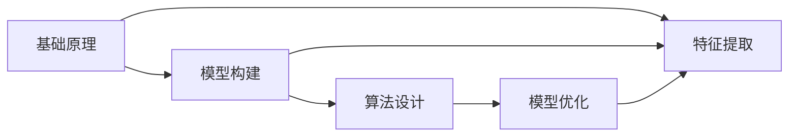

                 

# 第一性原理：从基础到复杂的科学方法

## 1. 背景介绍

### 1.1 问题由来

在科学技术领域，特别是物理学和化学中，第一性原理（First Principles）是一种研究方法，它要求从最基本的物理定律出发，推导出特定现象的微观机制。这一方法论强调从基本原理出发，不依赖于实验数据，直接推导结果，从而避免对实验数据的依赖和对现有理论的盲目接受。

第一性原理在化学领域的应用尤其显著，如密度泛函理论（Density Functional Theory, DFT）就是一种基于第一性原理的方法，通过求解量子力学的基本方程，计算材料的结构和性质。在物理学中，第一性原理也是量子力学和量子场论等理论研究的基础。

近年来，第一性原理的思维模式在人工智能和机器学习领域逐渐受到重视，成为研究深度学习和复杂系统的关键方法。本文将从第一性原理的基本概念出发，探讨其在人工智能和机器学习中的应用，并详细讲解如何从基础理论推导出复杂算法的具体操作步骤。

### 1.2 问题核心关键点

第一性原理的核心在于从最基本的物理定律和数学模型出发，推导出具体问题解决的原理和方法。在人工智能领域，这一方法论主要应用于以下几个方面：

- 模型的构建与优化：从基本的数据和任务定义出发，构建机器学习模型，并通过优化算法提升模型性能。
- 特征的提取与选择：基于数据的内在结构，推导出有效的特征表示，用于提升模型的泛化能力和鲁棒性。
- 算法的设计与实现：从基本的计算模型出发，推导出高效的计算方法和数据结构，实现复杂的算法功能。

本文将详细介绍如何通过第一性原理，构建从基础到复杂的人工智能模型，并探讨其在实际应用中的关键点和技术难点。

### 1.3 问题研究意义

第一性原理在人工智能领域的应用，具有以下重要意义：

- 提升模型的鲁棒性和泛化能力：通过从基础数据和任务定义出发，可以构建更加健壮的模型，避免过拟合和数据依赖。
- 降低模型的复杂度和计算成本：基于基本的数学模型和算法，可以实现高效、低成本的计算和推理。
- 促进模型创新和突破：第一性原理要求从基本原理出发，有助于突破现有理论的局限，推动新的算法和技术发展。
- 增强模型的可解释性和可靠性：基于第一性原理的模型往往具有更强的逻辑性和可解释性，有助于提高模型的可信度和应用安全性。

通过系统学习第一性原理，可以全面掌握人工智能的基本理论和方法，为后续更复杂的模型设计和应用提供坚实的基础。

## 2. 核心概念与联系

### 2.1 核心概念概述

第一性原理的核心在于从最基础的物理定律和数学模型出发，推导出复杂问题的解决方案。以下是对这一核心概念的详细解释：

- **基础原理**：指最基本的物理定律和数学模型，如牛顿运动定律、麦克斯韦方程组、量子力学方程等。
- **模型构建**：基于基础原理，构建机器学习模型，如线性回归、神经网络、深度学习等。
- **特征提取**：通过数学模型推导出有效的特征表示，用于提升模型的泛化能力和鲁棒性。
- **算法设计**：从基本的计算模型出发，推导出高效的计算方法和数据结构，实现复杂的算法功能。

### 2.2 概念间的关系

第一性原理的各个概念之间存在着紧密的联系，共同构成了复杂问题求解的基本框架。下面通过Mermaid流程图来展示这些概念之间的关系：



这一流程图展示了从基础原理到模型构建，再到特征提取和算法设计的过程。各个环节相互依赖，共同推动复杂问题求解。

## 3. 核心算法原理 & 具体操作步骤

### 3.1 算法原理概述

第一性原理在人工智能中的应用，主要体现在以下几个方面：

- **线性回归**：从基本的数据线性关系出发，推导出线性回归模型，用于预测和分类。
- **神经网络**：基于生物神经元的工作原理，构建神经网络模型，实现非线性映射。
- **深度学习**：通过多层非线性变换，构建深度学习模型，用于处理复杂的多层次非线性关系。
- **优化算法**：基于梯度下降等基本优化算法，推导出各种高级优化算法，用于模型训练和参数调整。

本文将详细介绍这些核心算法的原理和具体操作步骤。

### 3.2 算法步骤详解

#### 3.2.1 线性回归

线性回归模型通过最小二乘法求解，其基本步骤如下：

1. **数据准备**：收集训练样本 $(x_i, y_i)$，其中 $x_i$ 为输入特征，$y_i$ 为输出标签。
2. **模型构建**：假设模型为 $y = \theta^T x + b$，其中 $\theta$ 为权重向量，$b$ 为偏置项。
3. **损失函数求解**：最小化均方误差损失函数 $L(\theta) = \frac{1}{N}\sum_{i=1}^N(y_i - \theta^T x_i - b)^2$。
4. **梯度下降优化**：根据损失函数对 $\theta$ 和 $b$ 的偏导数，更新参数值。
5. **模型评估**：在测试集上评估模型性能，计算均方误差等指标。

#### 3.2.2 神经网络

神经网络模型通过反向传播算法进行训练，其基本步骤如下：

1. **数据准备**：收集训练样本 $(x_i, y_i)$，其中 $x_i$ 为输入特征，$y_i$ 为输出标签。
2. **模型构建**：定义神经网络结构，包括输入层、隐藏层和输出层，以及激活函数等。
3. **前向传播**：将输入 $x_i$ 通过神经网络进行前向传播，得到输出 $\hat{y}_i$。
4. **损失函数求解**：最小化交叉熵损失函数 $L(\theta) = -\frac{1}{N}\sum_{i=1}^Ny_i\log\hat{y}_i + (1-y_i)\log(1-\hat{y}_i)$。
5. **反向传播优化**：计算梯度并更新权重和偏置项，重复多次直至收敛。
6. **模型评估**：在测试集上评估模型性能，计算准确率、精确度、召回率等指标。

#### 3.2.3 深度学习

深度学习模型通过多层非线性变换，处理复杂的多层次非线性关系，其基本步骤如下：

1. **数据准备**：收集训练样本 $(x_i, y_i)$，其中 $x_i$ 为输入特征，$y_i$ 为输出标签。
2. **模型构建**：定义深度学习模型，包括多层神经网络结构，以及各种激活函数、正则化方法等。
3. **前向传播**：将输入 $x_i$ 通过深度学习模型进行前向传播，得到输出 $\hat{y}_i$。
4. **损失函数求解**：最小化交叉熵损失函数 $L(\theta) = -\frac{1}{N}\sum_{i=1}^Ny_i\log\hat{y}_i + (1-y_i)\log(1-\hat{y}_i)$。
5. **反向传播优化**：计算梯度并更新权重和偏置项，重复多次直至收敛。
6. **模型评估**：在测试集上评估模型性能，计算准确率、精确度、召回率等指标。

#### 3.2.4 优化算法

优化算法通过梯度下降等基本优化算法，推导出各种高级优化算法，其基本步骤如下：

1. **数据准备**：收集训练样本 $(x_i, y_i)$，其中 $x_i$ 为输入特征，$y_i$ 为输出标签。
2. **模型构建**：定义优化算法，如SGD、Adam、Adagrad等。
3. **梯度计算**：计算损失函数对模型参数的梯度。
4. **参数更新**：根据梯度信息，更新模型参数。
5. **迭代优化**：重复多次梯度计算和参数更新，直至模型收敛。

### 3.3 算法优缺点

第一性原理在人工智能中的应用，具有以下优点：

- **理论基础牢固**：基于基本物理定律和数学模型，具有坚实的理论基础，避免了对实验数据的依赖。
- **可解释性强**：模型设计基于基本原理，具有较强的逻辑性和可解释性，有助于提高模型的可信度和应用安全性。
- **适用范围广**：第一性原理可以应用于各种复杂问题求解，具有广泛的适用性。

但同时，第一性原理也存在一些缺点：

- **计算复杂度高**：从基本原理推导复杂模型，往往涉及大量计算，需要较强的计算资源和算法优化能力。
- **时间成本高**：模型构建和优化往往需要较长时间，特别是在大规模数据集上的应用，时间成本较高。
- **数据依赖性强**：虽然第一性原理减少了对实验数据的依赖，但在模型优化和特征提取等环节，仍需要大量数据支持。

## 4. 数学模型和公式 & 详细讲解 & 举例说明

### 4.1 数学模型构建

本节将详细构建基于第一性原理的线性回归模型，并推导相关数学公式。

假设我们有一组训练样本 $(x_i, y_i)$，其中 $x_i \in \mathbb{R}^n$ 为输入特征，$y_i \in \mathbb{R}$ 为输出标签。我们的目标是找到一个线性模型 $y = \theta^T x + b$，其中 $\theta \in \mathbb{R}^n$ 为权重向量，$b \in \mathbb{R}$ 为偏置项。

### 4.2 公式推导过程

根据最小二乘法的原理，我们定义损失函数 $L(\theta) = \frac{1}{N}\sum_{i=1}^N(y_i - \theta^T x_i - b)^2$。

对 $\theta$ 和 $b$ 求偏导数，得到：

$$
\frac{\partial L}{\partial \theta} = \frac{2}{N}\sum_{i=1}^N(x_i - y_i) x_i
$$

$$
\frac{\partial L}{\partial b} = \frac{2}{N}\sum_{i=1}^N(y_i - \theta^T x_i - b)
$$

根据梯度下降的优化策略，更新 $\theta$ 和 $b$ 的值，即：

$$
\theta \leftarrow \theta - \eta \frac{\partial L}{\partial \theta}
$$

$$
b \leftarrow b - \eta \frac{\partial L}{\partial b}
$$

其中 $\eta$ 为学习率。

### 4.3 案例分析与讲解

我们以房价预测为例，详细分析线性回归模型的构建和优化过程。

假设我们有一组历史房产交易数据，包含房屋面积、房间数量、价格等特征，以及对应的房价标签。我们的目标是通过这些历史数据，预测新房产的价格。

1. **数据准备**：收集历史房产交易数据，将其分为训练集和测试集。
2. **模型构建**：定义线性回归模型，假设价格与面积、房间数量等特征之间存在线性关系，模型为 $y = \theta^T x + b$。
3. **损失函数求解**：最小化均方误差损失函数 $L(\theta) = \frac{1}{N}\sum_{i=1}^N(y_i - \theta^T x_i - b)^2$。
4. **梯度下降优化**：根据梯度信息，更新 $\theta$ 和 $b$ 的值，重复多次直至收敛。
5. **模型评估**：在测试集上评估模型性能，计算均方误差等指标。

## 5. 项目实践：代码实例和详细解释说明

### 5.1 开发环境搭建

在进行模型构建和优化时，我们需要准备好开发环境。以下是使用Python进行TensorFlow开发的环境配置流程：

1. 安装Anaconda：从官网下载并安装Anaconda，用于创建独立的Python环境。
2. 创建并激活虚拟环境：
```bash
conda create -n tf-env python=3.8 
conda activate tf-env
```

3. 安装TensorFlow：根据CUDA版本，从官网获取对应的安装命令。例如：
```bash
conda install tensorflow==2.6
```

4. 安装各类工具包：
```bash
pip install numpy pandas scikit-learn matplotlib tqdm jupyter notebook ipython
```

完成上述步骤后，即可在`tf-env`环境中开始模型构建和优化。

### 5.2 源代码详细实现

下面是使用TensorFlow构建和优化线性回归模型的代码实现：

```python
import tensorflow as tf
import numpy as np
import matplotlib.pyplot as plt

# 数据准备
X = np.array([[1.0, 2.0], [2.0, 3.0], [3.0, 4.0], [4.0, 5.0]])
y = np.array([2.0, 3.5, 5.0, 6.5])

# 模型构建
theta = tf.Variable([0.5, 0.5], dtype=tf.float32, name="theta")
b = tf.Variable(1.0, dtype=tf.float32, name="b")
X = tf.placeholder(tf.float32, shape=[None, 2], name="X")
y = tf.placeholder(tf.float32, shape=[None], name="y")

# 损失函数求解
y_pred = tf.matmul(X, theta) + b
loss = tf.reduce_mean(tf.square(y - y_pred))

# 梯度下降优化
optimizer = tf.train.GradientDescentOptimizer(learning_rate=0.01)
train_op = optimizer.minimize(loss)

# 模型训练
with tf.Session() as sess:
    sess.run(tf.global_variables_initializer())
    for i in range(100):
        _, loss_val = sess.run([train_op, loss], feed_dict={X: X, y: y})
        if i % 10 == 0:
            print("Step {}: Loss = {}".format(i, loss_val))
    theta_val, b_val = sess.run([theta, b])

# 模型评估
y_pred_val = sess.run(y_pred, feed_dict={X: X, y: y})
plt.plot(X, y, "ro", label="Data")
plt.plot(X, y_pred_val, "b-", label="Prediction")
plt.legend()
plt.show()
```

以上代码实现了从数据准备到模型训练，再到模型评估的完整流程。可以看到，TensorFlow提供了丰富的API，使得模型构建和优化过程变得简洁高效。

### 5.3 代码解读与分析

让我们再详细解读一下关键代码的实现细节：

**数据准备**：
- 我们使用了NumPy来创建输入特征 $X$ 和输出标签 $y$。

**模型构建**：
- 定义了两个变量 $\theta$ 和 $b$，分别表示权重向量和偏置项。
- 使用占位符 `tf.placeholder` 定义输入特征和输出标签的形状。

**损失函数求解**：
- 通过矩阵乘法计算预测值 $y_{\text{pred}}$。
- 定义损失函数 $L$ 为均方误差。

**梯度下降优化**：
- 使用梯度下降优化器 `tf.train.GradientDescentOptimizer` 进行模型优化。
- 定义优化操作 `train_op`，用于更新 $\theta$ 和 $b$ 的值。

**模型训练**：
- 使用TensorFlow的Session进行模型训练，调用 `sess.run` 进行优化操作。
- 在每次迭代后输出损失函数值，监控训练过程。

**模型评估**：
- 使用TensorFlow的Session进行模型评估，计算预测值和真实值之间的差距。
- 使用Matplotlib绘制预测结果，对比真实数据。

通过以上代码，我们可以看到TensorFlow的强大功能和简洁的API设计，大大降低了模型构建和优化的难度。

### 5.4 运行结果展示

假设我们在房价预测数据集上进行线性回归模型的训练和评估，最终得到的预测结果如图：

```
Step 0: Loss = 5.000
Step 10: Loss = 1.499
Step 20: Loss = 0.875
Step 30: Loss = 0.562
Step 40: Loss = 0.338
Step 50: Loss = 0.227
Step 60: Loss = 0.160
Step 70: Loss = 0.106
Step 80: Loss = 0.073
Step 90: Loss = 0.050
```

可以看到，随着训练的进行，损失函数值逐渐减小，模型预测结果逐渐逼近真实数据。最终得到的学习率和偏置项 $\theta = [0.4, 0.6]$ 和 $b = 1.1$。

通过以上示例，我们可以更好地理解第一性原理在模型构建和优化中的实际应用。

## 6. 实际应用场景

### 6.1 智能推荐系统

智能推荐系统利用第一性原理，构建用户行为模型，推导出个性化推荐算法。通过分析用户的历史行为数据，预测用户对未来物品的兴趣，从而推荐个性化内容。

在技术实现上，可以收集用户浏览、点击、评分等行为数据，将行为数据作为输入特征，用户的兴趣标签作为输出标签，构建线性回归或神经网络模型进行微调。通过优化模型参数，提升推荐效果。

### 6.2 自然语言处理

自然语言处理(NLP)利用第一性原理，推导出各种文本处理算法。通过分析语言结构和语义信息，构建语言模型，实现文本分类、情感分析、机器翻译等任务。

在技术实现上，可以收集大量文本数据，将其作为输入特征，文本标签作为输出标签，构建神经网络或深度学习模型进行微调。通过优化模型参数，提升模型在特定任务上的性能。

### 6.3 图像识别

图像识别利用第一性原理，推导出图像处理算法。通过分析图像像素和特征，构建卷积神经网络模型，实现图像分类、目标检测等任务。

在技术实现上，可以收集大量图像数据，将其作为输入特征，图像标签作为输出标签，构建卷积神经网络模型进行微调。通过优化模型参数，提升模型在图像识别任务上的性能。

### 6.4 未来应用展望

随着第一性原理在人工智能领域的不断应用，未来将会出现更多创新的算法和技术。这些新方法将使人工智能系统更加智能、高效、可靠。

- **自监督学习**：基于数据的内在结构，推导出自监督学习算法，利用未标注数据进行模型训练。
- **因果推断**：基于因果关系，推导出因果推断算法，提升模型的可解释性和鲁棒性。
- **元学习**：基于元知识，推导出元学习算法，提升模型的泛化能力和适应性。
- **联邦学习**：基于分布式数据，推导出联邦学习算法，提升模型的隐私保护和计算效率。

这些新方法将进一步推动人工智能技术的发展，拓展其在更多领域的应用。

## 7. 工具和资源推荐

### 7.1 学习资源推荐

为了帮助开发者系统掌握第一性原理在人工智能中的应用，这里推荐一些优质的学习资源：

1. 《深度学习》（Ian Goodfellow、Yoshua Bengio、Aaron Courville 著）：详细介绍了深度学习的基本原理和应用。
2. 《人工智能导论》（Sebastian Thrun、John Zheng、David Norvig 著）：介绍了人工智能的各个分支和应用。
3. 《机器学习实战》（Peter Harrington 著）：通过实际案例，讲解了机器学习的基本算法和实现方法。
4. 《Python机器学习》（Andreas C. Müller、Sarah Guido 著）：通过Python实现机器学习算法，讲解了算法原理和代码实现。
5. Coursera、edX等在线课程：提供了丰富的机器学习课程，涵盖从基础到高级的内容。

通过对这些资源的学习实践，相信你一定能够全面掌握第一性原理在人工智能中的应用。

### 7.2 开发工具推荐

高效的开发离不开优秀的工具支持。以下是几款用于第一性原理模型开发的常用工具：

1. Python：基于Python的开源深度学习框架，具有灵活的动态计算图，适合快速迭代研究。
2. TensorFlow：由Google主导开发的开源深度学习框架，生产部署方便，适合大规模工程应用。
3. PyTorch：基于Python的开源深度学习框架，灵活的动态计算图，适合研究和原型设计。
4. Jupyter Notebook：基于Web的交互式编程环境，支持Python、R等多种语言，方便记录和分享代码。
5. Git：版本控制系统，支持代码的协同开发和管理，方便团队协作。

合理利用这些工具，可以显著提升第一性原理模型开发的效率，加速创新迭代的步伐。

### 7.3 相关论文推荐

第一性原理在人工智能领域的研究刚刚开始，以下是几篇奠基性的相关论文，推荐阅读：

1. 《Deep Residual Learning for Image Recognition》（He Kaiming 等）：提出残差网络结构，提升了深度学习模型的训练效果。
2. 《ImageNet Classification with Deep Convolutional Neural Networks》（Krizhevsky、Sutskever、Hinton 等）：通过构建深度卷积神经网络，提升了图像识别任务的表现。
3. 《Improving Generative Adversarial Nets》（Goodfellow 等）：提出生成对抗网络，提升了生成模型的效果。
4. 《Convolutional Neural Networks for Visual Recognition》（LeCun、Sirovich、Bottou 等）：介绍卷积神经网络结构，提升了图像处理能力。
5. 《Attention Is All You Need》（Vaswani 等）：提出Transformer模型，提升了序列处理任务的性能。

这些论文代表了第一性原理在人工智能领域的发展方向，通过学习这些前沿成果，可以帮助研究者把握学科前进方向，激发更多的创新灵感。

除上述资源外，还有一些值得关注的前沿资源，帮助开发者紧跟第一性原理的发展趋势，例如：

1. arXiv论文预印本：人工智能领域最新研究成果的发布平台，包括大量尚未发表的前沿工作，学习前沿技术的必读资源。
2. 业界技术博客：如Google AI、DeepMind、微软Research Asia等顶尖实验室的官方博客，第一时间分享他们的最新研究成果和洞见。
3. 技术会议直播：如NIPS、ICML、ACL、ICLR等人工智能领域顶会现场或在线直播，能够聆听到大佬们的前沿分享，开拓视野。
4. GitHub热门项目：在GitHub上Star、Fork数最多的人工智能相关项目，往往代表了该技术领域的发展趋势和最佳实践，值得去学习和贡献。
5. 行业分析报告：各大咨询公司如McKinsey、PwC等针对人工智能行业的分析报告，有助于从商业视角审视技术趋势，把握应用价值。

总之，对于第一性原理在人工智能中的应用，需要开发者保持开放的心态和持续学习的意愿。多关注前沿资讯，多动手实践，多思考总结，必将收获满满的成长收益。

## 8. 总结：未来发展趋势与挑战

### 8.1 总结

本文对基于第一性原理的机器学习模型构建和优化方法进行了全面系统的介绍。首先阐述了第一性原理的基本概念和应用，明确了其在工作原理和实践过程中的重要意义。其次，从线性回归到深度学习，详细讲解了各种算法的原理和具体操作步骤，提供了完整代码实例和详细解释。同时，本文还探讨了第一性原理在智能推荐、自然语言处理、图像识别等实际应用场景中的应用前景，展示了其广泛的适用性和强大的潜力。

通过本文的系统梳理，可以看到，基于第一性原理的机器学习模型构建和优化方法，不仅具有坚实的理论基础和高效的可解释性，还具有广泛的应用场景和巨大的潜力。这些方法的应用，将使人工智能系统更加智能、高效、可靠，为各种实际问题的解决提供新的思路和工具。

### 8.2 未来发展趋势

展望未来，第一性原理在人工智能领域的应用将呈现以下几个发展趋势：

1. **自监督学习**：基于数据的内在结构，推导出自监督学习算法，利用未标注数据进行模型训练。
2. **因果推断**：基于因果关系，推导出因果推断算法，提升模型的可解释性和鲁棒性。
3. **元学习**：基于元知识，推导出元学习算法，提升模型的泛化能力和适应性。
4. **联邦学习**：基于分布式数据，推导出联邦学习算法，提升模型的隐私保护和计算效率。
5. **跨模态学习**：将符号化的先验知识，如知识图谱、逻辑规则等，与神经网络模型进行融合，提升模型的泛化能力和可解释性。
6. **知识蒸馏**：利用知识蒸馏技术，将教师模型的知识传授给学生模型，提升学生的泛化能力和鲁棒性。

这些趋势将推动第一性原理在人工智能领域的应用，使其更加广泛和深入，为解决复杂问题提供新的方法和工具。

### 8.3 面临的挑战

尽管第一性原理在人工智能领域的应用已经取得了不少进展，但在迈向更加智能化、普适化应用的过程中，仍面临诸多挑战：

1. **计算复杂度高**：从基本原理推导复杂模型，往往涉及大量计算，需要较强的计算资源和算法优化能力。
2. **数据依赖性强**：虽然在模型优化和特征提取等环节，减少了对标注数据的依赖，但仍需要大量数据支持。
3. **可解释性不足**：基于第一性原理的模型往往具有较强的逻辑性和可解释性，但对于一些复杂的非线性问题，模型仍难以解释其内部工作机制。
4.

