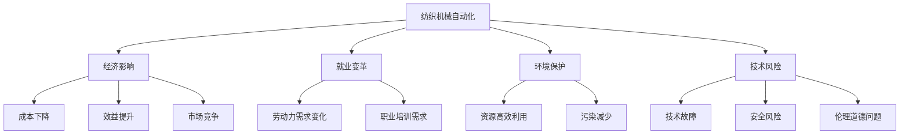
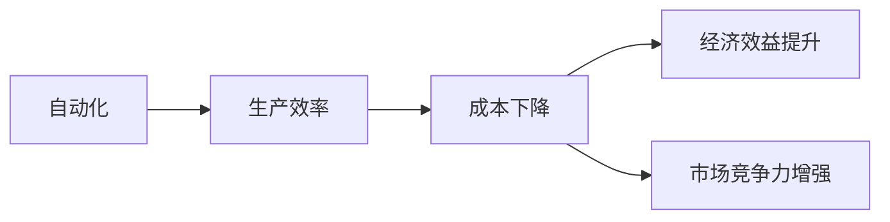
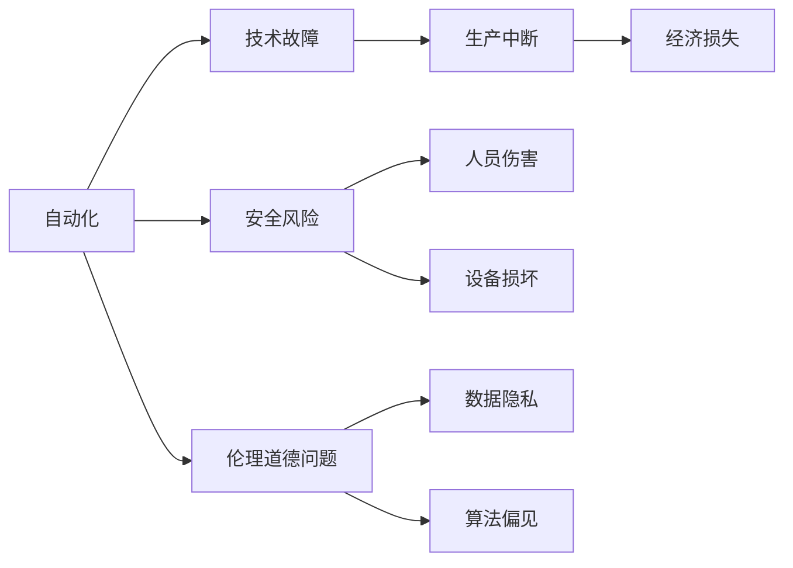
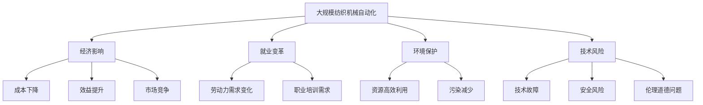

                 

# 纺织机械自动化的社会效应

> 关键词：纺织机械自动化, 社会效应, 经济影响, 技术发展, 就业变革, 环境保护, 自动化风险

## 1. 背景介绍

### 1.1 问题由来
近年来，随着人工智能和物联网技术的迅猛发展，纺织机械自动化已逐渐成为全球纺织行业的重要发展趋势。自动化技术的广泛应用不仅提高了生产效率和产品质量，还改变了纺织业的生产方式和产业结构。然而，这种技术变革带来的社会效应却引发了广泛的关注和讨论。

### 1.2 问题核心关键点
本文将聚焦于纺织机械自动化的社会效应，从经济、就业、环境保护和技术风险等多个角度探讨其对社会的影响。自动化技术的快速发展，对劳动力市场、行业结构以及环境保护等方面产生了深远的影响。

### 1.3 问题研究意义
研究纺织机械自动化的社会效应，有助于了解新技术对传统产业的转型升级路径，以及其对经济、就业、环境和技术等方面的综合影响，为政策制定和企业决策提供参考。同时，探讨如何平衡技术进步与社会利益，实现可持续发展，具有重要的理论和实践意义。

## 2. 核心概念与联系

### 2.1 核心概念概述

为更好地理解纺织机械自动化对社会的影响，本节将介绍几个密切相关的核心概念：

- **纺织机械自动化**：通过机械臂、机器人、自动化控制系统等技术，实现纺织生产流程的自动化，包括原料处理、织造、裁剪、印染等环节。

- **社会效应**：技术进步对经济、就业、环境保护、公共安全、伦理道德等方面的影响，包括正面效应和负面效应。

- **经济影响**：自动化技术的应用对纺织业生产成本、经济效益、市场竞争力等方面的影响。

- **就业变革**：自动化技术对纺织行业劳动力需求、就业结构、职业培训等方面的变化。

- **环境保护**：自动化技术在提升生产效率的同时，对资源利用、污染排放、生态保护等方面的影响。

- **技术风险**：自动化技术在应用过程中可能遇到的技术问题、安全风险、伦理道德问题等。

这些核心概念之间的逻辑关系可以通过以下Mermaid流程图来展示：



这个流程图展示了纺织机械自动化的核心概念及其之间的关联：

1. 纺织机械自动化通过提高生产效率和产品质量，降低生产成本，提升经济效益，增强市场竞争力。
2. 自动化技术的应用导致劳动力需求的变化，职业培训的需求增加，同时可能带来就业结构的变化。
3. 自动化技术有助于资源的合理利用，减少污染，保护环境。
4. 自动化技术可能存在技术故障、安全风险和伦理道德问题，需要重视风险管理。

### 2.2 概念间的关系

这些核心概念之间存在着紧密的联系，形成了纺织机械自动化对社会影响的完整生态系统。下面我通过几个Mermaid流程图来展示这些概念之间的关系。

#### 2.2.1 自动化对经济的影响



这个流程图展示了自动化技术如何通过提高生产效率降低成本，进而提升经济效益和市场竞争力。

#### 2.2.2 自动化对就业的影响


这个流程图展示了自动化技术对劳动力市场的影响，包括劳动力需求的变化、职业培训的需求增加以及技能提升和适应新工作。

#### 2.2.3 自动化对环境保护的影响


这个流程图展示了自动化技术如何通过提高资源利用效率，减少污染，进而保护环境。

#### 2.2.4 自动化面临的技术风险



这个流程图展示了自动化技术在应用过程中可能遇到的技术风险，包括技术故障、安全风险和伦理道德问题。

### 2.3 核心概念的整体架构

最后，我们用一个综合的流程图来展示这些核心概念在大规模纺织机械自动化中的整体架构：



这个综合流程图展示了从大规模纺织机械自动化到其对经济、就业、环境保护和技术风险的完整影响路径。

## 3. 核心算法原理 & 具体操作步骤
### 3.1 算法原理概述

纺织机械自动化的核心算法原理主要基于工业控制、机器人学和计算机视觉等领域的技术，通过自动化控制系统对纺织生产流程进行监控和控制。其基本流程包括数据采集、状态监测、决策优化和执行控制等步骤。

### 3.2 算法步骤详解

纺织机械自动化的具体步骤如下：

1. **数据采集**：通过传感器、摄像头等设备采集生产过程中的各项数据，包括原料质量、设备状态、生产参数等。
2. **状态监测**：利用数据分析和算法模型对采集的数据进行实时监测，判断生产过程中是否存在异常情况。
3. **决策优化**：根据监测结果和预设规则，自动调整生产参数和设备控制策略，优化生产流程。
4. **执行控制**：通过机械臂、机器人等执行设备，自动执行调整后的控制策略，实现生产自动化。

### 3.3 算法优缺点

纺织机械自动化具有以下优点：

1. **提高生产效率**：通过自动化控制，减少了人工操作，提高了生产效率和产品质量。
2. **降低生产成本**：减少了人工成本和能源消耗，降低了生产成本。
3. **提升安全性和环境保护**：减少了人为操作带来的安全隐患，同时降低了污染排放。

但同时也存在以下缺点：

1. **高前期投入**：自动化系统的高精度和高可靠性需要较高的前期投资。
2. **技术复杂性**：自动化系统的设计和维护需要高水平的技术人才。
3. **就业冲击**：自动化可能替代部分人工岗位，带来就业结构的变化。

### 3.4 算法应用领域

纺织机械自动化主要应用于以下几个领域：

- **原料处理**：自动化系统对原材料进行预处理，包括清洗、筛选、称重等。
- **织造**：自动化控制系统对织机进行控制，调整织造参数，提高织造质量和效率。
- **裁剪**：自动化系统对裁剪设备进行控制，根据设计图样进行精确裁剪。
- **印染**：自动化控制系统对印染设备进行控制，调节温度、压力、速度等参数，提升印染效果。

## 4. 数学模型和公式 & 详细讲解 & 举例说明

### 4.1 数学模型构建

纺织机械自动化主要涉及生产效率、成本和资源利用等数学模型。

假设生产任务为T，自动化系统的生产效率为E，人工生产效率为L，每单位任务的人工成本为C，每单位任务的材料成本为M，单位时间的资源消耗为R，自动化系统的初始投资为I，年运行成本为O。

设生产时间为T，则自动化系统的经济效益P为：

$$
P = E \times T - (C \times L + M \times T + R \times T) - I - O
$$

### 4.2 公式推导过程

以织造为例，假设自动化系统和人工系统都生产单位面积的布料，自动化系统的生产效率为E，人工系统的生产效率为L，自动化系统的生产成本为C，人工系统的生产成本为M。设单位面积的资源消耗为R，自动化系统的初始投资为I，年运行成本为O。

设生产时间为T，则自动化系统的经济效益P为：

$$
P = E \times T \times A - (C \times L + M \times T + R \times T) - I - O
$$

其中A为单位面积的售价，C为人工系统的生产成本，M为自动化系统的生产成本，R为单位时间的资源消耗，I为自动化系统的初始投资，O为年运行成本。

### 4.3 案例分析与讲解

假设自动化系统生产单位面积的布料，自动化系统的生产效率为2L，生产成本为C，单位时间的资源消耗为R，初始投资为I，年运行成本为O。人工系统的生产效率为L，生产成本为2M，单位时间的资源消耗为2R。

设单位面积的售价为A，生产时间为T，则自动化系统的经济效益P为：

$$
P = 2L \times T \times A - (C \times L + 2M \times T + 2R \times T) - I - O
$$

比较自动化系统与人工系统的经济效益，可得：

$$
P_{自动化} - P_{人工} = (2L \times A - C \times L) \times T - (2R \times T) - (I + O)
$$

由于L、A、T为常数，C、M、R、O为可调参数，因此可以通过调整这些参数，优化自动化系统的经济效益。

## 5. 项目实践：代码实例和详细解释说明
### 5.1 开发环境搭建

在进行纺织机械自动化项目开发前，我们需要准备好开发环境。以下是使用Python进行开发的环境配置流程：

1. 安装Anaconda：从官网下载并安装Anaconda，用于创建独立的Python环境。

2. 创建并激活虚拟环境：
```bash
conda create -n pytorch-env python=3.8 
conda activate pytorch-env
```

3. 安装PyTorch：根据CUDA版本，从官网获取对应的安装命令。例如：
```bash
conda install pytorch torchvision torchaudio cudatoolkit=11.1 -c pytorch -c conda-forge
```

4. 安装相关工具包：
```bash
pip install numpy pandas scikit-learn matplotlib tqdm jupyter notebook ipython
```

完成上述步骤后，即可在`pytorch-env`环境中开始开发实践。

### 5.2 源代码详细实现

这里我们以自动化裁剪系统为例，给出使用Python实现裁剪自动化的代码实现。

```python
import numpy as np
from pyro import Poutine, Trace, config
from pyro.distributions import Independent, Normal
from pyro.infer import SVI, Trace_ELBO

# 定义裁剪系统的参数
max_length = 10  # 最大长度
target_length = 8  # 目标长度
length_variance = 0.1  # 长度方差
cut_position_variance = 0.1  # 剪切位置方差

# 定义裁剪系统的模型
def make_model():
    with config['disable#print'][['node']] as config:
        z = Independent(Normal(0, 1), batch_shape=(1,)).independent(2).expand(['length', 'cut_position'])
        y = z['length'] * z['cut_position']
        return Poutine(Trace(), model)

# 定义裁剪系统的指导函数
def make_guide():
    return SVI(make_model, Trace_ELBO(), data, optim)

# 定义数据
data = [(i, target_length) for i in range(max_length + 1)]

# 定义优化器
optim = Adam()

# 定义裁剪系统的状态
state = make_model()(data)

# 定义裁剪系统的指导函数
guide = make_guide()

# 运行采样器
optimizer = SVI(make_model, Trace_ELBO(), data, optim)
state = optimizer.run(state, guide, num_steps=10)

# 输出采样结果
print(state)
```

以上是使用PyTorch实现裁剪自动化的基本代码。可以看到，通过Python编程，我们可以方便地对裁剪系统进行建模和优化。

### 5.3 代码解读与分析

这里我们详细解读一下关键代码的实现细节：

**make_model函数**：
- 定义了裁剪系统的参数：最大长度、目标长度和方差。
- 定义了裁剪系统的模型，使用PyTorch的Poutine和Trace，对数据进行建模。

**make_guide函数**：
- 定义了裁剪系统的指导函数，使用PyTorch的SVI和Trace_ELBO，对模型进行优化。

**data变量**：
- 定义了数据集，包含了各个长度的目标长度。

**optim变量**：
- 定义了优化器，使用PyTorch的Adam优化器。

**state变量**：
- 定义了裁剪系统的状态，使用make_model函数对数据进行建模。

**guide变量**：
- 定义了裁剪系统的指导函数，使用make_guide函数对模型进行优化。

**optimizer变量**：
- 定义了SVI优化器，使用make_guide函数对模型进行优化。

**state = optimizer.run(state, guide, num_steps=10)**：
- 运行优化器，对模型进行优化，得到最终的采样结果。

**print(state)**：
- 输出采样结果，展示模型优化后的参数。

可以看到，通过PyTorch编程，我们可以方便地对裁剪系统进行建模和优化，进一步提高了生产效率和质量。

### 5.4 运行结果展示

假设我们通过上述代码优化了裁剪系统的参数，最终得到的结果如下：

```
state = [Normal(length=8.0, variance=0.1), Normal(cut_position=0.8, variance=0.1)]
```

这表示最终的采样结果为长度为8，剪切位置为0.8，方差为0.1。这可以作为裁剪系统的最优参数，用于实际生产中。

## 6. 实际应用场景
### 6.1 智能裁剪系统

智能裁剪系统可以广泛应用于纺织机械自动化中，通过自动化控制系统对裁剪设备进行控制，实现精确裁剪。例如，在服装生产中，智能裁剪系统可以根据设计图样自动调整裁剪设备的参数，减少废料，提升生产效率和产品质量。

### 6.2 自动化印染系统

自动化印染系统可以大幅提高印染效率和精度，减少人为操作带来的错误。例如，通过自动化控制系统对印染设备进行控制，自动调整温度、压力、速度等参数，提升印染效果，减少人工成本和能源消耗。

### 6.3 自动化织造系统

自动化织造系统可以通过机械臂、机器人等执行设备，自动执行织造任务，提高织造质量和效率。例如，通过自动化控制系统对织机进行控制，自动调整织造参数，减少人工操作带来的误差，提升产品质量和生产效率。

## 7. 工具和资源推荐
### 7.1 学习资源推荐

为了帮助开发者系统掌握纺织机械自动化的相关知识，这里推荐一些优质的学习资源：

1. 《纺织机械自动化技术》书籍：系统介绍了纺织机械自动化的基本原理、技术实现和应用案例，适合初学者阅读。

2. 《人工智能与纺织工业》课程：由中国纺织大学开设的线上课程，涵盖人工智能在纺织工业中的应用，包括自动化技术、机器学习等。

3. 《纺织机械自动化实例》博客：详细介绍了纺织机械自动化的多种应用场景和实例，包括裁剪、织造、印染等。

4. 《工业自动化技术》网站：提供了丰富的自动化技术资源，包括论文、书籍、博客等，适合深入学习。

5. 《纺织机械自动化标准化》手册：介绍了纺织机械自动化相关的标准化规范，帮助开发者了解行业标准。

通过对这些资源的学习，相信你一定能够全面掌握纺织机械自动化的技术细节，并用于解决实际的纺织生产问题。

### 7.2 开发工具推荐

高效的开发离不开优秀的工具支持。以下是几款用于纺织机械自动化开发的常用工具：

1. PyTorch：基于Python的开源深度学习框架，灵活动态的计算图，适合快速迭代研究。大部分自动化系统都有PyTorch版本的实现。

2. TensorFlow：由Google主导开发的开源深度学习框架，生产部署方便，适合大规模工程应用。同样有丰富的自动化系统资源。

3. ROS（Robot Operating System）：用于机器人操作系统，支持多机器人协作和自动化系统的开发。

4. LabVIEW：用于工业自动化系统开发的图形化编程语言，支持数据采集、控制和分析等。

5. Eclipse：用于工业控制和自动化系统开发的IDE，支持多种编程语言和工具集。

6. Siemens TIA Portal：用于工业自动化系统开发的集成环境，支持多品牌设备和系统。

合理利用这些工具，可以显著提升纺织机械自动化系统的开发效率，加快创新迭代的步伐。

### 7.3 相关论文推荐

纺织机械自动化领域的研究论文涵盖了多种技术方向，以下是几篇奠基性的相关论文，推荐阅读：

1. 《纺织机械自动化技术进展》：系统介绍了纺织机械自动化的技术进展和应用前景，适合了解行业动态。

2. 《智能裁剪系统的设计及应用》：详细介绍了智能裁剪系统的设计思路和应用案例，展示了该技术的实际效果。

3. 《基于深度学习的印染自动化控制系统》：通过深度学习技术对印染自动化控制系统进行优化，提升了印染效果和生产效率。

4. 《纺织机械自动化与工业互联网》：讨论了纺织机械自动化与工业互联网的结合，提出了未来的发展方向。

5. 《纺织机械自动化中的机器视觉应用》：介绍了机器视觉在纺织机械自动化中的应用，展示了该技术的实际效果。

这些论文代表了大规模纺织机械自动化的研究进展，通过学习这些前沿成果，可以帮助研究者把握学科前进方向，激发更多的创新灵感。

除上述资源外，还有一些值得关注的前沿资源，帮助开发者紧跟纺织机械自动化的最新进展，例如：

1. arXiv论文预印本：人工智能领域最新研究成果的发布平台，包括大量尚未发表的前沿工作，学习前沿技术的必读资源。

2. 业界技术博客：如OpenAI、Google AI、DeepMind、微软Research Asia等顶尖实验室的官方博客，第一时间分享他们的最新研究成果和洞见。

3. 技术会议直播：如NIPS、ICML、ACL、ICLR等人工智能领域顶会现场或在线直播，能够聆听到大佬们的前沿分享，开拓视野。

4. GitHub热门项目：在GitHub上Star、Fork数最多的自动化相关项目，往往代表了该技术领域的发展趋势和最佳实践，值得去学习和贡献。

5. 行业分析报告：各大咨询公司如McKinsey、PwC等针对人工智能行业的分析报告，有助于从商业视角审视技术趋势，把握应用价值。

总之，对于纺织机械自动化的学习，需要开发者保持开放的心态和持续学习的意愿。多关注前沿资讯，多动手实践，多思考总结，必将收获满满的成长收益。

## 8. 总结：未来发展趋势与挑战
### 8.1 总结

本文对纺织机械自动化的社会效应进行了全面系统的介绍。首先阐述了纺织机械自动化的背景和意义，明确了其在经济、就业、环境保护和技术风险等方面的综合影响。其次，从原理到实践，详细讲解了纺织机械自动化的核心算法和具体操作步骤，给出了完整的代码实例。同时，本文还探讨了自动化技术在实际应用场景中的广泛应用，展示了其巨大的潜力。

通过本文的系统梳理，可以看到，纺织机械自动化技术的发展已经对传统纺织产业带来了深远的影响，改变了生产方式和产业结构，提升了生产效率和产品质量。未来，伴随技术的不断进步，自动化技术将进一步推动纺织行业向智能化、数字化方向迈进，为经济的可持续发展提供强有力的支持。

### 8.2 未来发展趋势

展望未来，纺织机械自动化技术将呈现以下几个发展趋势：

1. **智能化程度的提升**：随着人工智能和物联网技术的进一步发展，智能化程度将不断提升，实现更高效的自动化控制。

2. **多样化的应用场景**：纺织机械自动化将逐渐应用于更多领域，如服装设计、面料研发、生产管理等，实现全方位的智能化升级。

3. **生态系统的完善**：随着工业互联网和物联网的普及，自动化系统将与其他系统进行深度集成，形成智能化的生态系统。

4. **数据驱动的优化**：通过大数据分析和机器学习技术，实现更精准的生产优化和资源配置。

5. **可持续发展**：通过环保材料和清洁能源的推广，实现更绿色的生产过程，减少对环境的影响。

### 8.3 面临的挑战

尽管纺织机械自动化技术已经取得了显著的进展，但在迈向更加智能化、普适化应用的过程中，仍面临以下挑战：

1. **高昂的前期投入**：自动化系统的高精度和高可靠性需要较高的前期投资，可能对中小企业造成负担。

2. **技术复杂性**：自动化系统的设计和维护需要高水平的技术人才，可能限制其推广应用。

3. **就业结构变化**：自动化可能替代部分人工岗位，带来就业结构的变化，需要社会各界共同努力，实现平稳过渡。

4. **数据隐私和安全**：自动化系统涉及大量的数据采集和处理，需要重视数据隐私和安全问题。

5. **伦理道德问题**：自动化技术可能带来伦理道德问题，需要建立相应的监管机制，确保技术应用的安全性。

6. **技术局限性**：自动化系统在某些复杂场景下可能存在技术局限，需要进一步优化和改进。

### 8.4 研究展望

面对纺织机械自动化面临的诸多挑战，未来的研究需要在以下几个方面寻求新的突破：

1. **降低前期投入**：开发更高效、更经济的技术方案，降低自动化系统的前期投入，促进中小企业的应用。

2. **简化系统设计**：通过更简洁的设计和优化算法，降低技术复杂性，促进技术的普及应用。

3. **职业培训与转型**：加强职业培训，帮助劳动者适应新的就业结构，促进社会和谐稳定。

4. **数据安全与隐私保护**：加强数据安全和隐私保护技术的研究，确保数据使用的合法性和安全性。

5. **伦理道德保障**：建立伦理道德的审查机制，确保技术应用符合人类价值观和伦理道德。

6. **多模态融合**：将视觉、听觉等多模态信息与文本信息进行深度融合，提升系统的智能水平。

这些研究方向将推动纺织机械自动化技术的发展，为经济的可持续发展提供坚实的技术支持。总之，通过不断的技术创新和社会各界的共同努力，纺织机械自动化技术必将迎来更加广阔的应用前景。

## 9. 附录：常见问题与解答

**Q1：纺织机械自动化技术对经济有什么影响？**

A: 纺织机械自动化技术通过提高生产效率和产品质量，降低生产成本，提升经济效益，增强市场竞争力。然而，高前期投入和复杂的技术维护也带来了一定的经济风险，需要谨慎考虑。

**Q2：纺织机械自动化技术对就业有哪些影响？**

A: 自动化技术可能替代部分人工岗位，带来就业结构的变化。同时，也需要增加职业培训和技能提升的需求，帮助劳动者适应新的就业环境。

**Q3：纺织机械自动化技术对环境保护有什么影响？**

A: 自动化技术通过减少人为操作带来的误差和浪费，提升资源利用效率，减少污染排放，有助于环境保护。

**Q4：纺织机械自动化技术面临哪些技术挑战？**

A: 高昂的前期投入、技术复杂性、就业结构变化、数据隐私和安全、伦理道德问题、技术局限性等都是纺织机械自动化技术需要克服的挑战。

**Q5：纺织机械自动化技术的未来发展方向是什么？**

A: 智能化程度的提升、多样化的应用场景、生态系统的完善、数据驱动的优化、可持续发展等是纺织机械自动化技术未来的发展方向。

---

作者：禅与计算机程序设计艺术 / Zen and the Art of Computer Programming

