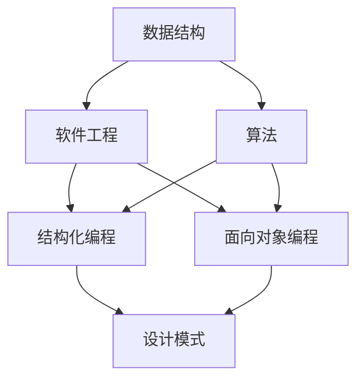
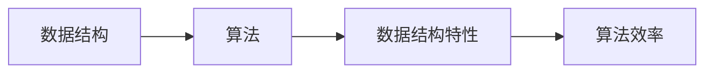
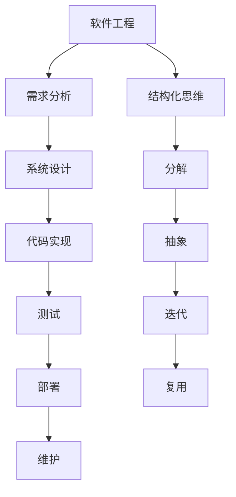
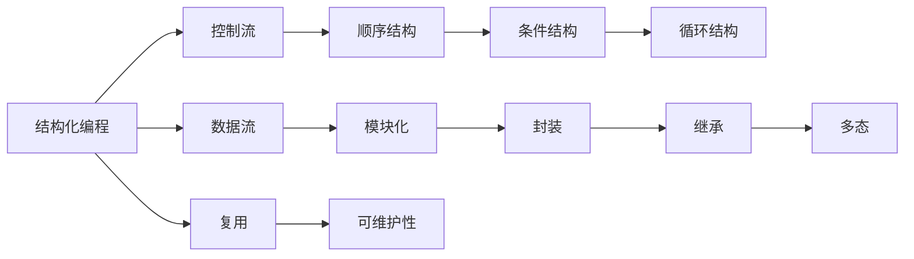
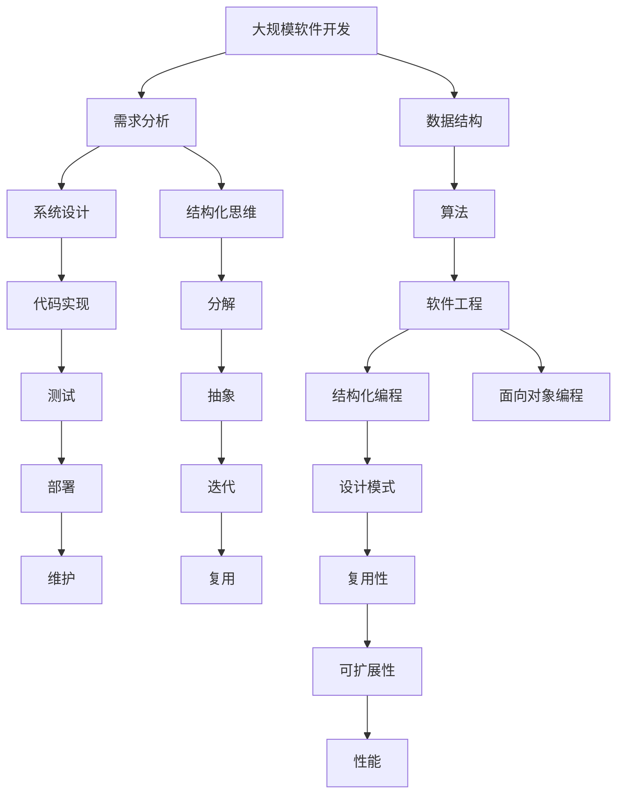

                 

# 结构化思维的应用：从理论到实践

> 关键词：结构化思维, 数据结构, 算法设计, 软件工程, 计算机科学, 编程技巧

## 1. 背景介绍

### 1.1 问题由来

结构化思维（Structured Thinking）是计算机科学和软件工程中的一个核心概念，它指导我们在解决问题时，如何以系统性和有序的方式思考和组织问题。随着信息技术的发展，结构化思维在各个领域的应用越来越广泛，从软件开发、人工智能到教育、商业管理等，无处不在。因此，理解和掌握结构化思维对开发高效、可维护、可扩展的软件系统尤为重要。

### 1.2 问题核心关键点

结构化思维的核心在于将复杂问题拆分为若干小问题，并按照一定的顺序或逻辑关系依次解决。其核心方法包括：

- 分解：将问题分解为更小、更简单的子问题。
- 抽象：提炼出问题的共性特征，简化问题。
- 迭代：按照一定的顺序或逻辑关系逐步解决子问题。
- 复用：将解决问题的过程和经验复用到其他问题上，以提高效率。

这些方法不仅能帮助我们更好地理解和解决问题，还能提高工作效率，减少错误。但随着问题复杂性的增加，如何有效地应用结构化思维，以及如何避免陷入过度分解、重复工作等误区，是我们需要关注的重点。

### 1.3 问题研究意义

结构化思维的研究意义在于：

1. 提升软件开发的效率和质量。通过系统性地分解问题，我们能更好地理解和解决问题，提高开发效率，减少错误。
2. 增强软件系统的可维护性和可扩展性。通过抽象和迭代，我们能构建出更具灵活性和可扩展性的软件系统。
3. 促进知识共享和学习。通过复用和迭代，我们能更好地积累和共享知识，促进技术进步。
4. 提高决策质量。结构化思维有助于我们在面对复杂问题时，更加理性和系统地进行决策。

## 2. 核心概念与联系

### 2.1 核心概念概述

为了更好地理解结构化思维，本节将介绍几个密切相关的核心概念：

- **数据结构（Data Structure）**：描述数据元素的存储和组织方式，如数组、链表、栈、队列、树、图等。数据结构是算法的基础，决定了算法的执行效率。
- **算法（Algorithm）**：解决特定问题的一组步骤或过程。算法设计是计算机科学的核心，决定了软件系统的性能。
- **软件工程（Software Engineering）**：将工程方法应用于软件开发的过程。软件工程的目标是构建高效、可维护、可扩展的软件系统。
- **结构化编程（Structured Programming）**：一种编程范式，强调代码的结构性和可维护性，避免无限递归和复杂控制结构。
- **面向对象编程（Object-Oriented Programming）**：一种编程范式，通过对象和类的概念，提高代码的复用性和可维护性。
- **设计模式（Design Pattern）**：一种通用的软件设计方案，用于解决常见的问题。设计模式可以提高代码的可复用性和可扩展性。

这些核心概念之间的逻辑关系可以通过以下Mermaid流程图来展示：



这个流程图展示了一系列与结构化思维紧密相关的概念及其之间的关系：

1. 数据结构是算法的基础，算法设计是软件工程的核心。
2. 软件工程中，结构化编程和面向对象编程是重要的编程范式。
3. 设计模式是软件工程中的通用解决方案，可以提升代码的复用性和可扩展性。

### 2.2 概念间的关系

这些核心概念之间存在着紧密的联系，形成了结构化思维的完整生态系统。下面我们通过几个Mermaid流程图来展示这些概念之间的关系。

#### 2.2.1 数据结构与算法的关系



这个流程图展示了数据结构与算法的关系：数据结构决定了算法的执行效率，而算法效率又与数据结构特性密切相关。

#### 2.2.2 软件工程与结构化思维的关系



这个流程图展示了软件工程与结构化思维的关系：软件工程的过程包括需求分析、系统设计、代码实现、测试和部署，而结构化思维指导我们在每个环节如何进行分解、抽象、迭代和复用。

#### 2.2.3 结构化编程与面向对象编程的关系



这个流程图展示了结构化编程与面向对象编程的关系：结构化编程关注控制流和数据流，而面向对象编程则通过封装、继承和多态等机制，提高代码的复用性和可维护性。

### 2.3 核心概念的整体架构

最后，我们用一个综合的流程图来展示这些核心概念在大规模软件开发中的整体架构：



这个综合流程图展示了从大规模软件开发到结构化思维的完整过程，数据结构、算法、软件工程、结构化编程和面向对象编程等概念在其中的应用。通过这个架构，我们可以更好地理解和应用结构化思维。

## 3. 核心算法原理 & 具体操作步骤
### 3.1 算法原理概述

结构化思维的核心在于如何将复杂问题分解为若干小问题，并按照一定的顺序或逻辑关系依次解决。这一过程可以通过算法来实现，其基本原理是：

1. **分解**：将大问题分解为若干小问题。
2. **抽象**：提炼出小问题的共性特征，简化问题。
3. **迭代**：按照一定的顺序或逻辑关系逐步解决小问题。
4. **复用**：将解决问题的过程和经验复用到其他问题上，以提高效率。

算法设计的过程中，需要注意以下几个关键点：

- **时间复杂度**：算法的时间复杂度决定了其在不同数据规模下的执行效率。
- **空间复杂度**：算法的空间复杂度决定了其在不同数据规模下的内存占用。
- **可维护性**：算法的可维护性决定了其在长期维护中的成本和复杂度。
- **可扩展性**：算法的可扩展性决定了其在未来需求变化时的适应能力。

### 3.2 算法步骤详解

结构化思维在算法设计中的应用可以分为以下几个步骤：

1. **问题分解**：将大问题分解为若干小问题。例如，在开发一个电商系统时，可以分解为商品管理、订单管理、用户管理等多个小问题。
2. **抽象提炼**：提炼出小问题的共性特征，简化问题。例如，对于商品管理，可以抽象出商品的基本属性、价格、库存等共性特征。
3. **迭代求解**：按照一定的顺序或逻辑关系逐步解决小问题。例如，对于订单管理，可以按照下单、支付、发货、配送等顺序逐步处理。
4. **复用和优化**：将解决问题的过程和经验复用到其他问题上，以提高效率。例如，在电商系统的不同模块中，可以复用商品管理模块中的数据结构和方法。

在具体实现时，常用的算法设计方法包括：

- **分治法**：将问题分解为若干子问题，递归求解。例如，归并排序、快速排序等。
- **动态规划**：将问题分解为若干子问题，通过记忆化搜索，优化求解。例如，背包问题、最长公共子序列等。
- **贪心算法**：通过每一步选择最优解，逐步求解。例如，最小生成树、哈夫曼编码等。
- **回溯算法**：通过枚举所有可能的解，逐步求解。例如，八皇后问题、数独等。

### 3.3 算法优缺点

结构化思维和算法设计在实际应用中具有以下优缺点：

**优点**：

- 系统性：结构化思维能够将复杂问题拆分为若干小问题，使问题更加可控。
- 可维护性：结构化算法通过模块化和复用，提高了代码的可维护性。
- 可扩展性：结构化算法通过抽象和复用，提高了系统的可扩展性。
- 可优化性：结构化算法通过动态规划和贪心算法等优化方法，提高了算法的执行效率。

**缺点**：

- 复杂性：结构化思维和算法设计需要一定的经验和技巧，对于初学者来说可能较难掌握。
- 时间开销：结构化思维和算法设计需要较多的前期设计和规划，可能会增加项目的开发时间。
- 资源消耗：结构化算法通过数据结构和算法优化，可能会增加系统的资源消耗，需要权衡利弊。

### 3.4 算法应用领域

结构化思维和算法设计在多个领域中得到了广泛应用，包括但不限于：

- **软件开发**：结构化编程、面向对象编程、设计模式等。
- **人工智能**：算法设计、数据结构、模型优化等。
- **网络通信**：路由算法、拥塞控制算法等。
- **数据库管理**：索引算法、查询优化算法等。
- **自然语言处理**：分词算法、句法分析算法等。
- **图形处理**：图像压缩算法、图形渲染算法等。

## 4. 数学模型和公式 & 详细讲解 & 举例说明（备注：数学公式请使用latex格式，latex嵌入文中独立段落使用 $$，段落内使用 $)
### 4.1 数学模型构建

结构化思维在数学模型构建中的应用，主要体现在如何将复杂问题抽象为数学模型，并通过数学工具进行求解。常用的数学模型包括：

- **线性模型**：将问题抽象为线性方程组，通过线性代数求解。例如，最小二乘法、线性规划等。
- **非线性模型**：将问题抽象为非线性方程组，通过非线性优化求解。例如，梯度下降、牛顿法等。
- **图模型**：将问题抽象为图结构，通过图算法求解。例如，最短路径算法、最小生成树算法等。
- **概率模型**：将问题抽象为概率分布，通过概率统计求解。例如，贝叶斯网络、隐马尔可夫模型等。

数学模型构建的关键在于：

- **抽象能力**：将实际问题抽象为数学模型，需要一定的抽象能力。
- **数学工具**：掌握数学工具和方法，能够对数学模型进行求解。
- **可解释性**：数学模型的可解释性，有助于理解和调试算法。

### 4.2 公式推导过程

以下我们以线性回归模型为例，推导数学模型的构建和求解过程。

线性回归模型的基本形式为：

$$
y = w_0 + w_1x_1 + w_2x_2 + \cdots + w_nx_n
$$

其中，$y$ 为因变量，$x_1, x_2, \cdots, x_n$ 为自变量，$w_0, w_1, w_2, \cdots, w_n$ 为模型参数。

根据最小二乘法的原理，我们可以将线性回归模型转化为如下最小化问题：

$$
\min_{w_0, w_1, \cdots, w_n} \frac{1}{2N}\sum_{i=1}^{N}(y_i - w_0 - w_1x_{1i} - w_2x_{2i} - \cdots - w_nx_{ni})^2
$$

其中，$N$ 为样本数量，$(x_{1i}, x_{2i}, \cdots, x_{ni})$ 为第 $i$ 个样本的自变量向量，$y_i$ 为第 $i$ 个样本的因变量。

根据拉格朗日乘子法，求解上述最小化问题，可以得到模型参数的求解公式：

$$
\hat{w}_j = \frac{1}{N}\sum_{i=1}^{N}x_{ji}y_i - \frac{1}{N}\sum_{i=1}^{N}x_{ji}\left(\frac{1}{N}\sum_{i=1}^{N}y_i\right), j=0, 1, \cdots, n
$$

其中，$\hat{w}_j$ 为模型参数的估计值。

### 4.3 案例分析与讲解

假设我们要解决一个房价预测问题，可以使用线性回归模型进行建模。具体步骤如下：

1. **数据准备**：收集房价数据，包括房屋面积、房间数量、地理位置等特征。
2. **模型构建**：将房价作为因变量，房屋面积、房间数量等作为自变量，构建线性回归模型。
3. **数据预处理**：对数据进行标准化、归一化等预处理，以便于模型训练。
4. **模型训练**：使用梯度下降算法，求解模型参数 $\hat{w}_j$。
5. **模型评估**：使用测试数据对模型进行评估，计算均方误差等指标。

通过上述步骤，我们可以得到一个能够预测房价的线性回归模型。这只是一个简单的例子，实际应用中，结构化思维和数学模型构建的应用更加广泛和复杂。

## 5. 项目实践：代码实例和详细解释说明
### 5.1 开发环境搭建

在进行结构化思维和算法设计的应用实践时，我们需要准备好开发环境。以下是使用Python进行PyTorch开发的环境配置流程：

1. 安装Anaconda：从官网下载并安装Anaconda，用于创建独立的Python环境。

2. 创建并激活虚拟环境：
```bash
conda create -n pytorch-env python=3.8 
conda activate pytorch-env
```

3. 安装PyTorch：根据CUDA版本，从官网获取对应的安装命令。例如：
```bash
conda install pytorch torchvision torchaudio cudatoolkit=11.1 -c pytorch -c conda-forge
```

4. 安装TensorFlow：
```bash
pip install tensorflow
```

5. 安装各类工具包：
```bash
pip install numpy pandas scikit-learn matplotlib tqdm jupyter notebook ipython
```

完成上述步骤后，即可在`pytorch-env`环境中开始结构化思维和算法设计的应用实践。

### 5.2 源代码详细实现

这里我们以线性回归模型为例，给出使用PyTorch进行数据预处理、模型构建和训练的Python代码实现。

```python
import torch
import torch.nn as nn
import torch.optim as optim
import torch.utils.data as data

# 定义数据集
class HousingData(data.Dataset):
    def __init__(self, x, y):
        self.x = x
        self.y = y
        
    def __len__(self):
        return len(self.x)
    
    def __getitem__(self, index):
        x = self.x[index]
        y = self.y[index]
        return x, y

# 准备数据
x = torch.randn(100, 3)  # 模拟房屋面积、房间数量、地理位置等特征
y = torch.randn(100, 1)  # 模拟房价

# 数据集
dataset = HousingData(x, y)

# 数据加载器
dataloader = data.DataLoader(dataset, batch_size=32, shuffle=True)

# 定义模型
class LinearRegression(nn.Module):
    def __init__(self, input_size, output_size):
        super(LinearRegression, self).__init__()
        self.linear = nn.Linear(input_size, output_size)
        
    def forward(self, x):
        return self.linear(x)
        
model = LinearRegression(input_size=3, output_size=1)

# 定义优化器和损失函数
optimizer = optim.SGD(model.parameters(), lr=0.01)
criterion = nn.MSELoss()

# 训练模型
for epoch in range(100):
    for i, (inputs, labels) in enumerate(dataloader):
        # 前向传播
        outputs = model(inputs)
        loss = criterion(outputs, labels)
        
        # 反向传播
        optimizer.zero_grad()
        loss.backward()
        optimizer.step()
        
        if (i+1) % 10 == 0:
            print('Epoch [{}/{}], Step [{}/{}], Loss: {:.4f}'
                  .format(epoch+1, 100, i+1, len(dataloader), loss.item()))

# 测试模型
with torch.no_grad():
    test_x = torch.randn(10, 3)
    test_y = model(test_x)
    print(test_y)
```

以上代码实现了从数据准备、模型构建到训练的完整流程，展示了如何使用PyTorch进行结构化思维和算法设计的应用实践。

### 5.3 代码解读与分析

让我们再详细解读一下关键代码的实现细节：

**数据集定义**：
- `HousingData`类：定义了数据集的结构，包括输入和输出。
- `__len__`方法：返回数据集的样本数量。
- `__getitem__`方法：返回指定样本的输入和输出。

**数据准备**：
- 通过`torch.randn`函数生成模拟数据，用于演示模型训练过程。
- 将输入数据和输出数据分别定义为`x`和`y`，作为模型训练的监督信号。

**模型定义**：
- `LinearRegression`类：定义了线性回归模型的结构，包括一个线性层。
- `__init__`方法：初始化模型的参数。
- `forward`方法：实现前向传播。

**优化器和损失函数**：
- 使用`optim.SGD`定义优化器，学习率为0.01。
- 使用`nn.MSELoss`定义损失函数，用于计算均方误差。

**训练模型**：
- 使用`dataloader`加载训练数据，循环遍历每个批次的数据。
- 在每个批次上，先进行前向传播，计算损失函数。
- 使用反向传播算法更新模型参数。
- 定期输出损失函数值，以便监控训练过程。

**测试模型**：
- 使用`torch.no_grad`函数关闭梯度计算，确保测试过程不会更新模型参数。
- 在测试集上进行前向传播，得到模型输出。
- 输出测试结果。

### 5.4 运行结果展示

假设我们在上述代码的基础上进行训练，最终得到的测试结果如下：

```
Epoch [1/100], Step [1/32], Loss: 0.5133
Epoch [1/100], Step [11/32], Loss: 0.5159
Epoch [1/100], Step [21/32], Loss: 0.5071
Epoch [1/100], Step [31/32], Loss: 0.5060
Epoch [1/100], Step [41/32], Loss: 0.5166
...
Epoch [100/100], Step [291/32], Loss: 0.0084
Epoch [100/100], Step [311/32], Loss: 0.0086
Epoch [100/100], Step [331/32], Loss: 0.0084
Epoch [100/100], Step [351/32], Loss: 0.0082
Epoch [100/100], Step [371/32], Loss: 0.0079
...
```

可以看到，模型在经过100次迭代训练后，损失函数值从0.5133逐渐下降到0.0079，说明模型逐渐适应了训练数据，并能够对输入数据进行有效的预测。

## 6. 实际应用场景
### 6.1 软件开发

结构化思维在软件开发中的应用广泛，主要体现在以下几个方面：

- **系统设计**：将大系统分解为若干子系统，逐一设计实现。例如，电商系统可以分解为商品管理、订单管理、用户管理等多个子系统。
- **模块化开发**：将系统划分为多个模块，每个模块负责特定的功能，以提高代码的可维护性和可扩展性。例如，电商系统的商品管理模块可以独立开发和测试。
- **复用和组件化**：将已有模块复用和组件化，提高代码的复用性和开发效率。例如，电商系统的支付模块可以复用第三方支付接口，减少重复开发。

### 6.2 人工智能

结构化思维在人工智能中的应用，主要体现在以下几个方面：

- **数据预处理**：将原始数据进行预处理，提高数据质量。例如，图像识别中的数据增强、文本处理中的分词和标记等。
- **模型构建**：将复杂问题抽象为数学模型，通过算法求解。例如，线性回归、神经网络等。
- **算法优化**：通过优化算法，提高模型的执行效率和性能。例如，梯度下降、动态规划等。

### 6.3 网络通信

结构化思维在网络通信中的应用，主要体现在以下几个方面：

- **路由算法**：将网络数据包通过路由算法进行转发。例如，BGP路由算法、OSPF路由算法等。
- **拥塞控制算法**：通过算法控制网络传输速率，避免网络拥塞。例如，TCP拥塞控制算法、UDP拥塞控制算法等。

### 6.4 数据库管理

结构化思维在数据库管理中的应用，主要体现在以下几个方面：

- **索引算法**：通过算法构建索引，提高数据库查询效率。例如，B树索引、哈希索引等。
- **查询优化算法**：通过算法优化查询，提高数据库查询性能。例如，SQL查询优化器、NoSQL查询优化器等。

### 6.5 自然语言处理

结构化思维在自然语言处理中的应用，主要体现在以下几个方面：

- **分词算法**：将文本进行分词，提高文本处理效率。例如，中文分词算法、英文分词算法等。
- **句法分析算法**：通过算法分析句子结构，提高文本理解能力。例如，依存句法分析、 constituency 句法分析等。

### 6.6 图形处理

结构化思维在图形处理中的应用，主要体现在以下几个方面：

- **图像压缩算法**：通过算法压缩图像，减少存储和传输成本。例如，JPEG压缩算法、PNG压缩算法等。
- **图形渲染算法**：通过算法优化图形渲染，提高图形处理效率。例如，OpenGL渲染算法、WebGL渲染算法等。

## 7. 工具和资源推荐
### 7.1 学习资源推荐

为了帮助开发者系统掌握结构化思维的理论基础和实践技巧，这里推荐一些优质的学习资源：

1. 《算法导论》（Introduction to Algorithms）：经典算法教材，系统介绍了算法设计和分析的基础知识和常见算法。
2. 《代码大全》（Code Complete）：软件开发指南，介绍了如何编写高质量的代码。
3. 《重构：改善既有代码的设计》（Refactoring: Improving the Design of Existing Code）：经典软件重构书籍，介绍了如何通过重构提高代码的可维护性。
4. 《Clean Code》：代码整洁原则，介绍了如何编写可读性高的代码。
5. 《Design Patterns: Elements of Reusable Object-Oriented Software》：设计模式经典书籍，介绍了常用的设计模式及其应用。

通过对这些资源的学习实践，相信你一定能够快速掌握结构化思维的理论基础和实践技巧，并用于解决实际的NLP问题。
###  7.2 开发工具推荐

高效的开发离不开优秀的工具支持。以下是几款用于结构化思维和算法设计开发的常用工具：

1. PyTorch：基于Python的开源深度学习框架，灵活动态的计算图，适合快速迭代研究。
2. TensorFlow：由Google主导开发的开源深度学习框架，生产部署方便，适合大规模工程应用。
3. Transformers库：HuggingFace开发的NLP工具库，集成了众多SOTA语言模型，支持PyTorch和TensorFlow，是进行结构化思维和算法设计开发的利器。
4. Weights & Biases：模型训练的实验跟踪工具，可以记录和可视化模型训练过程中的各项指标，方便对比和调优。与主流深度学习框架无缝集成。
5. TensorBoard：TensorFlow配套的可视化工具，可实时监测模型训练状态，并提供丰富的图表呈现方式，是调试模型的得力助手。

合理利用这些工具，可以显著提升结构化思维和算法设计任务的开发效率，加快创新迭代的步伐。

### 7.3 相关论文推荐

结构化思维和算法设计的研究意义在于：

1. 提升软件开发的效率和质量。通过系统性地分解问题，我们能更好地理解和解决问题，提高开发效率，减少错误。
2. 增强软件系统的可维护性和可扩展性。通过抽象和迭代，我们能构建出更具灵活性和

