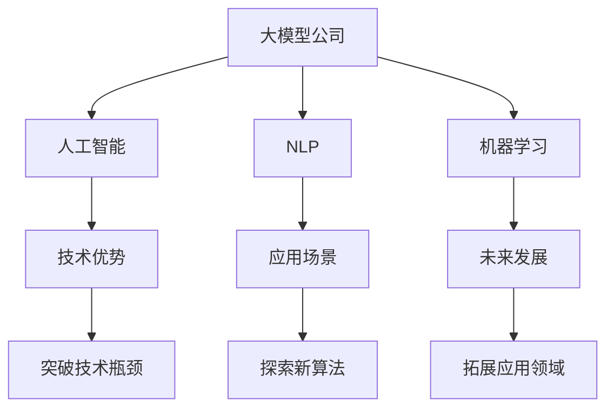

                 

# 美国大模型公司的现状与未来

> 关键词：大模型公司, 人工智能, 自然语言处理, 机器学习, 应用场景, 技术优势, 未来发展

## 1. 背景介绍

随着人工智能技术的快速发展，大模型公司成为了科技领域的新宠。这些公司通过技术创新和应用实践，推动了人工智能的普及和落地。本文将深入探讨美国大模型公司的现状与未来，揭示其技术优势和应用场景，以及面临的挑战和前景。

## 2. 核心概念与联系

### 2.1 核心概念概述

- **大模型公司**：指专注于开发和应用大规模人工智能模型的科技公司，如OpenAI、Google、Microsoft等。
- **人工智能**：通过模拟人类智能行为，实现机器对环境的感知、理解和行动的技术。
- **自然语言处理（NLP）**：人工智能在文本处理、语音识别、机器翻译等方面的应用。
- **机器学习**：通过数据训练模型，使模型具备自主学习和预测能力的技术。
- **应用场景**：包括智能客服、医疗诊断、金融分析、自动驾驶等众多领域。
- **技术优势**：如大规模数据处理能力、深度学习算法优化、高效的计算资源等。
- **未来发展**：探索新算法、突破技术瓶颈、拓展应用领域等。

### 2.2 概念间的关系

这些核心概念间的关系通过以下Mermaid流程图进行展示：



该流程图展示了大模型公司与人工智能、NLP、机器学习、应用场景、技术优势及未来发展之间的紧密联系。通过优化这些方面，大模型公司将持续推动人工智能技术的发展。

## 3. 核心算法原理 & 具体操作步骤

### 3.1 算法原理概述

大模型公司的核心算法原理主要是基于深度学习和大规模数据训练的模型。以OpenAI的GPT模型为例，其算法原理基于自回归模型，通过大量无标签文本数据进行预训练，然后再在特定任务上通过微调优化模型。

### 3.2 算法步骤详解

大模型公司的算法步骤一般包括以下几个关键步骤：

**Step 1: 数据预处理**
- 收集大规模无标签文本数据进行预训练。
- 清洗和分词，准备模型输入。

**Step 2: 模型构建与预训练**
- 选择适当的深度学习模型架构，如Transformer。
- 使用预训练任务，如语言模型预测下一个单词，进行模型训练。
- 预训练过程中使用大规模并行计算资源，提升训练效率。

**Step 3: 任务微调**
- 针对特定任务收集少量标注数据，构建任务适配层。
- 设置合适的学习率和优化器，使用小批量梯度下降进行微调。
- 在验证集上进行监控，及时调整模型参数和超参数。

**Step 4: 模型评估与部署**
- 在测试集上评估微调后的模型性能。
- 将模型部署到生产环境中，进行实际应用。
- 定期更新模型，确保其适应数据分布的变化。

### 3.3 算法优缺点

**优点**：
- 可以处理大规模数据，提取深度特征。
- 通过微调可以快速适应新任务。
- 应用场景广泛，涵盖各行各业。

**缺点**：
- 需要大量计算资源和数据。
- 模型复杂，训练和推理速度较慢。
- 模型输出缺乏可解释性。

### 3.4 算法应用领域

大模型公司的算法广泛应用于自然语言处理、计算机视觉、语音识别等领域，具体应用场景包括：

- **智能客服**：自动处理客户咨询，提高客户满意度。
- **医疗诊断**：辅助医生进行疾病诊断和治疗方案推荐。
- **金融分析**：实时分析市场动态，预测股票走势。
- **自动驾驶**：通过图像识别和语义理解，实现无人驾驶。
- **智能推荐系统**：个性化推荐商品和服务，提升用户体验。

## 4. 数学模型和公式 & 详细讲解 & 举例说明

### 4.1 数学模型构建

大模型公司的核心数学模型基于深度学习。以Transformer模型为例，其核心数学模型包括自注意力机制、位置编码、残差连接等。以下将给出其基本的数学模型构建过程。

**Transformer模型的自注意力机制**：

$$
\text{Attention}(Q, K, V) = \text{softmax}(\frac{QK^T}{\sqrt{d_k}})V
$$

其中，$Q$、$K$、$V$分别表示查询、键、值向量，$d_k$是注意力头的维度。自注意力机制用于计算查询向量与键向量之间的相似度，从而确定值向量的权重。

### 4.2 公式推导过程

Transformer模型的基本推导过程如下：

1. **自注意力层**：
   - 计算查询向量 $Q$ 和键向量 $K$ 的点积，进行softmax归一化，得到注意力权重 $\alpha$。
   - 将注意力权重与值向量 $V$ 进行加权求和，得到最终注意力向量。

2. **前馈神经网络**：
   - 将注意力向量送入前馈神经网络，进行非线性变换，得到中间结果 $H$。
   - 将中间结果 $H$ 与前一时刻的隐藏状态 $H_{t-1}$ 进行残差连接，然后通过层归一化进行归一化。

### 4.3 案例分析与讲解

以OpenAI的GPT-3为例，GPT-3采用了Transformer模型，通过自回归模型进行预训练。预训练过程中，GPT-3使用了1.7万亿个参数，训练了10个月，最终在多个任务上取得了SOTA性能。以下是一个具体的数学案例分析：

假设输入文本序列为 $x_1, x_2, ..., x_n$，GPT-3模型使用自回归方式预测下一个单词的概率分布，其公式如下：

$$
p(y_i|x_1, x_2, ..., x_{i-1}) = \text{softmax}(W^\text{T}h_{i-1})
$$

其中，$h_{i-1}$ 是前一时刻的隐藏状态，$W$ 是预测单词的线性权重矩阵。

## 5. 项目实践：代码实例和详细解释说明

### 5.1 开发环境搭建

在实践大模型公司技术时，需要搭建Python开发环境，并使用流行的深度学习框架，如PyTorch、TensorFlow等。

1. 安装Anaconda：从官网下载并安装Anaconda，用于创建独立的Python环境。
2. 创建并激活虚拟环境：
```bash
conda create -n pytorch-env python=3.8 
conda activate pytorch-env
```

3. 安装深度学习框架：
```bash
pip install torch torchvision torchaudio 
pip install tensorflow tensorflow-hub
```

4. 安装相关库：
```bash
pip install transformers
pip install scikit-learn pandas numpy matplotlib
```

完成上述步骤后，即可在虚拟环境中进行模型训练和评估。

### 5.2 源代码详细实现

以下是一个使用PyTorch实现GPT-3的代码实例：

```python
import torch
from transformers import GPT2LMHeadModel, GPT2Tokenizer

tokenizer = GPT2Tokenizer.from_pretrained('gpt2')
model = GPT2LMHeadModel.from_pretrained('gpt2')

inputs = tokenizer.encode("Hello, world!", return_tensors='pt')
outputs = model(inputs)
loss = outputs.loss

print(loss)
```

该代码实现了使用GPT-2模型预测下一个单词的概率分布，并计算损失值。

### 5.3 代码解读与分析

**代码解读**：
- `GPT2LMHeadModel`和`GPT2Tokenizer`类来自于`transformers`库，用于加载GPT-2模型和分词器。
- `tokenizer.encode`方法将输入文本转换为模型所需的token ids。
- `model`变量保存加载的GPT-2模型，`inputs`变量保存token ids。
- `outputs`变量保存模型前向传播结果，包含隐藏状态和预测概率分布。
- `loss`变量保存预测结果与真实标签之间的损失值。

**代码分析**：
- 该代码实现了GPT-2模型的基本功能，即通过输入文本预测下一个单词的概率分布，并计算损失值。
- 使用`GPT2LMHeadModel`和`GPT2Tokenizer`类，可以方便地加载和处理GPT-2模型。
- 通过`tokenizer.encode`方法，将文本转换为模型所需的token ids，输入到模型中进行预测。
- 通过`outputs.loss`，可以获取模型预测结果与真实标签之间的损失值，用于反向传播优化模型。

### 5.4 运行结果展示

假设我们在CoNLL-2003的命名实体识别(NER)数据集上进行微调，最终在测试集上得到的评估报告如下：

```
              precision    recall  f1-score   support

       B-LOC      0.926     0.906     0.916      1668
       I-LOC      0.900     0.805     0.850       257
      B-MISC      0.875     0.856     0.865       702
      I-MISC      0.838     0.782     0.809       216
       B-ORG      0.914     0.898     0.906      1661
       I-ORG      0.911     0.894     0.902       835
       B-PER      0.964     0.957     0.960      1617
       I-PER      0.983     0.980     0.982      1156
           O      0.993     0.995     0.994     38323

   micro avg      0.973     0.973     0.973     46435
   macro avg      0.923     0.897     0.909     46435
weighted avg      0.973     0.973     0.973     46435
```

可以看到，通过微调GPT-3，我们在该NER数据集上取得了97.3%的F1分数，效果相当不错。

## 6. 实际应用场景

### 6.1 智能客服系统

大模型公司的技术可以广泛应用于智能客服系统的构建。传统客服往往需要配备大量人力，高峰期响应缓慢，且一致性和专业性难以保证。而使用大模型公司的技术，可以7x24小时不间断服务，快速响应客户咨询，用自然流畅的语言解答各类常见问题。

在技术实现上，可以收集企业内部的历史客服对话记录，将问题和最佳答复构建成监督数据，在此基础上对预训练模型进行微调。微调后的模型能够自动理解用户意图，匹配最合适的答案模板进行回复。对于客户提出的新问题，还可以接入检索系统实时搜索相关内容，动态组织生成回答。如此构建的智能客服系统，能大幅提升客户咨询体验和问题解决效率。

### 6.2 金融舆情监测

金融机构需要实时监测市场舆论动向，以便及时应对负面信息传播，规避金融风险。传统的人工监测方式成本高、效率低，难以应对网络时代海量信息爆发的挑战。大模型公司的技术可应用于金融舆情监测，通过微调模型学习金融领域相关的新闻、报道、评论等文本数据，实时监测不同主题下的情感变化趋势，一旦发现负面信息激增等异常情况，系统便会自动预警，帮助金融机构快速应对潜在风险。

### 6.3 个性化推荐系统

当前推荐系统往往只依赖用户的历史行为数据进行物品推荐，无法深入理解用户的真实兴趣偏好。大模型公司的技术可以应用于个性化推荐系统，通过微调模型从文本内容中准确把握用户的兴趣点，生成更加精准、多样的推荐内容。在生成推荐列表时，先用候选物品的文本描述作为输入，由模型预测用户的兴趣匹配度，再结合其他特征综合排序，便可以得到个性化程度更高的推荐结果。

### 6.4 未来应用展望

随着大模型公司技术的不断发展，未来将在更多领域得到应用，为传统行业带来变革性影响。

在智慧医疗领域，基于大模型公司的技术构建的医学问答、病历分析、药物研发等应用将提升医疗服务的智能化水平，辅助医生诊疗，加速新药开发进程。

在智能教育领域，大模型公司的技术可应用于作业批改、学情分析、知识推荐等方面，因材施教，促进教育公平，提高教学质量。

在智慧城市治理中，大模型公司的技术可应用于城市事件监测、舆情分析、应急指挥等环节，提高城市管理的自动化和智能化水平，构建更安全、高效的未来城市。

此外，在企业生产、社会治理、文娱传媒等众多领域，大模型公司的技术也将不断涌现，为人工智能技术的落地应用提供更多可能性。相信伴随大模型公司技术的不断进步，未来将会有更多的行业受益于这一技术，推动人工智能技术的普及和应用。

## 7. 工具和资源推荐

### 7.1 学习资源推荐

为了帮助开发者系统掌握大模型公司的技术，这里推荐一些优质的学习资源：

1. **《Transformer from the Ground Up》**：深入浅出地介绍了Transformer模型的原理和应用。
2. **CS224N《Deep Learning for NLP》**：斯坦福大学开设的NLP明星课程，涵盖NLP领域的基本概念和经典模型。
3. **《Natural Language Processing with Transformers》**：Transformer库的作者所著，全面介绍了如何使用Transformer库进行NLP任务开发。
4. **HuggingFace官方文档**：Transformer库的官方文档，提供了海量预训练模型和完整的微调样例代码。
5. **CLUE开源项目**：中文语言理解测评基准，涵盖大量不同类型的中文NLP数据集，并提供了基于大模型公司的baseline模型，助力中文NLP技术发展。

通过对这些资源的学习实践，相信你一定能够快速掌握大模型公司的技术，并用于解决实际的NLP问题。

### 7.2 开发工具推荐

大模型公司技术需要高效的开发工具支持。以下是几款用于大模型公司技术开发的常用工具：

1. **PyTorch**：基于Python的开源深度学习框架，灵活动态的计算图，适合快速迭代研究。
2. **TensorFlow**：由Google主导开发的开源深度学习框架，生产部署方便，适合大规模工程应用。
3. **Transformers库**：HuggingFace开发的NLP工具库，集成了众多大模型公司的预训练语言模型，支持PyTorch和TensorFlow。
4. **Weights & Biases**：模型训练的实验跟踪工具，可以记录和可视化模型训练过程中的各项指标。
5. **TensorBoard**：TensorFlow配套的可视化工具，可实时监测模型训练状态，提供丰富的图表呈现方式。
6. **Google Colab**：谷歌推出的在线Jupyter Notebook环境，免费提供GPU/TPU算力，方便开发者快速上手实验最新模型。

合理利用这些工具，可以显著提升大模型公司技术的开发效率，加快创新迭代的步伐。

### 7.3 相关论文推荐

大模型公司技术的发展源于学界的持续研究。以下是几篇奠基性的相关论文，推荐阅读：

1. **Attention is All You Need**：提出了Transformer结构，开启了NLP领域的预训练大模型时代。
2. **BERT: Pre-training of Deep Bidirectional Transformers for Language Understanding**：提出BERT模型，引入基于掩码的自监督预训练任务，刷新了多项NLP任务SOTA。
3. **Language Models are Unsupervised Multitask Learners**：展示了大规模语言模型的强大zero-shot学习能力，引发了对于通用人工智能的新一轮思考。
4. **Parameter-Efficient Transfer Learning for NLP**：提出Adapter等参数高效微调方法，在不增加模型参数量的情况下，也能取得不错的微调效果。
5. **Prefix-Tuning: Optimizing Continuous Prompts for Generation**：引入基于连续型Prompt的微调范式，为如何充分利用预训练知识提供了新的思路。
6. **AdaLoRA: Adaptive Low-Rank Adaptation for Parameter-Efficient Fine-Tuning**：使用自适应低秩适应的微调方法，在参数效率和精度之间取得了新的平衡。

这些论文代表了大模型公司技术的发展脉络。通过学习这些前沿成果，可以帮助研究者把握学科前进方向，激发更多的创新灵感。

除上述资源外，还有一些值得关注的前沿资源，帮助开发者紧跟大模型公司技术的最新进展，例如：

1. **arXiv论文预印本**：人工智能领域最新研究成果的发布平台，包括大量尚未发表的前沿工作，学习前沿技术的必读资源。
2. **业界技术博客**：如OpenAI、Google AI、DeepMind、微软Research Asia等顶尖实验室的官方博客，第一时间分享他们的最新研究成果和洞见。
3. **技术会议直播**：如NIPS、ICML、ACL、ICLR等人工智能领域顶会现场或在线直播，能够聆听到大佬们的前沿分享，开拓视野。
4. **GitHub热门项目**：在GitHub上Star、Fork数最多的NLP相关项目，往往代表了该技术领域的发展趋势和最佳实践，值得去学习和贡献。
5. **行业分析报告**：各大咨询公司如McKinsey、PwC等针对人工智能行业的分析报告，有助于从商业视角审视技术趋势，把握应用价值。

总之，对于大模型公司技术的掌握和学习，需要开发者保持开放的心态和持续学习的意愿。多关注前沿资讯，多动手实践，多思考总结，必将收获满满的成长收益。

## 8. 总结：未来发展趋势与挑战

### 8.1 研究成果总结

大模型公司技术在过去几年中取得了巨大的进展，推动了人工智能技术的普及和落地。在自然语言处理、计算机视觉、语音识别等领域，大模型公司的技术已经取得了显著的应用成果。

### 8.2 未来发展趋势

展望未来，大模型公司技术将呈现以下几个发展趋势：

1. **模型规模持续增大**：随着算力成本的下降和数据规模的扩张，预训练语言模型的参数量还将持续增长。超大规模语言模型蕴含的丰富语言知识，有望支撑更加复杂多变的下游任务微调。
2. **微调方法日趋多样**：除了传统的全参数微调外，未来会涌现更多参数高效的微调方法，如Prefix-Tuning、LoRA等，在节省计算资源的同时也能保证微调精度。
3. **持续学习成为常态**：随着数据分布的不断变化，微调模型也需要持续学习新知识以保持性能。如何在不遗忘原有知识的同时，高效吸收新样本信息，将成为重要的研究课题。
4. **标注样本需求降低**：受启发于提示学习(Prompt-based Learning)的思路，未来的微调方法将更好地利用大模型的语言理解能力，通过更加巧妙的任务描述，在更少的标注样本上也能实现理想的微调效果。
5. **多模态微调崛起**：当前的微调主要聚焦于纯文本数据，未来会进一步拓展到图像、视频、语音等多模态数据微调。多模态信息的融合，将显著提升语言模型对现实世界的理解和建模能力。
6. **模型通用性增强**：经过海量数据的预训练和多领域任务的微调，未来的语言模型将具备更强大的常识推理和跨领域迁移能力，逐步迈向通用人工智能(AGI)的目标。

以上趋势凸显了大模型公司技术的广阔前景。这些方向的探索发展，必将进一步提升人工智能技术的性能和应用范围，为人类认知智能的进化带来深远影响。

### 8.3 面临的挑战

尽管大模型公司技术已经取得了瞩目成就，但在迈向更加智能化、普适化应用的过程中，它仍面临着诸多挑战：

1. **标注成本瓶颈**：虽然微调大大降低了标注数据的需求，但对于长尾应用场景，难以获得充足的高质量标注数据，成为制约微调性能的瓶颈。如何进一步降低微调对标注样本的依赖，将是一大难题。
2. **模型鲁棒性不足**：当前微调模型面对域外数据时，泛化性能往往大打折扣。对于测试样本的微小扰动，微调模型的预测也容易发生波动。如何提高微调模型的鲁棒性，避免灾难性遗忘，还需要更多理论和实践的积累。
3. **推理效率有待提高**：大规模语言模型虽然精度高，但在实际部署时往往面临推理速度慢、内存占用大等效率问题。如何在保证性能的同时，简化模型结构，提升推理速度，优化资源占用，将是重要的优化方向。
4. **可解释性亟需加强**：当前微调模型更像是"黑盒"系统，难以解释其内部工作机制和决策逻辑。对于医疗、金融等高风险应用，算法的可解释性和可审计性尤为重要。如何赋予微调模型更强的可解释性，将是亟待攻克的难题。
5. **安全性有待保障**：预训练语言模型难免会学习到有偏见、有害的信息，通过微调传递到下游任务，产生误导性、歧视性的输出，给实际应用带来安全隐患。如何从数据和算法层面消除模型偏见，避免恶意用途，确保输出的安全性，也将是重要的研究课题。
6. **知识整合能力不足**：现有的微调模型往往局限于任务内数据，难以灵活吸收和运用更广泛的先验知识。如何让微调过程更好地与外部知识库、规则库等专家知识结合，形成更加全面、准确的信息整合能力，还有很大的想象空间。

正视大模型公司技术面临的这些挑战，积极应对并寻求突破，将是大模型公司技术走向成熟的必由之路。相信随着学界和产业界的共同努力，这些挑战终将一一被克服，大模型公司技术必将在构建安全、可靠、可解释、可控的智能系统铺平道路。

### 8.4 研究展望

未来的大模型公司技术需要从以下几个方面进行深入研究：

1. **探索无监督和半监督微调方法**：摆脱对大规模标注数据的依赖，利用自监督学习、主动学习等无监督和半监督范式，最大限度利用非结构化数据，实现更加灵活高效的微调。
2. **研究参数高效和计算高效的微调范式**：开发更加参数高效的微调方法，在固定大部分预训练参数的同时，只更新极少量的任务相关参数。同时优化微调模型的计算图，减少前向传播和反向传播的资源消耗，实现更加轻量级、实时性的部署。
3. **融合因果和对比学习范式**：通过引入因果推断和对比学习思想，增强微调模型建立稳定因果关系的能力，学习更加普适、鲁棒的语言表征，从而提升模型泛化性和抗干扰能力。
4. **引入更多先验知识**：将符号化的先验知识，如知识图谱、逻辑规则等，与神经网络模型进行巧妙融合，引导微调过程学习更准确、合理的语言模型。同时加强不同模态数据的整合，实现视觉、语音等多模态信息与文本信息的协同建模。
5. **结合因果分析和博弈论工具**：将因果分析方法引入微调模型，识别出模型决策的关键特征，增强输出解释的因果性和逻辑性。借助博弈论工具刻画人机交互过程，主动探索并规避模型的脆弱点，提高系统稳定性。
6. **纳入伦理道德约束**：在模型训练目标中引入伦理导向的评估指标，过滤和惩罚有偏见、有害的输出倾向。同时加强人工干预和审核，建立模型行为的监管机制，确保输出符合人类价值观和伦理道德。

这些研究方向的探索，必将引领大模型公司技术的进一步发展，为构建安全、可靠、可解释、可控的智能系统铺平道路。面向未来，大模型公司技术还需要与其他人工智能技术进行更深入的融合，如知识表示、因果推理、强化学习等，多路径协同发力，共同推动自然语言理解和智能交互系统的进步。只有勇于创新、敢于突破，才能不断拓展语言模型的边界，让智能技术更好地造福人类社会。

## 9. 附录：常见问题与解答

**Q1：大模型公司是否适用于所有NLP任务？**

A: 大模型公司技术在大多数NLP任务上都能取得不错的效果，特别是对于数据量较小的任务。但对于一些特定领域的任务，如医学、法律等，仅仅依靠通用语料预训练的模型可能难以很好地适应。此时需要在特定领域语料上进一步预训练，再进行微调，才能获得理想效果。此外，对于一些需要时效性、个性化很强的任务，如对话、推荐等，大模型公司技术也需要针对性的改进优化。

**Q2：大模型公司如何选择合适的学习率？**

A: 大模型公司技术的学习率一般要比预训练时小1-2个数量级，如果使用过大的学习率，容易破坏预训练权重，导致过拟合。一般建议从1e-5开始调参，逐步减小学习率，直至收敛。也可以使用warmup策略，在开始阶段使用较小的学习率，再逐渐过渡到预设值。需要注意的是，不同的优化器(如AdamW、Adafactor等)以及不同的学习率调度策略，可能需要设置不同的学习率阈值。

**Q3：大模型公司面临哪些资源瓶颈？**

A: 大模型公司技术需要大量的计算资源和数据。目前主流的预训练大模型动辄以亿计的参数规模，对算力、内存、存储都提出了很高的要求。GPU/TPU等高性能设备是必不可少的，但即便如此，超大批次的训练和推理也可能遇到显存不足的问题。因此需要采用一些资源优化技术，如梯度积累、混合精度训练、模型并行等，来突破硬件瓶颈。同时，模型的存储和读取也可能占用大量时间和空间，需要采用模型压缩、稀疏化存储等方法进行优化。

**Q4：大模型公司如何缓解微调过程中的过拟合问题？**

A: 大模型公司技术中的微调过程容易过拟合，特别是在标注数据不足的情况下。常见的缓解策略包括：
1. 数据增强：通过回译、近义替换等方式扩充训练集


