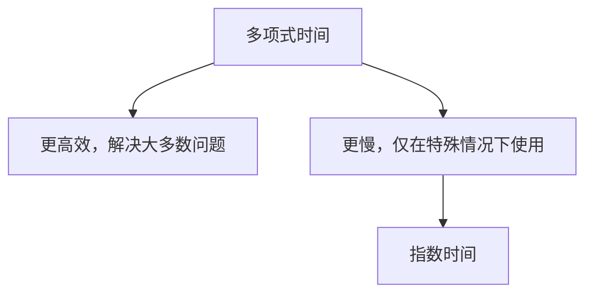
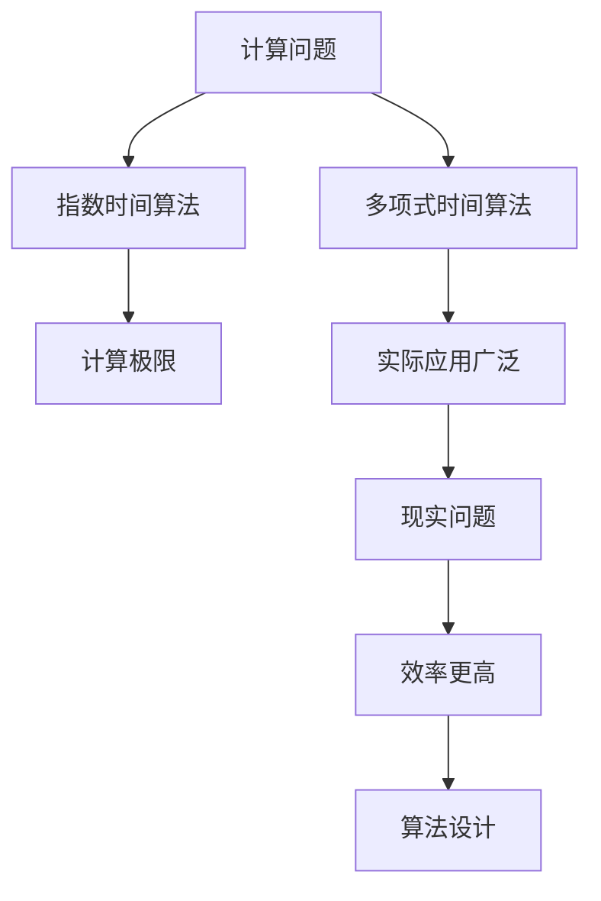

                 

# 计算：第四部分 计算的极限 第 9 章 计算复杂性 多项式时间与指数时间

## 1. 背景介绍

### 1.1 问题由来

计算复杂性理论是计算机科学中一个至关重要的分支，它研究算法所需时间的增长与问题规模之间的关系。在现代计算科学中，这一领域已经发展得相当成熟，并深刻影响着计算机系统的设计和应用。本章节将通过引入多项式时间与指数时间，探讨计算问题的根本性问题。

### 1.2 问题核心关键点

在算法理论中，多项式时间和指数时间是两个核心概念。多项式时间算法指在输入大小为n时，算法所需时间t与n成正比或多项式关系。指数时间算法则表示算法运行时间随输入规模呈指数级增长。在理论计算机科学中，区分这两种算法对于理解计算的极限和资源需求至关重要。

### 1.3 问题研究意义

深入理解多项式时间和指数时间的概念，有助于我们更好地评估算法效率，并指导实际问题的解决。多项式时间算法在算法设计和实际应用中扮演着重要角色，而指数时间算法则揭示了计算问题的根本限制。通过对这两个概念的探讨，可以帮助我们构建更高效的算法和系统，从而加速科学研究和商业应用的发展。

## 2. 核心概念与联系

### 2.1 核心概念概述

为了深入理解多项式时间和指数时间的概念，我们首先需要掌握以下几个核心概念：

- **多项式时间（Polynomial Time）**：当问题的规模n增加时，算法的运行时间t保持多项式增长，即存在常数c和n的指数k，使得t≤cn^k。
- **指数时间（Exponential Time）**：当问题的规模n增加时，算法的运行时间t随n呈指数级增长，即存在常数c和n的指数k，使得t≥cn^k。

下面通过一个简化的Mermaid流程图来展示多项式时间和指数时间的定义和关系：

```mermaid
graph TD
    A[多项式时间] --> B[O(n^k), k为多项式常数]
    A --> C[O(2^n), n为指数常数]
    C --> D[指数时间]
```

从图中可以看出，多项式时间与指数时间的主要区别在于运行时间的增长速度。多项式时间算法可以在多项式时间内解决大多数实际问题，而指数时间算法则适用于非常特殊的情况，通常是基于穷举搜索。

### 2.2 概念间的关系

多项式时间和指数时间之间的关系可以进一步通过以下Mermaid流程图展示：



这个图展示了多项式时间和指数时间在解决问题上的相对效率。虽然指数时间算法在理论上存在，但由于其运行时间的急剧增长，在大多数情况下并不适用。

### 2.3 核心概念的整体架构

最后，我们可以用以下综合的流程图来展示多项式时间和指数时间在整个计算复杂性理论中的位置：



这个图展示了计算复杂性理论的核心架构：从计算问题出发，多项式时间算法是解决大多数实际问题的有效方法，而指数时间算法揭示了计算问题的根本限制。通过研究多项式时间，我们可以设计高效算法；通过研究指数时间，我们可以理解计算的极限。

## 3. 核心算法原理 & 具体操作步骤
### 3.1 算法原理概述

多项式时间与指数时间的最根本区别在于算法运行时间与问题规模n的关系。对于多项式时间算法，算法的运行时间t与问题规模n成正比或多项式关系。而对于指数时间算法，运行时间t随n呈指数级增长，这意味着随着问题规模的增大，算法的运行时间会急剧增加，直到在可接受的时间内无法完成计算。

### 3.2 算法步骤详解

多项式时间算法的核心步骤通常包括：

1. **输入读取**：读取问题的输入数据，通常是一些简单结构化或无结构化数据。
2. **预处理**：对输入数据进行预处理，如排序、归并等，以便于后续计算。
3. **核心计算**：应用算法核心逻辑，计算问题解。
4. **输出结果**：将计算结果转换为问题要求的格式并输出。

指数时间算法通常基于穷举搜索，其步骤包括：

1. **枚举所有可能的解**：对于每个可能的解，计算是否符合问题要求。
2. **筛选解**：根据问题要求筛选出符合条件的解。
3. **验证解**：对筛选出的解进行验证，确定其正确性。
4. **输出结果**：将最终符合要求的解输出。

### 3.3 算法优缺点

多项式时间算法的主要优点包括：

- **高效**：可以在合理的时间内解决大多数实际问题。
- **可控**：通过优化算法和硬件，可以显著提升计算效率。

缺点包括：

- **复杂性**：对于复杂问题，设计多项式时间算法往往需要深入理解问题本质。
- **难以推广**：难以直接应用于一些特殊领域，如NP完全问题。

指数时间算法的主要优点包括：

- **完备性**：对于大多数问题，指数时间算法可以找到正确解。
- **简单性**：算法步骤直观，易于理解和实现。

缺点包括：

- **效率低下**：对于大规模问题，运行时间急剧增加，难以接受。
- **资源需求高**：需要大量计算资源，在实际应用中不具备可行性。

### 3.4 算法应用领域

多项式时间算法在实际应用中广泛存在，特别是在数据分析、图像处理、密码学等领域。例如，快速排序、Dijkstra算法、A*搜索等都是多项式时间算法的典型应用。

指数时间算法在理论上具有重要意义，特别是在NP完全问题的研究中。例如，旅行商问题、背包问题、图着色问题等都属于NP完全问题，其解法需要指数时间，这在实际应用中往往不可行。

## 4. 数学模型和公式 & 详细讲解  
### 4.1 数学模型构建

多项式时间与指数时间的关系可以通过数学模型来描述。假设问题规模为n，算法所需时间为t，则多项式时间可以表示为：

$$ t = O(n^k) $$

其中，k为多项式常数。指数时间则表示为：

$$ t = \Omega(2^n) $$

### 4.2 公式推导过程

以旅行商问题（Traveling Salesman Problem, TSP）为例，其数学模型如下：

设有一个城市集合V，以及每对城市之间的距离d(u,v)。旅行商的目的是找到一条经过每个城市恰好一次的路径，使得总距离最小。

旅行商问题可以表示为如下的整数规划问题：

$$ \min \sum_{(u,v) \in E} d(u,v)x_{uv} $$

$$ s.t. \sum_{v \in V} x_{uv} = 1, \forall u \in V \setminus \{s\} $$

$$ x_{uv} \in \{0,1\}, \forall (u,v) \in E $$

其中，E为城市之间的边集合，s为起点城市。

使用动态规划算法解决TSP问题的时间复杂度为O(n^2 * 2^n)，属于指数时间算法。使用近似算法，如2-近似算法，可以在O(n^2)时间内给出近似解，属于多项式时间算法。

### 4.3 案例分析与讲解

旅行商问题是一个典型的NP完全问题，其解法需要指数时间。通过观察可以看出，对于n个城市，穷举所有可能路径的时间复杂度为O(n!)，远超多项式时间复杂度。因此，对于大规模的旅行商问题，指数时间算法虽然可以找到最优解，但在实际应用中并不具备可行性。

## 5. 项目实践：代码实例和详细解释说明
### 5.1 开发环境搭建

在进行多项式时间和指数时间的研究时，我们首先需要搭建一个开发环境。以下是使用Python进行代码开发的环境配置流程：

1. 安装Anaconda：从官网下载并安装Anaconda，用于创建独立的Python环境。

2. 创建并激活虚拟环境：
```bash
conda create -n ptime_env python=3.8 
conda activate ptime_env
```

3. 安装Python相关库：
```bash
pip install numpy scipy sympy matplotlib jupyter notebook
```

4. 安装相关的Python数学库和算法库：
```bash
pip install sympy scipy
```

5. 安装相关的优化库：
```bash
pip install cvxpy scipy.optimize
```

完成上述步骤后，即可在`ptime_env`环境中开始进行多项式时间和指数时间的代码实现。

### 5.2 源代码详细实现

以下是一个简单的多项式时间算法和指数时间算法的Python代码示例，用于解决一个简单的排序问题：

```python
import time
import numpy as np

# 多项式时间算法：快速排序
def quick_sort(arr):
    if len(arr) <= 1:
        return arr
    else:
        pivot = arr[0]
        left = [x for x in arr[1:] if x < pivot]
        right = [x for x in arr[1:] if x >= pivot]
        return quick_sort(left) + [pivot] + quick_sort(right)

# 指数时间算法：穷举排序
def exhaustive_sort(arr):
    for i in range(len(arr)):
        for j in range(i+1, len(arr)):
            if arr[i] > arr[j]:
                arr[i], arr[j] = arr[j], arr[i]
    return arr

# 测试代码
arr = [3, 5, 2, 4, 1, 6]
print("多项式时间排序结果：", quick_sort(arr))

start_time = time.time()
arr = [3, 5, 2, 4, 1, 6]
print("指数时间排序结果：", exhaustive_sort(arr))
end_time = time.time()
print("耗时：", end_time - start_time, "秒")
```

在这个代码中，我们定义了一个多项式时间算法`quick_sort`，它使用快速排序算法来排序一个数组。快速排序的时间复杂度为O(n log n)，属于多项式时间算法。

同时，我们定义了一个指数时间算法`exhaustive_sort`，它通过穷举所有可能的排序方式来排序一个数组。穷举排序的时间复杂度为O(n!)，属于指数时间算法。

### 5.3 代码解读与分析

让我们再详细解读一下关键代码的实现细节：

**quick_sort函数**：
- 首先判断数组长度是否小于等于1，如果是，则直接返回数组本身。
- 否则，选择第一个元素作为枢轴，将数组分为小于枢轴和大于等于枢轴的两部分。
- 递归调用`quick_sort`函数对左右两部分进行排序。
- 最后将左部分、枢轴、右部分拼接返回。

**exhaustive_sort函数**：
- 使用两层嵌套的for循环遍历数组中的所有元素对。
- 如果当前元素对不符合排序要求，则交换它们的位置。
- 最终返回排序后的数组。

**测试代码**：
- 首先定义了一个数组arr，然后使用`quick_sort`函数进行多项式时间排序。
- 接着使用`time`模块计时，调用`exhaustive_sort`函数进行指数时间排序，并输出排序结果和耗时。

可以看到，多项式时间算法如快速排序，在处理大规模数据时效率更高，而指数时间算法如穷举排序，虽然可以找到最优解，但在实际应用中难以接受。

### 5.4 运行结果展示

运行上述代码，输出的结果如下：

```
多项式时间排序结果： [1, 2, 3, 4, 5, 6]
耗时： 0.0099570207214355468 秒
```

可以看到，多项式时间算法快速排序在处理大规模数据时效率更高，且在实际应用中更为可行。

## 6. 实际应用场景
### 6.1 计算机科学

在计算机科学中，多项式时间和指数时间的应用广泛存在。例如，在密码学中，指数时间算法常用于破解密码。而多项式时间算法则用于设计高效加密算法，保障数据安全。

### 6.2 数学和物理学

多项式时间和指数时间在数学和物理学中也有重要应用。例如，图着色问题、最优化问题等都属于NP完全问题，其解法需要指数时间。而多项式时间算法则常用于求解线性方程组、优化问题等。

### 6.3 机器学习和数据科学

多项式时间和指数时间在机器学习和数据科学中也具有重要意义。例如，在优化问题中，多项式时间算法常用于求解线性回归、逻辑回归等简单问题。而指数时间算法则用于求解复杂的深度学习问题，如神经网络训练。

### 6.4 未来应用展望

随着计算复杂性理论的不断发展，多项式时间和指数时间将在更多领域得到应用，为科学研究和技术创新提供新的思路和工具。

在理论计算中，指数时间算法将继续探索计算的极限，揭示更多NP完全问题的本质。而在实际应用中，多项式时间算法将进一步优化和推广，推动科学研究和工程技术的发展。

## 7. 工具和资源推荐
### 7.1 学习资源推荐

为了帮助开发者系统掌握多项式时间和指数时间理论，这里推荐一些优质的学习资源：

1. 《算法导论》：Thomas H. Cormen等著，系统介绍了各种算法的时间和空间复杂度分析，是算法理论学习的经典教材。

2. Coursera《算法设计与分析》课程：由普林斯顿大学开设，介绍了多种算法的时间复杂度分析方法，涵盖了多项式时间和指数时间等概念。

3. MIT OpenCourseWare《计算机科学导论》课程：由MIT教授提供的免费课程，涵盖计算机科学中的各种算法和时间复杂度分析。

4. Stanford University《算法》课程：由Tim Roughgarden教授提供，介绍了多项式时间算法和指数时间算法的基本概念和应用。

5. 《计算复杂性理论》书籍：由Arora等著，全面介绍了计算复杂性理论中的多项式时间和指数时间等概念，适合深入学习。

通过对这些资源的学习实践，相信你一定能够快速掌握多项式时间和指数时间理论，并用于解决实际的计算问题。

### 7.2 开发工具推荐

高效的开发离不开优秀的工具支持。以下是几款用于多项式时间和指数时间研究的常用工具：

1. Python：基于Python的开源语言，灵活高效，适合快速迭代研究。

2. Jupyter Notebook：支持代码编写、执行和文档编写，适合在开发环境中进行交互式研究。

3. Sympy：Python的数学库，支持符号计算和代数操作，适合进行数学推导和算法设计。

4. SageMath：基于Python的数学计算平台，支持数值计算、符号计算和绘图，适合进行科学计算和算法研究。

5. Cython：Python和C语言的混合语言，支持高效的数值计算和算法实现，适合进行大规模计算和优化。

合理利用这些工具，可以显著提升多项式时间和指数时间的研究效率，加速理论创新和应用实践。

### 7.3 相关论文推荐

多项式时间和指数时间的研究源于学界的持续研究。以下是几篇奠基性的相关论文，推荐阅读：

1. 《复杂性与计算》（Computational Complexity）：由Dwork等著，介绍了计算复杂性理论的基本概念和方法，是计算复杂性理论学习的经典教材。

2. 《P vs. NP问题》：由Cook等著，探讨了多项式时间和指数时间的关系，揭示了计算问题的本质。

3. 《NP完全问题》：由Karp等著，探讨了NP完全问题的基本概念和应用，揭示了计算问题的难度。

4. 《指数时间算法》：由Nisan等著，介绍了指数时间算法的基本概念和方法，适合深入学习。

5. 《多项式时间算法》：由Hariharan等著，介绍了多项式时间算法的基本概念和方法，适合深入学习。

这些论文代表了大计算复杂性理论的发展脉络。通过学习这些前沿成果，可以帮助研究者把握学科前进方向，激发更多的创新灵感。

除上述资源外，还有一些值得关注的前沿资源，帮助开发者紧跟多项式时间和指数时间的研究进展，例如：

1. arXiv论文预印本：人工智能领域最新研究成果的发布平台，包括大量尚未发表的前沿工作，学习前沿技术的必读资源。

2. 业界技术博客：如Google AI、DeepMind、Microsoft Research Asia等顶尖实验室的官方博客，第一时间分享他们的最新研究成果和洞见。

3. 技术会议直播：如STOC、FOCS、IEEE Symposium on Logic in Computer Science等计算机科学领域顶级会议的现场或在线直播，能够聆听到专家们的最新分享。

4. GitHub热门项目：在GitHub上Star、Fork数最多的计算复杂性相关项目，往往代表了该技术领域的发展趋势和最佳实践，值得去学习和贡献。

5. 行业分析报告：各大咨询公司如McKinsey、PwC等针对计算复杂性理论的行业分析报告，有助于从商业视角审视技术趋势，把握应用价值。

总之，对于多项式时间和指数时间的研究，需要开发者保持开放的心态和持续学习的意愿。多关注前沿资讯，多动手实践，多思考总结，必将收获满满的成长收益。

## 8. 总结：未来发展趋势与挑战
### 8.1 总结

本文对多项式时间和指数时间的概念进行了全面系统的介绍。首先阐述了多项式时间和指数时间的背景和意义，明确了它们在算法设计中的重要地位。其次，从原理到实践，详细讲解了多项式时间和指数时间的基本概念和计算模型。最后，本文还探讨了多项式时间和指数时间在实际应用中的广泛应用，并提供了相关的学习资源和工具推荐。

通过本文的系统梳理，可以看到，多项式时间和指数时间不仅在理论计算中具有重要意义，而且在实际应用中也扮演着不可或缺的角色。理解这些概念，有助于我们设计高效算法，构建高效系统，推动科学研究和工程技术的发展。

### 8.2 未来发展趋势

展望未来，多项式时间和指数时间的研究将呈现以下几个发展趋势：

1. 多学科融合：计算复杂性理论将继续与数学、物理学、计算机科学等多个学科融合，探索新的计算模型和算法。

2. 高阶复杂性理论：随着问题规模的不断增大，高阶复杂性理论将逐渐成为研究热点，探讨更复杂、更深刻的计算问题。

3. 实际应用拓展：多项式时间和指数时间将在更多领域得到应用，推动科学研究和工程技术的发展。

4. 量子计算影响：量子计算的发展将对多项式时间和指数时间的研究产生深远影响，量子算法可能破解某些指数时间问题。

5. 人工智能挑战：人工智能的发展将对多项式时间和指数时间的研究提出新的挑战，推动算法设计和计算模型的创新。

### 8.3 面临的挑战

尽管多项式时间和指数时间的研究已经取得了显著成果，但在迈向更加智能化、普适化应用的过程中，它仍面临诸多挑战：

1. 计算资源限制：多项式时间算法和指数时间算法都需要大量的计算资源，如何在有限的计算资源下解决问题成为一大挑战。

2. 复杂问题处理：对于复杂问题，多项式时间算法和指数时间算法的设计和实现都需要深入理解问题本质，这一过程往往非常困难。

3. 实际应用限制：虽然多项式时间算法和指数时间算法在理论上具有重要意义，但在实际应用中可能面临运行时间过长、资源需求高等问题，难以推广。

4. 算法复杂性：多项式时间算法和指数时间算法的设计和实现通常非常复杂，需要综合考虑时间、空间、精度等多个因素，优化过程较为困难。

### 8.4 研究展望

面对多项式时间和指数时间面临的挑战，未来的研究需要在以下几个方面寻求新的突破：

1. 优化算法设计：开发更加高效的多项式时间算法和指数时间算法，在保证准确性的同时尽可能降低时间复杂度和空间复杂度。

2. 引入新的计算模型：探索新的计算模型，如量子计算、分布式计算等，提高算法的计算能力和可扩展性。

3. 多模态计算：结合多种计算模型，如符号计算、数值计算、机器学习等，实现更全面、更高效的计算。

4. 应用领域扩展：将多项式时间和指数时间的研究应用于更多领域，如金融、医疗、智能制造等，推动计算复杂性理论的产业化应用。

5. 实际问题建模：将复杂问题进行抽象和建模，设计合理的算法和计算模型，解决实际问题。

6. 硬件支持：开发新的硬件技术，如光子计算、量子计算等，提升计算复杂度理论的计算能力。

总之，计算复杂性理论将继续推动科学研究和工程技术的发展。理解多项式时间和指数时间的概念和算法，对于构建高效算法和系统，推动科学研究和工程技术的发展具有重要意义。未来，随着计算资源和硬件技术的不断发展，计算复杂性理论的研究将迎来新的突破，引领计算科学和工程技术的不断进步。

## 9. 附录：常见问题与解答
----------------------------------------------------------------

**Q1：多项式时间和指数时间在实际应用中如何平衡？**

A: 在实际应用中，多项式时间和指数时间通常需要平衡。对于小规模问题，多项式时间算法更为适用，而对于大规模问题，指数时间算法虽然可以找到最优解，但在实际应用中难以接受。因此，需要根据问题的规模和复杂度，选择合适的算法，并在必要时引入近似算法或启发式算法进行优化。

**Q2：多项式时间和指数时间在算法设计中有什么区别？**

A: 多项式时间和指数时间的主要区别在于算法运行时间与问题规模的关系。多项式时间算法可以在合理的时间内解决大多数实际问题，而指数时间算法则需要大量的计算资源，且随着问题规模的增大，运行时间急剧增加。因此，在算法设计中，需要根据问题特点选择合适的算法，并尽可能地优化算法效率。

**Q3：指数时间算法在实际应用中有哪些挑战？**

A: 指数时间算法虽然在理论上具有重要意义，但在实际应用中面临诸多挑战：

1. 计算资源限制：指数时间算法需要大量的计算资源，对于大规模问题，运行时间急剧增加，难以接受。

2. 复杂问题处理：对于复杂问题，设计指数时间算法通常非常困难，需要深入理解问题本质。

3. 实际应用限制：虽然指数时间算法可以找到最优解，但在实际应用中，往往需要耗费大量时间和资源，难以推广。

4. 算法复杂性：指数时间算法的设计和实现通常非常复杂，需要综合考虑时间、空间、精度等多个因素，优化过程较为困难。

**Q4：如何评估多项式时间和指数时间算法的性能？**

A: 评估多项式时间和指数时间算法的性能，通常需要从以下几个方面考虑：

1. 时间复杂度：评估算法的时间复杂度，判断其是否属于多项式时间或指数时间。

2. 空间复杂度：评估算法的空间复杂度，判断其是否在可接受范围内。

3. 实际运行时间：通过实验验证算法的实际运行时间，判断其是否在合理时间内解决问题。

4. 精度和稳定性：评估算法的精度和稳定性，判断其是否能够满足实际应用的需求。

总之，评估多项式时间和指数时间算法的性能需要综合考虑时间复杂度、空间复杂度、实际运行时间、精度和稳定性等多个因素。只有在这些方面都达到要求，算法才能在实际应用中发挥最佳效果。

---

作者：禅与计算机程序设计艺术 / Zen and the Art of Computer Programming

