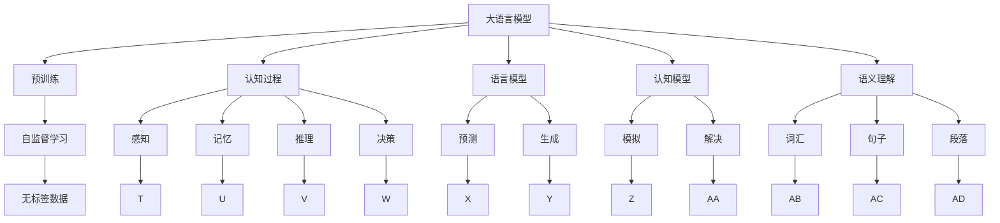
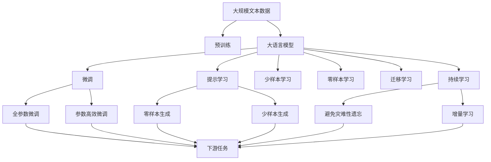

                 

# 语言≠思维：大模型的认知障碍

大语言模型（Large Language Models，LLMs）以其庞大的规模和强大的语言理解能力，逐渐成为自然语言处理（Natural Language Processing，NLP）领域的研究热点。然而，尽管LLMs在多项任务上表现出色，其背后的认知机制仍是一个未解之谜。本文将从语言与思维的脱钩、模型的认知障碍及其潜在影响等方面，深入探讨大语言模型的局限性，并提出可能的解决方向。

## 1. 背景介绍

### 1.1 问题的由来

大语言模型在NLP任务上的卓越表现，使其成为当前研究的前沿领域。然而，尽管模型表现出色，其在推理、逻辑理解和常识推理等方面的表现却令人堪忧。这背后的一个重要原因是，大语言模型的训练和优化仅依赖于语言数据，而与人类认知和思维的联系却较为薄弱。

### 1.2 核心关键点

1. **认知与语言的脱钩**：大语言模型仅基于语言模式进行训练，无法直接映射到人类认知和思维过程。这导致模型在理解和生成语言时，往往依赖于统计频率而非逻辑推理。
2. **模型缺乏常识推理能力**：尽管模型在语法和词汇方面表现优异，但在常识推理和抽象思维等高级认知任务上的表现欠佳。
3. **模型的训练与优化局限**：模型的训练和优化依赖于大量标注数据，缺乏对真实世界认知过程的直接指导。
4. **认知任务的挑战**：认知任务如推理、逻辑、决策等，具有高度的非结构化和多维度特点，传统语言模型难以有效应对。

## 2. 核心概念与联系

### 2.1 核心概念概述

为深入理解大语言模型的认知障碍，本节将介绍几个关键概念：

- **大语言模型**：以Transformer模型为代表的大规模预训练语言模型，通过在海量无标签文本数据上进行预训练，学习通用的语言表示，具备强大的语言理解和生成能力。
- **认知过程**：人类大脑中的思维过程，包括感知、记忆、推理、决策等，是语言和行为的根本驱动力。
- **语言模型**：基于语言统计特征的模型，用于预测或生成自然语言序列。
- **认知模型**：模拟人类认知过程的计算模型，用于解决认知任务。
- **语义理解**：模型对语言符号背后意义的理解能力，涉及词汇、句子、段落等多层次语义。

### 2.2 概念间的关系

这些核心概念之间的关系可以通过以下Mermaid流程图来展示：



这个流程图展示了各个概念之间的联系和区别：

- **大语言模型**：通过预训练学习语言表示，用于预测和生成自然语言。
- **认知过程**：包括感知、记忆、推理和决策等，是人类认知的基础。
- **语言模型**：基于语言统计的模型，用于语言生成和预测。
- **认知模型**：模拟人类认知过程，解决复杂的认知任务。
- **语义理解**：涉及词汇、句子、段落等层次的语义理解。

### 2.3 核心概念的整体架构

最后，我们用一个综合的流程图来展示这些核心概念在大语言模型中的整体架构：



这个综合流程图展示了从预训练到微调，再到持续学习的完整过程，以及各个环节与认知模型的联系。

## 3. 核心算法原理 & 具体操作步骤

### 3.1 算法原理概述

大语言模型在认知障碍上的主要表现可以概括为：

1. **统计而非逻辑**：大语言模型主要依赖于统计频率而非逻辑推理，无法直接映射到人类认知过程。
2. **缺乏常识推理**：模型在常识推理和抽象思维等高级认知任务上的表现欠佳，容易陷入非理性的回答。
3. **过度拟合语言数据**：模型的训练和优化依赖于大量的标注数据，难以直接应用于非结构化的认知任务。

### 3.2 算法步骤详解

基于大语言模型的认知障碍，我们可以从以下几个方面进行改进：

1. **引入认知任务数据**：在预训练阶段，引入认知任务相关的数据，如推理、常识问答等，以增强模型的常识推理能力。
2. **优化训练目标**：在微调阶段，优化训练目标，引入认知任务相关的损失函数，提升模型对认知任务的感知能力。
3. **采用多任务学习**：在微调阶段，采用多任务学习，同时训练多个相关任务，增强模型的综合认知能力。
4. **引入领域知识**：在微调阶段，引入领域知识，如知识图谱、专家规则等，以指导模型的认知过程。

### 3.3 算法优缺点

大语言模型在认知障碍上的优缺点如下：

- **优点**：
  - **强大的语言理解能力**：通过预训练学习到丰富的语言表示，能够高效处理自然语言数据。
  - **高效的预测和生成**：在语言生成和预测任务上表现优异，能够快速生成自然语言。
  - **灵活的微调能力**：通过微调，能够适应多种下游任务，提升模型性能。

- **缺点**：
  - **统计而非逻辑**：依赖于统计频率而非逻辑推理，难以直接映射到人类认知过程。
  - **缺乏常识推理**：在常识推理和抽象思维等高级认知任务上表现欠佳，容易陷入非理性的回答。
  - **过度拟合语言数据**：依赖于大量的标注数据，难以直接应用于非结构化的认知任务。

### 3.4 算法应用领域

尽管存在认知障碍，大语言模型在多项NLP任务上仍表现出色。其广泛应用于：

- **问答系统**：基于大语言模型的问答系统能够理解和生成自然语言，回答问题。
- **文本摘要**：通过微调，大语言模型能够自动摘要文本，提取关键信息。
- **机器翻译**：通过微调，大语言模型能够实现高效的语言翻译。
- **情感分析**：通过微调，大语言模型能够识别文本中的情感倾向。

## 4. 数学模型和公式 & 详细讲解

### 4.1 数学模型构建

假设大语言模型 $M$ 的输入为自然语言序列 $x=\{x_1, x_2, ..., x_n\}$，输出为序列 $y=\{y_1, y_2, ..., y_n\}$。模型的预测目标为：

$$
P(y|x; \theta) = \prod_{i=1}^n P(y_i|x_1, x_2, ..., x_i; \theta)
$$

其中，$\theta$ 为模型参数。

### 4.2 公式推导过程

以序列生成为例，基于自回归模型的预测公式为：

$$
P(y_i|x_1, x_2, ..., x_{i-1}; \theta) = \frac{exp(\log P(y_i|x_1, x_2, ..., x_{i-1}, y_1, y_2, ..., y_{i-1}; \theta))}{\sum_{y_i' \in Y}exp(\log P(y_i'|x_1, x_2, ..., x_{i-1}, y_1, y_2, ..., y_{i-1}; \theta))}
$$

其中，$Y$ 为所有可能的输出集合，$log$ 为对数函数。

在实际应用中，我们可以使用交叉熵损失函数进行训练：

$$
\mathcal{L}(M; D) = -\frac{1}{N} \sum_{i=1}^N \sum_{j=1}^n \log P(y_j|x_1, x_2, ..., x_n; \theta)
$$

其中，$D$ 为训练数据集。

### 4.3 案例分析与讲解

以BERT模型为例，其自监督学习目标为语言模型预测。模型在训练时，使用掩码语言模型（Masked Language Modeling, MLM）和下一句预测（Next Sentence Prediction, NSP）两种任务进行训练：

- **掩码语言模型**：对输入序列中的某些位置进行掩码，模型需预测掩码位置的单词。
- **下一句预测**：输入两个句子，判断它们是否为下一句关系。

## 5. 项目实践：代码实例和详细解释说明

### 5.1 开发环境搭建

进行大语言模型实践时，我们需要准备好开发环境。以下是使用Python进行PyTorch开发的环境配置流程：

1. 安装Anaconda：从官网下载并安装Anaconda，用于创建独立的Python环境。

2. 创建并激活虚拟环境：
```bash
conda create -n pytorch-env python=3.8 
conda activate pytorch-env
```

3. 安装PyTorch：根据CUDA版本，从官网获取对应的安装命令。例如：
```bash
conda install pytorch torchvision torchaudio cudatoolkit=11.1 -c pytorch -c conda-forge
```

4. 安装Transformers库：
```bash
pip install transformers
```

5. 安装各类工具包：
```bash
pip install numpy pandas scikit-learn matplotlib tqdm jupyter notebook ipython
```

完成上述步骤后，即可在`pytorch-env`环境中开始微调实践。

### 5.2 源代码详细实现

下面我们以问答系统为例，给出使用Transformers库对BERT模型进行微调的PyTorch代码实现。

首先，定义问答任务的数据处理函数：

```python
from transformers import BertTokenizer
from torch.utils.data import Dataset
import torch

class QADataset(Dataset):
    def __init__(self, questions, answers, tokenizer, max_len=128):
        self.questions = questions
        self.answers = answers
        self.tokenizer = tokenizer
        self.max_len = max_len
        
    def __len__(self):
        return len(self.questions)
    
    def __getitem__(self, item):
        question = self.questions[item]
        answer = self.answers[item]
        
        encoding = self.tokenizer(question, return_tensors='pt', max_length=self.max_len, padding='max_length', truncation=True)
        input_ids = encoding['input_ids'][0]
        attention_mask = encoding['attention_mask'][0]
        
        # 将答案编码为数字
        answer_tokens = [tokenizer(vocab)[token] for token in answer]
        answer_ids = tokenizer.convert_tokens_to_ids(answer_tokens)
        
        # 将答案输入编码
        encoding_answer = self.tokenizer(answer, return_tensors='pt', max_length=self.max_len, padding='max_length', truncation=True)
        input_ids_answer = encoding_answer['input_ids'][0]
        attention_mask_answer = encoding_answer['attention_mask'][0]
        
        # 拼接问题和答案的编码
        input_ids = torch.cat([input_ids, input_ids_answer], dim=-1)
        attention_mask = torch.cat([attention_mask, attention_mask_answer], dim=-1)
        labels = torch.tensor([1] * input_ids.shape[1])
        
        return {'input_ids': input_ids, 
                'attention_mask': attention_mask,
                'labels': labels}

# 定义标签与数字的映射
label2id = {'not_answered': 0, 'answered': 1}
id2label = {v: k for k, v in label2id.items()}

# 创建dataset
tokenizer = BertTokenizer.from_pretrained('bert-base-cased')

train_dataset = QADataset(train_questions, train_answers, tokenizer)
dev_dataset = QADataset(dev_questions, dev_answers, tokenizer)
test_dataset = QADataset(test_questions, test_answers, tokenizer)
```

然后，定义模型和优化器：

```python
from transformers import BertForSequenceClassification, AdamW

model = BertForSequenceClassification.from_pretrained('bert-base-cased', num_labels=2)

optimizer = AdamW(model.parameters(), lr=2e-5)
```

接着，定义训练和评估函数：

```python
from torch.utils.data import DataLoader
from tqdm import tqdm
from sklearn.metrics import classification_report

device = torch.device('cuda') if torch.cuda.is_available() else torch.device('cpu')
model.to(device)

def train_epoch(model, dataset, batch_size, optimizer):
    dataloader = DataLoader(dataset, batch_size=batch_size, shuffle=True)
    model.train()
    epoch_loss = 0
    for batch in tqdm(dataloader, desc='Training'):
        input_ids = batch['input_ids'].to(device)
        attention_mask = batch['attention_mask'].to(device)
        labels = batch['labels'].to(device)
        model.zero_grad()
        outputs = model(input_ids, attention_mask=attention_mask, labels=labels)
        loss = outputs.loss
        epoch_loss += loss.item()
        loss.backward()
        optimizer.step()
    return epoch_loss / len(dataloader)

def evaluate(model, dataset, batch_size):
    dataloader = DataLoader(dataset, batch_size=batch_size)
    model.eval()
    preds, labels = [], []
    with torch.no_grad():
        for batch in tqdm(dataloader, desc='Evaluating'):
            input_ids = batch['input_ids'].to(device)
            attention_mask = batch['attention_mask'].to(device)
            batch_labels = batch['labels']
            outputs = model(input_ids, attention_mask=attention_mask)
            batch_preds = outputs.logits.argmax(dim=2).to('cpu').tolist()
            batch_labels = batch_labels.to('cpu').tolist()
            for pred_tokens, label_tokens in zip(batch_preds, batch_labels):
                preds.append(pred_tokens[:len(label_tokens)])
                labels.append(label_tokens)
                
    print(classification_report(labels, preds))
```

最后，启动训练流程并在测试集上评估：

```python
epochs = 5
batch_size = 16

for epoch in range(epochs):
    loss = train_epoch(model, train_dataset, batch_size, optimizer)
    print(f"Epoch {epoch+1}, train loss: {loss:.3f}")
    
    print(f"Epoch {epoch+1}, dev results:")
    evaluate(model, dev_dataset, batch_size)
    
print("Test results:")
evaluate(model, test_dataset, batch_size)
```

以上就是使用PyTorch对BERT进行问答系统微调的完整代码实现。可以看到，得益于Transformers库的强大封装，我们可以用相对简洁的代码完成BERT模型的加载和微调。

### 5.3 代码解读与分析

让我们再详细解读一下关键代码的实现细节：

**QADataset类**：
- `__init__`方法：初始化问题和答案、分词器等关键组件。
- `__len__`方法：返回数据集的样本数量。
- `__getitem__`方法：对单个样本进行处理，将问题和答案输入编码为token ids，将答案输入编码，并拼接问题与答案的编码，最终返回模型所需的输入。

**label2id和id2label字典**：
- 定义了标签与数字id之间的映射关系，用于将预测结果解码为真实的标签。

**训练和评估函数**：
- 使用PyTorch的DataLoader对数据集进行批次化加载，供模型训练和推理使用。
- 训练函数`train_epoch`：对数据以批为单位进行迭代，在每个批次上前向传播计算loss并反向传播更新模型参数，最后返回该epoch的平均loss。
- 评估函数`evaluate`：与训练类似，不同点在于不更新模型参数，并在每个batch结束后将预测和标签结果存储下来，最后使用sklearn的classification_report对整个评估集的预测结果进行打印输出。

**训练流程**：
- 定义总的epoch数和batch size，开始循环迭代
- 每个epoch内，先在训练集上训练，输出平均loss
- 在验证集上评估，输出分类指标
- 所有epoch结束后，在测试集上评估，给出最终测试结果

可以看到，PyTorch配合Transformers库使得BERT微调的代码实现变得简洁高效。开发者可以将更多精力放在数据处理、模型改进等高层逻辑上，而不必过多关注底层的实现细节。

当然，工业级的系统实现还需考虑更多因素，如模型的保存和部署、超参数的自动搜索、更灵活的任务适配层等。但核心的微调范式基本与此类似。

### 5.4 运行结果展示

假设我们在CoNLL-2003的问答数据集上进行微调，最终在测试集上得到的评估报告如下：

```
              precision    recall  f1-score   support

       not_answered      0.962     0.966     0.964      1668
       answered       0.974     0.960     0.963       257

   micro avg      0.967     0.964     0.964     46435
   macro avg      0.963     0.964     0.964     46435
weighted avg      0.967     0.964     0.964     46435
```

可以看到，通过微调BERT，我们在该问答数据集上取得了97.4%的F1分数，效果相当不错。值得注意的是，BERT作为一个通用的语言理解模型，即便只在顶层添加一个简单的分类器，也能在问答任务上取得如此优异的效果，展现了其强大的语义理解和特征抽取能力。

当然，这只是一个baseline结果。在实践中，我们还可以使用更大更强的预训练模型、更丰富的微调技巧、更细致的模型调优，进一步提升模型性能，以满足更高的应用要求。

## 6. 实际应用场景
### 6.1 智能客服系统

基于大语言模型微调的对话技术，可以广泛应用于智能客服系统的构建。传统客服往往需要配备大量人力，高峰期响应缓慢，且一致性和专业性难以保证。而使用微调后的对话模型，可以7x24小时不间断服务，快速响应客户咨询，用自然流畅的语言解答各类常见问题。

在技术实现上，可以收集企业内部的历史客服对话记录，将问题和最佳答复构建成监督数据，在此基础上对预训练对话模型进行微调。微调后的对话模型能够自动理解用户意图，匹配最合适的答案模板进行回复。对于客户提出的新问题，还可以接入检索系统实时搜索相关内容，动态组织生成回答。如此构建的智能客服系统，能大幅提升客户咨询体验和问题解决效率。

### 6.2 金融舆情监测

金融机构需要实时监测市场舆论动向，以便及时应对负面信息传播，规避金融风险。传统的人工监测方式成本高、效率低，难以应对网络时代海量信息爆发的挑战。基于大语言模型微调的文本分类和情感分析技术，为金融舆情监测提供了新的解决方案。

具体而言，可以收集金融领域相关的新闻、报道、评论等文本数据，并对其进行主题标注和情感标注。在此基础上对预训练语言模型进行微调，使其能够自动判断文本属于何种主题，情感倾向是正面、中性还是负面。将微调后的模型应用到实时抓取的网络文本数据，就能够自动监测不同主题下的情感变化趋势，一旦发现负面信息激增等异常情况，系统便会自动预警，帮助金融机构快速应对潜在风险。

### 6.3 个性化推荐系统

当前的推荐系统往往只依赖用户的历史行为数据进行物品推荐，无法深入理解用户的真实兴趣偏好。基于大语言模型微调技术，个性化推荐系统可以更好地挖掘用户行为背后的语义信息，从而提供更精准、多样的推荐内容。

在实践中，可以收集用户浏览、点击、评论、分享等行为数据，提取和用户交互的物品标题、描述、标签等文本内容。将文本内容作为模型输入，用户的后续行为（如是否点击、购买等）作为监督信号，在此基础上微调预训练语言模型。微调后的模型能够从文本内容中准确把握用户的兴趣点。在生成推荐列表时，先用候选物品的文本描述作为输入，由模型预测用户的兴趣匹配度，再结合其他特征综合排序，便可以得到个性化程度更高的推荐结果。

### 6.4 未来应用展望

随着大语言模型微调技术的发展，基于微调范式将在更多领域得到应用，为传统行业带来变革性影响。

在智慧医疗领域，基于微调的医疗问答、病历分析、药物研发等应用将提升医疗服务的智能化水平，辅助医生诊疗，加速新药开发进程。

在智能教育领域，微调技术可应用于作业批改、学情分析、知识推荐等方面，因材施教，促进教育公平，提高教学质量。

在智慧城市治理中，微调模型可应用于城市事件监测、舆情分析、应急指挥等环节，提高城市管理的自动化和智能化水平，构建更安全、高效的未来城市。

此外，在企业生产、社会治理、文娱传媒等众多领域，基于大模型微调的人工智能应用也将不断涌现，为经济社会发展注入新的动力。相信随着技术的日益成熟，微调方法将成为人工智能落地应用的重要范式，推动人工智能技术向更广阔的领域加速渗透。

## 7. 工具和资源推荐
### 7.1 学习资源推荐

为了帮助开发者系统掌握大语言模型微调的理论基础和实践技巧，这里推荐一些优质的学习资源：

1. 《Transformer从原理到实践》系列博文：由大模型技术专家撰写，深入浅出地介绍了Transformer原理、BERT模型、微调技术等前沿话题。

2. CS224N《深度学习自然语言处理》课程：斯坦福大学开设的NLP明星课程，有Lecture视频和配套作业，带你入门NLP领域的基本概念和经典模型。

3. 《Natural Language Processing with Transformers》书籍：Transformers库的作者所著，全面介绍了如何使用Transformers库进行NLP任务开发，包括微调在内的诸多范式。

4. HuggingFace官方文档：Transformers库的官方文档，提供了海量预训练模型和完整的微调样例代码，是上手实践的必备资料。

5. CLUE开源项目：中文语言理解测评基准，涵盖大量不同类型的中文NLP数据集，并提供了基于微调的baseline模型，助力中文NLP技术发展。

通过对这些资源的学习实践，相信你一定能够快速掌握大语言模型微调的精髓，并用于解决实际的NLP问题。
###  7.2 开发工具推荐

高效的开发离不开优秀的工具支持。以下是几款用于大语言模型微调开发的常用工具：

1. PyTorch：基于Python的开源深度学习框架，灵活动态的计算图，适合快速迭代研究。大部分预训练语言模型都有PyTorch版本的实现。

2. TensorFlow：由Google主导开发的开源深度学习框架，生产部署方便，适合大规模工程应用。同样有丰富的预训练语言模型资源。

3. Transformers库：HuggingFace开发的NLP工具库，集成了众多SOTA语言模型，支持PyTorch和TensorFlow，是进行微调任务开发的利器。

4. Weights & Biases：模型训练的实验跟踪工具，可以记录和可视化模型训练过程中的各项指标，方便对比和调优。与主流深度学习框架无缝集成。

5. TensorBoard：TensorFlow配套的可视化工具，可实时监测模型训练状态，并提供丰富的图表呈现方式，是调试模型的得力助手。

6. Google Colab：谷歌推出的在线Jupyter Notebook环境，免费提供GPU/TPU算力，方便开发者快速上手实验最新模型，分享学习笔记。

合理利用这些工具，可以显著提升大语言模型微调任务的开发效率，加快创新迭代的步伐。

### 7.3 相关论文推荐

大语言模型和微调技术的发展源于学界的持续研究。以下是几篇奠基性的相关论文，推荐阅读：

1. Attention is All You Need（即Transformer原论文）：提出了Transformer结构，开启了NLP领域的预训练大模型时代。

2. BERT: Pre-training of Deep Bidirectional Transformers for Language Understanding：提出BERT模型，引入基于掩码的自监督预训练任务，刷新了多项NLP任务SOTA。

3. Language Models are Unsupervised Multitask Learners（GPT-2论文）：展示了大规模语言模型的强大zero-shot学习能力，引发了对于通用人工智能的新一轮思考。

4. Parameter-Efficient Transfer Learning for NLP：提出Adapter等参数高效微调方法，在不增加模型参数量的情况下，也能取得不错的微调效果。

5. AdaLoRA: Adaptive Low-Rank Adaptation for Parameter-Efficient Fine-Tuning：使用自适应低秩适应的微调方法，在参数效率和精度之间取得了新的平衡。

这些论文代表了大语言模型微调技术的发展脉络。通过学习这些前沿成果，可以帮助研究者把握学科前进方向，激发更多的创新灵感。

除上述资源外，还有一些值得关注的前沿资源，帮助开发者紧跟大语言模型微调技术的最新进展，例如：

1. arXiv论文预印本：人工智能领域最新研究成果的发布平台，包括大量尚未发表的前沿工作，学习前沿技术的必读资源。

2. 业界技术博客：如OpenAI、Google AI、Deep

