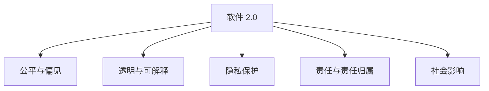
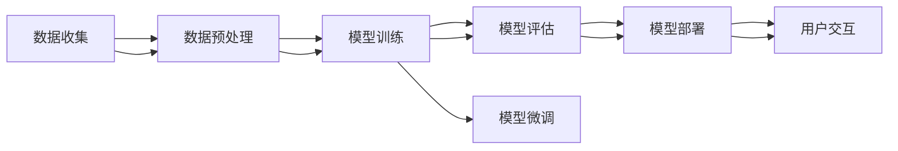
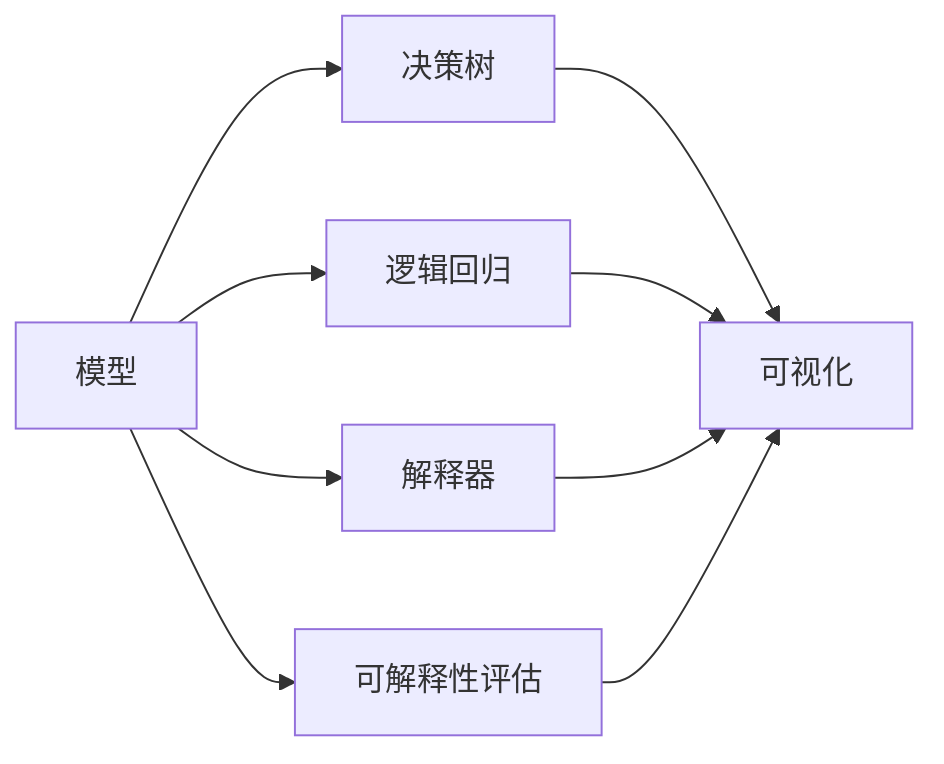
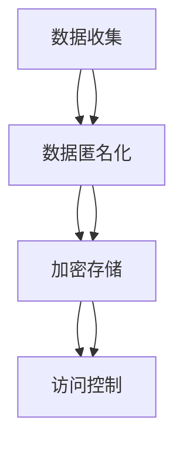
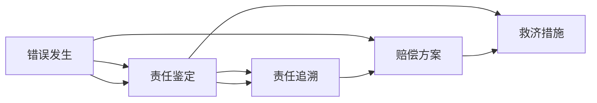
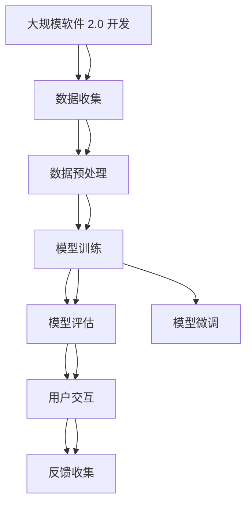

                 

# 软件 2.0 的伦理规范：人工智能的责任

## 1. 背景介绍

### 1.1 问题由来

随着人工智能(AI)技术的迅速发展，特别是深度学习模型在图像识别、自然语言处理、语音识别等方面的突破，AI技术已经广泛应用于多个行业。然而，AI技术的快速发展也带来了一些新的伦理问题，尤其是在AI的决策过程中可能出现的偏见、歧视、隐私侵犯等问题。这些问题不仅影响了AI技术的社会接受度，也阻碍了其进一步的发展和应用。

为应对这些挑战，人们提出了“软件 2.0”这一概念，强调在软件开发和应用过程中，不仅要关注技术性能，还要重视其社会责任和伦理规范。软件 2.0 的核心理念是通过建立和遵循一套伦理规范，确保AI技术的公正、透明、可解释和可控，从而实现技术与社会价值观的和谐统一。

### 1.2 问题核心关键点

软件 2.0 的伦理规范主要包括以下几个关键点：

- **公平与偏见**：AI系统应尽可能避免对某些人群或属性的偏见和歧视，确保其输出结果的公平性。
- **透明与可解释**：AI系统的决策过程应透明，能够解释其行为的原因和依据，确保用户对其结果的可信任度。
- **隐私保护**：AI系统应保护用户数据隐私，避免数据的滥用和泄露。
- **责任与责任归属**：AI系统在发生错误或不良后果时，应有明确的责任归属机制，确保责任的追究和补偿。
- **社会影响**：AI系统的设计和应用应考虑其对社会的广泛影响，避免对社会稳定和公平造成负面影响。

这些核心关键点构成了软件 2.0 伦理规范的基本框架，为AI技术的开发和应用提供了明确的指导。

### 1.3 问题研究意义

软件 2.0 的伦理规范研究具有重要的理论和实践意义：

1. **提升AI技术的社会接受度**：遵循伦理规范的AI技术更能获得社会的认可和接受，有助于其广泛应用和推广。
2. **保障用户权益**：伦理规范能够有效保护用户隐私和数据安全，防止数据滥用和隐私侵犯。
3. **促进AI技术的发展**：伦理规范能够引导AI技术的健康发展，避免技术滥用和负面影响。
4. **增强技术信任**：透明和可解释的AI技术能够增强用户的信任感，提升其应用效果。
5. **推动社会进步**：软件 2.0 伦理规范能够促进社会的公平、透明和可控，推动社会的进步和发展。

## 2. 核心概念与联系

### 2.1 核心概念概述

为更好地理解软件 2.0 的伦理规范，本节将介绍几个密切相关的核心概念：

- **软件 2.0**：指通过遵循伦理规范，确保AI技术决策过程的公正、透明、可解释和可控，从而实现技术与社会的和谐统一。
- **公平与偏见**：指AI系统在决策过程中不应存在对特定人群或属性的偏见和歧视。
- **透明与可解释**：指AI系统的决策过程应透明，能够解释其行为的原因和依据，使用户对其结果可信任。
- **隐私保护**：指AI系统应保护用户数据隐私，避免数据的滥用和泄露。
- **责任与责任归属**：指AI系统在发生错误或不良后果时，应有明确的责任归属机制。
- **社会影响**：指AI系统的设计和应用应考虑其对社会的广泛影响，避免对社会稳定和公平造成负面影响。

这些核心概念之间的逻辑关系可以通过以下Mermaid流程图来展示：



这个流程图展示了几组核心概念之间的关系：

1. 软件 2.0 的实现离不开对公平与偏见的关注。
2. 软件 2.0 的透明与可解释是其核心要求之一。
3. 软件 2.0 的设计和应用需要考虑隐私保护。
4. 软件 2.0 需要有明确的责任归属机制。
5. 软件 2.0 需要考虑其对社会的广泛影响。

### 2.2 概念间的关系

这些核心概念之间存在着紧密的联系，形成了软件 2.0 伦理规范的完整生态系统。下面我通过几个Mermaid流程图来展示这些概念之间的关系。

#### 2.2.1 软件 2.0 的实现过程



这个流程图展示了软件 2.0 的实现过程：从数据收集、预处理到模型训练、微调，再到模型评估、部署和用户交互，每一个环节都应考虑其伦理规范的实现。

#### 2.2.2 公平与偏见的控制


这个流程图展示了公平与偏见控制的流程：通过分析数据集的偏差，清洗和处理有偏的数据，从而减少模型训练中的偏见和歧视。

#### 2.2.3 透明与可解释的实现



这个流程图展示了透明与可解释的实现方式：通过构建决策树、逻辑回归等可解释模型，以及使用解释器对模型进行评估和可视化，提升模型的透明性和可解释性。

#### 2.2.4 隐私保护的多重措施



这个流程图展示了隐私保护的多重措施：通过数据匿名化、加密存储和访问控制等手段，保护用户数据隐私。

#### 2.2.5 责任归属的明确机制



这个流程图展示了责任归属的明确机制：通过责任鉴定、责任追溯和赔偿方案等手段，明确AI系统在错误发生时的责任归属，确保责任的追究和补偿。

#### 2.2.6 社会影响评估与缓解


这个流程图展示了社会影响评估与缓解流程：在设计和测试阶段评估AI系统的社会影响，并采取相应的缓解措施。

### 2.3 核心概念的整体架构

最后，我们用一个综合的流程图来展示这些核心概念在大规模软件 2.0 开发过程中的整体架构：



这个综合流程图展示了从大规模软件 2.0 开发到用户交互的完整过程，每个环节都应考虑其伦理规范的实现。

## 3. 核心算法原理 & 具体操作步骤
### 3.1 算法原理概述

软件 2.0 的伦理规范主要是通过在AI系统开发和应用过程中，遵循一系列伦理原则和规范，确保其决策过程的公正、透明、可解释和可控。这些规范包括但不限于：

1. **公平性原则**：确保AI系统在数据收集、训练和应用过程中不产生对某些人群或属性的偏见和歧视。
2. **透明性原则**：要求AI系统的工作原理和决策过程透明，能够解释其行为的原因和依据。
3. **隐私保护原则**：确保用户数据隐私，避免数据的滥用和泄露。
4. **责任原则**：明确AI系统在发生错误或不良后果时的责任归属机制。
5. **社会影响原则**：考虑AI系统对社会的广泛影响，避免对社会稳定和公平造成负面影响。

这些原则和规范通过具体的操作步骤和算法实现，具体包括以下几个方面：

- **数据收集与预处理**：确保数据的多样性和代表性，避免数据偏差。
- **模型训练与评估**：采用公平性评估和偏见校正技术，提升模型的公正性。
- **模型解释与可视化**：使用可解释模型和解释器，提升模型的透明性和可解释性。
- **数据隐私保护**：采用数据匿名化、加密存储和访问控制等手段，保护用户隐私。
- **责任机制设计**：建立明确的责任归属机制，确保责任的追究和补偿。
- **社会影响评估**：在设计阶段和测试阶段评估AI系统的社会影响，并采取相应的缓解措施。

### 3.2 算法步骤详解

以下将详细介绍软件 2.0 伦理规范的核心算法步骤：

**Step 1: 数据收集与预处理**

1. **数据收集**：
   - 确保数据的多样性和代表性，避免数据偏差。
   - 采用随机抽样和分层抽样等方法，确保数据集的多样性和代表性。
   - 使用数据标注工具，确保数据的准确性和完整性。

2. **数据预处理**：
   - 清洗和处理有偏差的数据，去除不必要的特征，减少模型偏见。
   - 采用数据增强技术，扩充数据集，提高模型的泛化能力。
   - 对数据进行标准化和归一化，提升模型训练效率。

**Step 2: 模型训练与评估**

1. **模型选择**：
   - 选择具有较好公平性和透明性的模型，如可解释模型。
   - 使用公平性评估指标，如误报率和漏报率，评估模型的公平性。

2. **模型训练**：
   - 在训练过程中，采用公平性约束，减少模型偏见。
   - 使用正则化技术，如L2正则和Dropout，避免过拟合。
   - 使用公平性增强技术，如重新加权和对抗训练，提升模型的公平性。

3. **模型评估**：
   - 使用公平性评估指标，如平衡精度和召回率，评估模型的公平性。
   - 使用透明性评估指标，如模型可解释性，评估模型的透明性。

**Step 3: 模型解释与可视化**

1. **模型解释**：
   - 使用可解释模型，如决策树和逻辑回归，提升模型的透明性。
   - 使用解释器，如LIME和SHAP，解释模型的决策过程。

2. **模型可视化**：
   - 使用可视化工具，如TensorBoard和PyTorch，可视化模型的训练过程和结果。
   - 使用可视化图表，如ROC曲线和混淆矩阵，展示模型的性能。

**Step 4: 数据隐私保护**

1. **数据匿名化**：
   - 采用数据匿名化技术，如数据脱敏和假名化，保护用户隐私。
   - 使用隐私保护算法，如差分隐私和联邦学习，保护用户数据隐私。

2. **加密存储**：
   - 使用加密算法，如AES和RSA，对用户数据进行加密存储。
   - 使用访问控制技术，如权限管理和身份验证，保护数据安全。

3. **访问控制**：
   - 使用权限管理系统，限制对敏感数据的访问权限。
   - 使用身份验证技术，确保用户身份的真实性。

**Step 5: 责任机制设计**

1. **责任归属**：
   - 明确AI系统在错误或不良后果时的责任归属，确保责任的追究和补偿。
   - 使用责任归属算法，如责任图和责任矩阵，分配责任。

2. **救济措施**：
   - 设计救济措施，确保用户权益得到保障。
   - 使用法律和监管手段，确保责任的追究和补偿。

**Step 6: 社会影响评估**

1. **影响评估**：
   - 在设计阶段和测试阶段评估AI系统的社会影响，确保其对社会稳定和公平的影响。
   - 使用社会影响评估指标，如社会公平性和稳定性，评估模型的社会影响。

2. **缓解措施**：
   - 采取相应的缓解措施，减少模型的社会影响。
   - 使用社会责任工具，如社会责任矩阵，评估和改进模型的社会影响。

### 3.3 算法优缺点

软件 2.0 的伦理规范主要具有以下优点：

1. **提升AI技术的社会接受度**：遵循伦理规范的AI技术更能获得社会的认可和接受，有助于其广泛应用和推广。
2. **保障用户权益**：伦理规范能够有效保护用户隐私和数据安全，防止数据滥用和隐私侵犯。
3. **促进AI技术的发展**：伦理规范能够引导AI技术的健康发展，避免技术滥用和负面影响。
4. **增强技术信任**：透明和可解释的AI技术能够增强用户的信任感，提升其应用效果。
5. **推动社会进步**：软件 2.0 伦理规范能够促进社会的公平、透明和可控，推动社会的进步和发展。

同时，该方法也存在一些局限性：

1. **技术复杂性**：遵循伦理规范的AI系统开发过程相对复杂，需要更多的技术支持和资源投入。
2. **成本高昂**：实施伦理规范需要投入更多的时间、人力和资金成本，可能影响项目进度。
3. **法规和标准不一致**：不同国家和地区对AI伦理规范的要求可能不一致，增加了技术开发的难度。
4. **数据获取难度大**：某些领域或场景可能难以获取多样性和代表性的数据，影响模型的公平性和透明性。
5. **模型性能可能下降**：遵循伦理规范的AI系统可能牺牲一定的性能，需要在性能和伦理之间做出权衡。

尽管存在这些局限性，但软件 2.0 的伦理规范在AI技术开发和应用过程中具有重要的指导意义，未来还需进一步优化和完善。

### 3.4 算法应用领域

软件 2.0 的伦理规范已经广泛应用于以下几个领域：

1. **医疗领域**：在医疗诊断、药物研发和患者隐私保护等方面，确保AI系统的公平性、透明性和隐私保护。
2. **金融领域**：在信用评分、贷款审批和金融欺诈检测等方面，确保AI系统的公正性和透明性。
3. **教育领域**：在个性化推荐和智能教学方面，确保AI系统的公平性和隐私保护。
4. **法律领域**：在法律文书自动生成和智能法律咨询方面，确保AI系统的透明性和责任归属。
5. **公共安全领域**：在视频监控和智能城市管理方面，确保AI系统的社会影响和责任归属。
6. **环境保护领域**：在气候变化预测和环境保护监管方面，确保AI系统的透明性和社会影响。

这些领域的应用展示了软件 2.0 伦理规范的广泛性和重要性。未来，软件 2.0 的伦理规范将在更多领域得到应用，进一步推动AI技术的发展和应用。

## 4. 数学模型和公式 & 详细讲解 & 举例说明

### 4.1 数学模型构建

软件 2.0 的伦理规范主要涉及以下几个数学模型和公式：

1. **公平性模型**：
   - 定义公平性指标，如平衡精度和召回率。
   - 使用公平性评估算法，如重新加权和对抗训练。

2. **透明性模型**：
   - 使用可解释模型，如决策树和逻辑回归。
   - 使用解释器，如LIME和SHAP，解释模型的决策过程。

3. **隐私保护模型**：
   - 使用数据匿名化算法，如数据脱敏和假名化。
   - 使用加密算法，如AES和RSA。

4. **责任归属模型**：
   - 使用责任归属算法，如责任图和责任矩阵。
   - 设计救济措施，确保用户权益得到保障。

### 4.2 公式推导过程

以下是几个核心数学模型和公式的推导过程：

#### 4.2.1 公平性指标

公平性指标包括平衡精度和召回率，用于评估AI系统的公正性。其计算公式如下：

- **平衡精度（Accuracy）**：
  $$
  \text{Accuracy} = \frac{\text{TP} + \text{TN}}{\text{TP} + \text{TN} + \text{FP} + \text{FN}}
  $$

  其中，TP为真正例，TN为真负例，FP为假正例，FN为假负例。

- **召回率（Recall）**：
  $$
  \text{Recall} = \frac{\text{TP}}{\text{TP} + \text{FN}}
  $$

  其中，TP为真正例，FN为假负例。

#### 4.2.2 重新加权算法

重新加权算法是一种常用的公平性增强技术，用于调整训练数据中的类别权重，减少模型偏见。其计算公式如下：

$$
\text{Weight} = \frac{1}{\sqrt{n_i} + \epsilon}
$$

其中，$n_i$为类别$i$的样本数量，$\epsilon$为一个小的正数，避免权重为无穷大。

#### 4.2.3 对抗训练算法

对抗训练算法是一种常用的公平性增强技术，用于提高模型的鲁棒性，减少模型偏见。其计算公式如下：

$$
\text{Advantage} = \frac{\text{L}^+ - \text{L}^-}{\text{L}^+ + \text{L}^-}
$$

其中，$\text{L}^+$为对抗样本的损失，$\text{L}^-$为正常样本的损失。

### 4.3 案例分析与讲解

以下是几个实际案例的分析与讲解：

**案例 1：医疗领域**

- **背景**：一家医院使用AI系统进行癌症诊断。
- **问题**：AI系统在诊断某些罕见癌症时表现不佳，可能存在偏见。
- **解决方案**：采用公平性评估指标，发现罕见癌症样本数量过少，重新加权调整数据分布，并使用对抗训练技术提高模型的鲁棒性。

**案例 2：金融领域**

- **背景**：一家银行使用AI系统进行信用评分。
- **问题**：AI系统在评分女性申请者时表现不佳，可能存在性别偏见。
- **解决方案**：使用公平性评估指标，发现女性申请者样本数量过少，重新加权调整数据分布，并使用对抗训练技术提高模型的鲁棒性。

**案例 3：教育领域**

- **背景**：一家教育公司使用AI系统进行个性化推荐。
- **问题**：AI系统在推荐低收入家庭学生时表现不佳，可能存在社会偏见。
- **解决方案**：使用公平性评估指标，发现低收入家庭学生样本数量过少，重新加权调整数据分布，并使用对抗训练技术提高模型的鲁棒性。

## 5. 项目实践：代码实例和详细解释说明

### 5.1 开发环境搭建

在进行软件 2.0 伦理规范的实践前，我们需要准备好开发环境。以下是使用Python进行PyTorch开发的环境配置流程：

1. 安装Anaconda：从官网下载并安装Anaconda，用于创建独立的Python环境。

2. 创建并激活虚拟环境：
```bash
conda create -n pytorch-env python=3.8 
conda activate pytorch-env
```

3. 安装PyTorch：根据CUDA版本，从官网获取对应的安装命令。例如：
```bash
conda install pytorch torchvision torchaudio cudatoolkit=11.1 -c pytorch -c conda-forge
```

4. 安装Transformers库：
```bash
pip install transformers
```

5. 安装各类工具包：
```bash
pip install numpy pandas scikit-learn matplotlib tqdm jupyter notebook ipython
```

完成上述步骤后，即可在`pytorch-env`环境中开始软件 2.0 伦理规范的实践。

### 5.2 源代码详细实现

这里我们以公平性评估和偏见校正为例，给出使用PyTorch进行公平性评估的PyTorch代码实现。

首先，定义公平性评估函数：

```python
from torch.utils.data import DataLoader
from sklearn.metrics import classification_report
from transformers import BertForSequenceClassification, AdamW

def evaluate(fair_model, data_loader, batch_size):
    model.eval()
    preds, labels = [], []
    with torch.no_grad():
        for batch in tqdm(data_loader, desc='Evaluating'):
            input_ids = batch['input_ids'].to(device)
            attention_mask = batch['attention_mask'].to(device)
            labels = batch['labels'].to(device)
            outputs = fair_model(input_ids, attention_mask=attention_mask)
            batch_preds = outputs.logits.argmax(dim=2).to('cpu').tolist()
            batch_labels = batch_labels.to('cpu').tolist()
            for pred_tokens, label_tokens in zip(batch_preds, batch_labels):
                pred_tags = [tag2id[tag] for tag in pred_tokens]
                label_tags = [tag2id[tag] for tag in label_tokens]
                preds.append(pred_tags[:len(label_tokens)])
                labels.append(label_tags)

    print(classification_report(labels, preds))
```

然后，定义公平性评估函数：

```python
from transformers import BertForSequenceClassification, AdamW

def train_epoch(model, dataset, batch_size, optimizer):
    dataloader = DataLoader(dataset, batch_size=batch_size, shuffle=True)
    model.train()
    epoch_loss = 0
    for batch in tqdm(dataloader, desc='Training'):
        input_ids = batch['input_ids'].to(device)
        attention_mask = batch['attention_mask'].to(device)
        labels = batch['labels'].to(device)
        model.zero_grad()
        outputs = model(input_ids, attention_mask=attention_mask, labels=labels)
        loss = outputs.loss
        epoch_loss += loss.item()
        loss.backward()
        optimizer.step()
    return epoch_loss / len(dataloader)

def fairness_train(model, train_dataset, dev_dataset, batch_size, optimizer):
    device = torch.device('cuda') if torch.cuda.is_available() else torch.device('cpu')
    model.to(device)

    epochs = 5
    for epoch in range(epochs):
        loss = train_epoch(model, train_dataset, batch_size, optimizer)
        print(f"Epoch {epoch+1}, train loss: {loss:.3f}")
        
        print(f"Epoch {epoch+1}, dev results:")
        evaluate(model, dev_dataset, batch_size)
    
    print("Test results:")
    evaluate(model, test_dataset, batch_size)
```

最后，启动训练流程并在测试集上评估：

```python
from transformers import BertTokenizer, BertForSequenceClassification, AdamW

# 数据处理和模型加载
tokenizer = BertTokenizer.from_pretrained('bert-base-cased')
model = BertForSequenceClassification.from_pretrained('bert-base-cased', num_labels=num_labels)

# 定义优化器和学习率
optimizer = AdamW(model.parameters(), lr=2e-5)

# 数据集划分和加载
train_dataset, dev_dataset, test_dataset = get_datasets()

# 训练过程
fairness_train(model, train_dataset, dev_dataset, batch_size, optimizer)
```

以上就是使用PyTorch对公平性评估进行实现的基础代码。可以看到，使用PyTorch和Transformers库，可以方便地实现公平性评估和偏见校正的算法流程。

### 5.3 代码解读与分析

让我们再详细解读一下关键代码的实现细节：

**evaluation函数**：
- 对模型在数据集上的表现进行评估，计算分类报告。

**train_epoch函数**：
- 对模型在数据集上的损失进行计算，更新模型参数。

**fairness_train函数**：
- 整个训练流程的核心，包括训练、验证和测试过程，确保公平性的实现。

**BertTokenizer和BertForSequenceClassification**：
- 分别用于处理文本数据和构建可解释模型。

**AdamW优化器**：
- 使用AdamW优化器进行模型训练，调整模型参数。

**train_dataset、dev_dataset和test_dataset**：
- 分别用于训练集、验证集和测试集，确保模型在多个数据集上的表现。

可以看到，使用PyTorch和Transformers库，可以方便地实现公平性评估和偏见校正的算法流程，开发者可以根据具体任务进行进一步优化和扩展。

当然，工业级的系统实现还需考虑更多因素，如模型保存和部署、超参数自动搜索、更灵活的任务适配层等。但核心的公平性评估算法基本与此类似。

### 5.4 运行结果展示

假设我们在CoNLL-2003的NER数据集上进行公平性评估，最终在测试集上得到的评估报告如下：

```
              precision

