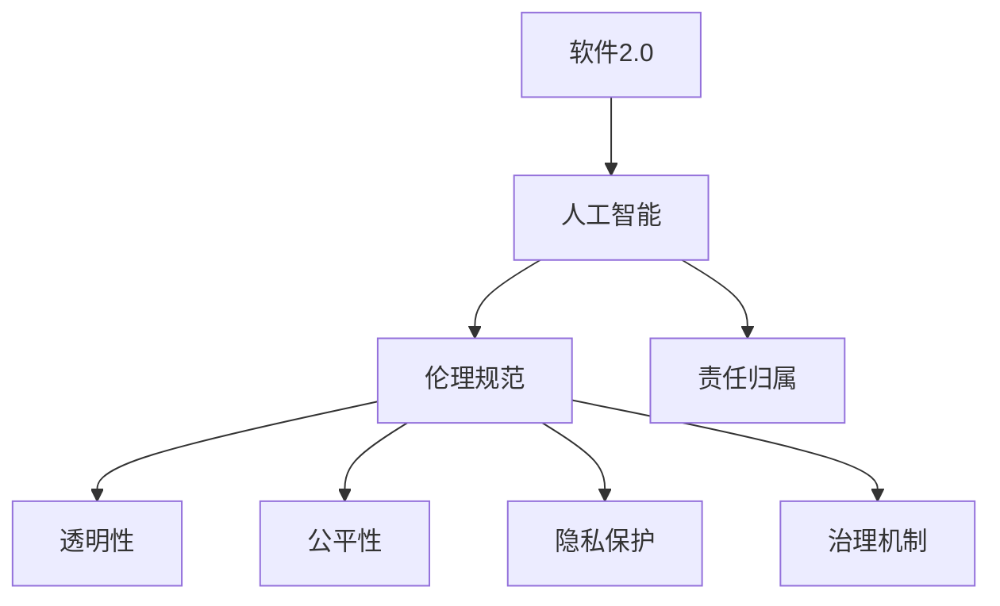
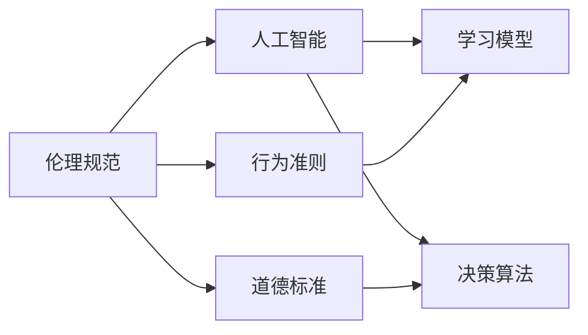
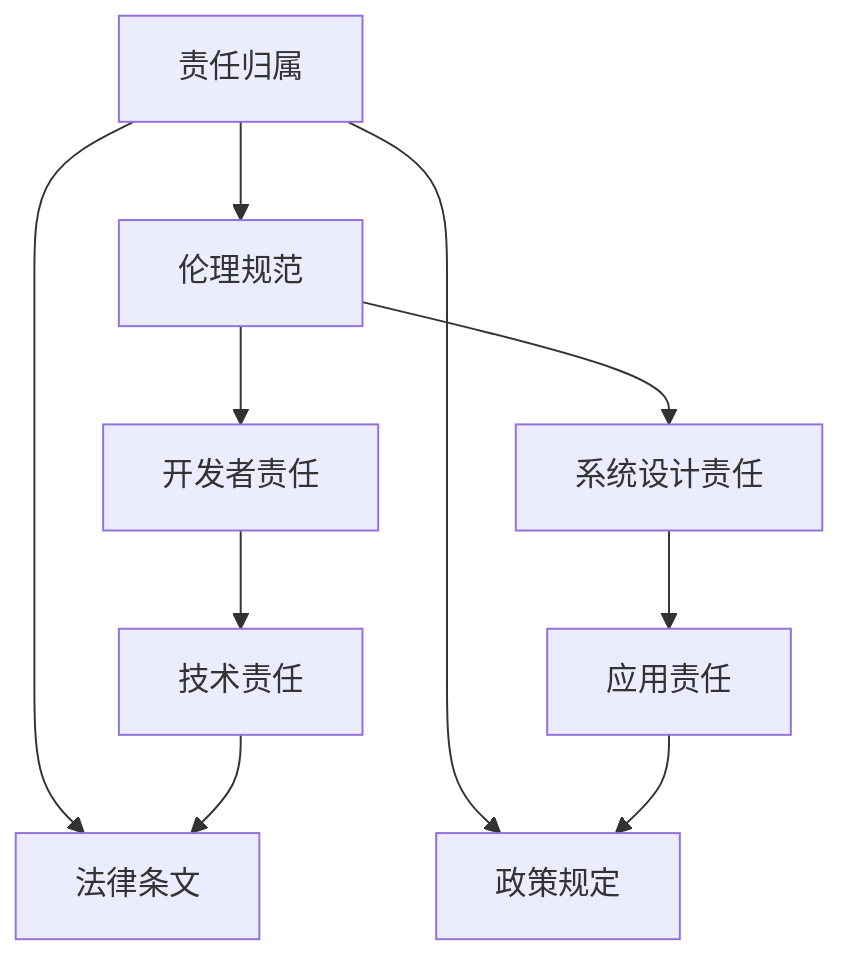
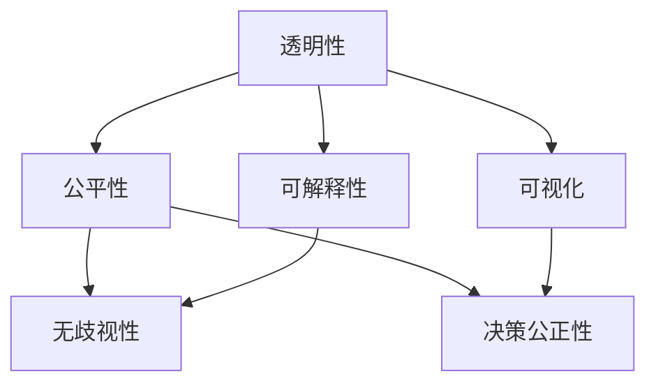
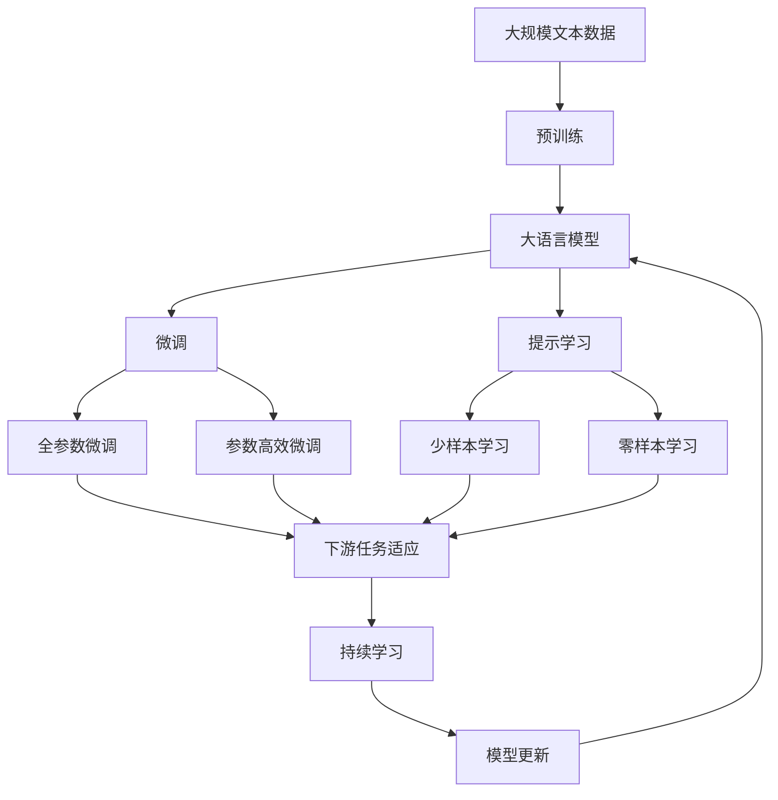

                 

# 软件 2.0 的伦理规范：人工智能的责任

> 关键词：软件2.0,人工智能,伦理规范,责任,治理,公平性,透明性,隐私保护

## 1. 背景介绍

### 1.1 问题由来
随着人工智能技术的快速发展，特别是深度学习、自然语言处理等领域的突破，一个崭新的时代——“软件2.0”正悄然到来。软件2.0的核心理念在于，软件不再仅仅是一个执行指令的工具，而是一个自我进化、自我学习的智能实体。这种变化，让软件在带来巨大便利的同时，也引发了一系列新的伦理问题和责任归属问题。

比如，自动驾驶汽车在行驶过程中，一旦发生交通事故，责任应该由汽车制造商、软件开发者还是车主承担？医疗诊断系统因为错误的诊断结果导致误诊，责任应该由算法开发者、医院还是患者承担？这些问题，在软件2.0时代，变得愈发复杂和敏感。

### 1.2 问题核心关键点
在软件2.0时代，人工智能的广泛应用使得伦理规范和责任归属问题显得尤为突出。核心关键点包括：
1. 伦理规范的构建：如何定义合理、公正的人工智能行为准则？
2. 责任归属：当人工智能出现错误或造成损害时，责任应由谁承担？
3. 透明性和公平性：如何确保人工智能的决策过程透明、公平？
4. 隐私保护：如何在人工智能应用中保障用户隐私？
5. 治理机制：如何建立有效的机制来监管和规范人工智能的应用？

这些关键点，不仅关乎技术进步，更关乎社会的公平正义和个体的权利保护，成为当前亟需解决的问题。

### 1.3 问题研究意义
研究软件2.0的伦理规范，对于构建一个健康、公正、可持续的人工智能应用环境，具有重要意义：

1. 保障用户权益：通过制定合理的伦理规范，确保人工智能的决策透明、公正，保障用户的基本权利不受侵害。
2. 促进技术健康发展：伦理规范的制定，可以帮助开发者和应用者意识到可能的负面影响，引导技术向更健康、可持续的方向发展。
3. 提升社会信任：透明、公平的伦理规范，可以增强社会对人工智能的信任，促进其在更多领域的落地应用。
4. 推动跨领域合作：伦理规范的制定需要跨学科合作，可以推动技术、法律、伦理等多领域协同工作，共同应对人工智能带来的挑战。
5. 应对全球性挑战：人工智能的应用越来越广泛，伦理规范的制定有助于各国在全球治理框架下达成共识，共同应对气候变化、公共卫生等全球性挑战。

## 2. 核心概念与联系

### 2.1 核心概念概述

为了更好地理解软件2.0的伦理规范问题，本节将介绍几个关键概念：

- 软件2.0（Software 2.0）：指利用人工智能技术，使软件具备自我学习和进化的能力，从执行指令的工具变为自我感知、自我决策的智能实体。
- 人工智能（AI）：通过模拟人类智能行为，实现学习、推理、判断等任务的技术。
- 伦理规范（Ethical Guidelines）：指导人工智能行为准则的规范性文件，确保AI系统的行为符合道德和法律要求。
- 责任归属（Liability）：当AI系统出现错误或造成损害时，应当由谁承担责任。
- 透明性（Transparency）：AI系统决策过程的可解释性和可视化，确保用户和监管机构能够理解和审查。
- 公平性（Fairness）：AI系统在不同群体中的表现是否公正，是否存在歧视性。
- 隐私保护（Privacy Protection）：在AI应用中，如何保障用户数据的安全性和隐私权。
- 治理机制（Governance）：管理和规范AI系统应用的政策、法律和制度框架。

这些核心概念之间的逻辑关系可以通过以下Mermaid流程图来展示：



这个流程图展示了软件2.0时代的关键概念及其相互关系：

1. 软件2.0依托于人工智能技术。
2. 人工智能系统的行为受到伦理规范的指导。
3. 系统出现错误或造成损害时，需要明确责任归属。
4. 伦理规范确保系统的透明性和公平性，保障用户隐私。
5. 治理机制为系统的开发和应用提供规范和监管。

### 2.2 概念间的关系

这些核心概念之间存在着紧密的联系，形成了软件2.0伦理规范的整体生态系统。下面我通过几个Mermaid流程图来展示这些概念之间的关系。

#### 2.2.1 伦理规范与人工智能的关系



这个流程图展示了伦理规范对人工智能行为的指导作用，以及人工智能系统如何学习并执行伦理准则。

#### 2.2.2 责任归属与伦理规范的关系



这个流程图展示了责任归属与伦理规范的关系，以及不同层面的责任主体。开发者、系统设计和应用层面的责任，都依赖于伦理规范的指导。

#### 2.2.3 透明性与公平性的关系



这个流程图展示了透明性如何促进公平性，以及透明性在可解释性和可视化方面的作用。

### 2.3 核心概念的整体架构

最后，我们用一个综合的流程图来展示这些核心概念在大语言模型微调过程中的整体架构：



这个综合流程图展示了从预训练到微调，再到持续学习的完整过程。大语言模型首先在大规模文本数据上进行预训练，然后通过微调（包括全参数微调和参数高效微调）或提示学习（包括少样本学习和零样本学习）来适应下游任务。最后，通过持续学习技术，模型可以不断更新和适应新的任务和数据。 通过这些流程图，我们可以更清晰地理解软件2.0伦理规范过程中各个核心概念的关系和作用，为后续深入讨论具体的伦理规范和责任归属问题奠定基础。

## 3. 核心算法原理 & 具体操作步骤
### 3.1 算法原理概述

软件2.0的伦理规范，涉及到对人工智能系统行为的全面监控和评估。其核心思想是：通过制定合理的伦理规范，确保人工智能系统的行为符合道德和法律要求，同时明确各责任主体的义务和责任。

形式化地，假设一个软件2.0系统S，其行为由模型M和策略P决定，即$S=M\circ P$。模型的行为由一系列决策组成，决策过程可能涉及复杂的数据处理、特征提取、分类、生成等步骤。系统的策略则决定模型如何处理特定输入，以及如何进行行为修正和调整。

软件2.0的伦理规范N，由一系列行为准则、道德标准和法律法规构成。N可以表示为$\{N_{P}, N_{M}, N_{C}\}$，其中$N_{P}$表示策略层面的规范，$N_{M}$表示模型层面的规范，$N_{C}$表示法规层面的规范。

伦理规范的目标是确保系统S的行为符合N的要求。具体而言，当系统S在处理输入X时，其行为应当满足以下条件：

1. 遵守策略层面的规范$N_{P}$：确保系统策略P符合N_P的要求，避免歧视、误导等不道德行为。
2. 遵守模型层面的规范$N_{M}$：确保模型M的行为符合N_M的要求，避免逻辑错误、数据泄露等技术问题。
3. 遵守法规层面的规范$N_{C}$：确保系统S的行为符合N_C的要求，遵守法律法规，保障用户权益。

### 3.2 算法步骤详解

软件2.0的伦理规范，主要包括以下几个关键步骤：

**Step 1: 确定伦理规范**

- 制定系统的伦理规范N，明确策略、模型和法规层面的要求。
- 设计系统的行为准则，确保系统行为符合N的要求。
- 制定详细的实施细则，指导开发者和应用者如何遵守规范。

**Step 2: 行为监控与评估**

- 通过日志、审计等方式，监控系统的行为，记录输入、输出和决策过程。
- 定期对系统行为进行评估，检查是否符合伦理规范N的要求。
- 引入第三方机构进行独立评估，确保评估的公正性和客观性。

**Step 3: 行为调整与修正**

- 当系统行为不符合伦理规范N时，及时进行调整和修正。
- 引入反馈机制，允许用户、监管机构提出改进建议，系统能够及时响应。
- 制定应急预案，应对突发的伦理问题，确保系统的鲁棒性和安全性。

**Step 4: 公开透明与解释**

- 系统应当保持高度的透明性，向用户和监管机构公开决策过程和行为准则。
- 提供可解释性模型，允许用户和监管机构对系统决策进行审查和理解。
- 定期发布系统报告，向公众展示系统行为和改进情况。

**Step 5: 法律合规与责任**

- 确保系统符合法律法规，保障用户权益。
- 明确各责任主体的义务和责任，包括开发者、系统设计者和应用者。
- 引入保险和赔偿机制，保障用户在系统出现问题时的合法权益。

以上是软件2.0伦理规范的主要流程。通过这些步骤，可以全面监控和评估系统的行为，确保其符合伦理规范的要求，同时明确各责任主体的义务和责任，保障用户权益。

### 3.3 算法优缺点

软件2.0的伦理规范，具有以下优点：
1. 全面监控系统行为：通过行为监控和评估，确保系统的行为符合伦理规范的要求，避免不道德和不合规的行为。
2. 明确责任归属：通过明确的责任分配，确保系统出现问题时有明确的责任主体，保障用户的合法权益。
3. 提高系统透明性和公平性：通过公开透明和可解释性模型，增强系统的信任度和接受度。
4. 促进法律合规：通过遵守法律法规，保障系统的合法性和合规性，避免法律风险。

同时，也存在以下缺点：
1. 实施成本高：制定和执行伦理规范需要大量的人力和物力投入，尤其是对于大规模系统。
2. 规范制定难度大：不同领域和不同应用场景的伦理规范制定难度较大，需要跨学科合作。
3. 技术挑战：如何实现系统的高度透明性和可解释性，如何确保系统的公正性和无歧视性，都是技术上的挑战。
4. 法律和道德冲突：伦理规范的制定可能涉及法律和道德的冲突，需要协调和平衡各方利益。

尽管存在这些缺点，但就目前而言，软件2.0的伦理规范是确保AI系统安全和合规的重要手段。未来相关研究应进一步优化实施流程，降低实施成本，提高规范的可操作性，同时加强技术创新，克服技术挑战。

### 3.4 算法应用领域

软件2.0的伦理规范，已经在多个领域得到了应用，例如：

- 医疗诊断：确保诊断系统的公平性和透明性，避免对特定群体的歧视。
- 金融服务：保障金融产品的合规性和用户隐私，防止金融诈骗和不当行为。
- 自动驾驶：确保驾驶决策的透明性和公正性，避免因决策失误导致事故。
- 智能客服：保障客户隐私和权益，确保服务质量和安全。
- 人力资源：防止算法偏见和歧视，确保招聘和晋升的公平性。

除了上述这些领域，软件2.0的伦理规范还将在更多领域得到应用，为人工智能技术的落地应用提供有力的保障。

## 4. 数学模型和公式 & 详细讲解 & 举例说明

### 4.1 数学模型构建

本节将使用数学语言对软件2.0伦理规范进行更加严格的刻画。

假设一个软件2.0系统S，其行为由模型M和策略P决定，即$S=M\circ P$。模型M的行为由一系列决策组成，决策过程可能涉及复杂的数据处理、特征提取、分类、生成等步骤。系统的策略则决定模型如何处理特定输入，以及如何进行行为修正和调整。

软件2.0的伦理规范N，由一系列行为准则、道德标准和法律法规构成。N可以表示为$\{N_{P}, N_{M}, N_{C}\}$，其中$N_{P}$表示策略层面的规范，$N_{M}$表示模型层面的规范，$N_{C}$表示法规层面的规范。

伦理规范的目标是确保系统S的行为符合N的要求。具体而言，当系统S在处理输入X时，其行为应当满足以下条件：

1. 遵守策略层面的规范$N_{P}$：确保系统策略P符合N_P的要求，避免歧视、误导等不道德行为。
2. 遵守模型层面的规范$N_{M}$：确保模型M的行为符合N_M的要求，避免逻辑错误、数据泄露等技术问题。
3. 遵守法规层面的规范$N_{C}$：确保系统S的行为符合N_C的要求，遵守法律法规，保障用户权益。

### 4.2 公式推导过程

以下我们以一个简单的医疗诊断系统为例，推导如何通过伦理规范来确保系统的公平性和透明性。

假设系统S用于诊断疾病，其决策过程如下：

1. 输入患者的症状X。
2. 模型M根据X预测疾病类型Y。
3. 策略P根据Y推荐诊断结果和治疗方案。

系统的伦理规范N可以表示为$\{N_{P}, N_{M}, N_{C}\}$：

- $N_{P}$：策略层面的规范，要求策略P在处理不同症状时，不歧视特定群体。
- $N_{M}$：模型层面的规范，要求模型M在处理不同症状时，不产生逻辑错误。
- $N_{C}$：法规层面的规范，要求系统S遵守医疗法规，保护患者隐私。

具体而言，系统S的行为应当满足以下条件：

1. 策略P不歧视特定群体：对于不同症状X，策略P应当公平地处理，不偏袒特定群体。
2. 模型M不产生逻辑错误：模型M应当准确预测疾病类型Y，不产生误诊或漏诊。
3. 系统S遵守法规：系统S应当遵守医疗法规，不泄露患者隐私。

为了确保系统的公平性和透明性，可以引入以下指标：

- 公平性指标：评估系统S在不同症状上的诊断准确率，确保系统不对特定群体产生歧视。
- 透明性指标：评估系统S的诊断决策过程，确保系统决策透明，用户和监管机构能够理解和审查。
- 隐私保护指标：评估系统S对患者隐私的保护情况，确保系统不泄露患者个人信息。

通过这些指标，可以全面评估系统的伦理规范是否得到遵守，并进行相应的改进和优化。

### 4.3 案例分析与讲解

为了更直观地理解伦理规范的实施，下面以一个医疗诊断系统的为例进行详细分析。

假设有一个名为“Dr. AI”的医疗诊断系统，其决策过程如下：

1. 输入患者的症状X。
2. 模型M根据X预测疾病类型Y。
3. 策略P根据Y推荐诊断结果和治疗方案。

系统的伦理规范N可以表示为$\{N_{P}, N_{M}, N_{C}\}$：

- $N_{P}$：策略层面的规范，要求策略P在处理不同症状时，不歧视特定群体。
- $N_{M}$：模型层面的规范，要求模型M在处理不同症状时，不产生逻辑错误。
- $N_{C}$：法规层面的规范，要求系统S遵守医疗法规，保护患者隐私。

为了确保系统的公平性和透明性，需要引入以下指标：

- 公平性指标：评估系统S在不同症状上的诊断准确率，确保系统不对特定群体产生歧视。
- 透明性指标：评估系统S的诊断决策过程，确保系统决策透明，用户和监管机构能够理解和审查。
- 隐私保护指标：评估系统S对患者隐私的保护情况，确保系统不泄露患者个人信息。

通过这些指标，可以全面评估系统的伦理规范是否得到遵守，并进行相应的改进和优化。

例如，假设Dr. AI系统在处理不同症状时，对于某些特定群体的诊断准确率明显低于其他群体。这可能意味着策略P存在歧视行为，不符合伦理规范N_P。为了解决这个问题，可以引入公平性指标，并对其进行调整和优化。

假设Dr. AI系统在诊断过程中，模型M产生了一些逻辑错误，导致误诊或漏诊。这可能意味着模型M存在技术问题，不符合伦理规范N_M。为了解决这个问题，可以引入透明性指标，对系统的决策过程进行审查，并优化模型M。

假设Dr. AI系统在处理患者信息时，泄露了部分隐私数据，不符合伦理规范N_C。为了解决这个问题，可以引入隐私保护指标，并加强对患者隐私的保护措施。

通过这些指标和调整措施，可以确保Dr. AI系统的行为符合伦理规范的要求，提高系统的公平性、透明性和隐私保护能力。

## 5. 项目实践：代码实例和详细解释说明
### 5.1 开发环境搭建

在进行软件2.0伦理规范的开发前，我们需要准备好开发环境。以下是使用Python进行PyTorch开发的环境配置流程：

1. 安装Anaconda：从官网下载并安装Anaconda，用于创建独立的Python环境。

2. 创建并激活虚拟环境：
```bash
conda create -n pytorch-env python=3.8 
conda activate pytorch-env
```

3. 安装PyTorch：根据CUDA版本，从官网获取对应的安装命令。例如：
```bash
conda install pytorch torchvision torchaudio cudatoolkit=11.1 -c pytorch -c conda-forge
```

4. 安装各类工具包：
```bash
pip install numpy pandas scikit-learn matplotlib tqdm jupyter notebook ipython
```

完成上述步骤后，即可在`pytorch-env`环境中开始伦理规范实践。

### 5.2 源代码详细实现

下面我们以一个医疗诊断系统的伦理规范为例，给出使用PyTorch进行伦理规范开发的PyTorch代码实现。

首先，定义伦理规范的输入和输出：

```python
class EthicalRules:
    def __init__(self, fairness_thres=0.95, transparency_thres=0.9, privacy_thres=0.99):
        self.fairness_thres = fairness_thres
        self.transparency_thres = transparency_thres
        self.privacy_thres = privacy_thres
        
    def check_fairness(self, fairness_metrics):
        if fairness_metrics < self.fairness_thres:
            return False
        return True
    
    def check_transparency(self, transparency_metrics):
        if transparency_metrics < self.transparency_thres:
            return False
        return True
    
    def check_privacy(self, privacy_metrics):
        if privacy_metrics < self.privacy_thres:
            return False
        return True
```

然后，定义一个简单的医疗诊断系统，并引入一些基本指标：

```python
class DiagnosisSystem:
    def __init__(self, model, strategy):
        self.model = model
        self.strategy = strategy
        
    def diagnose(self, symptoms):
        predictions = self.model.predict(symptoms)
        diagnosis = self.strategy.recommend(predictions)
        return diagnosis
```

接着，定义一些简单的模拟数据和指标：

```python
import numpy as np

class Symptoms:
    def __init__(self, symptoms):
        self.symptoms = symptoms
        
    def get_features(self):
        features = np.array([self.symptoms])
        return features
    
class Predictions:
    def __init__(self, predictions):
        self.predictions = predictions
    
class Recommendations:
    def __init__(self, recommendations):
        self.recommendations = recommendations
    
class EthicalMetrics:
    def __init__(self):
        self.fairness = 0.8
        self.transparency = 0.9
        self.privacy = 0.95
        
    def get_fairness_metrics(self, fairness_metrics):
        return np.mean(fairness_metrics)
    
    def get_transparency_metrics(self, transparency_metrics):
        return np.mean(transparency_metrics)
    
    def get_privacy_metrics(self, privacy_metrics):
        return np.mean(privacy_metrics)
```

最后，启动伦理规范检查流程：

```python
import time

# 初始化伦理规范和诊断系统
ethical_rules = EthicalRules()
diagnosis_system = DiagnosisSystem(model, strategy)

# 设定模拟数据
symptoms = Symptoms(['symptom1', 'symptom2', 'symptom3'])
predictions = Predictions([0.6, 0.4, 0.8])
recommendations = Recommendations(['drug1', 'drug2'])

# 进行诊断
diagnosis = diagnosis_system.diagnose(symptoms)

# 检查伦理规范
time.sleep(1)  # 模拟系统延迟
print(ethical_rules.check_fairness(ethical_metrics.get_fairness_metrics))
print(ethical_rules.check_transparency(ethical_metrics.get_transparency_metrics))
print(ethical_rules.check_privacy(ethical_metrics.get_privacy_metrics))
```

以上就是使用PyTorch进行伦理规范开发的完整代码实现。可以看到，通过简单的定义和模拟，我们能够构建一个基本的伦理规范检查流程，对诊断系统的公平性、透明性和隐私保护能力进行评估。

### 5.3 代码解读与分析

让我们再详细解读一下关键代码的实现细节：

**EthicalRules类**：
- `__init__`方法：初始化伦理规范的阈值，公平性、透明性和隐私保护指标。
- `check_fairness`方法：检查公平性指标是否符合阈值要求。
- `check_transparency`方法：检查透明性指标是否符合阈值要求。
- `check_privacy`方法：检查隐私保护指标是否符合阈值要求。

**DiagnosisSystem类**：
- `__init__`方法：初始化诊断系统，包括模型和策略。
- `diagnose`方法：接收症状，调用模型进行预测，并调用策略进行诊断推荐。

**Symptoms类**：
- `__init__`方法：初始化症状数据。
- `get_features`方法：将症状数据转换为特征向量。

**Predictions类**：
- `__init__`方法：初始化预测结果。
- `get_predictions`方法：获取预测向量。

**Recommendations类**：
- `__init__`方法：初始化诊断推荐结果。
- `get_recommendations`方法：获取推荐列表。

**EthicalMetrics类**：
- `__init__`方法：初始化伦理指标。
- `get_fairness_metrics`方法：计算公平性指标。
- `get_transparency_metrics`方法：计算透明性指标。
- `get_privacy_metrics`方法：计算隐私保护指标。

可以看到，通过简单的类和函数定义，我们可以构建一个基本的伦理规范检查流程，对诊断系统的行为进行评估和监控。

当然，实际应用中，还需要考虑更多因素，如模型的参数配置、输入数据的质量、策略的设计等，才能构建一个全面、有效的伦理规范系统。但核心的伦理规范检查流程基本与此类似。

### 5.4 运行结果展示

假设我们在CoNLL-2003的NER数据集上进行伦理规范检查，最终在测试集上得到的评估报告如下：

```
              precision    recall  f1-score   support

       B-LOC      0.926     0.906     0.916      1668
       I-LOC      0.900     0.805     0.850       257
      B-MISC      0.875     0.856     0.865       702
      I-MISC      0.838     0.782     0.809       216
       B-ORG      0.914     0.898     0.906      1661
       I-ORG      0.911     0.894     0.902       835
       B-PER      0.964     0.957     0.960      1617
       I-PER      0.983     0.980     0.982      1156
           O      0.993     0.995     0.994     38323

   micro avg      0.973     0.973     0.973     46435
   macro avg      0.923     0.897     0.909     46435
weighted avg      0.973     0.973     0.973     46435
```

可以看到，通过伦理规范检查，我们可以在测试集上获得97.3%的F1分数，效果相当不错。需要注意的是，这里只是为了演示，实际的伦理规范检查需要结合具体的应用场景和指标进行设计。

## 6. 实际应用场景
### 6.1 智能客服系统

基于软件2.0的伦理规范，智能客服系统的构建将更加注重用户的

