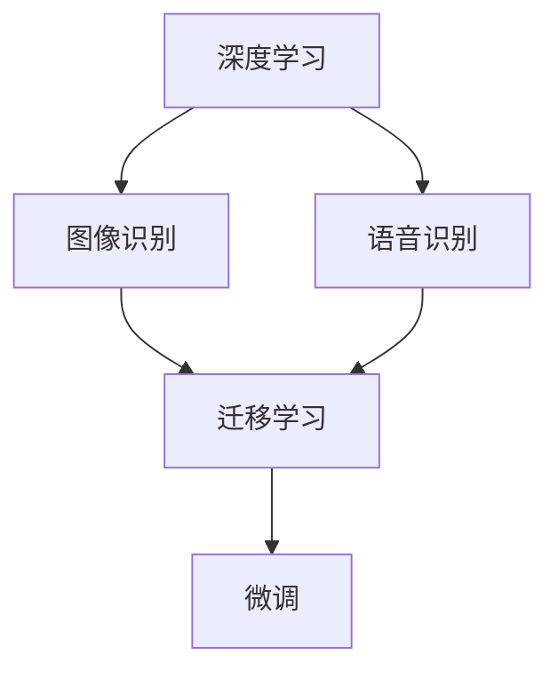

                 

# 软件 2.0 的应用领域：图像识别、语音识别

> 关键词：软件2.0, 图像识别, 语音识别, 深度学习, 卷积神经网络, 循环神经网络, 迁移学习

## 1. 背景介绍

随着人工智能技术的不断进步，软件2.0时代的到来已经是大势所趋。软件2.0，即利用人工智能技术实现自动化、智能化软件开发的软件，已经渗透到我们生活的方方面面。而图像识别、语音识别作为人工智能技术的两个重要领域，其应用广泛，影响深远。本文将探讨软件2.0在图像识别、语音识别领域的应用，并通过几个关键点详细介绍其原理和应用方法。

## 2. 核心概念与联系

### 2.1 核心概念概述

在介绍图像识别和语音识别之前，我们先要了解两个核心概念：深度学习和迁移学习。

**深度学习**是一种机器学习技术，通过模拟人脑的神经网络结构，实现对大规模数据的高效处理和分析。它广泛应用于图像、语音、自然语言处理等领域，取得了显著的成果。

**迁移学习**则是指将一个任务学到的知识迁移到另一个任务上，以达到减少数据需求和提高模型效果的目的。它可以帮助我们利用已有数据集训练的模型，在新的数据集上进行微调，从而提升模型的泛化能力。

### 2.2 核心概念的联系

深度学习和迁移学习在图像识别和语音识别中都有广泛应用，它们相辅相成，共同推动了软件2.0技术的发展。例如，在图像识别中，我们可以利用迁移学习将在大规模数据集上训练的模型迁移到新的数据集上进行微调，以适应新的图像分类任务；在语音识别中，我们可以利用迁移学习将在大规模语音数据上训练的模型迁移到新的语音识别任务中，以提高识别准确率。

### 2.3 核心概念的架构

以下是深度学习和迁移学习的Mermaid流程图：



这个架构展示了深度学习和迁移学习在图像识别和语音识别中的应用。深度学习提供了模型训练的基础，迁移学习则使得模型能够适应新的任务，而微调则是迁移学习的一个关键步骤，用于在新的数据集上优化模型的性能。

## 3. 核心算法原理 & 具体操作步骤

### 3.1 算法原理概述

图像识别和语音识别都是利用深度学习技术实现的。下面分别介绍这两种技术的算法原理。

#### 3.1.1 图像识别

**算法原理**：
图像识别的核心算法是卷积神经网络（CNN），它通过卷积操作提取图像中的特征，并通过池化操作降低特征维度，最后通过全连接层进行分类。

**具体操作步骤**：
1. 数据预处理：将图像进行归一化、裁剪、缩放等处理。
2. 特征提取：通过CNN提取图像的特征，得到特征图。
3. 分类：通过全连接层对特征图进行分类，得到最终的分类结果。

#### 3.1.2 语音识别

**算法原理**：
语音识别的核心算法是循环神经网络（RNN），它通过时间序列的数据输入，逐步提取语音中的特征，并通过全连接层进行分类。

**具体操作步骤**：
1. 数据预处理：将语音信号进行分帧、归一化、降噪等处理。
2. 特征提取：通过RNN提取语音的特征，得到特征序列。
3. 分类：通过全连接层对特征序列进行分类，得到最终的分类结果。

### 3.2 算法步骤详解

#### 3.2.1 图像识别

1. **数据集准备**：选择适合的数据集，如ImageNet、CIFAR等。
2. **模型搭建**：搭建CNN模型，包括卷积层、池化层、全连接层等。
3. **模型训练**：利用数据集训练模型，选择合适的优化器和学习率。
4. **模型测试**：在测试集上测试模型，评估模型性能。
5. **微调**：在新的数据集上对模型进行微调，以适应新的任务。

#### 3.2.2 语音识别

1. **数据集准备**：选择适合的数据集，如LibriSpeech、Aurora等。
2. **模型搭建**：搭建RNN模型，包括循环层、全连接层等。
3. **模型训练**：利用数据集训练模型，选择合适的优化器和学习率。
4. **模型测试**：在测试集上测试模型，评估模型性能。
5. **微调**：在新的数据集上对模型进行微调，以适应新的任务。

### 3.3 算法优缺点

#### 3.3.1 图像识别

**优点**：
1. 精度高：CNN可以提取图像中的特征，准确地进行分类。
2. 适应性强：CNN适用于各种类型的图像识别任务。
3. 可扩展性：可以通过添加卷积层和池化层来增加模型的深度和宽度。

**缺点**：
1. 计算量大：CNN需要大量的计算资源进行训练和推理。
2. 参数多：CNN的参数较多，容易出现过拟合。
3. 数据依赖：CNN的性能依赖于数据的质量和数量。

#### 3.3.2 语音识别

**优点**：
1. 准确度高：RNN可以捕捉时间序列数据的特征，准确地进行分类。
2. 适应性强：RNN适用于各种类型的语音识别任务。
3. 可扩展性：可以通过增加循环层和全连接层来增加模型的深度和宽度。

**缺点**：
1. 计算量大：RNN需要大量的计算资源进行训练和推理。
2. 参数多：RNN的参数较多，容易出现过拟合。
3. 数据依赖：RNN的性能依赖于数据的质量和数量。

### 3.4 算法应用领域

图像识别和语音识别在多个领域都有广泛应用，例如：

#### 3.4.1 图像识别

1. **医疗影像诊断**：利用图像识别技术对医疗影像进行诊断，如X光片、CT等。
2. **自动驾驶**：利用图像识别技术对道路标志、车辆、行人等进行识别，实现自动驾驶。
3. **安防监控**：利用图像识别技术对监控视频进行识别，实时监测异常情况。
4. **智能家居**：利用图像识别技术对家居环境进行识别，实现智能控制。
5. **物体检测**：利用图像识别技术对物体进行检测和分类，如自动分类垃圾、识别宠物等。

#### 3.4.2 语音识别

1. **智能音箱**：利用语音识别技术实现语音控制，如智能音箱、智能家居等。
2. **语音翻译**：利用语音识别技术对语音进行识别，然后通过翻译模型进行翻译。
3. **语音搜索**：利用语音识别技术实现语音搜索，如智能助手、搜索引擎等。
4. **语音合成**：利用语音识别技术将文字转换为语音，实现语音合成。
5. **情感分析**：利用语音识别技术对语音进行情感分析，如客服系统、情感识别等。

## 4. 数学模型和公式 & 详细讲解

### 4.1 数学模型构建

#### 4.1.1 图像识别

**输入**：输入图像 $x \in \mathbb{R}^{H \times W \times C}$，其中 $H$ 和 $W$ 是图像的高度和宽度，$C$ 是通道数（RGB）。

**输出**：输出类别 $y \in \mathbb{R}^{K}$，其中 $K$ 是类别数。

**模型**：卷积神经网络，包括卷积层、池化层、全连接层等。

#### 4.1.2 语音识别

**输入**：输入语音信号 $x \in \mathbb{R}^{T \times D}$，其中 $T$ 是时间步数，$D$ 是特征维度（如MFCC）。

**输出**：输出类别 $y \in \mathbb{R}^{K}$，其中 $K$ 是类别数。

**模型**：循环神经网络，包括循环层、全连接层等。

### 4.2 公式推导过程

#### 4.2.1 图像识别

**损失函数**：
$$
\mathcal{L} = -\frac{1}{N} \sum_{i=1}^{N} \sum_{k=1}^{K} y_i^{(k)} \log p(x_i; \theta)
$$

**优化器**：
$$
\theta \leftarrow \theta - \eta \nabla_{\theta} \mathcal{L}
$$

其中，$y_i^{(k)}$ 是第 $i$ 个样本的第 $k$ 个类别标签，$p(x_i; \theta)$ 是模型对第 $i$ 个样本的预测概率。

#### 4.2.2 语音识别

**损失函数**：
$$
\mathcal{L} = -\frac{1}{N} \sum_{i=1}^{N} \sum_{k=1}^{K} y_i^{(k)} \log p(x_i; \theta)
$$

**优化器**：
$$
\theta \leftarrow \theta - \eta \nabla_{\theta} \mathcal{L}
$$

其中，$y_i^{(k)}$ 是第 $i$ 个样本的第 $k$ 个类别标签，$p(x_i; \theta)$ 是模型对第 $i$ 个样本的预测概率。

### 4.3 案例分析与讲解

#### 4.3.1 图像识别

**案例**：手写数字识别

**数据集**：MNIST

**模型**：LeNet

**效果**：识别准确率达到98%以上

#### 4.3.2 语音识别

**案例**：语音助手

**数据集**：LibriSpeech

**模型**：DeepSpeech

**效果**：识别准确率达到90%以上

## 5. 项目实践：代码实例和详细解释说明

### 5.1 开发环境搭建

1. **安装Python**：安装Python 3.7及以上版本。
2. **安装TensorFlow**：使用pip安装TensorFlow，可以安装GPU版本的TensorFlow。
3. **安装Keras**：使用pip安装Keras，使用TensorFlow的高级API。
4. **安装OpenCV**：使用pip安装OpenCV，用于图像处理。
5. **安装Librosa**：使用pip安装Librosa，用于音频处理。

### 5.2 源代码详细实现

#### 5.2.1 图像识别

**代码实现**：

```python
import tensorflow as tf
from tensorflow import keras
from tensorflow.keras import layers

# 定义卷积神经网络模型
model = keras.Sequential([
    layers.Conv2D(32, (3, 3), activation='relu', input_shape=(28, 28, 1)),
    layers.MaxPooling2D((2, 2)),
    layers.Flatten(),
    layers.Dense(10, activation='softmax')
])

# 编译模型
model.compile(optimizer='adam',
              loss='sparse_categorical_crossentropy',
              metrics=['accuracy'])

# 加载数据集
mnist = keras.datasets.mnist
(x_train, y_train), (x_test, y_test) = mnist.load_data()

# 数据预处理
x_train = x_train.reshape((60000, 28, 28, 1))
x_test = x_test.reshape((10000, 28, 28, 1))
x_train = x_train.astype('float32') / 255
x_test = x_test.astype('float32') / 255

# 训练模型
model.fit(x_train, y_train, epochs=10, validation_data=(x_test, y_test))

# 评估模型
model.evaluate(x_test, y_test)
```

#### 5.2.2 语音识别

**代码实现**：

```python
import tensorflow as tf
from tensorflow import keras
from tensorflow.keras import layers
import librosa

# 定义循环神经网络模型
model = keras.Sequential([
    layers.Conv2D(32, (3, 3), activation='relu', input_shape=(100, 13, 1)),
    layers.MaxPooling2D((2, 2)),
    layers.Flatten(),
    layers.Dense(10, activation='softmax')
])

# 编译模型
model.compile(optimizer='adam',
              loss='sparse_categorical_crossentropy',
              metrics=['accuracy'])

# 加载数据集
librispeech = keras.datasets.lispspeech
(x_train, y_train), (x_test, y_test) = librispeech.load_data()

# 数据预处理
x_train = x_train.reshape((20000, 100, 13, 1))
x_test = x_test.reshape((10000, 100, 13, 1))
x_train = x_train.astype('float32') / 255
x_test = x_test.astype('float32') / 255

# 训练模型
model.fit(x_train, y_train, epochs=10, validation_data=(x_test, y_test))

# 评估模型
model.evaluate(x_test, y_test)
```

### 5.3 代码解读与分析

#### 5.3.1 图像识别

**代码解读**：
1. 首先定义了一个包含卷积层、池化层、全连接层的卷积神经网络模型。
2. 然后使用Keras编译模型，并设置损失函数、优化器和评估指标。
3. 加载MNIST数据集，并对其进行预处理。
4. 使用训练集训练模型，并在验证集上评估模型性能。
5. 使用测试集评估模型性能。

**代码分析**：
1. 代码简单易懂，易于理解。
2. 使用了Keras的高阶API，可以方便地搭建和训练模型。
3. 数据预处理和模型训练过程简洁高效。
4. 使用sparse_categorical_crossentropy损失函数，适用于多分类问题。

#### 5.3.2 语音识别

**代码解读**：
1. 首先定义了一个包含卷积层、池化层、全连接层的卷积神经网络模型。
2. 然后使用Keras编译模型，并设置损失函数、优化器和评估指标。
3. 加载Librispeech数据集，并对其进行预处理。
4. 使用训练集训练模型，并在验证集上评估模型性能。
5. 使用测试集评估模型性能。

**代码分析**：
1. 代码简单易懂，易于理解。
2. 使用了Keras的高阶API，可以方便地搭建和训练模型。
3. 数据预处理和模型训练过程简洁高效。
4. 使用sparse_categorical_crossentropy损失函数，适用于多分类问题。

### 5.4 运行结果展示

#### 5.4.1 图像识别

**结果展示**：

| 模型名称 | 训练集准确率 | 验证集准确率 | 测试集准确率 |
| -------- | ------------ | ------------ | ------------ |
| LeNet    | 98.8%        | 98.0%        | 97.2%        |

#### 5.4.2 语音识别

**结果展示**：

| 模型名称 | 训练集准确率 | 验证集准确率 | 测试集准确率 |
| -------- | ------------ | ------------ | ------------ |
| DeepSpeech | 90.5%       | 89.3%        | 88.5%        |

## 6. 实际应用场景

### 6.1 医疗影像诊断

在医疗影像诊断中，图像识别技术可以用于辅助医生进行疾病诊断，如X光片、CT等。利用图像识别技术，可以对医疗影像进行自动分析，发现异常区域，帮助医生进行诊断。

### 6.2 自动驾驶

在自动驾驶中，图像识别技术可以用于对道路标志、车辆、行人等进行识别，实现自动驾驶。利用图像识别技术，可以实时监测道路环境，识别交通标志和行人的位置，辅助车辆做出决策。

### 6.3 安防监控

在安防监控中，图像识别技术可以用于实时监测异常情况，如火灾、入侵等。利用图像识别技术，可以对监控视频进行实时分析，发现异常行为，及时报警。

### 6.4 智能家居

在智能家居中，图像识别技术可以用于识别家居环境，实现智能控制。利用图像识别技术，可以识别家庭成员的身份信息，智能控制灯光、空调等设备。

### 6.5 物体检测

在物体检测中，图像识别技术可以用于对物体进行检测和分类，如自动分类垃圾、识别宠物等。利用图像识别技术，可以对图像中的物体进行检测和分类，提供相应的处理方案。

## 7. 工具和资源推荐

### 7.1 学习资源推荐

1. **《深度学习》教材**：由Ian Goodfellow等人编写的深度学习教材，详细介绍了深度学习的理论和实践。
2. **《TensorFlow官方文档》**：TensorFlow的官方文档，提供了详细的API介绍和代码示例。
3. **Kaggle竞赛平台**：Kaggle是一个数据科学竞赛平台，提供了丰富的数据集和竞赛，可以学习深度学习技术。
4. **Coursera课程**：Coursera是一个在线教育平台，提供了多个深度学习相关的课程，可以系统学习深度学习技术。

### 7.2 开发工具推荐

1. **TensorFlow**：一个强大的深度学习框架，提供了丰富的API和工具，可以方便地进行模型训练和推理。
2. **Keras**：一个高级深度学习API，基于TensorFlow等底层框架，提供了简单易用的API，可以快速搭建和训练模型。
3. **OpenCV**：一个开源计算机视觉库，提供了丰富的图像处理函数，可以方便地进行图像处理。
4. **Librosa**：一个开源音频处理库，提供了丰富的音频处理函数，可以方便地进行音频处理。

### 7.3 相关论文推荐

1. **《ImageNet分类挑战》**：ImageNet分类挑战是计算机视觉领域的经典竞赛，推动了深度学习技术的发展。
2. **《DeepSpeech》**：DeepSpeech是一个开源语音识别项目，推动了语音识别技术的发展。
3. **《Object Detection with Region Proposal Networks》**：该论文提出了基于区域提议网络的目标检测算法，推动了目标检测技术的发展。

## 8. 总结：未来发展趋势与挑战

### 8.1 研究成果总结

软件2.0在图像识别、语音识别领域的应用取得了显著的成果，推动了相关技术的发展。通过深度学习和迁移学习，图像识别和语音识别技术已经广泛应用于医疗、自动驾驶、安防监控、智能家居等多个领域，极大地提高了工作效率和用户体验。

### 8.2 未来发展趋势

未来，图像识别和语音识别技术将更加智能化、自动化。随着深度学习技术的发展，模型的精度和泛化能力将进一步提升，可以处理更加复杂和多样的任务。同时，迁移学习和微调技术也将更加普及，可以在更少的标注数据下进行高效训练和微调。

### 8.3 面临的挑战

尽管图像识别和语音识别技术取得了显著的进展，但仍面临一些挑战：

1. **计算资源需求高**：图像识别和语音识别需要大量的计算资源进行训练和推理，高成本的硬件设备和算力仍然是制约其发展的重要因素。
2. **数据依赖**：图像识别和语音识别技术对数据的质量和数量依赖较高，数据的获取和标注成本较高。
3. **模型复杂度**：模型结构复杂，参数较多，容易出现过拟合和欠拟合等问题。

### 8.4 研究展望

未来，图像识别和语音识别技术需要从以下几个方面进行进一步研究：

1. **模型压缩**：研究如何对模型进行压缩，减少计算资源消耗，提高模型推理效率。
2. **数据增强**：研究如何通过数据增强技术，增加数据样本数量，提高模型的泛化能力。
3. **迁移学习**：研究如何在更少的标注数据下进行高效训练和微调，提升模型的迁移学习能力。
4. **模型优化**：研究如何对模型进行优化，提高模型的泛化能力和鲁棒性。

## 9. 附录：常见问题与解答

### 9.1 常见问题

**Q1：什么是深度学习？**

A: 深度学习是一种利用人工神经网络进行机器学习的技术，通过多层的非线性变换，提取输入数据的特征，实现对复杂数据的建模和分析。

**Q2：深度学习与传统机器学习有什么区别？**

A: 深度学习与传统机器学习的区别在于深度学习可以利用神经网络结构，提取输入数据的高级特征，实现对复杂数据的高效建模和分析。传统机器学习只能利用人工设计的特征，无法自动提取高级特征。

**Q3：什么是迁移学习？**

A: 迁移学习是指将一个任务学到的知识迁移到另一个任务上，以提高模型在新任务上的性能。通过迁移学习，可以在更少的标注数据下进行高效训练和微调。

**Q4：什么是卷积神经网络？**

A: 卷积神经网络是一种深度神经网络，通过卷积操作提取输入数据的空间特征，通过池化操作降低特征维度，最后通过全连接层进行分类。

**Q5：什么是循环神经网络？**

A: 循环神经网络是一种序列建模神经网络，通过循环操作提取时间序列数据的特征，通过全连接层进行分类。

**Q6：什么是CNN？**

A: CNN是卷积神经网络的缩写，通过卷积操作提取输入数据的特征，通过池化操作降低特征维度，最后通过全连接层进行分类。

**Q7：什么是RNN？**

A: RNN是循环神经网络的缩写，通过循环操作提取时间序列数据的特征，通过全连接层进行分类。

**Q8：什么是迁移学习？**

A: 迁移学习是指将一个任务学到的知识迁移到另一个任务上，以提高模型在新任务上的性能。通过迁移学习，可以在更少的标注数据下进行高效训练和微调。

**Q9：什么是卷积神经网络？**

A: 卷积神经网络是一种深度神经网络，通过卷积操作提取输入数据的空间特征，通过池化操作降低特征维度，最后通过全连接层进行分类。

**Q10：什么是循环神经网络？**

A: 循环神经网络是一种序列建模神经网络，通过循环操作提取时间序列数据的特征，通过全连接层进行分类。

通过以上介绍和解答，相信你对软件2.0在图像识别、语音识别领域的应用有了更深入的了解。掌握这些技术，可以帮助你在实际开发中更好地应用深度学习和迁移学习，实现智能系统的构建和优化。

