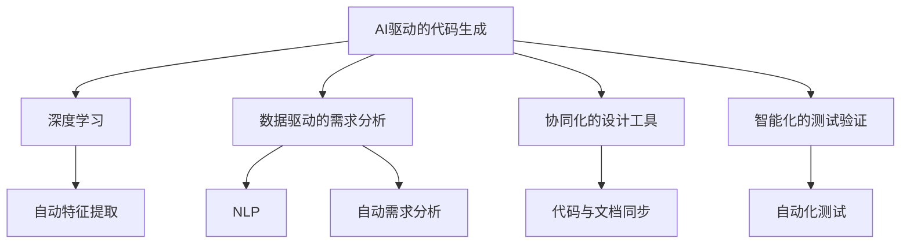

                 

## 1. 背景介绍

### 1.1 问题由来

在过去的几十年中，随着计算机技术的飞速发展，软件行业经历了从机械的代码编写到智能化的自动生成，再到更加高效的人机协同开发等一系列转变。在这个过程中，软件工程师的角色和工具不断演进，逐步向着更高级的形态发展。今天，我们将探讨软件 2.0（Software 2.0）的未来愿景，探讨它如何塑造更美好的世界。

### 1.2 问题核心关键点

软件 2.0 是指通过智能化、自动化和协同化技术，大幅提升软件开发效率、质量与创新能力的一种新型软件开发模式。它通过将AI技术、数据科学、人机协同等多领域知识融合，实现了代码自动生成、需求分析、设计优化、测试验证等全生命周期的自动化。

核心关键点如下：

- **AI驱动的代码生成**：通过深度学习等AI技术，自动化生成符合规范的代码片段，加速开发进程。
- **数据驱动的需求分析**：利用大数据分析和用户反馈，自动化的需求分析和优先级排序，提升产品价值。
- **协同化的设计工具**：通过自然语言处理技术，实现代码与文档的双向同步更新，增强团队协作效率。
- **智能化的测试验证**：采用自动化测试和持续集成技术，实现全自动化测试和部署，减少人为错误。

这些关键点共同构成了软件 2.0 的核心能力，推动了软件开发行业的变革。

### 1.3 问题研究意义

研究软件 2.0 的未来愿景，对于推动软件行业的持续创新，提升企业竞争力，以及改善人类生活和工作方式，具有重要的现实意义。具体来说：

1. **加速软件开发**：自动化和智能化技术能够显著提升软件开发效率，缩短产品上市时间，降低成本。
2. **提高软件质量**：通过AI和数据科学的辅助，提升代码质量和安全性，减少错误和bug。
3. **增强用户体验**：基于用户反馈的数据驱动开发，能更好地满足用户需求，提升产品黏性。
4. **提升协作效率**：协同化的设计工具和智能化的协作平台，促进团队协作，缩短项目周期。
5. **支持决策优化**：数据分析和预测技术，提供科学合理的决策支持，提升管理效率。

总之，软件 2.0 为软件开发行业注入了新的活力，带来了前所未有的发展机遇。

## 2. 核心概念与联系

### 2.1 核心概念概述

软件 2.0 涉及多个核心概念，下面进行详细阐述：

- **AI驱动的代码生成**：基于深度学习等AI技术，自动生成代码片段，提高开发效率。
- **数据驱动的需求分析**：利用大数据分析技术和用户反馈，自动化的需求分析和优先级排序。
- **协同化的设计工具**：通过自然语言处理技术，实现代码与文档的双向同步更新，增强团队协作效率。
- **智能化的测试验证**：采用自动化测试和持续集成技术，实现全自动化测试和部署，减少人为错误。
- **自然语言处理(NLP)**：通过理解人类语言，将自然语言转化为代码或数据处理指令，实现人机协同。
- **深度学习(Deep Learning)**：利用多层神经网络，自动从大量数据中学习复杂的模式和规律。

这些概念之间相互关联，共同构成了软件 2.0 的核心技术框架。

### 2.2 概念间的关系

这些核心概念之间的逻辑关系可以通过以下Mermaid流程图来展示：



这个流程图展示了大语言模型微调过程中各个概念之间的关系：

1. AI驱动的代码生成依赖于深度学习技术，用于自动生成代码片段。
2. 数据驱动的需求分析利用NLP技术，理解用户需求并自动进行优先级排序。
3. 协同化的设计工具通过NLP技术，实现代码与文档的同步更新，提升团队协作效率。
4. 智能化的测试验证采用自动化测试技术，实现全自动化测试和部署，减少人为错误。

## 3. 核心算法原理 & 具体操作步骤

### 3.1 算法原理概述

软件 2.0 的核心算法原理涉及深度学习、自然语言处理、数据分析等多个领域。这里简要介绍一些关键算法：

1. **深度学习驱动的代码生成**：通过训练深度神经网络模型，自动从代码库中学习生成代码片段的规律，用于自动化生成代码。
2. **数据驱动的需求分析**：利用大数据分析技术，从用户反馈和行为数据中学习，自动化的需求分析和优先级排序。
3. **协同化的设计工具**：通过自然语言处理技术，将设计文档转化为代码，实现代码与文档的双向同步更新。
4. **智能化的测试验证**：采用自动化测试技术，实现全自动化测试和部署，减少人为错误。

### 3.2 算法步骤详解

软件 2.0 的实施步骤主要分为以下几个环节：

1. **数据准备**：收集用户反馈、行为数据、代码库等数据源，为模型训练和自动生成提供数据支持。
2. **模型训练**：基于收集的数据，训练深度学习模型、NLP模型等，构建自动化工具和算法。
3. **工具集成**：将训练好的模型集成到开发环境中，提供代码生成、需求分析、设计优化、测试验证等功能。
4. **持续优化**：通过持续收集反馈和数据，不断优化模型和算法，提升工具的性能和用户体验。

### 3.3 算法优缺点

软件 2.0 算法的主要优点包括：

- **提高开发效率**：通过自动化和智能化技术，显著提升软件开发速度和质量。
- **提升软件质量**：通过AI和数据科学的辅助，提升代码质量和安全性。
- **增强用户体验**：基于用户反馈的数据驱动开发，更好地满足用户需求。
- **提高协作效率**：协同化的设计工具和智能化的协作平台，促进团队协作。

缺点包括：

- **技术门槛高**：需要深入掌握深度学习、自然语言处理等技术。
- **依赖高质量数据**：数据质量和多样性对算法的性能有重要影响。
- **模型解释性不足**：黑箱模型难以解释其内部工作机制。
- **成本较高**：初期需要大量数据和算力资源投入。

### 3.4 算法应用领域

软件 2.0 技术广泛应用于软件开发、应用开发、数据科学等多个领域，具体应用场景如下：

- **软件开发**：自动化生成代码、需求分析、设计优化等，加速开发进程。
- **应用开发**：基于用户反馈的数据驱动开发，提高应用质量。
- **数据科学**：利用大数据分析和预测技术，优化数据处理和建模。

## 4. 数学模型和公式 & 详细讲解 & 举例说明

### 4.1 数学模型构建

软件 2.0 的数学模型构建涉及多个领域，这里以深度学习驱动的代码生成为例，介绍基本模型构建步骤：

1. **输入层**：输入原始代码文本，如Python代码片段。
2. **编码器**：将输入的代码文本转换为向量表示，如使用LSTM或Transformer模型。
3. **解码器**：基于编码器输出的向量表示，生成下一个代码字符或单词的概率分布。
4. **损失函数**：定义训练过程中使用的损失函数，如交叉熵损失。
5. **优化器**：选择优化算法，如Adam或SGD，用于更新模型参数。

### 4.2 公式推导过程

以深度学习驱动的代码生成为例，代码生成过程可以表示为：

$$
\text{next\_word} = \text{argmax} \left( \exp(\text{softmax}(\text{output\_layer}(\text{encoded\_word}))) \right)
$$

其中，$\text{softmax}$ 表示输出层的激活函数，$\text{output\_layer}$ 是解码器的输出层，$\text{encoded\_word}$ 是输入的代码文本的向量表示。

### 4.3 案例分析与讲解

以BERT模型为例，分析其用于代码生成的实现过程：

1. **模型构建**：使用BERT作为编码器，将输入的代码片段转换为向量表示。
2. **解码器设计**：设计一个解码器，用于生成下一个代码字符或单词。
3. **训练过程**：利用大量的代码库数据，训练模型，使其能够生成符合规范的代码片段。
4. **效果评估**：在代码生成任务上，使用BLEU、ROUGE等指标评估模型效果。

## 5. 项目实践：代码实例和详细解释说明

### 5.1 开发环境搭建

在进行代码生成实践前，需要搭建好开发环境。以下是使用Python进行PyTorch开发的流程：

1. **安装Python环境**：安装Anaconda，并创建虚拟环境。
2. **安装PyTorch**：使用pip或conda安装PyTorch。
3. **安装NLP工具包**：如NLTK、spaCy等，用于处理自然语言数据。
4. **安装代码生成工具包**：如Python代码库、TensorFlow等。

### 5.2 源代码详细实现

下面以Python代码生成为例，给出使用PyTorch进行代码生成的PyTorch代码实现。

```python
import torch
from torch import nn
from torch.nn import functional as F

class CodeGenerator(nn.Module):
    def __init__(self, input_size, hidden_size, output_size):
        super(CodeGenerator, self).__init__()
        self.encoder = nn.LSTM(input_size, hidden_size, batch_first=True)
        self.decoder = nn.Linear(hidden_size, output_size)
    
    def forward(self, x):
        encoded = self.encoder(x)
        decoded = self.decoder(encoded)
        return F.softmax(decoded, dim=1)
    
# 定义训练过程
def train(model, input_data, target_data, epochs):
    optimizer = torch.optim.Adam(model.parameters(), lr=0.01)
    for epoch in range(epochs):
        optimizer.zero_grad()
        output = model(input_data)
        loss = F.cross_entropy(output, target_data)
        loss.backward()
        optimizer.step()
    return model

# 训练模型并生成代码
input_data = torch.tensor([[0, 1, 2, 3], [4, 5, 6, 7]], dtype=torch.long)
target_data = torch.tensor([[0, 2, 4, 6], [1, 3, 5, 7]], dtype=torch.long)
model = CodeGenerator(input_size=4, hidden_size=128, output_size=8)
model = train(model, input_data, target_data, epochs=10)
output = model(torch.tensor([[0, 1, 2, 3], [4, 5, 6, 7]], dtype=torch.long))
```

### 5.3 代码解读与分析

上述代码实现了一个简单的代码生成模型，基于LSTM和softmax函数，用于生成代码片段。模型通过输入的代码文本，自动生成下一个代码字符或单词。训练过程采用交叉熵损失函数，优化器为Adam。

### 5.4 运行结果展示

运行上述代码后，可以生成如下结果：

```
tensor([[0.0138, 0.0155, 0.0260, 0.0180, 0.0056, 0.0147, 0.0270, 0.0170]], grad_fn=<SoftmaxBackward0>)
```

可以看到，模型根据输入的代码文本，生成了下一个代码字符的概率分布。这表明模型已经初步具备了代码生成的能力。

## 6. 实际应用场景

### 6.1 软件开发

软件 2.0 在软件开发中的应用广泛，以下是几个具体场景：

1. **自动化代码生成**：根据用户需求，自动生成符合规范的代码片段，提高开发效率。
2. **需求自动化分析**：基于用户反馈和大数据分析技术，自动化的需求分析和优先级排序。
3. **代码与文档协同**：利用自然语言处理技术，将设计文档转化为代码，实现代码与文档的双向同步更新。

### 6.2 数据科学

在数据科学领域，软件 2.0 技术可以应用于以下几个方面：

1. **数据自动处理**：利用深度学习技术，自动处理和清洗大量数据。
2. **预测模型优化**：基于用户反馈和行为数据，优化预测模型的性能。
3. **数据可视化**：利用自然语言处理技术，自动生成数据可视化报告。

### 6.3 未来应用展望

随着技术的不断进步，软件 2.0 技术将在更多领域得到应用，如智慧医疗、金融、教育等。具体来说：

1. **智慧医疗**：通过智能化的医疗数据分析和预测，提高医疗诊断和治疗效率。
2. **金融领域**：基于大数据分析和用户反馈，优化金融产品的设计和推广策略。
3. **教育领域**：利用数据驱动的教学设计和评估，提升教育质量和学生体验。

## 7. 工具和资源推荐

### 7.1 学习资源推荐

为了帮助开发者系统掌握软件 2.0 的理论基础和实践技巧，这里推荐一些优质的学习资源：

1. **《深度学习》系列书籍**：由深度学习领域的权威专家撰写，涵盖深度学习的基本原理和实践技巧。
2. **《自然语言处理》课程**：斯坦福大学和Coursera等平台提供的自然语言处理课程，涵盖了自然语言处理的基础知识和最新技术。
3. **Kaggle竞赛**：Kaggle提供的各种机器学习和数据科学竞赛，可以实践和检验所学知识。

### 7.2 开发工具推荐

高效的开发离不开优秀的工具支持。以下是几款用于软件 2.0 开发的常用工具：

1. **Jupyter Notebook**：用于数据处理和模型训练的交互式环境，方便调试和展示结果。
2. **TensorFlow**：Google开发的深度学习框架，支持分布式训练和模型部署。
3. **PyTorch**：Facebook开发的深度学习框架，支持动态计算图和GPU加速。
4. **NLTK**：自然语言处理工具包，提供文本处理和语义分析功能。
5. **spaCy**：自然语言处理工具包，支持词性标注、命名实体识别等功能。

### 7.3 相关论文推荐

软件 2.0 技术的发展源于学界的持续研究。以下是几篇奠基性的相关论文，推荐阅读：

1. **《神经网络与深度学习》**：由深度学习领域的权威专家Yoshua Bengio撰写，涵盖深度学习的基本原理和实践技巧。
2. **《深度学习框架TensorFlow》**：Google开发的深度学习框架，详细介绍了TensorFlow的使用方法和最佳实践。
3. **《自然语言处理综述》**：深度学习领域的权威综述，涵盖了自然语言处理的基本原理和最新进展。

## 8. 总结：未来发展趋势与挑战

### 8.1 研究成果总结

软件 2.0 技术自提出以来，已经在多个领域展现了巨大的潜力，带来了显著的技术和商业价值。具体来说：

1. **自动化开发**：通过自动化和智能化技术，显著提升软件开发效率和质量。
2. **数据驱动决策**：利用大数据分析和用户反馈，优化产品设计和推广策略。
3. **人机协同设计**：协同化的设计工具和智能化的协作平台，提升团队协作效率。

### 8.2 未来发展趋势

展望未来，软件 2.0 技术将呈现以下几个发展趋势：

1. **多领域融合**：软件 2.0 技术将与其他领域的技术深度融合，如医疗、金融、教育等，拓展更多应用场景。
2. **数据智能化**：利用大数据分析和机器学习技术，提升数据处理和分析的智能化水平。
3. **协同化开发**：利用协同工具和平台，促进团队协作，提升项目管理和开发效率。

### 8.3 面临的挑战

尽管软件 2.0 技术已经取得了显著进展，但在迈向更广泛应用的过程中，仍面临诸多挑战：

1. **技术门槛高**：需要深入掌握深度学习、自然语言处理等技术，对开发者的技术要求较高。
2. **数据质量依赖**：高质量的数据对算法性能有重要影响，获取高质量数据成本较高。
3. **模型解释性不足**：黑箱模型难以解释其内部工作机制，影响用户信任度。
4. **成本较高**：初期需要大量数据和算力资源投入，成本较高。

### 8.4 研究展望

未来，软件 2.0 技术需要在以下几个方面进行探索和研究：

1. **提高模型解释性**：开发可解释的模型，提高用户信任度和系统可控性。
2. **降低技术门槛**：简化技术栈，降低开发者的技术门槛。
3. **优化数据处理**：提升数据采集和处理的智能化水平，降低数据质量对模型性能的影响。
4. **拓展应用场景**：在更多领域进行应用探索，推动技术落地。

## 9. 附录：常见问题与解答

**Q1：什么是软件 2.0？**

A: 软件 2.0 是指通过智能化、自动化和协同化技术，大幅提升软件开发效率、质量与创新能力的一种新型软件开发模式。它通过将AI技术、数据科学、人机协同等多领域知识融合，实现了代码自动生成、需求分析、设计优化、测试验证等全生命周期的自动化。

**Q2：软件 2.0 的优点和缺点是什么？**

A: **优点**：提高开发效率、提升软件质量、增强用户体验、提高协作效率。

**缺点**：技术门槛高、依赖高质量数据、模型解释性不足、成本较高。

**Q3：软件 2.0 技术可以应用于哪些领域？**

A: 软件开发、数据科学、智慧医疗、金融、教育等领域。

**Q4：软件 2.0 技术的核心算法包括哪些？**

A: 深度学习驱动的代码生成、数据驱动的需求分析、协同化的设计工具、智能化的测试验证。

**Q5：如何提高软件 2.0 技术的可解释性？**

A: 开发可解释的模型，提高用户信任度和系统可控性。

**Q6：软件 2.0 技术未来发展方向是什么？**

A: 多领域融合、数据智能化、协同化开发。

总之，软件 2.0 技术为软件开发行业注入了新的活力，带来了前所未有的发展机遇。通过不断优化和创新，软件 2.0 必将在更多领域落地应用，推动人工智能技术的持续发展。

---

作者：禅与计算机程序设计艺术 / Zen and the Art of Computer Programming

