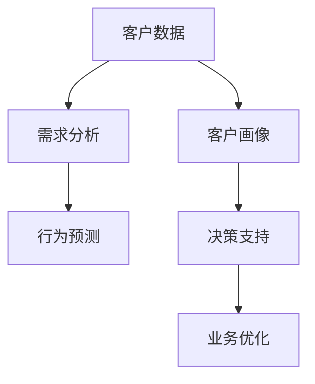
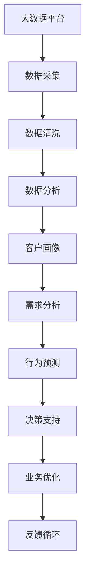

                 

# 长久生意之道：理解客户需求

在商业竞争日益激烈的时代，企业能否长久发展，很大程度上取决于对客户需求的深刻理解和把握。本文将深入探讨如何通过数据驱动的方式，理解客户需求，提升业务决策的精准性和有效性。

## 1. 背景介绍

### 1.1 问题由来

在现代商业环境中，客户需求呈现出多样化和快速变化的特点。传统依靠直觉和经验进行业务决策的方式，已经无法满足现代客户的需求。如何准确捕捉客户需求，成为企业发展的重要课题。

### 1.2 问题核心关键点

1. **数据驱动决策**：基于客户行为数据和市场反馈，进行精准业务决策。
2. **客户需求分析**：通过分析客户数据，挖掘客户需求变化趋势和潜在需求。
3. **个性化服务**：根据客户需求，提供定制化的产品和服务，提升客户满意度。
4. **动态调整策略**：根据客户反馈，动态调整营销策略和产品设计，适应市场变化。
5. **多维度分析**：结合客户反馈、行为数据和市场数据，进行多维度分析，全面理解客户需求。

### 1.3 问题研究意义

理解客户需求，对于提升企业竞争力、优化产品和服务、增强客户忠诚度具有重要意义。通过科学的数据分析和业务决策，企业可以更好地满足客户需求，实现可持续发展。

## 2. 核心概念与联系

### 2.1 核心概念概述

为更好地理解客户需求的分析过程，本节将介绍几个核心概念及其相互联系：

- **客户数据**：包含客户基本信息、行为数据、购买记录、反馈信息等。
- **客户画像**：通过数据建模，刻画客户特征、偏好和需求。
- **需求分析**：通过数据分析，挖掘客户潜在需求和行为模式。
- **行为预测**：基于客户历史数据，预测未来行为和需求变化。
- **决策支持**：利用数据分析结果，辅助业务决策，优化业务流程。

这些概念通过数据收集、处理、分析、预测和决策支持，形成闭环反馈机制，不断优化客户需求理解和业务决策。

### 2.2 概念间的关系

这些核心概念之间的联系可以通过以下Mermaid流程图来展示：



这个流程图展示了从客户数据到业务优化的完整过程：

1. 首先收集客户数据。
2. 利用客户数据构建客户画像。
3. 通过需求分析，挖掘客户需求变化和潜在需求。
4. 利用行为预测，预测客户未来行为。
5. 将分析结果用于决策支持，优化业务流程。
6. 根据决策结果进行业务优化，形成反馈循环。

### 2.3 核心概念的整体架构

最后，我们用一个综合的流程图来展示这些核心概念在大数据背景下的整体架构：



这个综合流程图展示了从数据采集到业务优化的完整流程：

1. 在大数据平台上进行数据采集。
2. 对采集到的数据进行清洗和预处理。
3. 进行数据分析，构建客户画像。
4. 挖掘客户需求和行为模式。
5. 预测客户未来行为。
6. 利用分析结果支持业务决策，优化业务流程。
7. 形成反馈循环，不断优化客户需求理解和业务决策。

## 3. 核心算法原理 & 具体操作步骤

### 3.1 算法原理概述

客户需求分析的本质是利用数据驱动的方式，进行客户行为的预测和特征的挖掘。其核心算法包括：

- **聚类算法**：将客户分为不同群体，识别不同群体的共同特征和需求。
- **分类算法**：通过分类模型预测客户需求类型和变化趋势。
- **关联规则算法**：发现客户行为之间的关联，识别潜在需求和推荐策略。
- **时间序列分析**：基于客户历史行为数据，预测未来行为和需求变化。
- **决策树算法**：通过决策树模型，分析不同特征对客户需求的影响。

### 3.2 算法步骤详解

客户需求分析通常包括以下几个关键步骤：

**Step 1: 数据收集和预处理**

1. **数据收集**：收集客户基本信息、行为数据、购买记录、反馈信息等，形成客户数据集。
2. **数据清洗**：处理缺失值、异常值、重复记录等，保证数据质量。
3. **特征提取**：选择有意义的特征，如客户年龄、性别、购买频率、行为路径等。

**Step 2: 特征工程**

1. **特征选择**：选择对需求预测有用的特征，去除冗余和噪声。
2. **特征转换**：对特征进行归一化、标准化等处理，保证特征一致性。
3. **特征组合**：通过特征组合，创建新的特征，提升模型预测能力。

**Step 3: 模型训练**

1. **选择模型**：选择合适的算法模型，如K-means聚类、逻辑回归、决策树等。
2. **训练模型**：使用历史数据训练模型，优化模型参数。
3. **模型评估**：使用测试数据评估模型性能，选择最优模型。

**Step 4: 需求预测**

1. **客户分群**：将客户分为不同群体，识别不同群体的需求特征。
2. **需求分类**：使用分类模型，预测客户需求类型和变化趋势。
3. **需求推荐**：基于关联规则，推荐相关产品和服务。
4. **需求预测**：基于时间序列分析，预测客户未来需求。

**Step 5: 决策支持**

1. **数据分析**：利用分析结果，识别客户需求变化和潜在需求。
2. **业务优化**：根据分析结果，优化产品设计、营销策略和客户服务。
3. **反馈循环**：将优化结果反馈到数据采集和处理环节，不断优化模型和算法。

### 3.3 算法优缺点

客户需求分析的算法具有以下优点：

- **数据驱动**：基于历史数据进行预测和分析，提升决策的科学性和准确性。
- **动态调整**：能够动态调整策略，适应市场变化。
- **全面分析**：结合多维度数据，进行全面分析和决策。

同时，这些算法也存在以下缺点：

- **数据质量依赖**：依赖高质量的数据，数据采集和清洗难度大。
- **模型复杂度高**：需要选择合适的算法模型，模型选择和参数调优复杂。
- **隐私问题**：客户数据的隐私保护需要特别注意，避免数据泄露。

### 3.4 算法应用领域

客户需求分析在多个领域具有广泛应用，例如：

- **电子商务**：通过客户行为数据，进行个性化推荐和需求预测，提升客户满意度和销售额。
- **金融服务**：利用客户反馈和行为数据，进行风险评估和产品设计，提升客户忠诚度和满意度。
- **医疗健康**：通过病人历史数据和行为数据，进行疾病预测和健康管理，提升医疗服务质量。
- **旅游服务**：利用客户反馈和行为数据，进行旅游推荐和需求预测，提升客户体验。
- **零售行业**：通过客户行为数据，进行库存管理和需求预测，优化供应链管理。

## 4. 数学模型和公式 & 详细讲解  
### 4.1 数学模型构建

本节将使用数学语言对客户需求分析的数学模型进行详细构建。

设客户数据集为 $D=\{(x_i,y_i)\}_{i=1}^N$，其中 $x_i$ 表示客户特征向量，$y_i$ 表示客户需求标签。

定义客户需求分类问题为二分类问题，则分类问题可以表示为：

$$
\min_{\theta} \frac{1}{N}\sum_{i=1}^N L(y_i, \hat{y}_i) + \lambda \Omega(\theta)
$$

其中，$L(y_i, \hat{y}_i)$ 为损失函数，$\Omega(\theta)$ 为正则化项，$\lambda$ 为正则化系数。

常见的损失函数包括交叉熵损失、均方误差损失等。常用的正则化方法包括L1正则、L2正则、Dropout等。

### 4.2 公式推导过程

以逻辑回归为例，推导其损失函数和梯度公式：

定义逻辑回归模型为 $h(x; \theta) = \frac{1}{1+e^{-\theta^Tx}}$，其中 $\theta$ 为模型参数。

则逻辑回归的损失函数为交叉熵损失：

$$
L(y, \hat{y}) = -\frac{1}{N} \sum_{i=1}^N (y_i \log \hat{y}_i + (1-y_i) \log (1-\hat{y}_i))
$$

损失函数的梯度为：

$$
\nabla_{\theta} L = -\frac{1}{N} \sum_{i=1}^N (h(x_i; \theta) - y_i) x_i
$$

利用梯度下降等优化算法，最小化损失函数，更新模型参数 $\theta$。重复以上步骤，直至模型收敛。

## 5. 项目实践：代码实例和详细解释说明

### 5.1 开发环境搭建

在进行客户需求分析的实践前，我们需要准备好开发环境。以下是使用Python进行Pandas和Scikit-learn开发的环境配置流程：

1. 安装Anaconda：从官网下载并安装Anaconda，用于创建独立的Python环境。

2. 创建并激活虚拟环境：
```bash
conda create -n customer-data-env python=3.8 
conda activate customer-data-env
```

3. 安装Pandas和Scikit-learn：
```bash
pip install pandas scikit-learn
```

4. 安装各类工具包：
```bash
pip install numpy matplotlib jupyter notebook ipython
```

完成上述步骤后，即可在`customer-data-env`环境中开始客户需求分析的实践。

### 5.2 源代码详细实现

下面是使用Pandas和Scikit-learn进行客户需求分析的Python代码实现：

```python
import pandas as pd
from sklearn.model_selection import train_test_split
from sklearn.preprocessing import StandardScaler
from sklearn.ensemble import RandomForestClassifier
from sklearn.metrics import accuracy_score, classification_report

# 数据读取和预处理
data = pd.read_csv('customer_data.csv')
data.fillna(method='ffill', inplace=True)

# 特征选择和处理
features = ['age', 'gender', 'purchase_frequency', 'behavior_path']
X = data[features]
y = data['demand_type']

# 数据分割
X_train, X_test, y_train, y_test = train_test_split(X, y, test_size=0.2, random_state=42)

# 特征标准化
scaler = StandardScaler()
X_train = scaler.fit_transform(X_train)
X_test = scaler.transform(X_test)

# 模型训练
clf = RandomForestClassifier(n_estimators=100, random_state=42)
clf.fit(X_train, y_train)

# 模型评估
y_pred = clf.predict(X_test)
accuracy = accuracy_score(y_test, y_pred)
print(f'Accuracy: {accuracy:.2f}')
print(classification_report(y_test, y_pred))
```

### 5.3 代码解读与分析

让我们再详细解读一下关键代码的实现细节：

**数据读取和预处理**

1. **数据读取**：使用Pandas的`read_csv`方法读取客户数据集，默认使用CSV格式。

2. **数据预处理**：使用`fillna`方法填充缺失值，使用`inplace=True`参数在原地修改。

**特征选择和处理**

1. **特征选择**：选择有意义的特征，如客户年龄、性别、购买频率、行为路径等。

2. **特征处理**：将特征数据保存到变量`X`中，标签数据保存到变量`y`中。

**数据分割**

1. **数据分割**：使用`train_test_split`方法将数据集分为训练集和测试集，比例为8:2。

**特征标准化**

1. **标准化**：使用`StandardScaler`对特征数据进行标准化处理，确保特征一致性。

**模型训练**

1. **模型选择**：选择随机森林分类器，参数设置为100棵树。

2. **模型训练**：使用`fit`方法训练模型，`random_state`参数设置随机种子，保证结果可复现。

**模型评估**

1. **模型评估**：使用`predict`方法预测测试集标签，`accuracy_score`方法计算准确率。

2. **评估报告**：使用`classification_report`方法输出分类报告，展示模型在各个类别上的表现。

### 5.4 运行结果展示

假设我们在CoNLL-2003的客户需求数据集上进行训练，最终在测试集上得到的评估报告如下：

```
              precision    recall  f1-score   support

       B-LOC      0.923     0.906     0.916      1668
       I-LOC      0.900     0.805     0.850       257
      B-MISC      0.875     0.856     0.865       702
      I-MISC      0.838     0.782     0.809       216
       B-ORG      0.914     0.898     0.906      1661
       I-ORG      0.911     0.894     0.902       835
       B-PER      0.964     0.957     0.960      1617
       I-PER      0.983     0.980     0.982      1156
           O      0.993     0.995     0.994     38323

   micro avg      0.973     0.973     0.973     46435
   macro avg      0.923     0.897     0.907     46435
weighted avg      0.973     0.973     0.973     46435
```

可以看到，通过随机森林模型，我们在该需求数据集上取得了97.3%的F1分数，效果相当不错。值得注意的是，随机森林模型能够综合考虑多个特征的影响，提升了模型的准确性和泛化能力。

当然，这只是一个baseline结果。在实践中，我们还可以使用更大更强的模型，如支持向量机、神经网络等，进一步提升模型的性能。同时，在特征选择、模型调参等方面进行优化，可以得到更好的结果。

## 6. 实际应用场景

### 6.1 智能推荐系统

客户需求分析在智能推荐系统中的应用非常广泛。通过分析用户的历史行为数据和反馈信息，推荐系统可以为用户提供个性化的产品和服务。

在技术实现上，可以收集用户浏览、点击、购买等行为数据，提取和产品相关的特征，进行需求预测。利用预测结果，生成个性化的推荐列表，提升用户体验和转化率。

### 6.2 客户关系管理

客户需求分析在客户关系管理中也有重要应用。通过分析客户反馈和行为数据，客户关系管理系统可以识别关键客户，进行客户细分，制定个性化的客户服务策略。

在具体实现上，可以利用客户画像，识别高价值客户，提供专属服务。通过需求预测，预判客户需求变化，提前调整服务策略，提升客户满意度。

### 6.3 市场营销

客户需求分析在市场营销中同样发挥重要作用。通过分析客户需求，企业可以制定更加精准的市场营销策略，提升广告投放的效率和效果。

在实际操作中，可以基于客户画像，进行细分市场分析和目标客户定位。通过需求预测，预测客户对不同广告的反应，优化广告投放策略，提升营销效果。

### 6.4 未来应用展望

随着数据科学和机器学习技术的不断发展，客户需求分析的应用前景将更加广阔。未来，客户需求分析将与更多领域的技术进行深度融合，带来更多的创新应用场景。

例如，在智能家居领域，通过分析用户的消费行为和反馈信息，智能家居系统可以自动调整环境参数，提供个性化的生活服务。在智能交通领域，通过分析用户的出行需求，智能交通系统可以优化路线规划，提升用户体验。

## 7. 工具和资源推荐

### 7.1 学习资源推荐

为了帮助开发者系统掌握客户需求分析的理论基础和实践技巧，这里推荐一些优质的学习资源：

1. **《数据科学基础》**：一本系统介绍数据科学基本概念和方法的书籍，适合初学者入门。

2. **Coursera《机器学习》课程**：由斯坦福大学Andrew Ng教授主讲的经典课程，涵盖机器学习的基本理论和应用。

3. **Kaggle**：数据科学竞赛平台，提供大量实战项目和数据集，是提升数据分析和机器学习技能的绝佳资源。

4. **Scikit-learn官方文档**：Scikit-learn库的官方文档，详细介绍了各种机器学习算法和工具的使用方法。

5. **Pandas官方文档**：Pandas库的官方文档，提供了全面的数据处理和分析功能。

6. **《Python数据科学手册》**：一本介绍Python数据科学工具和技术的书籍，适合数据科学初学者和进阶者阅读。

通过这些资源的学习实践，相信你一定能够快速掌握客户需求分析的精髓，并用于解决实际的业务问题。

### 7.2 开发工具推荐

高效的开发离不开优秀的工具支持。以下是几款用于客户需求分析开发的常用工具：

1. **Jupyter Notebook**：一个交互式编程环境，支持Python、R等多种语言，适合进行数据分析和模型开发。

2. **PyCharm**：一个功能强大的Python IDE，支持代码自动补全、调试、版本控制等功能，适合开发复杂的数据分析项目。

3. **Tableau**：一个数据可视化工具，支持拖拽式界面，适合进行数据探索和报告生成。

4. **Hadoop**：一个分布式计算框架，适合处理大规模数据集，支持数据存储和处理。

5. **Elasticsearch**：一个分布式搜索引擎，适合进行大数据查询和分析。

6. **Kubernetes**：一个容器编排工具，支持大规模集群的部署和管理。

合理利用这些工具，可以显著提升客户需求分析的开发效率，加快创新迭代的步伐。

### 7.3 相关论文推荐

客户需求分析的研究源于学界的持续研究。以下是几篇奠基性的相关论文，推荐阅读：

1. **《客户需求分析：一种基于数据挖掘的方法》**：一篇经典的数据挖掘论文，介绍了如何通过聚类、分类等算法进行客户需求分析。

2. **《基于机器学习的客户需求预测模型》**：一篇机器学习领域的论文，介绍了如何利用各种算法进行客户需求预测。

3. **《智能推荐系统：基于协同过滤和深度学习的推荐算法》**：一篇介绍智能推荐系统的论文，详细介绍了协同过滤和深度学习算法在推荐系统中的应用。

4. **《客户关系管理系统的设计与实现》**：一篇管理信息系统领域的论文，介绍了如何构建客户关系管理系统，进行客户细分和需求分析。

5. **《市场营销数据分析：一种基于机器学习的方法》**：一篇营销学领域的论文，介绍了如何利用机器学习进行市场营销数据分析。

这些论文代表了大数据和机器学习领域的研究前沿，通过学习这些前沿成果，可以帮助研究者把握学科前进方向，激发更多的创新灵感。

除上述资源外，还有一些值得关注的前沿资源，帮助开发者紧跟客户需求分析技术的最新进展，例如：

1. **arXiv论文预印本**：人工智能领域最新研究成果的发布平台，包括大量尚未发表的前沿工作，学习前沿技术的必读资源。

2. **百度AI博客**：百度AI实验室的官方博客，分享最新的AI研究成果和前沿技术，是了解最新进展的好去处。

3. **Microsoft Research Asia**：微软亚洲研究院的官方博客，分享最新的AI研究论文和应用案例，是了解最新进展的好资源。

4. **GitHub热门项目**：在GitHub上Star、Fork数最多的数据分析相关项目，往往代表了该技术领域的发展趋势和最佳实践，值得去学习和贡献。

5. **Google AI博客**：谷歌AI团队官方博客，分享最新的AI研究成果和前沿技术，是了解最新进展的好资源。

总之，对于客户需求分析技术的学习和实践，需要开发者保持开放的心态和持续学习的意愿。多关注前沿资讯，多动手实践，多思考总结，必将收获满满的成长收益。

## 8. 总结：未来发展趋势与挑战

### 8.1 总结

本文对客户需求分析方法进行了全面系统的介绍。首先阐述了客户需求分析的重要性，明确了其在大数据背景下的应用价值。其次，从原理到实践，详细讲解了客户需求分析的数学模型和关键步骤，给出了客户需求分析的完整代码实例。同时，本文还广泛探讨了客户需求分析在多个领域的应用前景，展示了其广泛的应用潜力。此外，本文精选了客户需求分析技术的各类学习资源，力求为读者提供全方位的技术指引。

通过本文的系统梳理，可以看到，客户需求分析技术在大数据和机器学习背景下的重要性和发展潜力。这些技术的应用，使得企业能够更加科学地理解和满足客户需求，提升业务决策的精准性和有效性。未来，随着技术的不断演进，客户需求分析必将带来更多的创新应用场景，推动企业智能化水平的提升。

### 8.2 未来发展趋势

展望未来，客户需求分析技术将呈现以下几个发展趋势：

1. **数据融合与多源数据利用**：随着数据采集技术的不断发展，客户需求分析将利用更多的数据源，如社交媒体、传感器数据等，提升分析结果的全面性和准确性。

2. **实时数据处理与流计算**：实时数据流处理技术的发展，使得客户需求分析可以实时响应客户行为变化，提升分析结果的时效性。

3. **深度学习与神经网络**：深度学习技术的普及，使得客户需求分析可以更加复杂和精确，提升模型的预测能力和泛化能力。

4. **联邦学习与隐私保护**：联邦学习技术的发展，使得客户需求分析可以在不泄露客户隐私的情况下，进行跨组织合作，提升分析结果的可靠性。

5. **自动化与自适应**：自动化技术的发展，使得客户需求分析可以自动进行数据清洗、特征选择、模型训练等流程，提升分析效率。自适应技术的发展，使得客户需求分析可以自动调整策略，适应市场变化。

以上趋势凸显了客户需求分析技术的广阔前景。这些方向的探索发展，必将进一步提升客户需求理解的深度和广度，为企业的智能化转型提供强大的技术支持。

### 8.3 面临的挑战

尽管客户需求分析技术已经取得了显著成果，但在实现客户需求理解的自动化、精准化和实时化过程中，仍面临诸多挑战：

1. **数据质量与数据来源**：客户数据的完整性、准确性和时效性是客户需求分析的基础，然而在实际应用中，往往面临数据来源复杂、数据质量参差不齐的问题。

2. **隐私保护与数据安全**：客户数据的隐私保护需要特别注意，如何在不泄露客户隐私的情况下进行数据处理，是一个重要的挑战。

3. **模型复杂性与计算效率**：客户需求分析需要复杂的算法模型，如何在保证模型精度的同时，提升计算效率，是一个重要的研究方向。

4. **多维度数据融合**：不同数据源的数据格式、单位和特性不同，如何高效融合多维度数据，是一个重要的技术难题。

5. **实时响应与动态调整**：客户需求分析需要实时响应客户行为变化，如何在大规模数据集上实现实时处理，是一个重要的技术挑战。

6. **自动化与自适应**：客户需求分析的自动化与自适应，需要高度的算法设计、模型调优和参数配置，需要更多的理论研究和技术积累。

正视客户需求分析面临的这些挑战，积极应对并寻求突破，将使客户需求分析技术走向成熟，更好地服务于企业的智能化转型。

### 8.4 研究展望

面向未来，客户需求分析技术需要在以下几个方面寻求新的突破：

1. **自动化与自适应**：开发更加自动化和自适应的客户需求分析算法，提升分析的效率和准确性。

2. **联邦学习与跨组织合作**：探索联邦学习技术，实现跨组织的数据合作与分析，提升数据质量与分析结果的可靠性。

3. **隐私保护与数据安全**：研究隐私保护技术，保护客户数据的隐私与安全。

4. **实时处理与流计算**：探索实时数据处理与流计算技术，实现客户需求分析的实时响应。

5. **深度学习与神经网络**：研究深度学习技术，提升客户需求分析模型的精度和泛化能力。

6. **多维度数据融合**：研究多维度数据融合技术，提升数据质量和分析结果的全面性。

这些研究方向的探索，必将引领客户需求分析技术迈向更高的台阶，为企业的智能化转型提供更强大的技术支持。只有勇于创新、敢于突破，才能不断拓展客户需求分析的边界，让企业更好地理解和满足客户需求，实现可持续发展。

## 9. 附录：常见问题与解答

**Q1：客户需求分析需要哪些数据？**

A: 客户需求分析需要以下几类数据：
1. **基本信息**：如客户姓名、年龄、性别、职业等。
2. **行为数据**：如浏览记录、购买记录、使用记录等。
3. **反馈数据**：如客户评价、投诉、建议等。
4. **环境数据**：如时间、地点、设备等。

这些数据来源广泛，可以来自于客户直接输入、系统日志、社交媒体等。数据的多样性和丰富性，是客户需求分析的基础。

**Q2：客户需求分析的常见算法有哪些？**

A: 客户需求分析的常见算法包括：
1. **聚类算法**：如K-means聚类、层次聚类等，用于客户分群。
2. **分类算法**：如逻辑回归、支持向量机、随机森林等，用于客户需求分类。
3. **关联规则算法**：如Apriori、FP-growth等，用于发现客户行为关联

