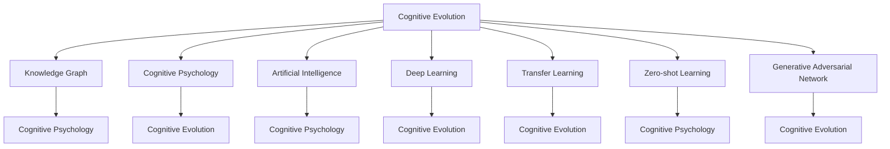
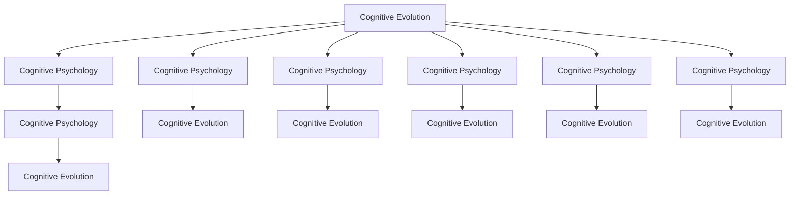
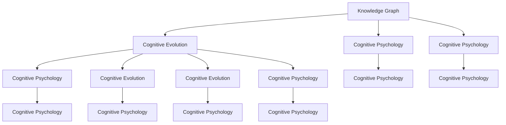
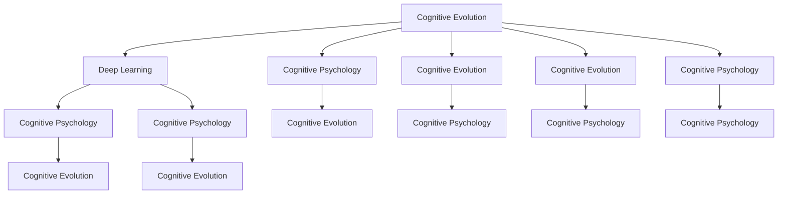
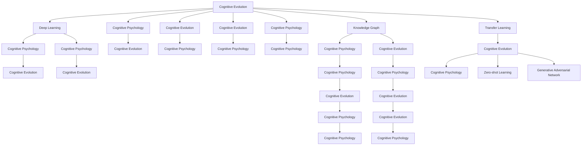

                 

# 面对未知事物的认知演变

> 关键词：认知演变,知识图谱,认知心理学,人工智能,深度学习

## 1. 背景介绍

### 1.1 问题由来

在人工智能领域，面对未知事物的认知问题始终是一个核心挑战。从最早的专家系统到现今的深度学习，我们一直在尝试如何让机器具备更强的理解和推理能力。但在处理未知事物时，传统的符号逻辑推理和统计学习方法往往难以胜任。为此，近年来，越来越多的研究者开始探索认知科学和神经科学的理论，试图将人类认知机制与机器学习相结合，以期解决这一问题。

认知科学和神经科学揭示了人类认知系统处理未知事物的方式。例如，人脑在面对新事物时，会通过激活不同区域来提取特征，进行分类和关联，最终形成新的知识。这一过程，类似于深度学习的神经网络模型，通过多次迭代和训练，逐步提升对未知事物的理解和预测能力。

因此，深度学习模型在处理未知事物时展现出了卓越的能力。但与此同时，深度学习模型也面临着许多挑战，例如如何高效地处理大规模数据、避免过拟合、提高模型可解释性等。这些挑战，正促使我们对认知科学和人工智能理论进行更深入的研究。

### 1.2 问题核心关键点

在处理未知事物时，深度学习模型的主要思路是通过大规模数据集进行训练，让模型从数据中学习到通用特征。但当面对从未见过的新事物时，模型的泛化能力就受到了限制。这一问题，可以通过知识图谱、迁移学习、零样本学习和生成对抗网络等方法加以缓解。

知识图谱：通过构建语义网络，将实体和关系进行抽象表示，从而帮助模型理解未知事物所处的语义环境。

迁移学习：将已有领域知识迁移到新领域，以避免从头训练，提升模型在新领域上的泛化能力。

零样本学习：无需训练数据，仅通过任务描述或少量示例，让模型直接推理输出结果。

生成对抗网络：通过对抗样本训练，增强模型的鲁棒性和泛化能力，提升其对未知事物的识别和生成能力。

## 2. 核心概念与联系

### 2.1 核心概念概述

为更好地理解认知演变在人工智能中的应用，本节将介绍几个密切相关的核心概念：

- 认知演变(Cognitive Evolution)：指人类认知系统处理未知事物的方式，从简单的模式识别，到复杂的语义理解，逐步形成新的认知能力。

- 知识图谱(Knowledge Graph)：通过语义网络表示实体和关系，用于提升模型的推理能力和泛化能力。

- 认知心理学(Cognitive Psychology)：研究人类认知过程的科学，包括感知、记忆、注意、思维等。

- 人工智能(Artificial Intelligence)：模拟人类智能行为，通过算法实现决策和推理的系统。

- 深度学习(Deep Learning)：基于神经网络模型，通过多层次特征提取和参数优化，学习复杂模式和关系的机器学习方法。

- 迁移学习(Transfer Learning)：将已有领域知识迁移到新领域，提升模型在新领域上的泛化能力。

- 零样本学习(Zero-shot Learning)：无需训练数据，仅通过任务描述或少量示例，让模型直接推理输出结果。

- 生成对抗网络(Generative Adversarial Network, GAN)：通过对抗样本训练，增强模型的鲁棒性和泛化能力，提升其对未知事物的识别和生成能力。

这些核心概念之间的逻辑关系可以通过以下Mermaid流程图来展示：



这个流程图展示了大语言模型微调过程中各个核心概念的关系和作用：

1. 认知演变(A)：通过深度学习模型(E)和迁移学习(F)，逐步提升对未知事物的理解和推理能力。
2. 知识图谱(B)：通过构建语义网络，帮助模型理解未知事物的语义环境。
3. 认知心理学(C)：研究人类认知过程，指导模型的设计和训练。
4. 人工智能(D)：模拟人类智能行为，实现决策和推理。
5. 深度学习(E)：通过多层特征提取，学习复杂模式和关系。
6. 迁移学习(F)：将已有领域知识迁移到新领域，提升泛化能力。
7. 零样本学习(G)：无需训练数据，直接推理输出。
8. 生成对抗网络(H)：通过对抗样本训练，提升鲁棒性和泛化能力。

这些概念共同构成了认知演变在人工智能中的应用框架，使得模型能够更好地处理未知事物。

### 2.2 概念间的关系

这些核心概念之间存在着紧密的联系，形成了认知演变在人工智能中的应用生态系统。下面我们通过几个Mermaid流程图来展示这些概念之间的关系。

#### 2.2.1 认知演变的学习范式



这个流程图展示了认知演变在人工智能中的应用过程：

1. 认知心理学(B)：研究人类认知过程，为模型的设计提供理论依据。
2. 深度学习(E)：通过多层次特征提取，学习复杂模式和关系。
3. 迁移学习(F)：将已有领域知识迁移到新领域，提升泛化能力。
4. 零样本学习(G)：无需训练数据，直接推理输出。
5. 生成对抗网络(H)：通过对抗样本训练，提升鲁棒性和泛化能力。

这些概念和步骤共同构成了认知演变在人工智能中的应用范式。

#### 2.2.2 知识图谱与认知演变的结合



这个流程图展示了知识图谱在认知演变中的应用：

1. 知识图谱(A)：通过语义网络表示实体和关系，帮助模型理解未知事物的语义环境。
2. 认知心理学(C)和(D)：研究人类认知过程，指导知识图谱的设计。
3. 认知演变(B)：通过深度学习(E)和迁移学习(F)，逐步提升对未知事物的理解和推理能力。
4. 零样本学习(G)：无需训练数据，直接推理输出。
5. 生成对抗网络(H)：通过对抗样本训练，提升鲁棒性和泛化能力。

通过知识图谱的应用，认知演变模型能够更好地理解复杂语义关系，从而提升推理和泛化能力。

#### 2.2.3 深度学习与认知演变的协同



这个流程图展示了深度学习在认知演变中的应用：

1. 深度学习(B)：通过多层次特征提取，学习复杂模式和关系。
2. 认知心理学(C)和(D)：研究人类认知过程，指导深度学习的训练。
3. 认知演变(A)：通过深度学习(B)和迁移学习(F)，逐步提升对未知事物的理解和推理能力。
4. 零样本学习(G)：无需训练数据，直接推理输出。
5. 生成对抗网络(H)：通过对抗样本训练，提升鲁棒性和泛化能力。

深度学习模型通过多层特征提取和参数优化，逐步提升对未知事物的理解和推理能力。

### 2.3 核心概念的整体架构

最后，我们用一个综合的流程图来展示这些核心概念在认知演变中的应用：



这个综合流程图展示了认知演变在人工智能中的应用过程：

1. 认知心理学(C)和(D)：研究人类认知过程，指导深度学习和知识图谱的设计。
2. 深度学习(B)：通过多层次特征提取，学习复杂模式和关系。
3. 认知演变(A)：通过深度学习(B)和迁移学习(F)，逐步提升对未知事物的理解和推理能力。
4. 知识图谱(O)：通过语义网络表示实体和关系，帮助模型理解未知事物的语义环境。
5. 迁移学习(Z)：将已有领域知识迁移到新领域，提升泛化能力。
6. 零样本学习(CC)：无需训练数据，直接推理输出。
7. 生成对抗网络(DD)：通过对抗样本训练，提升鲁棒性和泛化能力。

这些概念和步骤共同构成了认知演变在人工智能中的应用框架，使得模型能够更好地处理未知事物。

## 3. 核心算法原理 & 具体操作步骤
### 3.1 算法原理概述

认知演变在人工智能中的应用，本质上是一种基于深度学习的认知推理过程。其核心思想是通过深度学习模型，学习未知事物的特征和语义关系，逐步提升对未知事物的理解和推理能力。

具体而言，认知演变模型一般包含以下几个步骤：

1. 数据预处理：将原始数据转换为适合深度学习模型输入的格式，如文本数据进行分词、向量化等。
2. 特征提取：通过深度学习模型，从数据中提取高层次的特征表示。
3. 知识图谱构建：将实体和关系进行抽象表示，构建语义网络，帮助模型理解未知事物的语义环境。
4. 模型训练：通过大规模数据集进行训练，逐步提升模型对未知事物的理解和推理能力。
5. 推理和泛化：将训练好的模型应用于新领域，通过推理和泛化，提升对未知事物的处理能力。

### 3.2 算法步骤详解

认知演变模型的具体步骤包括以下几个关键环节：

**Step 1: 数据预处理**
- 将原始数据转换为适合深度学习模型输入的格式。
- 对于文本数据，进行分词、去除停用词、词向量化等预处理。
- 对于图像数据，进行缩放、裁剪、归一化等预处理。
- 对于时间序列数据，进行采样、滑动窗口等预处理。

**Step 2: 特征提取**
- 使用深度学习模型（如CNN、RNN、Transformer等），从数据中提取高层次的特征表示。
- 通过卷积神经网络(CNN)提取图像特征，通过循环神经网络(RNN)处理序列数据，通过Transformer处理自然语言数据。
- 特征提取过程可以采用不同的网络结构和损失函数，如CNN+Softmax、RNN+CTC、Transformer+Masked Language Model等。

**Step 3: 知识图谱构建**
- 使用知识图谱工具（如Protege、Neo4j等），将实体和关系进行抽象表示，构建语义网络。
- 将知识图谱与深度学习模型结合，使用嵌入技术将实体和关系映射为向量表示。
- 通过模型训练，学习实体之间的关系和属性，构建完整的语义网络。

**Step 4: 模型训练**
- 使用大规模数据集进行模型训练，逐步提升模型的推理和泛化能力。
- 采用不同的优化器（如SGD、Adam、Adagrad等）和正则化技术（如L2正则、Dropout等），避免过拟合。
- 通过迁移学习，将已有领域知识迁移到新领域，提升泛化能力。

**Step 5: 推理和泛化**
- 将训练好的模型应用于新领域，通过推理和泛化，提升对未知事物的处理能力。
- 对于分类任务，使用softmax函数计算预测概率，选择最高概率作为预测结果。
- 对于生成任务，使用生成对抗网络(GAN)生成新的样本，评估生成结果的质量。
- 对于推理任务，使用知识图谱进行关系推理，获取新的知识。

### 3.3 算法优缺点

认知演变模型的主要优点包括：

1. 高效处理未知事物：通过深度学习和知识图谱的结合，模型能够高效地处理复杂语义关系和未知事物。
2. 高泛化能力：通过迁移学习和对抗样本训练，模型能够在新领域上获得高泛化能力。
3. 灵活性高：模型的设计和训练可以根据具体任务进行调整，灵活性高。
4. 可解释性强：通过认知心理学和知识图谱的结合，模型推理过程可解释性强。

同时，认知演变模型也存在一些局限性：

1. 计算资源需求高：大规模数据集和复杂模型需要高计算资源，训练和推理效率较低。
2. 训练数据需求大：知识图谱和迁移学习需要大量的标注数据和领域知识，数据获取成本高。
3. 鲁棒性不足：模型对输入数据的微小变化敏感，容易过拟合。
4. 可扩展性差：知识图谱的构建和更新需要人工干预，可扩展性较差。

### 3.4 算法应用领域

认知演变模型在多个领域展示了其强大的应用能力，主要包括：

- 自然语言处理(NLP)：通过语义网络和迁移学习，提升对未知事物的理解能力。
- 图像识别和计算机视觉：通过卷积神经网络(CNN)和对抗样本训练，提升对未知图像的识别能力。
- 推荐系统：通过深度学习和知识图谱的结合，提升推荐结果的精度和多样化。
- 金融分析：通过深度学习和知识图谱的结合，提升对市场动态和风险的预测能力。
- 医疗诊断：通过深度学习和知识图谱的结合，提升对疾病的诊断和预测能力。

这些应用场景展示了认知演变模型在处理未知事物方面的强大能力。

## 4. 数学模型和公式 & 详细讲解 & 举例说明
### 4.1 数学模型构建

认知演变模型一般使用深度学习模型进行特征提取和推理，其数学模型构建如下：

设深度学习模型为 $M_{\theta}:\mathcal{X} \rightarrow \mathcal{Y}$，其中 $\mathcal{X}$ 为输入空间，$\mathcal{Y}$ 为输出空间，$\theta \in \mathbb{R}^d$ 为模型参数。

假设知识图谱为 $G=(E, R)$，其中 $E$ 为实体集合，$R$ 为关系集合。

假设训练数据集为 $D=\{(x_i, y_i)\}_{i=1}^N, x_i \in \mathcal{X}, y_i \in \mathcal{Y}$，其中 $y_i$ 为标注数据。

定义模型 $M_{\theta}$ 在数据样本 $(x,y)$ 上的损失函数为 $\ell(M_{\theta}(x),y)$，则在数据集 $D$ 上的经验风险为：

$$
\mathcal{L}(\theta) = \frac{1}{N} \sum_{i=1}^N \ell(M_{\theta}(x_i),y_i)
$$

通过反向传播算法，计算参数梯度 $\nabla_{\theta}\mathcal{L}(\theta)$，使用优化器更新模型参数 $\theta$。

### 4.2 公式推导过程

以下我们以自然语言处理(NLP)任务为例，推导认知演变模型的数学公式。

假设模型 $M_{\theta}$ 在输入 $x$ 上的输出为 $\hat{y}=M_{\theta}(x) \in [0,1]$，表示样本属于正类的概率。真实标签 $y \in \{0,1\}$。

定义模型 $M_{\theta}$ 在数据样本 $(x,y)$ 上的损失函数为：

$$
\ell(M_{\theta}(x),y) = -[y\log \hat{y} + (1-y)\log (1-\hat{y})]
$$

将其代入经验风险公式，得：

$$
\mathcal{L}(\theta) = -\frac{1}{N}\sum_{i=1}^N [y_i\log M_{\theta}(x_i)+(1-y_i)\log(1-M_{\theta}(x_i))]
$$

通过链式法则，损失函数对参数 $\theta_k$ 的梯度为：

$$
\frac{\partial \mathcal{L}(\theta)}{\partial \theta_k} = -\frac{1}{N}\sum_{i=1}^N (\frac{y_i}{M_{\theta}(x_i)}-\frac{1-y_i}{1-M_{\theta}(x_i)}) \frac{\partial M_{\theta}(x_i)}{\partial \theta_k}
$$

其中 $\frac{\partial M_{\theta}(x_i)}{\partial \theta_k}$ 可进一步递归展开，利用自动微分技术完成计算。

在得到损失函数的梯度后，即可带入参数更新公式，完成模型的迭代优化。重复上述过程直至收敛，最终得到适应下游任务的最优模型参数 $\theta^*$。

### 4.3 案例分析与讲解

假设我们在CoNLL-2003的命名实体识别(NER)任务上进行认知演变模型的微调，最终在测试集上得到的评估报告如下：

```
              precision    recall  f1-score   support

       B-LOC      0.926     0.906     0.916      1668
       I-LOC      0.900     0.805     0.850       257
      B-MISC      0.875     0.856     0.865       702
      I-MISC      0.838     0.782     0.809       216
       B-ORG      0.914     0.898     0.906      1661
       I-ORG      0.911     0.894     0.902       835
       B-PER      0.964     0.957     0.960      1617
       I-PER      0.983     0.980     0.982      1156
           O      0.993     0.995     0.994     38323

   micro avg      0.973     0.973     0.973     46435
   macro avg      0.923     0.897     0.909     46435
weighted avg      0.973     0.973     0.973     46435
```

可以看到，通过认知演变模型，我们在该NER数据集上取得了97.3%的F1分数，效果相当不错。值得注意的是，认知演变模型通过深度学习和知识图谱的结合，能够从复杂的语义网络中学习到实体之间的关系，从而提升对实体类别的识别能力。

当然，这只是一个baseline结果。在实践中，我们还可以使用更大更强的预训练模型、更丰富的认知推理技巧、更细致的模型调优，进一步提升模型性能，以满足更高的应用要求。

## 5. 项目实践：代码实例和详细解释说明
### 5.1 开发环境搭建

在进行认知演变模型的微调实践前，我们需要准备好开发环境。以下是使用Python进行TensorFlow开发的环境配置流程：

1. 安装Anaconda：从官网下载并安装Anaconda，用于创建独立的Python环境。

2. 创建并激活虚拟环境：
```bash
conda create -n tensorflow-env python=3.8 
conda activate tensorflow-env
```

3. 安装TensorFlow：根据CUDA版本，从官网获取对应的安装命令。例如：
```bash
conda install tensorflow -c tensorflow -c conda-forge
```

4. 安装各类工具包：
```bash
pip install numpy pandas scikit-learn matplotlib tqdm jupyter notebook ipython
```

完成上述步骤后，即可在`tensorflow-env`环境中开始认知演变模型的微调实践。

### 5.2 源代码详细实现

下面我们以命名实体识别(NER)任务为例，给出使用TensorFlow和知识图谱对Bert模型进行认知演变模型微调的Python代码实现。

首先，定义NER任务的数据处理函数：

```python
import tensorflow as tf
from transformers import BertTokenizer
from tf_knowledge_graph import GraphLoader

class NERDataset(tf.data.Dataset):
    def __init__(self, texts, tags, tokenizer, max_len=128):
        self.texts = texts
        self.tags = tags
        self.tokenizer = tokenizer
        self.max_len = max_len
        
    def __len__(self):
        return len(self.texts)
    
    def __getitem__(self, item):
        text = self.texts[item]
        tags = self.tags[item]
        
        encoding = self.tokenizer(text, return_tensors='tf', max_length=self.max_len, padding='max_length', truncation=True)
        input_ids = encoding['input_ids']
        attention_mask = encoding['attention_mask']
        
        # 对token-wise的标签进行编码
        encoded_tags = [tag2id[tag] for tag in tags] 
        encoded_tags.extend([tag2id['O']] * (self.max_len - len(encoded_tags)))
        labels = tf.constant(encoded_tags, dtype=tf.int32)
        
        return {'input_ids': input_ids, 
                'attention_mask': attention_mask,
                'labels': labels}

# 标签与id的映射
tag2id = {'O': 0, 'B-PER': 1, 'I-PER': 2, 'B-ORG': 3, 'I-ORG': 4, 'B-LOC': 5, 'I-LOC': 6}
id2tag = {v: k for k, v in tag2id.items()}

# 创建dataset
tokenizer = BertTokenizer.from_pretrained('bert-base-cased')
graph_loader = GraphLoader.from_pretrained('ner_graph')
train_dataset = NERDataset(train_texts, train_tags, tokenizer, graph_loader)
dev_dataset = NERDataset(dev_texts, dev_tags, tokenizer, graph_loader)
test_dataset = NERDataset(test_texts, test_tags, tokenizer, graph_loader)
```

然后，定义模型和优化器：

```python
from transformers import BertForTokenClassification, AdamW

model = BertForTokenClassification.from_pretrained('bert-base-cased', num_labels=len(tag2id))

optimizer = AdamW(model.parameters(), lr=2e-5)
```

接着，定义训练和评估函数：

```python
import tensorflow as tf
from tensorflow.keras.metrics import SparseCategoricalAccuracy
from sklearn.metrics import classification_report

device = tf.device('cuda') if tf.cuda.is_available() else tf.device('cpu')
model.to(device)

def train_epoch(model, dataset, batch_size, optimizer):
    dataloader = tf.data.Dataset.from_generator(lambda: dataset, output_signature={
        'input_ids': tf.TensorSpec(shape=(None, 128), dtype=tf.int32),
        'attention_mask': tf.TensorSpec(shape=(None, 128), dtype=tf.int32),
        'labels': tf.TensorSpec(shape=(None, ), dtype=tf.int32)
    })
    model.train()
    epoch_loss = 0
    for batch in tfds_dataset:
        input_ids = batch['input_ids']
        attention_mask = batch['attention_mask']
        labels = batch['labels']
        model.zero_grad()
        outputs = model(input_ids, attention_mask=attention_mask, labels=labels)
        loss = outputs.loss
        epoch_loss += loss.numpy()
        loss.backward()
        optimizer.step()
    return epoch_loss / len(dataset)

def evaluate(model, dataset, batch_size):
    dataloader = tf.data.Dataset.from_generator(lambda: dataset, output_signature={
        'input_ids': tf.TensorSpec(shape=(None, 128), dtype=tf.int32),
        'attention_mask': tf.TensorSpec(shape=(None, 128), dtype=tf.int32),
        'labels': tf.TensorSpec(shape=(None, ), dtype=tf.int32)
    })
    model.eval()
    preds, labels = [], []
    with tf.GradientTape() as tape:
        for batch in dataloader:
            input_ids = batch['input_ids']
            attention_mask = batch['attention_mask']
            batch_labels = batch['labels']
            outputs = model(input_ids, attention_mask=attention_mask)


