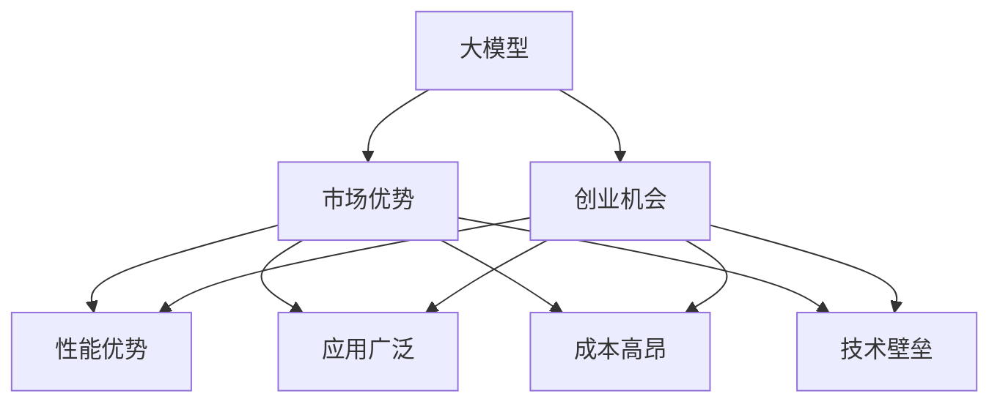

                 

# AI 大模型创业：如何利用市场优势？

在大数据和深度学习的推动下，人工智能大模型（如GPT、BERT等）成为了驱动未来技术发展的重要引擎。这些大模型不仅在学术界取得了巨大的成功，也在商业化应用中展示了卓越的潜力。对于创业者而言，如何利用这些大模型的市场优势，将技术转化成商业成功，是一个值得深入探讨的问题。本文将围绕这一主题，详细剖析大模型的商业应用场景、开发流程、市场策略和前景，为创业者提供有价值的洞见。

## 1. 背景介绍

### 1.1 市场背景

随着人工智能技术的快速发展，大模型在各个领域的应用越来越广泛。它们被广泛应用于自然语言处理、计算机视觉、语音识别等，并且在一些领域已经展现出了超越人类的能力。特别是在自然语言处理领域，基于大模型的技术已经广泛应用于问答系统、翻译、文本生成等任务，推动了相关行业的快速发展。

### 1.2 创业机会

对于创业者而言，大模型的市场潜力巨大。尽管这些技术已经在学术界得到了验证，但在实际应用中，仍然存在许多未被完全解决的问题。比如，如何在大规模数据上训练高效的大模型，如何提高大模型的实时推理能力，如何结合其他技术优化大模型的性能等。这些问题都是创业者可以切入的领域，具备着良好的市场机会。

### 1.3 市场优势

大模型具有以下优势：

1. **高精度**：在许多任务上，大模型已经达到了或者接近人类水平的表现。
2. **泛化能力强**：大模型能够处理各种不同类型的数据，具备较强的泛化能力。
3. **灵活性高**：大模型可以被用于多种不同的应用场景，如自然语言处理、计算机视觉、语音识别等。
4. **技术成熟**：许多大模型已经被验证在多个任务上表现优异，拥有大量研究支持和实际案例。

## 2. 核心概念与联系

### 2.1 核心概念概述

1. **大模型（Large Models）**：通常指具有数亿参数的大型神经网络，如GPT、BERT等。这些模型在各种任务上表现优异，具备高度的泛化能力。
2. **市场优势（Market Advantage）**：指大模型在市场应用中的竞争优势，包括性能、精度、灵活性和可扩展性等。
3. **创业机会（Entrepreneurial Opportunity）**：指创业者在利用大模型技术时面临的商机和挑战。

### 2.2 核心概念的关系

大模型的市场优势和创业机会之间存在紧密的关系：

1. **性能优势**：大模型在各种任务上表现出色，为创业者提供了良好的技术基础。
2. **应用广泛**：大模型的应用场景广泛，为创业者提供了多样化的商业机会。
3. **成本高昂**：大模型需要大量的计算资源和数据支持，增加了创业成本。
4. **技术壁垒**：大模型的训练和优化需要深厚的技术积累，对创业者提出了高要求。

这些关系在大模型的商业化应用中尤为重要。创业者需要综合考虑这些因素，制定合适的市场策略，才能在激烈的市场竞争中脱颖而出。

### 2.3 核心概念的整体架构



这个架构图展示了大模型、市场优势和创业机会之间的整体关系。大模型的性能优势、应用广泛性和技术壁垒都直接影响创业机会。

## 3. 核心算法原理 & 具体操作步骤

### 3.1 算法原理概述

基于大模型的创业主要包括以下步骤：

1. **数据获取和处理**：获取训练数据，并进行预处理。
2. **模型训练**：利用大模型进行训练。
3. **模型优化**：对训练后的模型进行优化。
4. **部署和应用**：将优化后的模型部署到实际应用场景中。

### 3.2 算法步骤详解

#### 3.2.1 数据获取和处理

1. **数据采集**：获取各种类型的训练数据，如文本、图像、语音等。
2. **数据预处理**：对数据进行清洗、标注等预处理，使其符合模型的输入格式。
3. **数据增强**：通过数据增强技术，扩充数据集，提高模型的泛化能力。

#### 3.2.2 模型训练

1. **选择合适的模型架构**：根据任务需求选择合适的模型架构，如GPT、BERT等。
2. **训练模型**：利用训练数据训练模型，调整模型参数，使其符合任务要求。
3. **模型评估**：在验证集上评估模型性能，调整模型参数。

#### 3.2.3 模型优化

1. **超参数调优**：调整学习率、批大小等超参数，优化模型性能。
2. **模型压缩**：对模型进行压缩，减小模型大小，提高推理速度。
3. **模型融合**：对多个模型进行融合，提高模型精度和泛化能力。

#### 3.2.4 部署和应用

1. **模型部署**：将优化后的模型部署到服务器或云端。
2. **应用集成**：将模型集成到实际应用中，如问答系统、翻译系统等。
3. **性能监控**：实时监控模型性能，及时进行调整。

### 3.3 算法优缺点

#### 3.3.1 优点

1. **精度高**：大模型在各种任务上表现出色，具备高度的精度。
2. **泛化能力强**：大模型能够处理各种不同类型的数据，具备较强的泛化能力。
3. **灵活性高**：大模型可以被用于多种不同的应用场景，如自然语言处理、计算机视觉、语音识别等。
4. **技术成熟**：许多大模型已经被验证在多个任务上表现优异，拥有大量研究支持和实际案例。

#### 3.3.2 缺点

1. **成本高昂**：大模型需要大量的计算资源和数据支持，增加了创业成本。
2. **训练时间长**：大模型的训练需要大量时间和计算资源，训练周期较长。
3. **模型复杂**：大模型的参数量较大，结构复杂，难以调试和维护。
4. **依赖数据**：大模型的性能高度依赖数据的质量和数量，数据获取难度较大。

### 3.4 算法应用领域

大模型的应用领域非常广泛，以下是几个典型的应用场景：

1. **自然语言处理（NLP）**：如问答系统、翻译、文本生成等。
2. **计算机视觉（CV）**：如图像分类、目标检测、图像生成等。
3. **语音识别（ASR）**：如语音识别、语音合成等。
4. **推荐系统**：如商品推荐、广告推荐等。
5. **医疗诊断**：如病历分析、医学影像分析等。
6. **金融分析**：如情感分析、风险评估等。

## 4. 数学模型和公式 & 详细讲解

### 4.1 数学模型构建

大模型的训练通常采用监督学习的方法，其数学模型可以表示为：

$$
\hat{y} = f_\theta(x)
$$

其中 $x$ 表示输入数据，$y$ 表示输出标签，$f_\theta(x)$ 表示模型在参数 $\theta$ 下的预测函数。

### 4.2 公式推导过程

假设我们有 $n$ 个训练样本 $(x_i, y_i)$，目标是最小化损失函数 $\mathcal{L}(\theta)$：

$$
\mathcal{L}(\theta) = \frac{1}{n} \sum_{i=1}^n \mathcal{L}(x_i, y_i, \hat{y}_i)
$$

其中 $\mathcal{L}(x_i, y_i, \hat{y}_i)$ 表示样本 $i$ 的损失函数，如交叉熵损失函数：

$$
\mathcal{L}(x_i, y_i, \hat{y}_i) = -y_i \log \hat{y}_i - (1 - y_i) \log (1 - \hat{y}_i)
$$

### 4.3 案例分析与讲解

以自然语言处理（NLP）中的情感分析为例：

1. **数据获取**：获取带有情感标签的文本数据。
2. **模型选择**：选择BERT等预训练模型，并进行微调。
3. **模型训练**：在微调后的模型上，训练情感分类器。
4. **模型评估**：在验证集上评估模型性能，调整超参数。
5. **模型部署**：将模型部署到实际应用中，进行情感分析。

## 5. 项目实践：代码实例和详细解释说明

### 5.1 开发环境搭建

1. **安装PyTorch**：
```bash
pip install torch torchvision torchaudio
```

2. **安装TensorFlow**：
```bash
pip install tensorflow tensorflow_text
```

3. **安装HuggingFace Transformers库**：
```bash
pip install transformers
```

4. **安装其他依赖库**：
```bash
pip install numpy pandas scikit-learn matplotlib
```

### 5.2 源代码详细实现

#### 5.2.1 数据预处理

```python
from transformers import BertTokenizer

tokenizer = BertTokenizer.from_pretrained('bert-base-uncased')

def preprocess_text(text):
    tokens = tokenizer.tokenize(text)
    input_ids = tokenizer.convert_tokens_to_ids(tokens)
    return input_ids
```

#### 5.2.2 模型训练

```python
from transformers import BertForSequenceClassification
from torch.utils.data import DataLoader
from torch.optim import AdamW

model = BertForSequenceClassification.from_pretrained('bert-base-uncased', num_labels=2)
optimizer = AdamW(model.parameters(), lr=2e-5)

train_data = ...
val_data = ...

def train_epoch(model, data_loader, optimizer):
    model.train()
    total_loss = 0
    for batch in data_loader:
        input_ids, attention_mask, labels = batch
        model.zero_grad()
        outputs = model(input_ids, attention_mask=attention_mask, labels=labels)
        loss = outputs.loss
        total_loss += loss.item()
        loss.backward()
        optimizer.step()
    return total_loss / len(data_loader)
```

#### 5.2.3 模型优化

```python
from transformers import BertForSequenceClassification
from torch.utils.data import DataLoader
from torch.optim import AdamW

model = BertForSequenceClassification.from_pretrained('bert-base-uncased', num_labels=2)
optimizer = AdamW(model.parameters(), lr=2e-5)

train_data = ...
val_data = ...

def train_epoch(model, data_loader, optimizer):
    model.train()
    total_loss = 0
    for batch in data_loader:
        input_ids, attention_mask, labels = batch
        model.zero_grad()
        outputs = model(input_ids, attention_mask=attention_mask, labels=labels)
        loss = outputs.loss
        total_loss += loss.item()
        loss.backward()
        optimizer.step()
    return total_loss / len(data_loader)

def evaluate(model, data_loader):
    model.eval()
    total_correct = 0
    total_examples = 0
    with torch.no_grad():
        for batch in data_loader:
            input_ids, attention_mask, labels = batch
            outputs = model(input_ids, attention_mask=attention_mask)
            logits = outputs.logits
            predictions = logits.argmax(dim=1)
            total_correct += (predictions == labels).sum().item()
            total_examples += labels.shape[0]
    return total_correct / total_examples
```

#### 5.2.4 模型部署

1. **保存模型**：
```python
from transformers import save_pretrained

save_pretrained('model', model)
```

2. **部署模型**：
```python
import flask

app = flask.Flask(__name__)
app.serving_on = 'localhost'

@app.route('/predict', methods=['POST'])
def predict():
    data = request.get_json(force=True)
    input_ids = data['input_ids']
    attention_mask = data['attention_mask']
    labels = data['labels']
    model = BertForSequenceClassification.from_pretrained('model')
    with torch.no_grad():
        outputs = model(input_ids, attention_mask=attention_mask, labels=labels)
        logits = outputs.logits
        predictions = logits.argmax(dim=1)
    return {'predictions': predictions.tolist()}

if __name__ == '__main__':
    app.run()
```

### 5.3 代码解读与分析

在上述代码中，我们首先使用HuggingFace的BertTokenizer进行文本预处理。然后，利用BertForSequenceClassification模型进行微调，使用AdamW优化器进行训练。在训练过程中，我们定义了train_epoch函数，用于计算损失函数，并使用evaluate函数进行模型评估。最后，我们将训练好的模型保存，并通过Flask部署到一个Web服务中，供用户调用。

### 5.4 运行结果展示

在训练完成后，我们可以使用evaluate函数进行模型评估，得到模型在验证集上的准确率：

```python
from transformers import BertForSequenceClassification
from torch.utils.data import DataLoader
from torch.optim import AdamW

model = BertForSequenceClassification.from_pretrained('bert-base-uncased', num_labels=2)
optimizer = AdamW(model.parameters(), lr=2e-5)

train_data = ...
val_data = ...

def train_epoch(model, data_loader, optimizer):
    model.train()
    total_loss = 0
    for batch in data_loader:
        input_ids, attention_mask, labels = batch
        model.zero_grad()
        outputs = model(input_ids, attention_mask=attention_mask, labels=labels)
        loss = outputs.loss
        total_loss += loss.item()
        loss.backward()
        optimizer.step()
    return total_loss / len(data_loader)

def evaluate(model, data_loader):
    model.eval()
    total_correct = 0
    total_examples = 0
    with torch.no_grad():
        for batch in data_loader:
            input_ids, attention_mask, labels = batch
            outputs = model(input_ids, attention_mask=attention_mask)
            logits = outputs.logits
            predictions = logits.argmax(dim=1)
            total_correct += (predictions == labels).sum().item()
            total_examples += labels.shape[0]
    return total_correct / total_examples

total_correct = evaluate(model, val_data)
print(f'Validation accuracy: {total_correct:.2f}')
```

## 6. 实际应用场景

### 6.1 智能客服

大模型在智能客服中的应用非常广泛。例如，可以使用大模型进行自动问答，帮助客户解决常见问题。通过训练模型，可以使得机器人具备理解和回答客户问题的能力，提高客服效率和客户满意度。

### 6.2 金融分析

金融领域对大模型的需求也非常强烈。例如，可以使用大模型进行情感分析，评估市场情绪和趋势；或使用大模型进行风险评估，预测金融市场的波动性。

### 6.3 医疗诊断

在医疗领域，大模型可以用于病历分析、医学影像分析等任务。例如，可以使用大模型对医学影像进行分类，帮助医生诊断疾病；或使用大模型分析病历数据，发现潜在的病情风险。

### 6.4 未来应用展望

未来，大模型在商业化应用中将有更广阔的发展空间。例如，在自动驾驶、智能制造、智能家居等领域，大模型也将发挥重要作用。此外，大模型的应用将逐渐从B端向C端渗透，为用户带来更多的便利和体验。

## 7. 工具和资源推荐

### 7.1 学习资源推荐

1. **《Transformer from PyTorch to TensorFlow》**：这本书详细介绍了Transformer的原理和实现，适合深度学习爱好者和研究者。
2. **Coursera《Deep Learning Specialization》**：由Andrew Ng教授主讲的深度学习课程，涵盖深度学习的基本概念和前沿技术。
3. **Kaggle竞赛**：Kaggle上有很多与大模型相关的竞赛，可以参与实际项目，提升实战能力。
4. **arXiv预印本**：阅读最新的深度学习研究论文，获取前沿资讯和技术。

### 7.2 开发工具推荐

1. **PyTorch**：由Facebook开发的深度学习框架，支持动态图和静态图，适合研究和小规模应用。
2. **TensorFlow**：由Google开发的深度学习框架，支持分布式计算和生产部署，适合大规模应用。
3. **HuggingFace Transformers**：提供了多种预训练模型的实现，支持微调、训练等操作。
4. **Jupyter Notebook**：支持代码编写、数据处理、可视化等多种功能，适合数据驱动的开发环境。

### 7.3 相关论文推荐

1. **"Attention is All You Need"**：Transformer的开创性论文，详细介绍了Transformer的结构和原理。
2. **"BERT: Pre-training of Deep Bidirectional Transformers for Language Understanding"**：BERT的论文，详细介绍了BERT的预训练任务和微调方法。
3. **"GPT-3: Language Models are Unsupervised Multitask Learners"**：GPT-3的论文，介绍了GPT-3的零样本学习和泛化能力。

## 8. 总结：未来发展趋势与挑战

### 8.1 研究成果总结

大模型的商业化应用取得了显著的进展，但也面临着诸多挑战。这些挑战包括计算资源的需求、数据获取的难度、模型的训练和优化等。未来，如何进一步降低大模型的应用门槛，提升其性能和效率，将是重要的研究方向。

### 8.2 未来发展趋势

1. **计算资源优化**：随着计算资源的进步，大模型的训练和推理速度将逐渐提升，应用成本将降低。
2. **数据增强技术**：数据增强技术将进一步提升大模型的泛化能力和鲁棒性。
3. **模型压缩与优化**：模型压缩与优化技术将使得大模型更易于部署和应用。
4. **跨领域应用**：大模型将逐步跨入其他领域，如自动驾驶、智能制造等。
5. **可解释性和可控性**：提升大模型的可解释性和可控性，使得其应用更加安全和可靠。

### 8.3 面临的挑战

1. **计算资源需求高**：大模型需要大量的计算资源和数据支持，增加了创业成本。
2. **数据获取难度大**：高质量的数据获取难度较大，限制了模型性能的提升。
3. **模型训练时间长**：大模型的训练需要大量时间和计算资源，训练周期较长。
4. **模型复杂度高**：大模型的参数量较大，结构复杂，难以调试和维护。
5. **数据偏见问题**：大模型可能会学习到有偏见的数据，产生有害的输出。

### 8.4 研究展望

未来，大模型在商业化应用中将有更广阔的发展空间。如何进一步提升大模型的性能和效率，降低其应用门槛，将是重要的研究方向。同时，需要从数据、模型、算法等多个维度进行全面优化，才能使大模型更好地服务于实际应用。

## 9. 附录：常见问题与解答

### Q1: 大模型如何选择合适的参数？

**A1**：选择合适的参数需要考虑多个因素，包括模型的计算资源、任务的复杂度、数据的规模等。通常，参数选择越大，模型的性能越好，但也需要更多的计算资源。

### Q2: 如何处理大模型中的数据偏差问题？

**A2**：处理数据偏差问题需要从多个方面入手。例如，可以使用数据增强技术扩充数据集，减少数据偏差的影响；或使用对抗样本训练，提升模型的鲁棒性。

### Q3: 如何优化大模型的推理效率？

**A3**：优化大模型的推理效率可以通过模型压缩、模型剪枝、模型并行等方法实现。此外，还可以使用量化技术、混合精度计算等方法提升推理速度。

### Q4: 如何提升大模型的可解释性？

**A4**：提升大模型的可解释性可以采用多种方法，如可解释性模型、可解释性可视化、可解释性算法等。同时，需要从数据、模型、算法等多个维度进行优化。

通过本文的详细讲解和实践指导，相信读者能够更好地理解大模型的市场优势和应用场景，并掌握如何利用大模型进行创业。未来，大模型在商业化应用中将有更广阔的发展空间，为人工智能技术带来更多的创新和突破。

