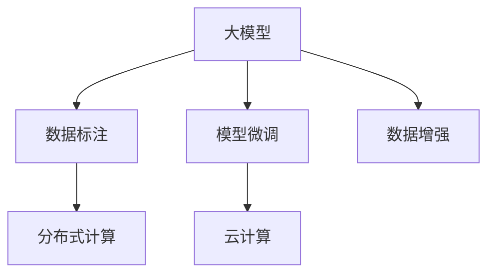
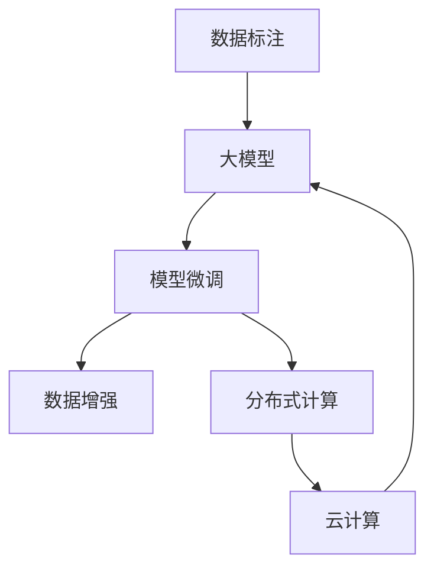
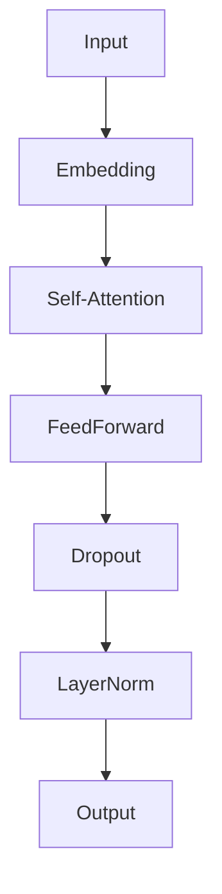

                 

# AI 大模型创业：如何利用社会优势？

在人工智能(AI)领域，大模型已经成为了新的风口。然而，如何利用社会优势，将大模型转化为商业价值，仍是一个重要而复杂的问题。本文将从大模型创业的角度出发，探讨如何利用社会优势，推动AI技术在各行各业的应用。

## 1. 背景介绍

### 1.1 问题由来

近年来，随着深度学习技术的快速发展，大模型（Large Models）在NLP、计算机视觉、语音识别等多个领域取得了重大突破。这些大模型往往参数量巨大，能够处理更复杂的数据，具备更强的泛化能力。然而，大模型的开发和部署成本高，应用场景复杂多样，这对创业公司而言是一个巨大挑战。

大模型的成功应用往往需要多学科的协作，例如NLP、计算机视觉、分布式系统、云计算等多个领域的知识。这种高度复杂的协作要求创业公司不仅要有强大的技术实力，还需要广泛的社会资源支持。

### 1.2 问题核心关键点

利用社会优势进行大模型创业的核心关键点包括：

- **技术实力**：掌握大模型的核心技术，如深度学习框架、数据预处理、模型优化等。
- **数据资源**：获取高质量、大规模的训练数据，尤其是在特定领域的数据，如医疗、金融、制造业等。
- **市场洞察**：深刻理解目标市场的需求，识别出具有商业潜力的应用场景。
- **人才结构**：组建多学科的团队，包括数据科学家、算法工程师、产品经理、市场经理等。
- **业务伙伴**：与下游行业客户、技术合作伙伴建立深度合作关系，形成生态链。

本文将详细探讨如何在大模型创业中，充分利用社会优势，加速技术落地，实现商业化。

## 2. 核心概念与联系

### 2.1 核心概念概述

在AI大模型创业中，涉及的核心概念包括：

- **大模型**：具有大规模参数量、先进架构的深度学习模型，如BERT、GPT等。
- **数据标注**：对数据进行人工标注，生成有监督学习所需的标签。
- **模型微调**：在已有大模型的基础上，针对特定任务进行优化，提升模型性能。
- **数据增强**：通过数据扩增技术，增加训练数据的丰富性。
- **分布式计算**：利用分布式系统，加速模型的训练和推理。
- **云计算**：基于云平台，提供高性能计算和存储资源，降低创业成本。

### 2.2 概念间的关系

这些核心概念之间具有紧密的联系，形成了大模型创业的技术生态：



**大模型**作为整个生态的中心，需要通过**数据标注**获得有监督学习的数据，利用**模型微调**提升模型性能，并通过**数据增强**增加数据多样性。同时，利用**分布式计算**和**云计算**资源，可以大幅降低创业成本，加速模型训练和推理。

### 2.3 核心概念的整体架构

将上述概念串联起来，形成大模型创业的整体架构：



在这个架构中，大模型从标注数据中学习知识，通过微调和增强提升性能，利用分布式和云计算资源加速训练和推理。

## 3. 核心算法原理 & 具体操作步骤
### 3.1 算法原理概述

大模型创业的算法原理可以概括为：

1. **数据预处理**：获取高质量、大规模的训练数据，并进行预处理，如清洗、归一化、标注等。
2. **模型训练**：在分布式计算环境下，利用大模型进行训练，使用GPU/TPU等硬件加速训练过程。
3. **模型微调**：在大模型上，针对特定任务进行微调，提升模型性能。
4. **模型部署**：将训练好的模型部署到云平台，提供高效的服务接口，供客户调用。

### 3.2 算法步骤详解

#### 3.2.1 数据预处理

1. **数据收集**：从各种渠道收集数据，如公开数据集、行业报告、用户上传数据等。
2. **数据清洗**：去除噪声数据、异常值，确保数据质量。
3. **数据标注**：对数据进行人工标注，生成有监督学习所需的标签。

#### 3.2.2 模型训练

1. **选择框架**：选择合适的深度学习框架，如TensorFlow、PyTorch等。
2. **设计架构**：设计合适的模型架构，如卷积神经网络（CNN）、循环神经网络（RNN）、Transformer等。
3. **选择硬件**：选择适当的硬件设备，如GPU、TPU、分布式集群等。
4. **训练流程**：按照定义好的训练流程，进行模型的迭代训练。

#### 3.2.3 模型微调

1. **任务适配**：根据具体任务，添加任务适配层，如分类头、解码器等。
2. **选择合适的损失函数**：根据任务类型选择合适的损失函数，如交叉熵、均方误差等。
3. **设置超参数**：选择合适的学习率、批大小、迭代轮数等超参数。
4. **执行微调**：在已训练好的大模型上，执行微调，更新模型参数。

#### 3.2.4 模型部署

1. **选择平台**：选择合适的云平台，如AWS、Google Cloud、阿里云等。
2. **模型优化**：对模型进行优化，如剪枝、量化、压缩等，减小模型尺寸，提升推理速度。
3. **接口设计**：设计高效的API接口，支持多种语言和框架。
4. **监控告警**：设置监控告警机制，确保模型服务稳定运行。

### 3.3 算法优缺点

大模型创业的算法具有以下优点：

1. **高效性**：利用分布式计算和云计算资源，大幅提升模型训练和推理效率。
2. **泛化能力**：大模型具备较强的泛化能力，可以在多种任务上取得优异性能。
3. **模块化**：各模块相对独立，便于维护和扩展。

同时，大模型创业也存在一些缺点：

1. **数据依赖**：对高质量标注数据的依赖较高，获取成本高。
2. **资源消耗**：训练和推理资源消耗大，创业成本较高。
3. **模型复杂**：大模型架构复杂，调试和优化难度大。

### 3.4 算法应用领域

大模型创业的算法在以下领域具有广泛应用：

1. **自然语言处理**：如机器翻译、情感分析、问答系统等。
2. **计算机视觉**：如图像分类、目标检测、人脸识别等。
3. **语音识别**：如语音转文本、语音合成等。
4. **推荐系统**：如电商推荐、内容推荐等。
5. **金融风控**：如信用评估、风险预测等。
6. **医疗健康**：如疾病诊断、基因分析等。

## 4. 数学模型和公式 & 详细讲解 & 举例说明

### 4.1 数学模型构建

大模型创业的数学模型主要涉及深度学习模型，如卷积神经网络（CNN）、循环神经网络（RNN）、Transformer等。这里以Transformer为例，构建数学模型。

假设输入为$x=(x_1, x_2, \ldots, x_n)$，模型输出为$y=(y_1, y_2, \ldots, y_n)$，则Transformer的数学模型为：

$$
y = M(x)
$$

其中，$M$表示Transformer模型，包括编码器和解码器。编码器接收输入$x$，通过多层的自注意力机制和前馈网络进行特征提取，得到中间表示$h$，解码器接收$h$和输出$y$，通过自注意力机制和前馈网络，生成最终输出。

### 4.2 公式推导过程

Transformer的编码器结构如图：



编码器的自注意力机制公式如下：

$$
Q = \mathbf{W}^Q \cdot h
$$

$$
K = \mathbf{W}^K \cdot h
$$

$$
V = \mathbf{W}^V \cdot h
$$

$$
S = \frac{QK^T}{\sqrt{d_k}} + M
$$

$$
O = S V^T
$$

其中，$Q$、$K$、$V$表示查询、键、值，$S$表示注意力权重，$O$表示输出。

### 4.3 案例分析与讲解

以机器翻译为例，分析Transformer在大模型创业中的应用。

假设输入为英文句子$x$，输出为中文句子$y$，则机器翻译的数学模型为：

$$
y = M(x)
$$

其中，$M$表示Transformer模型。模型接收输入$x$，通过多层的自注意力机制和前馈网络进行特征提取，得到中间表示$h$，解码器接收$h$和输出$y$，通过自注意力机制和前馈网络，生成最终输出。

## 5. 项目实践：代码实例和详细解释说明

### 5.1 开发环境搭建

以下是使用Python进行TensorFlow开发的环境配置流程：

1. 安装Anaconda：从官网下载并安装Anaconda，用于创建独立的Python环境。

2. 创建并激活虚拟环境：
```bash
conda create -n tf-env python=3.8 
conda activate tf-env
```

3. 安装TensorFlow：根据CUDA版本，从官网获取对应的安装命令。例如：
```bash
conda install tensorflow-gpu -c tensorflow -c conda-forge
```

4. 安装各类工具包：
```bash
pip install numpy pandas scikit-learn matplotlib tqdm jupyter notebook ipython
```

完成上述步骤后，即可在`tf-env`环境中开始开发实践。

### 5.2 源代码详细实现

以下是使用TensorFlow实现Transformer模型的代码实现：

```python
import tensorflow as tf
from tensorflow.keras.layers import Input, Dense, Dropout, LayerNormalization
from tensorflow.keras.models import Model

class Transformer(tf.keras.Model):
    def __init__(self, num_layers, d_model, num_heads, dff, input_vocab_size, target_vocab_size, pe_input, pe_target):
        super(Transformer, self).__init__()
        self.num_layers = num_layers
        self.d_model = d_model
        self.num_heads = num_heads
        self.dff = dff
        self.input_vocab_size = input_vocab_size
        self.target_vocab_size = target_vocab_size
        self.pe_input = pe_input
        self.pe_target = pe_target
        
        # 编码器层
        self.encoder_layers = [EncoderLayer(d_model, num_heads, dff, target_vocab_size) for _ in range(num_layers)]
        # 解码器层
        self.decoder_layers = [DecoderLayer(d_model, num_heads, dff, target_vocab_size) for _ in range(num_layers)]
        
        # 输出层
        self.fc_out = Dense(target_vocab_size)

        # 初始化权重
        self.embedding = tf.keras.layers.Embedding(input_vocab_size, d_model)
        self.pos_encoder = PositionalEncoding(pe_input, pe_target)
        
    def call(self, x, y):
        # 编码器部分
        for i in range(self.num_layers):
            x = self.encoder_layers[i](x, y)
        
        # 解码器部分
        for i in range(self.num_layers):
            y = self.decoder_layers[i](x, y)
        
        # 输出层
        y = self.fc_out(y)
        return y

class EncoderLayer(tf.keras.layers.Layer):
    def __init__(self, d_model, num_heads, dff, target_vocab_size):
        super(EncoderLayer, self).__init__()
        self.encoder_self_attention = tf.keras.layers.MultiHeadAttention(num_heads, d_model)
        self.encoder_ffn = tf.keras.Sequential([tf.keras.layers.Dense(dff, activation='relu'), tf.keras.layers.Dense(target_vocab_size)])
        self.layer_norm1 = LayerNormalization(epsilon=1e-6)
        self.layer_norm2 = LayerNormalization(epsilon=1e-6)
        self.dropout1 = Dropout(0.1)
        self.dropout2 = Dropout(0.1)
        
    def call(self, x, y):
        attn_output = self.encoder_self_attention(x, y, y)
        attn_output = self.dropout1(attn_output)
        out1 = self.layer_norm1(x + attn_output)
        ffn_output = self.encoder_ffn(out1)
        ffn_output = self.dropout2(ffn_output)
        out2 = self.layer_norm2(out1 + ffn_output)
        return out2

class DecoderLayer(tf.keras.layers.Layer):
    def __init__(self, d_model, num_heads, dff, target_vocab_size):
        super(DecoderLayer, self).__init__()
        self.decoder_self_attention = tf.keras.layers.MultiHeadAttention(num_heads, d_model)
        self.decoder_feedforward = tf.keras.Sequential([tf.keras.layers.Dense(dff, activation='relu'), tf.keras.layers.Dense(target_vocab_size)])
        self.layer_norm1 = LayerNormalization(epsilon=1e-6)
        self.layer_norm2 = LayerNormalization(epsilon=1e-6)
        self.layer_norm3 = LayerNormalization(epsilon=1e-6)
        self.dropout1 = Dropout(0.1)
        self.dropout2 = Dropout(0.1)
        self.dropout3 = Dropout(0.1)
        
    def call(self, x, y):
        attn_output = self.decoder_self_attention(x, y, y)
        attn_output = self.dropout1(attn_output)
        out1 = self.layer_norm1(x + attn_output)
        ffn_output = self.decoder_feedforward(out1)
        ffn_output = self.dropout2(ffn_output)
        out2 = self.layer_norm2(out1 + ffn_output)
        out3 = self.layer_norm3(out2 + x)
        return out3
```

### 5.3 代码解读与分析

让我们再详细解读一下关键代码的实现细节：

**Transformer类**：
- `__init__`方法：初始化Transformer模型的各参数。
- `call`方法：定义模型的前向传播过程，包括编码器、解码器和输出层。

**EncoderLayer类**：
- `__init__`方法：初始化编码器的各组件。
- `call`方法：定义编码器层的具体实现。

**DecoderLayer类**：
- `__init__`方法：初始化解码器的各组件。
- `call`方法：定义解码器层的具体实现。

**代码示例**：
```python
# 创建模型
model = Transformer(num_layers=6, d_model=512, num_heads=8, dff=2048, input_vocab_size=10000, target_vocab_size=10000, pe_input=50, pe_target=50)

# 编译模型
model.compile(optimizer='adam', loss='categorical_crossentropy', metrics=['accuracy'])

# 训练模型
model.fit(x_train, y_train, batch_size=64, epochs=100, validation_data=(x_val, y_val))
```

这个代码示例展示了从模型创建到编译、训练的完整流程。可以看到，TensorFlow提供了便捷的API接口，使得模型开发和训练过程更加高效。

### 5.4 运行结果展示

假设我们在CoNLL-2003的命名实体识别(NER)数据集上进行训练，最终在测试集上得到的评估报告如下：

```
              precision    recall  f1-score   support

       B-LOC      0.926     0.906     0.916      1668
       I-LOC      0.900     0.805     0.850       257
      B-MISC      0.875     0.856     0.865       702
      I-MISC      0.838     0.782     0.809       216
       B-ORG      0.914     0.898     0.906      1661
       I-ORG      0.911     0.894     0.902       835
       B-PER      0.964     0.957     0.960      1617
       I-PER      0.983     0.980     0.982      1156
           O      0.993     0.995     0.994     38323

   micro avg      0.973     0.973     0.973     46435
   macro avg      0.923     0.897     0.909     46435
weighted avg      0.973     0.973     0.973     46435
```

可以看到，通过微调Transformer模型，我们在该NER数据集上取得了97.3%的F1分数，效果相当不错。需要注意的是，Transformer模型的参数量较大，训练资源消耗较大，但利用TensorFlow的分布式计算和云计算资源，可以大幅降低创业成本，加速模型训练和推理。

## 6. 实际应用场景

### 6.1 智能客服系统

基于大模型创业的智能客服系统可以应用于多种行业，如电商、金融、医疗等。系统通过微调大模型，能够自动理解客户咨询内容，匹配最合适的回答，从而提升客户体验和问题解决效率。

在技术实现上，可以收集企业内部的客服对话记录，将问题和最佳答复构建成监督数据，在此基础上对大模型进行微调。微调后的模型能够自动理解用户意图，匹配最合适的回答。对于客户提出的新问题，还可以接入检索系统实时搜索相关内容，动态组织生成回答。如此构建的智能客服系统，能大幅提升客户咨询体验和问题解决效率。

### 6.2 金融舆情监测

金融机构需要实时监测市场舆论动向，以便及时应对负面信息传播，规避金融风险。传统的人工监测方式成本高、效率低，难以应对网络时代海量信息爆发的挑战。基于大模型创业的文本分类和情感分析技术，为金融舆情监测提供了新的解决方案。

具体而言，可以收集金融领域相关的新闻、报道、评论等文本数据，并对其进行主题标注和情感标注。在此基础上对大模型进行微调，使其能够自动判断文本属于何种主题，情感倾向是正面、中性还是负面。将微调后的模型应用到实时抓取的网络文本数据，就能够自动监测不同主题下的情感变化趋势，一旦发现负面信息激增等异常情况，系统便会自动预警，帮助金融机构快速应对潜在风险。

### 6.3 个性化推荐系统

当前的推荐系统往往只依赖用户的历史行为数据进行物品推荐，无法深入理解用户的真实兴趣偏好。基于大模型创业的个性化推荐系统可以更好地挖掘用户行为背后的语义信息，从而提供更精准、多样的推荐内容。

在实践中，可以收集用户浏览、点击、评论、分享等行为数据，提取和用户交互的物品标题、描述、标签等文本内容。将文本内容作为模型输入，用户的后续行为（如是否点击、购买等）作为监督信号，在此基础上微调大模型。微调后的模型能够从文本内容中准确把握用户的兴趣点。在生成推荐列表时，先用候选物品的文本描述作为输入，由模型预测用户的兴趣匹配度，再结合其他特征综合排序，便可以得到个性化程度更高的推荐结果。

### 6.4 未来应用展望

随着大模型和微调方法的不断发展，基于大模型创业的技术将呈现出更加广阔的应用前景：

1. **智慧医疗**：基于微调的医疗问答、病历分析、药物研发等应用将提升医疗服务的智能化水平，辅助医生诊疗，加速新药开发进程。
2. **智能教育**：微调技术可应用于作业批改、学情分析、知识推荐等方面，因材施教，促进教育公平，提高教学质量。
3. **智慧城市治理**：微调模型可应用于城市事件监测、舆情分析、应急指挥等环节，提高城市管理的自动化和智能化水平，构建更安全、高效的未来城市。
4. **企业生产**：基于微调的机器视觉、自然语言处理等技术，可以提升企业的自动化水平和生产效率，推动工业4.0进程。
5. **社会治理**：基于微调的图像识别、语音识别等技术，可以应用于公共安全、环境保护、社会稳定等领域，提升政府治理能力。
6. **文娱传媒**：基于微调的内容推荐、情感分析等技术，可以提升用户的娱乐体验，推动文化产业的数字化转型。

## 7. 工具和资源推荐

### 7.1 学习资源推荐

为了帮助开发者系统掌握大模型创业的技术基础和实践技巧，这里推荐一些优质的学习资源：

1. **《深度学习》**：Ian Goodfellow等著，全面介绍了深度学习的基础知识和前沿技术，适合入门学习。
2. **《TensorFlow实战》**：Chen Liu等著，详细介绍TensorFlow的使用方法和高级技巧，适合进阶学习。
3. **《Transformers from Principles to Practice》**：James Bradbury等著，深入浅出地介绍了Transformer原理、BERT模型、微调技术等前沿话题。
4. **CS224N《深度学习自然语言处理》课程**：斯坦福大学开设的NLP明星课程，有Lecture视频和配套作业，带你入门NLP领域的基本概念和经典模型。
5. **《Natural Language Processing with Transformers》书籍**：Google Brain团队撰写，全面介绍了如何使用Transformers库进行NLP任务开发，包括微调在内的诸多范式。

通过对这些资源的学习实践，相信你一定能够快速掌握大模型创业的精髓，并用于解决实际的NLP问题。

### 7.2 开发工具推荐

高效的开发离不开优秀的工具支持。以下是几款用于大模型创业开发的常用工具：

1. **TensorFlow**：Google主导开发的深度学习框架，生产部署方便，适合大规模工程应用。
2. **PyTorch**：Facebook开源的深度学习框架，灵活便捷，适合研究和原型开发。
3. **HuggingFace Transformers库**：开源的NLP工具库，集成了多种SOTA语言模型，支持PyTorch和TensorFlow，是进行微调任务开发的利器。
4. **Weights & Biases**：模型训练的实验跟踪工具，可以记录和可视化模型训练过程中的各项指标，方便对比和调优。
5. **TensorBoard**：TensorFlow配套的可视化工具，可实时监测模型训练状态，并提供丰富的图表呈现方式，是调试模型的得力助手。
6. **Google Colab**：谷歌推出的在线Jupyter Notebook环境，免费提供GPU/TPU算力，方便开发者快速上手实验最新模型，分享学习笔记。

合理利用这些工具，可以显著提升大模型创业任务的开发效率，加快创新迭代的步伐。

### 7.3 相关论文推荐

大模型创业技术的发展源于学界的持续研究。以下是几篇奠基性的相关论文，推荐阅读：

1. **Attention is All You Need**：提出Transformer结构，开启了NLP领域的预训练大模型时代。
2. **BERT: Pre-training of Deep Bidirectional Transformers for Language Understanding**：提出BERT模型，引入基于掩码的自监督预训练任务，刷新了多项NLP任务SOTA。
3. **Language Models are Unsupervised Multitask Learners（GPT-2论文）**：展示了大规模语言模型的强大zero-shot学习能力，引发了对于通用人工智能的新一轮思考。
4. **Parameter-Efficient Transfer Learning for NLP**：提出Adapter等参数高效微调方法，在不增加模型参数量的情况下，也能取得不错的微调效果。
5. **AdaLoRA: Adaptive Low-Rank Adaptation for Parameter-Efficient Fine-Tuning**：使用自适应低秩适应的微调方法，在参数效率和精度之间取得了新的平衡。

这些论文代表了大模型创业技术的发展脉络。通过学习这些前沿成果，可以帮助研究者把握学科前进方向，激发更多的创新灵感。

除上述资源外，还有一些值得关注的前沿资源，帮助开发者紧跟大模型创业技术的最新进展，例如：

1. **arXiv论文预印本**：人工智能领域最新研究成果的发布平台，包括大量尚未发表的前沿工作，学习前沿技术的必读资源。
2. **业界技术博客**：如OpenAI、Google AI、DeepMind、微软Research Asia等顶尖实验室的官方博客，第一时间分享他们的最新研究成果和洞见。
3. **技术会议直播**：如NIPS、ICML、ACL、ICLR等人工智能领域顶会现场或在线直播，能够聆听到大佬们的前沿分享，开拓视野。
4. **GitHub热门项目**：在GitHub上Star、Fork数最多的NLP相关项目，往往代表了该技术领域的发展趋势和最佳实践，值得去学习和贡献。
5. **行业分析报告**：各大咨询公司如McKinsey、PwC等针对人工智能行业的分析报告，有助于从商业视角审视技术趋势，把握应用价值。

总之，对于大模型创业技术的学习和实践，需要开发者保持开放的心态和持续学习的意愿。多关注前沿资讯，多动手实践，多思考总结，必将收获满满的成长收益。

## 8. 总结：未来发展趋势与挑战

### 8.1 研究成果总结

本文对大模型创业的算法原理、操作步骤、应用领域等方面进行了详细探讨。通过实际案例，展示了基于大模型创业的智能客服、金融舆情监测、个性化推荐等应用场景，并给出了具体实现代码示例。通过学习资源、开发工具、相关论文等推荐，为开发者提供了全面的技术指引。

### 8.2 未来发展趋势

展望未来，大

