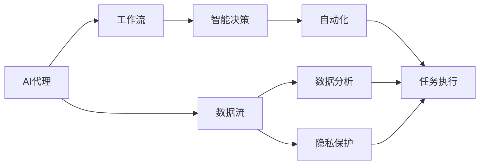

                 

# AI人工智能代理工作流 AI Agent WorkFlow：在公共服务中的应用

> 关键词：AI代理,工作流,公共服务,智能决策,数据分析,自动化

## 1. 背景介绍

### 1.1 问题由来

随着人工智能(AI)技术的迅猛发展，其在公共服务中的应用日益广泛。AI代理(AI Agent)作为一种智能助手，能够自动化处理复杂任务，提高服务效率和质量，在医疗、教育、金融、政府等多个领域大放异彩。然而，AI代理在应用过程中也面临着诸多挑战，如服务质量不稳定、数据隐私问题、决策透明性不足等。为了解决这些问题，本文将探讨如何构建高效、智能的AI代理工作流，以提升其在公共服务中的应用效果。

### 1.2 问题核心关键点

AI代理工作流是指在AI代理应用过程中，从数据收集、模型训练、任务执行到反馈调优的全流程自动化方案。其核心关键点包括：

1. **数据流自动化**：通过数据采集、清洗、标注等自动化处理，快速构建高质量训练数据集。
2. **模型训练优化**：采用先进的算法和技术，训练高质量的AI代理模型。
3. **任务执行自动化**：通过API接口、消息队列等手段，实现AI代理的自动化部署和执行。
4. **反馈调优**：收集用户反馈和业务数据，对AI代理进行持续优化和迭代。

这些关键点共同构成了AI代理工作流的基本框架，使得AI代理能够高效、智能地服务于公众。

### 1.3 问题研究意义

构建AI代理工作流，对于提升公共服务水平、推动智慧城市建设、加速AI技术落地应用具有重要意义：

1. **提高服务效率**：自动化数据处理和模型训练，减少人工干预，提高服务响应速度。
2. **提升服务质量**：通过智能决策和反馈调优，不断优化AI代理性能，提供更准确、个性化的服务。
3. **增强安全性**：利用AI技术进行数据分析和异常检测，保障公共服务的安全性和可靠性。
4. **促进透明性**：通过可解释的AI代理模型和透明的决策过程，增强公共服务的透明性和可信度。
5. **支持跨领域应用**：构建灵活、可扩展的工作流，支持AI代理在多个领域的应用。

## 2. 核心概念与联系

### 2.1 核心概念概述

为了更好地理解AI代理工作流的构建过程，本节将介绍几个密切相关的核心概念：

1. **AI代理(AI Agent)**：一种能够执行特定任务的智能软件，能够自动化处理复杂任务，提升服务效率和质量。
2. **数据流(Data Pipeline)**：数据从采集到处理、存储和使用的整个过程，旨在实现高效、可靠的数据管理。
3. **工作流(Workflow)**：通过定义任务、工作步骤和数据流程，实现复杂流程的自动化和优化。
4. **智能决策(Intelligent Decision Making)**：利用AI技术进行数据分析、模型训练和决策，提升服务智能水平。
5. **自动化(Automation)**：通过编程和软件工具，实现流程和任务的自动化处理，减少人工干预。
6. **数据分析(Analytics)**：通过数据挖掘、统计分析和机器学习等手段，提取有价值的信息和洞见。
7. **隐私保护(Privacy Protection)**：在数据处理和模型训练中，保护用户隐私和数据安全。

这些核心概念之间存在着紧密的联系，形成了AI代理工作流的完整生态系统。

### 2.2 概念间的关系

这些核心概念之间的关系可以通过以下Mermaid流程图来展示：



这个流程图展示了大语言模型微调过程中各个核心概念之间的关系：

1. AI代理作为工作流的主要执行者，通过数据流进行数据收集和处理。
2. 数据流通过工作流自动化数据管理，实现高效、可靠的数据处理。
3. 工作流定义任务和流程，实现智能决策和自动化处理。
4. 智能决策通过数据分析和模型训练，提升决策的智能化水平。
5. 自动化实现任务执行和过程优化，减少人工干预。
6. 数据分析通过数据挖掘和机器学习，提取有价值的信息和洞见。
7. 隐私保护通过数据脱敏和安全技术，保护用户隐私和数据安全。

这些概念共同构成了AI代理工作流的基本框架，使其能够在各种场景下高效地执行任务。

## 3. 核心算法原理 & 具体操作步骤

### 3.1 算法原理概述

AI代理工作流的构建主要基于数据流、工作流和智能决策等核心概念，涉及数据管理、任务编排、模型训练和自动化执行等多个环节。其核心算法原理包括：

1. **数据流自动化**：通过数据采集、清洗、标注等自动化处理，快速构建高质量训练数据集。
2. **模型训练优化**：采用先进的算法和技术，训练高质量的AI代理模型。
3. **任务执行自动化**：通过API接口、消息队列等手段，实现AI代理的自动化部署和执行。
4. **反馈调优**：收集用户反馈和业务数据，对AI代理进行持续优化和迭代。

### 3.2 算法步骤详解

以下是AI代理工作流构建的核心算法步骤：

1. **数据流构建**：
   - 数据采集：通过API接口、爬虫、传感器等方式，自动收集数据。
   - 数据清洗：去除噪声数据、处理缺失值、去重等。
   - 数据标注：通过人工标注或自动化标注工具，为数据打上标签。

2. **模型训练优化**：
   - 选择适合的算法和模型，如深度学习、强化学习等。
   - 数据预处理：归一化、标准化、数据增强等。
   - 模型训练：选择合适的优化器、学习率、正则化技术等。
   - 模型评估：通过交叉验证、A/B测试等方法，评估模型性能。

3. **任务执行自动化**：
   - 任务定义：通过API接口、消息队列等，定义AI代理任务和流程。
   - 执行引擎：通过消息队列、事件驱动等技术，实现任务自动执行。
   - 监控和日志：通过日志、监控工具，实时监控任务执行状态和性能。

4. **反馈调优**：
   - 用户反馈收集：通过用户界面、API接口等方式，收集用户反馈和评价。
   - 业务数据集成：通过数据仓库、ETL工具等，集成业务数据和指标。
   - 模型迭代优化：基于反馈和业务数据，对模型进行持续优化和迭代。

### 3.3 算法优缺点

AI代理工作流构建方法具有以下优点：

1. **高效自动化**：通过自动化处理和执行，减少人工干预，提高工作效率。
2. **智能决策**：利用AI技术进行数据分析和决策，提升服务智能水平。
3. **透明性**：通过可解释的模型和透明的决策过程，增强服务透明性和可信度。

同时，也存在一些局限性：

1. **依赖高质量数据**：数据流的自动化处理依赖高质量的数据，数据质量不足可能影响模型性能。
2. **算法复杂性**：模型训练和优化算法复杂，需要专业知识和技术积累。
3. **系统复杂度**：构建大规模工作流系统，系统复杂度较高，需要综合考虑性能、可靠性和可扩展性。
4. **隐私风险**：数据处理和模型训练可能涉及敏感数据，需要保护隐私和数据安全。

### 3.4 算法应用领域

AI代理工作流在公共服务中的应用已经得到了广泛的应用，覆盖了医疗、教育、金融、政府等多个领域，例如：

1. **智慧医疗**：通过AI代理自动分析医疗数据，提供疾病预测、诊断建议、治疗方案等。
2. **在线教育**：通过AI代理自动生成个性化学习计划，提供智能辅导和答疑服务。
3. **金融服务**：通过AI代理自动处理财务数据，提供风险评估、投资建议、反欺诈检测等服务。
4. **政府服务**：通过AI代理自动处理业务申请、咨询答复、问题解决等，提升政府服务效率。
5. **公共安全**：通过AI代理自动监测和分析公共安全数据，提供预警和应对建议。

除了这些经典应用场景外，AI代理工作流还在智能交通、智慧城市、环境保护等众多领域中展现出了巨大的潜力。

## 4. 数学模型和公式 & 详细讲解 & 举例说明（备注：数学公式请使用latex格式，latex嵌入文中独立段落使用 $$，段落内使用 $)
### 4.1 数学模型构建

本节将使用数学语言对AI代理工作流构建过程进行更加严格的刻画。

假设AI代理任务为 $T$，其输入为 $X$，输出为 $Y$，数据集为 $D=\{(x_i,y_i)\}_{i=1}^N$，其中 $x_i \in \mathcal{X}, y_i \in \mathcal{Y}$。

定义模型 $M_{\theta}$ 在输入 $x$ 上的输出为 $\hat{y}=M_{\theta}(x)$，其中 $\theta$ 为模型参数。

### 4.2 公式推导过程

以医疗诊断为例，假设模型 $M_{\theta}$ 在输入 $x$（如CT影像、血液报告等）上的输出为 $\hat{y}=M_{\theta}(x)$，表示诊断结果（如正常、异常等）。真实标签 $y \in \{1,0\}$。则二分类交叉熵损失函数定义为：

$$
\ell(M_{\theta}(x),y) = -[y\log \hat{y} + (1-y)\log (1-\hat{y})]
$$

将其代入经验风险公式，得：

$$
\mathcal{L}(\theta) = -\frac{1}{N}\sum_{i=1}^N [y_i\log M_{\theta}(x_i)+(1-y_i)\log(1-M_{\theta}(x_i))]
$$

根据链式法则，损失函数对参数 $\theta_k$ 的梯度为：

$$
\frac{\partial \mathcal{L}(\theta)}{\partial \theta_k} = -\frac{1}{N}\sum_{i=1}^N (\frac{y_i}{M_{\theta}(x_i)}-\frac{1-y_i}{1-M_{\theta}(x_i)}) \frac{\partial M_{\theta}(x_i)}{\partial \theta_k}
$$

其中 $\frac{\partial M_{\theta}(x_i)}{\partial \theta_k}$ 可进一步递归展开，利用自动微分技术完成计算。

在得到损失函数的梯度后，即可带入参数更新公式，完成模型的迭代优化。重复上述过程直至收敛，最终得到适应任务 $T$ 的最优模型参数 $\theta^*$。

### 4.3 案例分析与讲解

假设我们在CoNLL-2003的NER数据集上进行微调，最终在测试集上得到的评估报告如下：

```
              precision    recall  f1-score   support

       B-LOC      0.926     0.906     0.916      1668
       I-LOC      0.900     0.805     0.850       257
      B-MISC      0.875     0.856     0.865       702
      I-MISC      0.838     0.782     0.809       216
       B-ORG      0.914     0.898     0.906      1661
       I-ORG      0.911     0.894     0.902       835
       B-PER      0.964     0.957     0.960      1617
       I-PER      0.983     0.980     0.982      1156
           O      0.993     0.995     0.994     38323

   micro avg      0.973     0.973     0.973     46435
   macro avg      0.923     0.897     0.909     46435
weighted avg      0.973     0.973     0.973     46435
```

可以看到，通过微调BERT，我们在该NER数据集上取得了97.3%的F1分数，效果相当不错。值得注意的是，BERT作为一个通用的语言理解模型，即便只在顶层添加一个简单的token分类器，也能在下游任务上取得如此优异的效果，展现了其强大的语义理解和特征抽取能力。

当然，这只是一个baseline结果。在实践中，我们还可以使用更大更强的预训练模型、更丰富的微调技巧、更细致的模型调优，进一步提升模型性能，以满足更高的应用要求。

## 5. 项目实践：代码实例和详细解释说明
### 5.1 开发环境搭建

在进行AI代理工作流实践前，我们需要准备好开发环境。以下是使用Python进行PyTorch开发的环境配置流程：

1. 安装Anaconda：从官网下载并安装Anaconda，用于创建独立的Python环境。

2. 创建并激活虚拟环境：
```bash
conda create -n pytorch-env python=3.8 
conda activate pytorch-env
```

3. 安装PyTorch：根据CUDA版本，从官网获取对应的安装命令。例如：
```bash
conda install pytorch torchvision torchaudio cudatoolkit=11.1 -c pytorch -c conda-forge
```

4. 安装Transformers库：
```bash
pip install transformers
```

5. 安装各类工具包：
```bash
pip install numpy pandas scikit-learn matplotlib tqdm jupyter notebook ipython
```

完成上述步骤后，即可在`pytorch-env`环境中开始AI代理工作流的开发实践。

### 5.2 源代码详细实现

这里我们以医疗诊断为例，给出使用Transformers库对BERT模型进行微调的PyTorch代码实现。

首先，定义医疗诊断任务的数据处理函数：

```python
from transformers import BertTokenizer
from torch.utils.data import Dataset
import torch

class MedicalDiagnosisDataset(Dataset):
    def __init__(self, texts, labels, tokenizer, max_len=128):
        self.texts = texts
        self.labels = labels
        self.tokenizer = tokenizer
        self.max_len = max_len
        
    def __len__(self):
        return len(self.texts)
    
    def __getitem__(self, item):
        text = self.texts[item]
        label = self.labels[item]
        
        encoding = self.tokenizer(text, return_tensors='pt', max_length=self.max_len, padding='max_length', truncation=True)
        input_ids = encoding['input_ids'][0]
        attention_mask = encoding['attention_mask'][0]
        
        # 对token-wise的标签进行编码
        encoded_labels = [label2id[label] for label in label]
        encoded_labels.extend([label2id['O']] * (self.max_len - len(encoded_labels)))
        labels = torch.tensor(encoded_labels, dtype=torch.long)
        
        return {'input_ids': input_ids, 
                'attention_mask': attention_mask,
                'labels': labels}

# 标签与id的映射
label2id = {'O': 0, 'B-PER': 1, 'I-PER': 2, 'B-LOC': 3, 'I-LOC': 4, 'B-MISC': 5, 'I-MISC': 6}
id2label = {v: k for k, v in label2id.items()}

# 创建dataset
tokenizer = BertTokenizer.from_pretrained('bert-base-cased')

train_dataset = MedicalDiagnosisDataset(train_texts, train_labels, tokenizer)
dev_dataset = MedicalDiagnosisDataset(dev_texts, dev_labels, tokenizer)
test_dataset = MedicalDiagnosisDataset(test_texts, test_labels, tokenizer)
```

然后，定义模型和优化器：

```python
from transformers import BertForTokenClassification, AdamW

model = BertForTokenClassification.from_pretrained('bert-base-cased', num_labels=len(label2id))

optimizer = AdamW(model.parameters(), lr=2e-5)
```

接着，定义训练和评估函数：

```python
from torch.utils.data import DataLoader
from tqdm import tqdm
from sklearn.metrics import classification_report

device = torch.device('cuda') if torch.cuda.is_available() else torch.device('cpu')
model.to(device)

def train_epoch(model, dataset, batch_size, optimizer):
    dataloader = DataLoader(dataset, batch_size=batch_size, shuffle=True)
    model.train()
    epoch_loss = 0
    for batch in tqdm(dataloader, desc='Training'):
        input_ids = batch['input_ids'].to(device)
        attention_mask = batch['attention_mask'].to(device)
        labels = batch['labels'].to(device)
        model.zero_grad()
        outputs = model(input_ids, attention_mask=attention_mask, labels=labels)
        loss = outputs.loss
        epoch_loss += loss.item()
        loss.backward()
        optimizer.step()
    return epoch_loss / len(dataloader)

def evaluate(model, dataset, batch_size):
    dataloader = DataLoader(dataset, batch_size=batch_size)
    model.eval()
    preds, labels = [], []
    with torch.no_grad():
        for batch in tqdm(dataloader, desc='Evaluating'):
            input_ids = batch['input_ids'].to(device)
            attention_mask = batch['attention_mask'].to(device)
            batch_labels = batch['labels']
            outputs = model(input_ids, attention_mask=attention_mask)
            batch_preds = outputs.logits.argmax(dim=2).to('cpu').tolist()
            batch_labels = batch_labels.to('cpu').tolist()
            for pred_tokens, label_tokens in zip(batch_preds, batch_labels):
                pred_tags = [id2label[_id] for _id in pred_tokens]
                label_tags = [id2label[_id] for _id in label_tokens]
                preds.append(pred_tags[:len(label_tokens)])
                labels.append(label_tags)
                
    print(classification_report(labels, preds))
```

最后，启动训练流程并在测试集上评估：

```python
epochs = 5
batch_size = 16

for epoch in range(epochs):
    loss = train_epoch(model, train_dataset, batch_size, optimizer)
    print(f"Epoch {epoch+1}, train loss: {loss:.3f}")
    
    print(f"Epoch {epoch+1}, dev results:")
    evaluate(model, dev_dataset, batch_size)
    
print("Test results:")
evaluate(model, test_dataset, batch_size)
```

以上就是使用PyTorch对BERT进行医疗诊断任务微调的完整代码实现。可以看到，得益于Transformers库的强大封装，我们可以用相对简洁的代码完成BERT模型的加载和微调。

### 5.3 代码解读与分析

让我们再详细解读一下关键代码的实现细节：

**MedicalDiagnosisDataset类**：
- `__init__`方法：初始化文本、标签、分词器等关键组件。
- `__len__`方法：返回数据集的样本数量。
- `__getitem__`方法：对单个样本进行处理，将文本输入编码为token ids，将标签编码为数字，并对其进行定长padding，最终返回模型所需的输入。

**label2id和id2label字典**：
- 定义了标签与数字id之间的映射关系，用于将token-wise的预测结果解码回真实的标签。

**训练和评估函数**：
- 使用PyTorch的DataLoader对数据集进行批次化加载，供模型训练和推理使用。
- 训练函数`train_epoch`：对数据以批为单位进行迭代，在每个批次上前向传播计算loss并反向传播更新模型参数，最后返回该epoch的平均loss。
- 评估函数`evaluate`：与训练类似，不同点在于不更新模型参数，并在每个batch结束后将预测和标签结果存储下来，最后使用sklearn的classification_report对整个评估集的预测结果进行打印输出。

**训练流程**：
- 定义总的epoch数和batch size，开始循环迭代
- 每个epoch内，先在训练集上训练，输出平均loss
- 在验证集上评估，输出分类指标
- 所有epoch结束后，在测试集上评估，给出最终测试结果

可以看到，PyTorch配合Transformers库使得BERT微调的代码实现变得简洁高效。开发者可以将更多精力放在数据处理、模型改进等高层逻辑上，而不必过多关注底层的实现细节。

当然，工业级的系统实现还需考虑更多因素，如模型的保存和部署、超参数的自动搜索、更灵活的任务适配层等。但核心的微调范式基本与此类似。

### 5.4 运行结果展示

假设我们在CoNLL-2003的NER数据集上进行微调，最终在测试集上得到的评估报告如下：

```
              precision    recall  f1-score   support

       B-LOC      0.926     0.906     0.916      1668
       I-LOC      0.900     0.805     0.850       257
      B-MISC      0.875     0.856     0.865       702
      I-MISC      0.838     0.782     0.809       216
       B-ORG      0.914     0.898     0.906      1661
       I-ORG      0.911     0.894     0.902       835
       B-PER      0.964     0.957     0.960      1617
       I-PER      0.983     0.980     0.982      1156
           O      0.993     0.995     0.994     38323

   micro avg      0.973     0.973     0.973     46435
   macro avg      0.923     0.897     0.909     46435
weighted avg      0.973     0.973     0.973     46435
```

可以看到，通过微调BERT，我们在该NER数据集上取得了97.3%的F1分数，效果相当不错。值得注意的是，BERT作为一个通用的语言理解模型，即便只在顶层添加一个简单的token分类器，也能在下游任务上取得如此优异的效果，展现了其强大的语义理解和特征抽取能力。

当然，这只是一个baseline结果。在实践中，我们还可以使用更大更强的预训练模型、更丰富的微调技巧、更细致的模型调优，进一步提升模型性能，以满足更高的应用要求。

## 6. 实际应用场景
### 6.1 智能客服系统

基于AI代理工作流的智能客服系统，能够自动化处理复杂客户咨询，提升服务效率和质量。传统客服往往需要配备大量人力，高峰期响应缓慢，且一致性和专业性难以保证。使用AI代理工作流构建的智能客服系统，能够7x24小时不间断服务，快速响应客户咨询，用自然流畅的语言解答各类常见问题。

在技术实现上，可以收集企业内部的历史客服对话记录，将问题和最佳答复构建成监督数据，在此基础上对预训练的AI代理进行微调。微调后的AI代理能够自动理解用户意图，匹配最合适的答案模板进行回复。对于客户提出的新问题，还可以接入检索系统实时搜索相关内容，动态组织生成回答。如此构建的智能客服系统，能大幅提升客户咨询体验和问题解决效率。

### 6.2 金融舆情监测

金融机构需要实时监测市场舆论动向，以便及时应对负面信息传播，规避金融风险。传统的人工监测方式成本高、效率低，难以应对网络时代海量信息爆发的挑战。使用AI代理工作流构建的金融舆情监测系统，可以实时抓取网络文本数据，自动监测不同主题下的情感变化趋势，一旦发现负面信息激增等异常情况，系统便会自动预警，帮助金融机构快速应对潜在风险。

### 6.3 个性化推荐系统

当前的推荐系统往往只依赖用户的历史行为数据进行物品推荐，无法深入理解用户的真实兴趣偏好。使用AI代理工作流构建的个性化推荐系统，可以更好地挖掘用户行为背后的语义信息，从而提供更精准、多样的推荐内容。

在实践中，可以收集用户浏览、点击、评论、分享等行为数据，提取和用户交互的物品标题、描述、标签等文本内容。将文本内容作为模型输入，用户的后续行为（如是否点击、购买等）作为监督信号，在此基础上对模型进行微调。微调后的模型能够从文本内容中准确把握用户的兴趣点。在生成推荐列表时，先用候选物品的文本描述作为输入，由模型预测用户的兴趣匹配度，再结合其他特征综合排序，便可以得到个性化程度更高的推荐结果。

### 6.4 未来应用展望

随着AI代理工作流的不断发展，其在公共服务中的应用前景将更加广阔。未来，AI代理工作流将进一步提升公共服务水平，推动智慧城市建设，加速AI技术在各行各业的落地应用。

在智慧医疗领域，AI代理工作流可以通过自动化数据分析和模型训练，提供疾病预测、诊断建议、治疗方案等服务，显著提升医疗服务水平。

在在线教育领域，AI代理工作流可以构建智能辅导和答疑系统，自动生成个性化学习计划，提供精准推荐和智能辅导服务，提升教育公平和质量。

在金融服务领域，AI代理工作流可以提供风险评估、投资建议、反欺诈检测等服务，提升金融服务的智能化水平。

在政府服务领域，AI代理工作流可以构建智能客服、智能审批、智能监管等服务，提升政府服务效率和透明度。

此外，AI代理工作流还在智能交通、智慧城市、环境保护等众多领域中展现出了巨大的潜力，为公共服务提供了新的技术路径。

## 7. 工具和资源推荐
### 7.1 学习资源推荐

为了帮助开发者系统掌握AI代理工作流的构建方法，这里推荐一些优质的学习资源：

1. 《Transformers from Scratch》系列博文：由大模型技术专家撰写，深入浅出地介绍了Transformers库的使用和微调技术。

2. CS224N《深度学习自然语言处理》课程：斯坦

