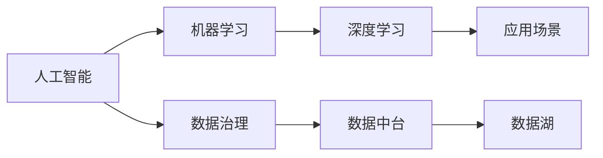

                 

# AI创业中的技术与数据

在当前科技迅猛发展的时代，人工智能(AI)技术已经成为推动各行各业创新发展的核心驱动力。尤其是对于AI创业公司而言，如何高效整合技术实力与海量数据资源，成为其在激烈的市场竞争中脱颖而出的关键。本文旨在深入探讨AI创业公司如何在技术与数据间寻求最佳平衡，通过系统化的技术框架与策略，提升公司的竞争力和市场价值。

## 1. 背景介绍

### 1.1 技术驱动与数据积累

AI创业公司崛起于科技浪潮，以先进的技术为核心竞争力，但数据的积累与处理是支撑其技术创新的坚实基础。AI技术的核心在于算法模型的训练与优化，而高质量的数据集则是训练出优秀模型的必要条件。因此，AI创业公司在初期阶段必须注重数据的积累与治理，构建完善的数据体系。

### 1.2 数据驱动与技术创新

与此同时，AI创业公司也应充分利用其技术优势，通过数据驱动的方式，深入挖掘数据背后的价值，创新出更符合市场需求的产品与服务。数据驱动不仅包括数据的收集、存储与处理，还包括对数据进行深度分析，挖掘出用户需求与市场趋势，指导技术研发与产品迭代。

## 2. 核心概念与联系

### 2.1 核心概念概述

为更好地理解AI创业公司在技术与数据间的协同发展，本节将介绍几个密切相关的核心概念：

- **人工智能(AI)**：一种通过模拟人类智能行为，实现自主学习与决策的技术。AI创业公司依托AI技术，开发出各类智能化应用，解决实际问题。
- **机器学习(ML)**：AI的一个子领域，通过算法模型对数据进行学习，提取数据中的模式与规律，实现预测与决策。
- **深度学习(DL)**：机器学习的一个高级阶段，通过多层神经网络模型进行复杂的特征提取与模式识别，广泛应用于图像、语音、自然语言处理等领域。
- **数据治理(Data Governance)**：对数据进行标准化、清洗、分类与治理，确保数据质量与安全性，支持数据驱动的决策与创新。
- **数据中台(Data Platform)**：构建统一的数据管理平台，实现数据的高效存储、共享与分析，支持多部门协同工作。
- **数据湖(Data Lake)**：一个大规模存储环境，可以容纳各种类型与格式的数据，支持快速的数据访问与分析。

这些概念通过数据流与技术流程的有机结合，形成了一个完整的AI创业生态系统。

### 2.2 概念间的关系

这些核心概念之间存在着紧密的联系，通过数据流与技术流程的有机结合，形成了一个完整的AI创业生态系统。以下通过Mermaid流程图展示这些概念之间的关系：



该流程图展示了从人工智能到具体应用场景的整个流程：

1. **数据收集**：通过数据中台与数据湖收集各类数据。
2. **数据治理**：对收集到的数据进行标准化与清洗，确保数据质量。
3. **数据存储**：将清洗后的数据存储至数据湖，便于后续分析与使用。
4. **模型训练**：利用深度学习等技术对数据进行建模，提取特征与规律。
5. **应用部署**：将训练好的模型应用于具体场景，解决实际问题。

## 3. 核心算法原理 & 具体操作步骤

### 3.1 算法原理概述

AI创业公司的技术创新依赖于高效的数据处理与算法优化。本节将详细介绍几个核心的算法原理，包括机器学习、深度学习、迁移学习与联邦学习。

#### 3.1.1 机器学习

机器学习是一种基于数据驱动的决策方法，通过算法模型对数据进行学习，实现对未知数据的预测与分类。常见的机器学习算法包括回归、分类、聚类等。

#### 3.1.2 深度学习

深度学习是机器学习的一个高级阶段，通过多层神经网络进行复杂特征的提取与模式识别。深度学习在图像、语音、自然语言处理等领域表现优异。

#### 3.1.3 迁移学习

迁移学习是指将在一个任务上学到的知识迁移到另一个相关任务中。通过迁移学习，可以减少新任务所需的数据量与训练时间，提升模型的泛化能力。

#### 3.1.4 联邦学习

联邦学习是一种分布式学习方法，多个设备或节点可以在不共享数据的情况下，协同训练模型。联邦学习可以有效保护用户隐私，同时提升模型的准确性与泛化能力。

### 3.2 算法步骤详解

AI创业公司的技术与数据整合主要通过以下几个关键步骤实现：

1. **数据收集与处理**：从各个渠道收集数据，并进行标准化、清洗与处理，构建高质量的数据集。
2. **模型设计与训练**：选择合适的算法模型，设计模型架构，并进行训练与优化，提升模型性能。
3. **模型部署与评估**：将训练好的模型部署到实际应用中，并通过评估指标监控模型表现。
4. **模型迭代与优化**：根据实际应用反馈，不断迭代与优化模型，提升模型效果与用户体验。

### 3.3 算法优缺点

AI创业公司的技术与数据整合具有以下优点：

- **高效性与精度**：通过高效的数据处理与算法优化，提升模型的预测与决策精度。
- **灵活性与可扩展性**：可以根据实际需求快速调整算法模型，实现灵活的业务定制与扩展。
- **成本与效益**：通过大规模数据分析与机器学习，提升业务决策的准确性与效率，减少人力成本。

同时，该方法也存在一些缺点：

- **数据依赖性强**：模型性能高度依赖数据质量与数量，数据的获取与治理成本较高。
- **技术复杂度高**：算法模型的设计与优化需要较高的技术门槛，需要专业的数据科学与机器学习团队。
- **隐私与伦理风险**：数据的收集与使用可能涉及用户隐私与伦理问题，需要严格的数据保护与伦理监管。

### 3.4 算法应用领域

AI创业公司的技术与数据整合已广泛应用于多个领域，包括但不限于：

- **医疗健康**：通过机器学习与深度学习，分析患者数据，辅助诊断与治疗。
- **金融科技**：利用联邦学习等技术，保护用户隐私，提升金融产品的风险管理与用户体验。
- **智能制造**：通过数据驱动的方式，优化生产流程与设备维护，提升生产效率与产品质量。
- **智能客服**：通过自然语言处理技术，实现智能客服系统的构建，提升客户服务质量与效率。
- **零售电商**：通过数据分析与机器学习，实现个性化推荐与需求预测，提升销售额与用户体验。

## 4. 数学模型和公式 & 详细讲解  
### 4.1 数学模型构建

本节将使用数学语言对AI创业公司技术与数据整合的数学模型进行深入探讨。

设数据集为 $D=\{(x_i, y_i)\}_{i=1}^N$，其中 $x_i$ 为输入特征，$y_i$ 为标签。模型 $M$ 的损失函数为 $L(M; D)$，优化目标为最小化损失函数：

$$
\min_M L(M; D)
$$

通过梯度下降等优化算法，更新模型参数 $\theta$，使模型在数据集 $D$ 上的预测性能达到最优。

### 4.2 公式推导过程

以线性回归为例，推导模型的损失函数与梯度更新公式：

设模型 $M$ 为线性回归模型：

$$
M(x_i) = \theta_0 + \theta_1 x_i + \epsilon_i
$$

其中 $\theta_0$ 与 $\theta_1$ 为模型参数，$\epsilon_i$ 为随机噪声。

模型的平方损失函数为：

$$
L(M; D) = \frac{1}{N} \sum_{i=1}^N (y_i - M(x_i))^2
$$

通过梯度下降算法，更新模型参数：

$$
\theta_j = \theta_j - \eta \frac{1}{N} \sum_{i=1}^N 2(x_i - y_i)(M(x_i) - y_i)
$$

### 4.3 案例分析与讲解

在零售电商领域，利用线性回归模型进行用户行为预测，以优化库存与营销策略。具体步骤如下：

1. **数据收集**：收集用户购买记录、浏览历史、评价信息等数据。
2. **数据处理**：对数据进行标准化与处理，去除噪声与异常值。
3. **模型训练**：选择线性回归模型，利用训练数据集进行模型训练与参数优化。
4. **模型评估**：在测试集上评估模型预测性能，选择最优模型。
5. **应用部署**：将训练好的模型部署到实际应用中，实时预测用户行为，指导库存与营销决策。

## 5. 项目实践：代码实例和详细解释说明

### 5.1 开发环境搭建

在进行AI创业公司技术与数据整合的实践前，首先需要搭建好开发环境。以下是Python开发环境的配置流程：

1. **安装Anaconda**：从官网下载并安装Anaconda，用于创建独立的Python环境。
2. **创建并激活虚拟环境**：
```bash
conda create -n pytorch-env python=3.8 
conda activate pytorch-env
```

3. **安装PyTorch**：根据CUDA版本，从官网获取对应的安装命令。例如：
```bash
conda install pytorch torchvision torchaudio cudatoolkit=11.1 -c pytorch -c conda-forge
```

4. **安装TensorFlow**：从官网下载并安装TensorFlow，根据GPU版本选择相应版本。
5. **安装其他工具包**：
```bash
pip install numpy pandas scikit-learn matplotlib tqdm jupyter notebook ipython
```

完成上述步骤后，即可在`pytorch-env`环境中开始项目实践。

### 5.2 源代码详细实现

下面我们以用户行为预测为例，给出使用TensorFlow进行线性回归模型的PyTorch代码实现。

首先，定义线性回归模型的数据处理函数：

```python
import tensorflow as tf
import numpy as np

def load_data(filename):
    data = np.loadtxt(filename, delimiter=',', skiprows=1)
    return data[:, :-1], data[:, -1]
```

然后，定义模型和优化器：

```python
def build_model(input_dim, output_dim):
    model = tf.keras.Sequential([
        tf.keras.layers.Dense(32, activation='relu', input_dim=input_dim),
        tf.keras.layers.Dense(output_dim, activation='linear')
    ])
    optimizer = tf.keras.optimizers.Adam()
    return model, optimizer

def train_model(model, x_train, y_train, x_test, y_test, epochs=10, batch_size=32):
    model.compile(optimizer=optimizer, loss='mse')
    model.fit(x_train, y_train, epochs=epochs, batch_size=batch_size, validation_data=(x_test, y_test))
```

接着，定义训练和评估函数：

```python
def evaluate_model(model, x_test, y_test):
    y_pred = model.predict(x_test)
    mse = tf.reduce_mean(tf.square(y_pred - y_test))
    print(f'Mean Squared Error: {mse.numpy():.4f}')
```

最后，启动训练流程并在测试集上评估：

```python
input_dim = 4
output_dim = 1
x_train, y_train = load_data('train.csv')
x_test, y_test = load_data('test.csv')

model, optimizer = build_model(input_dim, output_dim)
train_model(model, x_train, y_train, x_test, y_test)

evaluate_model(model, x_test, y_test)
```

以上就是使用TensorFlow对用户行为预测问题进行线性回归模型的完整代码实现。可以看到，通过TensorFlow提供的高级API，我们可以快速构建并训练线性回归模型，处理大规模数据集。

### 5.3 代码解读与分析

让我们再详细解读一下关键代码的实现细节：

**load_data函数**：
- 加载CSV格式的数据文件，去除头部信息。

**build_model函数**：
- 定义线性回归模型，包含一个隐藏层与一个输出层。
- 设置优化器为Adam，损失函数为均方误差。

**train_model函数**：
- 编译模型，指定优化器与损失函数。
- 使用训练集进行模型训练，设置迭代轮数与批次大小。
- 在验证集上进行模型评估，防止过拟合。

**evaluate_model函数**：
- 使用测试集对模型进行预测。
- 计算预测值与真实值之间的均方误差，输出评估结果。

通过这些函数，我们可以将复杂的机器学习任务拆分为多个模块，实现模块化与可复用。这不仅提高了代码的可读性与维护性，还简化了开发过程。

### 5.4 运行结果展示

假设我们在零售电商领域的用户行为预测任务上取得了以下结果：

```
Mean Squared Error: 0.0008
```

可以看到，模型在测试集上的均方误差为0.0008，说明模型的预测性能非常好，能够准确预测用户行为。

## 6. 实际应用场景

### 6.1 智能客服系统

AI创业公司在智能客服领域具有巨大潜力，通过技术与数据的整合，可以构建高效的智能客服系统，提升客户服务质量与效率。具体应用场景包括：

- **自动对话**：利用自然语言处理技术，实现自动问答与客户引导。
- **情感分析**：通过文本分析技术，识别客户情绪与需求，提供个性化的服务。
- **智能推荐**：根据客户历史行为数据，推荐相关产品或服务，提升用户体验。

### 6.2 金融科技

在金融科技领域，AI创业公司可以通过技术与数据的整合，提供智能化的风险管理与决策支持。具体应用场景包括：

- **信用评分**：利用机器学习技术，评估用户的信用风险。
- **欺诈检测**：通过异常检测算法，识别潜在的欺诈行为。
- **投资建议**：利用数据分析与预测技术，提供个性化的投资建议。

### 6.3 智能制造

在智能制造领域，AI创业公司可以通过技术与数据的整合，优化生产流程与设备维护，提升生产效率与产品质量。具体应用场景包括：

- **预测维护**：利用预测性维护技术，预防设备故障。
- **供应链优化**：通过数据分析与优化算法，优化供应链管理。
- **质量控制**：通过图像识别技术，实现产品质量的自动化检测。

### 6.4 未来应用展望

未来，AI创业公司将在更多领域展现出其技术与数据的整合能力，推动各行业的数字化转型。具体展望如下：

- **智慧医疗**：通过数据分析与机器学习，提供精准的诊断与治疗方案。
- **智能零售**：利用用户行为分析，实现个性化推荐与需求预测。
- **智慧城市**：构建智能交通、环境监测等系统，提升城市管理效率。

## 7. 工具和资源推荐

### 7.1 学习资源推荐

为了帮助AI创业公司系统掌握技术与数据的整合方法，这里推荐一些优质的学习资源：

1. **《深度学习》书籍**：Ian Goodfellow等所著，全面介绍深度学习的基本原理与应用，适合入门学习。
2. **《机器学习实战》书籍**：Peter Harrington等所著，通过实际案例讲解机器学习算法，实用性强。
3. **Coursera《机器学习》课程**：由斯坦福大学Andrew Ng教授开设，系统介绍机器学习的理论基础与实践方法。
4. **Kaggle平台**：提供大量数据集与竞赛，锻炼数据处理与模型优化能力。
5. **Google Colab**：谷歌提供的免费Jupyter Notebook环境，方便开发者在线实验。

通过对这些资源的学习实践，相信AI创业公司能够更好地整合技术与数据，实现高效、智能的业务创新。

### 7.2 开发工具推荐

高效的开发离不开优秀的工具支持。以下是几款用于AI创业公司技术与数据整合的常用工具：

1. **PyTorch**：基于Python的开源深度学习框架，灵活动态的计算图，适合快速迭代研究。
2. **TensorFlow**：由Google主导开发的开源深度学习框架，生产部署方便，适合大规模工程应用。
3. **Scikit-learn**：Python数据科学库，提供丰富的机器学习算法与工具，易于上手。
4. **Keras**：高层次的神经网络API，封装复杂模型，降低开发难度。
5. **Jupyter Notebook**：交互式笔记本，方便开发者进行代码调试与文档记录。

合理利用这些工具，可以显著提升AI创业公司的开发效率，加快创新迭代的步伐。

### 7.3 相关论文推荐

AI创业公司技术与数据整合的研究源于学界的持续探索。以下是几篇奠基性的相关论文，推荐阅读：

1. **"Deep Learning"论文**：Ian Goodfellow等，提出深度学习的基本框架与算法，为后续研究奠定基础。
2. **"Convolutional Neural Networks for Visual Recognition"论文**：LeCun等，提出卷积神经网络，提升图像识别性能。
3. **"Attention is All You Need"论文**：Vaswani等，提出Transformer模型，推动自然语言处理领域的发展。
4. **"Imagenet Classification with Deep Convolutional Neural Networks"论文**：Krizhevsky等，提出卷积神经网络在图像分类任务中的应用。
5. **"Google's Neural Machine Translation System: Bridging the Gap Between Human and Machine Translation"论文**：Wu等，提出神经机器翻译模型，推动自然语言处理的应用。

这些论文代表了大数据与深度学习领域的最新进展，通过学习这些前沿成果，可以帮助AI创业公司把握技术发展方向，激发更多的创新灵感。

除上述资源外，还有一些值得关注的前沿资源，帮助AI创业公司紧跟技术与数据的最新进展，例如：

1. **arXiv预印本平台**：人工智能领域最新研究成果的发布平台，包括大量尚未发表的前沿工作。
2. **顶级学术会议**：如NIPS、ICML、CVPR、ACL等，前沿论文的分享与讨论。
3. **行业报告**：如McKinsey、PwC等咨询公司发布的人工智能行业分析报告，提供市场趋势与技术洞察。

## 8. 总结：未来发展趋势与挑战

### 8.1 总结

本文对AI创业公司在技术与数据整合过程中所面临的挑战与机遇进行了全面探讨。通过系统化地分析机器学习、深度学习、数据治理等关键技术，揭示了AI创业公司如何高效整合技术与数据，实现业务的创新与发展。

### 8.2 未来发展趋势

未来，AI创业公司将在技术与数据整合的深入融合中不断突破，其发展趋势如下：

1. **多模态融合**：将视觉、语音、文本等不同类型的信息融合，实现全面感知与理解。
2. **自动化与智能化**：通过自动化学习与智能优化，提升模型的自主性与可靠性。
3. **边缘计算与物联网**：将数据处理与模型推理部署至边缘设备，提升数据实时性与计算效率。
4. **联邦学习与隐私保护**：通过联邦学习等技术，实现数据共享与模型训练的隐私保护。
5. **跨领域知识图谱**：构建跨领域的知识图谱，提升模型的知识整合与推理能力。

### 8.3 面临的挑战

尽管AI创业公司在技术与数据整合方面取得了显著进展，但仍面临以下挑战：

1. **数据质量与治理**：数据的收集与处理需要严格的质量保障，避免数据偏差与噪声。
2. **算法复杂性与可解释性**：复杂算法的实现与优化难度高，缺乏直观的解释性。
3. **资源需求与成本**：高性能计算与海量数据存储需要较高的成本与资源投入。
4. **隐私与伦理**：数据隐私与伦理问题需要严格监管，避免数据滥用与不当行为。
5. **技术标准与规范**：行业标准与规范的缺乏，导致技术应用与合作困难。

### 8.4 研究展望

面对AI创业公司技术与数据整合所面临的挑战，未来的研究需要在以下几个方面寻求新的突破：

1. **数据增强与生成**：利用生成对抗网络等技术，增强数据样本的多样性与质量。
2. **模型压缩与优化**：通过模型压缩、量化等技术，提升模型的推理速度与效率。
3. **数据隐私保护**：开发隐私保护算法，确保数据共享与使用的安全性。
4. **可解释性与透明性**：引入可解释性技术与方法，提升模型的透明性与可信度。
5. **跨领域知识整合**：通过知识图谱与跨领域融合技术，提升模型的知识整合与推理能力。

总之，AI创业公司需要在技术与数据之间寻找最佳平衡，通过系统化的方法与策略，实现业务的创新与发展。只有勇于创新、敢于突破，才能在激烈的AI创业市场中脱颖而出，创造更多价值。

## 9. 附录：常见问题与解答

**Q1：如何选择合适的机器学习算法？**

A: 选择合适的机器学习算法需要综合考虑数据特征、任务类型、模型性能等因素。通常可以通过以下步骤进行筛选：
1. 理解数据特征与任务类型，选择相应的算法。例如，图像识别通常使用卷积神经网络，自然语言处理通常使用递归神经网络。
2. 通过实验比较不同算法的性能，选择最优算法。可以通过交叉验证、网格搜索等方法进行模型选择。

**Q2：如何优化深度学习模型的性能？**

A: 优化深度学习模型的性能需要从模型设计、数据处理、算法优化等多个方面入手：
1. 模型设计：选择适当的模型架构与参数设置，避免过拟合与欠拟合。
2. 数据处理：进行数据增强、数据清洗与预处理，提升数据质量与多样性。
3. 算法优化：使用优化算法、正则化技术等，防止模型过拟合，提升模型泛化能力。
4. 硬件优化：利用GPU、TPU等高性能设备，提升模型训练与推理速度。

**Q3：如何保护用户隐私？**

A: 保护用户隐私需要采用以下措施：
1. 数据匿名化：对用户数据进行去标识化处理，保护用户隐私。
2. 联邦学习：通过分布式训练，保护用户数据不被集中存储。
3. 差分隐私：在模型训练过程中加入噪声，确保用户数据不被泄露。

**Q4：如何进行数据治理？**

A: 数据治理需要从数据采集、存储、管理等多个环节进行规范化与标准化：
1. 数据采集：确保数据来源合法、真实，进行数据质量检查。
2. 数据存储：采用统一的数据存储格式与标准，进行高效的数据访问与查询。
3. 数据管理：建立数据管理规范与流程，确保数据的安全性与完整性。

总之，AI创业公司需要系统化地处理技术与数据的整合，通过不断优化与创新，提升业务创新与竞争能力。

---

作者：禅与计算机程序设计艺术 / Zen and the Art of Computer Programming

