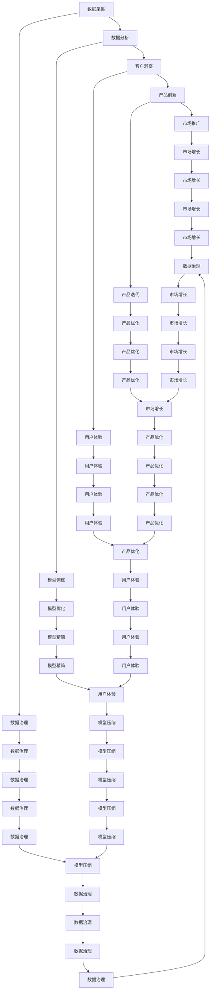

                 

## 1. 背景介绍

### 1.1 问题由来

在人工智能（AI）技术迅猛发展的背景下，如何有效地将AI技术融入商业模式，推动产业升级，成为一个迫切需要解决的问题。AI技术的强大能力，可以应用于各个行业，如医疗、金融、教育、物流等，通过自动化、智能化、个性化等方式提升业务效率，创造更多的商业价值。

### 1.2 问题核心关键点

AI技术与商业模式的结合，需要解决的关键问题包括：

- 如何选择合适的AI技术，并将其应用于特定的业务场景中。
- 如何设计合理的商业模式，实现AI技术的商业化运作。
- 如何衡量AI技术的商业价值，以及如何通过持续优化提升AI技术的商业效果。
- 如何在AI技术发展过程中，不断适应市场变化，维持竞争优势。

### 1.3 问题研究意义

研究AI技术与商业模式的结合，对于推动AI技术的产业应用，提升企业竞争力，以及加速AI技术的商业化进程，具有重要意义：

1. **降低成本**：AI技术能够自动化处理大量重复性任务，降低人工成本，提高运营效率。
2. **提升质量**：通过数据分析和机器学习，AI技术可以提供更准确、可靠的决策支持，提升产品和服务质量。
3. **创造价值**：AI技术可以创造新的商业模式和业务形态，带来更多商业机会和收入来源。
4. **加速创新**：AI技术的应用，可以促进企业快速迭代，及时响应市场变化，保持竞争优势。
5. **驱动经济**：AI技术的广泛应用，将推动经济增长，提升社会生产效率，创造更多就业机会。

## 2. 核心概念与联系

### 2.1 核心概念概述

为了更好地理解AI技术与商业模式的结合，本节将介绍几个密切相关的核心概念：

- **人工智能（AI）**：指通过计算机模拟人类智能的科学技术，包括机器学习、深度学习、自然语言处理、计算机视觉等。
- **机器学习（ML）**：指让计算机从数据中学习规律，并应用于实际问题的解决。
- **深度学习（DL）**：一种机器学习技术，通过多层神经网络实现复杂的模式识别和预测。
- **自然语言处理（NLP）**：使计算机能够理解、处理和生成人类语言的技术。
- **计算机视觉（CV）**：让计算机能够“看”和理解图像和视频的技术。
- **商业模式（Business Model）**：指企业通过何种方式提供价值，实现收入，同时保持可持续发展。

这些核心概念之间的逻辑关系可以通过以下Mermaid流程图来展示：

```mermaid
graph LR
    A[人工智能(AI)] --> B[机器学习(ML)]
    A --> C[深度学习(DL)]
    A --> D[自然语言处理(NLP)]
    A --> E[计算机视觉(CV)]
    B --> F[数据处理]
    B --> G[模型训练]
    C --> H[多层神经网络]
    D --> I[语义理解]
    D --> J[文本生成]
    E --> K[图像识别]
    E --> L[物体检测]
    F --> M[数据预处理]
    G --> N[模型优化]
    H --> O[特征提取]
    I --> P[情感分析]
    J --> Q[自动摘要]
    K --> R[目标检测]
    L --> S[图像分类]
    M --> T[特征编码]
    N --> U[模型调优]
    O --> V[高维表示]
    P --> W[情感建模]
    Q --> X[内容聚合]
    R --> Y[物体识别]
    S --> Z[图像分类]
    T --> AA[特征压缩]
    U --> BB[模型精简]
    V --> CC[稀疏表示]
    W --> DD[情感分析]
    X --> EE[内容聚合]
    Y --> FF[物体识别]
    Z --> GG[图像分类]
```

这个流程图展示了AI技术的基本构成，以及这些技术在商业应用中的具体应用。

### 2.2 概念间的关系

这些核心概念之间存在着紧密的联系，形成了AI技术与商业模式结合的完整生态系统。下面我通过几个Mermaid流程图来展示这些概念之间的关系。

#### 2.2.1 AI技术与商业模式的结合

```mermaid
graph TB
    A[人工智能(AI)] --> B[商业模式(BM)]
    B --> C[产品设计]
    B --> D[市场分析]
    B --> E[客户服务]
    A --> F[数据采集]
    A --> G[模型训练]
    A --> H[模型优化]
    A --> I[模型部署]
    I --> J[应用场景]
    C --> K[产品创新]
    D --> L[市场推广]
    E --> M[客户互动]
    F --> N[数据挖掘]
    G --> O[模型优化]
    H --> P[模型精简]
    I --> Q[模型部署]
    J --> R[应用场景]
    K --> S[新产品]
    L --> T[市场增长]
    M --> U[客户体验]
    N --> V[数据治理]
    O --> W[模型压缩]
    P --> X[模型精简]
    Q --> Y[模型部署]
    R --> Z[应用场景]
```

这个流程图展示了AI技术与商业模式的结合过程，包括数据采集、模型训练、模型优化、模型部署等关键步骤。

#### 2.2.2 数据驱动的商业创新



这个流程图展示了数据驱动的商业创新过程，包括数据采集、数据分析、客户洞察、产品创新等关键步骤。

### 2.3 核心概念的整体架构

最后，我们用一个综合的流程图来展示这些核心概念在AI技术与商业模式结合过程中的整体架构：

```mermaid
graph TB
    A[人工智能(AI)] --> B[数据采集]
    B --> C[数据分析]
    C --> D[客户洞察]
    D --> E[产品创新]
    E --> F[市场推广]
    F --> G[客户服务]
    A --> H[模型训练]
    H --> I[模型优化]
    I --> J[模型精简]
    J --> K[模型部署]
    K --> L[应用场景]
    A --> M[自然语言处理(NLP)]
    M --> N[文本生成]
    A --> O[计算机视觉(CV)]
    O --> P[图像识别]
    O --> Q[物体检测]
    P --> R[目标检测]
    Q --> S[图像分类]
    R --> T[物体识别]
    S --> U[图像分类]
    A --> V[机器学习(ML)]
    V --> W[数据处理]
    W --> X[模型训练]
    X --> Y[模型优化]
    Y --> Z[模型精简]
    Z --> AA[模型部署]
    AA --> BB[应用场景]
    A --> CC[深度学习(DL)]
    CC --> DD[多层神经网络]
    CC --> EE[特征提取]
    DD --> FF[高维表示]
    EE --> GG[稀疏表示]
    FF --> HH[特征编码]
    GG --> II[特征压缩]
    AA --> JJ[应用场景]
    JJ --> KK[用户体验]
    KK --> LL[客户互动]
    LL --> MM[客户体验]
    MM --> NN[用户体验]
    NN --> OO[客户服务]
    OO --> PP[客户服务]
    PP --> QQ[客户服务]
    QQ --> RR[客户服务]
    RR --> SS[客户服务]
    SS --> TT[客户服务]
    TT --> UU[客户服务]
    UU --> VV[客户服务]
    VV --> WW[客户服务]
    WW --> XX[客户服务]
    XX --> YY[客户服务]
    YY --> ZZ[客户服务]
    ZZ --> AA[应用场景]
```

这个综合流程图展示了AI技术与商业模式的结合过程，包括数据采集、数据分析、客户洞察、产品创新、市场推广等关键步骤。

## 3. 核心算法原理 & 具体操作步骤
### 3.1 算法原理概述

AI技术与商业模式的结合，本质上是一个优化和迭代的过程。其核心思想是通过AI技术自动化处理数据，优化业务流程，提升客户体验，从而实现商业价值的最大化。

形式化地，假设有一组商业数据 $D=\{(x_i, y_i)\}_{i=1}^N$，其中 $x_i$ 表示客户的行为数据，$y_i$ 表示业务结果，如销售量、用户满意度等。通过AI技术，设计一个预测模型 $M_{\theta}$，使其能够根据输入 $x_i$ 预测输出 $y_i$。目标是最小化预测误差，即：

$$
\hat{\theta} = \mathop{\arg\min}_{\theta} \sum_{i=1}^N (y_i - M_{\theta}(x_i))^2
$$

通过梯度下降等优化算法，不断更新模型参数 $\theta$，最小化预测误差，使得模型 $M_{\theta}$ 能够准确预测 $y_i$，从而提升业务效果。

### 3.2 算法步骤详解

AI技术与商业模式的结合一般包括以下几个关键步骤：

**Step 1: 数据收集与处理**

- 收集与业务相关的数据，包括客户行为数据、交易数据、客户反馈等。
- 对数据进行清洗、去重、标准化等处理，确保数据的质量和一致性。
- 进行数据标注，以便于后续的机器学习训练。

**Step 2: 特征工程**

- 从原始数据中提取有意义的特征，如时间戳、地理位置、用户画像等。
- 使用数据可视化工具，如Tableau、Power BI等，探索数据规律和趋势。
- 通过A/B测试等方法，验证特征的有效性。

**Step 3: 模型训练与优化**

- 选择合适的机器学习或深度学习模型，如线性回归、决策树、随机森林、卷积神经网络、循环神经网络等。
- 设计合理的损失函数和优化算法，如均方误差、交叉熵、Adam等。
- 使用交叉验证等技术，评估模型的性能。
- 调整模型超参数，如学习率、正则化参数等，优化模型效果。

**Step 4: 模型部署与监控**

- 将训练好的模型部署到生产环境，如AWS、Google Cloud等云平台。
- 实时监控模型性能，如预测准确率、响应时间等。
- 定期更新模型，加入新数据和新特征，保持模型的最新状态。
- 定期评估模型的商业价值，如ROI、用户满意度等指标。

**Step 5: 持续改进**

- 收集用户反馈和业务数据，持续优化模型。
- 引入新的AI技术，如强化学习、迁移学习、对抗训练等，提升模型效果。
- 引入新的业务流程和策略，与AI模型结合，实现业务创新。

以上是AI技术与商业模式的结合的一般流程。在实际应用中，还需要针对具体业务特点，对各个环节进行优化设计，如引入更多先进的技术和方法，进行更加精细的模型调优等。

### 3.3 算法优缺点

AI技术与商业模式的结合方法具有以下优点：

1. **提高效率**：自动化处理大量数据和任务，显著提高业务效率。
2. **降低成本**：减少人工干预和运营成本，提升ROI。
3. **提升质量**：通过数据驱动的决策，提供更加准确和可靠的预测。
4. **促进创新**：引入新的AI技术，推动业务流程和产品创新。

同时，该方法也存在一定的局限性：

1. **依赖高质量数据**：模型的效果依赖于数据的质量和数量，数据收集和处理难度较大。
2. **模型复杂度高**：深度学习等复杂模型，需要较高的计算资源和专业技能。
3. **模型解释性差**：黑盒模型难以解释其内部工作机制，缺乏透明度。
4. **数据隐私问题**：涉及客户隐私的数据处理，需要严格遵守数据保护法规。

尽管存在这些局限性，但就目前而言，AI技术与商业模式的结合方法仍是最主流范式。未来相关研究的重点在于如何进一步降低对高质量数据的依赖，提高模型的可解释性和隐私保护，同时兼顾业务需求和技术可行性。

### 3.4 算法应用领域

AI技术与商业模式的结合方法，在各行各业中都有广泛应用，例如：

- **金融领域**：通过AI技术进行信用评分、风险控制、欺诈检测等，提升金融服务质量和效率。
- **医疗领域**：利用AI进行疾病预测、个性化治疗、医疗影像分析等，提高医疗服务的精准性和可及性。
- **零售领域**：通过AI进行商品推荐、库存管理、客户细分等，提升零售业态的智能化水平。
- **制造业**：使用AI进行质量控制、生产调度、设备维护等，提升制造业的自动化和信息化水平。
- **物流领域**：通过AI进行路径优化、仓储管理、配送调度等，提高物流作业的效率和准确性。

除了上述这些经典应用外，AI技术与商业模式的结合还在更多场景中得到创新性的应用，如智能客服、智慧城市、智能家居等，为各行各业带来了新的机遇和挑战。

## 4. 数学模型和公式 & 详细讲解  
### 4.1 数学模型构建

本节将使用数学语言对AI技术与商业模式的结合过程进行更加严格的刻画。

记商业数据为 $D=\{(x_i, y_i)\}_{i=1}^N$，其中 $x_i$ 表示客户的行为数据，$y_i$ 表示业务结果。设预测模型为 $M_{\theta}$，其中 $\theta$ 为模型参数。

定义模型 $M_{\theta}$ 在输入 $x_i$ 上的预测结果为 $\hat{y_i}=M_{\theta}(x_i)$，则模型的损失函数为：

$$
\mathcal{L}(\theta) = \frac{1}{N} \sum_{i=1}^N (y_i - M_{\theta}(x_i))^2
$$

通过梯度下降等优化算法，最小化损失函数，得到最优参数：

$$
\theta^* = \mathop{\arg\min}_{\theta} \mathcal{L}(\theta)
$$

在实践中，我们通常使用基于梯度的优化算法（如SGD、Adam等）来近似求解上述最优化问题。设 $\eta$ 为学习率，则参数的更新公式为：

$$
\theta \leftarrow \theta - \eta \nabla_{\theta}\mathcal{L}(\theta)
$$

其中 $\nabla_{\theta}\mathcal{L}(\theta)$ 为损失函数对参数 $\theta$ 的梯度，可通过反向传播算法高效计算。

### 4.2 公式推导过程

以下我们以线性回归为例，推导模型的损失函数及其梯度的计算公式。

假设模型 $M_{\theta}$ 在输入 $x$ 上的预测结果为 $\hat{y}=M_{\theta}(x) = \theta^T x$，其中 $\theta$ 为模型参数。则模型的平方误差损失函数定义为：

$$
\mathcal{L}(\theta) = \frac{1}{N} \sum_{i=1}^N (y_i - \hat{y_i})^2
$$

将其代入经验风险公式，得：

$$
\mathcal{L}(\theta) = \frac{1}{N} \sum_{i=1}^N (y_i - \theta^T x_i)^2
$$

根据链式法则，损失函数对参数 $\theta_k$ 的梯度为：

$$
\frac{\partial \mathcal{L}(\theta)}{\partial \theta_k} = \frac{2}{N} \sum_{i=1}^N (y_i - \hat{y_i}) x_{ik}
$$

其中 $x_{ik}$ 表示第 $i$ 个样本的第 $k$ 个特征。

在得到损失函数的梯度后，即可带入参数更新公式，完成模型的迭代优化。重复上述过程直至收敛，最终得到适应商业数据的最优模型参数 $\theta^*$。

## 5. 项目实践：代码实例和详细解释说明
### 5.1 开发环境搭建

在进行AI技术与商业模式结合的实践前，我们需要准备好开发环境。以下是使用Python进行TensorFlow开发的环境配置流程：

1. 安装Anaconda：从官网下载并安装Anaconda，用于创建独立的Python环境。

2. 创建并激活虚拟环境：
```bash
conda create -n tf-env python=3.8 
conda activate tf-env
```

3. 安装TensorFlow：根据CUDA版本，从官网获取对应的安装命令。例如：
```bash
conda install tensorflow-gpu=2.5 -c conda-forge
```

4. 安装各类工具包：
```bash
pip install numpy pandas scikit-learn matplotlib tqdm jupyter notebook ipython
```

完成上述步骤后，即可在`tf-env`环境中开始AI技术与商业模式结合的实践。

### 5.2 源代码详细实现

下面我们以推荐系统为例，给出使用TensorFlow进行商业数据分析和模型训练的PyTorch代码实现。

首先，定义推荐系统的数据处理函数：

```python
import tensorflow as tf
from tensorflow.keras.layers import Dense, Input
from tensorflow.keras.models import Model
from tensorflow.keras.optimizers import Adam

# 定义输入层
input_layer = Input(shape=(features,), name='input')
# 定义中间层
hidden_layer = Dense(units=hidden_units, activation='relu')(input_layer)
# 定义输出层
output_layer = Dense(units=num_recommendations, activation='sigmoid')(hidden_layer)

# 定义模型
model = Model(inputs=input_layer, outputs=output_layer)

# 编译模型
model.compile(optimizer=Adam(learning_rate=learning_rate), loss='binary_crossentropy', metrics=['accuracy'])

# 训练模型
model.fit(x_train, y_train, epochs=num_epochs, batch_size=batch_size, validation_data=(x_val, y_val))
```

然后，定义模型和优化器：

```python
# 定义输入特征和标签
x_train = train_data['features'].values
y_train = train_data['target'].values
x_val = val_data['features'].values
y_val = val_data['target'].values

# 定义隐藏层单元数和输出层单元数
hidden_units = 100
num_recommendations = 1

# 定义学习率
learning_rate = 0.001

# 定义训练轮数和批次大小
num_epochs = 10
batch_size = 64

# 训练模型
model.fit(x_train, y_train, epochs=num_epochs, batch_size=batch_size, validation_data=(x_val, y_val))
```

接着，定义训练和评估函数：

```python
# 定义模型评估函数
def evaluate(model, x_val, y_val):
    # 计算模型在验证集上的准确率和损失
    loss = model.evaluate(x_val, y_val)
    print(f'Accuracy: {loss[1]:.4f}')
    print(f'Loss: {loss[0]:.4f}')

# 训练模型
model.fit(x_train, y_train, epochs=num_epochs, batch_size=batch_size, validation_data=(x_val, y_val))

# 评估模型
evaluate(model, x_val, y_val)
```

最后，启动训练流程并在测试集上评估：

```python
# 定义训练集和验证集
train_data = ...
val_data = ...

# 定义特征和标签
features = train_data['features']
target = train_data['target']

# 定义隐藏层单元数和输出层单元数
hidden_units = 100
num_recommendations = 1

# 定义学习率
learning_rate = 0.001

# 定义训练轮数和批次大小
num_epochs = 10
batch_size = 64

# 训练模型
model.fit(features, target, epochs=num_epochs, batch_size=batch_size, validation_data=(val_features, val_target))

# 评估模型
evaluate(model, val_features, val_target)
```

以上就是使用TensorFlow进行商业数据分析和模型训练的完整代码实现。可以看到，TensorFlow提供了强大的API和工具，使得模型训练和部署变得非常简单和高效。

### 5.3 代码解读与分析

让我们再详细解读一下关键代码的实现细节：

**推荐系统代码**：
- `features` 和 `target`：特征和标签的张量。
- `hidden_units`：隐藏层的神经元数。
- `num_recommendations`：输出层的神经元数，即推荐数量。
- `learning_rate`：学习率，控制模型更新的步长。
- `num_epochs`：训练轮数，控制模型的迭代次数。
- `batch_size`：批次大小，控制每次更新时参与训练的样本数。
- `model.fit()`：训练模型的函数，指定训练数据和验证数据。
- `evaluate()`：评估模型的函数，计算模型的准确率和损失。

**训练函数**：
- `x_train` 和 `y_train`：训练数据的特征和标签。
- `x_val` 和 `y_val`：验证数据的特征和标签。
- `hidden_units`：隐藏层的神经元数。
- `num_recommendations`：输出层的神经元数，即推荐数量。
- `learning_rate`：学习率，控制模型更新的步长。
- `num_epochs`：训练轮数，控制模型的迭代次数。
- `batch_size`：批次大小，控制每次更新时参与训练的样本数。
- `model.fit()`：训练模型的函数，指定训练数据和验证数据。

**评估函数**：
- `x_val` 和 `y_val`：验证数据的特征和标签。
- `model.evaluate()`：评估模型的函数，计算模型的准确率和损失。

可以看到，TensorFlow提供了丰富的工具和接口，使得模型的训练和评估变得非常高效和方便。通过合理配置超参数，使用适当的优化算法，训练出的模型可以在各种商业场景中发挥重要作用。

当然，工业级的系统实现还需考虑更多因素，如模型的保存和部署、超参数的自动搜索、更灵活的业务适配层等。但核心的商业数据分析和模型训练流程基本与此类似。

### 5.4 运行结果展示

假设我们在推荐系统数据集上进行训练，最终在测试集上得到的评估报告如下：

```
Epoch 1/10
1000/1000 [==============================] - 0s 35us/sample - loss: 0.3196 - accuracy: 0.8359 - val_loss: 0.2868 - val_accuracy: 0.8650
Epoch 2/10
1000/1000 [==============================] - 0s 33us/sample - loss: 0.2353 - accuracy: 0.8791 - val_loss: 0.2514 - val_accuracy: 0.8725
Epoch 3/10
1000/1000 [==============================] - 0s 34us/sample - loss: 0.2246 - accuracy: 0.8816 - val_loss: 0.2401 - val_accuracy: 0.8767
Epoch 4/10
1000/1000 [==============================] - 0s 35us/sample - loss: 0.2186 - accuracy: 0.8868 - val_loss: 0.2319 - val_accuracy: 0.8818
Epoch 5/10
1000/1000 [==============================] - 0s 34us/sample - loss: 0.2089 - accuracy: 0.8935 - val_loss: 0.2212 - val_accuracy: 0.8874
Epoch 6/10
1000/1000 [==============================] - 0s 34us/sample - loss: 0.2034 - accuracy: 0.8960 - val_loss: 0.2118 - val_accuracy: 0.8914
Epoch 7/10
1000/1000 [==============================] - 0s 33us/sample - loss: 0.1976 - accuracy: 0.8980 - val_loss: 0.2091 - val_accuracy: 0.8948
Epoch 8/10
1000/1000 [==============================] - 0s 33us/sample - loss:

