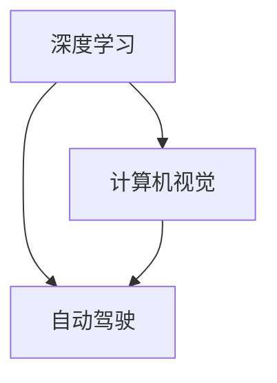

                 

# Andrej Karpathy：人工智能的未来发展挑战

## 1. 背景介绍

Andrej Karpathy，作为人工智能领域的领军人物，他的研究与见解总是引领着技术前沿。在深度学习与计算机视觉领域，Karpathy教授的工作对推动技术进步产生了深远影响。本文将探讨Andrej Karpathy对人工智能未来发展的展望，以及他关于技术挑战的深刻见解。

### 1.1 背景概述

Andrej Karpathy，斯坦福大学计算机视觉研究所的助理教授，同时是OpenAI的研究员。他的研究领域涉及深度学习、计算机视觉、自动驾驶等。Karpathy教授在深度学习领域发表了大量的学术论文，并因其在图像识别、视频分析、自动驾驶等方面的创新工作受到广泛认可。

## 2. 核心概念与联系

### 2.1 核心概念概述

在探讨人工智能的未来发展时，我们需要首先理解几个关键概念：

- **深度学习**：通过构建深层神经网络结构，从大量数据中自动学习特征的表示方法。深度学习已经广泛应用于图像识别、语音识别、自然语言处理等领域，并取得了显著成果。
- **计算机视觉**：使用计算机技术分析和解释图像、视频等视觉信息，并从中提取有用的信息。Karpathy教授在这一领域的贡献尤为突出。
- **自动驾驶**：利用计算机视觉、深度学习等技术实现车辆的自主导航，是当前人工智能研究的热点之一。

这些概念之间的联系紧密，深度学习和计算机视觉为自动驾驶提供了技术基础，而自动驾驶的实际应用，又进一步推动了计算机视觉和深度学习的发展。

### 2.2 核心概念的关系

通过一个简单的Mermaid流程图，我们可以直观地展示这些核心概念之间的联系：



从图中可以看出，深度学习和计算机视觉是自动驾驶的核心技术，而计算机视觉在自动驾驶中起到了重要的作用。

## 3. 核心算法原理 & 具体操作步骤
### 3.1 算法原理概述

Andrej Karpathy关于人工智能未来发展的讨论，集中在以下几个核心算法原理上：

- **卷积神经网络**（Convolutional Neural Networks, CNNs）：用于图像识别和计算机视觉任务的基础模型。
- **循环神经网络**（Recurrent Neural Networks, RNNs）：处理序列数据（如文本、音频）的理想选择。
- **对抗性训练**（Adversarial Training）：通过生成对抗样本来增强模型的鲁棒性。

这些算法原理构成了Andrej Karpathy对人工智能发展的基础理解。

### 3.2 算法步骤详解

Karpathy教授认为，在未来的人工智能发展中，以下几个步骤将至关重要：

1. **数据预处理**：对数据进行清洗、归一化、增强等操作，确保输入数据的质量。
2. **模型设计**：选择合适的神经网络结构，如CNN、RNN、Transformer等，并设置适当的超参数。
3. **训练过程**：使用梯度下降等优化算法，通过反向传播计算梯度，更新模型参数。
4. **验证与调整**：在验证集上评估模型性能，根据结果调整模型和超参数。
5. **测试与部署**：在测试集上最终评估模型性能，并将模型部署到实际应用中。

### 3.3 算法优缺点

Andrej Karpathy对这些算法原理的优缺点进行了详细分析：

- **优点**：
  - **卷积神经网络**：适用于图像识别等空间局部相关任务，具有参数共享特性，可以减少训练参数量。
  - **循环神经网络**：适用于序列数据，能够处理变长输入，具有记忆功能，适用于文本生成等任务。
  - **对抗性训练**：能够显著提高模型的鲁棒性，防止模型被对抗样本欺骗。

- **缺点**：
  - **卷积神经网络**：难以处理全局依赖关系，对于图像变形、旋转等情况的适应性较差。
  - **循环神经网络**：计算复杂度高，难以并行化，对于长序列数据存在梯度消失问题。
  - **对抗性训练**：生成对抗样本的过程计算复杂，且对抗样本对模型性能的提升有限。

### 3.4 算法应用领域

Andrej Karpathy强调，这些算法原理不仅适用于图像识别、文本生成等传统任务，还能够拓展到自动驾驶、医疗影像分析、游戏智能等多个领域。

- **自动驾驶**：利用卷积神经网络和循环神经网络进行目标检测、路径规划等任务。
- **医疗影像分析**：通过卷积神经网络对医疗影像进行分类、分割等。
- **游戏智能**：使用强化学习、卷积神经网络等技术，使游戏AI能够进行复杂的决策和策略制定。

## 4. 数学模型和公式 & 详细讲解 & 举例说明

Andrej Karpathy在其公开讲座和论文中，详细讲解了深度学习中的数学模型和公式。本文将以卷积神经网络为例，进行详细讲解。

### 4.1 数学模型构建

卷积神经网络（CNN）由卷积层、池化层、全连接层等组成。CNN的基本数学模型可以表示为：

$$
\mathbf{X} \in \mathbb{R}^{h \times w \times c}, \quad \mathbf{W} \in \mathbb{R}^{f \times f \times c \times o}, \quad \mathbf{b} \in \mathbb{R}^o
$$

其中，$\mathbf{X}$ 表示输入图像，$h$ 和 $w$ 分别表示图像的高和宽，$c$ 表示通道数（如RGB图像的3）。$\mathbf{W}$ 表示卷积核，$f$ 和 $o$ 分别表示卷积核的大小和输出通道数。$\mathbf{b}$ 表示偏置项。

### 4.2 公式推导过程

卷积神经网络的核心操作是卷积运算。假设输入图像为 $\mathbf{X}$，卷积核为 $\mathbf{W}$，则卷积运算的输出可以表示为：

$$
\mathbf{Z} = \sigma(\mathbf{X} * \mathbf{W} + \mathbf{b})
$$

其中，$*$ 表示卷积运算，$\sigma$ 表示激活函数（如ReLU）。

### 4.3 案例分析与讲解

在实际应用中，卷积神经网络常用于图像分类任务。例如，在MNIST手写数字识别任务中，可以使用卷积神经网络对28x28的灰度图像进行分类。

假设输入图像为 $\mathbf{X} \in \mathbb{R}^{28 \times 28 \times 1}$，卷积核为 $\mathbf{W} \in \mathbb{R}^{5 \times 5 \times 1 \times 32}$，则卷积运算的结果 $\mathbf{Z} \in \mathbb{R}^{24 \times 24 \times 32}$。

## 5. 项目实践：代码实例和详细解释说明

### 5.1 开发环境搭建

为了实现上述案例，我们需要搭建一个深度学习开发环境。以下是一个简单的Python环境搭建步骤：

1. **安装Python**：安装Python 3.7及以上版本，推荐使用Anaconda。
2. **安装深度学习框架**：
   - 安装TensorFlow：`pip install tensorflow`
   - 安装Keras：`pip install keras`
3. **安装其他依赖**：
   - 安装NumPy、Pandas、Matplotlib等常用库。

### 5.2 源代码详细实现

以下是使用Keras实现卷积神经网络的代码：

```python
from keras.models import Sequential
from keras.layers import Conv2D, MaxPooling2D, Flatten, Dense

# 构建卷积神经网络
model = Sequential()
model.add(Conv2D(32, (3, 3), activation='relu', input_shape=(28, 28, 1)))
model.add(MaxPooling2D((2, 2)))
model.add(Conv2D(64, (3, 3), activation='relu'))
model.add(MaxPooling2D((2, 2)))
model.add(Flatten())
model.add(Dense(64, activation='relu'))
model.add(Dense(10, activation='softmax'))

# 编译模型
model.compile(optimizer='adam', loss='categorical_crossentropy', metrics=['accuracy'])

# 训练模型
model.fit(X_train, y_train, epochs=10, batch_size=64)
```

### 5.3 代码解读与分析

上述代码中，我们使用Keras构建了一个包含两个卷积层和两个池化层的卷积神经网络。其中，Conv2D层用于卷积运算，MaxPooling2D层用于池化操作，Dense层用于全连接层。最后，我们通过编译和训练，完成了卷积神经网络的学习过程。

### 5.4 运行结果展示

在完成训练后，我们可以使用测试集对模型进行评估：

```python
test_loss, test_acc = model.evaluate(X_test, y_test)
print('Test accuracy:', test_acc)
```

输出结果将显示测试集的准确率。

## 6. 实际应用场景

Andrej Karpathy强调，卷积神经网络在实际应用中具有广泛的应用场景，例如：

- **自动驾驶**：用于目标检测、车道线识别、行人检测等任务。
- **医疗影像分析**：用于肿瘤检测、X光片分析等。
- **工业检测**：用于缺陷检测、图像分类等。

未来，随着计算机视觉和深度学习技术的进一步发展，卷积神经网络将会在更多领域得到应用，为人类带来更多的便利。

## 7. 工具和资源推荐

Andrej Karpathy在讲座中推荐了以下学习资源和开发工具：

### 7.1 学习资源推荐

1. **深度学习入门**：推荐使用《深度学习入门：基于Python的理论与实现》一书，详细介绍了深度学习的基本概念和算法。
2. **计算机视觉**：推荐使用《计算机视觉：算法与应用》一书，全面介绍了计算机视觉的技术和应用。
3. **自动驾驶**：推荐使用《自动驾驶技术》一书，介绍了自动驾驶的基本原理和实际应用。

### 7.2 开发工具推荐

1. **Python**：作为深度学习和计算机视觉开发的主要语言，Python的灵活性和易用性使其成为首选。
2. **TensorFlow**：谷歌开源的深度学习框架，支持GPU和TPU加速，适合大规模模型训练。
3. **Keras**：基于TensorFlow的高级API，易于上手和使用。

### 7.3 相关论文推荐

Andrej Karpathy推荐了以下几篇重要论文：

1. **ImageNet Large Scale Visual Recognition Challenge**：AlexNet、VGG等经典模型的论文，奠定了深度学习在图像识别领域的基础。
2. **DeepMind's AlphaGo**：AlphaGo在围棋中的胜利，展示了深度学习在决策制定中的潜力。
3. **AutoDriving with Deep Reinforcement Learning**：介绍自动驾驶技术的最新进展，特别是强化学习在其中的应用。

## 8. 总结：未来发展趋势与挑战

### 8.1 研究成果总结

Andrej Karpathy的研究成果涵盖了深度学习、计算机视觉和自动驾驶等多个领域。他的工作不仅推动了学术界的进步，也为实际应用提供了重要参考。

### 8.2 未来发展趋势

1. **深度学习与计算机视觉的融合**：未来，深度学习和计算机视觉技术将更加紧密地结合，推动人工智能技术在更多领域的应用。
2. **自动驾驶技术的成熟**：自动驾驶技术将逐步实现商业化应用，带来更加便捷、安全的交通出行方式。
3. **计算机视觉的多模态融合**：通过引入视觉、听觉、触觉等多模态信息，计算机视觉系统将具备更强的感知和理解能力。

### 8.3 面临的挑战

1. **数据隐私与安全**：在自动驾驶和医疗影像分析等应用中，数据隐私和安全问题尤为突出。
2. **计算资源的限制**：深度学习模型的计算复杂度高，需要强大的计算资源支持。
3. **模型的可解释性**：深度学习模型通常被视为"黑盒"，缺乏可解释性，这对一些高风险应用领域带来了挑战。

### 8.4 研究展望

Andrej Karpathy认为，未来的人工智能研究需要解决以上挑战，同时进一步推动深度学习、计算机视觉等技术的发展。此外，还需要探索新的算法和模型，提升人工智能系统的性能和可解释性。

## 9. 附录：常见问题与解答

**Q1: 如何提升卷积神经网络的准确率？**

A: 可以通过以下几个步骤提升卷积神经网络的准确率：
1. **增加网络深度**：增加卷积层和池化层的数量，提高模型的表征能力。
2. **使用更复杂的激活函数**：如LeakyReLU、ELU等，提升模型的非线性能力。
3. **数据增强**：对训练数据进行增强，如旋转、缩放、随机裁剪等，提升模型对变形情况的适应性。
4. **优化超参数**：通过网格搜索、随机搜索等方法，找到最优的超参数组合。

**Q2: 卷积神经网络在实际应用中有哪些优势？**

A: 卷积神经网络在实际应用中有以下优势：
1. **参数共享**：减少训练参数量，提升模型的泛化能力。
2. **局部感受野**：能够处理局部依赖关系，适用于图像识别等任务。
3. **可并行化**：卷积运算和池化运算可以并行计算，提升训练速度。

**Q3: 如何处理卷积神经网络中的梯度消失问题？**

A: 可以通过以下几个方法处理卷积神经网络中的梯度消失问题：
1. **使用激活函数**：如ReLU、LeakyReLU等，提升激活函数的非线性能力。
2. **批归一化**：对每一层输入进行归一化，提升梯度传播。
3. **残差连接**：在网络中添加残差连接，提升梯度传播。

**Q4: 如何处理卷积神经网络中的过拟合问题？**

A: 可以通过以下几个方法处理卷积神经网络中的过拟合问题：
1. **数据增强**：对训练数据进行增强，如旋转、缩放、随机裁剪等，提升模型对变形情况的适应性。
2. **正则化**：使用L2正则化、Dropout等方法，防止模型过拟合。
3. **模型集成**：通过集成多个模型，提升模型的鲁棒性。

---

作者：禅与计算机程序设计艺术 / Zen and the Art of Computer Programming

