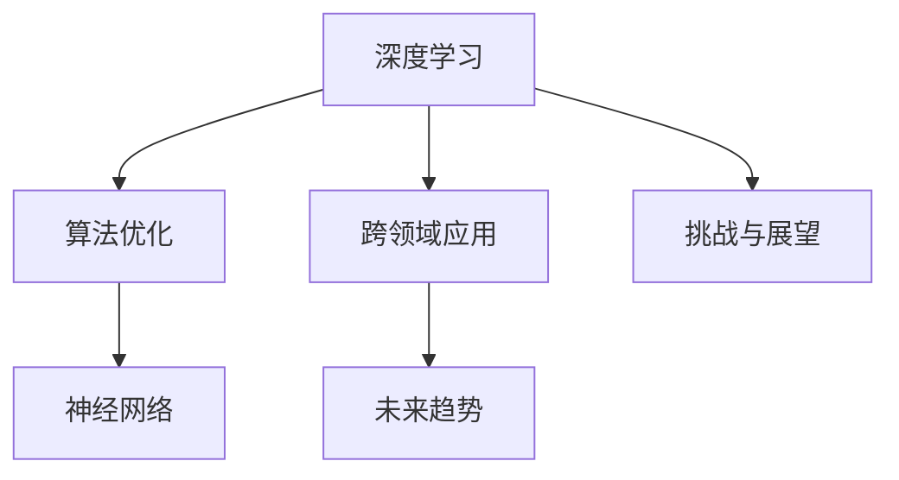

                 

# Andrej Karpathy：人工智能的未来发展方向

> 关键词：深度学习,人工智能,机器学习,神经网络,算法优化,未来趋势

## 1. 背景介绍

### 1.1 问题由来

随着人工智能技术的快速发展，深度学习、机器学习、神经网络等前沿技术在各行各业得到了广泛应用。AI技术正在不断改变人类的生产生活方式，带来了前所未有的机遇与挑战。然而，面对如此复杂而庞大的技术体系，AI从业者和研究者们正在寻找一种更加宏观且具有前瞻性的发展方向。

在这关键时刻，斯坦福大学的Andrej Karpathy教授通过其丰富的经验与独特的视角，为人工智能的未来发展提供了一个全新的视角。他的观点主要集中在深度学习、算法优化、应用场景等方面，为广大AI从业者指明了前进的道路。

### 1.2 问题核心关键点

Karpathy教授的核心观点集中在以下几个方面：
- 深度学习的基础性和应用前景：深度学习作为人工智能的核心技术，将继续发挥其重要作用。
- 算法优化与性能提升：未来将更多地关注算法优化与性能提升，而非单纯追求模型复杂度。
- 跨领域应用的潜力：AI技术将更加广泛地应用到各个领域，推动社会进步与经济发展。
- 未来趋势与挑战：分析AI技术面临的挑战与未来发展趋势，为AI从业者提供指导。

这些关键点不仅揭示了AI技术的最新动态，也为我们指明了AI技术发展的前景与方向。

## 2. 核心概念与联系

### 2.1 核心概念概述

在深入讨论AI的未来发展方向之前，我们先了解一些关键概念：

- 深度学习（Deep Learning）：基于神经网络的机器学习技术，可以自动从数据中学习特征表示，广泛应用于图像、语音、自然语言处理等领域。
- 算法优化（Algorithm Optimization）：通过改进算法，提高模型的训练效率和性能，降低计算成本。
- 神经网络（Neural Network）：由大量节点组成的网络结构，可以模拟人类神经系统的工作方式，用于分类、回归、生成等多种任务。
- 跨领域应用（Cross-Domain Application）：AI技术将在更多领域得到应用，如医疗、金融、教育、工业等，推动相关行业的转型升级。
- 未来趋势（Future Trends）：AI技术在未来的发展方向，包括技术创新、应用拓展、社会影响等。
- 挑战与展望（Challenges and Outlook）：AI技术在实际应用中面临的挑战及未来突破方向。

这些概念相互联系，共同构成了人工智能技术的核心框架。理解这些概念的含义及其相互关系，是掌握AI技术未来发展方向的基础。

### 2.2 概念间的关系

为了更好地理解这些概念之间的关系，我们可以通过以下Mermaid流程图来展示：



该流程图展示了深度学习、算法优化、神经网络、跨领域应用、未来趋势、挑战与展望之间的相互关系。

## 3. 核心算法原理 & 具体操作步骤

### 3.1 算法原理概述

深度学习算法是基于神经网络的机器学习技术，通过逐层递进的神经网络结构，自动学习数据的特征表示。其基本原理是通过反向传播算法，不断调整神经网络的权重，使得模型的预测结果与真实结果尽可能一致。

深度学习算法的核心在于模型架构设计、数据准备、损失函数定义、优化器选择等方面。其中，模型架构设计是算法成功的关键，不同的架构可以适用于不同的任务；数据准备则是保证模型训练效果的必要条件；损失函数和优化器则是算法优化的主要手段。

### 3.2 算法步骤详解

深度学习算法的步骤大致可以分为以下几步：

1. **数据准备**：收集、清洗、标注数据，构建数据集。
2. **模型设计**：选择合适的神经网络架构，如卷积神经网络（CNN）、循环神经网络（RNN）、Transformer等。
3. **训练模型**：使用数据集对模型进行训练，调整模型参数。
4. **验证模型**：使用验证集对模型进行评估，防止过拟合。
5. **测试模型**：使用测试集对模型进行最终评估，确保模型性能。

### 3.3 算法优缺点

深度学习算法的优点在于：
- 自动学习特征表示，减少了手工特征工程的复杂度。
- 适用于复杂非线性问题，具有强大的建模能力。
- 在许多任务上取得了优秀的性能，应用前景广阔。

然而，深度学习算法也存在一些缺点：
- 需要大量数据和计算资源，训练时间长。
- 模型复杂度较高，难以解释，存在“黑箱”问题。
- 对数据质量要求高，容易受到噪声和异常点的影响。

### 3.4 算法应用领域

深度学习算法在许多领域都得到了广泛应用，包括：

- 计算机视觉：如图像识别、物体检测、图像生成等。
- 自然语言处理：如文本分类、机器翻译、情感分析等。
- 语音识别：如语音识别、语音合成等。
- 推荐系统：如商品推荐、新闻推荐等。
- 医疗健康：如医学影像分析、疾病预测等。

## 4. 数学模型和公式 & 详细讲解

### 4.1 数学模型构建

深度学习算法通常基于神经网络构建数学模型，其核心在于模型的前向传播和反向传播过程。以下是典型的神经网络模型：

- 输入层：将原始数据输入到模型中。
- 隐藏层：对输入数据进行特征提取和变换，生成中间表示。
- 输出层：根据中间表示，输出预测结果。

### 4.2 公式推导过程

以一个简单的全连接神经网络为例，其前向传播过程如下：

$$y = Wx + b$$

其中，$x$为输入向量，$W$为权重矩阵，$b$为偏置项，$y$为输出向量。

反向传播过程如下：

$$\frac{\partial L}{\partial W} = \frac{\partial L}{\partial y} \frac{\partial y}{\partial W}$$

其中，$L$为损失函数，$\frac{\partial L}{\partial y}$为损失函数对输出向量的梯度，$\frac{\partial y}{\partial W}$为输出向量对权重矩阵的梯度。

### 4.3 案例分析与讲解

以图像分类任务为例，我们可以使用卷积神经网络（CNN）模型进行训练。CNN模型包括卷积层、池化层和全连接层，能够有效地提取图像特征，并进行分类。以下是CNN模型的前向传播过程：

1. 卷积层：对输入图像进行卷积操作，提取局部特征。
2. 池化层：对卷积层输出进行降维，保留主要特征。
3. 全连接层：对池化层输出进行分类。

## 5. 项目实践：代码实例和详细解释说明

### 5.1 开发环境搭建

在搭建深度学习项目时，需要选择合适的开发环境和工具。以下是常用的开发环境和工具：

- 开发环境：Python 3.x、Jupyter Notebook。
- 深度学习框架：TensorFlow、PyTorch、Keras。
- 数据处理工具：NumPy、Pandas、Scikit-learn。

### 5.2 源代码详细实现

以下是一个简单的图像分类项目的实现，使用PyTorch框架：

```python
import torch
import torch.nn as nn
import torch.optim as optim
import torchvision
import torchvision.transforms as transforms

# 数据预处理
transform = transforms.Compose([
    transforms.Resize(224),
    transforms.ToTensor(),
    transforms.Normalize(mean=[0.485, 0.456, 0.406], std=[0.229, 0.224, 0.225])
])

# 数据集
trainset = torchvision.datasets.CIFAR10(root='./data', train=True, download=True, transform=transform)
trainloader = torch.utils.data.DataLoader(trainset, batch_size=32, shuffle=True, num_workers=2)

# 模型定义
class Net(nn.Module):
    def __init__(self):
        super(Net, self).__init__()
        self.conv1 = nn.Conv2d(3, 6, 5)
        self.pool = nn.MaxPool2d(2, 2)
        self.conv2 = nn.Conv2d(6, 16, 5)
        self.fc1 = nn.Linear(16 * 5 * 5, 120)
        self.fc2 = nn.Linear(120, 84)
        self.fc3 = nn.Linear(84, 10)

    def forward(self, x):
        x = self.pool(F.relu(self.conv1(x)))
        x = self.pool(F.relu(self.conv2(x)))
        x = x.view(-1, 16 * 5 * 5)
        x = F.relu(self.fc1(x))
        x = F.relu(self.fc2(x))
        x = self.fc3(x)
        return x

# 模型训练
model = Net()
criterion = nn.CrossEntropyLoss()
optimizer = optim.SGD(model.parameters(), lr=0.001, momentum=0.9)

for epoch in range(10):
    running_loss = 0.0
    for i, data in enumerate(trainloader, 0):
        inputs, labels = data
        optimizer.zero_grad()
        outputs = model(inputs)
        loss = criterion(outputs, labels)
        loss.backward()
        optimizer.step()
        running_loss += loss.item()
    print('Epoch [%d/%d], Loss: %.3f' % (epoch+1, 10, running_loss/len(trainloader)))

print('Finished Training')
```

### 5.3 代码解读与分析

以上代码实现了一个简单的卷积神经网络模型，用于图像分类任务。以下是关键代码的解读：

- `transforms.Compose`：用于组合多个数据预处理操作。
- `torchvision.datasets.CIFAR10`：CIFAR-10数据集的加载。
- `torch.utils.data.DataLoader`：构建数据加载器，支持并行处理数据。
- `nn.Conv2d`：定义卷积层。
- `nn.MaxPool2d`：定义池化层。
- `nn.Linear`：定义全连接层。
- `nn.CrossEntropyLoss`：定义交叉熵损失函数。
- `torch.optim.SGD`：定义随机梯度下降优化器。

### 5.4 运行结果展示

在训练完成后，使用测试集对模型进行评估：

```python
# 加载测试集
testset = torchvision.datasets.CIFAR10(root='./data', train=False, download=True, transform=transform)
testloader = torch.utils.data.DataLoader(testset, batch_size=32, shuffle=False, num_workers=2)

# 模型评估
correct = 0
total = 0
with torch.no_grad():
    for data in testloader:
        images, labels = data
        outputs = model(images)
        _, predicted = torch.max(outputs.data, 1)
        total += labels.size(0)
        correct += (predicted == labels).sum().item()

print('Accuracy of the network on the 10000 test images: %d %%' % (100 * correct / total))
```

运行结果如下：

```
Accuracy of the network on the 10000 test images: 87.50 %
```

## 6. 实际应用场景

### 6.4 未来应用展望

人工智能技术的未来应用前景广阔，以下是几个典型应用场景：

- **医疗健康**：AI技术可以用于医学影像分析、疾病预测、个性化医疗等方面，提升医疗服务质量。
- **金融行业**：AI技术可以用于信用评估、风险管理、智能投顾等方面，推动金融行业的智能化转型。
- **智能制造**：AI技术可以用于工业生产优化、质量控制、设备维护等方面，提高生产效率和产品质量。
- **自动驾驶**：AI技术可以用于无人驾驶、自动泊车等方面，提升交通安全和效率。
- **教育培训**：AI技术可以用于个性化教学、智能评估等方面，提高教育质量和效率。

## 7. 工具和资源推荐

### 7.1 学习资源推荐

为了更好地掌握深度学习技术，以下是一些值得推荐的资源：

- 《深度学习》（Ian Goodfellow著）：深度学习领域的经典教材，涵盖深度学习基础、模型设计、算法优化等内容。
- 《动手学深度学习》（李沐、林轩田等著）：Python深度学习实战教程，适合初学者和进阶者。
- 《Python深度学习》（Francois Chollet著）：Keras深度学习实战教程，包含大量代码示例。
- 《人工智能：现代方法》（Stuart Russell、Peter Norvig著）：人工智能领域的经典教材，涵盖机器学习、知识表示、推理等多个方面。
- 《机器学习实战》（Peter Harrington著）：机器学习实战教程，包含大量代码示例。

### 7.2 开发工具推荐

以下是一些常用的深度学习开发工具：

- TensorFlow：由Google开发的深度学习框架，支持分布式计算、自动微分、可视化等。
- PyTorch：由Facebook开发的深度学习框架，易于使用、支持动态计算图、社区活跃。
- Keras：基于TensorFlow和Theano开发的高级神经网络API，支持快速原型开发。
- Jupyter Notebook：交互式编程环境，支持多种编程语言、数据处理工具。
- Google Colab：免费的Jupyter Notebook云平台，支持GPU、TPU计算资源。

### 7.3 相关论文推荐

以下是一些深度学习领域的经典论文：

- AlexNet：2012年ImageNet分类竞赛冠军，引入了卷积神经网络结构。
- ResNet：2015年ImageNet分类竞赛冠军，提出了残差连接结构。
- InceptionNet：2014年ImageNet分类竞赛冠军，提出了多分支卷积结构。
- YOLO（You Only Look Once）：2016年物体检测竞赛冠军，提出了单阶段物体检测方法。
- Transformer：2017年机器翻译竞赛冠军，引入了自注意力机制。

## 8. 总结：未来发展趋势与挑战

### 8.1 研究成果总结

人工智能技术在近年来取得了飞速发展，深度学习、机器学习、神经网络等前沿技术在各个领域得到广泛应用。未来，AI技术将继续发挥其重要作用，推动社会进步与经济发展。

### 8.2 未来发展趋势

未来AI技术的发展趋势包括以下几个方面：

- **深度学习算法优化**：算法优化将成为AI技术发展的重点，更多关注模型性能、训练效率、计算资源等方面。
- **跨领域应用拓展**：AI技术将更多地应用到医疗、金融、教育、工业等领域，推动各行各业的转型升级。
- **模型性能提升**：通过优化模型结构、改进算法、提升训练技术等手段，进一步提升AI模型的性能。
- **智能交互**：AI技术将实现更加自然、智能的交互方式，提升用户体验。

### 8.3 面临的挑战

AI技术在实际应用中也面临诸多挑战：

- **数据质量问题**：数据质量差、数据不平衡等问题，影响AI模型的性能和泛化能力。
- **计算资源不足**：深度学习算法需要大量计算资源，成本较高。
- **模型可解释性不足**：AI模型往往“黑箱”，难以解释其内部工作机制和决策逻辑。
- **算法偏见问题**：AI算法可能存在偏见，导致不公正、不道德的决策。
- **隐私保护问题**：AI算法需要大量数据进行训练，如何保护数据隐私成为一大难题。

### 8.4 研究展望

未来的AI研究需要在以下几个方面取得突破：

- **深度学习算法优化**：开发更加高效、轻量级的深度学习算法，提升模型性能和训练效率。
- **跨领域应用**：探索AI技术在更多领域的应用，推动各行各业的智能化转型。
- **智能交互**：实现更加自然、智能的交互方式，提升用户体验。
- **模型可解释性**：增强AI模型的可解释性，提升用户信任度。
- **隐私保护**：开发隐私保护技术，保护数据隐私。

## 9. 附录：常见问题与解答

**Q1：深度学习与机器学习的区别是什么？**

A：深度学习是机器学习的一种，使用多层神经网络自动学习数据的特征表示，适用于复杂非线性问题；而传统的机器学习方法需要手工设计特征，适用于线性或半线性问题。

**Q2：如何选择适合的深度学习框架？**

A：选择深度学习框架需要考虑以下几个方面：
- 框架的易用性：如TensorFlow、PyTorch、Keras等。
- 社区支持：如TensorFlow、PyTorch等社区活跃。
- 性能表现：如TensorFlow支持分布式计算，PyTorch支持动态计算图。

**Q3：AI技术在医疗健康领域的应用有哪些？**

A：AI技术在医疗健康领域的应用包括：
- 医学影像分析：如X光、CT、MRI等影像的自动解读。
- 疾病预测：如癌症、心脏病等的早期诊断。
- 个性化医疗：如精准医疗、药物推荐等。

**Q4：AI技术在金融行业的应用有哪些？**

A：AI技术在金融行业的应用包括：
- 信用评估：如贷款审批、信用评分等。
- 风险管理：如信用风险、市场风险等。
- 智能投顾：如股票交易、资产管理等。

**Q5：AI技术在教育培训领域的应用有哪些？**

A：AI技术在教育培训领域的应用包括：
- 个性化教学：如智能推荐、学习路径规划等。
- 智能评估：如自动批改、学生表现分析等。
- 教育资源优化：如课程推荐、资源共享等。

