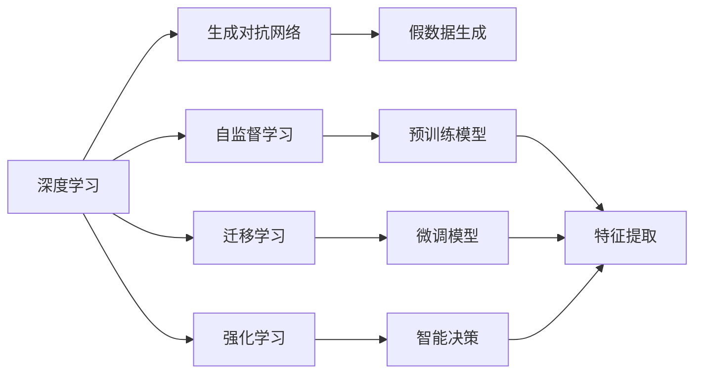
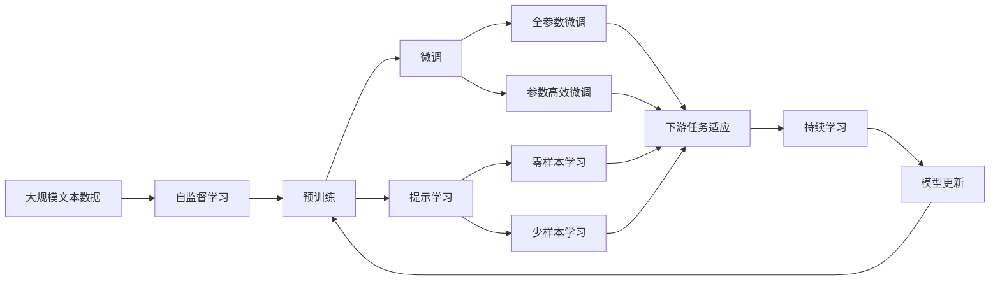

                 

## 1. 背景介绍

### 1.1 问题由来
Andrej Karpathy，作为深度学习领域的领军人物，一直以来都在探索和推动人工智能技术的边界。他的研究和实践不仅在学术界具有深远影响，而且也在工业界得到了广泛应用。在当前人工智能迅速发展、技术迭代加速的背景下，Karpathy对未来AI的发展趋势、应用场景和挑战进行了深入思考，并提出了许多独到的见解。

### 1.2 问题核心关键点
本文将围绕以下几个核心问题进行探讨：
1. 人工智能未来的技术发展方向是什么？
2. AI在各个领域的具体应用场景有哪些？
3. 实现这些应用场景面临哪些技术挑战？
4. 如何克服这些挑战，推动AI技术的落地与普及？

### 1.3 问题研究意义
深入理解Andrej Karpathy对AI未来的发展机遇，对于推动AI技术的研发和应用具有重要意义：

1. **技术指导**：Karpathy的研究成果可以为研究人员提供方向指引，避免走弯路。
2. **产业应用**：他的见解可以帮助企业了解AI技术的应用前景，促进技术转化。
3. **教育培训**：他的思考和实践可以为高校和培训机构的教学内容提供素材，提升AI教育水平。
4. **公众理解**：通过解读Karpathy的见解，可以更好地普及AI知识，提高公众对AI技术的认知。

## 2. 核心概念与联系

### 2.1 核心概念概述
为了更好地理解Andrej Karpathy对AI未来发展的思考，我们首先介绍几个关键概念：

- **深度学习(Deep Learning)**：一种基于神经网络的机器学习方法，能够处理非线性和高维度数据，广泛应用于图像识别、语音识别、自然语言处理等领域。
- **生成对抗网络(GANs)**：一种生成模型，通过两个神经网络（生成器和判别器）之间的对抗训练，生成高质量的假数据。
- **自监督学习(Self-Supervised Learning)**：无需标注数据，利用数据的自身结构进行学习的方法，广泛应用于预训练模型中。
- **迁移学习(Transfer Learning)**：在已有模型基础上，通过微调学习新任务的模型，能够显著提升模型在新任务上的表现。
- **强化学习(Reinforcement Learning)**：通过智能体与环境的交互，优化策略以最大化奖励的一种学习方式，广泛应用于游戏AI、机器人控制等领域。

这些概念构成了Andrej Karpathy对AI未来发展的核心思考框架。

### 2.2 概念间的关系

我们可以通过以下Mermaid流程图来展示这些核心概念之间的联系：



这个流程图展示了深度学习如何与其他关键技术相互关联，共同推动AI的发展：

1. 深度学习提供基础算法，生成对抗网络生成高质量数据，自监督学习进行模型预训练，迁移学习进行模型微调，强化学习实现智能决策。
2. 这些技术相互融合，形成了AI的完整生态系统，推动了AI在各个领域的应用。

### 2.3 核心概念的整体架构

最后，我们用一个综合的流程图来展示这些核心概念在大模型微调过程中的整体架构：



这个综合流程图展示了从预训练到微调，再到持续学习的完整过程。通过这些关键技术，深度学习模型能够在各种场景下发挥强大的语言理解和生成能力。

## 3. 核心算法原理 & 具体操作步骤
### 3.1 算法原理概述
Andrej Karpathy对深度学习的核心算法原理进行了深入的阐述，以下是一些关键点：

- **神经网络**：深度学习的核心是神经网络，通过多层非线性变换，能够处理复杂的输入数据。
- **反向传播**：通过链式法则，计算损失函数对每个参数的梯度，更新模型参数以最小化损失。
- **卷积神经网络(CNNs)**：通过卷积层和池化层，有效处理图像数据，在计算机视觉领域广泛应用。
- **循环神经网络(RNNs)**：通过循环结构，能够处理序列数据，在自然语言处理领域应用广泛。
- **Transformer**：一种基于自注意力机制的神经网络架构，能够并行处理长序列数据，在NLP领域表现优异。

### 3.2 算法步骤详解
以下是深度学习模型的基本训练流程：

1. **数据准备**：收集和预处理数据集，划分为训练集、验证集和测试集。
2. **模型搭建**：选择合适的神经网络架构，设置超参数。
3. **模型训练**：前向传播计算预测结果，反向传播计算梯度，更新模型参数。
4. **模型评估**：在验证集和测试集上评估模型性能，调整超参数。
5. **模型部署**：将模型保存并部署到实际应用中。

以Transformer模型为例，其训练流程如下：

1. **模型搭建**：使用Transformer模型作为基础架构，添加编码器-解码器结构，设置嵌入层、多头自注意力机制、位置编码等组件。
2. **模型训练**：将输入序列编码，通过多层自注意力机制计算表示，进行解码和输出预测。
3. **模型评估**：在目标数据集上进行预测，计算损失函数并更新参数。
4. **模型部署**：保存模型权重，部署到实际应用中，进行推理预测。

### 3.3 算法优缺点
深度学习模型的优点：

- **自适应性强**：能够处理非线性、高维度数据，具有强大的表达能力。
- **泛化能力**：通过大量数据训练，能够学习到一般性的规律，适用于多种任务。
- **高性能**：在许多任务上表现优异，特别是在图像识别、语音识别、自然语言处理等领域。

深度学习模型的缺点：

- **计算资源需求高**：需要大量的计算资源进行模型训练和推理。
- **数据依赖性强**：需要大量的标注数据进行训练，对数据质量和多样性要求高。
- **可解释性差**：深度学习模型通常被视为“黑盒”，难以解释其内部工作机制。

### 3.4 算法应用领域
深度学习模型在以下几个领域有广泛的应用：

- **计算机视觉**：图像识别、物体检测、图像分割、视频分析等。
- **自然语言处理**：机器翻译、情感分析、问答系统、文本生成等。
- **语音识别**：语音识别、语音合成、情感识别等。
- **机器人控制**：自主导航、任务规划、智能决策等。
- **医疗诊断**：医学影像分析、病理分析、基因组学等。

## 4. 数学模型和公式 & 详细讲解 & 举例说明
### 4.1 数学模型构建

假设深度学习模型为 $M_{\theta}$，其中 $\theta$ 为模型参数。给定训练数据集 $D=\{(x_i,y_i)\}_{i=1}^N$，其中 $x_i$ 为输入，$y_i$ 为标签。模型的损失函数为 $\mathcal{L}(\theta)$，用于衡量模型预测结果与真实标签之间的差异。

### 4.2 公式推导过程

以分类任务为例，损失函数 $\mathcal{L}(\theta)$ 可以表示为：

$$
\mathcal{L}(\theta) = -\frac{1}{N}\sum_{i=1}^N \sum_{j=1}^C y_{i,j}\log p_{i,j}(\theta)
$$

其中 $C$ 为类别数，$y_{i,j}$ 为样本 $x_i$ 属于类别 $j$ 的标签，$p_{i,j}(\theta)$ 为模型在输入 $x_i$ 下属于类别 $j$ 的概率。

通过反向传播算法，计算损失函数对参数 $\theta$ 的梯度，使用优化算法（如SGD、Adam等）进行参数更新。

### 4.3 案例分析与讲解
以自然语言处理(NLP)为例，Transformer模型的损失函数可以表示为：

$$
\mathcal{L}(\theta) = -\frac{1}{N}\sum_{i=1}^N \sum_{j=1}^M y_{i,j}\log p_{i,j}(\theta)
$$

其中 $M$ 为词汇表大小，$y_{i,j}$ 为输入序列 $x_i$ 中第 $j$ 个词汇的标签，$p_{i,j}(\theta)$ 为模型在输入 $x_i$ 下预测第 $j$ 个词汇的概率。

Transformer模型使用多头自注意力机制和残差连接，能够并行计算长序列数据。其基本结构如图：

```
Encoder-Decoder Structure
                              
[Input Embedding] ------------> [Self-Attention Layers] --> [Feedforward Networks] --> [Output Embedding]
                           |
                           v
[Softmax Layer] --> [Decoding] --> [Output] 

```

在编码器中，使用多个自注意力层和前馈神经网络进行特征提取。在解码器中，使用注意力机制和预测网络进行序列生成。

## 5. 项目实践：代码实例和详细解释说明
### 5.1 开发环境搭建

为了进行深度学习模型的训练和部署，我们需要搭建开发环境。以下是使用Python进行PyTorch开发的步骤：

1. 安装Anaconda：从官网下载并安装Anaconda，用于创建独立的Python环境。
2. 创建并激活虚拟环境：
```bash
conda create -n pytorch-env python=3.8 
conda activate pytorch-env
```

3. 安装PyTorch：根据CUDA版本，从官网获取对应的安装命令。例如：
```bash
conda install pytorch torchvision torchaudio cudatoolkit=11.1 -c pytorch -c conda-forge
```

4. 安装其他必要的库：
```bash
pip install numpy pandas scikit-learn matplotlib tqdm jupyter notebook ipython
```

完成上述步骤后，即可在`pytorch-env`环境中进行模型训练和部署。

### 5.2 源代码详细实现

以下是一个基于PyTorch的图像分类模型训练示例代码：

```python
import torch
import torch.nn as nn
import torch.optim as optim
from torchvision import datasets, transforms

# 定义模型结构
class Net(nn.Module):
    def __init__(self):
        super(Net, self).__init__()
        self.conv1 = nn.Conv2d(1, 10, kernel_size=5)
        self.conv2 = nn.Conv2d(10, 20, kernel_size=5)
        self.fc1 = nn.Linear(320, 50)
        self.fc2 = nn.Linear(50, 10)

    def forward(self, x):
        x = F.relu(F.max_pool2d(self.conv1(x), 2))
        x = F.relu(F.max_pool2d(self.conv2(x), 2))
        x = x.view(-1, 320)
        x = F.relu(self.fc1(x))
        x = self.fc2(x)
        return F.log_softmax(x, dim=1)

# 定义数据加载器
transform = transforms.Compose([transforms.ToTensor(), transforms.Normalize((0.5,), (0.5,))])
train_dataset = datasets.MNIST(root='./data', train=True, download=True, transform=transform)
train_loader = torch.utils.data.DataLoader(train_dataset, batch_size=64, shuffle=True)

# 定义模型和优化器
model = Net()
optimizer = optim.SGD(model.parameters(), lr=0.01, momentum=0.5)
criterion = nn.NLLLoss()

# 定义训练函数
def train(epoch):
    model.train()
    for batch_idx, (data, target) in enumerate(train_loader):
        optimizer.zero_grad()
        output = model(data)
        loss = criterion(output, target)
        loss.backward()
        optimizer.step()
        if (batch_idx+1) % 100 == 0:
            print('Train Epoch: {} [{}/{} ({:.0f}%)]\tLoss: {:.6f}'.format(
                epoch, batch_idx * len(data), len(train_loader.dataset),
                100. * batch_idx / len(train_loader), loss.item()))

# 训练模型
for epoch in range(1, 11):
    train(epoch)
```

### 5.3 代码解读与分析

以上代码展示了如何搭建、训练和评估一个简单的图像分类模型。其中：

- `Net`类定义了模型结构，包括卷积层、池化层、全连接层等组件。
- `train`函数定义了模型训练的具体步骤，包括前向传播、计算损失、反向传播、参数更新等。
- `transform`变量定义了数据预处理步骤，将图像转化为Tensor格式并进行归一化。
- `train_dataset`和`train_loader`定义了训练数据集和加载器，用于批量读取和处理数据。

### 5.4 运行结果展示

在训练过程中，我们可以使用`train_loader`对数据进行迭代，通过`model.train()`和`model.eval()`切换训练和评估模式。例如：

```python
import torch.nn as nn
import torch.optim as optim
from torchvision import datasets, transforms

# 定义模型结构
class Net(nn.Module):
    def __init__(self):
        super(Net, self).__init__()
        self.conv1 = nn.Conv2d(1, 10, kernel_size=5)
        self.conv2 = nn.Conv2d(10, 20, kernel_size=5)
        self.fc1 = nn.Linear(320, 50)
        self.fc2 = nn.Linear(50, 10)

    def forward(self, x):
        x = F.relu(F.max_pool2d(self.conv1(x), 2))
        x = F.relu(F.max_pool2d(self.conv2(x), 2))
        x = x.view(-1, 320)
        x = F.relu(self.fc1(x))
        x = self.fc2(x)
        return F.log_softmax(x, dim=1)

# 定义数据加载器
transform = transforms.Compose([transforms.ToTensor(), transforms.Normalize((0.5,), (0.5,))])
train_dataset = datasets.MNIST(root='./data', train=True, download=True, transform=transform)
train_loader = torch.utils.data.DataLoader(train_dataset, batch_size=64, shuffle=True)

# 定义模型和优化器
model = Net()
optimizer = optim.SGD(model.parameters(), lr=0.01, momentum=0.5)
criterion = nn.NLLLoss()

# 定义训练函数
def train(epoch):
    model.train()
    for batch_idx, (data, target) in enumerate(train_loader):
        optimizer.zero_grad()
        output = model(data)
        loss = criterion(output, target)
        loss.backward()
        optimizer.step()
        if (batch_idx+1) % 100 == 0:
            print('Train Epoch: {} [{}/{} ({:.0f}%)]\tLoss: {:.6f}'.format(
                epoch, batch_idx * len(data), len(train_loader.dataset),
                100. * batch_idx / len(train_loader), loss.item()))

# 训练模型
for epoch in range(1, 11):
    train(epoch)
```

训练完成后，我们可以使用测试集对模型进行评估：

```python
# 定义测试集数据加载器
test_dataset = datasets.MNIST(root='./data', train=False, download=True, transform=transform)
test_loader = torch.utils.data.DataLoader(test_dataset, batch_size=64, shuffle=False)

# 定义测试函数
def test():
    model.eval()
    test_loss = 0
    correct = 0
    with torch.no_grad():
        for data, target in test_loader:
            output = model(data)
            test_loss += criterion(output, target).item()
            pred = output.max(1, keepdim=True)[1]
            correct += pred.eq(target.view_as(pred)).sum().item()
    test_loss /= len(test_loader.dataset)
    print('Test set: Average loss: {:.4f}, Accuracy: {}/{} ({:.0f}%)'.format(
        test_loss, correct, len(test_loader.dataset),
        100. * correct / len(test_loader.dataset)))

# 测试模型
test()
```

## 6. 实际应用场景
### 6.1 智能客服系统

智能客服系统是深度学习模型在实际应用中的一个典型例子。传统的客服系统需要大量人力，成本高昂，且无法实现全天候服务。通过深度学习模型，可以实现自动化的客服对话，提升客户体验。

具体而言，可以收集企业内部的历史客服对话记录，将问题和最佳答复构建成监督数据，在此基础上对预训练模型进行微调。微调后的对话模型能够自动理解用户意图，匹配最合适的答案模板进行回复。对于客户提出的新问题，还可以接入检索系统实时搜索相关内容，动态组织生成回答。如此构建的智能客服系统，能大幅提升客户咨询体验和问题解决效率。

### 6.2 金融舆情监测

金融机构需要实时监测市场舆论动向，以便及时应对负面信息传播，规避金融风险。传统的人工监测方式成本高、效率低，难以应对网络时代海量信息爆发的挑战。基于深度学习模型的文本分类和情感分析技术，为金融舆情监测提供了新的解决方案。

具体而言，可以收集金融领域相关的新闻、报道、评论等文本数据，并对其进行主题标注和情感标注。在此基础上对预训练语言模型进行微调，使其能够自动判断文本属于何种主题，情感倾向是正面、中性还是负面。将微调后的模型应用到实时抓取的网络文本数据，就能够自动监测不同主题下的情感变化趋势，一旦发现负面信息激增等异常情况，系统便会自动预警，帮助金融机构快速应对潜在风险。

### 6.3 个性化推荐系统

当前的推荐系统往往只依赖用户的历史行为数据进行物品推荐，无法深入理解用户的真实兴趣偏好。基于深度学习模型的个性化推荐系统可以更好地挖掘用户行为背后的语义信息，从而提供更精准、多样的推荐内容。

在实践中，可以收集用户浏览、点击、评论、分享等行为数据，提取和用户交互的物品标题、描述、标签等文本内容。将文本内容作为模型输入，用户的后续行为（如是否点击、购买等）作为监督信号，在此基础上微调预训练语言模型。微调后的模型能够从文本内容中准确把握用户的兴趣点。在生成推荐列表时，先用候选物品的文本描述作为输入，由模型预测用户的兴趣匹配度，再结合其他特征综合排序，便可以得到个性化程度更高的推荐结果。

### 6.4 未来应用展望

随着深度学习模型的不断发展和应用，未来AI技术将在更多领域得到广泛应用，为人类社会带来深刻变革。以下是几个可能的未来应用方向：

1. **自动驾驶**：通过深度学习模型，实现自动驾驶车辆的自主导航、交通识别、避障等功能，提升交通安全和效率。
2. **医疗诊断**：利用深度学习模型进行医学影像分析、病理诊断、基因组学研究，辅助医生进行精准治疗。
3. **智能家居**：通过深度学习模型，实现智能家电的语音控制、环境感知、用户行为预测等功能，提升生活质量。
4. **教育培训**：利用深度学习模型进行个性化教学、智能评估、学习路径规划等功能，提升教育公平和质量。
5. **环境监测**：通过深度学习模型进行气象预测、污染监测、灾害预警等功能，提升环境保护和治理能力。

## 7. 工具和资源推荐
### 7.1 学习资源推荐

为了帮助开发者系统掌握深度学习模型的理论和实践，这里推荐一些优质的学习资源：

1. **《深度学习》课程**：斯坦福大学的Coursera课程，由深度学习领域的著名教授Andrew Ng讲授，涵盖深度学习的基础理论和实践应用。
2. **PyTorch官方文档**：PyTorch的官方文档，详细介绍了PyTorch的使用方法、API接口、性能优化等。
3. **《Python深度学习》书籍**：Francois Chollet撰写的深度学习入门书籍，通过实例讲解了深度学习模型的构建和训练过程。
4. **GitHub资源**：GitHub上众多的深度学习项目，包括模型的源代码、数据集、实验结果等，方便开发者学习和参考。
5. **Kaggle竞赛**：Kaggle举办的各种深度学习竞赛，提供了大量真实世界的应用场景和挑战，锻炼解决实际问题的能力。

### 7.2 开发工具推荐

高效的深度学习模型开发离不开优秀的工具支持。以下是几款常用的深度学习开发工具：

1. **PyTorch**：由Facebook开发的深度学习框架，支持动态计算图、分布式训练、GPU/TPU支持等，适用于学术研究和工业应用。
2. **TensorFlow**：由Google开发的深度学习框架，支持静态计算图、分布式训练、GPU/TPU支持等，适用于大规模工业应用。
3. **Jax**：由Google开发的可扩展深度学习库，支持自动微分、分布式训练、GPU/TPU支持等，适用于高性能计算和科研应用。
4. **MXNet**：由亚马逊开发的深度学习框架，支持多种语言和平台，适用于分布式训练和跨平台应用。
5. **Keras**：由Francois Chollet开发的深度学习高级API，易于使用、高度模块化，适用于快速原型设计和实验验证。

### 7.3 相关论文推荐

深度学习模型的研究和应用离不开前沿论文的支持。以下是几篇具有代表性的相关论文，推荐阅读：

1. **ImageNet Classification with Deep Convolutional Neural Networks**：Alex Krizhevsky等人提出的深度卷积神经网络模型，在ImageNet图像识别竞赛中取得了优异成绩。
2. **Natural Language Processing (almost) from Scratch**：Andrej Karpathy等人提出的无监督语言模型，展示了深度学习模型在自然语言处理领域的应用潜力。
3. **Learning Phrase Representations using RNN Encoder-Decoder for Statistical Machine Translation**：Ilya Sutskever等人提出的序列到序列模型，推动了机器翻译领域的重大进展。
4. **Attention is All You Need**：Ashish Vaswani等人提出的Transformer模型，在自然语言处理任务中表现优异。
5. **Generative Adversarial Nets**：Ian Goodfellow等人提出的生成对抗网络，在图像生成、语音合成等领域取得了重要进展。

## 8. 总结：未来发展趋势与挑战
### 8.1 总结

Andrej Karpathy对深度学习模型的未来发展进行了深入思考，为我们提供了宝贵的指导和见解。本文通过详细介绍他的核心观点，帮助读者系统理解深度学习模型在各个领域的应用前景和面临的挑战。

### 8.2 未来发展趋势

1. **模型规模持续增大**：随着计算资源和数据量的增加，深度学习模型的规模将持续增大，提升模型的表达能力和泛化能力。
2. **迁移学习技术提升**：未来的深度学习模型将更加注重迁移学习，通过微调和自适应学习，在不同任务和数据集之间快速迁移。
3. **自动化技术发展**：自动化模型调优、自动化超参数搜索等技术将不断涌现，提升模型的开发效率和性能。
4. **多模态深度学习**：未来的深度学习模型将更加注重多模态融合，实现视觉、语音、文本等多种信息的协同建模。
5. **模型解释性和可控性增强**：未来的深度学习模型将更加注重可解释性和可控性，确保模型输出的可靠性和安全性。

### 8.3 面临的挑战

尽管深度学习模型在许多领域取得了显著成就，但仍面临诸多挑战：

1. **计算资源需求高**：大规模深度学习模型的训练和推理需要大量计算资源，增加了模型应用的经济成本。
2. **数据质量和多样性**：深度学习模型需要高质量、多样化的数据进行训练，数据的获取和处理成本较高。
3. **模型泛化能力**：深度学习模型在大规模数据上的表现优异，但在小规模数据上的泛化能力有限。
4. **模型解释性和安全性**：深度学习模型通常缺乏可解释性，存在潜在的安全隐患和偏见问题。
5. **模型可扩展性**：深度学习模型在处理复杂任务和长期应用时，可扩展性有待提升。

### 8.4 研究展望

未来的深度学习研究需要在以下几个方面寻求新的突破：

1. **高效计算技术**：开发高效计算框架，如量子计算、混合精度计算、分布式训练等，提升模型的计算效率。
2. **自动调优技术**：研究自动调优算法，提升模型的超参数优化效率和效果。
3. **多模态深度学习**：探索多模态深度学习模型，实现不同模态信息的有效融合。
4. **模型解释性增强**：研究模型解释性技术，如可视化、可解释性模块等，提升模型的可解释性和安全性。
5. **模型可靠性验证**：研究模型可靠性验证技术，确保模型的泛化能力和安全性。

总之，Andrej Karpathy对深度学习模型的未来发展机遇进行了深入分析和思考，为我们指明了方向。只有在不断突破技术瓶颈，提升模型性能和可靠性，才能推动深度学习技术在各个领域的应用和普及。

## 9. 附录：常见问题与解答

**Q1：深度学习模型与传统机器学习模型的区别是什么？**

A: 深度学习模型与传统机器学习模型的主要区别在于：

1. **模型结构**：深度学习模型通常包含多个层次的非线性

