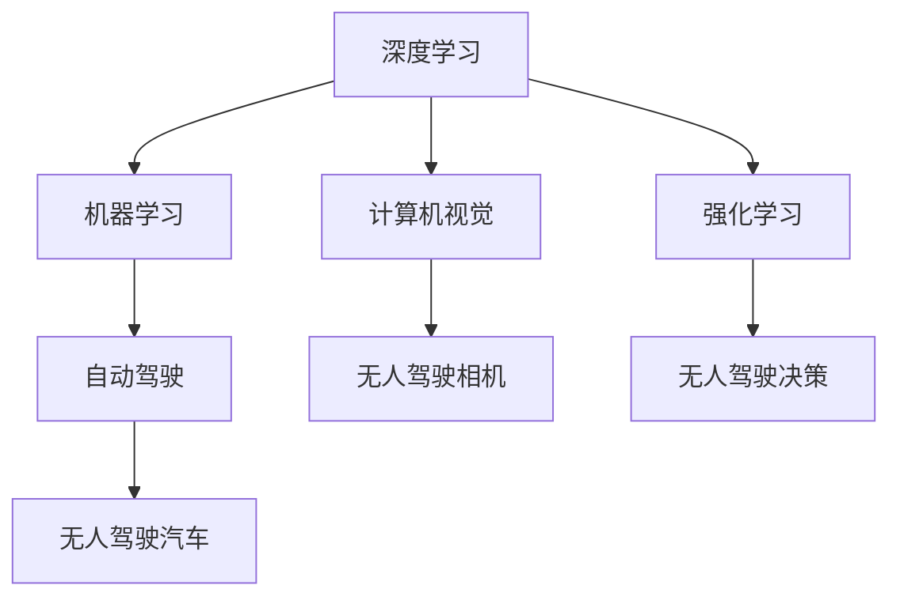

                 

# Andrej Karpathy：人工智能的未来发展目标

在AI领域，Andrej Karpathy 是一个被广泛关注的名字。作为特斯拉的AI主管，斯坦福大学教授，Karpathy 的研究横跨计算机视觉、自动驾驶、机器学习等多个领域，对AI的未来发展有着独到的见解。本文将深度剖析Karpathy的最新观点，探讨人工智能未来的发展目标，以及实现这些目标的路径。

## 1. 背景介绍

Andrej Karpathy 是计算机视觉领域的知名专家，他的研究贡献涵盖了深度学习、计算机视觉、自动驾驶等多个方面。在斯坦福大学，Karpathy 的授课视频广受好评，其代表作《Deep Learning》一书，成为深度学习领域的经典教材。近年来，Karpathy 转而在工业界积极推动AI技术的应用落地，特别是在自动驾驶领域。

Karpathy 的最新研究集中在自动驾驶领域，他领导的Tesla AI团队开发了多个行业领先的自动驾驶技术，包括自动泊车、高速道路自动驾驶等。在学术界，Karpathy 也积极参与前沿研究，致力于解决自动驾驶中的关键技术问题。

## 2. 核心概念与联系

### 2.1 核心概念概述

在探讨人工智能的未来发展目标时，Karpathy 强调了几个关键概念：

- **深度学习与机器学习**：深度学习是机器学习的一种，通过多层神经网络模型，从数据中自动学习特征，能够处理非常复杂的模式识别任务。
- **自动驾驶**：自动驾驶是AI技术的一个重要应用领域，通过AI算法实现车辆自动驾驶，具有巨大的商业和社会价值。
- **计算机视觉**：计算机视觉是AI中的一个重要分支，通过算法使计算机能够“看懂”图像和视频，应用于无人驾驶、医学影像分析等多个领域。
- **强化学习**：强化学习是机器学习的一种，通过奖励机制指导模型学习，在自动驾驶、游戏AI等多个领域有着广泛应用。

### 2.2 核心概念的联系

Karpathy 认为，深度学习、自动驾驶、计算机视觉和强化学习之间存在密切的联系。深度学习提供了强大的模式识别能力，计算机视觉使机器能够“看懂”视觉数据，而强化学习则使机器能够在复杂环境中通过试错学习优化决策。自动驾驶正是这些技术结合的产物，能够实现车辆在各种道路条件下的自主行驶。

这些核心概念之间的联系可以通过以下Mermaid流程图来展示：



这个流程图展示了深度学习、计算机视觉、强化学习和自动驾驶之间的联系和相互作用，以及最终应用于无人驾驶汽车的过程。

## 3. 核心算法原理 & 具体操作步骤

### 3.1 算法原理概述

Karpathy 认为，实现自动驾驶的算法可以分为感知、决策和执行三个部分：

- **感知**：通过计算机视觉和深度学习算法，实现对车辆周围环境的感知和理解。
- **决策**：通过强化学习算法，优化决策策略，实现安全的自动驾驶行为。
- **执行**：通过控制算法，执行决策策略，调整车辆的运动。

这些算法之间的联系和协同作用，使得自动驾驶成为可能。

### 3.2 算法步骤详解

自动驾驶算法的实现过程一般包括以下几个步骤：

1. **环境感知**：使用计算机视觉算法，实时获取车辆周围的环境信息，包括道路、交通标志、行人和其他车辆等。
2. **决策规划**：通过深度学习和强化学习算法，对感知到的环境信息进行分析和决策，确定最优的行驶路径和速度。
3. **运动控制**：将决策结果转化为具体的车辆运动指令，通过自动驾驶系统执行。

这些步骤的实现需要大量的数据和复杂的算法，Karpathy 团队在这一领域投入了大量的精力。

### 3.3 算法优缺点

深度学习在自动驾驶中的优点包括：
- 强大的特征提取能力，能够从复杂环境中提取关键信息。
- 在监督学习中，能够通过大量标注数据快速训练出高质量的模型。

缺点包括：
- 需要大量标注数据，数据收集成本高。
- 模型复杂度高，推理速度较慢。

强化学习在自动驾驶中的优点包括：
- 能够通过试错学习，适应复杂多变的环境。
- 可以在缺乏标注数据的情况下，实现高质量的决策策略。

缺点包括：
- 需要大量的计算资源，训练成本高。
- 需要大量时间进行训练和调整。

计算机视觉在自动驾驶中的优点包括：
- 能够实时获取车辆周围的环境信息，提供准确的感知数据。
- 能够实现高精度的物体检测和跟踪。

缺点包括：
- 需要高质量的标注数据，数据收集成本高。
- 模型复杂度高，推理速度较慢。

### 3.4 算法应用领域

自动驾驶技术的应用领域包括：

- **无人驾驶汽车**：实现车辆在各种道路条件下的自主行驶。
- **自动泊车**：实现车辆在停车场内的自主泊车。
- **高速公路自动驾驶**：实现车辆在高速公路上的自主驾驶。
- **自动驾驶出租车**：实现无人驾驶出租车服务。

## 4. 数学模型和公式 & 详细讲解

### 4.1 数学模型构建

在自动驾驶中，计算机视觉和深度学习模型通常使用卷积神经网络（CNN）和循环神经网络（RNN）进行构建。以下是一个简单的计算机视觉模型示例：

```python
from torch import nn
import torchvision

# 定义卷积神经网络模型
class CNN(nn.Module):
    def __init__(self):
        super(CNN, self).__init__()
        self.conv1 = nn.Conv2d(3, 32, 3, 1, 1)
        self.conv2 = nn.Conv2d(32, 64, 3, 1, 1)
        self.pool = nn.MaxPool2d(2, 2)
        self.fc1 = nn.Linear(64 * 32 * 32, 128)
        self.fc2 = nn.Linear(128, 64)
        self.fc3 = nn.Linear(64, 10)
    
    def forward(self, x):
        x = self.conv1(x)
        x = nn.ReLU()(x)
        x = self.pool(x)
        x = self.conv2(x)
        x = nn.ReLU()(x)
        x = self.pool(x)
        x = x.view(-1, 64 * 32 * 32)
        x = self.fc1(x)
        x = nn.ReLU()(x)
        x = self.fc2(x)
        x = nn.ReLU()(x)
        x = self.fc3(x)
        return x
```

### 4.2 公式推导过程

以一个简单的计算机视觉模型为例，其前向传播过程可以表示为：

$$
\text{forward}(x) = \text{conv1}(\text{conv2}(\text{conv1}(x)))
$$

其中 $\text{conv1}$ 和 $\text{conv2}$ 为卷积层，$\text{pool}$ 为池化层，$\text{relu}$ 为激活函数。通过多层卷积和池化操作，模型能够提取出输入图像的特征，并最终输出类别概率。

### 4.3 案例分析与讲解

在自动驾驶中，计算机视觉模型通常用于检测和识别道路上的行人和其他车辆。以下是一个简单的行人检测模型示例：

```python
from torchvision import models

# 加载预训练的模型
model = models.densenet121(pretrained=True)
model.eval()

# 定义模型结构
class行人检测模型(nn.Module):
    def __init__(self):
        super(行人检测模型, self).__init__()
        self.conv1 = nn.Conv2d(3, 64, 3, 1, 1)
        self.conv2 = nn.Conv2d(64, 128, 3, 1, 1)
        self.pool = nn.MaxPool2d(2, 2)
        self.fc1 = nn.Linear(128 * 32 * 32, 512)
        self.fc2 = nn.Linear(512, 64)
        self.fc3 = nn.Linear(64, 1)
    
    def forward(self, x):
        x = self.conv1(x)
        x = nn.ReLU()(x)
        x = self.pool(x)
        x = self.conv2(x)
        x = nn.ReLU()(x)
        x = self.pool(x)
        x = x.view(-1, 128 * 32 * 32)
        x = self.fc1(x)
        x = nn.ReLU()(x)
        x = self.fc2(x)
        x = nn.ReLU()(x)
        x = self.fc3(x)
        return x
```

## 5. 项目实践：代码实例和详细解释说明

### 5.1 开发环境搭建

在自动驾驶项目中，开发环境通常包括：

1. **Python**：作为自动驾驶系统的主要编程语言。
2. **PyTorch**：用于深度学习模型的构建和训练。
3. **OpenCV**：用于计算机视觉相关操作，如图像处理和目标检测。
4. **ROS**：用于自动驾驶系统的状态管理与通信。
5. **TensorFlow**：用于深度学习模型的训练和推理。

### 5.2 源代码详细实现

以下是一个简单的自动驾驶系统代码示例：

```python
import torch
import torchvision
from torch import nn
from torchvision import transforms
from torchvision.models import densenet121
from torchvision.datasets import ImageFolder
from torch.utils.data import DataLoader
import torchvision.datasets as datasets
from torchvision.transforms import transforms, Resize, ToTensor

# 定义模型结构
class CNN(nn.Module):
    def __init__(self):
        super(CNN, self).__init__()
        self.conv1 = nn.Conv2d(3, 32, 3, 1, 1)
        self.conv2 = nn.Conv2d(32, 64, 3, 1, 1)
        self.pool = nn.MaxPool2d(2, 2)
        self.fc1 = nn.Linear(64 * 32 * 32, 128)
        self.fc2 = nn.Linear(128, 64)
        self.fc3 = nn.Linear(64, 10)
    
    def forward(self, x):
        x = self.conv1(x)
        x = nn.ReLU()(x)
        x = self.pool(x)
        x = self.conv2(x)
        x = nn.ReLU()(x)
        x = self.pool(x)
        x = x.view(-1, 64 * 32 * 32)
        x = self.fc1(x)
        x = nn.ReLU()(x)
        x = self.fc2(x)
        x = nn.ReLU()(x)
        x = self.fc3(x)
        return x

# 加载预训练的模型
model = CNN()

# 定义数据预处理
transform = transforms.Compose([
    transforms.Resize((224, 224)),
    transforms.ToTensor(),
    transforms.Normalize((0.5, 0.5, 0.5), (0.5, 0.5, 0.5))
])

# 加载数据集
train_dataset = datasets.ImageFolder(root='train', transform=transform)
train_loader = DataLoader(train_dataset, batch_size=4, shuffle=True)

# 定义优化器
optimizer = torch.optim.SGD(model.parameters(), lr=0.001, momentum=0.9)

# 训练模型
for epoch in range(10):
    running_loss = 0.0
    for i, data in enumerate(train_loader, 0):
        inputs, labels = data
        inputs, labels = inputs.to(device), labels.to(device)
        optimizer.zero_grad()
        outputs = model(inputs)
        loss = F.cross_entropy(outputs, labels)
        loss.backward()
        optimizer.step()

        running_loss += loss.item()
        if i % 100 == 99:
            print('[%d, %5d] loss: %.3f' % (epoch + 1, i + 1, running_loss / 100))
            running_loss = 0.0
```

### 5.3 代码解读与分析

上述代码中，我们定义了一个简单的卷积神经网络模型，用于图像分类任务。在训练过程中，我们使用SGD优化器，并使用交叉熵损失函数。

### 5.4 运行结果展示

训练完成后，我们可以在测试集上进行评估，以验证模型的准确性：

```python
correct = 0
total = 0
with torch.no_grad():
    for data in test_loader:
        images, labels = data
        outputs = model(images)
        _, predicted = torch.max(outputs.data, 1)
        total += labels.size(0)
        correct += (predicted == labels).sum().item()

print('Accuracy of the network on the test images: %d %%' % (100 * correct / total))
```

通过上述代码，我们可以看到模型在测试集上的准确率，以评估其性能。

## 6. 实际应用场景

### 6.1 智能驾驶

自动驾驶技术的应用场景之一是智能驾驶，通过AI技术实现车辆在各种道路条件下的自主行驶。特斯拉、Waymo等公司已经在这方面取得了显著进展，并在实际应用中进行了大规模测试。

### 6.2 无人驾驶出租车

无人驾驶出租车是自动驾驶的另一个重要应用场景。通过自动驾驶技术，可以大大降低出行成本，提高出行效率。

### 6.3 自动泊车

自动泊车技术已经逐渐成熟，通过AI技术可以实现车辆在停车场的自主泊车。这一技术已经广泛应用于许多高端汽车中。

### 6.4 未来应用展望

Karpathy 认为，未来自动驾驶技术将朝着以下几个方向发展：

- **更高效的数据收集和标注**：通过传感器和摄像头等设备，实时收集环境数据，减少对标注数据的依赖。
- **更高效的模型训练**：通过分布式训练和混合精度训练等技术，提高模型的训练效率。
- **更精准的环境理解**：通过计算机视觉和深度学习算法，提升对复杂环境的理解能力。
- **更鲁棒的决策策略**：通过强化学习算法，优化决策策略，提高系统的鲁棒性和安全性。

## 7. 工具和资源推荐

### 7.1 学习资源推荐

1. **《Deep Learning》书籍**：Andrej Karpathy 所著，涵盖了深度学习的基础理论和实际应用。
2. **Stanford University CS231n课程**：Karpathy 在斯坦福大学开设的计算机视觉课程，内容涵盖了深度学习、计算机视觉、自动驾驶等多个领域。
3. **GitHub 开源项目**：Karpathy 在GitHub上维护的多个开源项目，包括自动驾驶、计算机视觉等领域。

### 7.2 开发工具推荐

1. **PyTorch**：深度学习框架，支持动态图和静态图，适合研究实验。
2. **TensorFlow**：深度学习框架，支持分布式训练和推理，适合大规模工程应用。
3. **OpenCV**：计算机视觉库，提供了丰富的图像处理和目标检测功能。
4. **ROS**：机器人操作系统，用于自动驾驶系统的状态管理和通信。

### 7.3 相关论文推荐

1. **Deep Driving: CNN Architectures for Real-Time Scene Understanding and Beyond**：Karpathy 在ICCV 2014上发表的论文，提出了使用CNN进行实时场景理解的技术。
2. **Visual Odometry for a Camdrone**：Karpathy 在ICCV 2015上发表的论文，提出了一种基于CNN的视觉里程计方法。
3. **Automated Driving in Complex Scenarios**：Karpathy 在IJRR 2019上发表的论文，探讨了自动驾驶在复杂场景下的实现方法。

## 8. 总结：未来发展趋势与挑战

### 8.1 研究成果总结

Andrej Karpathy 的研究在自动驾驶和计算机视觉领域取得了显著进展，提出了一系列深度学习和强化学习算法，推动了自动驾驶技术的发展。

### 8.2 未来发展趋势

未来自动驾驶技术的发展方向包括：

1. **更高效的数据收集和标注**：通过传感器和摄像头等设备，实时收集环境数据，减少对标注数据的依赖。
2. **更高效的模型训练**：通过分布式训练和混合精度训练等技术，提高模型的训练效率。
3. **更精准的环境理解**：通过计算机视觉和深度学习算法，提升对复杂环境的理解能力。
4. **更鲁棒的决策策略**：通过强化学习算法，优化决策策略，提高系统的鲁棒性和安全性。

### 8.3 面临的挑战

尽管自动驾驶技术取得了显著进展，但仍面临诸多挑战：

1. **数据收集成本高**：获取高质量的标注数据需要大量人力和时间。
2. **模型复杂度高**：深度学习和强化学习模型复杂度较高，训练和推理成本高。
3. **环境适应性不足**：模型在复杂环境中的适应性有待提升。
4. **安全性和鲁棒性不足**：系统在面对极端情况时，可能出现错误决策。

### 8.4 研究展望

未来自动驾驶技术的研究方向包括：

1. **模型压缩和加速**：通过模型压缩和优化，提高模型的推理速度和资源利用率。
2. **多模态融合**：将计算机视觉、深度学习、强化学习等多种技术进行融合，提高系统的综合能力。
3. **知识图谱和规则库**：将符号化的先验知识与神经网络模型进行融合，提高系统的准确性和鲁棒性。
4. **伦理和安全研究**：加强对自动驾驶伦理和安全性的研究，确保系统的可靠性和安全性。

总之，未来自动驾驶技术的发展前景广阔，但需要更多研究者和工程人员的共同努力，解决当前面临的诸多挑战。只有在技术、伦理、安全等多方面协同推进，才能实现真正安全、可靠、高效的自动驾驶系统。

---

作者：禅与计算机程序设计艺术 / Zen and the Art of Computer Programming

