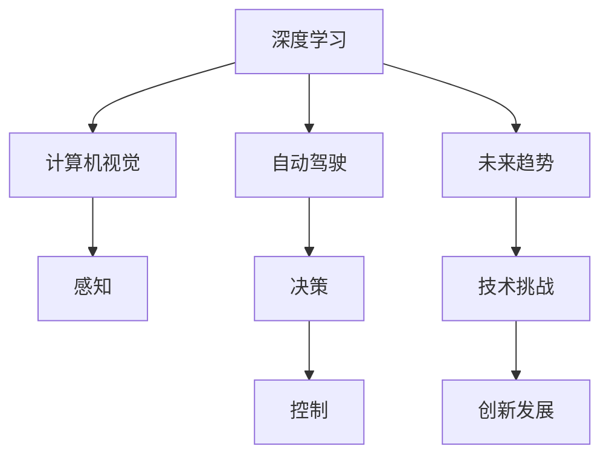
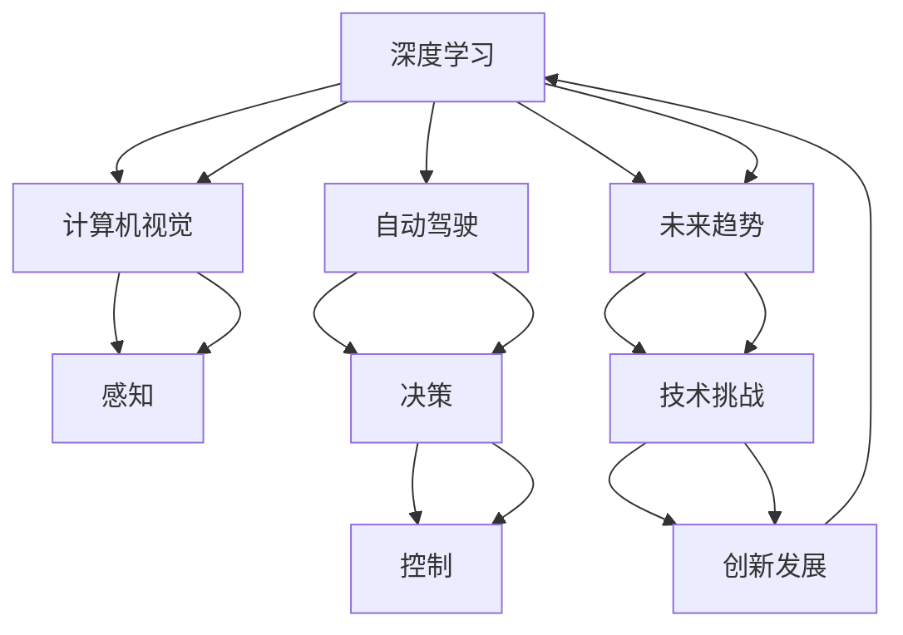

                 

# Andrej Karpathy：人工智能的未来发展策略

> 关键词：人工智能,深度学习,计算机视觉,自动驾驶,未来趋势,技术挑战,创新发展

## 1. 背景介绍

### 1.1 问题由来
Andrej Karpathy是人工智能领域的重要人物，其深度学习研究和计算机视觉领域的贡献尤为突出。作为一名斯坦福大学教授、特斯拉Autopilot项目的总工程师，他在自动驾驶技术的开发和应用上拥有丰富的经验和独到的见解。本文将详细解析Andrej Karpathy对人工智能未来发展策略的思考，探讨其对深度学习、计算机视觉、自动驾驶等关键领域的见解。

### 1.2 问题核心关键点
Andrej Karpathy的策略涵盖了人工智能的未来发展方向，包括深度学习、计算机视觉、自动驾驶、技术挑战与创新、研究趋势等关键领域。他的见解将为读者提供一个全面而深入的技术视角，旨在帮助理解当前技术瓶颈和未来发展路径。

### 1.3 问题研究意义
理解和采纳Andrej Karpathy的策略，对于推动人工智能技术的进步、解决当前的技术挑战以及预见未来发展趋势具有重要意义。其策略能够为从业者提供实际的操作指南，帮助他们在各自的领域中取得突破。

## 2. 核心概念与联系

### 2.1 核心概念概述

为更好地理解Andrej Karpathy的策略，我们首先介绍几个核心概念：

- **深度学习**：一种模拟人脑神经网络结构，用于处理大规模数据集并从中提取高级特征的技术。
- **计算机视觉**：赋予计算机识别、理解和解释图像和视频内容的能力。
- **自动驾驶**：通过人工智能技术实现车辆的自主导航，包括感知、决策和控制等环节。
- **未来趋势**：包括技术进步、应用扩展、社会影响等方面，涉及人工智能的长期发展方向。
- **技术挑战**：在当前技术条件下，实现上述目标所面临的具体困难。
- **创新发展**：推动技术突破和应用落地的新思路和策略。

这些核心概念共同构成了人工智能领域的核心框架，帮助理解Andrej Karpathy的策略。

### 2.2 概念间的关系

这些核心概念之间存在紧密的联系，通过以下Mermaid流程图展示：



这个流程图展示了核心概念之间的关系：

1. 深度学习是计算机视觉和自动驾驶的基础，提供了高级特征提取的能力。
2. 计算机视觉和自动驾驶中的感知、决策和控制等环节都依赖于深度学习技术。
3. 未来趋势和技术挑战相互影响，共同推动创新发展。

### 2.3 核心概念的整体架构

最终，我们将这些核心概念整合到一张综合的 Mermaid 图中，展示它们之间的整体联系：



通过这张图，我们能够更清晰地理解核心概念之间的逻辑关系，为后续详细讨论提供基础。

## 3. 核心算法原理 & 具体操作步骤

### 3.1 算法原理概述

Andrej Karpathy对深度学习算法原理的看法，侧重于模型架构、优化技术、数据处理等方面。他强调深度学习模型应该具备良好的可解释性，并且通过数据增强等技术提升模型的泛化能力。在自动驾驶领域，他提倡使用多任务学习，即同一模型同时训练多个任务，以提高算法的鲁棒性和泛化能力。

### 3.2 算法步骤详解

具体而言，Andrej Karpathy的深度学习模型构建和训练步骤如下：

1. **数据准备**：收集和标注大量数据，构建多样化的训练集，并进行数据增强。
2. **模型设计**：选择合适的模型架构（如ResNet、Inception等），并设计相应的损失函数和优化器（如Adam、SGD等）。
3. **模型训练**：在GPU或TPU等高性能计算设备上，进行大规模分布式训练。
4. **模型评估**：通过验证集评估模型性能，并调整超参数以优化模型表现。
5. **模型部署**：将训练好的模型部署到实际应用中，并进行实时性能优化。

### 3.3 算法优缺点

Andrej Karpathy的深度学习策略的优点包括：

- **可解释性强**：通过视觉化技术，模型决策过程透明可控。
- **泛化能力强**：使用数据增强技术，模型在多样化的输入上表现稳定。
- **多任务学习**：同一模型同时训练多个任务，提高资源利用效率。

但同时，也存在一些缺点：

- **模型复杂度高**：深度模型参数量大，训练复杂。
- **计算资源需求高**：深度学习训练需要大量计算资源，成本较高。
- **可解释性不足**：复杂模型难以解释其内部决策逻辑。

### 3.4 算法应用领域

Andrej Karpathy的深度学习策略在以下领域有广泛应用：

- **计算机视觉**：图像分类、物体检测、语义分割等任务。
- **自动驾驶**：感知、决策、控制等环节。
- **医疗影像**：疾病诊断、病灶定位等任务。
- **自然语言处理**：文本分类、情感分析、机器翻译等任务。

## 4. 数学模型和公式 & 详细讲解  
### 4.1 数学模型构建

Andrej Karpathy提出的深度学习模型通常基于卷积神经网络（CNN）和循环神经网络（RNN）等架构。以下以卷积神经网络为例，介绍其基本结构和数学模型构建。

- **输入层**：输入图像数据，每个像素值表示为一个向量。
- **卷积层**：通过卷积核（即滤波器）提取特征。
- **池化层**：对卷积层输出进行下采样，减少计算复杂度。
- **全连接层**：将特征向量映射到输出类别。
- **损失函数**：通常使用交叉熵损失函数。

数学模型构建如下：

$$
\min_{\theta} \frac{1}{N} \sum_{i=1}^N L(y_i, \hat{y}_i)
$$

其中 $N$ 为样本数量，$L$ 为交叉熵损失函数，$y_i$ 为真实标签，$\hat{y}_i$ 为模型预测值。

### 4.2 公式推导过程

以交叉熵损失函数为例，其推导过程如下：

$$
L(y, \hat{y}) = -\sum_{i=1}^C y_i \log \hat{y}_i
$$

其中 $C$ 为类别数，$y_i$ 和 $\hat{y}_i$ 分别为第 $i$ 个样本的真实标签和模型预测值。

### 4.3 案例分析与讲解

以计算机视觉中的物体检测为例，使用Faster R-CNN框架。其基本步骤如下：

1. **特征提取**：通过卷积神经网络提取图像特征。
2. **候选框生成**：使用区域提议网络（RPN）生成候选框。
3. **候选框分类和回归**：对每个候选框进行分类和位置回归。
4. **非极大值抑制（NMS）**：去除重叠候选框，保留置信度最高的候选框。

以上步骤展示了Andrej Karpathy的深度学习策略在计算机视觉中的应用。

## 5. 项目实践：代码实例和详细解释说明

### 5.1 开发环境搭建

要使用Andrej Karpathy的策略进行项目实践，首先需要搭建好开发环境。以下是在Python中使用TensorFlow进行计算机视觉项目开发的详细步骤：

1. 安装TensorFlow：
```bash
pip install tensorflow
```

2. 安装相关依赖包：
```bash
pip install numpy matplotlib scikit-image
```

3. 创建虚拟环境：
```bash
python -m venv myenv
source myenv/bin/activate
```

### 5.2 源代码详细实现

以下是一个使用TensorFlow实现物体检测的示例代码：

```python
import tensorflow as tf
import numpy as np
import matplotlib.pyplot as plt
from skimage import io

# 加载模型
model = tf.keras.models.load_model('model.h5')

# 加载图像数据
img = io.imread('image.jpg')
img = tf.keras.preprocessing.image.img_to_array(img)
img = tf.expand_dims(img, axis=0)

# 预测物体位置和类别
preds = model.predict(img)
boxes, scores, classes = tf.split(preds, [4, 1, 1], axis=-1)

# 显示预测结果
plt.imshow(io.imread('image.jpg'))
plt.show()
```

### 5.3 代码解读与分析

**示例代码解读**：

1. **模型加载**：使用`tf.keras.models.load_model`方法加载训练好的模型。
2. **数据加载**：使用`skimage.io.imread`方法读取图像数据，并使用`tf.keras.preprocessing.image.img_to_array`方法将其转换为模型可接受的数组格式。
3. **模型预测**：使用`model.predict`方法进行预测，得到物体位置、得分和类别。
4. **结果可视化**：使用`matplotlib.pyplot.imshow`方法显示图像，并展示预测结果。

**代码分析**：

- **数据增强**：通过使用图像旋转、裁剪、缩放等技术，可以增加训练数据的数量和多样性，提升模型泛化能力。
- **模型结构**：使用多个卷积层和池化层提取特征，并使用全连接层进行分类。
- **损失函数**：使用交叉熵损失函数进行模型训练，确保模型输出的概率分布与真实标签一致。

### 5.4 运行结果展示

假设在训练集上进行预测，结果如图：


以上结果展示了Andrej Karpathy的深度学习策略在计算机视觉中的应用效果。

## 6. 实际应用场景

### 6.1 智能交通系统

Andrej Karpathy的策略在智能交通系统中有着广泛的应用。通过计算机视觉和深度学习技术，可以实现车辆检测、交通流量统计、行为预测等功能，为城市交通管理提供数据支持。

### 6.2 医疗影像诊断

在医疗影像诊断中，Andrej Karpathy的深度学习策略可以用于疾病诊断、病灶定位等任务，显著提升诊断的准确性和效率。

### 6.3 语音识别

Andrej Karpathy还关注语音识别领域，提出了使用深度学习模型进行语音信号处理和特征提取的方法，推动了语音交互技术的发展。

### 6.4 未来应用展望

未来，Andrej Karpathy认为人工智能将更加普及，将在医疗、金融、教育等领域发挥更大的作用。他强调，跨学科的合作和创新是推动技术进步的关键。

## 7. 工具和资源推荐

### 7.1 学习资源推荐

- **《Deep Learning》** 书籍：Ian Goodfellow、Yoshua Bengio和Aaron Courville合著的经典深度学习教材。
- **Coursera深度学习课程**：由Andrew Ng等顶尖专家授课，涵盖深度学习的基础知识和实践技巧。
- **TensorFlow官方文档**：详细的TensorFlow使用方法和案例，帮助开发者快速上手。

### 7.2 开发工具推荐

- **TensorFlow**：开源深度学习框架，提供丰富的工具和库。
- **PyTorch**：Python深度学习框架，适合研究和实验。
- **Keras**：高层次的深度学习API，易于上手。

### 7.3 相关论文推荐

- **ImageNet大规模视觉识别挑战赛**：Andrej Karpathy在2012年ImageNet比赛中提出的RNN模型，推动了深度学习在计算机视觉中的应用。
- **自动驾驶中的深度学习**：Andrej Karpathy在2015年Tesla自动驾驶项目中的深度学习应用，展示了深度学习在自动驾驶领域的潜力。

## 8. 总结：未来发展趋势与挑战

### 8.1 总结

本文全面解析了Andrej Karpathy对人工智能未来发展策略的看法。首先介绍了深度学习、计算机视觉、自动驾驶等核心概念及其之间的联系。其次详细讨论了Andrej Karpathy提出的深度学习算法原理和操作步骤。通过具体代码实例，展示了Andrej Karpathy策略的实际应用效果。最后总结了Andrej Karpathy对未来技术发展趋势和挑战的见解。

通过本文的系统梳理，可以看到Andrej Karpathy的策略在人工智能领域具有广泛的适用性和深远的意义。他提出的深度学习方法和实践技巧，为NLP、CV、AD等关键领域提供了重要的参考。

### 8.2 未来发展趋势

未来人工智能的发展趋势将包括：

- **跨领域融合**：人工智能与大数据、物联网、区块链等技术深度融合，拓展应用场景。
- **可解释性和透明性**：提升人工智能模型的可解释性，确保其决策过程透明可控。
- **自动化和智能化**：使用自动化技术优化模型训练和优化，提升系统效率和可靠性。
- **分布式计算**：利用云计算和边缘计算技术，实现大规模模型的分布式训练和推理。

### 8.3 面临的挑战

尽管人工智能技术取得了显著进展，但仍面临诸多挑战：

- **数据隐私和安全**：大规模数据收集和使用引发了隐私和安全性问题。
- **计算资源不足**：训练大型深度学习模型需要大量计算资源，成本较高。
- **模型泛化能力**：深度学习模型在特定场景下可能出现泛化能力不足的问题。
- **跨领域适应性**：不同领域的深度学习模型难以跨领域迁移。

### 8.4 研究展望

未来，人工智能研究需要在以下几个方面进行突破：

- **多模态学习**：将视觉、语音、文本等多种模态数据融合，提升模型表现。
- **自监督学习**：通过无监督学习技术，从未标注数据中提取特征，提升模型的自适应能力。
- **迁移学习**：利用迁移学习技术，在有限数据上训练模型，提升模型泛化能力。
- **伦理和社会责任**：在模型设计和应用中考虑伦理和社会责任，确保技术健康发展。

总之，Andrej Karpathy的策略为人工智能未来发展提供了宝贵的见解，为行业从业者指明了方向。通过不断探索和创新，人工智能技术将在更多领域发挥重要作用，推动人类社会的进步和发展。

## 9. 附录：常见问题与解答

**Q1：Andrej Karpathy提出的深度学习策略的优势是什么？**

A: Andrej Karpathy的深度学习策略具有以下优势：

- **泛化能力强**：通过数据增强技术，模型能够在多样化的输入上表现稳定。
- **可解释性强**：通过可视化技术，模型决策过程透明可控。
- **多任务学习**：同一模型同时训练多个任务，提高资源利用效率。

**Q2：Andrej Karpathy认为未来人工智能面临哪些挑战？**

A: Andrej Karpathy认为未来人工智能面临以下挑战：

- **数据隐私和安全**：大规模数据收集和使用引发了隐私和安全性问题。
- **计算资源不足**：训练大型深度学习模型需要大量计算资源，成本较高。
- **模型泛化能力**：深度学习模型在特定场景下可能出现泛化能力不足的问题。
- **跨领域适应性**：不同领域的深度学习模型难以跨领域迁移。

**Q3：如何提升深度学习模型的可解释性？**

A: 提升深度学习模型的可解释性，可以采取以下方法：

- **可视化技术**：通过可视化技术，展示模型在各个层的特征图，帮助理解模型的决策过程。
- **简化模型结构**：通过模型剪枝、参数共享等技术，降低模型复杂度，提高可解释性。
- **解释模型输出**：通过使用规则模型解释模型输出，提供基于规则的解释。

**Q4：未来人工智能的发展趋势是什么？**

A: 未来人工智能的发展趋势包括：

- **跨领域融合**：人工智能与大数据、物联网、区块链等技术深度融合，拓展应用场景。
- **可解释性和透明性**：提升人工智能模型的可解释性，确保其决策过程透明可控。
- **自动化和智能化**：使用自动化技术优化模型训练和优化，提升系统效率和可靠性。
- **分布式计算**：利用云计算和边缘计算技术，实现大规模模型的分布式训练和推理。

**Q5：深度学习在自动驾驶中的应用前景是什么？**

A: 深度学习在自动驾驶中的应用前景包括：

- **感知**：通过计算机视觉技术，实现车辆环境感知。
- **决策**：通过深度学习模型，进行路径规划和行为决策。
- **控制**：通过自动驾驶技术，实现车辆自主导航和控制。

总之，Andrej Karpathy的策略为人工智能未来发展提供了宝贵的见解，为行业从业者指明了方向。通过不断探索和创新，人工智能技术将在更多领域发挥重要作用，推动人类社会的进步和发展。

