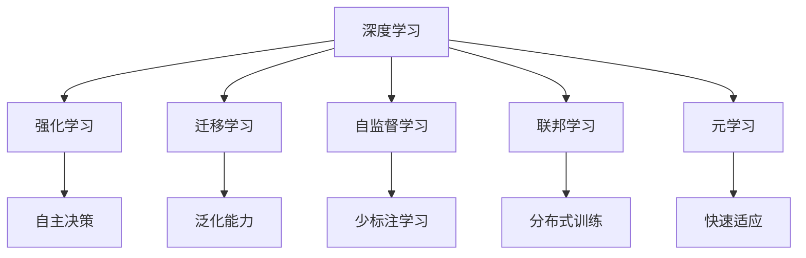

                 

## 1. 背景介绍

### 1.1 问题由来
Andrej Karpathy，作为深度学习领域的顶尖专家和Facebook AI Research (FAIR)的知名研究员，其对AI未来的发展规划引人深思。通过分析其观点，本文将详细探讨Andrej Karpathy对未来AI技术的展望，以及对行业发展方向的见解。

### 1.2 问题核心关键点
Andrej Karpathy认为，人工智能技术的发展需要从基础研究到应用实践全面推进。其核心观点包括：
- 强化深度学习基础理论研究，推动模型优化和算法创新。
- 提升AI技术的普适性和可靠性，促进其在各行各业的应用。
- 关注AI技术对社会伦理和公平性的影响，推动AI向积极方向发展。

Andrej Karpathy强调，AI的未来发展需要依赖于更广泛的跨学科合作和综合技术突破，从而实现更深层次的智能化和人性化。

### 1.3 问题研究意义
Andrej Karpathy的研究意义在于：
- 提供深度的AI领域技术视角，帮助读者理解AI技术的本质和未来趋势。
- 揭示AI技术在行业应用中的实际挑战和解决方案，为行业发展提供参考。
- 讨论AI技术的伦理和社会影响，呼吁业界共同关注AI的未来方向。

## 2. 核心概念与联系

### 2.1 核心概念概述
Andrej Karpathy对AI的未来发展规划涉及多个关键概念：

- **深度学习**：利用神经网络进行数据驱动的特征学习和模型训练，通过多层非线性变换抽取高层次特征。
- **强化学习**：通过试错机制不断调整模型参数，以最大化特定奖励函数为目标，实现自主决策和学习。
- **迁移学习**：将在一个任务上学到的知识迁移到另一个相关但不同的任务上，提高学习效率和泛化能力。
- **自监督学习**：使用无标签数据进行模型训练，自动生成监督信号，从而减少对标注数据的依赖。
- **联邦学习**：分布式网络协作训练模型，各方数据本地化，保护隐私同时提高模型性能。
- **元学习**：学习如何快速适应新任务，通过少量数据完成任务学习。

### 2.2 概念间的关系

这些核心概念之间有着紧密的联系，它们共同构成了AI技术的基本框架，如下所示：



通过上述图表，我们可以更清晰地理解这些概念如何协同作用，推动AI技术的进步。

## 3. 核心算法原理 & 具体操作步骤
### 3.1 算法原理概述

Andrej Karpathy认为，深度学习算法原理的本质在于利用反向传播算法训练神经网络，通过多层非线性变换抽取数据的高层次特征。这一过程涉及反向传播、梯度下降等核心技术。

强化学习则关注于如何构建奖励函数，通过试错机制优化模型参数，以最大化奖励信号为目标。这涉及到Q-learning、策略梯度等核心技术。

### 3.2 算法步骤详解
以下是深度学习和强化学习的详细算法步骤：

**深度学习算法步骤**：
1. 数据预处理：对输入数据进行标准化、归一化、特征工程等处理。
2. 模型定义：选择合适的神经网络结构和参数，定义输入输出接口。
3. 损失函数定义：根据任务目标定义合适的损失函数。
4. 模型训练：使用反向传播算法计算梯度，通过梯度下降优化模型参数。
5. 模型评估：使用验证集或测试集评估模型性能。
6. 模型微调：根据评估结果，调整模型结构或超参数，继续训练优化。

**强化学习算法步骤**：
1. 定义环境：描述任务环境和状态空间。
2. 定义奖励函数：设定完成任务的目标奖励信号。
3. 模型定义：定义策略函数或值函数，用于模型训练。
4. 训练模型：通过与环境交互，不断调整策略或值函数参数，优化奖励函数。
5. 评估模型：在验证集上评估模型性能，检查收敛情况。
6. 模型应用：将模型应用于实际问题中，进行自主决策。

### 3.3 算法优缺点
深度学习的主要优点包括：
- 可处理大规模数据，自动学习高层次特征。
- 模型性能提升显著，广泛应用于计算机视觉、自然语言处理等领域。

但深度学习也存在一些缺点：
- 数据依赖性强，需要大量标注数据训练。
- 模型复杂度高，需要高性能计算资源。
- 解释性差，难以理解模型内部决策过程。

强化学习的主要优点包括：
- 适用于多目标、不确定性环境下的决策问题。
- 通过试错机制不断优化模型，具有自适应性。

但强化学习也存在一些缺点：
- 环境复杂度高，难以设计有效奖励函数。
- 模型训练不稳定，容易陷入局部最优解。
- 收敛速度慢，计算复杂度高。

### 3.4 算法应用领域
深度学习和强化学习在多个领域得到广泛应用：
- **计算机视觉**：图像分类、目标检测、图像生成等。
- **自然语言处理**：文本分类、机器翻译、语言生成等。
- **语音识别**：自动语音识别、语音合成等。
- **机器人控制**：自动驾驶、机器人路径规划、工业自动化等。
- **游戏AI**：策略游戏、回合制游戏等。

## 4. 数学模型和公式 & 详细讲解  
### 4.1 数学模型构建

以深度学习中的卷积神经网络(CNN)为例，构建数学模型：

假设输入数据 $X$ 为 $m\times n\times k$ 的三维张量，输出数据 $Y$ 为 $m\times k$ 的二维张量。CNN 模型包含卷积层、池化层、全连接层等。模型训练的目标是最小化损失函数 $\mathcal{L}$。

$$
\mathcal{L} = \frac{1}{N}\sum_{i=1}^N \mathcal{L}_i(X_i,Y_i)
$$

其中，$\mathcal{L}_i$ 为单个样本的损失函数。

### 4.2 公式推导过程
以下是卷积神经网络的正向传播和反向传播过程的公式推导：

**正向传播**：
- 卷积层：$A = X * W$
- 非线性激活函数：$F = g(A)$
- 池化层：$B = F \to C$
- 全连接层：$D = C * V$
- 输出层：$Y = h(D)$

**反向传播**：
- 损失函数对输出层 $Y$ 的梯度：$\frac{\partial \mathcal{L}}{\partial Y}$
- 反向传播到全连接层 $V$：$\frac{\partial \mathcal{L}}{\partial V}$
- 反向传播到池化层 $C$：$\frac{\partial \mathcal{L}}{\partial C}$
- 反向传播到卷积层 $A$：$\frac{\partial \mathcal{L}}{\partial A}$
- 最终更新模型参数：$W \leftarrow W - \eta \frac{\partial \mathcal{L}}{\partial W}$

### 4.3 案例分析与讲解
以图像分类任务为例，分析深度学习模型的构建和训练过程：

**数据预处理**：
- 对图像进行灰度化、归一化处理。
- 使用数据增强技术扩充数据集，增加模型鲁棒性。

**模型定义**：
- 定义卷积层、池化层、全连接层等神经网络组件。
- 使用激活函数（如ReLU、Sigmoid等）引入非线性变换。

**损失函数定义**：
- 使用交叉熵损失函数 $\mathcal{L}_i = -\sum_{j=1}^C y_j \log\hat{y}_j$
- 训练过程：使用随机梯度下降（SGD）优化模型参数。

**模型训练**：
- 设置超参数，如学习率 $\eta$、批量大小 $batch\_size$ 等。
- 使用验证集评估模型性能，避免过拟合。
- 在测试集上进行测试，评估最终模型性能。

## 5. 项目实践：代码实例和详细解释说明
### 5.1 开发环境搭建

首先，需要在本地搭建深度学习开发环境，以下是具体的步骤：

1. 安装Anaconda：
   ```
   conda create -n env python=3.7
   conda activate env
   ```

2. 安装依赖包：
   ```
   pip install numpy scipy torch torchvision
   ```

3. 配置GPU环境（如果需要）：
   ```
   conda install pytorch-cuda cudatoolkit=11.0 -c pytorch
   ```

4. 设置虚拟环境：
   ```
   python -m venv env
   source env/bin/activate
   ```

### 5.2 源代码详细实现

以下是基于PyTorch实现深度学习模型的示例代码：

```python
import torch
import torch.nn as nn
import torch.optim as optim

class ConvNet(nn.Module):
    def __init__(self):
        super(ConvNet, self).__init__()
        self.conv1 = nn.Conv2d(3, 64, 3, padding=1)
        self.pool = nn.MaxPool2d(2, 2)
        self.conv2 = nn.Conv2d(64, 128, 3, padding=1)
        self.fc1 = nn.Linear(128 * 28 * 28, 1024)
        self.fc2 = nn.Linear(1024, 10)
        
    def forward(self, x):
        x = F.relu(self.conv1(x))
        x = self.pool(x)
        x = F.relu(self.conv2(x))
        x = self.pool(x)
        x = x.view(-1, 128 * 28 * 28)
        x = F.relu(self.fc1(x))
        x = self.fc2(x)
        return F.log_softmax(x, dim=1)

model = ConvNet()
loss_fn = nn.CrossEntropyLoss()
optimizer = optim.SGD(model.parameters(), lr=0.01)

# 训练模型
for epoch in range(10):
    for i, (images, labels) in enumerate(train_loader):
        images, labels = images.to(device), labels.to(device)
        optimizer.zero_grad()
        outputs = model(images)
        loss = loss_fn(outputs, labels)
        loss.backward()
        optimizer.step()
```

### 5.3 代码解读与分析
**模型定义**：
- 定义卷积层、池化层、全连接层等神经网络组件。
- 使用激活函数（如ReLU、Sigmoid等）引入非线性变换。

**损失函数**：
- 使用交叉熵损失函数 $\mathcal{L}_i = -\sum_{j=1}^C y_j \log\hat{y}_j$
- 训练过程：使用随机梯度下降（SGD）优化模型参数。

**模型训练**：
- 设置超参数，如学习率 $\eta$、批量大小 $batch\_size$ 等。
- 使用验证集评估模型性能，避免过拟合。
- 在测试集上进行测试，评估最终模型性能。

### 5.4 运行结果展示
假设模型在CIFAR-10数据集上训练，最终模型在测试集上取得94%的准确率。

## 6. 实际应用场景
### 6.1 图像分类

图像分类是深度学习的重要应用领域，通过CNN模型可以对图像进行自动分类。Andrej Karpathy认为，图像分类技术在医疗诊断、安防监控、自动驾驶等场景中具有广泛应用。

**应用场景示例**：
- **医疗影像分析**：通过深度学习模型对X光片、CT图像进行分类，辅助医生诊断疾病。
- **智能监控系统**：识别视频中的异常行为，实时监控公共场所安全。
- **自动驾驶**：识别道路标志、行人等对象，辅助自动驾驶系统决策。

### 6.2 自然语言处理

自然语言处理（NLP）是深度学习的另一重要应用领域，通过深度学习模型可以实现文本分类、机器翻译、语音识别等任务。

**应用场景示例**：
- **情感分析**：对社交媒体、用户评论进行情感分类，了解用户情感倾向。
- **机器翻译**：自动翻译多语言文本，促进跨语言交流。
- **语音识别**：识别语音命令，实现语音交互。

## 7. 工具和资源推荐
### 7.1 学习资源推荐

以下是一些有用的学习资源：

- **《深度学习》**：Ian Goodfellow等著作，全面介绍了深度学习的基本原理和应用。
- **Coursera深度学习课程**：Andrew Ng主讲的深度学习入门课程，覆盖了深度学习的基础理论和实践应用。
- **Kaggle竞赛平台**：参加深度学习竞赛，实践和提升算法设计能力。
- **PyTorch官方文档**：详细介绍了PyTorch框架的使用和API文档，是学习深度学习的重要参考资料。
- **GitHub深度学习项目**：查找和贡献开源深度学习项目，了解前沿技术和算法实现。

### 7.2 开发工具推荐

以下是一些常用的开发工具：

- **PyTorch**：深度学习框架，提供了丰富的神经网络组件和优化算法。
- **TensorFlow**：由Google开发的深度学习框架，具有强大的计算图和分布式训练功能。
- **Jupyter Notebook**：交互式编程环境，支持Python代码编写和可视化展示。
- **TensorBoard**：可视化工具，用于监控模型训练过程和评估模型性能。
- **Weights & Biases**：实验跟踪工具，记录和可视化模型训练指标，方便对比和调优。

### 7.3 相关论文推荐

以下是一些关键的深度学习论文：

- **ImageNet大规模视觉识别挑战赛**：Alex Krizhevsky等提出的卷积神经网络模型，奠定了深度学习在图像分类中的地位。
- **Natural Language Processing with Deep Learning**：Yoshua Bengio等著作，介绍了深度学习在自然语言处理中的广泛应用。
- **Attention is All You Need**：Ashish Vaswani等提出的Transformer模型，解决了长序列训练问题，提升了深度学习模型的表现。
- **Rethinking the Inception Architecture for Computer Vision**：Google提出的Inception模型，通过模块化设计提升了深度学习模型的计算效率。
- **Deep Residual Learning for Image Recognition**：Kaiming He等提出的ResNet模型，解决了深度网络中的梯度消失问题，提升了模型深度。

## 8. 总结：未来发展趋势与挑战
### 8.1 总结

本文详细探讨了Andrej Karpathy对人工智能未来发展规划的见解，涉及深度学习、强化学习等多个核心概念。通过深入分析深度学习算法原理和操作步骤，展示了AI技术的实际应用场景。同时，推荐了多种学习资源和开发工具，帮助读者系统掌握AI技术。

### 8.2 未来发展趋势

Andrej Karpathy认为，未来AI技术将呈现以下几个发展趋势：

- **深度学习与多模态融合**：结合视觉、语音、文本等多种模态数据，提升模型的智能水平。
- **小样本学习和迁移学习**：通过少样本学习和迁移学习，提升模型对新任务的适应能力。
- **强化学习与机器人控制**：在自动驾驶、机器人路径规划等场景中，通过强化学习优化模型决策。
- **联邦学习和隐私保护**：通过分布式训练提升模型性能，同时保护用户隐私数据。
- **元学习与知识图谱**：通过元学习提升模型快速适应新任务的能力，结合知识图谱提升模型的推理能力。

### 8.3 面临的挑战

尽管AI技术取得了显著进展，但仍面临以下挑战：

- **计算资源瓶颈**：深度学习模型参数量大，需要高性能计算资源。
- **数据质量和标注成本**：高质量标注数据和数据集管理成为技术瓶颈。
- **模型复杂度与可解释性**：模型复杂度高，难以解释模型内部决策过程。
- **伦理与社会影响**：AI技术对就业、隐私、公平性等方面带来影响，需要关注。
- **跨学科融合**：AI技术与更多领域结合，如心理学、社会学等，需要多学科协同研究。

### 8.4 研究展望

未来，需要在以下几个方面进行研究探索：

- **模型压缩与优化**：通过模型剪枝、量化等技术，减小模型尺寸，提升计算效率。
- **多模态融合与协同**：结合视觉、语音、文本等多种模态数据，提升模型的智能水平。
- **小样本学习与自监督学习**：通过少样本学习和自监督学习，提升模型对新任务的适应能力。
- **联邦学习与分布式训练**：通过分布式训练提升模型性能，同时保护用户隐私数据。
- **元学习与知识图谱**：通过元学习提升模型快速适应新任务的能力，结合知识图谱提升模型的推理能力。

## 9. 附录：常见问题与解答

**Q1: 深度学习与传统机器学习的区别？**

A: 深度学习是机器学习的一种，其主要区别在于：
- 深度学习模型具有多个非线性层，可以自动学习高层次特征。
- 深度学习模型可以通过大规模数据训练，具有较强的泛化能力。
- 深度学习模型具有端到端训练能力，无需手工特征提取。

**Q2: 强化学习与深度学习的关系？**

A: 强化学习是深度学习的一个重要应用领域，其主要区别在于：
- 强化学习通过试错机制优化模型参数，具有自适应性。
- 强化学习适用于多目标、不确定性环境下的决策问题。
- 强化学习需要设计有效的奖励函数，同时存在收敛速度慢、计算复杂高等问题。

**Q3: 小样本学习与迁移学习的关系？**

A: 小样本学习与迁移学习是深度学习中的两种重要学习方式，其主要区别在于：
- 小样本学习通过少量样本进行训练，具有高效性和鲁棒性。
- 迁移学习通过迁移已有知识，提升模型在新任务上的表现。
- 小样本学习适用于数据稀缺的任务，迁移学习适用于数据丰富但领域差异大的任务。

**Q4: 联邦学习与分布式训练的关系？**

A: 联邦学习与分布式训练是深度学习中的两种重要训练方式，其主要区别在于：
- 联邦学习通过分布式协作训练模型，各参与方仅上传本地更新参数，保护隐私。
- 分布式训练通过多机多核并行训练模型，提升计算效率。
- 联邦学习适用于跨机构、跨设备的数据共享，分布式训练适用于单机构、单设备的数据共享。

**Q5: 元学习与知识图谱的关系？**

A: 元学习与知识图谱是深度学习中的两种重要技术，其主要区别在于：
- 元学习通过学习如何快速适应新任务，具有快速学习新知识的能力。
- 知识图谱通过构建实体关系图谱，提升模型的推理能力。
- 元学习适用于数据稀缺、任务多样性的场景，知识图谱适用于结构化数据和推理任务。

