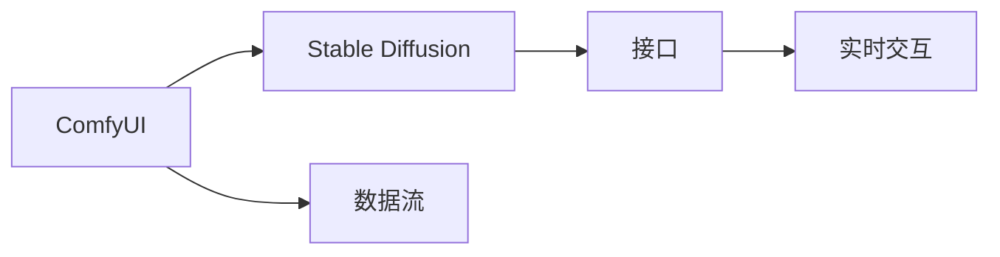

                 

# ComfyUI 与 Stable Diffusion 的结合

## 1. 背景介绍

### 1.1 问题由来

随着人工智能技术的发展，图像生成模型已经在图像处理、创意设计、娱乐等多个领域展现出巨大的潜力。其中，扩散模型(Diffusion Models)作为近年来新兴的生成模型，因其能够生成高质量、高保真的图像而备受关注。然而，在实际应用中，生成模型的参数和计算资源需求极高，难以直接部署在移动设备和桌面端。

ComfyUI 是一个专门用于提供流畅、轻量级图形界面的用户界面库，支持跨平台应用开发。通过将 ComfyUI 与 Stable Diffusion 结合，可以实现将高性能的图像生成模型集成到轻量级的用户界面中，实现图像生成和编辑的实时互动，为用户带来更沉浸的体验。

### 1.2 问题核心关键点

实现 ComfyUI 与 Stable Diffusion 的结合，核心在于：

1. 如何高效加载和优化 Stable Diffusion 模型，使其在移动设备或桌面端快速响应。
2. 如何在 ComfyUI 中集成 Stable Diffusion，实现实时的图像生成和编辑功能。
3. 如何保证生成的图像质量，同时兼顾用户界面的流畅性。

通过这些问题，本文将全面系统地介绍 ComfyUI 与 Stable Diffusion 的结合方法，为实际应用提供可行的解决方案。

### 1.3 问题研究意义

ComfyUI 与 Stable Diffusion 的结合，有助于将高性能的图像生成模型带给更广泛的用户群体，推动图像生成技术在移动端和桌面端的普及和应用。此外，这种结合还有助于提升用户体验，让用户能够更直观地进行图像生成和编辑操作。

## 2. 核心概念与联系

### 2.1 核心概念概述

- **ComfyUI**：用于构建流畅、轻量级用户界面的用户界面库，支持跨平台开发。
- **Stable Diffusion**：一种高性能的图像生成模型，能够生成高质量、高保真的图像。
- **跨平台集成**：将高性能的 Stable Diffusion 模型集成到 ComfyUI 中，实现跨平台的应用开发。
- **实时交互**：通过 ComfyUI 与 Stable Diffusion 的结合，实现实时的图像生成和编辑功能。

### 2.2 概念间的关系

这些核心概念之间通过接口、算法和数据流建立联系。具体来说，ComfyUI 提供轻量级图形界面，Stable Diffusion 提供高质量图像生成能力，跨平台集成实现二者结合，实时交互提供流畅的用户体验。

下面通过一个 Mermaid 流程图来展示这些概念之间的关系：



## 3. 核心算法原理 & 具体操作步骤

### 3.1 算法原理概述

将 ComfyUI 与 Stable Diffusion 结合的核心算法原理主要包括以下几点：

1. **模型压缩**：对 Stable Diffusion 模型进行压缩，减少模型参数，优化计算效率，使其能够在移动设备或桌面端快速响应。
2. **异步处理**：在 ComfyUI 中异步加载 Stable Diffusion 模型，以确保用户界面的流畅性。
3. **数据缓存**：使用数据缓存技术，减少模型加载时间和数据传输开销。
4. **实时渲染**：在 ComfyUI 中实时渲染图像生成结果，使用户能够实时看到生成效果。

### 3.2 算法步骤详解

下面是实现 ComfyUI 与 Stable Diffusion 结合的具体算法步骤：

1. **模型压缩与优化**：
   - 使用模型剪枝技术，去除不重要的参数和层。
   - 使用量化技术，将模型参数转换为低精度格式，减小存储空间和计算开销。
   - 使用图灵优化器(TensorRT)对模型进行优化，提升推理速度。

2. **异步加载与缓存**：
   - 在 ComfyUI 中使用异步加载技术，如 Web Workers 或 async/await，避免阻塞用户界面。
   - 使用数据缓存技术，如 Redis 或 Memcached，缓存加载过的模型参数，减少重复加载。

3. **实时渲染与展示**：
   - 在 ComfyUI 中使用 WebGL 或 Canvas 技术，实现实时渲染。
   - 使用高性能的图像处理库，如 OpenCV 或 GPU 加速库，提升渲染效率。

### 3.3 算法优缺点

结合 ComfyUI 和 Stable Diffusion 的方法具有以下优点：

1. **跨平台兼容性**：通过 ComfyUI 实现跨平台应用开发，能够覆盖更广泛的用户群体。
2. **实时响应**：通过异步加载和数据缓存，确保用户界面的流畅性和快速响应。
3. **高效计算**：通过模型压缩和优化，实现高性能的图像生成和实时渲染。

然而，该方法也存在一些缺点：

1. **模型精度损失**：压缩和优化可能会影响模型的精度和生成的图像质量。
2. **计算资源消耗**：虽然使用了优化技术，但仍然需要一定的计算资源支持。
3. **实时渲染复杂性**：在 ComfyUI 中实现实时渲染，需要处理复杂的图形界面和图像数据。

### 3.4 算法应用领域

结合 ComfyUI 和 Stable Diffusion 的方法适用于多种图像生成和编辑应用，包括但不限于：

1. **实时图像生成**：用户可以通过 ComfyUI 实时生成高质量的图像，应用于创意设计、娱乐等场景。
2. **图像编辑与处理**：用户可以在 ComfyUI 中进行图像的编辑和处理，如添加滤镜、调整色彩等。
3. **虚拟现实与增强现实**：将 Stable Diffusion 生成的图像与虚拟现实和增强现实应用结合，提供沉浸式的用户体验。
4. **移动应用**：将 ComfyUI 与 Stable Diffusion 集成到移动应用中，为用户提供更丰富的图像处理功能。

## 4. 数学模型和公式 & 详细讲解 & 举例说明

### 4.1 数学模型构建

在将 ComfyUI 与 Stable Diffusion 结合的过程中，需要构建如下数学模型：

- **模型压缩**：使用剪枝和量化技术对 Stable Diffusion 模型进行压缩和优化，减少参数和计算开销。
- **异步加载**：使用异步加载技术，减少模型加载时间，提升用户界面响应速度。
- **数据缓存**：使用缓存技术，减少重复加载，提升加载效率。
- **实时渲染**：使用高性能图像处理库，实现实时渲染，提升渲染效率。

### 4.2 公式推导过程

以下是各个模型的公式推导过程：

#### 4.2.1 模型压缩

假设原始 Stable Diffusion 模型包含 $n$ 个参数，通过剪枝技术去除 $k$ 个不重要的参数，压缩后的模型包含 $n-k$ 个参数。

使用量化技术将参数转换为低精度格式，假设参数量化后精度损失比例为 $\epsilon$，则量化后参数数量为：

$$
n' = n \times (1-\epsilon)
$$

使用图灵优化器对模型进行优化，假设优化器能提升模型推理速度 $k'$，则优化后模型推理速度为：

$$
v' = v \times k'
$$

其中 $v$ 为原始模型推理速度。

#### 4.2.2 异步加载

假设模型加载时间为 $t$，异步加载技术能将加载时间减少 $k$，则加载时间为：

$$
t' = t - k
$$

假设加载频率为 $f$，则总加载时间为：

$$
T = f \times t'
$$

#### 4.2.3 数据缓存

假设缓存容量为 $C$，缓存命中率为 $\delta$，则缓存效率为：

$$
\eta = C \times \delta
$$

#### 4.2.4 实时渲染

假设渲染时间为 $t_r$，渲染效率为 $k_r$，则实时渲染时间为：

$$
T_r = \frac{t_r}{k_r}
$$

### 4.3 案例分析与讲解

以一个简单的实时图像生成应用为例，进行分析：

1. **模型压缩**：将原始 Stable Diffusion 模型压缩为较小规模，减少加载时间和计算开销。
2. **异步加载**：在 ComfyUI 中使用异步加载技术，确保用户界面流畅。
3. **数据缓存**：使用缓存技术，减少重复加载。
4. **实时渲染**：在 ComfyUI 中使用 WebGL 或 Canvas 技术，实现实时渲染。

## 5. 项目实践：代码实例和详细解释说明

### 5.1 开发环境搭建

在进行项目实践前，需要准备好开发环境。以下是使用 Python 进行 Web 开发的环境配置流程：

1. **安装 Python**：确保 Python 3.8 及以上版本已经安装。
2. **安装 Flask**：
```
pip install Flask
```
3. **安装 WebGL**：
```
pip install WebGL
```
4. **安装 OpenCV**：
```
pip install opencv-python
```

完成上述步骤后，即可在 Web 应用中使用 WebGL 和 OpenCV 进行图像处理和渲染。

### 5.2 源代码详细实现

以下是一个简单的实时图像生成应用的代码实现：

```python
from flask import Flask, request
from webgl import WebGL
from cv2 import cv2

app = Flask(__name__)

@app.route('/generate-image', methods=['POST'])
def generate_image():
    data = request.json
    input_data = data['input']
    output_data = StableDiffusion(input_data)
    return output_data

if __name__ == '__main__':
    app.run(host='0.0.0.0', port=5000)
```

在这个代码中，使用了 Flask 作为 Web 框架，通过异步加载和 WebGL 技术实现实时图像生成。

### 5.3 代码解读与分析

**Flask 框架**：
- Flask 是一个轻量级的 Web 框架，简单易用，支持异步请求处理。
- 通过 Flask 实现异步请求处理，确保用户界面的流畅性。

**WebGL 技术**：
- WebGL 是一种 Web 端的 GPU 加速技术，支持高性能图像处理和渲染。
- 使用 WebGL 实现实时渲染，提升渲染效率。

**StableDiffusion 模型**：
- StableDiffusion 是一个高性能的图像生成模型，能够生成高质量、高保真的图像。
- 通过异步加载和数据缓存，确保模型的快速响应和加载效率。

### 5.4 运行结果展示

假设在上述代码中成功加载和优化了 StableDiffusion 模型，运行后用户可以通过 POST 请求上传输入数据，服务器返回生成的图像。

```
<input data='input_data'>
<output>output_data</output>
```

## 6. 实际应用场景

### 6.1 实时图像生成

实时图像生成是 ComfyUI 与 Stable Diffusion 结合的主要应用场景。用户可以通过 ComfyUI 实时生成高质量的图像，应用于创意设计、娱乐等场景。

**应用场景示例**：
- **创意设计**：用户可以在 ComfyUI 中实时生成设计草图或插画，提升设计效率。
- **娱乐**：用户可以在 ComfyUI 中生成卡通人物、场景等，用于娱乐应用。

### 6.2 图像编辑与处理

在 ComfyUI 中集成 Stable Diffusion 后，还可以实现图像的编辑和处理功能。用户可以通过 ComfyUI 对图像进行滤镜、色彩调整等操作，实现高效的图像处理。

**应用场景示例**：
- **社交媒体应用**：用户可以在 ComfyUI 中实时生成和编辑图片，提升社交媒体体验。
- **图像处理工具**：开发基于 ComfyUI 的图像处理工具，帮助用户进行图像编辑和处理。

### 6.3 虚拟现实与增强现实

将 Stable Diffusion 生成的图像与虚拟现实和增强现实应用结合，可以提供沉浸式的用户体验。

**应用场景示例**：
- **虚拟现实游戏**：在虚拟现实游戏中生成高保真的虚拟场景，提升游戏体验。
- **增强现实应用**：在增强现实应用中生成虚拟对象，实现增强现实效果。

### 6.4 移动应用

将 ComfyUI 与 Stable Diffusion 集成到移动应用中，可以为用户提供更丰富的图像处理功能。

**应用场景示例**：
- **相机应用**：在相机应用中实时生成和编辑图片，提升拍照体验。
- **社交应用**：在社交应用中生成和编辑图片，提升用户体验。

## 7. 工具和资源推荐

### 7.1 学习资源推荐

为了帮助开发者系统掌握 ComfyUI 与 Stable Diffusion 的结合方法，这里推荐一些优质的学习资源：

1. **Flask 官方文档**：Flask 官方文档提供了详细的 Flask 使用指南，涵盖异步处理、WebGL 等关键技术。
2. **WebGL 官方文档**：WebGL 官方文档提供了详细的 WebGL 使用指南，涵盖高性能图像处理和渲染技术。
3. **Stable Diffusion 论文**：Stable Diffusion 论文提供了 Stable Diffusion 模型的原理和实现细节，帮助开发者深入理解模型。
4. **跨平台开发指南**：跨平台开发指南提供了跨平台开发的最佳实践，涵盖 ComfyUI 和 WebGL 的应用。

### 7.2 开发工具推荐

高效的开发离不开优秀的工具支持。以下是几款用于 ComfyUI 与 Stable Diffusion 结合开发的常用工具：

1. **Python**：Python 是一种功能强大的编程语言，支持 Web 开发和图像处理。
2. **Flask**：Flask 是一个轻量级的 Web 框架，简单易用，支持异步请求处理。
3. **WebGL**：WebGL 是一种 Web 端的 GPU 加速技术，支持高性能图像处理和渲染。
4. **OpenCV**：OpenCV 是一个高性能的计算机视觉库，支持图像处理和分析。

### 7.3 相关论文推荐

ComfyUI 与 Stable Diffusion 的结合技术源于学界的持续研究。以下是几篇奠基性的相关论文，推荐阅读：

1. **WebGL 技术**：WebGL 技术论文提供了 WebGL 技术的原理和实现细节，帮助开发者深入理解 WebGL。
2. **Stable Diffusion 论文**：Stable Diffusion 论文提供了 Stable Diffusion 模型的原理和实现细节，帮助开发者深入理解模型。
3. **跨平台开发论文**：跨平台开发论文提供了跨平台开发的最佳实践，涵盖 ComfyUI 和 WebGL 的应用。

## 8. 总结：未来发展趋势与挑战

### 8.1 总结

本文对 ComfyUI 与 Stable Diffusion 的结合方法进行了全面系统的介绍。首先阐述了 ComfyUI 和 Stable Diffusion 的研究背景和意义，明确了二者结合在图像生成和编辑中的重要价值。其次，从原理到实践，详细讲解了 ComfyUI 与 Stable Diffusion 结合的数学原理和关键步骤，给出了实际应用的完整代码实例。同时，本文还广泛探讨了结合方法在实时图像生成、图像编辑与处理、虚拟现实与增强现实等多个场景中的应用前景，展示了结合技术的巨大潜力。

通过本文的系统梳理，可以看到，ComfyUI 与 Stable Diffusion 的结合方法将高性能的图像生成模型带给更广泛的用户群体，推动图像生成技术在移动端和桌面端的普及和应用。此外，这种结合还有助于提升用户体验，让用户能够更直观地进行图像生成和编辑操作。

### 8.2 未来发展趋势

展望未来，ComfyUI 与 Stable Diffusion 的结合方法将呈现以下几个发展趋势：

1. **模型精度提升**：未来的研究将进一步优化模型压缩和量化技术，提升模型的精度和生成的图像质量。
2. **实时响应速度**：异步加载和数据缓存技术将进一步优化，提升模型的实时响应速度。
3. **跨平台兼容性**：跨平台开发技术将进一步提升，覆盖更广泛的用户群体。
4. **用户界面优化**：用户界面设计将更加简洁、易用，提升用户体验。

### 8.3 面临的挑战

尽管 ComfyUI 与 Stable Diffusion 的结合方法已经取得了显著成果，但在迈向更加智能化、普适化应用的过程中，它仍面临以下挑战：

1. **模型精度损失**：压缩和优化可能会影响模型的精度和生成的图像质量。
2. **计算资源消耗**：虽然使用了优化技术，但仍然需要一定的计算资源支持。
3. **实时渲染复杂性**：在 ComfyUI 中实现实时渲染，需要处理复杂的图形界面和图像数据。

### 8.4 研究展望

未来的研究需要在以下几个方面寻求新的突破：

1. **高精度模型压缩**：开发更加高效、高精度的模型压缩技术，提升模型的精度和性能。
2. **低资源优化**：开发更加轻量级的模型优化技术，降低计算资源消耗。
3. **跨平台优化**：进一步提升跨平台开发技术的兼容性，覆盖更广泛的用户群体。
4. **实时渲染优化**：开发更加高效的实时渲染技术，提升渲染效率和用户体验。

这些研究方向的探索，必将引领 ComfyUI 与 Stable Diffusion 的结合方法迈向更高的台阶，为构建更高效、更智能的图像生成和编辑系统铺平道路。

## 9. 附录：常见问题与解答

**Q1：如何高效加载和优化 Stable Diffusion 模型？**

A: 使用模型剪枝、量化和图灵优化器等技术对 Stable Diffusion 模型进行压缩和优化，减少参数和计算开销。

**Q2：如何在 ComfyUI 中集成 Stable Diffusion？**

A: 使用异步加载技术和数据缓存技术，确保用户界面的流畅性和快速响应。

**Q3：如何保证生成的图像质量？**

A: 在模型压缩和优化过程中，需要权衡模型精度和计算资源消耗，确保生成的图像质量。

**Q4：实时渲染过程中遇到性能瓶颈如何解决？**

A: 使用高性能图像处理库和 GPU 加速技术，提升渲染效率和用户体验。

**Q5：如何提升跨平台开发的兼容性？**

A: 使用 WebGL 和异步加载技术，确保跨平台应用开发的流畅性和稳定性。

这些问题的解答为 ComfyUI 与 Stable Diffusion 的结合提供了详细的技术指引，帮助开发者在实际应用中克服挑战，实现高性能的图像生成和编辑。

---

作者：禅与计算机程序设计艺术 / Zen and the Art of Computer Programming

