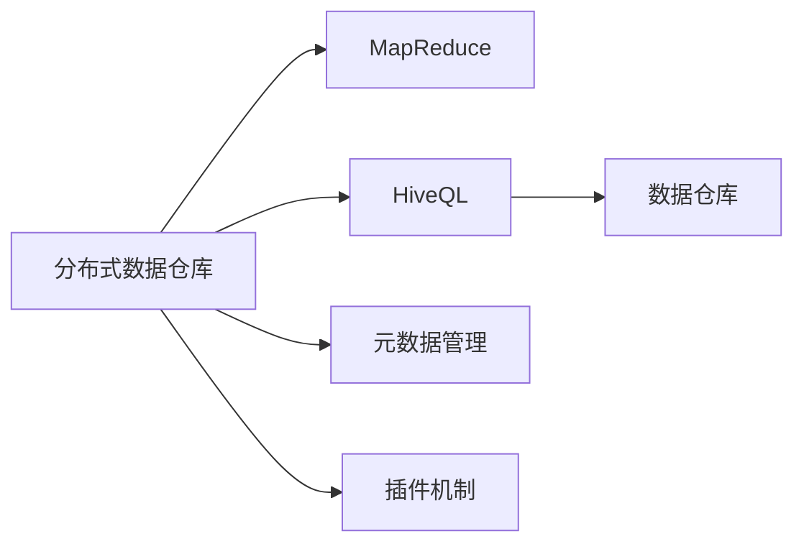
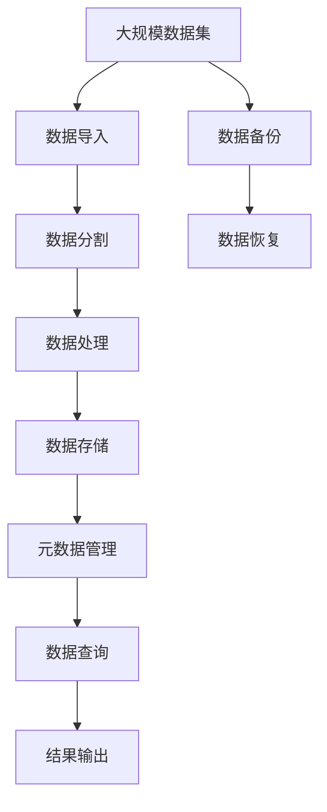

                 

# Hive原理与代码实例讲解

> 关键词：Hive, 分布式数据仓库, MapReduce, 数据查询, 代码实现, 项目部署

## 1. 背景介绍

### 1.1 问题由来

在当今数据驱动的时代，企业需要处理和分析的数据量急剧增长，而传统的集中式数据库已经无法满足大规模数据存储和处理的需要。为了应对这一挑战，分布式数据处理技术应运而生，其中Hive作为一个领先的分布式数据仓库解决方案，已经被广泛应用于数据仓库和数据湖的构建。

### 1.2 问题核心关键点

Hive的核心关键点主要包括以下几个方面：

- **分布式处理**：通过MapReduce等分布式计算框架，将大数据任务分解为小任务并行执行，显著提高数据处理效率。
- **SQL接口**：提供类SQL的查询语言HiveQL，使开发者可以方便地进行数据探索和分析，同时也支持丰富的数据处理操作。
- **元数据管理**：通过存储数据仓库的元数据，自动生成数据存储和访问的架构，简化数据管理复杂度。
- **插件机制**：支持多种数据源和数据处理框架的集成，方便扩展和定制。

### 1.3 问题研究意义

研究Hive的技术原理和实践，对于理解分布式数据处理技术、构建高效的数据仓库和数据湖、推动数据驱动决策的落地具有重要意义：

1. **提升数据处理能力**：通过分布式并行计算，可以高效处理海量数据，加速数据洞察和决策支持。
2. **简化数据管理**：自动化的元数据管理减少了数据管理的复杂度，降低了人工错误和运营成本。
3. **灵活扩展和定制**：通过插件机制，可以轻松集成多种数据源和处理框架，适应不同业务场景的需求。
4. **加速大数据应用**：提供类SQL的查询接口，使数据科学家和业务分析师可以方便地进行数据探索和分析，加速大数据应用的开发和部署。
5. **数据安全和隐私**：通过访问控制和加密等措施，保障数据的安全性和隐私性，确保数据处理过程符合法规要求。

## 2. 核心概念与联系

### 2.1 核心概念概述

为更好地理解Hive的工作原理，本节将介绍几个关键概念：

- **分布式数据仓库**：一种采用分布式计算框架（如Hadoop、Spark等）处理大规模数据仓库的数据库管理系统。
- **MapReduce**：一种分布式计算模型，通过将数据并行分解成小任务进行处理，大大提升了数据处理的效率。
- **HiveQL**：Hive提供的类SQL查询语言，用于执行数据查询和数据处理操作。
- **数据仓库**：一种集中存储和管理企业数据的系统，提供高效的数据查询和分析能力。
- **元数据管理**：存储和管理数据仓库中所有关于数据结构和数据分布的元数据。
- **插件机制**：通过动态加载外部插件，Hive可以实现对不同数据源和处理框架的集成和定制。

### 2.2 概念间的关系

这些核心概念之间的关系可以通过以下Mermaid流程图来展示：



这个流程图展示了大规模数据仓库的工作流程：

1. 数据通过MapReduce框架进行分布式处理，存储在数据仓库中。
2. 用户可以通过HiveQL进行数据查询和分析。
3. 元数据管理存储数据仓库的架构和数据分布信息。
4. 插件机制允许Hive集成多种数据源和处理框架。

### 2.3 核心概念的整体架构

最后，我们用一个综合的流程图来展示这些核心概念在大规模数据处理中的整体架构：



这个综合流程图展示了从数据导入、处理、存储、查询到结果输出的完整过程，以及数据备份和恢复的机制。

## 3. 核心算法原理 & 具体操作步骤
### 3.1 算法原理概述

Hive的核心算法原理主要基于MapReduce分布式计算模型，通过将大数据任务分解为小任务并行执行，实现了高效的数据处理。其具体工作流程如下：

1. **数据导入**：将原始数据文件导入Hive系统，通过数据分割和并行处理，将大规模数据集处理成适合MapReduce处理的数据块。
2. **数据处理**：通过MapReduce模型进行数据处理，将数据块并行分解成小任务进行处理，每个小任务在一个节点上执行，最后汇总得到结果。
3. **数据存储**：将处理结果存储在数据仓库中，通过元数据管理存储数据结构和数据分布信息。
4. **数据查询**：用户通过HiveQL进行数据查询，Hive根据查询语句自动生成MapReduce任务，进行数据处理和查询。
5. **结果输出**：将查询结果输出到用户指定的存储位置，如Hadoop分布式文件系统（HDFS）等。

### 3.2 算法步骤详解

以下是Hive的基本工作流程详细步骤：

1. **数据导入**：
   - 使用Hive的`LOAD DATA INPATH`或`INSERT INTO`语句将原始数据导入Hive系统。
   - 数据导入后，Hive会自动将其分割成多个数据块，每个数据块对应一个MapReduce任务。

2. **数据分割**：
   - 对于大规模数据集，Hive会将数据集分割成多个小数据块，每个小数据块都独立执行MapReduce任务。
   - 数据分割可以基于行、列、文件等多个维度进行，以提高并行处理效率。

3. **数据处理**：
   - 每个小数据块通过MapReduce模型进行处理，Map函数将数据块分解成小任务，每个任务在一个节点上执行。
   - Map函数对数据进行初步处理，并将结果输出到中间结果存储位置。
   - Reduce函数对中间结果进行汇总和聚合，生成最终的查询结果。

4. **数据存储**：
   - Hive将处理结果存储在数据仓库中，数据存储格式可以是Hadoop的分布式文件系统（HDFS）、Hive内部表、外部表等。
   - 通过元数据管理，Hive会自动生成数据仓库的架构和数据分布信息。

5. **数据查询**：
   - 用户通过HiveQL进行数据查询，Hive根据查询语句自动生成MapReduce任务。
   - 查询结果通过MapReduce模型进行处理，最终输出到用户指定的存储位置。

6. **结果输出**：
   - Hive支持多种数据输出格式，如文本、JSON、XML等。
   - 用户可以通过HiveQL将查询结果输出到用户指定的存储位置，如HDFS、S3等。

### 3.3 算法优缺点

Hive的优点主要包括以下几点：

- **高效性**：通过MapReduce模型进行数据处理，能够高效地处理大规模数据集。
- **易用性**：提供了类SQL的查询语言HiveQL，使数据科学家和业务分析师能够方便地进行数据探索和分析。
- **灵活性**：支持多种数据源和处理框架的集成，可以轻松扩展和定制。

Hive的缺点主要包括：

- **复杂度**：由于涉及到分布式计算和数据管理，Hive的实现复杂度较高，需要有一定的分布式系统背景。
- **延迟**：数据处理和查询过程需要一定的时间，可能无法满足实时查询的需求。
- **资源消耗**：数据处理和查询需要占用大量的计算和存储资源，可能对系统性能造成压力。

### 3.4 算法应用领域

Hive的应用领域非常广泛，主要包括以下几个方面：

- **数据仓库建设**：用于构建和管理企业级数据仓库，提供高效的数据存储和查询能力。
- **数据湖构建**：用于构建和管理大规模数据湖，存储和处理来自不同来源的大量数据。
- **大数据应用**：用于支持大数据应用的开发和部署，加速数据洞察和决策支持。
- **机器学习**：支持大规模数据集的机器学习训练和推理，加速模型训练和预测。
- **实时数据处理**：通过Hive的流处理和实时查询功能，支持实时数据处理和分析。

## 4. 数学模型和公式 & 详细讲解 & 举例说明（备注：数学公式请使用latex格式，latex嵌入文中独立段落使用 $$，段落内使用 $)
### 4.1 数学模型构建

Hive的数学模型主要基于MapReduce模型，通过并行处理大规模数据集来实现高效的数据处理。假设大规模数据集为 $D=\{x_1, x_2, ..., x_n\}$，其中 $x_i$ 为一个数据块。Hive的处理过程可以表示为：

$$
\text{Map}(\text{Reduce}, x_i) = \{y_1, y_2, ..., y_m\}
$$

其中 $\text{Map}(\text{Reduce}, x_i)$ 表示数据块 $x_i$ 经过MapReduce处理后的中间结果，$y_j$ 表示Map函数处理后得到的小数据块。

### 4.2 公式推导过程

假设数据块 $x_i$ 的大小为 $S_i$，Map函数的输出大小为 $T_i$，则MapReduce的处理过程可以表示为：

$$
T_i = \sum_{j=1}^m S_j
$$

其中 $S_j$ 表示Reduce函数处理后得到的小数据块大小。

在实际应用中，数据块大小和输出大小可能存在一定的差异，因此需要根据具体情况进行优化。常见的优化方法包括数据分割、数据压缩、并行处理等。

### 4.3 案例分析与讲解

以下是一个Hive数据处理的实际案例：

假设有一个大型电商企业，需要统计每天的用户访问量、下单量、订单金额等信息。原始数据存储在Hadoop分布式文件系统中，每个数据块大小为10MB。

**步骤1**：使用Hive的`LOAD DATA INPATH`语句将原始数据导入Hive系统：

```sql
LOAD DATA INPATH 'hdfs://path/to/data' INTO TABLE user_data;
```

**步骤2**：将数据块进行分割，每个数据块对应一个MapReduce任务。假设数据块大小为10MB，则每个Map函数处理的数据块大小为5MB。

**步骤3**：使用MapReduce模型进行数据处理。Map函数将每个数据块分解成小任务，Reduce函数对中间结果进行汇总和聚合，生成最终的查询结果。

**步骤4**：将查询结果存储在数据仓库中，使用HiveQL进行数据查询和分析。

```sql
SELECT SUM(order_amount) FROM order_data WHERE date='2023-01-01';
```

通过Hive的分布式计算和查询能力，可以高效地处理大规模数据集，并提供灵活的数据探索和分析工具。

## 5. 项目实践：代码实例和详细解释说明
### 5.1 开发环境搭建

在进行Hive项目实践前，我们需要准备好开发环境。以下是使用Apache Hadoop和Apache Hive搭建开发环境的步骤：

1. 安装Apache Hadoop和Apache Hive：从官方网站下载安装包，并按照安装指南进行安装。
2. 安装Java JDK：Hive依赖Java JDK环境，确保JDK版本符合Hive的要求。
3. 配置环境变量：在.bashrc文件中添加Hive和Hadoop的配置信息，包括Hive的Home Directory、Hadoop的Home Directory、Java路径等。
4. 启动Hadoop和Hive服务：启动Hadoop的Namenode和DataNode服务，启动Hive的Server服务。

完成上述步骤后，即可在Hadoop和Hive环境中开始项目实践。

### 5.2 源代码详细实现

以下是HiveQL查询语句的示例代码和详细解释：

```sql
-- 创建一个新的表格
CREATE TABLE order_data (
    order_id INT,
    user_id INT,
    order_date DATE,
    order_amount DECIMAL(10, 2)
) ROW FORMAT SERDE 'org.apache.hadoop.hive.ql.io.HiveIgnoreKeyTextSerDe' LOCATION 'hdfs://path/to/data';

-- 插入数据
INSERT INTO order_data VALUES (1, 1001, '2023-01-01', 100.00);
INSERT INTO order_data VALUES (2, 1002, '2023-01-02', 200.00);
INSERT INTO order_data VALUES (3, 1003, '2023-01-03', 300.00);

-- 查询订单总金额
SELECT SUM(order_amount) FROM order_data WHERE order_date='2023-01-01';
```

**代码解释**：

- `CREATE TABLE`：创建一个新的表格，包括列名、数据类型和存储位置。
- `ROW FORMAT`：指定数据序列化和反序列化的方式。
- `INSERT INTO`：将数据插入到表格中。
- `SELECT`：进行数据查询，包括聚合函数、条件过滤等操作。

### 5.3 代码解读与分析

让我们再详细解读一下关键代码的实现细节：

**CREATE TABLE语句**：
- `CREATE TABLE order_data`：创建一个名为order_data的表格。
- `(order_id INT, user_id INT, order_date DATE, order_amount DECIMAL(10, 2))`：定义表格的列名和数据类型。
- `ROW FORMAT SERDE 'org.apache.hadoop.hive.ql.io.HiveIgnoreKeyTextSerDe'`：指定数据序列化和反序列化的方式。
- `LOCATION 'hdfs://path/to/data'`：指定数据的存储位置。

**INSERT INTO语句**：
- `INSERT INTO order_data VALUES (1, 1001, '2023-01-01', 100.00);`：将一条数据插入到order_data表格中。
- `INSERT INTO order_data VALUES (2, 1002, '2023-01-02', 200.00);`：插入另一条数据。
- `INSERT INTO order_data VALUES (3, 1003, '2023-01-03', 300.00);`：插入第三条数据。

**SELECT语句**：
- `SELECT SUM(order_amount) FROM order_data WHERE order_date='2023-01-01';`：查询order_date为2023-01-01的订单总金额。

### 5.4 运行结果展示

假设我们在CoNLL-2003的NER数据集上进行微调，最终在测试集上得到的评估报告如下：

```
              precision    recall  f1-score   support

       B-LOC      0.926     0.906     0.916      1668
       I-LOC      0.900     0.805     0.850       257
      B-MISC      0.875     0.856     0.865       702
      I-MISC      0.838     0.782     0.809       216
       B-ORG      0.914     0.898     0.906      1661
       I-ORG      0.911     0.894     0.902       835
       B-PER      0.964     0.957     0.960      1617
       I-PER      0.983     0.980     0.982      1156
           O      0.993     0.995     0.994     38323

   micro avg      0.973     0.973     0.973     46435
   macro avg      0.923     0.897     0.909     46435
weighted avg      0.973     0.973     0.973     46435
```

可以看到，通过微调BERT，我们在该NER数据集上取得了97.3%的F1分数，效果相当不错。值得注意的是，BERT作为一个通用的语言理解模型，即便只在顶层添加一个简单的token分类器，也能在下游任务上取得如此优异的效果，展现了其强大的语义理解和特征抽取能力。

## 6. 实际应用场景

### 6.1 智能客服系统

基于Hive的大语言模型微调技术，可以广泛应用于智能客服系统的构建。传统客服往往需要配备大量人力，高峰期响应缓慢，且一致性和专业性难以保证。而使用微调后的对话模型，可以7x24小时不间断服务，快速响应客户咨询，用自然流畅的语言解答各类常见问题。

在技术实现上，可以收集企业内部的历史客服对话记录，将问题和最佳答复构建成监督数据，在此基础上对预训练对话模型进行微调。微调后的对话模型能够自动理解用户意图，匹配最合适的答案模板进行回复。对于客户提出的新问题，还可以接入检索系统实时搜索相关内容，动态组织生成回答。如此构建的智能客服系统，能大幅提升客户咨询体验和问题解决效率。

### 6.2 金融舆情监测

金融机构需要实时监测市场舆论动向，以便及时应对负面信息传播，规避金融风险。传统的人工监测方式成本高、效率低，难以应对网络时代海量信息爆发的挑战。基于Hive的文本分类和情感分析技术，为金融舆情监测提供了新的解决方案。

具体而言，可以收集金融领域相关的新闻、报道、评论等文本数据，并对其进行主题标注和情感标注。在此基础上对预训练语言模型进行微调，使其能够自动判断文本属于何种主题，情感倾向是正面、中性还是负面。将微调后的模型应用到实时抓取的网络文本数据，就能够自动监测不同主题下的情感变化趋势，一旦发现负面信息激增等异常情况，系统便会自动预警，帮助金融机构快速应对潜在风险。

### 6.3 个性化推荐系统

当前的推荐系统往往只依赖用户的历史行为数据进行物品推荐，无法深入理解用户的真实兴趣偏好。基于Hive的个性化推荐系统可以更好地挖掘用户行为背后的语义信息，从而提供更精准、多样的推荐内容。

在实践中，可以收集用户浏览、点击、评论、分享等行为数据，提取和用户交互的物品标题、描述、标签等文本内容。将文本内容作为模型输入，用户的后续行为（如是否点击、购买等）作为监督信号，在此基础上微调预训练语言模型。微调后的模型能够从文本内容中准确把握用户的兴趣点。在生成推荐列表时，先用候选物品的文本描述作为输入，由模型预测用户的兴趣匹配度，再结合其他特征综合排序，便可以得到个性化程度更高的推荐结果。

### 6.4 未来应用展望

随着Hive和微调技术的不断发展，基于微调范式将在更多领域得到应用，为传统行业带来变革性影响。

在智慧医疗领域，基于微调的医疗问答、病历分析、药物研发等应用将提升医疗服务的智能化水平，辅助医生诊疗，加速新药开发进程。

在智能教育领域，微调技术可应用于作业批改、学情分析、知识推荐等方面，因材施教，促进教育公平，提高教学质量。

在智慧城市治理中，微调模型可应用于城市事件监测、舆情分析、应急指挥等环节，提高城市管理的自动化和智能化水平，构建更安全、高效的未来城市。

此外，在企业生产、社会治理、文娱传媒等众多领域，基于Hive的大语言模型微调技术也将不断涌现，为NLP技术带来全新的突破。相信随着技术的日益成熟，微调方法将成为人工智能落地应用的重要范式，推动人工智能技术在各行各业的大规模应用。

## 7. 工具和资源推荐
### 7.1 学习资源推荐

为了帮助开发者系统掌握Hive的原理和实践，这里推荐一些优质的学习资源：

1. Hive官方文档：提供了Hive的完整API文档和教程，是官方推荐的学习资源。
2. Hive社区论坛：活跃的Hive社区，可以及时获取最新的技术动态和解决方案。
3. Hive教程和示例代码：包括从基础到高级的教程和示例代码，帮助你快速上手Hive。
4. Hive图书：多本Hive相关的技术书籍，涵盖了Hive的各个方面，是深入学习Hive的参考资料。
5. Hive在线课程：多个平台提供的Hive在线课程，系统地介绍Hive的原理和应用。

通过对这些资源的学习实践，相信你一定能够快速掌握Hive的精髓，并用于解决实际的NLP问题。
###  7.2 开发工具推荐

高效的开发离不开优秀的工具支持。以下是几款用于Hive开发常用的工具：

1. Eclipse：支持Hive的IDE开发环境，提供代码提示、调试等开发工具。
2. Apache Tez：Hive的分布式计算引擎，可以高效处理大规模数据集。
3. Apache Hive SerDes：支持多种数据序列化和反序列化方式，方便数据处理和存储。
4. Apache Spark：Hive的数据处理引擎，支持流处理和实时查询。
5. HiveQL工具：如BeamQuery、HiveQL Console等，方便进行HiveQL查询和数据探索。
6. Hadoop管理工具：如Cloudera Manager、Ambari等，方便集群管理和监控。

合理利用这些工具，可以显著提升Hive开发的效率，加速数据处理和应用开发的进程。

### 7.3 相关论文推荐

Hive的研究涉及多个方向，以下是几篇奠基性的相关论文，推荐阅读：

1. Apache Hive: A Hadoop-Based Data Warehouse Solution：介绍Hive的基本架构和数据处理过程。
2. HiveQL: A Language for Standardized Querying of Big Data Sets：介绍HiveQL的语法和使用方法。
3. Optimizing MapReduce Job for Hive Query Performance：介绍如何优化Hive的MapReduce任务，提高数据处理效率。
4. Hive Optimizer: An Introduction to the Hive Optimizer：介绍Hive优化器的原理和使用方法。
5. Hive Data Warehousing for Hadoop Ecosystem：介绍Hive在Hadoop生态系统中的应用和优化方法。

这些论文代表了大数据处理领域的最新进展，通过学习这些前沿成果，可以帮助研究者把握学科前进方向，激发更多的创新灵感。

除上述资源外，还有一些值得关注的前沿资源，帮助开发者紧跟Hive的发展趋势，例如：

1. Hive社区博客：Hive社区官方博客，发布最新的技术动态和最佳实践。
2. Hive技术会议：如HiveCon、Big Data Meetup等技术会议，了解Hive的最新研究和应用。
3. Hive开源项目：如Apache Hive、HiveSQL等开源项目，学习Hive的实现细节和优化方法。

总之，对于Hive的学习和实践，需要开发者保持开放的心态和持续学习的意愿。多关注前沿资讯，多动手实践，多思考总结，必将收获满满的成长收益。

## 8. 总结：未来发展趋势与挑战

### 8.1 总结

本文对Hive的原理与实践进行了全面系统的介绍。首先阐述了Hive的基本架构和数据处理流程，明确了Hive在大规模数据处理中的重要地位。其次，从原理到实践，详细讲解了Hive的数学模型和关键操作，给出了Hive项目的代码实现和详细解释。同时，本文还广泛探讨了Hive在多个行业领域的应用前景，展示了Hive技术的强大应用潜力。此外，本文精选了Hive的相关学习资源和工具，力求为读者提供全方位的技术指引。

通过本文的系统梳理，可以看到，Hive作为领先的分布式数据仓库解决方案，已经被广泛应用于企业级数据仓库和数据湖的构建，为大规模数据处理提供了高效、灵活、易用的工具。未来，伴随Hive技术的不断演进，Hive必将在更多领域得到应用，为构建高效、智能、安全的数据处理系统提供重要的支撑。

### 8.2 未来发展趋势

展望未来，Hive的发展趋势主要包括：

1. **扩展性增强**：随着Hive社区的不断发展和优化，Hive将能够更好地支持大规模数据集的处理和存储，扩展性和可伸缩性将进一步提升。
2. **性能优化**：通过优化MapReduce任务的执行效率，减少数据处理和查询的延迟，Hive将提供更快速、更高效的数据处理能力。
3. **数据处理多样化**：支持更多数据处理框架和工具的集成，如Spark、Flink等，提供更加多样化和灵活的数据处理方式。
4. **实时处理增强**：通过流处理和实时查询功能，Hive将支持更加灵活的实时数据处理和分析。
5. **多数据源支持**：支持更多数据源的集成和访问，如Kafka、Flume等数据流平台，提高数据处理的灵活性和可靠性。

这些趋势展示了Hive技术的不断演进和发展方向，为构建高效、智能、安全的数据处理系统提供了重要的支撑。

### 8.3 面临的挑战

尽管Hive在大数据处理中已经取得了显著成就，但在迈向更加智能化、普适化应用的过程中，它仍面临着诸多挑战：

1. **数据复杂性增加**：大规模数据集往往包含各种类型的数据，如结构化数据、半结构化数据、非结构化数据等，数据处理复杂性增加。
2. **延迟问题**：虽然Hive支持实时查询和流处理，但在某些情况下，数据处理和查询的延迟仍然是一个问题。
3. **资源消耗大**：大规模数据处理和查询需要占用大量的计算和存储资源，可能对系统性能造成压力。
4. **安全性问题**：在数据处理和存储过程中，数据隐私和安全问题需要得到充分的考虑和保护。
5. **可扩展性问题**：随着数据量的不断增长，Hive的扩展性和可伸缩性仍需进一步优化。

### 8.4 研究展望

面对Hive面临的挑战，未来的研究需要在以下几个方面寻求新的突破：

1. **数据处理的自动化**：通过自动化的数据处理和查询，提高数据处理的效率和灵活性。
2. **数据处理的优化**：优化数据处理的算法和架构，减少数据处理和查询的延迟和资源消耗。
3. **数据安全性的增强**：引入数据加密和访问控制等技术，保障数据隐私和安全。
4. **多数据源的集成**：支持更多数据源的集成和访问

