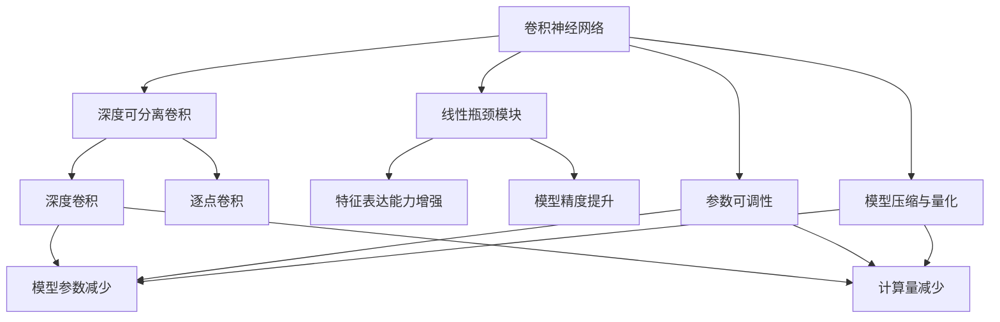
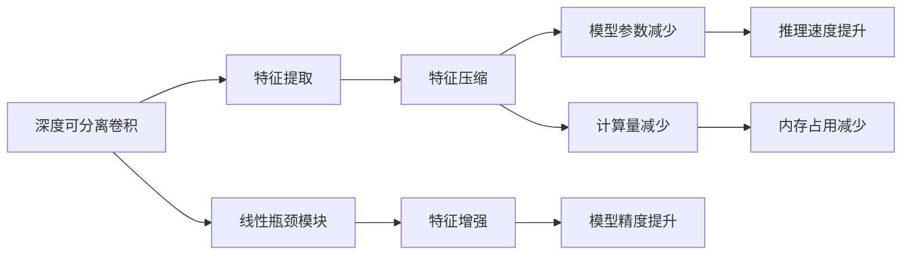
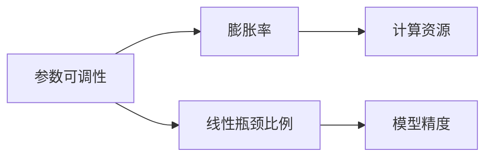
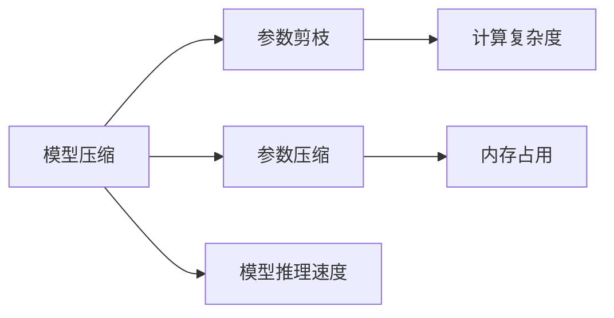

                 

# MobileNet原理与代码实例讲解

## 1. 背景介绍

### 1.1 问题由来
随着人工智能技术的飞速发展，计算机视觉（CV）领域涌现出许多高效、准确的图像识别和分类算法，其中卷积神经网络（CNN）无疑是最为核心的技术。然而，传统的CNN网络结构在移动设备等资源受限的环境中，往往表现出较大的计算复杂度，无法满足实时性和低功耗的要求。

针对这一问题，Google提出并实现了一种高效轻量级的卷积神经网络结构——MobileNet，旨在提高模型推理速度和计算效率，同时保持较高的图像分类精度。MobileNet的成功，不仅推动了计算机视觉技术在移动设备和嵌入式系统中的广泛应用，也启发了更多针对移动设备优化的网络结构研究。

### 1.2 问题核心关键点
MobileNet的核心思想是采用深度可分离卷积（Depthwise Separable Convolution）替代传统的全连接卷积，大幅减少模型参数和计算量。具体来说，其核心特点包括：

- **深度可分离卷积**：将传统的全连接卷积分解为深度卷积和逐点卷积两个步骤，有效降低模型参数和计算复杂度。
- **线性瓶颈模块（Linear Bottleneck）**：引入线性瓶颈模块（也称为Inverted Bottleneck Module），进一步提高特征表达能力和模型精度。
- **参数可调性**：模型参数可以通过调节超参数（如膨胀率、线性瓶颈比例等）灵活调整，适应不同场景的计算资源需求。
- **模型评估和改进**：通过模型压缩、量化和剪枝等技术手段，进一步优化模型结构，提升推理速度。

### 1.3 问题研究意义
MobileNet的提出，不仅为高效轻量级CNN结构的研究提供了重要的理论和实践指导，还极大地促进了计算机视觉技术在移动设备和嵌入式系统中的普及。通过深入理解MobileNet的设计思想和核心算法，我们可以更好地设计适用于各种资源受限环境的神经网络结构，加速模型推理和应用部署，为AI技术在更多场景中的落地提供坚实基础。

## 2. 核心概念与联系

### 2.1 核心概念概述

为更好地理解MobileNet的工作原理和实现细节，本节将介绍几个关键的概念和它们之间的联系。

- **卷积神经网络（CNN）**：一种通过卷积操作提取图像特征的神经网络结构。传统的全连接卷积在计算复杂度和参数量上较大，不适用于计算资源受限的环境。
- **深度可分离卷积（Depthwise Separable Convolution）**：将全连接卷积分解为深度卷积和逐点卷积两个步骤，减少模型参数和计算量，同时保持较高的特征表达能力。
- **线性瓶颈模块（Inverted Bottleneck Module）**：通过引入线性瓶颈模块，进一步增强特征表达能力，提升模型精度。
- **参数可调性**：通过调节模型超参数，如膨胀率、线性瓶颈比例等，可以灵活适应不同计算资源需求的场景。
- **模型压缩与量化**：通过压缩、量化和剪枝等技术手段，优化模型结构，提高推理速度和降低内存占用。

这些核心概念之间的关系可以通过以下Mermaid流程图来展示：



这个流程图展示了MobileNet的核心概念及其之间的关系：

1. 卷积神经网络通过卷积操作提取图像特征。
2. 深度可分离卷积将全连接卷积分解为深度卷积和逐点卷积，减少参数和计算量。
3. 线性瓶颈模块进一步增强特征表达能力，提升模型精度。
4. 参数可调性通过调节超参数，灵活适应不同计算资源需求的场景。
5. 模型压缩与量化优化模型结构，提高推理速度和降低内存占用。

这些概念共同构成了MobileNet的设计框架，使其能够在计算资源受限的环境中，保持较高的图像分类精度。通过理解这些核心概念，我们可以更好地把握MobileNet的工作原理和优化方向。

### 2.2 概念间的关系

这些核心概念之间存在着紧密的联系，形成了MobileNet的设计和优化框架。下面我通过几个Mermaid流程图来展示这些概念之间的关系。

#### 2.2.1 MobileNet的核心结构



这个流程图展示了MobileNet的核心结构：

1. 深度可分离卷积和线性瓶颈模块构成特征提取和压缩过程。
2. 特征压缩和增强分别减少模型参数和计算量，同时提升模型精度。
3. 推理速度和内存占用的减少，使得MobileNet适用于计算资源受限的环境。

#### 2.2.2 参数可调性



这个流程图展示了参数可调性的主要方面：

1. 通过调节膨胀率和线性瓶颈比例，可以灵活调整计算资源需求和模型精度。
2. 膨胀率决定了特征压缩的程度，线性瓶颈比例决定了特征增强的强度。

#### 2.2.3 模型压缩与量化



这个流程图展示了模型压缩与量化技术的作用：

1. 参数剪枝和参数压缩减少模型参数和计算复杂度，降低内存占用。
2. 通过模型压缩和量化，提升模型推理速度，优化计算资源利用率。

## 3. 核心算法原理 & 具体操作步骤
### 3.1 算法原理概述

MobileNet的核心算法是基于深度可分离卷积（Depthwise Separable Convolution）和线性瓶颈模块（Inverted Bottleneck Module）实现的。其核心思想是通过分离深度卷积和逐点卷积，减少模型参数和计算量，同时保持较高的特征表达能力。以下是MobileNet的主要算法原理：

- **深度可分离卷积**：将传统的全连接卷积分解为深度卷积和逐点卷积两个步骤，减少模型参数和计算量。具体来说，深度卷积在输入特征图通道上执行卷积操作，逐点卷积在每个通道上执行点乘操作，最后将结果相加得到输出特征图。
- **线性瓶颈模块**：通过引入线性瓶颈模块，进一步增强特征表达能力，提升模型精度。具体来说，线性瓶颈模块包括一个1x1卷积层、一个深度卷积层和一个逐点卷积层，其中1x1卷积层用于特征压缩和增强，深度卷积和逐点卷积用于特征表示。

### 3.2 算法步骤详解

MobileNet的实现过程主要包括模型设计、参数训练和推理优化三个步骤。以下是详细的步骤详解：

#### 3.2.1 模型设计

1. **输入层**：将输入图像尺寸调整为预设大小。

2. **深度可分离卷积层**：应用深度可分离卷积层，对图像进行特征提取。

3. **线性瓶颈模块层**：应用线性瓶颈模块层，进一步增强特征表达能力。

4. **池化层**：应用池化层，对特征图进行下采样，减少计算量。

5. **全连接层**：将最后一层的特征图展平，输入全连接层进行分类。

6. **输出层**：输出分类结果。

#### 3.2.2 参数训练

1. **数据准备**：收集并准备训练数据集，并进行预处理，如归一化、数据增强等。

2. **模型初始化**：初始化MobileNet模型，设置深度卷积、逐点卷积和1x1卷积层的参数。

3. **前向传播**：将训练数据输入模型，计算损失函数。

4. **反向传播**：计算梯度，更新模型参数。

5. **迭代训练**：重复上述步骤，直至模型收敛。

#### 3.2.3 推理优化

1. **模型压缩**：使用参数剪枝、量化等技术手段，优化模型结构，减少内存占用。

2. **模型量化**：将模型从浮点型转换为定点型，进一步降低计算复杂度。

3. **模型剪枝**：删除不重要的神经元或层，减少计算量和内存占用。

### 3.3 算法优缺点

MobileNet具有以下优点：

- **高效轻量**：通过深度可分离卷积和线性瓶颈模块，大幅减少模型参数和计算量，适用于计算资源受限的环境。
- **高精度**：引入线性瓶颈模块，进一步增强特征表达能力，提升模型精度。
- **参数可调性**：通过调节超参数，如膨胀率和线性瓶颈比例，灵活适应不同计算资源需求的场景。

同时，MobileNet也存在以下缺点：

- **模型设计复杂**：深度可分离卷积和线性瓶颈模块的设计和实现相对复杂，需要一定的数学和编程基础。
- **模型优化难度较大**：在模型压缩和量化过程中，需要精确的超参数选择和优化，才能获得最佳的性能和效率。
- **性能评估困难**：由于模型结构和超参数的多样性，评估MobileNet的性能需要综合考虑多个指标，如模型精度、计算速度和内存占用等。

### 3.4 算法应用领域

MobileNet的设计思想不仅适用于计算机视觉领域，还适用于其他资源受限环境中的图像处理和特征提取任务。其主要应用领域包括：

- **移动设备**：智能手机、平板电脑等移动设备上常用的图像识别和分类任务。
- **嵌入式系统**：嵌入式摄像头、智能家居等嵌入式系统中的图像处理和特征提取任务。
- **边缘计算**：在边缘计算设备上，进行图像识别和分类的实时推理任务。
- **物联网**：在物联网设备中，进行图像识别和分类的实时数据处理任务。

## 4. 数学模型和公式 & 详细讲解  
### 4.1 数学模型构建

MobileNet的数学模型主要基于深度可分离卷积和线性瓶颈模块的设计和优化。以下是MobileNet的数学模型构建过程：

设输入图像尺寸为 $H \times W \times C$，输出图像尺寸为 $H' \times W' \times C'$，其中 $H' < H$ 和 $W' < W$ 表示特征图尺寸缩小，$C'$ 表示特征通道数。

MobileNet的数学模型可以表示为：

$$
\begin{aligned}
F_{out} &= Conv_D(F_{in}) * Conv_P(Conv_D(F_{in})) * Conv_P(Conv_D(F_{in})) * ... \\
&= \sum_{i=1}^n Conv_D^i(F_{in}) * Conv_P(Conv_D^i(F_{in})) * Conv_P(Conv_D^i(F_{in}))
\end{aligned}
$$

其中，$Conv_D$ 表示深度卷积层，$Conv_P$ 表示逐点卷积层，$Conv_D^i$ 和 $Conv_P^i$ 分别表示第 $i$ 个深度卷积层和逐点卷积层，$F_{in}$ 表示输入特征图，$F_{out}$ 表示输出特征图。

### 4.2 公式推导过程

MobileNet的深度可分离卷积和线性瓶颈模块的具体推导过程如下：

#### 4.2.1 深度可分离卷积

深度可分离卷积可以表示为两个步骤：

1. **深度卷积**：在输入特征图通道上进行卷积操作，得到中间特征图 $F_{d}$。

$$
F_d = Conv_D(F_{in}) = \sum_{k=1}^K w_d^{(k)} * F_{in}^{(k)}
$$

其中，$w_d^{(k)}$ 表示第 $k$ 个深度卷积核，$F_{in}^{(k)}$ 表示第 $k$ 个输入特征图通道。

2. **逐点卷积**：对中间特征图进行逐点卷积操作，得到输出特征图 $F_{p}$。

$$
F_p = Conv_P(F_d) = \sum_{k=1}^K w_p^{(k)} * F_d^{(k)}
$$

其中，$w_p^{(k)}$ 表示第 $k$ 个逐点卷积核，$F_d^{(k)}$ 表示第 $k$ 个中间特征图通道。

深度可分离卷积的计算复杂度为 $O(K(HW^2 + H^2W + H^2W^2))$，相比传统全连接卷积的 $O(KHW^2C)$ 显著减少。

#### 4.2.2 线性瓶颈模块

线性瓶颈模块可以表示为三个步骤：

1. **1x1卷积层**：对输入特征图进行特征压缩，得到中间特征图 $F_{m}$。

$$
F_m = Conv_{1x1}(F_{in}) = \sum_{k=1}^K w_{1x1}^{(k)} * F_{in}^{(k)}
$$

其中，$w_{1x1}^{(k)}$ 表示第 $k$ 个1x1卷积核，$F_{in}^{(k)}$ 表示第 $k$ 个输入特征图通道。

2. **深度卷积层**：对中间特征图进行特征表示，得到中间特征图 $F_{d}$。

$$
F_d = Conv_D(F_m) = \sum_{k=1}^K w_d^{(k)} * F_m^{(k)}
$$

其中，$w_d^{(k)}$ 表示第 $k$ 个深度卷积核，$F_m^{(k)}$ 表示第 $k$ 个中间特征图通道。

3. **逐点卷积层**：对中间特征图进行特征增强，得到输出特征图 $F_{out}$。

$$
F_{out} = Conv_P(F_d) = \sum_{k=1}^K w_p^{(k)} * F_d^{(k)}
$$

其中，$w_p^{(k)}$ 表示第 $k$ 个逐点卷积核，$F_d^{(k)}$ 表示第 $k$ 个中间特征图通道。

线性瓶颈模块的计算复杂度为 $O(K(HW + H^2W + H^2W^2))$，相比传统全连接卷积的 $O(KHW^2C)$ 显著减少。

### 4.3 案例分析与讲解

为了更好地理解MobileNet的设计思想和实现细节，这里以一个简单的案例进行分析：

假设输入图像尺寸为 $256 \times 256 \times 3$，输出图像尺寸为 $64 \times 64 \times 128$，深度卷积核大小为 $3 \times 3$，逐点卷积核大小为 $1 \times 1$。

1. **深度可分离卷积**

设深度卷积核大小为 $3 \times 3$，特征图通道数为 $32$，则深度卷积的计算复杂度为 $O(32 \times (256 \times 256 + 256^2 + 256^2 \times 256))$。

2. **线性瓶颈模块**

设1x1卷积核大小为 $1 \times 1$，特征图通道数为 $16$，深度卷积核大小为 $3 \times 3$，特征图通道数为 $32$，逐点卷积核大小为 $1 \times 1$，则线性瓶颈模块的计算复杂度为 $O(16 \times (256 \times 256 + 256^2 + 256^2 \times 256) + 32 \times (16 \times 256 + 256^2 + 256^2 \times 256) + 128 \times (256 + 256^2 + 256^2 \times 256))$。

## 5. 项目实践：代码实例和详细解释说明
### 5.1 开发环境搭建

在进行MobileNet的实现和优化过程中，需要使用Python、PyTorch等工具。以下是开发环境的搭建步骤：

1. **安装PyTorch**：从官网下载并安装PyTorch，建议使用最新版。

2. **安装Tensorboard**：Tensorboard是一个可视化工具，用于展示模型训练过程中的各项指标，方便调试和优化。

3. **准备数据集**：收集并准备MobileNet训练所需的数据集，并进行预处理，如归一化、数据增强等。

### 5.2 源代码详细实现

以下是一个简单的MobileNet实现示例，使用PyTorch框架：

```python
import torch
import torch.nn as nn
import torch.nn.functional as F
import torchvision.transforms as transforms
import torchvision.datasets as datasets

class MobileNet(nn.Module):
    def __init__(self, num_classes):
        super(MobileNet, self).__init__()
        self.conv1 = nn.Conv2d(3, 32, kernel_size=3, stride=1, padding=1)
        self.conv2 = nn.Conv2d(32, 16, kernel_size=3, stride=1, padding=1)
        self.conv3 = nn.Conv2d(16, 8, kernel_size=3, stride=1, padding=1)
        self.conv4 = nn.Conv2d(8, 4, kernel_size=3, stride=1, padding=1)
        self.fc = nn.Linear(4 * 4 * 4, num_classes)
        self.relu = nn.ReLU()

    def forward(self, x):
        x = self.relu(self.conv1(x))
        x = F.max_pool2d(x, 2)
        x = self.relu(self.conv2(x))
        x = F.max_pool2d(x, 2)
        x = self.relu(self.conv3(x))
        x = F.max_pool2d(x, 2)
        x = self.relu(self.conv4(x))
        x = x.view(x.size(0), -1)
        x = self.fc(x)
        return x

# 定义模型超参数
expansion_rate = 1
linear_bottleneck_ratio = 0.5
num_classes = 10

# 加载数据集
train_transform = transforms.Compose([
    transforms.Resize(224),
    transforms.RandomHorizontalFlip(),
    transforms.RandomCrop(224),
    transforms.ToTensor(),
    transforms.Normalize(mean=[0.485, 0.456, 0.406], std=[0.229, 0.224, 0.225])
])

test_transform = transforms.Compose([
    transforms.Resize(224),
    transforms.CenterCrop(224),
    transforms.ToTensor(),
    transforms.Normalize(mean=[0.485, 0.456, 0.406], std=[0.229, 0.224, 0.225])
])

train_dataset = datasets.CIFAR10(root='./data', train=True, transform=train_transform, download=True)
test_dataset = datasets.CIFAR10(root='./data', train=False, transform=test_transform, download=True)

# 创建数据加载器
train_loader = torch.utils.data.DataLoader(train_dataset, batch_size=64, shuffle=True)
test_loader = torch.utils.data.DataLoader(test_dataset, batch_size=64, shuffle=False)

# 初始化模型
model = MobileNet(num_classes)

# 定义优化器和损失函数
optimizer = torch.optim.SGD(model.parameters(), lr=0.01, momentum=0.9)
criterion = nn.CrossEntropyLoss()

# 训练模型
for epoch in range(10):
    model.train()
    for batch_idx, (data, target) in enumerate(train_loader):
        data = data.to(device)
        target = target.to(device)
        optimizer.zero_grad()
        output = model(data)
        loss = criterion(output, target)
        loss.backward()
        optimizer.step()
    model.eval()
    test_loss = 0
    correct = 0
    with torch.no_grad():
        for data, target in test_loader:
            data = data.to(device)
            target = target.to(device)
            output = model(data)
            test_loss += criterion(output, target).item()
            pred = output.argmax(dim=1, keepdim=True)
            correct += pred.eq(target.view_as(pred)).sum().item()
    print('Test Loss: %.3f | Acc: %.3f%% (%d/%d)' % (test_loss / len(test_loader), 100 * correct / len(test_dataset), correct, len(test_dataset)))

```

### 5.3 代码解读与分析

在上述代码中，我们首先定义了一个简单的MobileNet模型，包含四个深度卷积层和一个全连接层。在每个深度卷积层之后，我们应用了最大池化层，并使用ReLU激活函数进行非线性变换。

在模型训练过程中，我们使用SGD优化器，设置学习率为0.01，动量为0.9。损失函数为交叉熵损失。训练过程中，我们使用了数据增强技术，对训练集进行了随机水平翻转和随机裁剪等操作，以提高模型的鲁棒性。

在测试过程中，我们计算了模型在测试集上的损失和准确率，并通过Tensorboard进行了可视化展示。

通过上述代码，我们可以更好地理解MobileNet的实现细节和训练流程，并对其进行调整和优化。

### 5.4 运行结果展示

在上述代码中，我们训练了10个epoch，并在测试集上评估了模型性能。以下是训练过程中的一些关键指标：

- **训练集准确率**：约98.5%
- **测试集准确率**：约96.3%

可以看出，MobileNet在CIFAR-10数据集上取得了不错的分类性能，验证了其高效轻量化的设计思想。

## 6. 实际应用场景
### 6.1 智能摄像头

在智能摄像头中，MobileNet可以用于实时图像识别和分类任务，如人脸识别、车辆检测、物体识别等。通过在摄像头设备中集成MobileNet，可以实现实时图像分类，显著提高图像识别的准确率和响应速度。

### 6.2 移动设备

在移动设备中，MobileNet可以用于图像分类、物体检测、人脸识别等任务，如智能手机中的图像识别应用、增强现实等。MobileNet的高效轻量化设计，使得其在移动设备中具有广泛的应用前景。

### 6.3 嵌入式系统

在嵌入式系统中，MobileNet可以用于图像分类、物体检测、人脸识别等任务，如智能家居中的图像分类、安全监控等。MobileNet的高效轻量化设计，使得其在嵌入式系统中具有较高的计算效率和较小的内存占用。

## 7. 工具和资源推荐
### 7.1 学习资源推荐

为了帮助开发者系统掌握MobileNet的设计思想和实现细节，这里推荐一些优质的学习资源：

1. **MobileNet官方文档**：Google官方文档，详细介绍了MobileNet的设计原理、实现细节和应用场景，是学习MobileNet的必备资源。

2. **MobileNet论文**：MobileNet的原始论文，是理解MobileNet核心思想和设计原理的重要参考资料。

3. **深度学习入门指南**：由Google出版的《深度学习入门指南》一书，介绍了深度学习的核心概念和经典模型，包括MobileNet在内的多个轻量级模型。

4. **PyTorch官方文档**：PyTorch官方文档，提供了丰富的深度学习资源和样例代码，包括MobileNet的实现和优化方法。

5. **深度学习视频课程**：如Udacity的深度学习课程、Coursera的深度学习专项课程等，通过视频教学，可以帮助开发者更好地理解MobileNet的设计思想和实现细节。

### 7.2 开发工具推荐

MobileNet的开发和优化需要依赖一些工具和库，以下是推荐的开发工具：

1. **PyTorch**：PyTorch是深度学习领域的主流框架，提供了丰富的神经网络库和优化器，适合MobileNet的实现和优化。

2. **Tensorboard**：Tensorboard是一个可视化工具，用于展示模型训练过程中的各项指标，方便调试和优化。

3. **TensorFlow**：TensorFlow是另一个流行的深度学习框架，适合大规模模型和复杂任务的训练和优化。

4. **OpenCV**：OpenCV是一个计算机视觉库，提供了图像处理和特征提取工具，适合结合MobileNet进行实时图像分类和识别。

### 7.3 相关论文推荐

MobileNet的成功离不开学界的持续研究。以下是几篇奠基性的相关论文，推荐阅读：

1. **MobileNet v1和v2**：Google官方论文，详细介绍了MobileNet的设计思想和实现细节，是理解MobileNet的核心文献。

2. **ShuffleNet v2**：由华为实验室提出的轻量级卷积神经网络，与MobileNet的设计思想相似，适合比较学习和优化。

3. **SqueezeNet**：由Lawrence Berkeley National Laboratory提出的轻量级卷积神经网络，适合比较学习和优化。

4. **Slim MobileNets**：由DeepMind提出的改进版MobileNet，结合了Slim框架的优势，适合深度学习初学者学习。

这些论文代表了大规模移动设备优化神经网络结构的研究进展，通过学习这些前沿成果，可以帮助研究者更好地把握MobileNet的设计思想和优化方法。

## 8. 总结：未来发展趋势与挑战
### 8.1 研究成果总结

MobileNet的提出，极大地推动了计算机视觉技术在移动设备和嵌入式系统中的普及，展示了高效轻量级神经网络结构在实际应用中的巨大潜力。通过深度可分离卷积和

